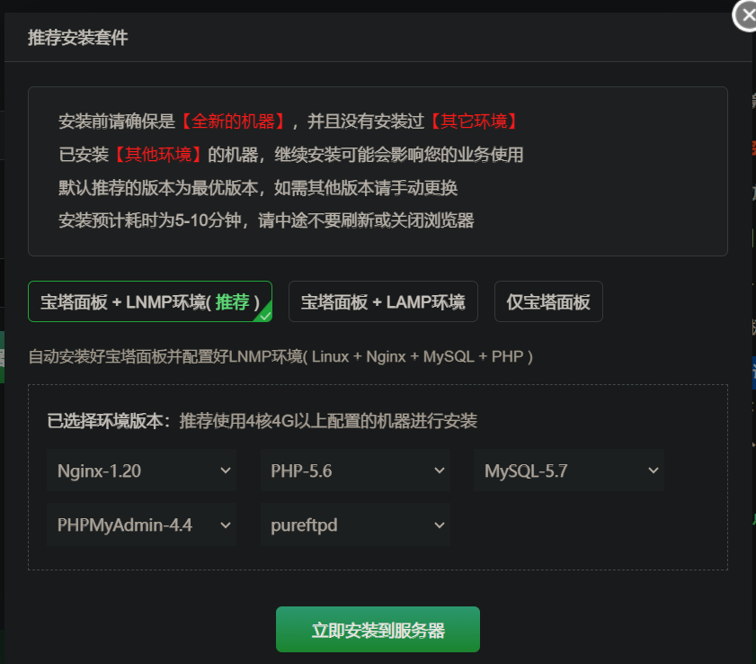
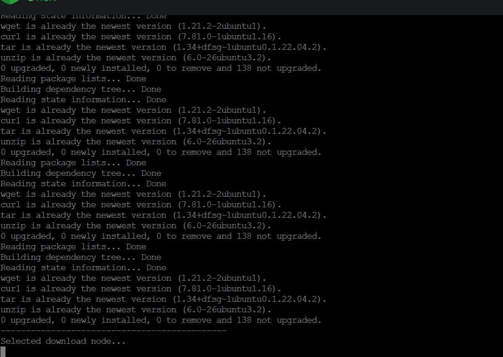
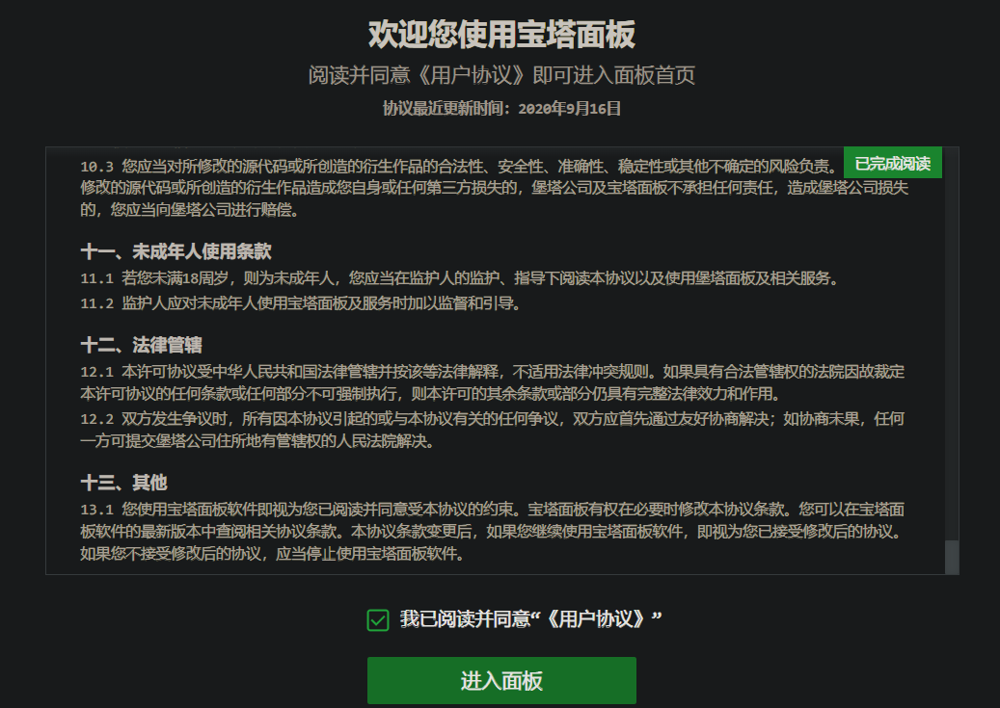
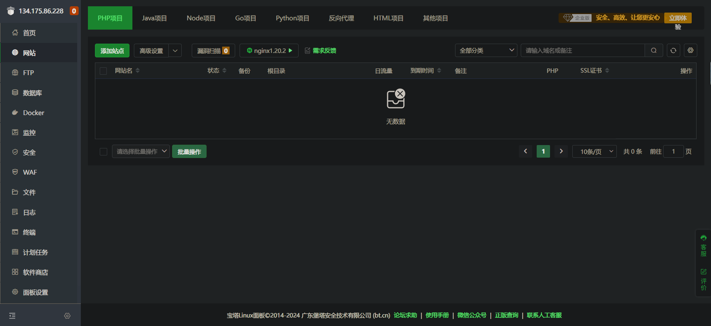

**叠甲：以下文章主要是依靠我的实际编码学习中总结出来的经验之谈，求逻辑自洽，不能百分百保证正确，有错误、未定义、不合适的内容请尽情指出！**

[TOC]

>   概要：...

>   资料：...

---

# 1.环境准备

# 2.部署过程

https://www.bt.cn/new/index.html

这里举例一个 `java+springboot+react` 项目的部署，使用宝塔部署基本都是 `java` 类项目，因为宝塔对这方面的支持比较友好。

---

>   结语：...

