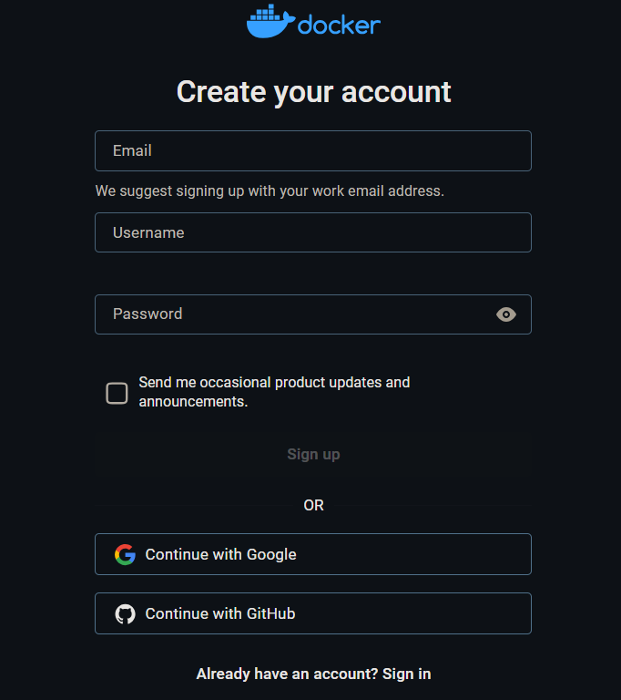

<style>
.heimu {
    position: relative; /* 使伪元素相对于其父元素定位 */
    display: inline-block; /* 使元素内容包裹 */
    color: transparent; /* 隐藏文字颜色 */
    text-decoration: none; /* 去掉链接下划线 */
}
.heimu:: before {
    content: ''; /* 生成一个空内容伪元素 */
    position: absolute; /* 绝对定位 */
    top: 0;
    left: 0;
    width: 100%;
    height: 100%;
    background-color: #F5F5F5; /* 白色遮盖 */
    z-index: 1; /* 确保覆盖文字 */
}
.heimu: hover:: before {
    background-color: transparent; /* 鼠标悬浮时移除黑色遮盖 */
}
.heimu: hover {
    color: white ! important; /* 鼠标悬浮时显示白色文字 */
    text-shadow: none; /* 去掉文本阴影 */
}
</style>

**如果本系列文章对您有帮助，可以 [star 一下我的 limou-learn-note](https://github.com/xiaogithubooo/LimouLearnNote)，求求惹(๑＞ ＜)☆♡~**

**叠甲：以下文章主要是依靠我的实际编码学习中总结出来的经验之谈，求逻辑自洽，不能百分百保证正确，有错误、未定义、不合适的内容请尽情指出！**

[TOC]

>   概要：

>   资料：

---

# 1.Docker 的历史

容器技术的快速发展改变了现代软件开发和部署的方式，但是这种技术并不新颖，从很久开始就发展起来了。

## 1.1.监狱时期

1.   早期的贝尔实验室发明了 `chroot`，主要是为了避免在一个系统软件编译和安装完成后，需要重写配置环境的情况。因此就考虑能否创建出一个隔离环境，专门用于构建和搭建测试环境，进而得到了一个把进行文件系统隔离的早期容器技术。

     `chroot` 系统调用可以将进程和子进程的根目录更改为文件系统中的新位置（而不是系统的根目录），隔离之后该进程就无法访问外面的文件，如同一个监狱一样（`Chroot jail`），后续只需要把测试信息放在 `Jail` 中就可以完成测试了。

     ```cpp
     // 演示关于 chroot() 的使用
     #include <unistd.h>
     #include <stdio.h>
     #include <stdlib.h>
     
     int main() {
         const char *new_root = "/path/to/new/root";
     
         // 切换根目录
         if (chroot(new_root) != 0) {
             perror("chroot failed");
             return 1;
         }
     
         // 切换当前工作目录到新根目录
         if (chdir("/") != 0) {
             perror("chdir failed");
             return 1;
         }
     
         // 在新的根目录下执行命令
         printf("Now in chrooted environment\n");
     
         // 例如执行一个命令，这里使用 system 函数
         system("/bin/sh");
     
         return 0;
     }
     
     ```

2.   到了后来的 `FreeBSD Jail` 让每一个 `Jail` 成为在主机上运行的虚拟环境，有自己的文件管理、进程管理、用户管理，甚至还可以为每个虚拟环境分配一个 `ip` 地址，使得网络空间也被隔离开来，本质也是一种监狱机制。

3.   后面还退出了一种叫 `Linux VServer` 的基于内核的虚拟化技术，可以在单个 `Linux` 内核实例上创建多个独立的虚拟环境（称为 **安全上下文** 或 **虚拟服务器**）。这些虚拟环境共享相同的内核，但它们在用户空间中是隔离的，每个环境可以有自己的文件系统、网络接口和进程空间。如果您想尝试这种技术，可以安装 `VServer` 试一试，这里举一个 `Ubuntu` 的大概伪例子。

     (1)首先您需要一个支持 `VServer` 的内核以及相关的用户空间工具, 这通常需要从源代码编译或从特定的包管理器安装，也就是 `sudo apt-get install linux-image-vserver vserver-debiantools`

     (2)然后创建新虚拟服务器, 使用 `vserver` 工具来创建和管理虚拟服务器。创建一个新的虚拟服务器实例，并指定其根文件系统 `sudo vserver <vserver_name> build...`

     (3)使用 `sudo vserver <vserver_name> start` 启动虚拟服务器

     (4)使用 `sudo vserver <vserver_name> enter` 命令进入虚拟服务器的上下文环境

     (5)管理虚拟服务器...

4.   `Solaris Containers` 软件公测，结合系统资源控制和区域进行了隔离，增加了快照和克隆功能，但是没有太大的发展（也没有那么强需求的场景），依旧是以 `Jail` 模式为核心

## 1.2.云计算时期

云时代是 `Google` 率先提出的概念，进而发生了各种云厂商，现代的云已经变成了强需求，变成和水电一样的基础设施。云的存在使得个人或企业无需操心大量数据的处理带来的高资源消耗，用户只需要向云服务厂商花费较低的钱，就可以得到高回报的云资源。云的存在使得隔离技术变成核心的诉求。

`Google` 推出 `Process Containers/Control Groups` 被合并到 `Linux2.6.24` 版本中，旨在限制、统计、隔离一组进程的资源使用（这里的资源包括 `CPU, 内存, 磁盘IO, 网络...`）。

-   此时控制和隔离技术都发展起来了，顺势就发展起了 `LXC` 这个比较完整的 `Linxu` 容器管理技术，其内部使用 `Control Groups`（可以控制一个进程组的资源限制和资源管理）和 `Linux` 命名空间 `namespace` 来实现（处于不同命名空间的进程组在使用资源的时候，只能感受到自己的资源），可以在单个 `Linux` 上运行，无需任何补丁。
-   而后推出的 `GAE(Goolge App Engine)` 则首次把开发平台当作一种服务来实现，采用云计算技术，跨越多个服务器和数据中心来虚拟化引用程序。而 `GAE` 内部使用了 `Borg` 来对容器进行编排和调度

因此早期的 `LXC` 和 `Borg` 其实就相当于最早的 `Docker` 和 `k8s`，前者是容器技术，后者是编排技术，本文我们重点提及 `Docker` 及其相关的技术，关于编排技术我们有机会再谈及。

## 1.3.云原生时期

容器技术比较完善了，但是容器技术只是解决了容器化和分发问题，没有解决但是如何让软件自动部署、自动更新、自动发布、自动回滚、监控、镜像部署等问题，道理云原生时代时，特别强调微服务化、容器化、持续交付。

云原生和传统云计算之间有一些显著的区别，以下是它们的主要对比：

1.   **架构设计** 云原生基于微服务架构，应用被拆分成多个独立的、自治的服务，每个服务负责特定的功能。这种设计使得应用程序更易于扩展、维护和更新；传统云通常依赖于单体架构，即整个应用作为一个整体进行部署和管理。这种架构可能导致单点故障，并且难以进行独立的扩展和维护。
2.   **容器化与虚拟化** 云原生广泛使用容器（如 `Docker`）来打包和部署应用。容器提供了应用的环境隔离，并且支持高效的资源利用和快速的部署。主要依赖虚拟机来部署应用。虚拟机提供了完整的操作系统虚拟化，虽然隔离性较好，但启动速度慢，资源利用率不如容器高效。
3.   **持续集成与持续交付(CI/CD)** 云原生强调持续集成和持续交付的实践，通过自动化工具和管道来实现快速的代码提交、测试和部署，确保高频率的交付和快速反馈；传统云可能使用较为传统的部署方式，手动干预较多，更新和发布的周期较长，自动化程度较低。
4.   **编排与管理** 云原生使用动态编排工具如 Kubernetes 来自动管理容器的部署、扩展、负载均衡和故障恢复。这种工具能够高效地管理复杂的分布式应用；传统云通常使用手动的虚拟机管理和配置工具，自动化程度低，管理复杂度高。
5.   **开发与运维** 云原生强调开发（`Dev`）和运维（`Ops`）的紧密结合（`DevOps`），通过自动化工具和实践实现高效的开发和运营；传统云开发和运维可能分开管理，缺乏一体化的自动化工具，导致部署和运维过程较为复杂和耗时。
6.   **扩展与弹性** 云原生支持弹性扩展，可以根据需求动态增加或减少资源。微服务和容器化使得应用可以轻松地扩展和缩减；传统云扩展通常依赖于虚拟机的增减，可能需要手动干预，并且扩展和缩减的速度较慢。
7.   **依赖管理** 云原生使用服务发现、负载均衡和配置管理等机制来处理服务间的依赖关系和通信；传统云可能依赖于固定的 `IP` 地址和手动配置，处理服务间的依赖和通信更加复杂和不灵活。

# 2.Docker 是什么

目前最流行的容器化技术是 `Docker`，最流行的容器管理服务是 `Kubernetes(K8s)`，应用/服务可以打包为 `Docker` 镜像，通过 `K8s` 来动态分发和部署镜像。`Docker` 镜像可理解为一个刚好能运行应用/服务的最小操作系统，内部存放应用/服务的运行代码。

运行环境根据实际的需要提取设置好后，把整个“小操作系统”打包为一个镜像后，就可以分发到需要部署相关服务的机器上，直接启动 `Docker` 镜像就可以把服务运行起来，使服务的部署和运维变得非常简单。

`Docker` 不仅仅是解决了容器化问题，还直接给云厂商提供了解决方案。

# 3.Docker 的安装

下面演示在 `Ubuntu20.04.4 LTS` 下关于 `Docker` 换阿里源的安装，<span class="heimu" title="你知道的太多了"> 呵，那堵墙就是个 sb 玩意 </span>

```sh
# Ubuntu20.04.4 LTS 安装 Docker
# 更新包管理器并且安装必要的依赖包
$ sudo apt-get update && sudo apt-get install \
apt-transport-https \
ca-certificates \
curl \
gnupg \
lsb-release

# 添加 Docker 的 GPG 密钥
$ curl -fsSL https://mirrors.aliyun.com/docker-ce/linux/ubuntu/gpg | sudo gpg --dearmor -o /usr/share/keyrings/docker-archive-keyring.gpg
# 如果您可以使用官方源: curl -fsSL https://download.docker.com/linux/ubuntu/gpg | sudo gpg --dearmor -o /usr/share/keyrings/docker-archive-keyring.gpg

# 添加 Docker 软件源
echo \
"deb [arch=amd64 signed-by=/usr/share/keyrings/docker-archive-keyring.gpg] https://mirrors.aliyun.com/docker-ce/linux/ubuntu \
$(lsb_release -cs) stable" | sudo tee /etc/apt/sources.list.d/docker.list > /dev/null
# 如果您可以使用官方源:
# echo \
# "deb [arch=amd64 signed-by=/usr/share/keyrings/docker-archive-keyring.gpg] https://download.docker.com/linux/ubuntu \
# $(lsb_release -cs) stable" | sudo tee /etc/apt/sources.list.d/docker.list > /dev/null

# 更新包管理器并且开始安装 Docker
sudo apt-get update && sudo apt-get install docker-ce docker-ce-cli containerd.io docker-compose-plugin -y

# 验证 Docker 安装版本
docker --version
Docker version 27.1.1, build 6312585
```

好了好了，先到此为止，我们不再深入怎么使用 `Docker` 了，我们先探索以下关于 `Docker` 的原理再来谈及怎么使用的问题。

# 4.Docker 的原理

## 4.1.虚拟化容器化原理

-   物理机：真实的计算机
-   虚拟化：从物理机中抽象出来的多台逻辑计算机/虚拟机，每台虚拟机都可以运行不同的操作系统，这些操作系统运行在宿主机器的原生操作系统上，依赖于原生操作系统
-   容器化：又叫“操作系统层虚拟化”，可以将操作系统内核抽象为多个逻辑内核（虚拟内核和虚拟内核之前有可能是不一样的），对于每个实例的拥有者来说，有点像进程地址空间一样，会误以为内核专属于自己，而 `docker` 目前就是容器技术的事实标准（容器技术需要两个基础，一个是通过命名空间控制资源视图，一个是通过控制组限制运行资源）


挑重点来说的话就是：

-   虚拟机伪造的是硬件物理接口，进而实现在一个操作系统上加载别的操作系统的源代码
-   而容器伪造的是操作系统接口，进而实现在一个操作系统上模拟其他操作系统系统调用

>   补充：我们前面提到的虚拟机的实现虚拟机监视器作为宿主机器的软件被调度，而其实也有直接运行在物理机硬件上的虚拟机监视器软件，我们之前使用的 `Linxu` 虚拟机软件 `Vmware Workstation` 就属于前者，而 `Vmware ESX` 属于后者。

>   补充：为什么需要虚拟技术或容器技术呢？它们都主要是为了方便以下一些场景：
>
>   -   资源细分化利用率高
>   -   环境标准化保证运行、开发、测试环境一致
>   -   资源弹性伸缩
>   -   差异化环境，可以使得不同项目满足不同的系统环境
>   -   避开不安全软件对整个物理机的影响，也就是沙箱安全

而一旦提及到容器化或 `docker`，就不得不提及 `LXC`，而 `LXC` 底层使用了两种非常重要的技术，一个是命名空间技术，一个是控制组技术。

## 4.2.命名空间技术原理

命名空间技术 您可以了解下 `unshare` 指令或接口的使用，这个指令您会使用就明白什么是命名空间了。`unshare` 指令主要就是为了不共享命名空间而服务的，语法格式为 `unshare [options] program [arguments]`，其底层其实也有配套的系统接口。

-   `[options]` 如下
    -   `-i， --ipc` 不共享 `IPC(进程通信空间)`
    -   `-m, --mount` 不共享 `MOUNT(挂载空间)`
    -   `-n. --net` 不共享 `NET(网络空间)`
    -   `-p, --pid` 不共享 `PID(进程空间)`
    -   `-u, --uts` 不共享 `UTS(UNIX 时间共享空间)`
    -   `-U, --user` 不共享 `USER(用户空间)`

-   `program` 可以是任意程序

-   `[arguments]` 如下
    -   `--fork` 执行 `unshare` 的进程会 `fork()` 一个新子进程，在子进程中执行 `unshare` 传入的参数，这样子进程内部执行的 `unshare` 创建的孙进程在某些情况下（例如创建进程空间不共享的命名空间）就不会因为没有父进程而创建异常
    -   `--mount-proc` 执行子进程前，将 `/pros` 优先挂载过去，就不会导致命名空间看到同一个 `/pros` 进程目录（例如创建进程空间不共享的命名空间，如果看到同一个进程目录就没有意义了）


使用不同的 `[options]` 可以进入不同的命名空间，如果启动的是 `/bin/bash` 程序，则可以使用 `exit` 退出命名空间。

```shell
# 使用 unshare
# UTS 隔离
$ sudo unshare -u /bin/bash # 此时就会有一个子进程 /bin/bash 被创建, 运行在 UTX 不共享的命名空间中
root@bash:/$ pwd
/
root@bash:/$ exit
$ exit  

# PID 隔离
$ sudo unshare -p /bin/bash
bash: fork: Cannot allocate memory # 原因是这里的 /bin/bash 虽然是 unshare 的子进程, 但是由于此时进程 ID 和原系统进行了分离, 因此需要创建一个全新的进程, 否则 /bin/bash 就没有父进程无法被创建出来, 导致很多指令无法使用
root@bash:/$ exit # 所以只能退出当前 bash 然后重新想办法创建命名空间
exit

$ sudo unshare -p --fork /bin/bash # 这种方式就可以避免上述的情况
root@bash:/$ ps -ef # 但这里有一个新问题, 为什么 ps -ef 的结果和没有获取命名空间之前是一样的呢? 就是因为 /pros 目录没有提前做挂载而被子进程继承了...
$ exit

$ sudo unshare -p --fork --mount-proc /bin/bash # 此时就可以看到 pid 进行了隔离
root@bash:/$ ps -ef
UID          PID    PPID  C STIME TTY          TIME CMD
root           1       0  0 23:02 pts/2    00:00:00 /bin/bash
root           7       1  0 23:02 pts/2    00:00:00 ps -ef
$ exit

# MOUNT 隔离
sudo unshare --mount --fork /bin/bash
root@bash:/$ dd if=/dev/zero of=data.img bs=8k count=10240
10240+0 records in
10240+0 records out
83886080 bytes (84 MB, 80 MiB) copied, 0.125023 s, 671 MB/s

root@bash:/$ mkfs -t ext4 ./data.img 
mke2fs 1.46.5 (30-Dec-2021)
Discarding device blocks: done                            
Creating filesystem with 20480 4k blocks and 20480 inodes

Allocating group tables: done                            
Writing inode tables: done                            
Creating journal (1024 blocks): done
Writing superblocks and filesystem accounting information: done

root@bash:/$ mkdir ./data && mount -t ext4 ./data.img ./data # 这个挂载点在外部是无法被看见的
root@bash:/$ ls
data  data.img lost+found

root@bash:/$ cd ./data
root@bash:/$ vim main.cc
root@bash:/$
root@bash:/$ ls
lost+found  main.cc

root@bash:/$ exit
exit

root@bash:/$ ls 
data  data.img  limou.txt  lost+found

root@bash:/$ cd data

root@bash:/$ ll
total 0
```

>   补充：不过其实还挺奇葩的，叫命名空间却没有所谓的命名出现。不过 `unshare` 能得到不共享的命名空间，就说明原本的进程门在某些东西上是共享的，这个共享是偏向系统层次的，因为进程说到底都运行在同一个操作系统上，因此共享某一些东西其实也无可厚非。如果只从进程地址空间空间来看的活，确实是相互独立，因此是共享还是独立要根据视角而定，这里说的共享主要有以下资源。
>
>   -   **MOUNT-文件系统挂载共享** 在没有使用 `MOUNT` 命名空间的情况下，系统中的所有进程共享相同的文件系统挂载点和文件系统视图。即所有进程看到的文件系统结构是相同的，都是从根目录开始的目录树。使用 `MOUNT` 命名空间后，每个命名空间可以有自己独立的文件系统挂载点。
>   -   **NET-网络共享** 在没有网络命名空间时，所有进程共享相同的网络接口、`IP` 地址、路由表。使用 `NET` 命名空间后，网络接口和网络配置可以在不同的命名空间中独立存在。
>   -   **PID-进程 ID 共享** 没有使用 `PID` 命名空间时，系统中的所有进程都有一个全局唯一的 `PID`。使用 `PID` 命名空间后，每个命名空间内的进程可以有自己的 `PID` 视图，这样同一个 `PID` 在不同的命名空间中可能指代不同的进程。
>   -   **IPC-进程间通信共享** 在没有 `IPC` 命名空间的情况下，所有进程共享同样的 `IPC` 资源，如消息队列、信号量和共享内存。使用 `IPC` 命名空间后，`IPC` 资源被隔离，不同命名空间的进程无法相互访问 `IPC` 资源。
>   -   **UTS-主机名共享** 在没有 `UTS` 命名空间的情况下，系统中的所有进程共享相同的主机名和域名。使用 `UTS` 命名空间后，每个命名空间可以设置独立的主机名和域名。
>   -   **USER-用户共享** 在没有 `USER` 命名空间的情况下，用户 `ID` 和组 `ID` 是全局唯一的。使用 `USER` 命名空间后，用户和组 `ID` 可以在不同的命名空间中映射为不同的值，从而实现更细粒度的权限控制。

## 4.3.控制组技术的原理

控制组技术则需要通过 `mount` 指令来实现，不过您需要先使用 `cat /proc/filesystems | grep cgroup` 查看您的系统是否支持 `cgroup`，如果是较老版本可能没有显示，或者显示 `nodev cgroup`，较新的版本还具有 `nodev cgroup2`。并且可以使用 `cat /proc/cgroups` 查看可以控制的资源列表（这里面支持的每一种资源也可以叫子系统或者资源控制组，每个子系统代表了一种特定的资源管理功能）。

```shell
# 检查 cgroups 的版本
$ cat /proc/cgroups
#subsys_name    hierarchy       num_cgroups     enabled
cpuset  0       118     1
cpu     0       118     1
cpuacct 0       118     1
blkio   0       118     1
memory  0       118     1
devices 0       118     1
freezer 0       118     1
net_cls 0       118     1
perf_event      0       118     1
net_prio        0       118     1
hugetlb 0       118     1
pids    0       118     1
rdma    0       118     1
misc    0       118     1
```

我们把应用了某些资源限制的一组进程的集合称为一个控制组，`cgroup` 的资源控制非常有趣，是分层设计的，每个层级可以包含多个子系统，每个子系统可以应用不同的资源限制。

那怎么使用控制组呢？首先您需要明白 `Linux` 提供的控制组 `cgroup/cgroup2` 其实是一种基于文件系统接口的机制，所以也应该当作一种文件系统来对待，既然是文件系统，就可以把对应的文件系统的设备挂载起来，操作系统一般默认挂载到操作系统下的 `/sys/fs/cgroup/` 目录下，不过有可能有的操作系统没有这个行为，您可以自己手动进行挂载。

```shell
# 检查是否有默认的挂载目录
$ mount | grep cgroup # 查看是否有挂载点
cgroup2 on /sys/fs/cgroup type cgroup2 (rw,nosuid,nodev,noexec,relatime,nsdelegate,memory_recursiveprot)

$ ls /sys/fs/cgroup # 检查该目录的存在
aegis                   cgroup.threads         io.cost.qos                    sys-fs-fuse-connections.mount
aegisMonitor            cpu.pressure           io.pressure                    sys-kernel-config.mount
aegisPythonLoder0       cpuset.cpus.effective  io.prio.class                  sys-kernel-debug.mount
cgroup.controllers      cpuset.mems.effective  io.stat                        sys-kernel-tracing.mount
cgroup.max.depth        cpu.stat               memory.numa_stat               system.slice
cgroup.max.descendants  dev-hugepages.mount    memory.pressure                user.slice
cgroup.procs            dev-mqueue.mount       memory.stat
cgroup.stat             init.scope             misc.capacity
cgroup.subtree_control  io.cost.model          proc-sys-fs-binfmt_misc.mount
```

如果不存在这个目录，那就使用这条指令进行手动挂载，不过有个比较重要的问题是，实际上没有一种设备是属于 `cgroup/cgroup2` 这种设备因此实际上我们设备使用 `none` 作为占位符就行，不用把任何文件或设备进行挂载。

```shell
# 手动挂载(如果您的系统已挂载了则无需操作这一步)
sudo mkdir -p /sys/fs/cgroup/ && sudo mount -t cgroup2 none /sys/fs/cgroup
```

然后我们才能开始创建一个控制组，如下进行操作即可。

```shell
# 创建控制组并且配置限制条件
# 创建一个控制组并且打开
sudo mkdir /sys/fs/cgroup/my_group/ && cd /sys/fs/cgroup/my_group/

# 了解在控制组目录下的配置文件(以下文件您可以在通过 tree | grep "..." 的形式查看系统内其他的控制组是怎么设置的, 另外不同版本的 cgroup 有可能文件名后缀不同, 这里演示的是 cgroup2 的)
	# /sys/fs/cgroup/<controller>/cgroup.procs: 这个配置文件用于列出属于该控制组的所有进程 pid, 您可以将进程 pid 写入到这个文件中来将进程加入到该控制组中, 并且使用换行区分不同的进程 pid
	# /sys/fs/cgroup/<controller>/memory.max: 设置控制组的最大内存使用限制, 写入 -1 则代表无限制, 若写入其他正整数值 num 则代表不得超过 num byte
	# /sys/fs/cgroup/<controller>/cpu.max: 设置控制组的 CPU 使用限制, 写入 <max> <period>, 其中 <max> 表示允许的最大 CPU 时间(以微秒为单位), <period> 表示计算 CPU 使用时间的周期(以微秒为单位), 整体代表每 period 周期内最多可以运行的 max 时间长度的 CPU 时间。特殊的, 如果写入 max 100000 则代表没有限制
	# /sys/fs/cgroup/<controller>/pids.max: 设置控制组中可以创建的最大进程数, 直接写入一个正整数值即可。特殊的, 如果写入 max 则代表没有限制
	# /sys/fs/cgroup/<controller>/io.max: 设置 IO 设备的限制，例如读写速率限制, 写入 <READ_RATE> <WRITE_RATE>, 分别指读和写的速率限制(以字节每秒为单位)。特殊的, max max 代表对读写毫无限制
	# /sys/fs/cgroup/<controller>/cgroup.subtree_control: 在 cgroup 中控制启用或禁用某个子系统, 也就是随时启用和禁用某种资源限制, 书写格式例如 +memory +cpu 代表启用 memory 和 cpu 子系统, -memory 代表禁用 memory 子系统
	# ...
$ ls -al # 可以看到我们仅仅是创建了一个 my_group 目录, 内部却自动创建了很多上述描述的配置文件, 如果您发现文件的名字或后缀有些不一样, 可能就是因为内核版本不同带来的 cgroup 版本不同带来的问题
$ ls
cgroup.controllers      cgroup.type            cpu.stat         memory.current       memory.stat
cgroup.events           cpu.idle               cpu.uclamp.max   memory.events        memory.swap.current
cgroup.freeze           cpu.max                cpu.uclamp.min   memory.events.local  memory.swap.events
cgroup.kill             cpu.max.burst          cpu.weight       memory.high          memory.swap.high
cgroup.max.depth        cpu.pressure           cpu.weight.nice  memory.low           memory.swap.max
cgroup.max.descendants  cpuset.cpus            io.max           memory.max           pids.current
cgroup.procs            cpuset.cpus.effective  io.pressure      memory.min           pids.events
cgroup.stat             cpuset.cpus.partition  io.prio.class    memory.numa_stat     pids.max
cgroup.subtree_control  cpuset.mems            io.stat          memory.oom.group
cgroup.threads          cpuset.mems.effective  io.weight        memory.pressure

# 不过这里我不测试所有的情况, 使用 stress 测压指令来简单测试内存控制和 CPU 控制的情况
$ echo "20971520" > memory.max # 配置内存限制为 20 MB
$ echo "30000 100000" > cpu.max # 配置 CPU 使用率限制为 30%

# 启用内存子系统, 让内存限制生效(同时关闭 CPU 限制, 避免影响)
$ echo "+memory -cpu" > cgroup.subtree_control

# 在启动一个测压进程进行测试
$ stress -m 1 --vm-bytes 50M &

# 查看 stress 的 pid 具体值
$ ps -aux | grep stress 
root        9503  0.0  0.0   3708  1400 pts/1    S    14:06   0:00 stress -m 1 --vm-bytes 50M
root        9505 80.7  0.1  54912  3804 pts/1    R    14:06   0:03 stress -m 1 --vm-bytes 50M
root        9515  0.0  0.0   6480  2308 pts/1    S+   14:06   0:00 grep --color=auto stress

# 添加 pid 到控制组中的管理文件中(两个都添加进去)
$ echo "9503\n9505" > cgroup.procs

# 再次观察可以发现测压进程消失了...
$ ps -aux | grep stress

# 启用 CPU 子系统, 让 CPU 限制生效(同时关闭内存限制, 避免影响)
$ echo "-memory +cpu" > /sys/fs/cgroup/my_cgroup/cgroup.subtree_control

# 在后台启动一个测压进程进行测试
$ stress -c 1 &

# 查询测压进程的 PID 并且添加到测试组管理中
$ ps -aux | grep stress # 查看 stress 的 pid 具体值
root        2332  0.0  0.0   3708  1400 pts/1    S    14:06   0:00 stress -m 1 --vm-bytes 50M
root        2334 80.7  0.1  54912  3804 pts/1    R    14:06   0:03 stress -m 1 --vm-bytes 50M
root        1101  0.0  0.0   6480  2308 pts/1    S+   14:06   0:00 grep --color=auto stress

# 添加 pid 到控制组中的管理文件中
$ echo "2332\2334" > /sys/fs/cgroup/my_cgroup/cgroup.procs

# 再次观察可以发现测压进程消失了...
$ ps -aux | grep stress
```

>   补充：上述过程我还是没有试验出来，很离谱 `Linux` 哪怕是我使用 `root` 也无法写入，以后换 `cgroup v1` 试试，待补充...

>   吐槽：有时会看到把两者都当作虚拟技术的情况，这种应该是认为两者实际上都是伪装术，只不过伪装的颗粒度不同的，因此统称为虚拟技术确实是可以的。另外还有一种模拟函数库的虚拟技术，最有名的就是 `Java` 的 `JVM` 虚拟机，模拟的就是函数库的接口，也就可以做到所谓的“一处运行，到处跑”。

## 4.3.LXC 的底层原理

`Linux Containers` 简称为 `LXC`，实际上是依赖于 `Linux` 的命名空间、控制组等技术来构成的一个软件工具，可以认为 `Docker` 是其增强版本的软件，因此学习 `LXC` 可以一定程度迁移到 `Docker` 中。`LXC` 创建容器的过程要比直接调用底层的接口要来的方便，在 `Ubuntu` 中可以通过 `sudo apt-get install lxc` 的方式安装并且使用。

```shell
# 安装 lxc 并且检查和查看一些配置
# 安装并且检查是否运行中
$ sudo apt-get install lxc -y
$ systemctl status lxc
● lxc.service - LXC Container Initialization and Autoboot Code
     Loaded: loaded (/lib/systemd/system/lxc.service; enabled; vendor preset: enabled)
     Active: active (exited) since Mon 2024-08-12 16:15:32 CST; 2min 38s ago
       Docs: man:lxc-autostart
             man:lxc
    Process: 14503 ExecStartPre=/usr/lib/x86_64-linux-gnu/lxc/lxc-apparmor-load (code=exited, status=0/SUCCES>
    Process: 14508 ExecStart=/usr/lib/x86_64-linux-gnu/lxc/lxc-containers start (code=exited, status=0/SUCCES>
   Main PID: 14508 (code=exited, status=0/SUCCESS)
        CPU: 14ms

# 检查 lxc 当前的配置
$ lxc-checkconfig
LXC version 5.0.0
Kernel configuration not found at /proc/config.gz; searching...
Kernel configuration found at /boot/config-5.15.0-113-generic

--- Namespaces ---
Namespaces: enabled # 命名空间功能已启用, 支持容器隔离
Utsname namespace: enabled # 主机名空间已启用, 容器可以有独立的主机名
Ipc namespace: enabled # IPC 命名空间已启用, 容器可以有独立的进程间通信
Pid namespace: enabled # PID 命名空间已启用, 容器可以有独立的进程 ID
User namespace: enabled # 用户命名空间已启用, 容器可以有独立的用户 ID 映射
Network namespace: enabled # 网络命名空间已启用, 容器可以有独立的网络堆栈

--- Control groups ---
Cgroups: enabled # 控制组功能已启用, 支持资源管理和限制
Cgroup namespace: enabled # Cgroup 命名空间已启用, 支持 cgroup 命名空间
Cgroup v1 mount points: 
Cgroup v2 mount points: 
/sys/fs/cgroup # Cgroup v2 的挂载点

Cgroup v1 systemd controller: missing # 缺失, 系统d的 cgroup v1 控制器未启用
Cgroup v1 freezer controller: missin # 缺失, cgroup v1 冻结控制器未启用
Cgroup ns_cgroup: required # 需要, 容器需要 cgroup 名称空间
Cgroup device: enabled # 设备控制器已启用, 支持设备控制
Cgroup sched: enabled # 调度器控制器已启用, 支持调度器控制
Cgroup cpu account: enabled # CPU 资源计量控制已启用, 支持 CPU 资源计量
Cgroup memory controller: enabled # 内存控制器已启用, 支持内存控制
Cgroup cpuset: enabled # CPU 集合控制已启用, 支持 CPU 集合控制

--- Misc ---
Veth pair device: enabled, not loaded # 虚拟以太网对设备支持已启用, 但未加载
Macvlan: enabled, not loaded # MAC 虚拟 LAN 支持已启用, 但未加载
Vlan: enabled, not loaded # 虚拟 LAN 支持已启用, 但未加载
Bridges: enabled, loaded # 桥接支持已启用并加载
Advanced netfilter: enabled, loaded # 高级网络过滤支持已启用并加载
CONFIG_IP_NF_TARGET_MASQUERADE: enabled, not loaded # IP 伪装支持已启用, 但未加载
CONFIG_IP6_NF_TARGET_MASQUERADE: enabled, not loaded # IPv6 IP 伪装支持已启用, 但未加载
CONFIG_NETFILTER_XT_TARGET_CHECKSUM: enabled, not loaded # 网络过滤校验和支持已启用, 但未加载
CONFIG_NETFILTER_XT_MATCH_COMMENT: enabled, not loaded # 网络过滤注释支持已启用, 但未加载
FUSE (for use with lxcfs): enabled, not loaded # FUSE 支持已启用, 但未加载

--- Checkpoint/Restore ---
checkpoint restore: enable# 检查点和恢复功能已启用, 支持容器检查点和恢复
CONFIG_FHANDLE: enabled # 文件句柄支持已启用
CONFIG_EVENTFD: enabled # 事件支持已启用
CONFIG_EPOLL: enabled # 事件轮询支持已启用
CONFIG_UNIX_DIAG: enabled # UNIX 诊断支持已启用
CONFIG_INET_DIAG: enabled # IPv4 诊断支持已启用
CONFIG_PACKET_DIAG: enabled # 数据包诊断支持已启用
CONFIG_NETLINK_DIAG: enabled # 网络链接诊断支持已启用
File capabilities: 

Note : Before booting a new kernel, you can check its configuration
usage : CONFIG=/path/to/config /usr/bin/lxc-checkconfig # 指定要检查的内核配置文件路径, 或运行 lxc-checkconfig 工具

# 查看 lxc 提供的容器模板(目前有点少...后面再来下载)
$ ls -al /usr/share/lxc/templates
total 56
drwxr-xr-x 2 root root  4096 Aug 12 16:15 .
drwxr-xr-x 6 root root  4096 Aug 12 16:15 ..
-rwxr-xr-x 1 root root  8601 Jan 25  2024 lxc-busybox
-rwxr-xr-x 1 root root 14497 Jan 25  2024 lxc-download
-rwxr-xr-x 1 root root  7178 Jan 25  2024 lxc-local
-rwxr-xr-x 1 root root 10737 Jan 25  2024 lxc-oci
```

`LXC` 本质上是 `Linux` 内核容器功能的一个用户空间接口，因此 `lxc` 本身是运行在用户空间的，它将应用系统打包为一个软件容器，内部可以包含应用软件本身的代码，以及 **所需要的操作系统核心和库**，通过统一的命名空间和共享 `API` 来分配不同软件容器的可用资源，进而创建出用户级的独立沙箱环境，使得 `Linux` 更加快捷创建和管理应用容器。


但是，`LXC` 的弱点也是明显的：

-   **隔离性有限** 相比虚拟机，`LXC` 的隔离性较弱，因为容器共享一台主机内核
-   **数据迁移困** 数据从一个容器中迁移到另一个容器中可能涉及复杂的数据和配置迁移步骤
-   **内核依赖高** 依赖于主机内核的特性，内核的变化可能影响容器的运行，并且 `LXC` 几乎只支持 `linux-like` 的操作系统
-   **功能限制多** 与完整的虚拟机相比，某些功能和配置选项可能受限

```shell
# 简单使用 lxc 创建容器
# 首先我们需要安装 LXC 模板, 我们上面显示出来的模板目录中的内容是比较少的
sudo apt-get install lxc-templates -y

# 查看目前下载好的模板
ls -al /usr/share/lxc/templates
total 528
-rwxr-xr-x 1 root root 13630 Mar 12  2021 lxc-alpine         # Alpine Linux
-rwxr-xr-x 1 root root 14170 Mar 12  2021 lxc-altlinux       # ALT Linux
-rwxr-xr-x 1 root root 11214 Mar 12  2021 lxc-archlinux      # Arch Linux
-rwxr-xr-x 1 root root  8601 Jan 25  2024 lxc-busybox        # BusyBox
-rwxr-xr-x 1 root root 30598 Mar 12  2021 lxc-centos         # CentOS
-rwxr-xr-x 1 root root 10368 Mar 12  2021 lxc-cirros         # Cirros
-rwxr-xr-x 1 root root 26579 Mar 12  2021 lxc-debian         # Debian
-rwxr-xr-x 1 root root 14497 Jan 25  2024 lxc-download       # Download Template
-rwxr-xr-x 1 root root 41919 Mar 12  2021 lxc-fedora         # Fedora
-rwxr-xr-x 1 root root 49755 Mar 12  2021 lxc-fedora-legacy  # Fedora Legacy
-rwxr-xr-x 1 root root 28398 Mar 12  2021 lxc-gentoo         # Gentoo
-rwxr-xr-x 1 root root  7178 Jan 25  2024 lxc-local          # Local Template
-rwxr-xr-x 1 root root 10737 Jan 25  2024 lxc-oci            # OCI (Open Container Initiative) Template
-rwxr-xr-x 1 root root 13890 Mar 12  2021 lxc-openmandriva   # OpenMandriva
-rwxr-xr-x 1 root root 16701 Mar 12  2021 lxc-opensuse       # openSUSE
-rwxr-xr-x 1 root root 41585 Mar 12  2021 lxc-oracle         # Oracle Linux
-rwxr-xr-x 1 root root 13865 Mar 12  2021 lxc-plamo          # Plamo Linux
-rwxr-xr-x 1 root root 13086 Mar 12  2021 lxc-pld            # PLD Linux
-rwxr-xr-x 1 root root 14277 Mar 12  2021 lxc-sabayon        # Sabayon Linux
-rwxr-xr-x 1 root root 19148 Mar 12  2021 lxc-slackware      # Slackware
-rwxr-xr-x 1 root root 26656 Mar 12  2021 lxc-sparclinux     # Sparclinux
-rwxr-xr-x 1 root root  6845 Mar 12  2021 lxc-sshd           # SSH Daemon
-rwxr-xr-x 1 root root 26276 Mar 12  2021 lxc-ubuntu         # Ubuntu
-rwxr-xr-x 1 root root 11747 Mar 12  2021 lxc-ubuntu-cloud   # Ubuntu Cloud
-rwxr-xr-x 1 root root  6009 Mar 12  2021 lxc-voidlinux      # Void Linux

$ sudo lxc-create -n my-container -t ubuntu # 格式为 sudo lxc-create -n 创建的容器名字 -t 指定的容器模板
# 繁多的容器初始化信息
##
# The default user is 'ubuntu' with password 'ubuntu'!
# Use the 'sudo' command to run tasks as root in the container.
##
# 上面这里提示的就是默认的用户名为 ubuntu, 密码也是 ubuntu

# 而容器被放到 /var/lib/lxc/<容器名> 这个目录下
$ sudo ls /var/lib/lxc/my-container
config  rootfs # config 是容器的配置文件, rootfs 是容器的根目录, 您可以简单查看一下

# 查看容器的配置文件
$ sudo cat /var/lib/lxc/my-container/config
# Template used to create this container: /usr/share/lxc/templates/lxc-ubuntu
# Parameters passed to the template:
# For additional config options, please look at lxc.container.conf(5)

# Uncomment the following line to support nesting containers:
#lxc.include = /usr/share/lxc/config/nesting.conf
# (Be aware this has security implications)


# Common configuration
lxc.include = /usr/share/lxc/config/ubuntu.common.conf

# Container specific configuration
lxc.rootfs.path = dir:/var/lib/lxc/my-container/rootfs
lxc.uts.name = my-container
lxc.arch = amd64

# Network configuration
lxc.net.0.type = veth
lxc.net.0.link = lxcbr0
lxc.net.0.flags = up
lxc.net.0.hwaddr = 00:16:3e:5d:49:40

# 查看容器的根目录结构
$ sudo ls /var/lib/lxc/my-container/rootfs
bin   dev  home  lib32  libx32  mnt  proc  run   srv  tmp  var
boot  etc  lib   lib64  media   opt  root  sbin  sys  usr

# 查看创建容器的过程中缓存的软件包(当您想另外建一个一样的容器时, 可以省去很多下载时间)
$ sudo ls /var/cache/lxc

# 列出当前所有的容器
$ sudo lxc-ls -f # -f 表示打印常用的信息
NAME         STATE   AUTOSTART GROUPS IPV4 IPV6 UNPRIVILEGED 
my-container STOPPED 0         -      -    -    false

# 查看某个容器当前的状态
sudo lxc-info -n my-container
Name:           my-container
State:          STOPPED # 这里显示目前的容器处于停止状态

# 启动容器然后查看容器的状态(可以看到地址、磁盘挂载信息、目录信息都和宿主机不一样)
$ sudo lxc-start -n my-container
$ sudo lxc-info -n my-container
Name:           my-container
State:          RUNNING
PID:            41456
IP:             10.0.3.227
Link:           vethRyGMCs
 TX bytes:      1.26 KiB
 RX bytes:      1.39 KiB
 Total bytes:   2.66 KiB

# 进入容器中, 像使用一台真正主机一样操作容器
sudo lxc-attach -n my-container -- bash # -- 被视为分隔符, 可以用来分割前面的选项和在容器内部执行的命令
root@my-container:/# ls
bin   dev  home  lib32  libx32  mnt  proc  run   srv  tmp  var
boot  etc  lib   lib64  media   opt  root  sbin  sys  usr

# 退出容器的 bash
root@my-container:/# exit # 和一般的主机一样使用 exit 或者 [ctrl+d] 即可退出容器的 bash
exit

# 在容器外面把命令交给容器去执行
sudo lxc-attach -n my-container --clear-env -- echo "hello limou" # --clear-env 这个选项可先清除容器中当前的环境变量, 仅保留必要的最小环境变量集, 有助于确保在容器中执行的命令不会受到外部环境影响
hello limou

# 停止容器然后查看查看容器的状态
$ sudo lxc-stop -n my-container
$ sudo lxc-info -n my-container
Name:           my-container
State:          STOPPED

# 删除容器
sudo lxc-destroy -n my-container
```

此外还有一些比较轻小的指令，作为 `Linux` 下的快速实验环境还是非常不错的，毕竟容器的根目录树可以任意修改，也不怕系统奔溃。还有其他的指令这里就不再赘述，您可以在网上搜索，或者 [访问 LXC 的官网查询一下](https://linuxcontainers.org/) 即可。

>   补充：不过只有命名空间技术和控制组技术其实还远远不够构成一个 `LXC` 软件，还需要其他的技术，有机会以后待补充...

## 4.4.Docker 本身原理

### 4.4.1.Docker 早期设计

`Docker` 狭义理解来说本身其实不是容器，而是 `LXC` 之类的增强版，是使得容器易用的工具。容器是 `Linux` 中的技术，但是被 `Docker` 这项技术推广并且普及了。事实上 `Docker` 早期就是作为 `LXC` 的二次封装来发行的。

`Docker` 是一个用 `Go` 编写的项目，主要目的是 `Build, ship and run any app, anywhere.(在任何地方构建，发布, 运行任何应用程序)` 使得用户的应用能一次封装，到处运行。

早期的 `Docker` 利用 `LXC` 做容器管理的引擎，但不再像 `LXC` 一样使用模板来安装生成，而是使用镜像技术，把一个操作系统用户程序所需要的接口库提前编排好并整体打包（`build`）为 `.image` 文件。而这些镜像文件会被集中运送（`ship`）到一个仓库中，当需要创建容器时，`Docker` 连接镜像服务器（也就是镜像仓库）来下载匹配的镜像文件，再基于镜像直接调用 `LXC` 的 `lxc-create` 工具启动容器即可（`run`）。

因此就是依靠前面的命名空间技术和控制组技术来达成容器化的目的。

### 4.4.2.Docker 引擎迭代

但是后来的 `Docker` 组件抛弃了 `LXC` 容器管理引擎，先后研发了 `libcontainer, CNCF, RunC(libcontainer其实就是RunC的核心模块)` 目前比较新的 `Docker` 使用的容器管理引擎就是 `RunC`，用户是通过 `containerd` 进行调用的（`containerd` 的作用和 `systemd` 类似，都是守护进行，也是由 `Docker` 官方自己进行维护）。后来，`RunC` 逐渐变成了容器标准，而和 `Google` 的第二次竞争中，`Google` 公司的 `k8s` 打败了 `Docker` 公司的 `Swarm`，成为了

而后来 `Docker` 公司把 `Docker` 的命名交给收费版，原来的 `Docker` 项目改名为 `Moby`，[可以前往 Moby 的官网查看源代码](https://mobyproject.org/)。发展到现在，我们对 `Docker` 主要有两个称呼，`Docker-CE(moby, containerd, runc...)` 和 `Docker-EE(Docker-CE本身, 其他组件和功能)`，前者是开源版本，后者是收费版本，[可以前往 Docker 官网查看](https://www.docker.com/)。

至此，我们就需要开始学习如何使用现代的 `Docker` 了，这里以 `Docker version 27.1.1` 版本作为演示。

### 4.4.3.Docker 镜像原理

`Docker` 镜像的本质是一个只读的文件，内部包含文件系统、源代码、库文件、依赖、工具和一些运行镜像 `Docker` 所需的文件。通过镜像文件可以实例出很多的容器实体（就像一个压缩包）。

镜像文件本质是又多个层构成的，每一个层都是一个文件系统 `Union FS`，合起来就形成一个虚拟文件系统，每一层都有三种权限（只读、读写、写出），不过镜像文件基本都是设置为只读的。

`Docker` 会根据一个 `dockerfile` 来一步步从最低一层开始构建镜像文件，上层的修改会覆盖下层的可见性。

而 `Docker` 项目最大的贡献就是定义了关于镜像文件分层的存储格式，这种分层非常方便共享，减少存储空间占用，提高可维护性。

因此如果之前的镜像文件中在远端仓库中已经存在，则会进行引用而不用推送，加快传输速度。

### 4.4.4.Docker 容器原理

容器其实就是镜像文件的一份实例化，本质就是操作系统的一个进程，容器有 `初建(created), 运行(running), 停止(stopped), 暂停(paused), 删除(deleted)` 五种状态。

不过，只有宿主机看得到各个容器的进程列表、环境变量、网络配置等，每一个容器内部只能知道自己的，而无法知道宿主主机的内容。

不过此时容器在实例的最上面一层添加了一层读写层（也就是容器层），这一层可以被使用容器的用户进行修改，进而影响整个镜像副本。

# 5.Docker 的仓库

## 5.1.常见镜像仓库分类

-   按是否对外开放分类：

    (1)**公有仓库**：像阿里云、`Docker Hub` 等放在公有网络上的仓库，用户无需登录即可下载镜像，供大家访问和使用

    (2)**私有仓库**：不对外开放，通常位于私有网络，只有公司内部人员可以使用

-   按供应商和面向群体分类：

    (1)**Sponsor Registry(赞助)**：第三方提供的仓库，供客户和 `Docker` 社区版用户使用

    (2)**Mirror Registry(镜像)**：第三方提供的仓库，仅限注册用户使用，例如阿里云的镜像仓库需要注册才能访问

    (3)**Vendor Registry(供应商)**：由发布 `Docker` 镜像的供应商提供的仓库，例如 `Google` 和 `Red Hat` 提供的镜像仓库服务

    (4)**Private Registry(私有仓库)**：通过没有防火墙和额外安全层的私有实体提供的仓库，仅供内部使用

实际工作中，开发者一般都是先 `pull` 公共公有仓库和公司私有仓库中的镜像，进行开发，开发结束后再制作为镜像 `push` 到公司私有仓库中，然后反复交给不同团队 `deploy(部署)` 到 `开发环境, 测试环境, 预发布环境, 生产环境` 中，确保运行环境统一。

>   补充：私有仓库部署工具有 `Harbor, Nexus, Docker registry(已停止维护)...` 您可以前往了解一下。

为了方便，我直接是哟个 `Docker Hub` 来存储镜像，这个网站类似 `github`，可以开放或私有镜像存储仓库。

## 5.2.使用官方公有镜像仓库

-   `docker login [-u <用户> -p <密码>]` 登录镜像仓库（这里的用户和密码是指在 `Docker Hub` 上的注册的账号）
-   `docker logout` 登出镜像仓库（登出的默认也是 `Docker Hub` 中的账户）
-   `docker pull <镜像名称:镜像版本>/<镜像名称@>` 默认从 `Docker Hub` 拉取镜像文件，使用 `-a` 则拉取所有镜像，使用 `--disable-content-trust` 则忽略镜像的校验（默认开启）
-   `docker push` 默认从 `Docker Hub` 推送镜像文件，推送的过程中会发生压缩传输，并且不是简单把一个镜像文件直接传输上去，而是一个一个层传送上去，如果遇到远端仓库中已有某个镜像层，就会直接进行引用加快传输提高代码复用
-   `docker search` 查看当前远端存储库 `Docker Hub` 中已有公开的镜像文件

其中，如果是需要登录的镜像地址，就需要 [到 Docker Hub 镜像仓库中创建一个账户](https://hub.docker.com/)，然后才可以开始实践有关登录的指令，如下开始进行账户注册。



注册好并且登录好账户后，我们开始使用指令。

```shell
# 尝试实践登录和登出指令
 # 直接登录
$ docker login
Log in with your Docker ID or email address to push and pull images from Docker Hub. If you don't have a Docker ID, head over to https://hub.docker.com/ to create one.
You can log in with your password or a Personal Access Token (PAT). Using a limited-scope PAT grants better security and is required for organizations using SSO. Learn more at https://docs.docker.com/go/access-tokens/

Username: limou3434
Password: 
WARNING! Your password will be stored unencrypted in /home/ljp/.docker/config.json.
Configure a credential helper to remove this warning. See
https://docs.docker.com/engine/reference/commandline/login/#credential-stores

Login Succeeded

# 退出登录
$ docker logout
Removing login credentials for https://index.docker.io/v1/

# 使用参数一次性登录
$ docker login -u limou3434 -p ******
WARNING! Using --password via the CLI is insecure. Use --password-stdin.
WARNING! Your password will be stored unencrypted in /home/ljp/.docker/config.json.
Configure a credential helper to remove this warning. See
https://docs.docker.com/engine/reference/commandline/login/#credential-stores

Login Succeeded # 不过一般不建议使用这种带参数的

```

```shell
# 尝试拉取镜像文件, 并查看当前已有镜像文件
# 使用版本号拉取镜像文件
$ sudo docker pull nginx:1.23.4
1.23.4: Pulling from library/nginx
f03b40093957: Pull complete 
0972072e0e8a: Pull complete 
a85095acb896: Pull complete 
d24b987aa74e: Pull complete 
6c1a86118ade: Pull complete 
9989f7b33228: Pull complete 
Digest: sha256:f5747a42e3adcb3168049d63278d7251d91185bb5111d2563d58729a5c9179b0
Status: Downloaded newer image for nginx:1.23.4
docker.io/library/nginx:1.23.4

# 使用字符串拉取镜像文件
$ sudo docker pull nginx@sha256:f5747a42e3adcb3168049d63278d7251d91185bb5111d2563d58729a5c9179b0 # 这串字符源于 dockerhub 的 tag 界面中, 下面有给出图解
docker.io/library/nginx@sha256:f5747a42e3adcb3168049d63278d7251d91185bb5111d2563d58729a5c9179b0: Pulling from library/nginx
Digest: sha256:f5747a42e3adcb3168049d63278d7251d91185bb5111d2563d58729a5c9179b0
Status: Image is up to date for nginx@sha256:f5747a42e3adcb3168049d63278d7251d91185bb5111d2563d58729a5c9179b0
docker.io/library/nginx@sha256:f5747a42e3adcb3168049d63278d7251d91185bb5111d2563d58729a5c9179b0

# 查看本地已有的镜像文件
$ docker images
REPOSITORY    TAG       IMAGE ID       CREATED         SIZE
nginx         1.23.4    a7be6198544f   15 months ago   142MB
hello-world   latest    d2c94e258dcb   16 months ago   13.3kB
```


然后我们开始在 `Docker Hub` 上创建属于自己的镜像存储仓库，用来推送镜像文件。

>   注意：存储仓库的名字必须和镜像文件名字相同。

而由于我们没有对 `Nginx` 镜像的推送权限，因此我们只能把自己的镜像 `push` 到自己的镜像存储库中，不过我们需要先有一个存储库，依照下图进行创建即可。


创建成功后就会跳出 `docker push limou3434/my_test_repository:tagname` （就不要用我的存储库了，我没多久就释放掉这个库了）然后在命令行中尝试执行这个命令。

```shell
# 推送单个镜像文件
# 查看当前已有的镜像文件
$ docker images
REPOSITORY    TAG       IMAGE ID       CREATED         SIZE
nginx         1.23.4    a7be6198544f   15 months ago   142MB
hello-world   latest    d2c94e258dcb   16 months ago   13.3kB

# 需要给我们自己的镜像设置名称和标签
$ docker tag nginx:1.23.4 my_nginx:0.0.1

# 查看此时的镜像文件列表
$ docker images
REPOSITORY    TAG       IMAGE ID       CREATED         SIZE
my_nginx      0.0.1     a7be6198544f   15 months ago   142MB
nginx         1.23.4    a7be6198544f   15 months ago   142MB
hello-world   latest    d2c94e258dcb   16 months ago   13.3kB

# 不过这里的镜像文件名字必须和远端仓库一样, 没办法只好删除掉这个镜像文件重新设置了
$ docker rmi my_nginx:0.0.1
Untagged: my_nginx:0.0.1

$ docker tag nginx:1.23.4 limou3434/my_test_repository:0.0.1

$ docker images
REPOSITORY                     TAG       IMAGE ID       CREATED         SIZE
nginx                          1.23.4    a7be6198544f   15 months ago   142MB
limou3434/my_test_repository   0.0.1     a7be6198544f   15 months ago   142MB
hello-world                    latest    d2c94e258dcb   16 months ago   13.3k

# 然后开始做 push, 不过登陆之前建议重新登录一下 docker 账户, 否者有时会验证失败
$ docker login
Log in with your Docker ID or email address to push and pull images from Docker Hub. If you don't have a Docker ID, head over to https://hub.docker.com/ to create one.
You can log in with your password or a Personal Access Token (PAT). Using a limited-scope PAT grants better security and is required for organizations using SSO. Learn more at https://docs.docker.com/go/access-tokens/

Username: limou3434
Password: 
WARNING! Your password will be stored unencrypted in /root/.docker/config.json.
Configure a credential helper to remove this warning. See
https://docs.docker.com/engine/reference/commandline/login/#credential-stores

Login Succeeded

$ docker push limou3434/my_test_repository:0.0.1
The push refers to repository [docker.io/limou3434/my_test_repository]
4d33db9fdf22: Mounted from library/nginx 
6791458b3942: Mounted from library/nginx 
2731b5cfb616: Mounted from library/nginx 
043198f57be0: Mounted from library/nginx 
5dd6bfd241b4: Pushed 
8cbe4b54fa88: Mounted from library/nginx 
0.0.1: digest: sha256:a97a153152fcd6410bdf4fb64f5622ecf97a753f07dcc89dab14509d059736cf size: 1570 # 至此推送成功
```


 此时在这里就可以看到推送的记录，点进去也可以看到其他的详细信息，还可以一次性推送多个版本的同名镜像文件。

```shell
# 推送多个镜像文件
$ docker tag nginx:1.23.4 limou3434/my_test_repository:0.1.0
$ docker tag nginx:1.23.4 limou3434/my_test_repository:1.0.0
$ docker images
REPOSITORY                     TAG       IMAGE ID       CREATED         SIZE
nginx                          1.23.4    a7be6198544f   15 months ago   142MB
limou3434/my_test_repository   0.0.1     a7be6198544f   15 months ago   142MB
limou3434/my_test_repository   0.1.0     a7be6198544f   15 months ago   142MB
limou3434/my_test_repository   1.0.0     a7be6198544f   15 months ago   142MB
hello-world                    latest    d2c94e258dcb   16 months ago   13.3kB

$ docker push limou3434/my_test_repository -a
The push refers to repository [docker.io/limou3434/my_test_repository]
4d33db9fdf22: Pushed 
6791458b3942: Layer already exists 
2731b5cfb616: Pushed 
043198f57be0: Layer already exists 
5dd6bfd241b4: Layer already exists 
8cbe4b54fa88: Layer already exists 
0.0.1: digest: sha256:a97a153152fcd6410bdf4fb64f5622ecf97a753f07dcc89dab14509d059736cf size: 1570
4d33db9fdf22: Layer already exists 
6791458b3942: Layer already exists 
2731b5cfb616: Layer already exists 
043198f57be0: Layer already exists 
5dd6bfd241b4: Layer already exists 
8cbe4b54fa88: Layer already exists 
0.1.0: digest: sha256:a97a153152fcd6410bdf4fb64f5622ecf97a753f07dcc89dab14509d059736cf size: 1570
4d33db9fdf22: Layer already exists 
6791458b3942: Layer already exists 
2731b5cfb616: Layer already exists 
043198f57be0: Layer already exists 
5dd6bfd241b4: Layer already exists 
8cbe4b54fa88: Layer already exists 
1.0.0: digest: sha256:a97a153152fcd6410bdf4fb64f5622ecf97a753f07dcc89dab14509d059736cf size: 1570
```


既然有镜像仓库了，那能不能在命令行中查找 `Docker Hub` 上这个存储仓库呢？可以使用 `images` 和 `search`。

```shell
# 查找 Docker Hub 上存储仓库镜像内容
# 使用 images 指令
$ docker images limou3434/my_test_repository
REPOSITORY                     TAG       IMAGE ID       CREATED         SIZE
limou3434/my_test_repository   0.0.1     a7be6198544f   15 months ago   142MB
limou3434/my_test_repository   0.1.0     a7be6198544f   15 months ago   142MB
limou3434/my_test_repository   1.0.0     a7be6198544f   15 months ago   142MB

# 使用 search 指令
$ docker search limou3434/my_test_repository:0.0.1 --no-trunc #  --no-trunc 可以显示完整的镜像描述, 而不会因为信息较长发生截断
NAME                           DESCRIPTION           STARS     OFFICIAL
limou3434/my_test_repository   My test repository.   0

# 不过 search 指令还能更加详细进行查询
$ docker search nginx --filter is-official=true # --filter 选项用于过滤搜索结果, is-official=true 只过滤出官方镜像
NAME      DESCRIPTION                STARS     OFFICIAL
nginx     Official build of Nginx.   20170     [OK]

$ docker search nginx --filter stars=20171 # stars 代表过滤大于 stars 值的仓库
NAME      DESCRIPTION   STARS     OFFICIAL
```

>   补充：另外，也可以使用一些云服务厂商提供的服务，待补充...

## 5.3.使用个人私有镜像仓库

待补充...

# 6.Docker 的使用

学习 `Docker` 的过程中，有两个官方手册是最重要的：

-   [官网手册](https://docs.docker.com/manuals/)
-   [官网参考](https://docs.docker.com/reference/)

## 6.1.更改软件配置 

### 6.1.1.修改镜像加速地址

由于某些比较屮的原因，这里提供一个镜像源的更改方案，让镜像获取更加方便，我是参考 [这篇文章](https://cloud.tencent.com/developer/article/2428707) 的。配置完毕后，可以运行以下代码进行测试。我的配置文件如下：

```shell
# 我的配置文件
$ cat /etc/docker/daemon.json
{ 
  "registry-mirrors" : 
    [ 
      "https://docker.m.daocloud.io", 
      "https://noohub.ru", 
      "https://huecker.io",
      "https://dockerhub.timeweb.cloud",
      "https://docker.mirrors.ustc.edu.cn",
      "https://hub-mirror.c.163.com",
      "https://mirror.ccs.tencentyun.com"
    ] 
}
```

```shell
# 测试配置是否成功
$ sudo docker run hello-world

Unable to find image 'hello-world:latest' locally
latest: Pulling from library/hello-world
c1ec31eb5944: Pull complete 
Digest: sha256:53cc4d415d839c98be39331c948609b659ed725170ad2ca8eb36951288f81b75
Status: Downloaded newer image for hello-world:latest

Hello from Docker!
This message shows that your installation appears to be working correctly.

To generate this message, Docker took the following steps:
 1. The Docker client contacted the Docker daemon.
 2. The Docker daemon pulled the "hello-world" image from the Docker Hub.
    (amd64)
 3. The Docker daemon created a new container from that image which runs the
    executable that produces the output you are currently reading.
 4. The Docker daemon streamed that output to the Docker client, which sent it
    to your terminal.

To try something more ambitious, you can run an Ubuntu container with:
 $ docker run -it ubuntu bash

Share images, automate workflows, and more with a free Docker ID:
 https://hub.docker.com/

For more examples and ideas, visit:
 https://docs.docker.com/get-started/
```

>   吐槽：额...且用且珍惜叭，如果不行就配置下代理服务器叭...

镜像仓库网站的原理本身也不复杂，可以用如下图进行解释。


而有关的镜像，可以 [在 dockerhub 上进行查找不同的镜像](https://hub.docker.com/)。

### 6.1.2.修改配置文件地址

待补充...

## 6.2.核心命令解析

### 6.2.2.镜像文件指令

-   `docker image ls` 查看当前本地存储库已有的镜像文件
    -   `-a` 把所有镜像包括中间映像层列出来，中间映像层通常是在某些镜像构建的过程中产生的，此时您可能会看到一些仓库名和版本号均为 `<none>` 的镜像，这些也叫做悬空镜像
    -   `--digests` 显示镜像的摘要信息
    -   `-q` 只显示镜像 `ID`
-   `docker image inspect <repository>:<tag>` 查看镜像摘要信息，也就是镜像的哈希标识信息，用于标识镜像的唯一性
-   `docker image history` 查看镜像的构建历史，提供每一层的详细信息，实际上 `pull` 指令就是把各个层给拉取下来, 然后在本地不断叠加层，最终形成一个完整的文件系统
-   `docker image rm <repository>:<tag>` 删除镜像文件
-   `docker image prune` 删除悬空镜像
    -   `-a` 删除所有未被使用的镜像，而不仅仅是悬空镜像
    -   这个甚至可以设置定时删除，待补充...
-   `docker image tag <old-repository>:<old-tag>/<existing-image-id> <new-repository>:<new-tag>` 修改镜像文件的名称和标签，类似 `git` 做一个标记
-   `docker image save` 将镜像文件保存为归档文件（完整地保存镜像的数据，包括镜像历史）
-   `docker image load` 将归档文件加载为镜像文件
-   `docker image export` 将容器文件系统导出为快照归档文件（仅包含容器文件系统，不包含镜像的历史和层信息）
-   `docker image import` 将快照归档文件导入创建出新的镜像
-   `docker image build [--build-arg 构建参数符=构建参数值] -f <dockfile文件目录> [--label version=标签] [--no-cache] [--pull] [--quiet] [--rm] [--tag 镜像名称:镜像版本] [--network 网络模式]` 通过 `dockerfile` 制作镜像文件（这个指令很重要，我们后面进行实践）
    -   `--build-arg 构建参数符=构建参数值` 使用构建参数，例如 `--build-arg MY_VAR=value`
    -   `-f <dockfile文件目录>` 从自定义路径使用 `Dockerfile`
    -   `--label version=标签` 添加标签
    -   `--no-cache` 禁用缓存以确保每层都重新构建
    -   `--pull` 尝试从仓库中更新依赖的基础镜像
    -   `--quiet` 使用安静模式输出
    -   `--rm` 删除中间容器
    -   `--tag 镜像名称:镜像版本` 设置镜像名称和镜像版本
    -   设置网络模式为，比如 `host`


```shell
# 使用镜像文件指令
$ sudo docker image ls
REPOSITORY                     TAG       IMAGE ID       CREATED         SIZE
limou3434/my_test_repository   0.0.1     a7be6198544f   15 months ago   142MB
limou3434/my_test_repository   0.1.0     a7be6198544f   15 months ago   142MB
limou3434/my_test_repository   1.0.0     a7be6198544f   15 months ago   142MB
nginx                          1.23.4    a7be6198544f   15 months ago   142MB
hello-world                    latest    d2c94e258dcb   16 months ago   13.3kB
nginx                          1.23.3    ac232364af84   17 months ago   142MB

$ sudo docker image ls --digests
REPOSITORY                     TAG       DIGEST                                                                    IMAGE ID       CREATED         SIZE
nginx                          1.23.4    sha256:f5747a42e3adcb3168049d63278d7251d91185bb5111d2563d58729a5c9179b0   a7be6198544f   15 months ago   142MB
limou3434/my_test_repository   0.0.1     sha256:a97a153152fcd6410bdf4fb64f5622ecf97a753f07dcc89dab14509d059736cf   a7be6198544f   15 months ago   142MB
limou3434/my_test_repository   0.1.0     sha256:a97a153152fcd6410bdf4fb64f5622ecf97a753f07dcc89dab14509d059736cf   a7be6198544f   15 months ago   142MB
limou3434/my_test_repository   1.0.0     sha256:a97a153152fcd6410bdf4fb64f5622ecf97a753f07dcc89dab14509d059736cf   a7be6198544f   15 months ago   142MB
hello-world                    latest    sha256:53cc4d415d839c98be39331c948609b659ed725170ad2ca8eb36951288f81b75   d2c94e258dcb   16 months ago   13.3kB
nginx                          1.23.3    sha256:f4e3b6489888647ce1834b601c6c06b9f8c03dee6e097e13ed3e28c01ea3ac8c   ac232364af84   17 months ago   142MB

$ sudo docker image history nginx:1.23.4 # 该层已丢失或是中间层, 则会显示 <missing>
IMAGE          CREATED         CREATED BY                                      SIZE      COMMENT # 该层的注释
a7be6198544f   15 months ago   /bin/sh -c #(nop)  CMD ["nginx" "-g" "daemon…   0B        
<missing>      15 months ago   /bin/sh -c #(nop)  STOPSIGNAL SIGQUIT           0B        
<missing>      15 months ago   /bin/sh -c #(nop)  EXPOSE 80                    0B        
<missing>      15 months ago   /bin/sh -c #(nop)  ENTRYPOINT ["/docker-entr…   0B        
<missing>      15 months ago   /bin/sh -c #(nop) COPY file:e57eef017a414ca7…   4.62kB    
<missing>      15 months ago   /bin/sh -c #(nop) COPY file:abbcbf84dc17ee44…   1.27kB    
<missing>      15 months ago   /bin/sh -c #(nop) COPY file:5c18272734349488…   2.12kB    
<missing>      15 months ago   /bin/sh -c #(nop) COPY file:7b307b62e82255f0…   1.62kB    
<missing>      15 months ago   /bin/sh -c set -x     && addgroup --system -…   61.6MB    
<missing>      15 months ago   /bin/sh -c #(nop)  ENV PKG_RELEASE=1~bullseye   0B        
<missing>      15 months ago   /bin/sh -c #(nop)  ENV NJS_VERSION=0.7.11       0B        
<missing>      15 months ago   /bin/sh -c #(nop)  ENV NGINX_VERSION=1.23.4     0B        
<missing>      15 months ago   /bin/sh -c #(nop)  LABEL maintainer=NGINX Do…   0B        
<missing>      15 months ago   /bin/sh -c #(nop)  CMD ["bash"]                 0B        
<missing>      15 months ago   /bin/sh -c #(nop) ADD file:88252a7f118b4d6f5…   80.5MB 

# 尝试删除镜像失败
$ sudo docker image rm hello-world:latest
Error response from daemon: conflict: unable to remove repository reference "hello-world:latest" (must force) - container 28bd08f31582 is using its referenced image d2c94e258dcb

# 查找当前还在用该镜像的容器
$ sudo docker ps -a --filter ancestor=hello-world:latest
CONTAINER ID   IMAGE         COMMAND    CREATED      STATUS                  PORTS     NAMES
28bd08f31582   hello-world   "/hello"   7 days ago   Exited (0) 7 days ago             fervent_austin

# 停止容器(后面学)
$ sudo docker stop 28bd08f31582
28bd08f31582

# 删除容器(后面学)
$ sudo docker rm 28bd08f31582
 
# 再次尝试删除镜像成功
$ sudo docker image rm hello-world:latest
Untagged: hello-world:latest
Untagged: hello-world@sha256:53cc4d415d839c98be39331c948609b659ed725170ad2ca8eb36951288f81b75
Deleted: sha256:d2c94e258dcb3c5ac2798d32e1249e42ef01cba4841c2234249495f87264ac5a

# 查看镜像是否已经被删除
$ sudo docker image ls
REPOSITORY                     TAG       IMAGE ID       CREATED         SIZE
nginx                          1.23.4    a7be6198544f   15 months ago   142MB
limou3434/my_test_repository   0.0.1     a7be6198544f   15 months ago   142MB
limou3434/my_test_repository   0.1.0     a7be6198544f   15 months ago   142MB
limou3434/my_test_repository   1.0.0     a7be6198544f   15 months ago   142MB
nginx

```

其他有的指令需要配合起来才好演示，后面再来实践。

### 6.2.3.镜像容器指令

-   `docker container ls` 列出容器信息列表
    -   `-a` 显示所有的容器，包括未运行的
    -   `-f/--filter` 根据条件过滤显示的内容
    -   `--format` 指定返回值的模板文件，如 `json` 或者 `table`
    -   `-l` 显示 `latest(最新)` 的容器
    -   `-n` 列出最近创建的 `n` 个容器
    -   `--no-trunc` 不截断输出容器详细信息
    -   `-q` 静默模式，只显示容器编号
    -   `-s` 显示总的文件大小
-   `(初建|Created)docker container create` 创建容器后，不立即启动运行，容器进入初建状态
-   `(运行|Running)docker container start` 容器转为运行状态
-   `(初建+运行|Created+Running)docker container run [--oom-kill-disable] --name <容器名> [-d] [--rm] [--it] [-p <本地端口:容器端口>/-P] [-h <主机名>] [-v <本地目录:容器目录>] [-e 环境变量名="环境变量值"] [--cpuset-cpus="1,2,..."] [-m <数值k/b/m/g>] [--network <连接类型>] <镜像名称:镜像版本> [<指令>]` 启动容器，注意这个指令是二合一的指令，一个容器不能重复使用 `run` 指令，因为容器已经被创建了，只能使用 `start` 使得容器转为运行状态
    -   `--oom-kill-disable` 禁用 `OOM` 杀手（后面会提到这个事情）
    -   `--name <容器名>` 指定容器名称
    -   `-d` 以后台模式启动容器，因此没有交互终端可以使用
    -   `-p <本地端口:容器端口>/-P` 做端口映射，`-P` 是做随机端口映射
    -   `-h <主机名>` 指定容器的 `hostname`
    -   `-v <本地目录:容器目录>` 做目录映射, 两端共享目录下所有数据
    -   `-e 环境变量名="环境变量值"` 给容器内部设置环境变量
    -   `--cpuset-cpus="1,2,..."` 限制只能使用处理器 `1` 和 `2` 等
    -   `-m <数值k/b/m/g>` 限制内存大小，可以更换单位
    -   `--network <连接类型>` 指定网络的连接类型
    -   `--rm` 可以在容器退出时自动退出容器（并且容器也被销毁清理），适合做临时测试
    -   `-it` 其中 `-i` 表示保持标准输入并且为容器分配一个类似本地操纵的伪终端，`-t` 为容器重新分配一个为输入终端
    -   `<镜像名称:镜像版本>` 要启动的目标镜像文件
    -   `<指令>` 这里会运行一个指令，填入 `bash` 就表示在容器内部启动一个 `bash` 程序

-   `(开始暂停|Start Pause)docker container pause` 容器进入暂停状态，暂停的实质是剥夺 `CPU` 资源
-   `(取消暂停|End Pause)docker container unpause` 取消暂停状态，容器进入运行状态
-   `(退出|Exited)docker container stop <容器id>/<容器名称>[, ...]` 停止运行容器，完全关闭并且进行资源清理（但是容器本身还存在），如果超过过时间就会发送信号终止容器进程
-   `(退出|Exited)docker container kill` 容器在故障（死机）时，执行 `kill`（断电），容器转入停止状态，这种操作容易丢失数据，除非必要，否则不建议使用
-   `(删除|Removing)docker container rm` 删除容器，容器转入删除状态，不过只能删除处于停止状态的容器
-   `docker container restart` 重启容器，容器转入运行状态
-   `docker container cp 宿主主机源路径 容器名:容器路径` 可以把一些放在宿主主机上的文件或目录拷贝到容器里
-   `docker container exec -it <容器名> <shell类型>` 有时需要启用后台模式中运行容器的 `shell` 终端，此时就需要启动 `shell`，这个时候就可以使用 `-it` 来启动终端
-   `docker container attach <容器名>` 用于连接到一个已经在运行的容器的终端，可以查看容器输出并与容器进行交互。与 `docker exec` 不同的是，`docker attach` 是直接连接到容器的主进程（这代表着可以直接看到主进程的标准输出和标准错误），而 `docker exec` 可以在容器内启动一个新的进程（但是如果容器是以后台运行的，则只能查看输出无法进行操作，但是 `exec` 是没有这个限制的）。
-    `docker container logs <容器名>`  可以查看容器输出的日志消息
-   `docker container port <容器名>` 可以查看容器的端口映射
-   `docker container rename <容器名>` 重命名容器的名称
-   `docker container update [一些新配置] <容器名>` 更新容器的资源配置
    -   `--cpus` 指定容器可以使用的 `CPU` 核心数。例如`--cpus="1.5"` 允许容器使用 `1.5` 个 `CPU` 核心
    -   `--memory` 设置容器的最大内存限制。例如，`--memory="500m"` 限制容器使用的内存不超过 `500MB`
    -   `--memory-swap` 设置容器的交换空间限制。例如，`--memory-swap="1g"` 允许容器使用最多 `1GB` 的交换空间
    -   `--cpu-shares` 调整容器的 `CPU` 共享权重，相对值用于 `CPU` 调度
    -   `--oom-kill-disable` 禁用内存不足（`OOM`）杀死功能

-   `docker container top <容器名> [ps参数]` 可以从宿主机器上查看容器内部的进程消息，并且支持 `ps` 命令参数
-   `docker container stats <容器名>` 显示容器资源的使用情况，包括 `CPU, 内存, 网络 I/O...`
-   `docker container inspect <容器名>` 查看容器详细信息
    -   `-f` 指定返回值的模板文件，如 `table, json`
    -   `-s` 显示总的文件大小


>   补充：上面很多指令还挺简单的，我就不全部在这里演示了，有些指令后面一起演示吧，这里我简单告诉您一个比较奇特的现象作为补充。
>
>   ```shell
>   # 使用 run 后 exit 就会使容器处于退出状态, 如果退出后手动使用 start 再退出就不会有这种行为
>   # 启动容器后直接退出
>   $ sudo docker run --name my_nginx -it -p 8086:80 nginx:1.23.3 bash
>   root@abb0cb095eaf:/# exit
>   exit
>   
>   # 查看容器状态
>   $ sudo docker container ls -a
>   CONTAINER ID   IMAGE          COMMAND                  CREATED         STATUS                     PORTS     NAMES
>   abb0cb095eaf   nginx:1.23.3   "/docker-entrypoint.…"   7 seconds ago   Exited (0) 3 seconds ago             my_nginx
>   
>   # 重新使容器运行起来
>   $ sudo docker container start my_nginx
>   my_nginx
>   
>   # 检查容器状态是否为运行状态
>   $ sudo docker container ls -a
>   CONTAINER ID   IMAGE          COMMAND                  CREATED          STATUS         PORTS                                   NAMES
>   abb0cb095eaf   nginx:1.23.3   "/docker-entrypoint.…"   46 seconds ago   Up 7 seconds   0.0.0.0:8086->80/tcp, :::8086->80/tcp   my_nginx
>   
>   # 重写打开容器内部的模拟终端并且也直接退出
>   $ sudo docker container exec -it my_nginx bash
>   root@abb0cb095eaf:/# exit
>   exit
>   
>   # 重新查看容器状态
>   $ sudo docker container ls -a
>   CONTAINER ID   IMAGE          COMMAND                  CREATED              STATUS          PORTS                                   NAMES
>   abb0cb095eaf   nginx:1.23.3   "/docker-entrypoint.…"   About a minute ago   Up 23 seconds   0.0.0.0:8086->80/tcp, :::8086->80/tcp   my_nginx
>   
>   ```

# 7.Docker 的实操

## 7.1.使用别人制作的镜像文件

```shell
# 使用别人制作的镜像文件
# 下载镜像文件
sudo docker pull nginx:1.23.3

# 查看镜像文件
$ sudo docker images ls
REPOSITORY                     TAG       IMAGE ID       CREATED         SIZE
nginx                          1.23.4    a7be6198544f   15 months ago   142MB
limou3434/my_test_repository   0.0.1     a7be6198544f   15 months ago   142MB
limou3434/my_test_repository   0.1.0     a7be6198544f   15 months ago   142MB
limou3434/my_test_repository   1.0.0     a7be6198544f   15 months ago   142MB
hello-world                    latest    d2c94e258dcb   16 months ago   13.3kB
nginx                          1.23.3    ac232364af84   17 months ago   142MB

# 检查端口合法
$ sudo lsof -i :8086 # 没有任何输出就是没有任何服务占用该端口

# 运行镜像文件
$ sudo docker run --name my_nginx --rm -it -p 8086:80 nginx:1.23.3 bash # 注意这里的 --rm

# 唤出了类似本地终端的交互提示符, 后面的字符串 7a86d1b1da47 代表容器编号, 可以使用这个 bash 简单看下操作系统版本
root@7a86d1b1da47:/# cat /etc/*release*
PRETTY_NAME="Debian GNU/Linux 11 (bullseye)"
NAME="Debian GNU/Linux"
VERSION_ID="11"
VERSION="11 (bullseye)"
VERSION_CODENAME=bullseye
ID=debian
HOME_URL="https://www.debian.org/"
SUPPORT_URL="https://www.debian.org/support"
BUG_REPORT_URL="https://bugs.debian.org/"

# 不过我们就不做配置文件了, 因为这个环境几乎没有一个常用编辑器(您也可以考虑使用 apt-get update 进行更新后再下载下面这些文本编辑工具)
root@7a86d1b1da47:/etc/nginx/conf.d# ls 
default.conf
root@7a86d1b1da47:/etc/nginx/conf.d# nano test.conf
bash: nano: command not found
root@7a86d1b1da47:/etc/nginx/conf.d# vim test.conf
bash: vim: command not found
root@7a86d1b1da47:/etc/nginx/conf.d# vi test.conf
bash: vi: command not found

# 直接启动 Nginx(用 Nginx 的原生指令, 而不使用 systemd, 因为我们没有下载...)
root@7a86d1b1da47:/etc/nginx/conf.d# nginx
2024/09/07 16:33:29 [notice] 32#32: using the "epoll" event method
2024/09/07 16:33:29 [notice] 32#32: nginx/1.23.3
2024/09/07 16:33:29 [notice] 32#32: built by gcc 10.2.1 20210110 (Debian 10.2.1-6) 
2024/09/07 16:33:29 [notice] 32#32: OS: Linux 5.15.0-113-generic
2024/09/07 16:33:29 [notice] 32#32: getrlimit(RLIMIT_NOFILE): 1048576:1048576
2024/09/07 16:33:29 [notice] 33#33: start worker processes
root@7a86d1b1da47:/etc/nginx/conf.d# 2024/09/07 16:33:29 [notice] 33#33: start worker process 34
2024/09/07 16:33:29 [notice] 33#33: start worker process 35


```

>   补充：如果希望查看容器内部的进程，不推荐直接在容器内部使用 `ps` 等指令，因为有可能没有下载在里面，而是在宿主机器中使用 `Docker` 的内置命令，如下命令行。
>
>   ```shell
>   # 查看容器内部的进程列表
>   $ sudo docker top 7a86d1b1da47
>   UID                 PID                 PPID                C                   STIME               TTY                 TIME                CMD
>   root                530223              530202              0                   Sep07               ?                   00:00:00            bash
>   root                531963              530223              0                   00:35               ?                   00:00:00            nginx: master process nginx
>   systemd+            531964              531963              0                   00:35               ?                   00:00:00            nginx: worker process
>   systemd+            531965              531963              0                   00:35               ?                   00:00:00            nginx: worker process
>   ```

>   补充：这里提前说明一下，开发者可以设置镜像文件基于不同系统中，而 `Docker` 会根据这个设置来模拟不同 `Shell`，这样方便别人使用镜像文件进行二次开发，而实际的镜像文件如果没有打开 `Shell`，运行的时候只会调用 `Docker` 根据本地系统调用模拟出来的系统调用来支持实际需要运行的镜像程序。

>   补充：有些情况下我们不得不进入容器内部进行配置，但是每次都需要安装各种各样的指令实在事太过于繁琐，因此您可以尝试使用 `apt install -y busybox` 这个 `busybox` 内部集成了相当多的 `Linux` 指令，总体积却非常的小，不过每次执行指令就需要在指令前面加上 `busybox`，例如 `busybox ls`，如果容器不需要使用则可以使用 `apt --purge autoremove busybox` 来卸载。

然后我们开始进行关于 `Nginx` 的配置，这个方面需要您自己去补补课了，我也有结合官方文档写过类似的新手教程。不过这里我们简单点，不配置什么，就用 `Nginx` 默认的配置来试试。在浏览器中访问宿主机的 `ip:8086` 端口，看看能不能访问得到，结果如下。


```shell
# 容器对应的日志输出
root@7a86d1b1da47:/etc/nginx/conf.d# 120.235.190.119 - - [07/Sep/2024:16:42:18 +0000] "GET / HTTP/1.1" 200 615 "-" "Mozilla/5.0 (Windows NT 10.0; Win64; x64) AppleWebKit/537.36 (KHTML, like Gecko) Chrome/128.0.0.0 Safari/537.36" "-"
2024/09/07 16:42:19 [error] 39#39: *2 open() "/usr/share/nginx/html/favicon.ico" failed (2: No such file or directory), client: 120.235.190.119, server: localhost, request: "GET /favicon.ico HTTP/1.1", host: "47.121.195.60:8086", referrer: "http://47.121.195.60:8086/"
120.235.190.119 - - [07/Sep/2024:16:42:19 +0000] "GET /favicon.ico HTTP/1.1" 404 555 "http://47.121.195.60:8086/" "Mozilla/5.0 (Windows NT 10.0; Win64; x64) AppleWebKit/537.36 (KHTML, like Gecko) Chrome/128.0.0.0 Safari/537.36" "-"

```

如果退出了容器的命令行，由于设置了 `--rm` 就会导致容器停止并且被输出。

```shell
# 观察退出容器的现象
root@7a86d1b1da47:/etc/nginx/conf.d# exit
exit

$ sudo docker ps
CONTAINER ID   IMAGE     COMMAND   CREATED   STATUS    PORTS     NAMES
```


果然无法访问了...

## 7.2.使用自己制作的镜像文件

开发者在构建 `Docker` 镜像时，会在一个叫 `Dockerfile` 中指定基础镜像（通常包含操作系统），这个基础镜像决定了容器运行时的操作系统环境。其他开发者 `pull` 拉取下来后，使用 `Docker` 运行，并且 `Docker` 的容器化可以保证镜像在任何环境产生一样的效果，并且具有隔离性，原理我们之前提到过。

待补充...

## 7.3.离线迁移已做好镜像文件

等待 `Centos7` 安装好，待补充...

# 8.Docker 的错误

`Docker` 有两种比较常见的错误 `killed by out-of-memory(内存溢出)` 和 `container process exitde(异常终止)`，出现后者这种状况则会进入 `Should restart?` 选择是否重启。

## 8.1.内存溢出

`Docker` 在处理 `OOM` 事件时分为三种情况。

### 8.1.1.超过内存限制

当容器中的应用程序使用的内存超过了主机系统分配给该容器的内存限制时，会触发 `OOM` 事件。此时容器会被强制关闭，但是关闭容器的不是 `Docker Daemon(Docker守护进程)`，而是宿主机的操作系统。因为容器实际上是运行在宿主机操作系统上的一组进程。宿主机通过 `cgroups(控制组)` 对这些进程设定资源上限，当进程申请的资源达到上限时，宿主机内核会触发 `OOM` 事件并关闭相关进程。

### 8.1.2.禁用内存限制

如果用户不希望容器在内存耗尽时被关闭，可以使用 `--oom-kill-disable` 参数来禁用 `OOM-Killer`。此时如果使用 `-m` 参数设置了容器的内存上限，即便是容器达到内存资源上限，主机也不会立刻关闭容器，但也不会继续分配资源。此时容器将处于 `hung(卡住)` 状态，无法继续执行，陷入一种类似停滞的状态。

### 8.1.3.没有内存限制

如果用户使用了 `--oom-kill-disable`，但没有使用 `-m` 设置内存上限，容器将尽可能多地使用主机的内存资源。容器可以使用主机的所有可用内存，直到主机内存耗尽（这有可能会影响宿主主机的健康运行）。

## 8.2.异常终止

每个容器内部都有一个 `Init` 进程，其他所有进程都是其子进程。容器的运行依赖于 `Init` 进程。如果一个子进程因某种原因退出，`Init` 进程也会同步退出，最终导致整个容器关闭，因此 `Docker` 无法区分进程的退出是正常还是异常。

---

>   结语：...

**如果本系列文章对您有帮助，可以 [star 一下我的 limou-learn-note](https://github.com/xiaogithubooo/LimouLearnNote)，求求惹(๑＞ ＜)☆♡~**


