**叠甲：以下文章主要是依靠我的实际编码学习中总结出来的经验之谈，求逻辑自洽，不能百分百保证正确，有错误、未定义、不合适的内容请尽情指出！**

[[TOC]]

>   [!NOTE]
>
>   概要：...

> [!NOTE]
>
> 资料：...

---

## 1.编译环境的概念

在学习 `C` 语言之前，我们需要一个能写代码的环境，就像是用电脑写文章、小说一样，你必须有一个类似 `WPS` 一样的软件编写 `word` 文档吧？写代码也是一样的，需要有个编译器来写代码和运行代码（`C` 语言是给人看懂的，计算机只能读懂二进制，编译器把我们写的代码转化为二进制让电脑能够理解）。  

>   [!IMPORTANT]
>
>   补充：常见的编译器有 `MSVC`、`GCC`、`Visual Studio` 系列、`Clang`、`SUBLIME`、`WIN-TC`、`Turbo C`、`CodeBlocks` 等等。

但是对于新手来说，选择一个用来写代码的编译器并不容易，操作稍有不慎，就会出现各种奇怪的提示窗口。所以对于初学者来说，还是十分推荐使用 `IDE` 类型的软件（即 [集成开发环境](https://baike.baidu.com/item/%E9%9B%86%E6%88%90%E5%BC%80%E5%8F%91%E7%8E%AF%E5%A2%83/298524)）。之所以选择方便的编译器，是因为这个阶段最重要的是语法学习，而不是鼓捣开发环境的各种东西。

`Visual Studio 2022` 就是这种类型的编程软件，简单来说，编译器被包含在 `IDE` 里面，有 `IDE` 类型的软件你就可以开始写代码啦（即装即用，对新手更加友好）。但是以后的学习中也可以自己尝试不依赖 `IDE` 类型的软件，开始使用别的编译器试试看，不过那是后话了。

> [!IMPORTANT]
>
> 补充：其实 `VS 2022` 应该叫集成开发环境（缩写为 `IDE`），而不是编译器，它内部集合了编辑器、编译器（例如 `msvc`）、调试器的重要组件。而另外一个软件 `Visual Studio Code` 只是一个编辑器，需要安装插件，否则不能独自编译。

## 2.编译环境的选择

### 2.1.VS2022 的初步了解

1.   `VS` 的优点：`VS` 全名是 `Visual Studio`，它其实不是存粹的编译器，而是集成开发环境（`IDE`，即：`Integrated Development Environment` ）一下载就可以上手，对新手友好，不需要配置太多环境，有比较美化的代码风格，并且有中文版，方便后期代码调试（支持大概 `95%` 左右的 `C` 标准吧，以下为 `VS` 的软件编写代码的截图）。其中，强大的调试能力是 `VS2022` 的特点

     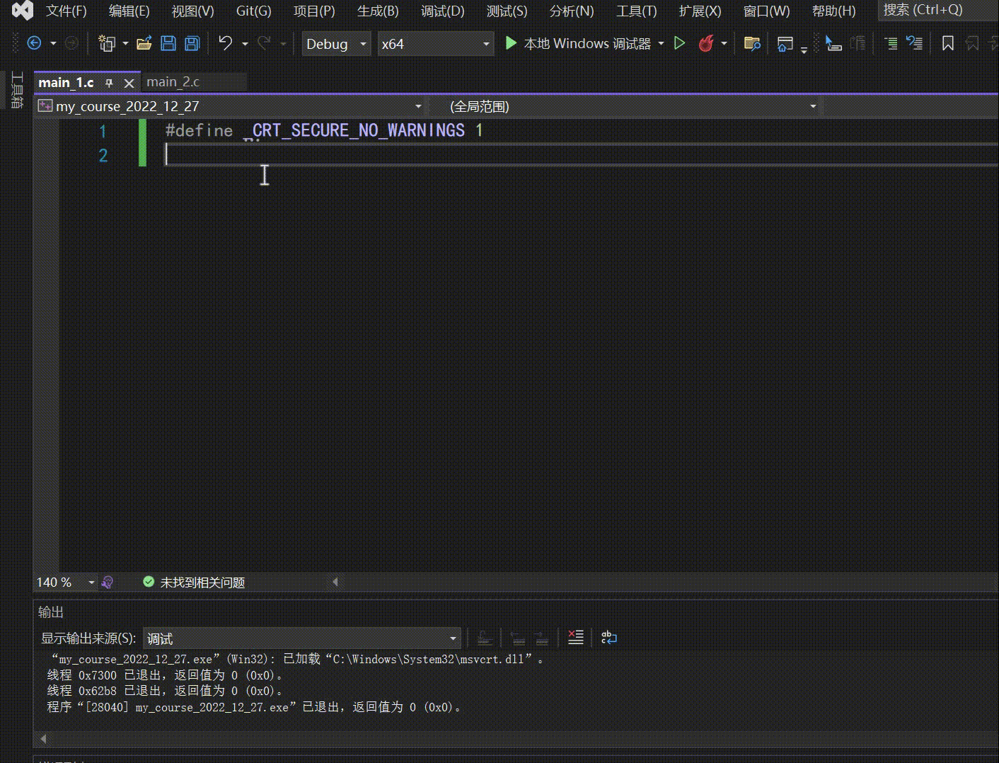

2.   `VS` 的缺点：磁盘空间占用大（大概需要 `10G`，如果只是为了学习 `C` 语言的话，是不需要下载 `VS` 所有功能的，可以择取一些板块进行下载。并且最好是放在 `C` 盘，预防未来出现不知名的错误。记得给自己的盘符预留好足够大的磁盘空间，此外还需要有良好的电脑使用习惯，不过这个事情就跑题了）。

### 2.2.为什么不选择其他的软件呢？
1.    `VC6.0`：是 `98` 年的 `IDE` 软件，已经停止更新了，老旧并且兼容性差
2.    `Dev C++`：`10` 多年前（现在 `2023` 年）就停止更新了，内部的代码风格不美观，也不利于代码风格培养
3.    `CodeBlocks`：有些学校在用，但是不够主流比较小众，需要手动配置环境，但用着还算不错（这也是我大学初学时接触的第二款 `C` 的 `IDE`）
4.    `Visual Studio Code`：需要配置环境（本质上是个编辑器）还有选择并且安装较多的插件，对新手不太友好
5.    `Clion`：非常好用，但是收费，对于初学者来说暂时没必要
6.    其他：你是老手就直接用 `GCC`、`clang` 这些编译器来学习 `C` 语言，这样能免除关于 `IDE` 软件界面的交互学习，但这对新手不太友好...

>  [!WARNING]
>
>  注意：其实编译器只要用的足够熟悉就可以，刚开始学习 `C` 语言的时候倒也没必要多纠结，顺手就行，只是最好不要太过老旧...

## 3.编译环境的安装（保姆级教学）

>   [!IMPORTANT]
>
>   补充：这里写到前头，还有一个视频版的教程，您如果不喜欢看具体文字，想要跟着操作，还可以查看这个 [安装视频](https://www.bilibili.com/video/BV11R4y1s7jz/)。

### 3.1.检查电脑版本

通过快捷键 `[win（那个有点像田字格的微软图标）+R]`，输入 `cmd` 来打开控制台（也可以在电脑搜索“命令提示符”或者 `cmd` 来找到）。

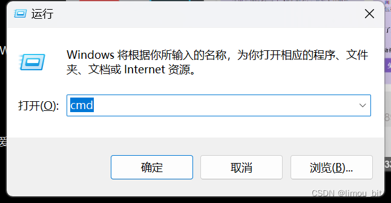


于是电脑屏幕出现类似这样的界面：

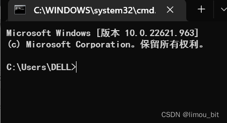


输入 `systeminfo`，稍后会以文字形式展示系统信息。

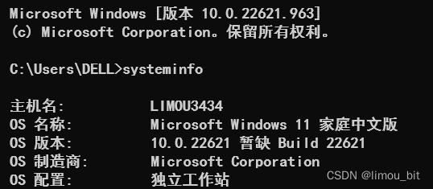

或者在控制台中输入 `winver`，这个时候就会弹出一个窗口

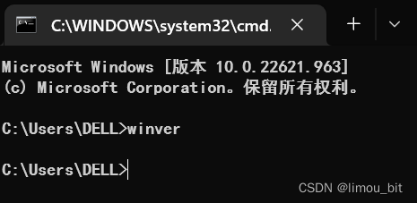


然后进入 [VS 官网](https://learn.microsoft.com/zh-cn/visualstudio/releases/2022/system-requirements) 查看对于 `VS2022` 的系统要求，然后进行对比，选择最合适自己的版本。

>   [!IMPORTANT]
>
>   补充：如果想下载其他版本的 `VS` 其实也可以，功能其实也差不多。不过这里也不再详细介绍其他版本的下载了。

### 3.2.下载安装包

首先用浏览器（我一直用的是微软自带的 `Microsoft Edge`，其他的也可以）进入安装链接：[VS 官网](https://visualstudio.microsoft.com/zh-hans/vs/)，打开网址如下（不要进错网站啦，这个软件是免费的！）。

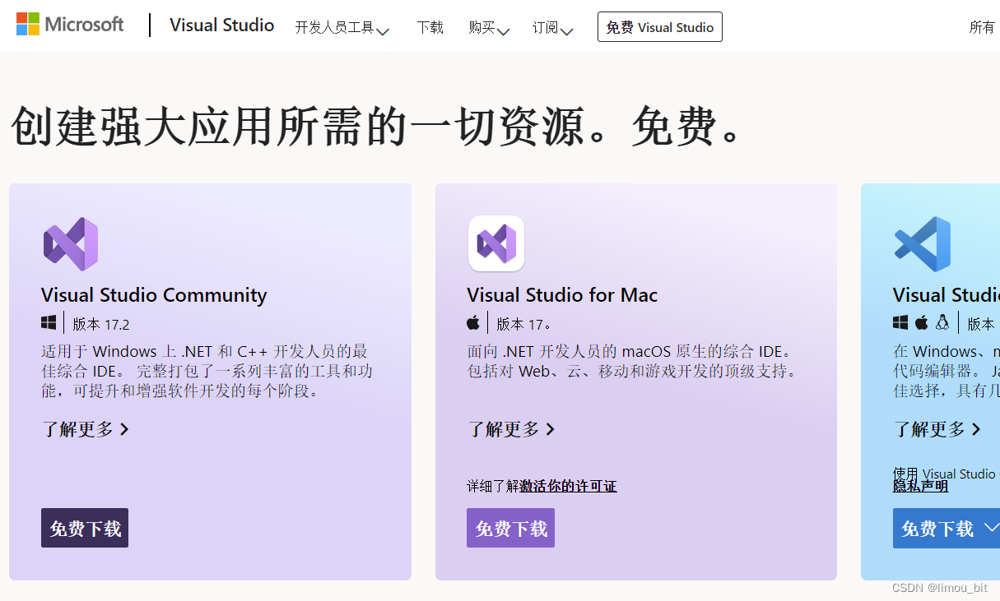

点击上方“下载”按钮（不过点这里只能下载最新 `VS` 的，如果您的系统比较老旧，需要在官网选择其他的版本下载），然后下载 `Visual Studio Community` 即：“`VS` 社区版”（社区版是完全免费的）。

下载好安装包后，打开安装包，点击安装包即可开始进行下载。

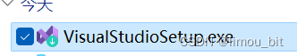

### 3.3.选择安装选项

点击安装包后就会进入 `VS` 的下载界面，在下载的过程中，可能有些选项需要选择。

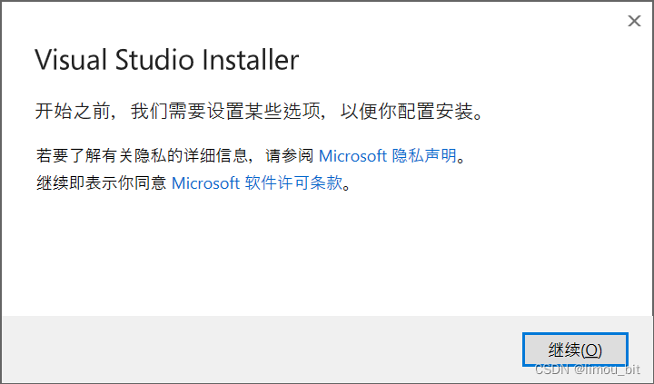

点击继续，开始下载，等待进度条。

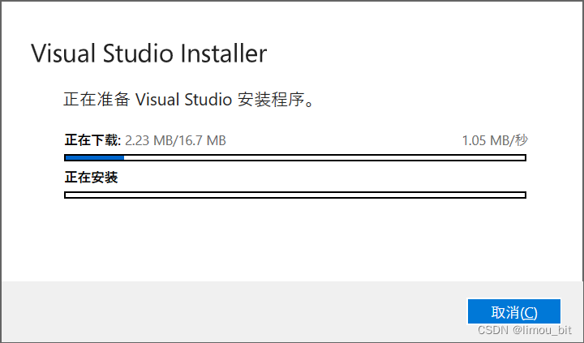

进度条走完后，会有一些设置（选择得当可以减少 `VS` 在电脑中的内存占比）。

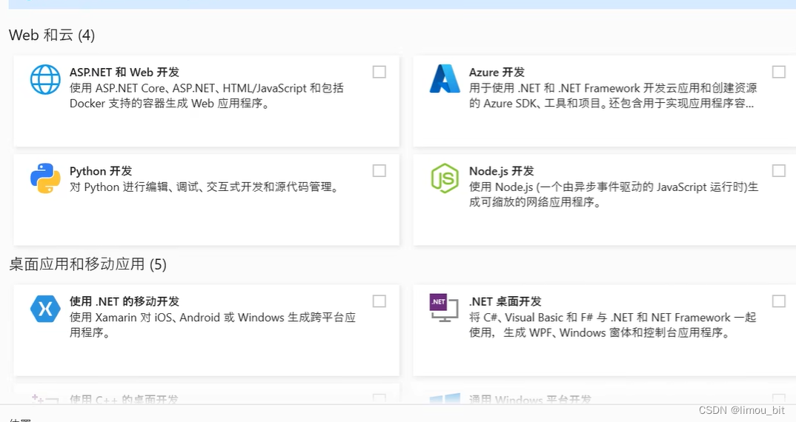

1.   “工作负荷”的“桌面应用与移动运用”中选择“使用 `C++` 的桌面开发”
2.   其中“路径”改 `D` 盘当然可以，但是最好放在 `C` 盘，避免使用不稳定
3.   左边的“安装详细信息”也不需要改，建议直接默认就行
4.   看清楚安装“要求的总空间”有多少，看自己的盘符空间够不够用

开始下载，并且勾选“安装后启动”选项。

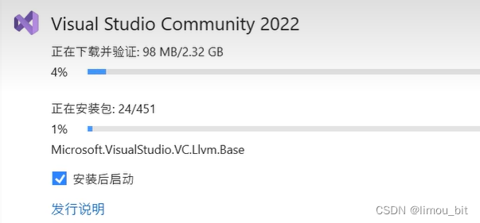

### 3.4.重启电脑

等待下载成功并且重启电脑，就可以看到会出现这样的图标（没出现的话也可以在电脑中直接搜索 `Visual Studio 2022`）

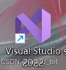

### 3.5.创建账户登录

社区版登录后 `VS` 就是完全免费的（不登陆免费 `30` 天）我们创建一个账户就可以。

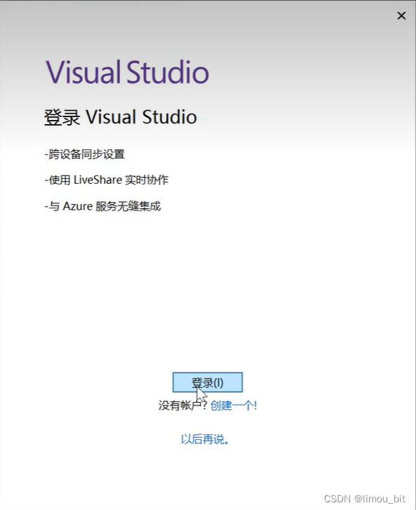

### 3.6.颜色配置

1.   开发设置：改成 `Visual C++` 即可
2.   颜色主题：看个人的喜好就行（个人推荐深色，不伤眼…）
3.   点击“启动 Visual Studio（S)”按钮

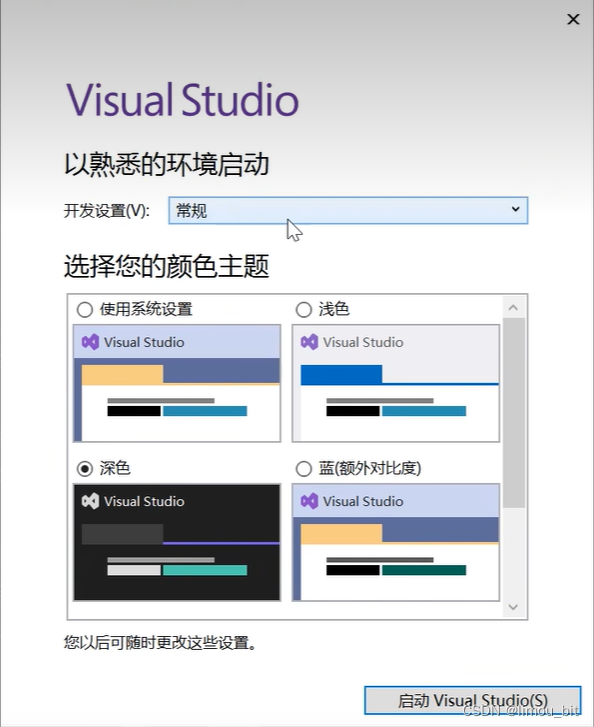

### 3.7.VS！启动~

等待初次启动完毕（初次启动可能会有点慢），开始书写写我们的第一份 `C` 语言文件

1.   点击“创建新项目”。

     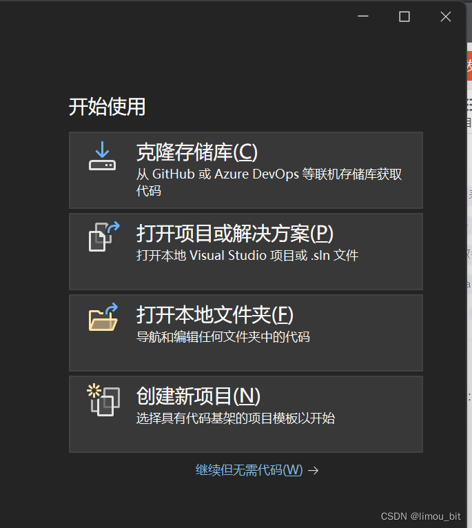

2.   搜索“空项目”，并点击“空项目”，然后点击“下一步”。

     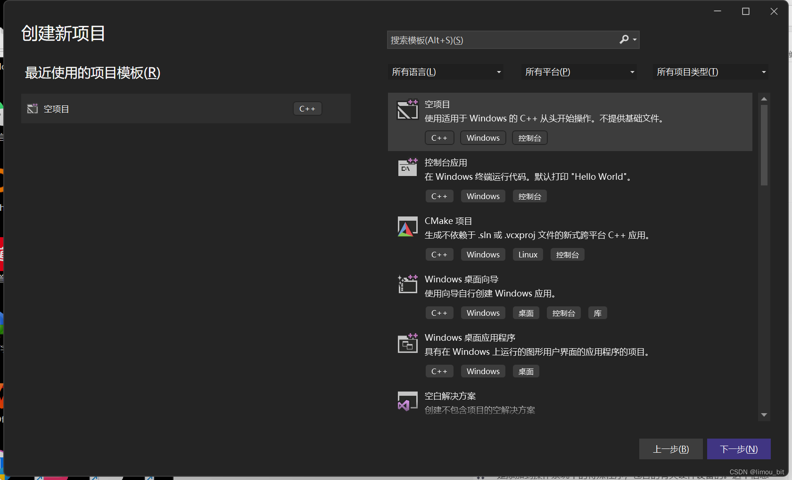

3.   更改“项目的名称”（尽量使用英文）和“路径”（要保证自己找得到就行，比如创建一个文件夹，以后一直都放在这个文件夹里，这一次演示可以暂时放在“桌面”上。

     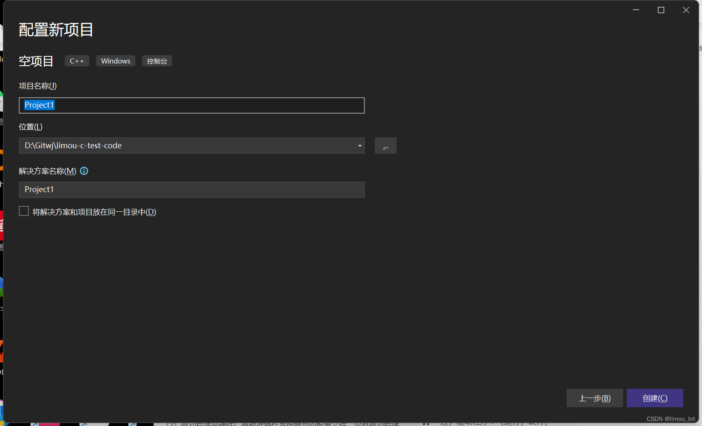

4.   进入 `VS` 的界面

     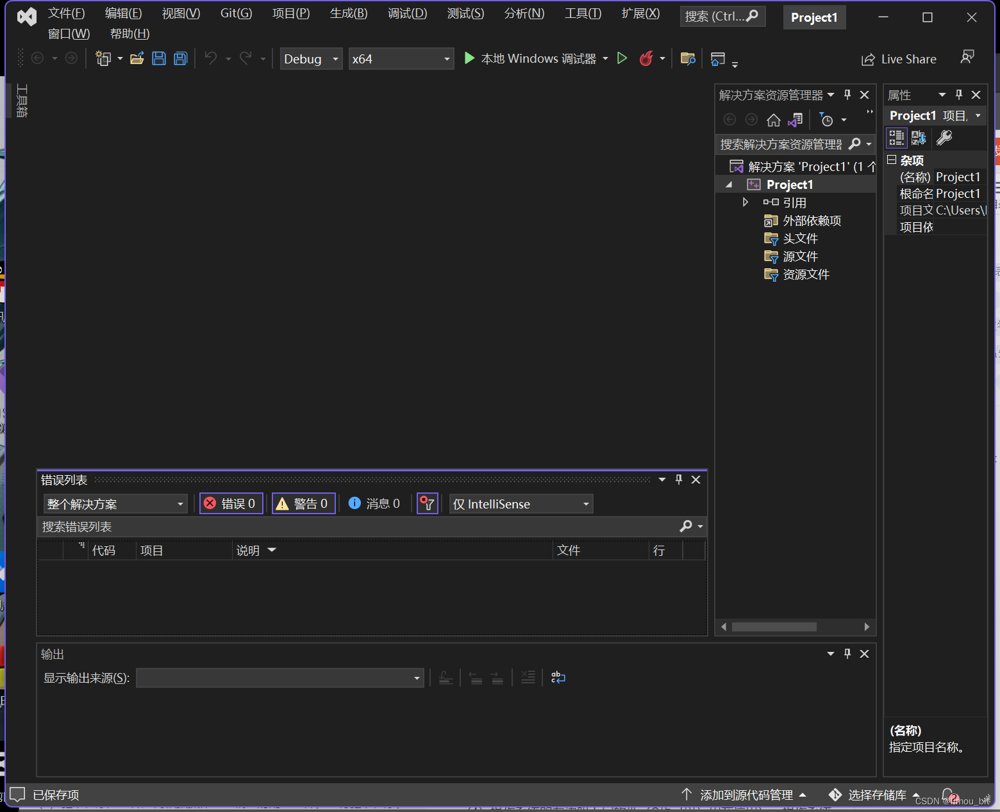

5.   右击右侧“解决方案资源管理器”中的“源文件”，点击“添加”，选择“新建项”，添加一个源文件（即后缀为 `.c` 的文件）。另外，由于我的 `VS` 装了一些小插件，所以才有“清理已选代码”这一选项，刚下载的 `VS` 是没有这个选项的，这些拓展插件以后在别的文章里面也会简单介绍几个。

     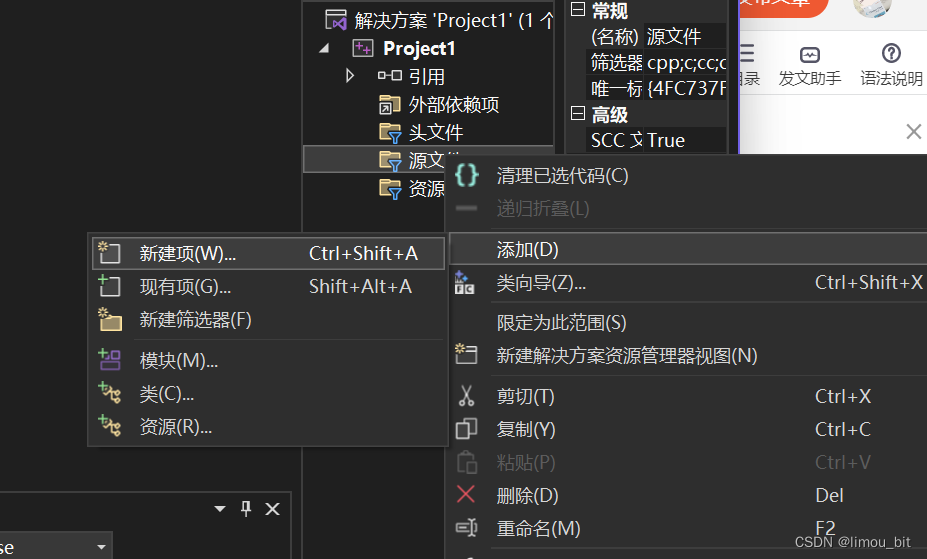

6.   选择“`C++` 文件”修改头文件后缀 `.cpp` 为 `.c`（这是因为 `.cpp` 文件是用于 `C++` 的 `.c` 文件是用于 `C` 语言的）。并且修改该头文件的名字，例如：我用了 `main` 作为源文件的名字（想叫其他名字的也可以的，但同样最好是英文名字）

     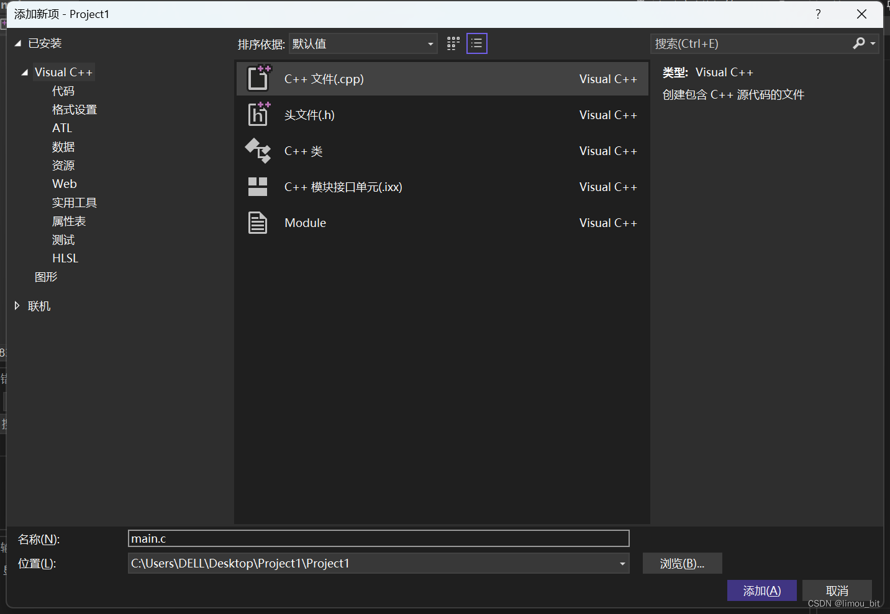

7.   工作区出现行号和光标，可以开始编写第一段代码啦！

     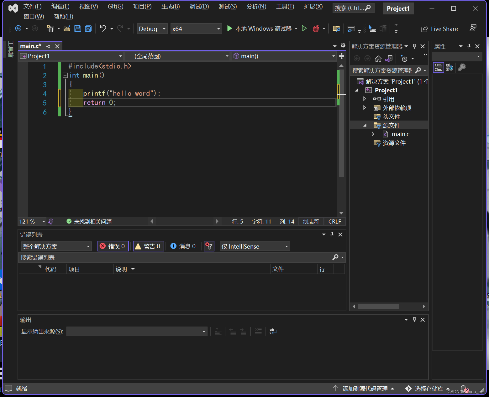

8.   以下是上述代码片段，可以复制下来运行试试（先别着急理解)

     ```cpp
     // 测试代码
     #include<stdio.h>
     int main()
     {
     	printf("hello word");
     	return 0;
     }
     ```

9.   运行程序，点击 `[F5]` 或者 `[fn+F5]` 或者 `[fn+shift+F5]` 等（不同电脑可能快捷键不一样）运行程序，也可以点击 VS 界面最上方的“绿色播放键”按钮，就可以运行程序。

     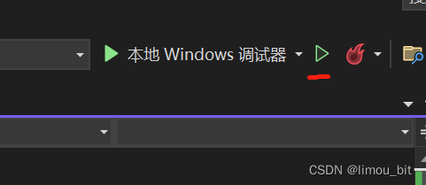

10.   运行结果显示

      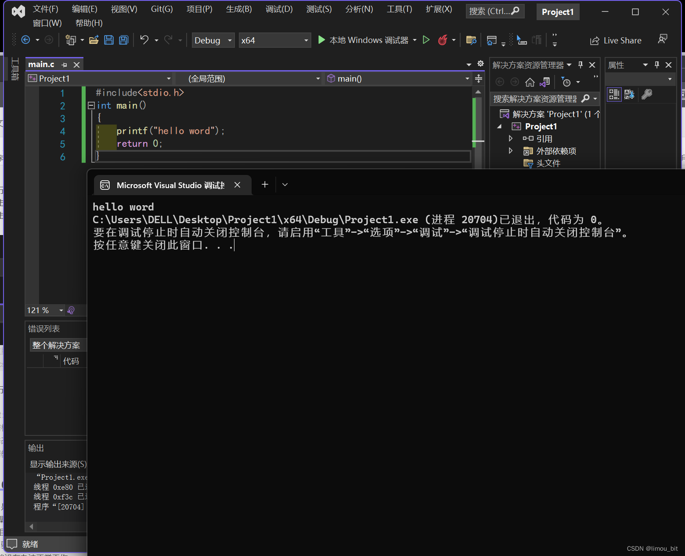

11.   程序运行完后，按任意键可以关闭程序（即现在跳出来的窗口），当然除了一些比较特殊的按键，比如“关机键”什么的...按个空格什么的就行了啦！

---

>   [!NOTE]
>
>   结语：...