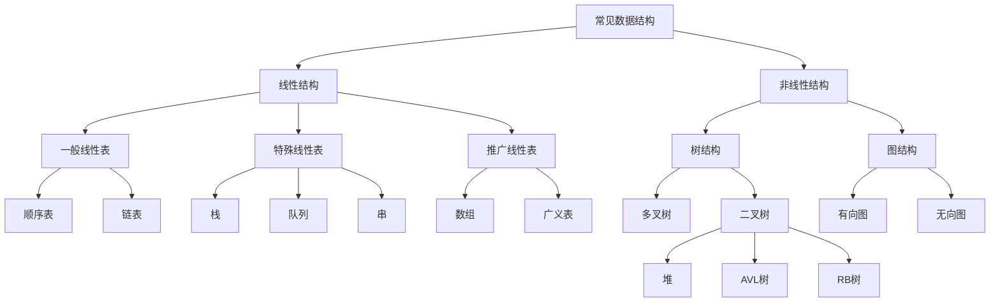

[TOC]

这里主要是科普一些基本的概念和术语。

# 1.数据结构

## 1.1.数据基础

### 1.1.1.数据项

数据是对客观事物的符号表示，在计算机科学中是指所有能输入计算机中并且能被计算机程序处理的符号总称。而数据项就是由数据构成，是数据元素不可分割的最小单元。

### 1.1.2.数据元素

一个元素由若干数据（数据项）构成，通常被计算机作为一个整体来处理操作。

### 1.1.3.数据对象

这里和面向对象中的对象有些许不同，是指若干个相同元素构成的一个整体对象。

## 1.2.数据结构

数据结构是内部元素具有特殊关系的对象，是一个集合。而“结构”这个词主要描述一种“关系”，这种关系可以是：

数据结构在数学上的形式定义为：$Data\_Structure = (D, S)$，其中 $D$ 是一个有关于元素的有限集合，$S$ 代表基于 $D$ 集合上元素之间关系的有限集合。

数据结构在伪代码上表示为：

```cpp
//一个抽象结构声明
ADT 抽象数据类型名 {
    数据对象:<数据对象的定义>
    数据关系:<数据关系的定义>
    基本操作:<基本操作的定义>
        基本操作名1(参数列表)
        	初始条件:<初始条件的描述>
        	操作结果:<操作结果的描述>
        基本操作名2(参数列表)
           	初始条件:<初始条件的描述>
        	操作结果:<操作结果的描述>
        基本操作名3(参数列表)
           	初始条件:<初始条件的描述>
        	操作结果:<操作结果的描述>
      	//...
} ADT 抽象数据类型名
```

>   补充：如果这个抽象结构您不能理解是很正常的，因为您没有写过一个具体数据结构的经验，可能看得懂，但是不足以让您明白背后的含义，没关系，暂时跳过吧！

### 1.2.1.分类数据结构

可以根据“结构/关系”分类：

1.   集合结构：数据结构内的元素只有“属于一个集合”这一特征，没有其他的关系
2.   线性结构：数据结构内的元素存在一个对一个的关系
3.   树形结构：数据结构内的元素存在一个对多个的关系
4.   图状结构：数据结构内的元素存在多个对多个的关系

### 1.2.2.描述数据结构

1.   逻辑结构：有两种对数据结构的描述和理解，一个是按照数学逻辑来定义一个数据结构，利用数学语言描述元素间的逻辑关系，这也叫做“逻辑结构”。
2.   物理结构：另外一种就是使用数据结构在计算机硬件上真实的映射来描述数据结构，这也叫做“物理结构”（也有叫“存储结构”的）。

### 1.2.3.常见数据结构



在本系列中，我只谈及：顺序表、链表、栈、队列、数组、广义表、二叉树（堆）这些基本数据结构、一些排序算法和其他算法。不会谈及 `AVL` 树和 `RB` 树，以及图的知识（这些会在我的 `C++` 的文章系列中详细讲述和补充）。

## 1.3.数据类型

数据类型是一个值的集合和定义在这个值集上的一组操作的总称。对于 `C` 语言中的整型变量，实际上就包含了值的集合和操作定义：整数集合和算术操作（加减乘除等操作）。

# 2.常规算法

## 2.1.算法定义

算法是为了解决某类问题规定的额一个有限长的操作序列。

在本系列中主讲数据结构，关于一些高效率的优秀算法，我将在 `C++` 处进行详细讲解，这里只讨论关于算法的一些基本概念、基本特性、效率衡量。

## 2.2.算法特征

1.   有穷性：算法只会执行有限的步骤后结束，每一步都会在有穷时间内完成，这意味着算法可以被有限的代码具体实现出来
2.   确定性：对于每种情况都由相应的操作，不会出现预料之外的结果，或者出现二义性，每一个算法的执行者或阅读者都能明确去含义和具体执行步骤
3.   可行性：算法中的所有操作，都可以通过执行有限次的已实现基本操作运算来实现

## 2.3.算法优劣

1.   正确性：在合理的数据输入下，在有限时间内得到正确的结果
2.   可读性：代码书写风格便于给人阅读和交流，便于调试和修改
3.   健壮性：输入非法数据的时候，可以由适当的处理和反应，而不会得出诡异的结果
4.   高效性：主要是算法执行时间和利用空间的问题，一般算法的时间和空间效率越高，算法越优

## 2.4.算法衡量

这里主要是时间复杂度和空间复杂度的计算和分析。时间复杂度主要衡量的是一个算法的运行速度，而空间复杂度主要衡量一个算法所需要的额外空间，其中最重要的时间复杂度的计算。

这是因为在计算机发展的早期，计算机的存储容量很小，对空间复杂度很是在乎。但是经过计算机行业的迅速发展，计算机的存储容量已经达到了很高的程度。如今我们已经不太关注一个算法的空间复杂度了，而是更加关注算法的时间复杂度。

而关于两者的数学定义，我以后再来填坑...

### 2.4.1.时间复杂度

如何得到一个算法的时间复杂度呢？我们先给出一个示例代码，分析根据输入数据 $N$ 得到的执行次数。

```cpp
//例子1
void Func1(int N)
{
    int count = 0;
    for (int i = 0; i < N; ++i)//执行 N 次，内部每一次都会执行一个 for 循环
    {
        for (int j = 0; j < N; ++j)//执行 N 次
        {
            ++count;
        }
    }
    //上述代码整体来看就执行了 N*N
    
    for (int k = 0; k < 2 * N; ++k)//总共执行 2*N
    {
        ++count;
    }
    
    int M = 10;//执行 1 次
    while (M--)//总共执行 10 次
    {
        ++count;
    }
    printf("%d\n", count);//还要细算的话，这个库函数内部可能还需要计算，但这里我们忽略这一部分
}
```

仔细分析的话，执行次数的函数式是 $F(N) = N^2 + 2 × N + 10$，但是时间复杂度的重点不是详细的次数，而是给各个函数做一个复杂度分类，因此我们只需要得到估算值即可。

怎么得到估算值呢？对上述次数的计算中做以下操作：

1.   用常数 `1` 取代运行时间中的所有常数
2.   在修改后的运行函数中，只保留最高阶项，其他全部舍弃
3.   如果高阶项存在且不是 `1`，则除去于这个项系数

因此开头例子中时间复杂度为 $O(n^2)$

下面我给更多的分析例子：
```cpp
//例子2
void Func2(int N)
{
    int count = 0;//执行 1 次，但是忽略
    for (int k = 0; k < 2 * N; ++k)//执行 2*N
    {
        ++count;
    }
    
    int M = 10;//执行 1 次，但是忽略
    while (M--)//执行 10 次
    {
        ++count;
    }
    printf("%d\n", count);//同样忽略库函数的执行次数
}
//该函数的时间复杂函数式是F(N)=2*N+10
//故时间复杂度是O(N)
```

```cpp
//例子3
void Func3(int N, int M)
{
    int count = 0;//执行 1 次，忽略
    
    for (int k = 0; k < M; ++k)//执行 M 次
    {
        ++count;
    }
    
    for (int k = 0; k < N; ++k)//执行 N 次
    {
        ++count;
    }
    printf("%d\n", count);
}
//这个函数的时间复杂度值得思考，注意这里有两个变量，无法确定 N 和 M 相对的大小
//所以时间复杂度是 O(M+N)，而不是简单的 O(N) 或 O(M)，除非给定 M 和 N 之间的关系（例如 M=N，或者某一个变量远远大于另外一个变量，这些情况才能进行化简）
```

```cpp
//例子4
void Func4(int N)
{
    int count = 0;//执行 1 次，忽略
    for (int k = 0; k < 100; ++k)//执行 100 次，但是和 N 无关
    {
        ++count;
    }
    printf("%d\n", count);
}
//由于无论 N 是多少都对执行次数无关，执行次数是 100 次，为常数，故时间复杂度为O(1)，代表常数次
```

```cpp
//例子5
void Swap(int* a, int* b)
{
    int tmp = *a;
    *a = *b;
    *b = tmp;
}
void BubbleSort(int* a, int n)
{
    assert(a);
    for (size_t end = n; end > 0; --end)
    {
        int exchange = 0;
        for (size_t i = 1; i < end; ++i)
        {
            if (a[i - 1] > a[i])
            {
                Swap(&a[i - 1], &a[i]);
                exchange = 1;
            }
        }
        if (exchange == 0)
            break;
    }
}
//冒泡排序的时间复杂函数式是：F(N) = (N-1) + (N-2) + … 1 = N * (N - 1) / 2
//因此时间复杂度是 O(N^2)
```

```cpp
//例子6
int BinarySearch(int* a, int n, int x)
{
    assert(a);
    int begin = 0;
    int end = n;
    while (begin < end)
    {
        int mid = begin + ((end - begin) >> 1);
        if (a[mid] < x)
            begin = mid + 1;
        else if (a[mid] > x)
            end = mid;
        else
            return mid;
    }
    return -1;
}
//二分查找的时间复杂度就比较“复杂”了
//直接计算最坏，一次没找到就除以 2，因此有多少个 2 就查找多少次，假设查找了 x 次，直到查早到最后一个元素（最坏情况），故有公式 n / (2^x) = 1，因此得到查找了 x = (n) 次
//所以二分查找的时间复杂度是 O(ln(N))
```

```cpp
//例子7
long long Factorial(size_t N)//这是一个递归代码
{
    return N < 2 ? N : Factorial(N - 1) * N;
    //调用函数调用了 N-1 次，故时间复杂度为 O(N)
}


```

### 2.4.2.空间复杂度

如何得到一个算法的空间复杂度呢

```cpp
//例子1
void BubbleSort(int* a, int n)
{
    assert(a);
    for (size_t end = n; end > 0; --end)
    {
        int exchange = 0;
        for (size_t i = 1; i < end; ++i)
        {
            if (a[i-1] > a[i])
            {
                Swap(&a[i-1], &a[i]);
                exchange = 1;
            }
        }
        if (exchange == 0)
            break;
    }
}
//整个过程都只用到临时变量，没有额外需要依赖输入 N 而开辟的空间，可看作只使用了 1 个空间
```

实际的们计算空间复杂度的时候，也不用计算如此精确的空间，只需要知道大概即可。空间复杂度不算空间，算变量个数。注意函数在运行所需要的栈空间（存储参数、局部变量、一些寄存器变量）在编译期间就确定好了，因此空间复杂度主要通过函数在运行的时候显式申请的额外空间来确定。

1.   用常数 `1` 取代运行时间中的所有加法常数
2.   在修改后的运行函数中，只保留最高阶项
3.   如果高阶项存在且不是 `1`，则去除于这个项目相乘的常数

因此开头的例子中，空间复杂度为 $O(1)$。

接下来我们看看更多的例子：

```cpp
//例子2
long long* Fibonacci(size_t n)
{
    if (n == 0)
        return NULL;
    long long* fibArray = (long long*)malloc((n + 1) * sizeof(long long));//依赖输入 N 来开辟空间，因此这里使用了 N 个空间
    fibArray[0] = 0;
    fibArray[1] = 1;
    for (int i = 2; i <= n; ++i)
    {
        fibArray[i] = fibArray[i - 1] + fibArray[i - 2];
    }
    return fibArray;
}
//空间复杂度是O(n)
```

```cpp
//例子3
long long Factorial_1(size_t N)
{
    return N < 2 ? N : Factorial(N - 1) * N;
}
//空间复杂度是 O(n)
```

```cpp
//例子4
long long Fib(size_t n)//斐波那契数列
{
    if (n < 3)
    {
        return 1;
    }
    return Fib(n - 1) + Fib(n - 2);
    //时间复杂度可以认为是 O(2^n):n^0+n^1+n^2+n^3+…2^(n-2)，注意这是按照全满的形式计算得到的，如果真的还要计算准确还需要再减少一部分
    //空间复杂度是 O(n) 而不是 O(2^n)，这是由于函数栈帧的原因，空间被复用了（空间可以被重复使用，但是时间不可以）
}
```

