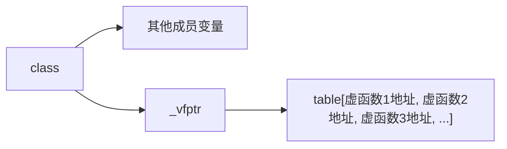
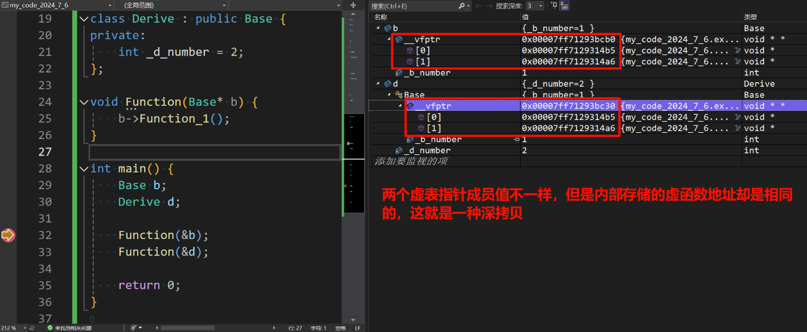
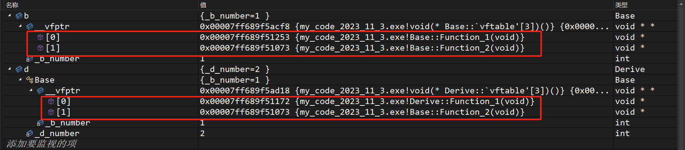
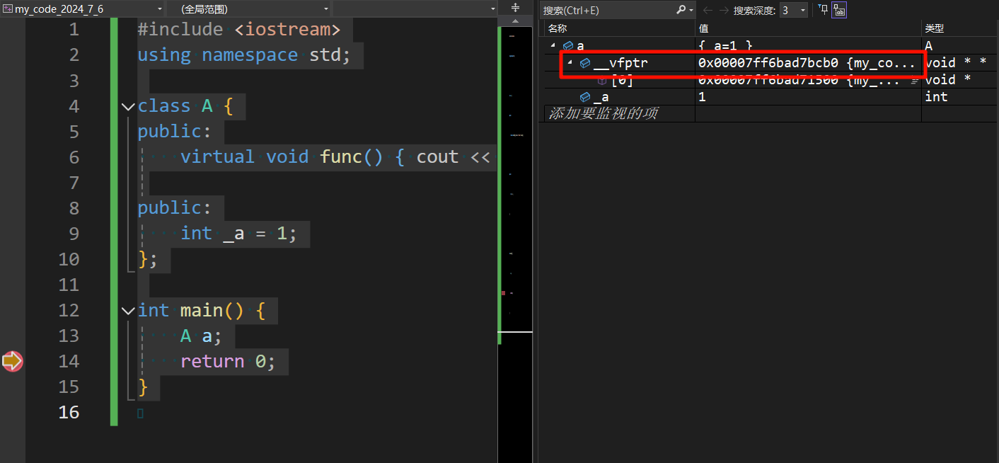
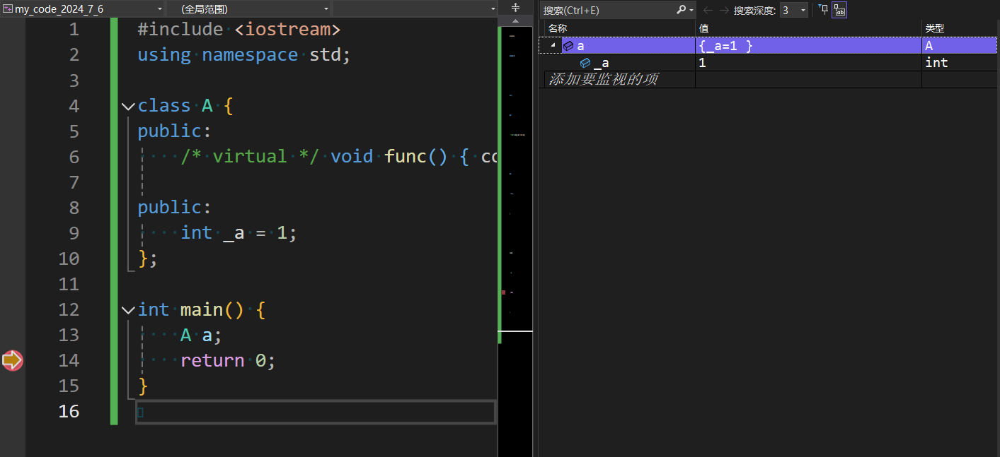
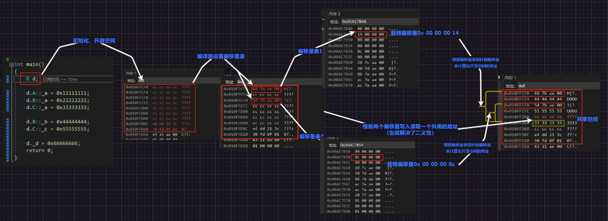
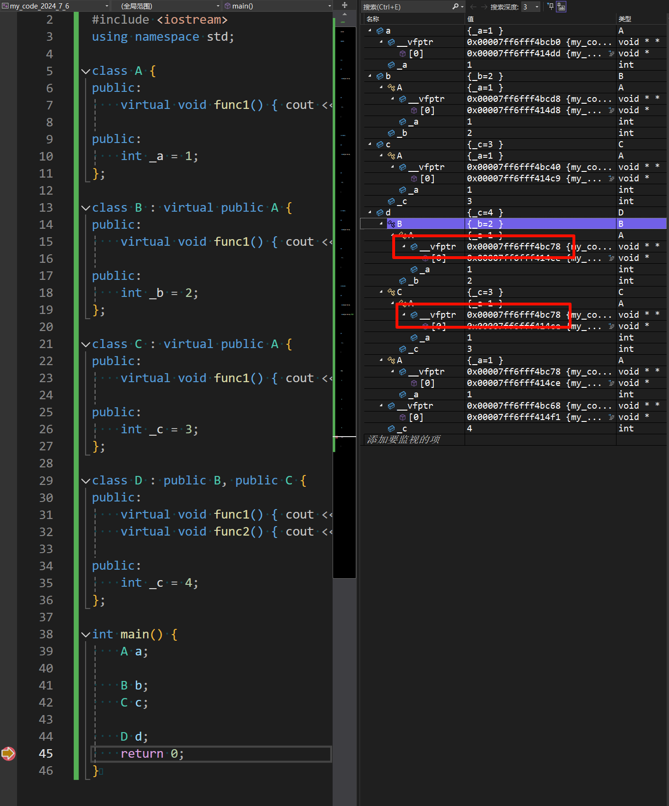
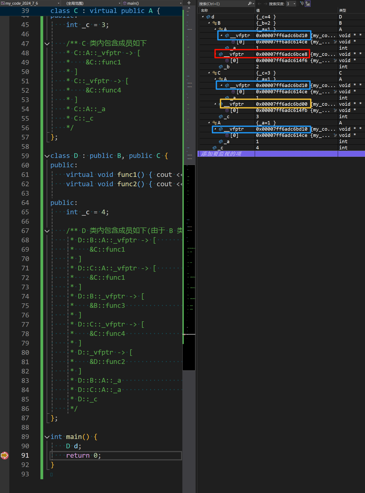

**如果本系列文章对您有帮助，可以 [star 一下我的 limou-learn-note](https://github.com/xiaogithubooo/LimouLearnNote)，求求惹(๑＞ ＜)☆♡~**

**叠甲：以下文章主要是依靠我的实际编码学习中总结出来的经验之谈，求逻辑自洽，不能百分百保证正确，有错误、未定义、不合适的内容请尽情指出！**

[TOC]

>   概要：...

>   资料：...

---

# 1.多态概念

多态就是指“多种形态”，如果具体到 `Cpp` 这种面向对象编程语言中就是指：已知父类有多个子类，使用同类型的“父类指针变量指向”或“父类引用变量引用”不同类型的子类对象，然后让父类指针或父类引用调用同一个方法的时候，有可能会得出不同的结果...多态在 `Cpp` 和 `Java` 中体现的淋漓尽致，尤其是 `Java` 的多态，比 `Cpp` 的更加容易使用，但是 `Cpp` 会更加的自由。

>   吐槽：尽管自由在有些时候并不是什么好事...

# 2.多态使用

## 2.1.多态的正确使用

`Cpp` 的多态会使用一种叫做”虚函数“的东西，有虚函数不一定产生多态，但是没有虚函数一定不会产生多态（即虚函数是产生多态的基础）！虚函数和虚继承使用的关键字是一样的，但两者没有关系，只是单纯复用了一个关键字 `virtual`，这个关键字只能修饰类内成员函数，该关键字的一般使用步骤如下

1.   首先父类需要先使用 `virtual` 使得自己的某个成员函数变成虚函数，这就相对于打开了一个成员函数可以进行多态的资格
2.   而子类继承父类的虚函数后，保留父类虚函数的函数签名（返回值，函数名，参数列表）后再进行重新实现
3.   上述行为就叫做“对父类成员函数的覆盖/重写”，会导致该成员方法可以用来实现多态，不过此时还没有发生多态只是有了产生多态的“种子”

我先来带您简单书写一下，下面是模拟不同对象在买同一种票时，发生的不同现象的场景。

```cpp
// 编写虚函数并且覆盖
#include <iostream>
#include <string>
using namespace std;

class Person {
public:
    virtual void buyTicket(const std::string& name) { // 1.父类 Person 先使用关键字 virtual 让一个函数成为虚函数, 也就使得该成员方法具有多态的资格
        cout << "普通票-" << name << ": 买票-全价" << endl;
    }
};

class Student : public Person { // 2.子类 Student 继承父类后
public:
    virtual void buyTicket(const std::string& name) { // 3.子类 Student 覆盖父类的虚函数
        cout << "学生票-" << name << ": 买票-半价" << endl;
    }
};

class Child : public Person // 4.子类 Child 继承父类后
{
public:
    virtual void buyTicket(const std::string& name) { // 5.子类 Child 覆盖父类的虚函数
        cout << "儿童票-" << name << ": 买票-免费" << endl;
    }
};
// 到这里您就书写完关于虚函数的内容
```

虚函数虽然写出来了，但是还没有发生多态，多态还需要经过下面的步骤：

1.   在父类声明虚函数，子类覆盖父类虚函数的基础上
2.   使用父类引用 `p_ref` 或父类指针 `p_ptr` 接收不同子类类型的对象
3.   然后使用 `p_ref` 或 `p_ptr` 调用虚函数方法，那么该方法就会自动检测之前接受的对象类型，自动调用子类中覆盖的方法
4.   这样就会产生明明是同一个（父类）对象类型，在调用同一个（虚）成员函数时，却产生了不同的现象

```cpp
// 观察出现多态的现象
#include <iostream>
#include <string>
using namespace std;

class Person {
public:
    virtual void buyTicket(const std::string& name) { // 1.父类 Person 先使用关键字 virtual 让一个函数成为虚函数, 也就使得该成员方法具有多态的资格
        cout << "普通票-" << name << ": 买票-全价" << endl;
    }
};

class Student : public Person { // 2.子类 Student 继承父类后
public:
    virtual void buyTicket(const std::string& name) { // 3.子类 Student 覆盖父类的虚函数
        cout << "学生票-" << name << ": 买票-半价" << endl;
    }
};

class Child : public Person { // 4.子类 Child 继承父类后
public:
    virtual void buyTicket(const std::string& name) { // 5.子类 Child 覆盖父类的虚函数
        cout << "儿童票-" << name << ": 买票-免费" << endl;
    }
};

int main() {
    // 6.子类对象
    Student student;
    Child child;

    // 7.使用父类对象引用子类
    Person& person_ref_1 = student;
    Person& person_ref_2 = child;
    Person* person_ptr_1 = &student;
    Person* person_ptr_2 = &child;

    // 8.使用多态
    person_ref_1.buyTicket("limou");
    person_ref_2.buyTicket("gimou");

    person_ptr_1->buyTicket("limou");
    person_ptr_2->buyTicket("gimou");

    return 0;
}

/** 尝试编译运行, 得到以下结果
 * 学生票-limou: 买票-半价
 * 儿童票-gimou: 买票-免费
 * 学生票-limou: 买票-半价
 * 学生票-gimou: 买票-免费
 */
```

明明使用了同一个类型的父类对象或父类指针，调用同一个方法时，却产生了不一样的结果？！

>   警告：再次强调多态的构成条件
>
>   -   构成多态必须有虚函数关键字声明并且子类中完成覆盖
>   -   必须使用父类的指针或引用接受子类对象再调用虚函数

>   区别：关于“隐藏/重定, 覆盖/重写, 重载”三个概念的区别?
>
>   1.   **隐藏/重定** 发生在两个具有父子关系的类中，需要父子各自拥有的函数或者变量名字相同即可构成隐藏/重定
>   2.   **覆盖/重写** 发生在两个具有父子关系的类中，需要父子各自拥有相同的函数签名（返回值、函数名、参数列表）并且父类函数签名带有关键字 `virtual` 修饰时才会发生（这里除去了协变的情况，之后我们讨论这个）
>   3.   **重载** 需要发生在同一个作用域中（不能发生在两个类域），并且需要函数名字相同，参数列表不同
>
>   一般而言，我推荐您使用术语隐藏、覆盖、重载，至于为什么和它们各自的实现原理有关...

>   区别：静态多态和动态多态有什么区别?
>
>   1.   **静态多态**：实际上就是函数重载，在编译时就确定了，其原理是函数名修饰规则（同一个对象调用同一个方法，但是根据传入的参数可以得到不同的结果，因此也算是一种多态）。
>   2.   **动态多态**：就是虚函数构成多态（父类指针或引用调用、虚函数完成覆盖），其原理是虚函数表（同一个父类对象调用同一个方法，但是根据指向或引用的子类对象不同，可以得到不同的结果，是真正的多态）

## 2.2.多态的错误使用

这里专门尝试一些不符合多态条件的情况，看看编译运行后的反应如何。

```cpp
// 忘记使用指针或引用, 父类对象直接接受子类对象
#include <iostream>
#include <string>
using namespace std;

class Person {
public:
    virtual void buyTicket(const std::string& name) { // 1.父类 Person 先使用关键字 virtual 让一个函数成为虚函数, 也就使得该成员方法具有多态的资格
        cout << "普通票-" << name << ": 买票-全价" << endl;
    }
};

class Student : public Person { // 2.子类 Student 继承父类后
public:
    virtual void buyTicket(const std::string& name) { // 3.子类 Student 覆盖父类的虚函数
        cout << "学生票-" << name << ": 买票-半价" << endl;
    }
};

class Child : public Person { // 4.子类 Child 继承父类后
public:
    virtual void buyTicket(const std::string& name) { // 5.子类 Child 覆盖父类的虚函数
        cout << "儿童票-" << name << ": 买票-免费" << endl;
    }
};

int main() {
    // 6.子类对象
    Student student;
    Child child;

    // 7.使用父类对象引用子类
    Person person_1 = student;
    Person person_2 = child;

    // 8.使用多态
    person_1.buyTicket("limou");
    person_2.buyTicket("gimou");

    return 0;
}

/** 编译运行后的现象
 * 普通票-limou: 买票-全价
 * 普通票-gimou: 买票-全价
 */
```

```cpp
// 父类忘记书写关键字 virtual, 尽管子类有书写 virtual
#include <iostream>
#include <string>
using namespace std;

class Person {
    public:
    void buyTicket(const std::string& name) { // 1.父类 Person 先使用关键字 virtual 让一个函数成为虚函数, 也就使得该成员方法具有多态的资格
        cout << "普通票-" << name << ": 买票-全价" << endl;
    }
};

class Student : public Person { // 2.子类 Student 继承父类后
    public:
    virtual void buyTicket(const std::string& name) { // 3.子类 Student 覆盖父类的虚函数
        cout << "学生票-" << name << ": 买票-半价" << endl;
    }
};

class Child : public Person { // 4.子类 Child 继承父类后
    public:
    virtual void buyTicket(const std::string& name) { // 5.子类 Child 覆盖父类的虚函数
        cout << "儿童票-" << name << ": 买票-免费" << endl;
    }
};

int main() {
    // 6.子类对象
    Student student;
    Child child;

    // 7.使用父类对象引用子类
    Person& person_ref_1 = student;
    Person& person_ref_2 = child;
    Person* person_ptr_1 = &student;
    Person* person_ptr_2 = &child;

    // 8.使用多态
    person_ref_1.buyTicket("limou");
    person_ref_2.buyTicket("gimou");

    person_ptr_1->buyTicket("limou");
    person_ptr_2->buyTicket("gimou");

    return 0;
}

/** 编译运行后的现象
 * 普通票-limou: 买票-全价
 * 普通票-gimou: 买票-全价
 * 普通票-limou: 买票-全价
 * 普通票-gimou: 买票-全价
 */
```

```cpp
// 函数签名不一样(这里举的是参数不一样的情况)
#include <iostream>
#include <string>
using namespace std;

class Person {
public:
    virtual void buyTicket(const std::string& name) { // 1.父类 Person 先使用关键字 virtual 让一个函数成为虚函数, 也就使得该成员方法具有多态的资格
        cout << "普通票-" << name << ": 买票-全价" << endl;
    }
};

class Student : public Person { // 2.子类 Student 继承父类后
public:
    virtual void buyTicket(const char* name) { // 3.子类 Student 覆盖父类的虚函数
        cout << "学生票-" << name << ": 买票-半价" << endl;
    }
};

class Child : public Person { // 4.子类 Child 继承父类后
public:
    virtual void buyTicket(const char* name) { // 5.子类 Child 覆盖父类的虚函数
        cout << "儿童票-" << name << ": 买票-免费" << endl;
    }
};

int main() {
    // 6.子类对象
    Student student;
    Child child;

    // 7.使用父类对象引用子类
    Person& person_ref_1 = student;
    Person& person_ref_2 = child;
    Person* person_ptr_1 = &student;
    Person* person_ptr_2 = &child;

    // 8.使用多态
    person_ref_1.buyTicket("limou");
    person_ref_2.buyTicket("gimou");

    person_ptr_1->buyTicket("limou");
    person_ptr_2->buyTicket("gimou");

    return 0;
}

/** 编译运行后的现象
 * 普通票-limou: 买票-全价
 * 普通票-gimou: 买票-全价
 * 普通票-limou: 买票-全价
 * 普通票-gimou: 买票-全价
 */
```

```cpp
// 子类没有对虚函数进行覆盖
#include <iostream>
#include <string>
using namespace std;

class Person {
public:
    virtual void buyTicket(const std::string& name) { // 1.父类 Person 先使用关键字 virtual 让一个函数成为虚函数, 也就使得该成员方法具有多态的资格
        cout << "普通票-" << name << ": 买票-全价" << endl;
    }
};

class Student : public Person { // 2.子类 Student 继承父类后
public:
//    virtual void buyTicket(const std::string& name) { // 3.子类 Student 覆盖父类的虚函数
//        cout << "学生票-" << name << ": 买票-半价" << endl;
//    }
};

class Child : public Person { // 4.子类 Child 继承父类后
public:
//    virtual void buyTicket(const std::string& name) { // 5.子类 Child 覆盖父类的虚函数
//        cout << "儿童票-" << name << ": 买票-免费" << endl;
//    }
};

int main() {
    // 6.子类对象
    Student student;
    Child child;

    // 7.使用父类对象引用子类
    Person& person_ref_1 = student;
    Person& person_ref_2 = child;
    Person* person_ptr_1 = &student;
    Person* person_ptr_2 = &child;

    // 8.使用多态
    person_ref_1.buyTicket("limou");
    person_ref_2.buyTicket("gimou");

    person_ptr_1->buyTicket("limou");
    person_ptr_2->buyTicket("gimou");

    return 0;
}

/** 编译运行后的现象
 * 普通票-limou: 买票-全价
 * 普通票-gimou: 买票-全价
 * 普通票-limou: 买票-全价
 * 普通票-gimou: 买票-全价
 */
```

>   补充：尽管很小心，但是有时如果父类忘记使用关键字 `virtual`，而使用子类重写的用户却误认为会有覆盖的现象，进而错误认为有多态的发生，导致结果变得疑惑。因此，`Cpp` 增加了 `override` 关键字，用于检查子类的虚函数是否真的覆盖了父类的某个虚函数，没有覆盖就编译报错，该关键字通常写在子类函数名字的后面。
>
>   ```cpp
>   // 使用 override 避免父类虚函数漏写 virtual 导致不符合用户预期的行为
>   #include <iostream>
>   #include <string>
>   using namespace std;
>   
>   class Person {
>   public:
>       /* 这里漏写 virtual 关键字 */ void buyTicket(const std::string& name) {
>           cout << "普通票-" << name << ": 买票-全价" << endl;
>       }
>   };
>   
>   class Student : public Person {
>   public:
>       virtual void buyTicket(const std::string& name) override {
>           cout << "学生票-" << name << ": 买票-半价" << endl;
>       }
>   };
>   
>   class Child : public Person {
>   public:
>       virtual void buyTicket(const std::string& name) override {
>           cout << "儿童票-" << name << ": 买票-免费" << endl;
>       }
>   };
>   
>   int main() {
>       Student student;
>       Child child;
>   
>       Person& person_ref_1 = student;
>       Person& person_ref_2 = child;
>       Person* person_ptr_1 = &student;
>       Person* person_ptr_2 = &child;
>   
>       person_ref_1.buyTicket("limou");
>       person_ref_2.buyTicket("gimou");
>   
>       person_ptr_1->buyTicket("limou");
>       person_ptr_2->buyTicket("gimou");
>   
>       return 0;
>   }
>   
>   /** 尝试编译运行, 得到以下结果
>    * 学生票-limou: 买票-半价
>    * 儿童票-gimou: 买票-免费
>    * 学生票-limou: 买票-半价
>    * 学生票-gimou: 买票-免费
>    */
>   ```

>   吐槽：我估计 `Java` 程序员容易把 `Cpp` 多态写成下面这样
>
>   ```cpp
>   // Java 者误写 Cpp 多态典型例子
>   #include <iostream>
>   #include <string>
>   using namespace std;
>   
>   class Person {
>   public:
>       void buyTicket(const std::string& name) { // 1.父类 Person 先使用关键字 virtual 让一个函数成为虚函数, 也就使得该成员方法具有多态的资格
>           cout << "普通票-" << name << ": 买票-全价" << endl;
>       }
>   };
>   
>   class Student : public Person { // 2.子类 Student 继承父类后
>   public:
>       void buyTicket(const char* name) { // 3.子类 Student 覆盖父类的虚函数
>           cout << "学生票-" << name << ": 买票-半价" << endl;
>       }
>   };
>   
>   class Child : public Person // 4.子类 Child 继承父类后
>   {
>   public:
>       void buyTicket(const char* name) { // 5.子类 Child 覆盖父类的虚函数
>           cout << "儿童票-" << name << ": 买票-免费" << endl;
>       }
>   };
>   
>   int main() {
>       // 6.子类对象
>       Student student;
>       Child child;
>   
>       // 7.使用父类对象引用子类
>       Person person_1 = student;
>       Person person_2 = child;
>   
>       // 8.使用多态
>       person_1.buyTicket("limou");
>       person_2.buyTicket("gimou");
>   
>       return 0;
>   }
>   ```
>
>   很正常，因为这样的类似程序在 `Java` 那边的确是正确的...
>
>   ```java
>   // 上述在 Cpp 中错误的例子迁移到 Java 中是正确的
>   class Person {
>       public void buyTicket(String name) { // 1.父类 Person 先使用关键字 virtual 让一个函数成为虚函数, 也就使得该成员方法具有多态的资格
>           System.out.println("普通票-" + name + ": 买票-全价");
>       }
>   }
>   
>   class Student extends Person { // 2.子类 Student 继承父类后
>       public void buyTicket(String name) { // 3.子类 Student 覆盖父类的虚函数
>           System.out.println("学生票-" + name + ": 买票-半价");
>       }
>   }
>   
>   class Child extends Person {
>       public void buyTicket(String name) { // 5.子类 Child 覆盖父类的虚函数
>           System.out.println("儿童票-" + name + ": 买票-免费");
>       }
>   }
>   
>   public class Main {
>       public static void main(String[] args) {
>           // 6.子类对象
>           Student student = new Student();
>           Child child = new Child();
>   
>           // 7.使用父类对象引用子类
>           Person person_1 = student;
>           Person person_2 = child;
>   
>           // 8.使用多态
>           person_1.buyTicket("limou");
>           person_2.buyTicket("gimou");
>       }
>   }
>   
>   /** 编译运行后的结果
>    * 学生票-limou: 买票-半价
>    * 儿童票-gimou: 买票-免费
>    */
>   ```

## 2.3.多态的特殊场景

### 2.3.1.子类漏写 virtual

我一直强调的都是父类要使用 `virtual` 声明虚函数，从来没说过子类一定要噢~可以来实验一下（不过一般我们都加上，因为可读性更好）。

```cpp
// 子类漏写 virtual
#include <iostream>
#include <string>
using namespace std;

class Person {
public:
    virtual void buyTicket(const std::string& name) { // 1.父类 Person 先使用关键字 virtual 让一个函数成为虚函数, 也就使得该成员方法具有多态的资格
        cout << "普通票-" << name << ": 买票-全价" << endl;
    }
};

class Student : public Person { // 2.子类 Student 继承父类后
public:
    void buyTicket(const std::string& name) { // 3.子类 Student 覆盖父类的虚函数
        cout << "学生票-" << name << ": 买票-半价" << endl;
    }
};

class Child : public Person { // 4.子类 Child 继承父类后
public:
    void buyTicket(const std::string& name) { // 5.子类 Child 覆盖父类的虚函数
        cout << "儿童票-" << name << ": 买票-免费" << endl;
    }
};

int main() {
    // 6.子类对象
    Student student;
    Child child;

    // 7.使用父类对象引用子类
    Person& person_ref_1 = student;
    Person& person_ref_2 = child;
    Person* person_ptr_1 = &student;
    Person* person_ptr_2 = &child;

    // 8.使用多态
    person_ref_1.buyTicket("limou");
    person_ref_2.buyTicket("gimou");

    person_ptr_1->buyTicket("limou");
    person_ptr_2->buyTicket("gimou");

    return 0;
}

/** 尝试编译运行, 得到以下结果
 * 学生票-limou: 买票-半价
 * 儿童票-gimou: 买票-免费
 * 学生票-limou: 买票-半价
 * 儿童票-gimou: 买票-免费
 */
```

欸，那要是出现父类有写 `virtual`，子类没写 `virtual` 但是覆盖了虚函数，而子类再次被继承得到孙类，此时孙类也没有书写 `virtual`，那孙类能不能完成覆盖呢？答案是可以，只需要保证父类有 `virtual` 声明即可，因此多态条件中，所谓“父类需要有 `virtual` 声明完整来说”，最准确表达应该是“祖先类需要有 `virtual` 声明”。

```cpp
// 观察孙类对象的多态现象, 并且孙类和子类一样漏写 virtual
#include <iostream>
#include <string>
using namespace std;

class Person {
public:
    virtual void buyTicket(const std::string& name) {
        cout << "普通票-" << name << ": 买票-全价" << endl;
    }
};

class Student : public Person {
public:
    void buyTicket(const std::string& name) {
        cout << "学生票-" << name << ": 买票-半价" << endl;
    }
};

class PrimarySchoolStudent : public Student {
public:
    void buyTicket(const std::string& name) {
        cout << "小学生票-" << name << ": 买票-赠送饮料" << endl;
    }
};

int main() {
    // 创建孙类对象
    PrimarySchoolStudent primary_school_student;
    // 使用父类对象引用子类对象
    Person &person_ref_primary_school_student = primary_school_student;
    // 尝试使用父类对象观察多态
    person_ref_primary_school_student.buyTicket("eimou");

    return 0;
}

/** 尝试编译运行, 得到以下结果
 * 小学生票-eimou: 买票-赠送饮料
 */

```

由此可以看出 `virtual` 是可以被传染的...如果在漫长的继承链中需要阻止这一 `virtual` “传染”怎么办？也就是说，我们不再希望后来的用户在继承的时候覆盖某个虚函数怎么办？使用 `C++11` 提供的关键字 `final` 即可避免，该关键字阻止用户继续覆盖下去，这会导致用户在继承后，覆盖不该覆盖的虚函数时无法通过编译。

```cpp
// 下面这份代码无法通过编译
#include <iostream>
#include <string>
using namespace std;

class Person {
public:
    virtual void buyTicket(const std::string& name) {
        cout << "普通票-" << name << ": 买票-全价" << endl;
    }
};

class Student : public Person {
public:
    void buyTicket(const std::string& name) final { // 这里使用了 final
        cout << "学生票-" << name << ": 买票-半价" << endl;
    }
};

class PrimarySchoolStudent : public Student {
public:
    void buyTicket(const std::string& name) { // 用户不小心覆盖了...
        cout << "小学生票-" << name << ": 买票-赠送饮料" << endl;
    }
};

int main() {
    // 创建孙类对象
    PrimarySchoolStudent primary_school_student;
    // 使用父类对象引用子类对象
    Person &person_ref_primary_school_student = primary_school_student;
    // 尝试使用父类对象观察多态
    person_ref_primary_school_student.buyTicket("eimou");

    return 0;
}

```

### 2.3.2.突破函数签名的协变

`Cpp` 多态在有一些例外情况，使得哪怕函数签名不完全相同也能构成多态（`Java` 也有这个特性）。而虚函数的返回值可以发生不同，这种情况也叫做”协变“（很少使用协变）。但此时子类虚函数的返回值类型必须是具有父子继承关系类型的指针或引用（如果是其他不具有继承关系的类型的返回值就会报错）。

```cpp
// 突破函数签名的协变
#include <iostream>
using namespace std;

class Father {
    int father_value_;
};

class Child: public Father {
    int child_value_;
};

class A {
public:
    virtual Father* func() {
        cout << "virtual Father* func()" << endl;
        return nullptr;
    }
};

class B : public A {
public:
    virtual Child* func() {
        cout << "virtual Child* func()" << endl;
        return nullptr;
    }
};

int main() {
    B b;
    A& a = b;
    a.func();
    return 0;
}

/** 输出
* virtual Child* func()
*/

```

>   补充：至于协变的应用场景以及为什么支持协变，待补充...

### 2.3.3.不同默认值函数签名

如果父类虚函数被子类覆盖时，函数参数列表中存在不一致的默认值怎么办？由于虚函数继承时，是一种接口继承，子类只能使用父类虚函数的函数签名，而子类自己的参数列表默认值只会跟随父类，如果子类写得默认值和父类不一样会被编译器忽略（个人觉得报错会更好，但实际情况是编译器不会报错...）。

```cpp
// 不同默认值函数签名
#include <iostream>
using namespace std;

class A {
public:
    virtual void func(int val = 1) {
        cout << "A->" << val << endl;
    }
};

class B : public A {
public:
    virtual void func(int val = 0) { // 隐藏/重定义了 func
        cout << "B->" << val << endl;
    }
};

int main() {
    B b = B();
    A& a = b;

    a.func(); // B->1, 因为继承的是父类的接口
    a.func(2); // B->2

    return 0;
}
```

>   吐槽：实际上，虚函数继承就是一种接口继承（只继承了函数签名），而普通的继承是一种实现继承（继承了函数签名和函数实现）。另外，由于 `Java` 认为默认值是不必要的，因此上面这一点在 `Java` 中没有体现...被隐藏得很好。
>
>   ```java
>   // 一份正确的 Java 代码
>   class A {
>       public void func(String val) {
>           System.out.println("A->" + val);
>       }
>   }
>   
>   class B extends A {
>       public void func(String val) {
>           System.out.println("B->" + val);
>       }
>   }
>   
>   public class Main {
>       public static void main(String[] args) {
>           A a = new B();
>           a.func("limou");
>       }
>   }
>   
>   ```
>
>   不过这种接口继承，被 `Java` 以接口的形式独立出来了...`Cpp` 可以通过后续的纯虚函数来模拟（后面再说）。

### 2.3.4.inline 和 virtual 同时出现

可以，但是两个关键字放在一起可以通过编译，但是只会根据使用情况择取一个关键字。普通调用就使用 `inline` 关键字，多态调用就使用 `virtual`。

# 3.多态析构

之前我们提到过，在继承的时候，析构函数是很特殊的，是编译器自己调用，并且还统一改名为 `destrutor()`。如果说编译器为了避免内存泄露，会自己调控析构的析构顺序，这我们能理解，但是为什么需要统一改名呢？

```cpp
// 不用多态(没毛病)
#include <iostream>
using namespace std;

class Person {
public:
    void func() {
        cout << "Person: void func()" << endl;
    }
    ~Person() {
        cout << "~Person()" << endl;
    }
};

class Student : public Person {
public:
    void func() {
        cout << "Student: void func()" << endl;
    }
    ~Student() {
        cout << "~Student()" << endl;
    }
};

int main() {
    Person* ptr1 = new Person;
    Student* ptr2 = new Student;

    ptr1->func();
    ptr2->func();

    delete ptr1;
    delete ptr2;

    return 0;
}

/** 运行结果
* Person: void func()
* Student: void func()
* ~Person()
* ~Student()
*/
```

上述代码本身没什么毛病，但是如果使用指针或者引用来构成多态就会出现问题了。

```cpp
// 使用多态(修改前)
#include <iostream>
using namespace std;

class Person {
public:
    virtual void func() {
        cout << "Person: void func()" << endl;
    }
    ~Person() {
        cout << "~Person()" << endl;
    }
};

class Student : public Person {
public:
    virtual void func() {
        cout << "Student: void func()" << endl;
    }
    ~Student() {
        cout << "~Student()" << endl;
    }
};

int main() {
    Person* ptr1 = new Person;
    Person* ptr2 = new Student;

    ptr1->func();
    ptr2->func();

    delete ptr1;
    delete ptr2;

    return 0;
}

/** 运行结果
*  Person: void func()
*  Student: void func()
*  ~Person()
*  ~Person()
*/
```

出问题了，明明是两个不同类类型的 `new`，但是析构的时候只析构了父类成员，由于切片的缘故，导致子类对象有部分成员可能有内存泄漏（不过我们的例子没有真的内存泄漏，只是在别的场景中有可能出现而已）。

造成这种现象的根源就是，这里的析构函数没有构成多态。两个 `delete` 分别调用 `ptr1->destructor()` 和 `ptr2->destructor()`，而由于析构函数没有关键字 `virtual`，故无法构成多态。因此在编译器看来，使用了什么类型的指针就应该调用什么类型的析构函数，就一股脑使用对应类型的析构函数。

那如何构成多态呢？让我们回忆一下多态的构成条件：父类虚函数被子类覆盖、使用指针或引用调用。如果析构函数达成多态，首先函数签名是要相同吧？但是每个子类和父类的名字都是不一样的，而在语法规则上，每个类的析构函数签名都是 `~类名()`，由于这条规则，首先析构函数地函数名字就一定不一样了，这样就很难构成多态。

总不能修改规则让每个类的析构函数名字都变成一样吧？答案是：虽然我们自己改不可以，但是我们可以让编译器干这种活呀！编译器统一将具有继承关系的析构函数名称改为 `destructor()`，让析构函数有机会构成父子隐藏，这样使用析构函数就会变成使用 `ptr1->destructor()` 和 `ptr2->destructor()`。

为什么说是有机会呢？因为还缺少了关键字 `virtual`，这个时候只要给所有具有继承关系的析构函数加上关键字 `virtual`，即可让析构函数构成多态，使用 `ptr1->destructor()` 和 `ptr2->destructor()` 也就具有了多态的行为。尤其是使用 `ptr2->destructor()`，会因为多态的缘故调用子类 `Student{}` 自己的析构方法，而这个析构方法内又会被编译器自动调用继承自父类的析构函数，非常完美，完全没有内存泄漏的情况！

因此代码需要这么修改：

```cpp
// 使用多态(修改后)
#include <iostream>
using namespace std;

class Person {
public:
    virtual void func() {
        cout << "Person: void func()" << endl;
    }
    virtual ~Person() {
        cout << "~Person()" << endl;
    }
};

class Student : public Person {
public:
    virtual void func() {
        cout << "Student: void func()" << endl;
    }
    virtual ~Student() {
        cout << "~Student()" << endl;
    }
};

int main() {
    Person* ptr1 = new Person;
    Person* ptr2 = new Student;

    ptr1->func();
    ptr2->func();

    delete ptr1;
    delete ptr2;

    return 0;
}

/** 运行结果
*  Person: void func()
*  Student: void func()
*  ~Person()
*  ~Student()
*  ~Person()
*/

```

再结合我们之前提到的”如果父类的函数加了 `virtual` 成为了虚函数，那么子类就可以不加 `virtual`，依旧是构成了多态的覆盖“，那我们其实只需要在父类的析构函数加上关键字足够了（也算是一种防御性变成）。

```cpp
// 使用多态(修改后)
#include <iostream>
using namespace std;

class Person {
public:
    virtual void func() {
        cout << "Person: void func()" << endl;
    }
    virtual ~Person() {
        cout << "~Person()" << endl;
    }
};

class Student : public Person {
public:
    virtual void func() {
        cout << "Student: void func()" << endl;
    }
    ~Student() {
        cout << "~Student()" << endl;
    }
};

int main() {
    Person* ptr1 = new Person;
    Person* ptr2 = new Student;

    ptr1->func();
    ptr2->func();

    delete ptr1;
    delete ptr2;

    return 0;
}

/** 运行结果
*  Person: void func()
*  Student: void func()
*  ~Person()
*  ~Student()
*  ~Person()
*/

```

当然需要注意，只有在使用指针 `new` 和 `delete` 的时候才会出现这样的问题。如果是直接创建子类对象，然后将地址传给父类指针，就不会有这种问题，因为子类对象自己就会调用正确的析构函数，无需程序员手动使用 `delete`。因此换句话说：这种因为析构没有达成多态条件构成的内存泄漏，主要是发生在使用 `new` 上。

下面是和上面代码对比的另外一段代码，请好好思考他们之间的不同：为何上一份不加 `virtual` 就会发生内存泄漏，而下面这一份却不会呢？

```cpp
// 使用多态(修改后)
#include <iostream>
using namespace std;

class Person {
public:
    virtual void func() {
        cout << "Person:virtual void func()" << endl;
    }
    ~Person() {
        cout << "~Person()" << endl;
    }
};
class Student : public Person {
public:
    virtual void func() {
        cout << "Student:virtual void func()" << endl;
    }
    ~Student() {
        cout << "~Student()" << endl;
    }
};

int main() {
    Student s;
    Person p;

    Person& rs = s;
    Person& rp = p;

    rs.func();
    rp.func();

    return 0;
}

/** 运行结果
* Person:virtual void func()
* Student:virtual void func()
* ~Person()
* ~Student()
* ~Person()
*/

```

# 4.多态隐藏

有些时候，多态隐藏得很深，有可能会隐藏到 `this` 里，下面这个题目就很坑：

```cpp
// 多态的坑点
#include <iostream>
using namespace std;

class A {
public:
    virtual void func(int val = 1) {
        cout << "A->" << val << endl;
    }

    virtual void test() {
        func();
    }
};

class B : public A {
public:
    void func(int val = 0) { // 隐藏/重定义了 func
        cout << "B->" << val << endl;
    }
    // 继承了 virtual void test(A* const this), 继承的实质是可以使用父类的函数, 而不是真的有一个函数在子类中
};

int main() {
    B* p = new B;
    p->test();
    // 调用 B 类对象的 test(), 由于继承的实质是可以使用父类的函数
    // 因此实际是使用了父类函数里的 test(), 全写为 void test(A* const this)
    // 父类 A* const this 指针接受 B* p 指针, 这就会导致使用 this->func() 时造成多态调用
    // 因此内部调用的 func() 是子类的 func(), 而不是父类的

    // 而虚函数的继承实际上是继承了父类函数的接口, 然后覆盖了实现, 因此子类内的缺省值用的是父类的缺省值

    p->func(); // 这里就没有构成多态了，正常调用了子类成员函数
    return 0;
}
```

这个例子主要是想要提醒您继承的实质和多态调用的条件，很好将继承和多态融合在了一起。

>   补充：实际上 `Java` 也有这个现象，这很合理...
>
>   ```java
>   // Java 也有多态隐藏的现象
>   class A {
>       public void func(String val) {
>           System.out.println("A->" + val);
>       }
>   
>       public void test() { // 暗含参数 A this
>           func("1");
>       }
>   }
>   
>   class B extends A {
>       public void func(String val) {
>           System.out.println("B->" + val);
>       }
>   
>       // 继承有调用
>       // public void test(A this)
>       //     func("1");
>       // }
>   }
>   
>   public class Main {
>       public static void main(String[] args) {
>           B b = new B();
>           b.test(); // 尽管不是父类引用, 这里的最终结果也是 B->1
>       }
>   }
>   
>   ```

>   吐槽：实际当中谁要是写了这种代码必会被人吐槽...

# 5.多态原理

>   补充：提前说好，下面多态原理的探究是在 `VS2022` 自带编译器中的，不同编译器对于多态的实现可能不同，但原理类似。

深入多态原理之前，我们先来看一段代码。

```cpp
// 类实例大小奇怪的现象
#include <iostream>
using namespace std;

class Base {
public:
    virtual void function() {
        cout << "function()" << endl;
    }

private:
    int b_ = 1;
};

int main() {
    Base b;
    cout << sizeof(b) << endl; // 不是 4 也不是 8
    return 0;
}
```

那如果我们去掉 `virtual` 试试？

```cpp
// 去掉 virtual 后实例大小
#include <iostream>
using namespace std;

class Base {
public:
    void function() {
        cout << "function()" << endl;
    }

private:
    int b_ = 1;
};

int main() {
    Base b;
    cout << sizeof(b) << endl; // 32 位输出 4, 64 位输出 8
    return 0;
}
```

这个现象很奇怪，仿佛类的实例化变量在有虚函数的时候，除了 `int` 以外还有一个成员一样，这和我们多态的原理有关，我们一一来进行解释。

## 5.1.单类继承

您不觉得这很神奇么，虚函数为什么和原指针类型无关，而是和原指针指向的类型有关呢？这是因为使用虚函数的父类对象在编译时就会多一个 `_vfptr` 虚函数表指针成员。该指针指向一个虚函数指针数组，而该数组存储对象中所有虚函数成员的地址，这就是实现多态的关键所在。



>   吐槽：在 `VS2022` 的调试窗口中是叫 `_vfptr` 这个名字，这个名称可能起得不太好，应该叫 `_vft` 之类的（`virtual function table`），代表指向一个虚函数表的指针。

父类对象的虚表指针成员指向的虚表中存储了父类虚函数地址，而子类对象的虚表指针从父类继承来（也就是复制/拷贝，准确来说子类的虚表指针成员是对父类的虚表指针成员的深拷贝）。虚表只能存储虚函数的地址，而父子的虚函数本身存储在代码段。

```cpp
// 证明子类的虚表指针成员是对父类的虚表指针成员的深拷贝
#include <iostream>
using namespace std;

class Base {
public:
    virtual void Function_1() {
        cout << "Base:Function_1()" << endl;
    }

    virtual void Function_2() {
        cout << "Base:Function_2()" << endl;
    }

private:
    int _b_number = 1;
};

class Derive : public Base {
private:
    int _d_number = 2;
};

void Function(Base* b) {
    b->Function_1();
}

int main() {
    Base b;
    Derive d;

    Function(&b);
    Function(&d);

    return 0;
}

```



但是从父类拷贝到子类的虚函数表指针指向的虚函数表有可能会被子类变动。

1.   父子各自指向的表内的众多虚函数指针原本是一样的（因为子类拷贝的是父类的虚表指针成员）
2.   当编译器检测到有子类对虚函数接口进行了覆盖，编译器将会对子类对象内部的虚函数表指针指向的虚函数表的内容进行覆盖（子类新的实现所对应的函数地址，覆盖原本从父类拷贝过来的虚函数地址）
3.   这导致子类的指向的虚函数表内存储的虚函数地址发生了变化
4.   这个过程就是虚函数覆盖，这也是为什么虚函数重写会被称为“覆盖”的原因（因此重写是语言层面的概念，而覆盖是原理层面的概念），也是为什么我推荐您使用术语覆盖的原因

对于下述代码，我做了图解解释，方便您理解多态原理：

```cpp
// 演示多态原理的代码
#include <iostream>
using namespace std;

class Base {
public:
    virtual void Function_1() {
        cout << "Base:Function_1()" << endl;
    }

    virtual void Function_2() {
        cout << "Base:Function_2()" << endl;
    }

private:
    int _b_number = 1;
};

class Derive : public Base {
public:
    virtual void Function_1() {
        cout << "Derive:Function_1()" << endl;
    }

private:
    int _d_number = 2;
};

void Function(Base* b) {
    b->Function_1();
}

int main() {
    Base b;
    Derive d;

    Function(&b);
    Function(&d);

    return 0;
}

```


>   补充：我们还可以注意到，虚函数谁先被声明，谁的下标就越靠前（再次强调是声明，而不是定义）。
>
>   ```cpp
>   // 声明顺序影响下标顺序
>   #include <iostream>
>   using namespace std;
>   
>   class Base {
>   public:
>       virtual void Function_1(); // 先声明, 后定义
>       virtual void Function_2(); // 后声明, 先定义
>   
>   private:
>       int _b_number = 1;
>   };
>   
>   class Derive : public Base {
>       virtual void Function_1() {
>           cout << "Derive:Function_1()" << endl;
>       }
>   
>   private:
>       int _d_number = 2;
>   };
>   
>   void Base::Function_2() {
>       cout << "Base:Function_2()" << endl;
>   }
>   
>   void Base::Function_1() {
>       cout << "Base:Function_1()" << endl;
>   }
>   
>   void Function(Base* b) {
>       b->Function_1();
>   }
>   
>   int main() {
>       Base b;
>       Derive d;
>   
>       Function(&b);
>       Function(&d);
>   
>       return 0;
>   }
>   
>   ```
>
>   

>   补充：如果没有关键字 `virtual`，那么上述说的所有现象都不会存在。
>

>   警告：所有带有关键字 `virtual` 的虚函数一定会被存储在虚函数表里，但是选择覆盖还是不覆盖是构成多态的关键。

知道了上述原理，我们解答下面的问题就会更加深入，而不是简单记忆语法。

### 5.1.1.问题一：非指针或引用无法调用多态

为什么直接使用子类对象赋值给父类对象，使用父类对象调用虚函数时无法达成多态？这是因为这种复制发生了切片，导致父类只拷贝了子类中的父类成员，而没有拷贝子类的虚函数表指针，并且保留了自己的虚表指针。这样就只会调用自己的虚函数，下面是代码示例。

```cpp
// 非指针或引用无法调用多态
#include <iostream>
using namespace std;

class Base {
public:
    virtual void Function_1() {
        cout << "Base:Function_1()" << endl;
    }
    virtual void Function_2() {
        cout << "Base:Function_2()" << endl;
    }

private:
    int _b_number = 1;
};

class Derive : public Base {
    virtual void Function_1() {
        cout << "Derive:Function_1()" << endl;
    }

private:
    int _d_number = 2;
};

void Function(Base x) {
    x.Function_1();
}

int main() {
    Base b;
    Derive d;

    Function(b);
    Function(d);
    return 0;
}
```


而父类指针和父类引用，则给子类对象的虚函数表指针部分提供了指向或别名，就不会有上面的问题。

>   补充：从实现上来看，如果赋值的时候，强行将子类对象的虚函数表指针拷贝给父类对象会发生什么？无法保证父类对象内部的虚表是父类的虚表，父类对象一旦不小心被子类对象赋值，就会完全转变为调用子类虚函数。这在有些场景会极度坑人，比如呆滞析构函数会被错误调用，因为析构函数是有可能会进入虚表的，父类对象被 `new` 出来后，一旦被子类对象赋值就会调错析构函数。
>
>   ```cpp
>// 一份伪代码例子
>   Perosn* p = new Person;
>   Students s;
>   *p = s; // 假设编译器的实现强制让父类不做切片而是拷贝子类的虚表指针, 就会导致父类的析构被子类覆盖
>   delete p; // 这里就会调错析构函数，错调成子类的析构函数, 但实际上根本不需要, 正常调用父类析构就行了
>   ```

### 5.1.2.问题二：同类对象共用虚表

子类在继承父类的时候，如果发生了覆盖就完成了对虚表的替换，此时所有类型的虚表已经确定。而接下来，同类型的对象是共用一份虚表的，为什么不直接存在对象内？因为有可能会有多个虚函数，直接存储的话，一个对象就会非常大。而一个程序往往会有很多同类型的对象，这样就会重复存储冗余的数据。而所有的对象内的虚函数表指针指向同一个虚函数表，在创建较多同类型对象时，就会大大节省空间。因此类内有虚函数声明的时候，多出来的成员是虚表指针成员变量，而不是虚表成员变量。

### 5.1.3.问题三：打印虚表地址和虚表内容

虚表是在编译时生成好的，实际并不神秘。而对象中的虚表指针是在构造函数的初始化列表阶段生成的，并且是最后一个被初始化的，在其他成员变量之后（这点可以调试出来，这一过程是编译器自己做的，不过有点难观察到），那怎么打印出虚表呢？

在 `VS2022` 中，这个虚表指针指向的数组会以 `0` 为结点，我们可以利用指针的强制转化在 `VS2022` 的环境下打印虚函数表内的成员内容（其他环境可能会不会这样了，有可能需要写有限循环或其他硬编码的形式才可以打印地址）。

并且可以和其他区域的地址对比，推断出虚函数表的存储位置，下面我们在 `32` 位环境下，完成打印虚函数表地址和打印虚函数表内内容的任务：

```cpp
// 打印虚函数表地址和虚函数地址, 以及虚函数表地址和其他区域地址的对比
#include <iostream>
using namespace std;

class Father {
public:
    virtual void function_1() { cout << "Father:function_1()" << endl; }
    virtual void function_2() { cout << "Father:function_2()" << endl; }

private:
    int _b_number = 1;
};

class Son : public Father {
public:
    virtual void function_1() { cout << "Son:function_1()" << endl; }
    virtual void function_3() { cout << "Son:function_3()" << endl; }
    virtual void function_4() { cout << "Son:function_4()" << endl; }
    void function_5() { cout << "Son:function_5()" << endl; }

private:
    int _d_number = 2;
};

class Grandson : public Son {
public:
    virtual void function_3() { cout << "Grandson:function_3()" << endl; }
};

void function(Father* f) { f->function_1(); }

// 先简单打印以下观察布局
void Test_1() {
    Father f;
    Son s;
    Grandson g;

    static int a = 0;
    int b = 0;
    int* p1 = new int;
    const char* p2 = "hello";

    printf("静态区: %p\n", &a);
    printf("栈区: %p\n", &b);
    printf("堆区: %p\n", p1);
    printf("代码段/常量区: %p\n", p2);
    printf("虚表地址: %p\n", *((int*)(&s))); // 这里有一点绕, 我给您解释以下, &s 就取得了 Son 对象的地址, (int*) 则把这个对象的地址类型进行强转, 本身地址值不变, 但是解引用得到的数据步长/数据范围不一样了, 一解引用就得到了虚表地址的值, 也就是 Son 类的第一个虚表指针成员内部的值
    // 如果是 64 位机器上面可以改 (int*) 为 (long long*)

    printf("Father::function_1 虚函数地址: %p\n", &Father::function_1);
    printf("Father::function_2 虚函数地址: %p\n", &Father::function_2);
    printf("Son::function_1 虚函数地址: %p\n", &Son::function_1);
    printf("Son::function_2 虚函数地址: %p\n", &Son::function_2);
    printf("Son::function_3 虚函数地址: %p\n", &Son::function_3);
    printf("Son::function_4 虚函数地址: %p\n", &Son::function_4);
    printf("Grandson::function_1 虚函数地址: %p\n", &Grandson::function_1);
    printf("Grandson::function_2 虚函数地址: %p\n", &Grandson::function_2);
    printf("Grandson::function_3 虚函数地址: %p\n", &Grandson::function_3);
    printf("Grandson::function_4 虚函数地址: %p\n", &Grandson::function_4);

    printf("普通函数地址: %p\n\n", function);
}

// 再根据虚函数表的地址尝试打印表中虚函数的地址和上面进行对比
typedef void(*VFUNC)(); // 这里定义了一个函数指针类型, 等价于 using VFUNC = void(*)();
void PrintVFT(VFUNC arr[]) { // 接受一个虚函数表数组, 其实就是接受 VFUNC* 指针类型, 并且打印虚函数表内的函数地址内容, 然后看看能不能进行调用
    for (size_t i = 0; arr[i] != 0; i++) { // 这里是根据 VS 的特殊处理才可以这么写停止循环的条件的, 其他环境可能只能自己写固定的循环次数
        printf("_vfptr[%d]:%p->", i, arr[i]);
        arr[i](); // 调用函数
    }
    printf("\n");
}

void Test_2() {
    Father f;
    VFUNC* vPtrT1 = (VFUNC*)(*(int*)&f); // 虚函数表地址, 如果是 64 位可以改 (int*) 为 (long long*)
    PrintVFT(vPtrT1);

    Son s;
    VFUNC* vPtrT2 = (VFUNC*)(*(int*)&s); // 虚函数表地址, 如果是 64 位可以改 (int*) 为 (long long*)
    PrintVFT(vPtrT2);

    Grandson g;
    VFUNC* vPtrT3 = (VFUNC*)(*(int*)&g); // 虚函数表地址, 如果是 64 位可以改 (int*) 为 (long long*)
    PrintVFT(vPtrT3);
}

int main() {
    // 64 位的输出会不一样(因为指针长度变成了 8 字节), 建议换成 32 位平台再运行
    Test_1();
    Test_2();
    return 0;
}
```

```shell
# 输出结果如下
静态区：004CD434
栈区：012FFDA4
堆区：01550C40
代码段/常量区：004CABF8
虚表地址：004CAB74
Father::function_1 虚函数地址：004C1091
Father::function_2 虚函数地址：004C1384
Son::function_1 虚函数地址：004C12A8
Son::function_2 虚函数地址：004C1384
Son::function_3 虚函数地址：004C1249
Son::function_4 虚函数地址：004C1195
Grandson::function_1 虚函数地址：004C12A8
Grandson::function_2 虚函数地址：004C1384
Grandson::function_3 虚函数地址：004C10DC
Grandson::function_4 虚函数地址：004C1195
普通函数地址：004C110E

_vfptr[0]:004C12F3->Father:function_1()
_vfptr[1]:004C114F->Father:function_2()

_vfptr[0]:004C1523->Son:function_1()
_vfptr[1]:004C114F->Father:function_2()
_vfptr[2]:004C1212->Son:function_3()
_vfptr[3]:004C10E1->Son:function_4()

_vfptr[0]:004C1523->Son:function_1()
_vfptr[1]:004C114F->Father:function_2()
_vfptr[2]:004C147E->Grandson:function_3()
_vfptr[3]:004C10E1->Son:function_4()
```

到这里我们成功验证了虚表的存在和意义，并且可以很清晰得看到函数地址被替换的情况，并且可以很快可以推断虚表地址存储在代码端/常量区。

>   警告: 成员函数这里有一个语法规定，不能只使用函数名 `Father::Function_1` 取得地址，必须加上 `&`，也就是 `&Father::Function_1` 才可以取得地址。并且也不可以直接使用 `bTest.Function_1` 这种方式打印虚函数地址，因为函数地址没有被存储在对象中。

### 5.1.4.问题四：普通调用快还是多态调用快

在 `Cpp` 中通常普通函数调用比虚函数调用更快，这是因为

-   普通函数调用是静态绑定的，函数的地址在编译时就已确定。调用普通函数时，编译器会直接将函数的地址嵌入到调用指令中，因此调用开销仅限于函数本身的调用过程。一般有过程 (1)将当前上下文保存到堆栈中 (2)跳转到函数的地址并执行 (3)函数执行完毕后恢复上下文并返回调用点.
-   虚函数调用是动态绑定的，函数的地址在运行时才能确定。调用虚函数时，编译器需要通过虚表先查找函数的地址，然后再进行和上述一样的调用，这就增加了额外的开销。一般有过程 (1)通过对象的虚表指针找到虚表 (2)在虚表中查找函数的地址 (3)将当前上下文保存到堆栈中 (4)跳转到查找到的函数地址并执行 (5)函数执行完毕后恢复上下文并返回调用点。

>   吐槽：不过在现代机器下，差距不大...

### 5.1.5.问题五：使用 virtual 后是否就存在虚表

是的，只要类使用了 `virtual` 修饰一个类内方法，哪怕没有任何子类覆盖这个方法，也会产生一个虚表。

```cpp
// 加上 viatual 关键字
#include <iostream>
using namespace std;

class A {
public:
    virtual void func() { cout << "A::func1" << endl; }

public:
    int _a = 1;
};

int main() {
    A a;
    return 0;
}

```



```cpp
// 去掉 viatual 关键字
#include <iostream>
using namespace std;

class A {
public:
    /* virtual */ void func() { cout << "A::func1" << endl; }

public:
    int _a = 1;
};

int main() {
    A a;
    return 0;
}

```



## 5.2.多类继承

>   注意：如果您认为多继承太过复杂，这一部分的内容是可以跳过的，日常编码中几乎不会自己手搓多继承的代码，跳过可以减轻您的学习负担。

多类继承就会导致子类对象内部具有多个虚表指针成员，指向多个虚表，原理和单类继承类似，只要遇到符合多态的条件，就把子类中重写的实现覆盖到所有父类中对应的虚表中即可，但是这里可能会出现 `this` 指针修正的问题。

1.   我们假设现在有父类 `FatherClass1{}, FatherClass2{}`，而子类多继承两者得到 `SubClass{}`
2.   对于子类对象来说，内部成员变量包含两个虚表指针成员。第一个虚表指针成员指向的是第一个继承的父类，而第二个虚表指针成员指向的就是第二个继承的父类
3.   而如果我们使用父类对象接受子类对象，有连种情况来接受 (1)使用 `FatherrClass1* fatherClass1 = new SubClass()` (2)使用  `FatherrClass2* fatherClass2 = new SubClass()` 
4.   假设子类的对父类发生覆盖，在调用时就会发生多态
5.   如果是使用 `FatherrClass1* fatherClass1 = new SubClass()`，在调用第一个虚表中被子类覆盖的方法 `faterClass1->fatherClass1Func()` 时，会转化为 `fatherClass1Func(this)`，`this` 的类型是 `const FatherrClass1*`，没有什么太大问题
6.   如果是使用 `FatherrClass2* fatherClass2 = new SubClass()`，在调用第二个虚表中被子类覆盖的方法 `fatherClass2->fatherClass2Func()` 时，会转化为 `fatherClass2Func(this)`，`this` 的类型是 `const FatherrClass2*`，这个时候就有问题了，`this` 指向的是 `new SubClass()` 对象内的第一个虚表指针，需要在调用的时候修正真正的 `this` 指针，否则无法访问第二个虚表，也就无法达成多态了
7.   因此在实际调用的时候，有可能需要修真 `this` 指针...

```cpp
// 多继承下的多态
#include <iostream>

using namespace std;

class Father {
public:
    virtual void Function_1() { cout << "Father:Function_1()" << endl; }
    virtual void Function_2() { cout << "Father:Function_2()" << endl; }

private:
    int _f_number = 1;
};

class Mother {
public:
    virtual void Function_1() { cout << "Mother:Function_1()" << endl; }
    virtual void Function_2() { cout << "Mother:Function_2()" << endl; }

private:
    int _m_number = 2;
};

class Son : public Father, public Mother {
public:
    virtual void Function_1() { cout << "Son:Function_1()" << endl; }
    virtual void Function_3() { cout << "Son:Function_3()" << endl; } // 这个虚函数被放在第一个虚表里了

private:
    int _s_number = 3;
};

typedef void(*VFUNC)();

void PrintVFT(VFUNC arr[]) { // 打印虚函数表内的函数
    for (size_t i = 0; arr[i] != 0; i++) { // 这里是根据 VS 的特殊处理才可以这么写停止循环的条件的，其他环境可能只能自己写固定的循环次数
        printf("[%d]:%p->", i, arr[i]);
        arr[i](); // 调用函数
    }
    printf("\n");
}

int main() {
    Son s;

    // 打印虚表
    VFUNC *table1 = (VFUNC *) (*(int *) &s); // 第一张虚表

    // VFUNC* table2 = (VFUNC*)( *( (int*)(  (char*)&s + sizeof(Father)))); // 第二张虚表（直接使用指针操作）
    Mother *ptr = &s;
    VFUNC *table2 = (VFUNC *) (*((int *) ptr)); // 第二张虚表（利用内置切片让指针偏移）
    PrintVFT(table1);
    PrintVFT(table2);
    printf("Son::Function_1: %p\n", &Son::Function_1);

    // 调用函数
    Father *p1 = &s;
    Mother *p2 = &s;

    p1->Function_1();
    p2->Function_1();

    return 0;
}

```

>   注意：虚函数都会放到虚表内，但是不一定会造成多态。

多继承也是类似的原理，但是注意有可能会修改 `this` 指针的问题。


对于上述程序来说，直接分别打印两个父类中被子类同时覆盖的 `Function_1()` 的地址感觉是两个函数，但是实际上他们最终是同一个函数。

>   注意：上述的 `Son` 类还自己定义了一个独属于自己的虚函数，这个虚函数的地址被默认放在该对象的第一张虚表里，这在上述图中也有体现。这么做既不需要创建多余的虚表，也不用担心 `this` 指针修正的问题，非常合理。

>   吐槽：因此多继承实际上麻烦的不仅仅是棱形继承上，还麻烦在多态的实现上...

## 5.4.棱形继承

>   注意：如果您认为多继承太过复杂，这一部分的内容是可以跳过的，日常编码中几乎不会自己手搓多继承的代码，跳过可以减轻您的学习负担。

### 5.4.1.棱形继承下的虚函数表个数

```cpp
// 普通棱形继承下的虚函数表
#include <iostream>

using namespace std;

class A {
public:
    virtual void func1() { cout << "A::func1" << endl; }

public:
    int _a = 1;
};

class B : public A {
public:
    virtual void func1() { cout << "B::func1" << endl; }

public:
    int _b = 2;
};

class C : public A {
public:
    virtual void func1() { cout << "C::func1" << endl; }

public:
    int _c = 3;
};

class D : public B, public C {
public:
    virtual void func1() { cout << "D::func1" << endl; }
    virtual void func2() { cout << "D::func2" << endl; }

public:
    int _c = 4;
};

int main() {
    D d;
    return 0;
}
```

实际上棱形继承也是多继承的一种，根据我们之前所学可以理解为：两个子类继承父类中的虚表（各自拷贝一份虚表），然后孙类继承自两个子类（从两个子类中拷贝了两个虚表），因此孙类具有两个虚表。其中需要注意，`D` 类还自己定义了一个独属于自己的虚函数 `func2()`，这个虚函数的地址被默认放在该对象的第一张虚表里（原因我们上一小节解释过...）。

### 5.4.2.虚拟继承下的虚函数表个数

虚继承是多继承中解决棱形继承二义性的解决方案，我们先来回顾下虚继承的知识。当两个子类虚继承同一个父类，并且一个孙类继承两个子类时，对于两个子类继承自父类的相同成员变量，会使用偏移量表来使得相同成员指向同一块区域。



那如果是虚继承的情况下，又该怎么判断有多少张虚表呢？

```cpp
// 虚拟继承下的虚函数表个数
#include <iostream>
using namespace std;

class A {
public:
    virtual void func1() { cout << "A::func1" << endl; }

public:
    int _a = 1;

    /** A 类内包含成员如下
     * A::_vfptr -> [
     *    &A::func1
     * ]
     * A::_a
     */
};

class B : virtual public A { // 虚继承
public:
    virtual void func1() { cout << "B::func1" << endl; }

public:
    int _b = 2;

    /** B 类内包含成员如下(B 虚表指针变量是对 A 虚表指针变量的深拷贝)
     * B::A::_vfptr -> [
     *    &B::func1              <-原本是同一个地址, 但由于 B 类内部进行重写, 但是发生覆盖
     * ]
     * B::A::_a
     * B::_b
     */
};

class C : virtual public A { // 虚继承
public:
    virtual void func1() { cout << "C::func1" << endl; }

public:
    int _c = 3;

    /** C 类内包含成员如下(C 虚表指针变量是对 A 虚表指针变量的深拷贝)
     * C::A::_vfptr -> [
     *    &C::func1              <-原本是同一个地址, 但由于 C 类内部进行重写, 发生覆盖
     * ]
     * C::A::_a
     * C::_c
     */
};

class D : public B, public C {
public:
    virtual void func1() { cout << "D::func1" << endl; }
	virtual void func2() { cout << "D::func2" << endl; } // 这个虚函数时 D 类自己实现的

public:
    int _c = 4;

    /** D 类内包含成员如下(由于 B 类和 C 类都虚继承自 A 类, 因此公共成员就是 _vfptr 和 _a, 虚继承要保证这两个成员不会出现数据冗余)
     * D::B::A::_vfptr -> [          <-和下面是同一个虚表
     *    &C::func1
     * ]
     * D::C::A::_vfptr -> [          <-和上面是同一个虚表
     *    &C::func1
     * ]
     * D::_vfptr -> [
     *    &C::func2               <-D 类自己实现的虚函数, 为什么不放在上面的那一张虚表呢? 我猜测是因为放在同一块空间就代表是两个子类所共有的成员, 但是这个 C::func2() 是 C 类自己实现的而不是共有成员, 因此如果放到上面可能会导致有点奇怪
     * ]
     * D::B::A::_a                <-和下面的 _a 使用同一块内存空间
     * D::C::A::_a                <-和上面的 _a 使用同一块内存空间
     * D::_c
     */
};

int main() {
    D d;
    return 0;
}
```

根据上述分析，上述代码中的 `C` 类有两张虚表，这从编译器的监视窗口就能看出来，虽然 `VS2022` 在这方面的监视窗口显示的有点奇怪，但确实只有两张虚表。



那如果我们再变一下，看看有什么变化？

```cpp
// 虚拟继承下的虚函数表个数
#include <iostream>
using namespace std;

class A {
public:
    virtual void func1() { cout << "A::func1" << endl; }

public:
    int _a = 1;

    /** A 类内包含成员如下
     * A::_vfptr -> [
     *    &A::func1
     * ]
     * A::_a
     */
};

class B : virtual public A {
public:
    virtual void func1() { cout << "B::func1" << endl; }
    virtual void func3() { cout << "B::func3" << endl; }

public:
    int _b = 2;

        /** B 类内包含成员如下
         * B::A::_vfptr -> [
         *    &B::func1
         * ]
         * B::_vfptr -> [
         *    &B::func3
         * ]
         * B::A::_a
         * B::_b
         */
};

class C : virtual public A {
public:
    virtual void func1() { cout << "C::func1" << endl; }
    virtual void func4() { cout << "C::func4" << endl; }

public:
    int _c = 3;

     /** C 类内包含成员如下
     * C::A::_vfptr -> [
     *    &C::func1
     * ]
     * C::_vfptr -> [
     *    &C::func4
     * ]
     * C::A::_a
     * C::_c
     */
};

class D : public B, public C {
public:
    virtual void func1() { cout << "D::func1" << endl; }
    virtual void func2() { cout << "D::func2" << endl; }

public:
    int _c = 4;

    /** D 类内包含成员如下(由于 B 类和 C 类都虚继承自 A 类, 因此公共成员就是 _vfptr 和 _a, 虚继承要保证这两个成员不会出现数据冗余)
     * D::B::A::_vfptr -> [          <-和下面是同一个虚表
     *    &C::func1
     * ]
     * D::C::A::_vfptr -> [          <-和上面是同一个虚表
     *    &C::func1
     * ]
     * D::B::_vfptr -> [
     *    &B::func3               <-从 B 类继承/深拷贝过来的虚表, 由于 D 类没有重写 B::func3(), 故这里没有被覆盖
     * ]
     * D::C::_vfptr -> [
     *    &C::func4               <-从 C 类继承/深拷贝过来的虚表, 由于 D 类没有重写 C::func4(), 故这里没有被覆盖
     * ]
     * D::_vfptr -> [
     *    &D::func2               <-D 类自己实现的虚函数, 欸不过这张虚表可以不用存在, 可以合并到 D::B::_vfptr 减小表的开销
     * ]
     * D::B::A::_a                <-和下面的 _a 使用同一块内存空间
     * D::C::A::_a                <-和上面的 _a 使用同一块内存空间
     * D::_c
     */
};

int main() {
    D d;
    return 0;
}

```

根据上述分析，上述代码中的 `C` 类一共有三张虚表，这也能从编译器的调式窗口中看出来...



>   补充：更多的相关内容可以看这两篇文章，是陈皓先生的博文见解。
>
>   -   [C++虚函数表解析](https://coolshell.cn/articles/12165.html)
>   -   [C++对象的内存布局](https://coolshell.cn/articles/12176.html)

# 6.多态补充

## 6.1.构造成员函数可以是虚函数么？

不可以，首先虚函数表是在编译期间生成的，但是对象内部的虚表指针成员是在构造函数中生成的（在其他普通成员变量初始化之前），因此构造函数没有办法找到虚表达成多态。

## 6.2.析构成员函数可以是虚函数么？

可以，也最好在写多态的时候将析构函数写成多态（在父类指针接受子类的 `new` 然后使用 `delete` 的时候，才可以正确调用子类析构函数），这点我们前面着重讲过。

## 6.3.静态成员函数可以实现多态么？

静态成员函数不可以实现多态，因为静态成员函数没有 `this` 指针，没有 `this` 指针就无法访问类的虚表指针成员（后面会讲，虚表指针是多态的实现原理）。

---

>   结语：...

**如果本系列文章对您有帮助，可以 [star 一下我的 limou-learn-note](https://github.com/xiaogithubooo/LimouLearnNote)，求求惹(๑＞ ＜)☆♡~**

