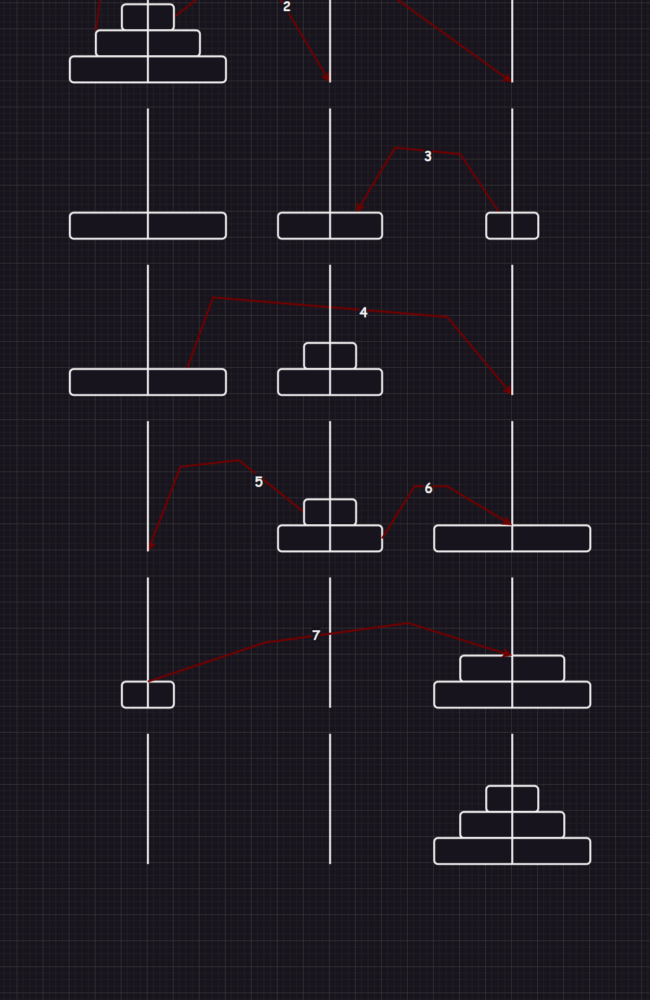
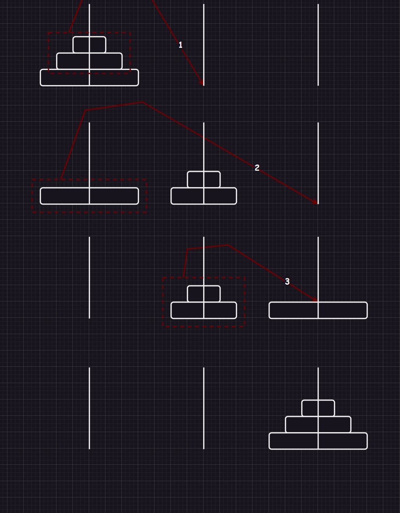

# 1.原理


# 2.题目

## 2.1.汉诺塔





```cpp
#include <iostream>
using namespace std;

int m = 0;
void Move(char begin, int n, char end)//将一个编号为 n 的圆盘挪动到另外一个圆盘
{
	cout << ++m << ":" << n << "号" << begin << "->" << end << endl;
}
void Hanoi(int n, char begin, char cache, char end)//将编号为 n 及以上圆盘从 begin 挪到 end，其中 cache 作为辅助塔（编号从1开始）
{
	if (n == 1)
	{
		Move(begin, 1, end);
	}
	else
	{
		Hanoi(n - 1, begin, end, cache);//将 n-1 及以上圆盘从 begin 挪到 cache，其中 end 作为辅助塔
		Move(begin, n, end);//将剩余的一个编号为 n 的圆盘从 begin 移动到 end
		Hanoi(n - 1, cache, begin, end);//将 n-1 及以上圆盘从 cache 移动到 end，其中 begin 作为辅助塔
	}
}
int main()
{
	Hanoi(15, 'A', 'B', 'C');
	return 0;
}
```

