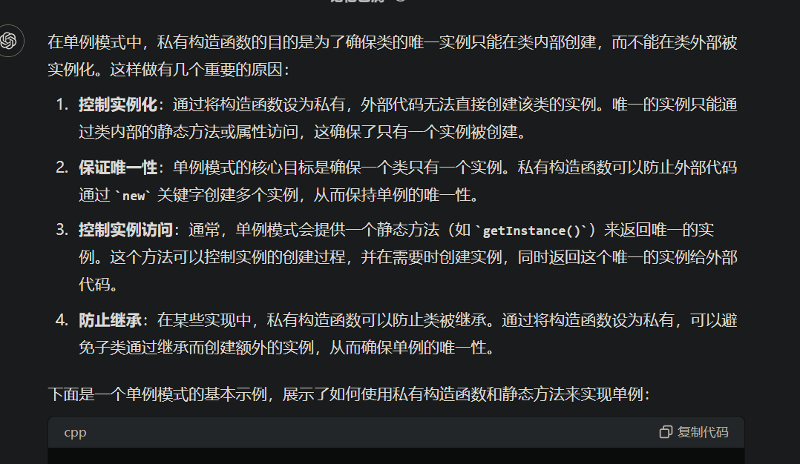

# 1.设计不能被拷贝的类

>   解析：拷贝只会放生在两个场景中
>
>   1.   拷贝构造函数
>   2.   赋值运算符重载
>
>   因此想要让一个类禁止拷贝，就需让该类不能调用“拷贝构造函数”以及“赋值运算符重载”，而 `C++11` 提供的 `delete` 重载关键字可以让这件事情变得更加简单。

## 1.1.C++98 做法

```cpp
class CopyBan
{
public:
	CopyBan()
		: _c(1) 
	{}

private:
	//拷贝构造私有化
	CopyBan(const CopyBan&);
	//赋值重载私有化
	CopyBan& operator=(const CopyBan&);

private:
	int _c;
};

int main()
{
	CopyBan c;
	//CopyBan copy(c);//禁用了

	return 0;
}
```

## 1.2.C++11 做法

```cpp
class CopyBan
{
public:
	CopyBan()
		: _c(1) 
	{}
	//拷贝构造私有化
	CopyBan(const CopyBan&) = delete;
	//赋值重载私有化
	CopyBan& operator=(const CopyBan&) = delete;

private:
	int _c;
};

int main()
{
	CopyBan c;
	//CopyBan copy(c);//禁用了

	return 0;
}
```

# 2.设计在堆上创建的类

## 2.1.析构私有

>   解析：一个在栈上的对象如果没有办法调用析构，就没有办法被创建，因为编译器认为没有析构，禁止直接创建对象，这种情况就只能使用 `new` 创建对象，并且提供一个用于释放的接口。

```cpp
class HeapOnly
{
public:
    static void Destroy_1(HeapOnly* ptr)
    {
        delete ptr;
    }
    //or
    void Destroy_2()
    {
        delete this;
    }

private:
    ~HeapOnly() {}
};

int main()
{
    //HeapOnly h1;//禁用

    HeapOnly* ph1 = new HeapOnly;
    HeapOnly::Destroy_1(ph1);

    HeapOnly* ph2 = new HeapOnly;
    ph2->Destroy_2();

    //HeapOnly h2(*ph1);//禁用

    return 0;
}
```

## 2.2.构造私有

>   解析：如果一个类的构造被私有了，那么就无法直接调用，包括 `new` 也无法调用，然后我们提供给用户一个接口，在类的内部 `new` 返回类指针给用户，交给用户释放即可。
>
>   就是需要注意，还需要将拷贝构造私有化，避免用户使用接口后，解引用进行拷贝。

```cpp
class HeapOnly
{
public:
    static HeapOnly* CreateObject()//这里必须是 static 静态成员函数
    {
        return new HeapOnly;
    }

private:
    HeapOnly() {}
    HeapOnly(const HeapOnly&);
};

int main()
{
    //HeapOnly h1;//禁用
    HeapOnly* ph = HeapOnly::CreateObject();//如果不是静态就需要创建对象来调用 CreateObject()，但我们已经没有办法产生对象了
    //HeapOnly h2(*ph);//禁用
    return 0;
}
```

# 3.设计在栈上创建的类

>   解析：需要删除 `operator new()` 才能彻底解决问题，注意不能私有构造函数！

```cpp
class StackOnly
{
public:
	static StackOnly CreateObj()
	{
		return StackOnly();
	}

	//禁掉 operator new() 可以把用 new 调用拷贝构造申请对象给禁掉
	void* operator new(size_t size) = delete;
	void operator delete(void* p) = delete;

private:
	StackOnly()//实际上删除了 operator new() 就无需将构造函数私有化了，上述的 CreateObj() 也可以一起不要了
		: _a(0)
	{}

	//不可私有拷贝构造
	//StackOnly(StackOnly& s)
	//	: _a(0)
	//{}

private:
	int _a;
};

int main()
{
	StackOnly obj = StackOnly::CreateObj();
	//StackOnly* ptr1 = new StackOnly();//禁用
	//StackOnly* ptr2 = new StackOnly(obj);//禁用，这个不能私有拷贝构造，只能删除 new 的底层调用 operator new，否则就无法返回 CreateObj() 的结果
	//delete& obj;//禁用

	return 0;
}
```

# 4.设计无法被继承的类

## 4.1.C++98 做法

父类的构造函数被私有化就不会被子类继承。

## 4.2.C++11 做法

使用关键字 `final`，表示该类不可被继承。

# 5.设计创建单对象的类

实际上就是所谓的“单例模式”，该类只能被创建出一个对象，单例模式实际是一种设计模式。

>   补充：常见的设计模式有 `23` 种，其实就是被反复使用、多数人知晓、经过分类、代码设计经验的总结，是编程界探索出来的一种编程“兵法”，其积极的一面是可以避免人们走入一些“坑”，当然设计模式只是一种实践经验，并不是所有的设计模式都适用于每个场景，使用哪种设计模式需要考虑到具体的需求和系统架构。
>
>   1.  `Singleton`（单例模式）
>   2.  `Factory Method`（工厂方法模式）
>   3.  `Abstract Factory`（抽象工厂模式）
>   4.  `Builder`（建造者模式）
>   5.  `Prototype`（原型模式）
>   6.  `Adapter`（适配器模式）
>   7.  `Bridge`（桥接模式）
>   8.  `Composite`（组合模式）
>   9.  `Decorator`（装饰器模式）
>   10.  `Facade`（外观模式）
>   11.  `Flyweight`（享元模式）
>   12.  `Proxy`（代理模式）
>   13.  `Chain of Responsibility`（责任链模式）
>   14.  `Command`（命令模式）
>   15.  `Interpreter`（解释器模式）
>   16.  `Iterator`（迭代器模式）
>   17.  `Mediator`（中介者模式）
>   18.  `Memento`（备忘录模式）
>   19.  `Observer`（观察者模式）
>   20.  `State`（状态模式）
>   21.  `Strategy`（策略模式）
>   22.  `Template Method`（模板方法模式）
>   23.  `Visitor`（访问者模式）
>
>   不过一般谈设计模式都是在接近上层的设计才会得到更多的关注，过于底层的设计一般比较少提及。

“单例”的解释就是“单份实例化”，数据类型可以是任意的，但是全局只能有一个实例化，最典型的就是内存池，内存池最好只有一份，否则容易出现问题（尤其是项目变大时，往往绕不开单例模式）。

## 5.1.饿汉模式

```cpp
//单例模式——饿汉模式
#include <iostream>
using namespace std;

//饿汉模式：把对象提前创建好（最好是在 程序/main 启动时），并且随时需要（不要使用全局变量来实现，一是无法直接创建，二是容易重定义，应该使用静态变量）
template <class Type>
class HungryManModel
{
public:
	static HungryManModel* GetInstance() //4.获取实例对象，并且由于用户无法直接创建对象，这个函数也必须静态成员函数，方便用户调用
	{
		return &_inst; //5.返回单例对象
	}

	HungryManModel(const HungryManModel<Type>& self) = delete; //12.禁用拷贝构造

	HungryManModel& operator=(const HungryManModel<Type>& self) = delete; //14.禁用赋值重载（一般禁用拷贝构造也会禁用赋值重载）

	//6.这里再加上对单例对象的一些操作方法
	void Add()
	{
		_data++;
	}

	void Print()
	{
		cout << "数据:" << _data << endl;
	}

private:
	HungryManModel() //2.将构造函数私有化，禁止用户直接在类外构造对象
		: _data(Type())
	{}

private:
	Type _data; //1.对象内部的数据，假设在全局独有这一份
	static HungryManModel<Type> _inst; //3.设置静态成员变量，使得在 main() 被调用前就构造好单例对象，注意这个静态成员的内部并没有自己包含自己，因为静态变量存储在静态区，而不在对象内部
};

template <class Type>
HungryManModel<Type> HungryManModel<Type>::_inst; //虽然在类外定义，但是该静态变量是属于类的（静态成员），因此可以调用构造函数

int main()
{
	//HungryManModel<int> a; //7.无法直接在类外直接创建对象
	//HungryManModel<int>* pa = new HungryManModel<int>(); //8.无法直接在类外直接创建对象
	HungryManModel<int>* p = HungryManModel<int>::GetInstance(); //9.获取单例对象
	
	//10.调用单例对象的方法
	p->Add();
	p->Print(); //输出 1
	HungryManModel<int>::GetInstance()->Add();
	HungryManModel<int>::GetInstance()->Print(); //输出 2

	//11.发现还有一个缺陷：没有禁用拷贝构造，上述类依旧是有问题的，下面代码的就暴露出拷贝问题
	//HungryManModel<int> copy(*HungryManModel<int>::GetInstance()); //拷贝
	
	//HungryManModel<int>::GetInstance()->Add();
	//HungryManModel<int>::GetInstance()->Print(); //输出 3
	
	//copy.Print(); //依旧输出 2

	//13.甚至还有一些奇奇怪怪的操作，自己给自己赋值...虽然也不会有什么问题啦，以防万一，我们也把赋值重载给禁掉
	//*HungryManModel<int>::GetInstance() = *HungryManModel<int>::GetInstance();

	//15.允许创建不同类型的单例对象，但是每一种类型的对象在代码中都只会存在一份
	HungryManModel<double>::GetInstance()->Add();
	HungryManModel<double>::GetInstance()->Print();

	HungryManModel<long>::GetInstance()->Add();
	HungryManModel<long>::GetInstance()->Print();
	return 0;
}
```

1.   饿汉模式的优点：相比懒汉模式，实现起来要简单一些，容易理解

2.   饿汉模式的缺点：饿汉模式还是有挺多缺点的

     (1)静态单例对象如果较多，则可能导致进程启动变慢，`main()` 可能会间隔一段时间才会被调用

     (2)多个单例对象可能有先后次序问题，有可能某一个单例对象需要在另外一个单例对象启动后，才可以启动，这种情况下使用饿汉模式就难以把控先后次序问题了（因为全局静态对象初始化的先后次序程序员很难确定）

>   补充：构造方法
>
>   1.   构造私有
>   2.   拷贝私有（包含拷贝构造和赋值拷贝）
>   3.   定义静态单例
>   4.   类加载时使用静态方法进行构造再返回单例

## 5.2.懒汉模式

```cpp
//单例模式——懒汉模式
#include <iostream>
using namespace std;

//懒汉模式：第一次用的时候再创建（现吃现做）
template <class Type>
class SlackerModel
{
public:
	static SlackerModel* GetInstance() //5.获取实例对象，并且由于用户无法直接创建对象，这个函数也必须静态成员函数，方便用户调用
	{
		if (_inst == nullptr)
		{
			_inst = new SlackerModel<Type>; //6.若指针为空，则创建一个对象（并且保证只有在第一次调用的时候创建，其他的时候都是原封不动返回）
			//由于懒汉模式的单例对象是 new 出来的，而该对象的生命周期一般跟随进程，所以一般不需要我们自己释放（极少情况需要我们自己释放），而是交给进程，进程结束就会自动释放（这是操作系统和进程的事情，我们无需考虑）
		}

		return _inst; //8.返回单例对象指针
	}

	//7.禁用拷贝构造和赋值重载
	SlackerModel(const SlackerModel<Type>& self) = delete; 
	SlackerModel& operator =(const SlackerModel<Type>& self) = delete; 

	//10.这里再加上对单例对象的一些操作方法
	void Add() { _data++; }
	void Print() { cout << "数据:" << _data << endl; }

	static void DelInstance() //9.如果考虑多一点，我们就支持用户手动释放单例对象
	{
		if (_inst != nullptr)
		{
			delete _inst;
			_inst = nullptr;
		}
	}

private:
	SlackerModel() : _data(Type()) {} //2.将构造函数私有化，禁止用户直接在类外构造对象

	~SlackerModel()
	{
		//12.但是析构的同时，可能需要做一些持久化操作（比如：要求把数据写到文件），进程虽然正常结束会释放内存空间，但是不会自动进行写入数据（这里的数据是用户在代码中的数据，本代码体现为 _data）
		//而只有用户调用了析构函数，才能做自定义的持久化操作，否之数据就会丢失
		//fopen(...) 之类的语句
		cout << "写入数据中..." << endl; //这里只是用打印语句简单模拟一下写入数据的过程
		cout << "数据写入成功!" << endl;

		//11.由于这里是使用 new 申请资源，除非使用智能指针，否则必须用户自己调用 delete 才会调用析构函数，
		//进而做持久化操作，但是我们最好避免用户自己调用 delete，因此我们可以构造一个内部类，
		//让内部类创建出来的静态对象自动调用析构函数（创建的对象会被自动释放）
	}

	class GC //14..内部类是外部类的友元类
	{
	public:
		~GC()
		{
			DelInstance(); //13.如果用户没有自己调用 DelInstance()，则这里会同构析构函数自动调用
		}
	};

private:
	Type _data; //1.对象内部的数据，假设在全局独有这一份
	static SlackerModel<Type>* _inst; //3.设置静态成员指针变量，使得在 main() 被调用前就构造好单例对象指针（指针的创建较快，此时的指针指向的对象还没有被实际创建出来）
	static GC _gc; //16.内部类对象，其销毁会自动引发析构函数，进而进行持久化操作
};

template <class Type>
SlackerModel<Type>* SlackerModel<Type>::_inst = nullptr; //4.类外定义静态成员变量 _inst

template <class Type>
typename SlackerModel<Type>::GC SlackerModel<Type>::_gc; //17.类外定义静态成员变量 _gc

template class SlackerModel<double>; //18.由于类模板的原因，导致 _gc 对象没有被实例化出来，因此只能让模板类提前实例化出一份类，否则无法调用 _gc 的析构函数

int main()
{
	SlackerModel<double>::GetInstance()->Add();
	SlackerModel<double>::GetInstance()->Add();
	SlackerModel<double>::GetInstance()->Add();
	SlackerModel<double>::GetInstance()->Print();

	//delete SlackerModel<double>::GetInstance(); //虽然可以这么设计，但是我们不推荐，我们希望在 main() 结束后自动调用
	
	SlackerModel<double>::GetInstance()->DelInstance(); //19.用户可以自己提前调用，析构单例对象
	
	//假设这下面还有某些代码...
	
	return 0;
}
//20.也可以不使用这句在 main() 调用结束自动调用 _gc 的析构函数

//21.当然，如果不需要做持久化操作，那么有关 GC 的代码就可以去除...
 
//22.懒汉模式也提示我们：
//(1) 如果有些动作想要在 main() 前做，可以使用 static 的成员变量
//(2) 如果有些动作想要在 main() 后做，可以尝试使用类似智能指针或内部类析构
```

>   注意：我们上面的模式在单线程下是没什么问题的，但是在多线程的情况下依旧有问题（例如懒汉模式中，如果不会 `new` 语句加锁，就有可能出现同时申请内存控件的情况，也就会出现内存泄漏！），待补充...



上面这种情况需要多思考一下。
