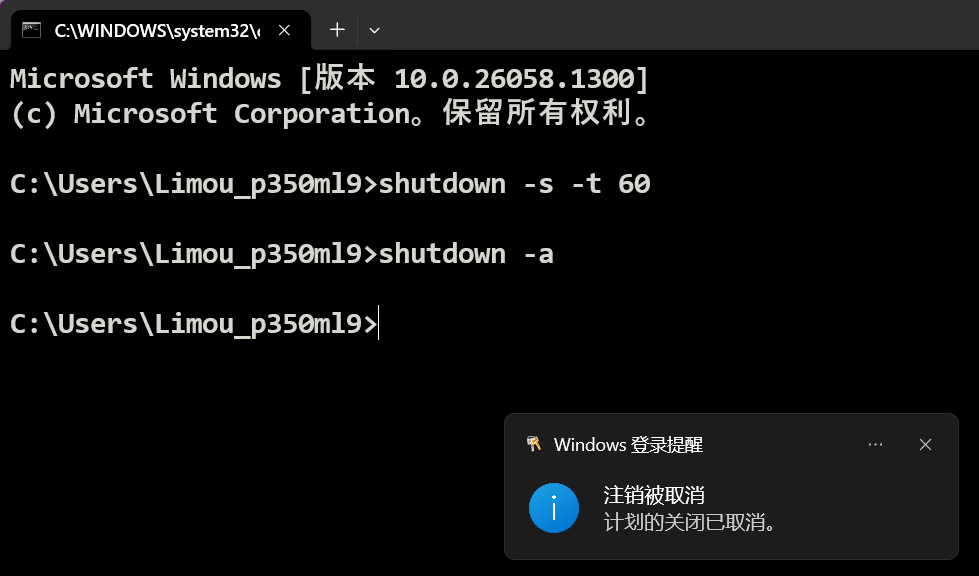
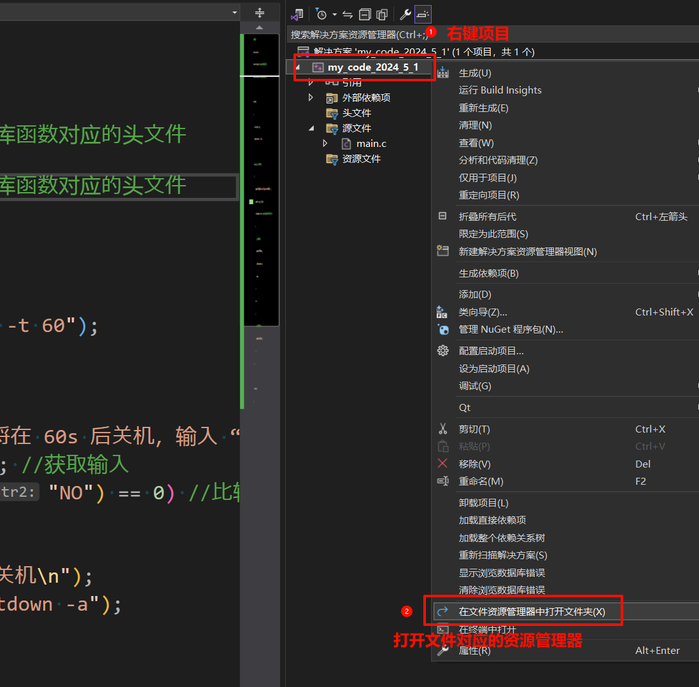
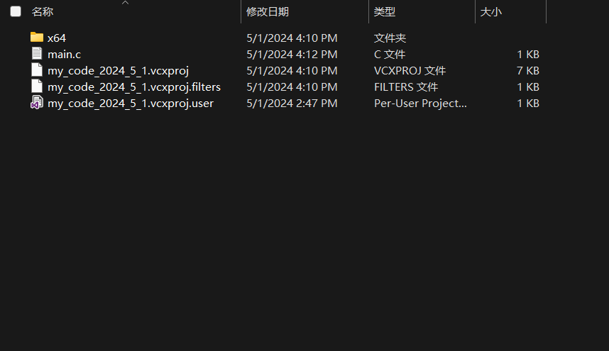
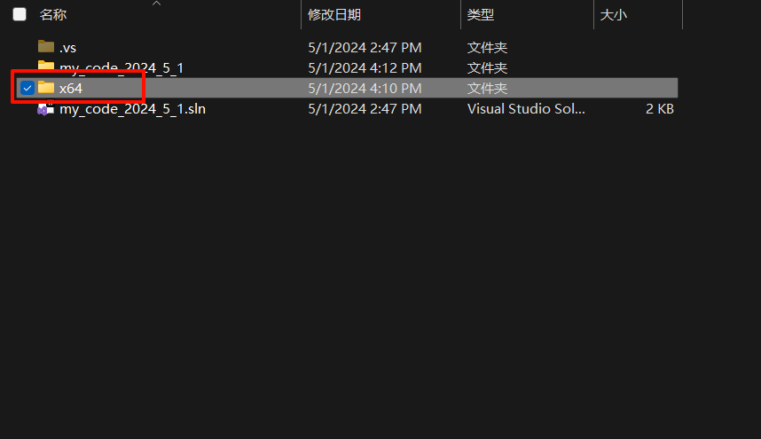
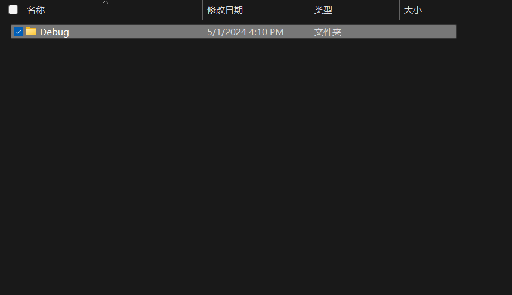
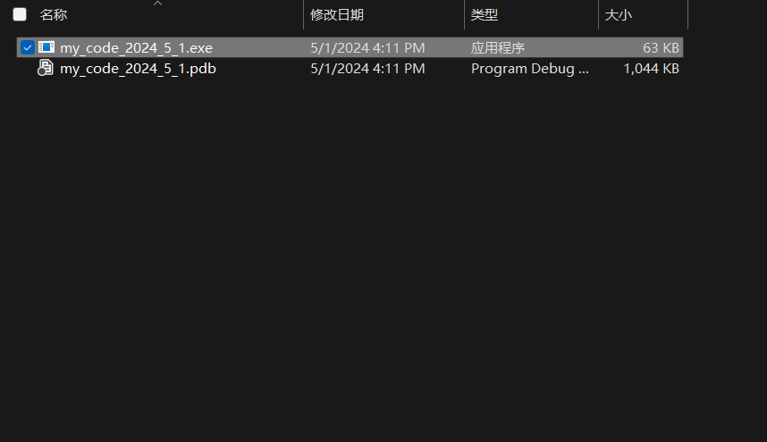
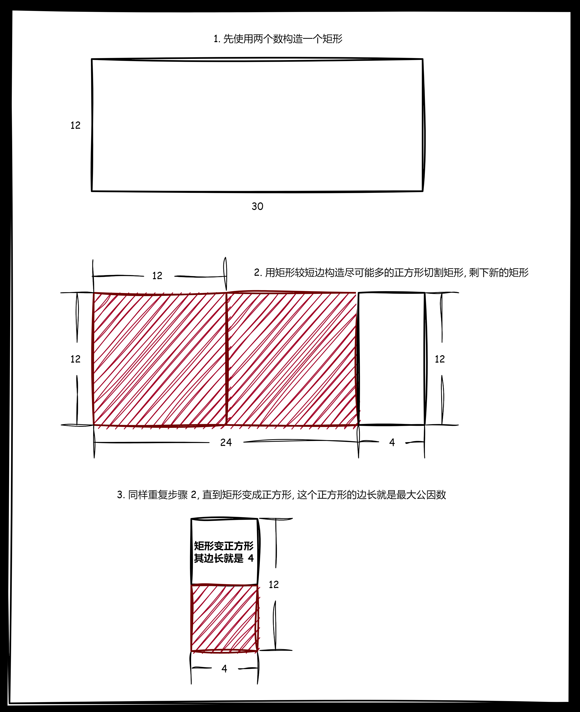
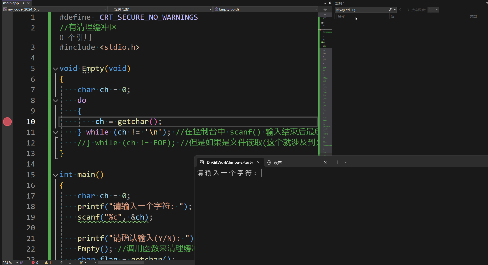

**叠甲：以下文章主要是依靠我的实际编码学习中总结出来的经验之谈，求逻辑自洽，不能百分百保证正确，有错误、未定义、不合适的内容请尽情指出！**

[TOC]

>   概要：...

---

# 1.何为控制语句

一份 `C` 代码由多种语句组合而成, `C` 的语句主要分为下面几种：

1.   表达式语句
2.   函数调用语句
3.   控制语句
4.   复合语句
5.   空语句

我这里主要给您提及控制语句的相关语法，其他的语句的相关概念您可以简单使用 `google/bing/chatGPT` 查询一下...

`C` 语言是结构化的程序设计语言，而这些结构实际上是对现实生活中的一种抽象，基本所有要做的事情都会包含“顺序、选择、循环”结构。

因此映射到 `C` 语言中就对应了三种控制语句：

-   分支语句（`if、switch`）
-   循环语句（`do...while、while、for`）
-   跳转语句（`break、goto、continue、return`）

控制语句可以按照某种要求，跳转到对应的代码中进行执行。

在分支语句和循环语句中，依靠表达式的真假（**零表示真，非零为假**）来跳转代码决定执行哪些语句。但跳转语句则无需在意真假，是无条件的跳转代码。

另外，多种控制语句直接也可以互相嵌套使用，构成复杂的代码...

# 2.控制语句-分支语句

## 2.1.if

`if` 语句会分为单分支、双分支、多分支的情况，一个 `if` 语句可以被视为一个整体，经过逻辑判断后，只能选择执行其中一个分支的代码。

而所谓的逻辑判断就是指判断表达式内的真假，`if` 语句一旦遇到：

-   表达式的整体结果判定为假的时候，就会跳过跟在后面的代码块的所有内容，继续判断下一个表达式的真假
-   表达式的整体结果判定为真的时候，就会立刻执行后面跟着的代码块的内容，执行完后就抛弃其他分支的代码，也就执行完一条 `if` 语句

而表达式的真和假根据 **零表示真，非零为假** 来判断，例如：

-   对于代码 `int num = 1; num + 3; ` 中 `num + 3` 的整体结果就是真
-   对于代玛 `int num = 3; 3 - num` 中 `3 - num` 的整体结果就是假
-   对于代码 `int x = 9; int y; y = x;` 中 `y = x` 的整体结果就是真

```cpp
//单分支语句的语法形式
if (表达式)
{
    语句0;
}
```

```cpp
//双分支语句的语法形式
if (表达式)
{
    语句1;
}
else
{
    语法2;
}
```

```cpp
//多分支语句的语法形式
if (表达式1)
{
    语句1;
}
else if (表达式2)
{
    语句2;
}
else if (表达式3)
{
    语句3;
}
//... 其他的 if 语句
else if (表达式n-1)
{
    语句n-1;
}
else
{  
    语句n;
}
```

这里举一个简单的例子：当用户输入一个数字，程序可以通过 `if` 语句检查该数字是否为正数、负数、零，并给出相应的提示信息。

```cpp
//if 语句的使用例子
#include <stdio.h>
int main()
{
    int num;
    printf("请输入一个整数: ");
    scanf("%d", &num);

    if (num > 0)
    {
        printf("这是一个正数\n");
    }
    else if (num < 0)
    {
        printf("这是一个负数\n");
    }
    else
    {
        printf("这是零\n");
    }

    return 0;
}
```

写双分支语句、多分支语句时，如果分支内只需要执行一条语句，则可以省略代码块 `{}` ，但是语句特别多的时候最好是要养成加上代码块 `{}` 的习惯。

```cpp
//省略代码块
#include <stdio.h>
int main()
{
    int num;
    printf("请输入一个整数: ");
    scanf("%d", &num);

    if (num > 0)
        printf("这是一个正数\n");
    else if (num < 0)
        printf("这是一个负数\n");
    else
        printf("这是零\n");

    return 0;
}
```

>   补充：分支语句的书写习惯对比
>
>   ```cpp
>   //两种 if 书写习惯的对比
>   //代码1
>   if (表达式) {
>      //代码块1
>   } else {
>      //代码块2
>   }
>   
>   //代码2
>   if(表达式)
>   {
>      //代码块1
>   }
>   else
>   {
>      //代码块2
>   }
>   ```
>
>   `代码1` 和 `代码2` 是写的较多两种形式，第一种强调是 `if` 以及内容是一个整体、第二种强调语句的“块”状，两种写法都可以，凭您的美感而言。

>   警告：关于 `==` 的判断写法
>
>   分支语句判断相等时最常见的错误就是将 `==` 写作 `=`，漏写一个等号带来的困扰有时是灾难性的（好在现代的编译器在很多情况下都会警告这一做法，不过您依然不能太过依赖这点）。
>
>   ```cpp
>   //有错误的代码
>   int num = 0;
>   if(num = 0) //这里原意是判断一个数是否为 0，但这里变成了赋值语句，把 num 又赋值为 0，导致表达式的判断结果为 0，也就是假，后续代码块将不会被执行...
>   {
>      printf("hehe\n");
>   }
>   ```
>
>   而关于这种写法有一种典型的检错方法，就是把变量和常量判断反过来写。
>
>   ```cpp
>   //两种 == 的判断写法
>   //代码 1
>   int num = 1;
>   if(num == 0)
>   {
>      printf("hehe\n");
>   }
>   ```
>
>   ```cpp
>   //代码 2
>   int num = 1;
>   if(0 == num) //这里把变量和常量反过来写了
>   {
>      printf("hehe\n");
>   }
>   ```
>
>   `代码2` 的写法会比较好一点，自带检错功能。假设 `num == 0` 错写成了 `num = 0`，那么意义就不同了（相当于 `0` 赋值给了 `num`），编译器不一定会报错，但是如果将 `0 == num` 写成 `0 = num`，那么编译器就会报错，因为无法使用变量赋值给一个常量。
>
>   不过这种方法也只能规避常量和变量的情况，无法规避变量和变量之间比较的情况。

>   警告：`if` 和 `else` 的就近对应原则（悬空 `else`）
>
>   ```cpp
>   //有问题的代码
>   #include <stdio.h>
>   int main()
>   {
>       int num1 = 0;
>       int num2 = 1;
>       if(num1 == 1) //第一个 if
>           if(num2 == 1) //第二个 if
>               printf("hello");
>       else //这个 else 故意不进行缩进
>           printf("limou");
>       return 0;
>   }
>   ```
>
>   实际上第二个 `if` 才是和 `else` 对应的（这里是故意不缩进的），这里发现程序结果是什么都不打印。这就是没有加上“代码块”的后果，有可能造成和您内心所需不同的结果。但是如果加上代码块就会情况就好了一些。
>
>   ```cpp
>   //没问题的代码
>   #include <stdio.h>
>   int main()
>   {
>       int num1 = 0;
>       int num2 = 1;
>       if(num1 == 1) //第一个 if
>       {
>           if(num2 == 1) //第二个 if
>           {
>               printf("hello");
>           }
>       }
>       else
>       {
>           printf("limou");
>       }
>       return 0;
>   }
>   ```
>
>   这样代码就会在第一个表达式判断为假时，执行 `printf("limou");` 从而打印 `"limou"`。因此加上代码块，一是增加代码可读性，二是减少逻辑错误。我个人推荐，就算是单分支语句也最好加上“代码块”，不要太过于省事。

## 2.2.switch

`switch` 语句的运行和 `if` 语句有些类似。

```cpp
//switch 的语法形式
switch(整型表达式)
{
    case 值 1:
        语句 1;
        break;
    case 值 2:
        语句 2;
        break;
    case 值 3:
        语句 3;
        break;
        //...还可以添加更多个 case 语句
    case 值 n-1:
        语句 n-1;
        break;
    case 值 n:
        语句 n;
        break;
    default:
        语句;
        break;
}
```

-   当 `整型表达式` 的计算值和 `case` 后的值相匹配时，就会执行 `case` 后续的代码，直到遇到 `break` 时才结束 `switch` 语句
-   其中 `default` 子句是默认选项，当 `整型表达式` 的结果均不满足 `值1~值n` 时，就会执行 `default` 后的语句
-   每条 `switch` 只能有一条 `default` 子句，`default` 放在其他 `case` 之前之后都可以，并没有顺序要求
-   最后一个 `default` 的 `break` 不写也没有问题，当然最好还是加上为好，维护代码的时候可以减少 `bug` 的产生

`case` 后面的多条语句可以不加大括号，当然最好还是写上，逻辑会更加清晰一些...

>   补充：`if` 和 `switch` 最大的差别在于 `if` 可以范围判断，`switch` 是枚举判断。

注意一个上面细节 ==直到遇到 break 时才结束 switch 语句==，这句话很值得琢磨，如果匹配到对应的 `case` 选项后没有遇到 `break` 怎么办？可以看看下面的的代码，当 `b = 1 或 2` 时都是输出 `"hello 你好 default"`，当 `b = 3 或 4` 时都是输出 `"你好 default"`

```cpp
//缺少 break 的 switch 语句
#include <stdio.h>
int main()
{
	int num = 0;
  	scanf("%d", &num);
  	switch (num)
  	{
    	case 1:
    	case 2:
      		printf("hello ");
    	case 3:
     	case 4:
      		printf("你好 ");
        default:
            printf("default");
  	}
  	return 0;
}
```

因此，可以利用这一特性来达到多种选择对应同一个结果的目的。

```cpp
//多个 case 标签指向相同的语句块
#include <stdio.h>

int main()
{
    int choice;

    //提示用户输入选择
    printf("请选择选项(1、2、3): ");
    scanf("%d", &choice);

    //使用switch语句根据用户的选择执行相应的操作
    switch(choice)
    {
        case 1:
        case 2:
        case 3:
        {
            printf("您选择了选项 1 或 2 或 3\n");
            break;
        }
        case 4:
        {
            printf("您选择了选项 4\n");
            break;
        }
        default:
        {
            printf("无效的选项\n");
            break;
        }
    }

    return 0;
}
```

>   警告：在一个 `case` 结束时，忘记写 `break` 语句也会引发一些逻辑错误，这种错误只有通过调试解决，编译器不会做任何警告或报错。

>   警告：`switch` 后必须是整形变量表达式，`case` 也必须是整形常量表达式，不然无法运行。

# 3.控制语句-循环语句

## 3.1.while

```cpp
//while 语法形式
while (表达式)
{
    //代码
}
```

通过 `while` 语句可以在表达式为真时，重复执行代码块内部的代码。

```cpp
//打印出 0 到 9 的平方结果
#include <stdio.h>
int main()
{
    int i = 0;
    while (i < 10)
    {
        printf("%d * %d = %d\n", i, i, i * i);
        i++;
    }
    return 0;
}
```

## 3.2.do...while

```cpp
//do...while 语法形式
do {
    //代码
} while (表达式);
```

`do...while` 的显著特点就是，至少会执行一次循环体里的语句，使用场景少见，但也不是没有。

```cpp
//打印出 0 到 9 的平方结果(和上面代码是等价的)
#include <stdio.h>
int main()
{
    int i = 0;
    do
    {
        printf("%d * %d = %d\n", i, i, i * i);
        i++;
    } while(i < 10);
    return 0;
}
```

>   警告：`while()` 后面是有 `;` 的，不要遗漏...

## 3.3.for

```cpp
//for 语法形式
for (初始迭代变量; 判断迭代变量; 更新迭代变量)
{
    语句;
}
```

`for` 语句的执行顺序如下：

1.  **初始迭代变量**：在循环开始时，初始化迭代变量。这是在循环的第一次迭代之前执行的。通常用来初始化计数器或设置初始条件。
2.  **判断迭代变量**：在每次迭代之前，判断迭代变量的值是否满足循环条件。如果条件为真（非零），则继续执行循环体；如果条件为假（零），则跳出循环，执行循环后面的代码。
3.  **执行循环体**：如果循环条件为真，则执行循环体中的语句。循环体可以是单个语句或语句块，可以包含任意合法的C语句。
4.  **更新迭代变量**：在每次迭代结束后，更新迭代变量的值。这一步通常用来递增或递减迭代变量，以控制循环的迭代次数或改变循环条件。
5.  **再次判断迭代变量**：在更新迭代变量之后，再次判断迭代变量的值是否满足循环条件。如果条件为真，则继续执行下一次迭代，跳转步骤 `2`；如果条件为假，则退出循环，执行循环后面的代码。
6.  **退出循环**：当循环条件不满足时，退出循环，执行循环后面的代码。

实际上 `for` 语句是 `while` 在实践经验中总结出来的语法，两者完全可以互相转换，写出等价的循环代码。

```cpp
//while 循环的代码
#include <stdio.h>
int main()
{
    printf("while 循环: \n");
    
    int i = 0; //初始迭代变量
    while (i < 5) //
    {
        printf("%d ", i); //需要循环的代码
        i++; //更新迭代变量
    }
    
    printf("\n");
    return 0;
}
```

```cpp
//for 循环
#include <stdio.h>
int main()
{
    printf("for 循环：\n");
    
    for (int i = 0; i < 5; i++) //这里就包含了 初始迭代变量; 判断迭代变量; 更新迭代变量
    {
        printf("%d ", i); //需要循环的代码
    }
    
    printf("\n");
    return 0;
}
```

上述的 `while` 和 `for` 代码是完全等价的，而 `for` 循环语句从形式上比 `while` 有优势，修改赋值、条件、执行语句一目了然。

这里有一个细节，`i < 5` 并没有写成 `i <= 4`，两者实际都正确，但是一般习惯写成左闭右开区间，这样做可以提高可读性。尤其是在遍历数组的时候。

```cpp
//使用左闭右开的范围
#include <stdio.h>
int main()
{
    int arr[5] = { 1, 2, 3, 4, 5 };
    for (int i = 0; i < 5; i++) //这里填 5 和数组大小是一样的，程序员一看就知道这个循环会遍历 5 次，比写 4 会多一层意义
    {
        printf("%d ", i);
    }
	return 0;   
}
```

还有一点比较有趣的是 `for` 循环里的三个表达式是“表达式”，因此还可以写更长的代码放入里面。

```cpp
//内部表达式更长的 for 代码
#include <iostream>

int main()
{
    //在初始表达式中使用多个变量并初始化，并且在迭代表达式中对两个变量进行迭代
    for (int i = 0, j = 10; i < 5; ++i, --j)
    {
        std::cout << "i: " << i << ", j: " << j << std::endl;
    }

    //在判断表达式中使用复杂的逻辑判断
    int sum = 0;
    for (int i = 0; i < 10 && sum < 100; ++i)
    {
        sum += i;
        std::cout << "i: " << i << ", sum: " << sum << std::endl;
    }

    return 0;
}
```

>   补充：之前我提过，给变量命名最好不要使用单个字母，而是应该给予有意义的英文单词或英文词组。但是这里有一个小例外，由于循环语句中的迭代变量 `i、j、z` 已经被大家熟用，因此迭代变量不多、且主要目的仅仅是作简单遍历时，使用这几个单字符也没有什么不好的（因为大家都知道循环中的 `i、j、z` 是迭代变量，无需再用其他的英文名做提示。

# 4.控制语句-转向语句

## 4.1.break

`break` 在 `C` 语言中有两种作用：

-   跳出循环体，只要在循环体内部执行了 `break` 语句就不再执行循环体的代码（这种情况更加常见）
-   跳出 `switch` 选项

```cpp
//使用 break 语句
#include <stdio.h>
int main()
{
    int i = 0;
    while (i < 10)
    {
        printf("%d\n", i);
        if(5 == i) //循环打印到 5 的时候
        {
            break; //直接跳出循环, 这样的话就不会打印 5 后面的数字了
        }
        i++;
    }
    return 0;
}
```

>   警告：`break` 在多重循环中只会终止一层循环。
>
>   ```cpp
>   //使用 break 跳转多次循环的代码
>   #include <stdio.h>
>   int main() 
>   {
>       int matrix[3][3] = {
>           {1, 2, 3},
>           {4, 5, 6},
>           {7, 8, 9}
>       };
>   
>       int target = 5;
>       int found = 0;
>       int row, col;
>   
>       for (row = 0; row < 3; row++)
>       {
>           for (col = 0; col < 3; col++)
>           {
>               if (matrix[row][col] == target)
>               {
>                   found = 1;
>                   break;  //终止内部循环
>               }
>           }
>           if (found) {
>               break;  //终止外部循环
>           }
>       }
>   
>       if (found)
>       {
>           printf("找到了目标值 %d，位置是 (%d, %d)\n", target, row, col);
>       }
>       else
>       {
>           printf("未找到目标值 %d\n", target);
>       }
>   
>       return 0;
>   }
>   ```

## 4.2.continue

`continue` 则是跳出本次循环，直接进入下一次的循环。

```cpp
//使用 continue 语句
#include <stdio.h>
int main()
{
    int i = 0;

    while (i < 10)
    {
        printf("%d\n", i);

        if (5 == i) //如果 i 等于 5，则跳过当前循环迭代，直接执行下一次循环迭代
        {
            continue;
        }
        i++;
    }
    return 0;
}
```

## 4.3.goto

`goto` 是一种利用标记来无条件跳转的跳转语句，由于没有任何条件，容易被滥用，导致代码逻辑一团糟，应该尽可能少用。

```c
//使用 goto 语句
#include <stdio.h>
int main()
{
    goto A_LABEL; //提前跳转了
    printf("haha\n"); //这部分代码因为跳转而被忽略了

A_LABEL:
    printf("hehe\n"); //因此只会打印 hehe, 而不会打印 haha
    return 0;
}
```

尽量少用 `goto`，但是在多层循环中如果想实现跳出多层循环，单纯靠 `break` 有些困难（除非多写几个 `break`，不然它只能从内层循环退回上一层循环），这种情况就可以考虑使用 `goto`。

```c
//多重循环下的 goto 代码
for(...) {
    for(...) {
        for(...) {
            if(disaster) //假设能够进入这个 if 语句的代码就说明出错了
                goto error; //直接跳出最外层, 不要再执行下去了, 避免出现其他更加意外的地方
        }
    }
    //...
}

error:
    //处理错误情况
```

# 5.一些简单练习

这里我简单带你解决一些实际问题，以便让您思考程序的编写过程和适应多种语句的组合嵌套。

## 5.1.倒计时关机程序

>   需求：程序运行后，倒计时 `60` 秒后开始关机，如果输入 `"NO"` 则停止关机。

首先需要知道怎么在命令行使用命令来对计算机进行关机和取消关机，这里以 `Windows11` 的电脑为例。使用 `[win+r]` 输入 `cmd` 后回车，得到命令行窗口，输入以下指令进行关机。



上述就是使用命令行来操作电脑，使用命令行可以替代很多鼠标能做的操作，而且还可以做一些鼠标无法操作的，早期的程序员在计算机中工作是不一定需要用到鼠标的，程序员可以利用键盘输入不同的指令来对计算机进行操作。

因此，只要我们知道对应的关机指令，还有在 `C` 语言中通过某个库函数来调用对应的关机指令就行，而这个库函数在 C 语言里面就是 `systen()`，该函数接受一个 `char*` 指针指向的字符串，可以执行字符串对应的指令，最终结果在 `cmd` 中执行的效果相同。

```cpp
//关机程序
#include <stdio.h>
#include <string.h> //strcmp() 库函数对应的头文件
#include <stdlib.h> //system() 库函数对应的头文件

int main()
{
    char arr[20] = { 0 };
    system("shutdown -s -t 60");

    while (1) //一直死循环就行
    {
        printf("您的电脑将在 60s 后关机，输入 “NO” 则取消关机: ");
        scanf("%s", arr); //获取输入
        if (strcmp(arr, "NO") == 0) //比较用户输入的字符串是否为 "NO"
        {
            //是则取消关机
            printf("取消关机\n");
            system("shutdown -a");
            break;
        }
        else
        {
            //不是则给与提示
            printf("错误指令\n");
        }
    }

    return 0;
}
```

运行程序后就会进入关机状态，只有输入 `"NO"` 才能取消关机。

>   补充：这里再补充一个小点，如果您希望把程序分享给其他人，则可以在程序项目所在文件路径下寻找 `.exe` 文件，然后把这个文件发送给别人即可...
>
>   
>
>   
>
>   
>
>   
>
>   
>
>   发送给对方后，直接双击这个文件就可以运行您编写的代码，当然，请您不要恶意整蛊别人...

## 5.2.判断一个数是否为素数

>   需求：用户给定一个数 `number`，判断该数是不是素数。

最简单的思路是，如果 `number` 能够被 `[2, number)` 中任意一个数整除，就说明不是素数，也就是所谓的试除法

```cpp
//试除法(除所有的数)
#include <stdio.h>
#include <stdbool.h>

//判断一个数是否为素数
int IsPrime(int number)
{
    //小于等于 1 的数一定不是素数
    if (number <= 1)
    {
        return 0;
    }

    //能被整除则不是素数
    for (int i = 2; i < number; i++)
    {
        if (number % i == 0)
        {
            return 0;
        }
    }

    //代码走到这里就说明 number 一定是素数
    return 1;
}

int main()
{
    for (int num = 0; num < 100; num++)
    {
        if (IsPrime(num))
        {
            printf("%d is a prime number.\n", num);
        }
        else
        {
            printf("%d is not a prime number.\n", num);
        }
    }

    return 0;
}
```

而如果我们仔细分析，就会发现，如果 `number` 能被整除，就一定有一对数都可以对 `number` 进行整除操作。例如，`6` 可以被 `2 或 3` 整除。因此如果采用试除法的话，如果一个数不是素数，就一定会在遍历除法中经历至少两次整除，并且对应的两个因子是一小一大的。我们只需要其中判断一次，取得一小的因子就行，因此只需要遍历 `number/2` 次。

``` cpp
//试除法(除一半的数)
#include <stdio.h>
#include <stdbool.h>

//判断一个数是否为素数
int IsPrime(int number)
{
    //小于等于 1 的数一定不是素数
    if (number <= 1)
    {
        return 0;
    }

    //能被整除则不是素数
    for (int i = 2; i <= number / 2; i++)
    {
        if (number % i == 0)
        {
            return 0;
        }
    }

    //代码走到这里就说明 number 一定是素数
    return 1;
}

int main()
{
    for (int num = 0; num < 100; num++)
    {
        if (IsPrime(num))
        {
            printf("%d is a prime number.\n", num);
        }
        else
        {
            printf("%d is not a prime number.\n", num);
        }
    }

    return 0;
}
```

还有一种更绝的办法，可以少遍历更多的次数 `number=a*b` 中，`a` 或 `b` 中至少有一个数小于等于 `sqrt(number)`，则`(2, sqrt(i)]` 之间不能把 `number` 整除的数为质数。例如 `100` 的因数有：`1和100, 2和50, 4和25, 5和20, 10和10`。看出来没有？成对的因数中，其中一个必然小于等于 `100` 的开平方，另一个大于等于 `100` 的开平方）。

```cpp
//试除法(除开平方个数)
#include <stdio.h>
#include <stdbool.h>
#include <math.h>

//判断一个数是否为素数
int IsPrime(int number)
{
    //小于等于 1 的数一定不是素数
    if (number <= 1)
    {
        return 0;
    }

    //能被整除则不是素数
    for (int i = 2; i <= sqrt(number); i++)
    {
        if (number % i == 0)
        {
            return 0;
        }
    }

    //代码走到这里就说明 number 一定是素数
    return 1;
}

int main()
{
    for (int num = 0; num < 100; num++)
    {
        if (IsPrime(num))
        {
            printf("%d is a prime number.\n", num);
        }
        else
        {
            printf("%d is not a prime number.\n", num);
        }
    }

    return 0;
}
```

再做一个优化，由于只有 `2` 一个偶质数，因此如果一个数是偶数，就直接从源头上干掉一半的数据。

```cpp
//试除法(利用偶素数特性)
#include <stdio.h>
#include <stdbool.h>
#include <math.h>

//判断一个数是否为素数
int IsPrime(int number)
{
    //小于等于 1 的数一定不是素数
    if (number <= 1)
    {
        return 0;
    }

    //偶数中是 2 的直接判断为素数, 否则直接判断为非素数
    if (number % 2 == 0)
    {
        if (number == 2)
        {
            return 1;
        }
        else
        {
            return 0;
        }
    }

    //能被整除则不是素数
    for (int i = 2; i <= sqrt(number); i++)
    {
        if (number % i == 0)
        {
            return 0;
        }
    }

    //代码走到这里就说明 number 一定是素数
    return 1;
}

int main()
{
    for (int num = 0; num < 100; num++)
    {
        if (IsPrime(num))
        {
            printf("%d is a prime number.\n", num);
        }
        else
        {
            printf("%d is not a prime number.\n", num);
        }
    }

    return 0;
}
```

>   补充：如果可以的话，您可以查询一些其他的质数筛选法。

## 5.3.计算 1!+2!+...+n! 的值

>   需求：编写代码，根据用户输入的 `n` 值，计算 `1!+2!+...+n!` 的值

```cpp
//双循环
#include <stdio.h>
int main()
{
	int ret = 1;
	int sum = 0;

	//输入最大的 n
	int maxN = 0;
	scanf("%d", &maxN);
	for (int i = 1; i <= maxN; i++) //计算从 1! 到 n! 中每一项 i!(其中 i∈[1, n])
	{
		ret = 1; //每次加入循环先把 ret 都置为 0
		for (int j = 1; j <= i; j++) //计算 i! 的值
		{
			ret *= j;
		}
		//i! 的最终值最后都存储在 ret 中

		sum += ret; //sum
	}

	printf("%d\n", sum);
	return 0;
}
```

```cpp
//单循环
#include <stdio.h>
int main()
{
	int n = 0;
	int ret = 1;
	int sum = 0;

	int manN = 0;
	scanf("%d", &manN);

	for (int j = 1; j <= manN; j++)
	{
		ret *= j;
		sum += ret; //这里循环第一次就可以计算到 1!  循环第二次可以计算 1!+2!  ...  一直循环第 manN 次可以计算 1!+2!+...+n!
	}

	printf("%d\n", sum);
	return 0;
}
```

单循环的方式比双循环更加节约计算成本。

## 5.4.求解两个数的最小公倍数和最大公因数

>   需求：根据用户给定的两个数，得到最小公倍数（`Least Common Multiple`）和最大公因数（`Greatest Common Divisor`）。

### 5.4.1.公倍数和公因数概念

什么是公倍数？直接举一个例子：

*   数 `12` 倍数为 `12, 24, 36, 48, ...`
*   数 `18` 倍数为 `18, 36, 54, 72, ...`

所以 `12` 和 `18` 的公倍数是 `36, ...`。

什么是公因数？直接举一个例子：

*   数 `12` 因数为 `1, 2, 3, 4, 6, 12`
*   数 `18` 因数为 `1, 2, 3, 6, 9, 18`

所以 `12` 和 `18` 的公因数是 `1, 2, 3, 6`。

### 5.4.2.朴素求得最小公倍数

最朴素的想法就是按照定义出发，先得到 `12` 和 `18` 的一众倍数，然后检查是否有相同的数。而当 `12` 出现 `12*18=216` ，`18` 出现 `18*12=216` 这个倍数时，该数一定是两数的一个可以被确定的公倍数。

而如果 `12*i, (i∈[1, 18))` 和 `18*j(j∈[1, 12))` 的一众倍数中，没有相等的公倍数，那么 `216` 就一定是最小的公倍数。

因此可以确定公倍数的范围在 `[1, 216]` 之间。

抽象出来的话，对于 `number1>0` 和 `number2>0` 来说，公倍数的范围为 `[1, number1*number2]`。

因此我们可以先让 `number1` 和 `number2` 分别列出各自的倍数，直到列举到 `number1*number2`，如果两列倍数中没有找到公倍数 `targer`，则最小公倍数是 `number1*number2`，否则最小公倍数就是 `target`。

或者另外一个角度来说，最小公倍数只存在于区间 `[1, number1*number2]` 中，如果 `number1` 和 `number2` 能够被该区间中某一个数整除，该数就是公倍数，而如果从最小的数开始尝试能否整除，找到的第一个能被整除的数就是最小公倍数。

```cpp
//求解两个数的最小公倍数(朴素解法)
#include <stdio.h>

//找到两个数的最小公倍数
int FindLCM(int num1, int num2) //Least Common Multiple 即 LCM
{
    int maxMultiple = num1 * num2;

    //从 [1, maxMultiple] 中逐个检查直到找到最小公倍数
    for (int i = 1; i <= maxMultiple; ++i)
    {
        //找到同时是两个数倍数的数
        if (i % num1 == 0 && i % num2 == 0)
        {
            return i; //返回最小公倍数
        }
    }
    return maxMultiple; //如果没有找到, 则返回两个数的乘积
}

int main()
{
    int num1 = 0, num2 = 0;

    //从用户输入获取两个数
    printf("请输入两个正整数: ");
    scanf("%d %d", &num1, &num2);

    //调用函数找到最小公倍数并打印结果
    printf("最小公倍数是: %d\n", FindLCM(num1, num2));

    return 0;
}
```

### 5.4.3.朴素求得最大公约数

最朴素的想法就是从定义出发，`12` 和 `18` 中如果有公因数，则分别列出各自的因数列表，此时一定会发现，两列的因数中最大那个数就是自己这个数本身，例如 `1, 2, 3, 4, 6, 12` 都是 `12` 的因数，最大就是 `12` 自己本身。

而求解公因数就是求 `{1, 2, 3, 4, 6, 12}` 和 `{1, 2, 3, 6, 9, 18}` 两个集合的并集，因此两数的最大公因数一定要处于 `[1, 12]` 中。

只需要倒过来遍历 `[1, 12]` 中每一个，将每一个数都拿去给 `18` 和 `12` 除即可。

直到两个数都可以被整除，就找到最大公因数。

抽象出来的话，对于 `number1` 和 `number2`，找到 `minNumber=min(number1, number2)`，确定最大公因数就在 `[1, minNumber]` 中，遍历其中每一个 `target`，直到 `number1%target == 0 && numebr2%target == 0`，则 `target` 就是最大公因数。

```cpp
//求解两个数的最大公因数(朴素解法)
#include <stdio.h>

int Min(int num1, int num2)
{
    if (num1 >= num2)
    {
        return num2;
    }
    else //num1 < num2
    {
        return num1;
    }
}

int FindGCD(int num1, int num2)
{
    int minNum = Min(num1, num2);
    for (int target = minNum; target >= 1; target--)
    {
        if (num1 % target == 0 && num2 % target == 0)
            return target;
    }
    return -1; //尽管这个 return -1 不太可能会被执行, 但是我为了编译器不进行警告, 还是加了这个返回 -1 就表示出错的返回值
}

int main()
{
    int num1 = 0, num2 = 0;

    //从用户输入获取两个数
    printf("请输入两个正整数: ");
    scanf("%d %d", &num1, &num2);

    //调用函数找到最小公倍数并打印结果
    printf("最大公约数是: %d\n", FindGCD(num1, num2));

    return 0;
}
```

### 5.4.4.LCM 和 GCD 的关系

用最大公约数（`GCD`）和最小公倍数（`LCM`）的关系可以来互相求解，根据以下公式：

$$
LCM(a, b) = \frac{{a \times b}}{{GCD(a, b)}}
$$
只要知道两个数的最小公倍数，就可以知道最大公约数（因此缺陷也就是需要先知道两个数的最小公倍数）。反过来，只要知道两个数的最大公约数，就可以知道最小公倍数。

```cpp
//求解两个数的最大公因数(关系解法)
#include <stdio.h>

//找到两个数的最小公倍数
int FindLCM(int num1, int num2) //Least Common Multiple 即 LCM
{
    int maxMultiple = num1 * num2;

    //从 [1, maxMultiple] 中逐个检查直到找到最小公倍数
    for (int i = 1; i <= maxMultiple; ++i)
    {
        //找到同时是两个数倍数的数
        if (i % num1 == 0 && i % num2 == 0)
        {
            return i; //返回最小公倍数
        }
    }
    return maxMultiple; //如果没有找到, 则返回两个数的乘积
}

//找到两个数的最大公约数
int FindGCD(int num1, int num2)
{
    return (num1 * num2) / FindLCM(num1, num2);
}

int main()
{
    int num1 = 0, num2 = 0;

    //从用户输入获取两个数
    printf("请输入两个正整数: ");
    scanf("%d %d", &num1, &num2);

    //调用函数找到最小公倍数并打印结果
    printf("最大公约数是: %d\n", FindGCD(num1, num2));

    return 0;
}
```

>   补充：关于对应的数论证明，<span style="text-emphasis:filled red;">待补充...</span>

### 5.4.5.使用辗转相除法解决

辗转相除法是求解最大公因数的一种高效方法，来源于 《几何原本》 中古希腊人的智慧，这里简单提及一下使用过程。

假设有数 `12` 和 `30`，求两个数的最大公因数，则直观来看如下图：



转化为代码如下，注意下面代码很精妙，<span style="text-emphasis:filled red;">待补充...</span>

```cpp
//求解两个数的最小公倍数和最大公因数(辗转相除法)
#include <stdio.h>

//计算最大公因数
int FindGCD(int num1, int num2) //算法可以保证 num1 在计算过程中为较大值
{
    while (num2 != 0) //使用辗转相除法来计算
    {
        int temp    = num2;         //缓存
        num2        = num1 % num2;  //计算边
        num1        = temp;         //计算边
    }
    return num1;
}

//计算最小公倍数
int FindLCM(int num1, int num2)
{
    return (num1 * num2) / FindGCD(num1, num2); //利用 LCM 和 GCD 的关系来通过最大公因数计算最小公倍数
}

int main()
{
    int num1 = 0, num2 = 0;

    //从用户输入获取两个数
    printf("请输入两个正整数: ");
    scanf("%d %d", &num1, &num2);

    //求出最小公倍数和最大公约数
    printf("最小公倍数是: %d\n", FindLCM(num1, num2));
    printf("最大公因数是: %d\n", FindGCD(num1, num2));
    return 0;
}
```

>   补充：关于辗转相除法的证明，<span style="text-emphasis:filled red;">待补充...</span>

## 5.5.使用循环来清空缓冲区

>   需求：清空缓冲区，避免意外程序出现意外的结果。

这里还需要给您介绍一些连续使用循环语句来不断获取多次输入的代码，还会给您介绍新的输入输出函数。首先介绍一对输入输出函数 `getchar()` 和 `putchar()`，他们的作用是获取一个字符、输出一个字符。

```cpp
//使用 getchar() 和 putchar()
#include <stdio.h>
int main()
{
    int ch = 0; //注意 getchar() 的返回值是 int，getchar()读取成功返回 ASCII 码值，故用整型接受没有问题(读取失败返回的是 EOF，EOF 的值是 -1，所以用 int 接受 getchar 的返回值会更好)
    ch = getchar();
    putchar(ch);
    return 0;
}
```

然后再给您科普一下缓冲区的概念，缓冲区是计算机内存中的一块空间区域，用于临时存储数据，以便在程序执行过程中进行读取和写入操作。在 `C` 语言中，`scanf()` 和 `printf()` 这两个函数都使用了缓冲区（输入缓冲区和输出缓冲区）。

`scanf()` 函数用于从标准输入（简单理解为键盘）读取输入，并根据指定的格式将输入数据存储到变量中。在 `scanf()` 函数中，用户输入的数据首先被存储在输入缓冲区中，然后 `scanf()` 再根据格式指示符从缓冲区中读取数据。

*   `scanf()` 函数在第一次遇到空白字符（空格、制表符、换行符）时会停止从输入缓冲区中读取输入，直到遇到非空白字符。而如果再次读取到空白字符就会停止读取，并且把空白字符放回输入缓冲区中。
*   如果 `scanf()` 函数后面还有其他输入函数（比如 `getchar()`），它可能会读取到之前输入的换行符或其他残留在输入缓冲区中的字符，因此我们就需要将缓冲区中的字符清除，避免误读。

考虑没有清理缓冲区的代码：

```cpp
//未清理缓冲区
#include <stdio.h>

int main()
{
    char ch = 0;
    printf("请输入一个字符: ");
    scanf("%c", &ch); //输入非空白字符后输入 \n 
    printf("请确认输入(Y/N): ");
    char flag = getchar();

    if ('Y' == flag)
    {
        printf("确认成功\n");
    }
    else
    {
        printf("确认失败\n");
    }
    return 0;
}
```

上述代码中如果输入字符后回车，还没输入 `Y/N` 进行确认，就提前显示出“确认失败”，这是因为 `scanf()` 读取完字符后，再次遇到了空白字符，把空白字符留在了缓冲区中。而使用 `getchar()` 时，就会被该函数读取走，因此 `\n != 'Y'` 于是输出“确认失败”。

可以简单验证一下，在使用 `scanf()` 输入字符后，使用不同的空白字符结束输入，看看 `getchar()` 是不是发生了误读。

```cpp
//未清理缓冲区, 并且验证 getchar() 是否发生了误读
#include <stdio.h>

int main()
{
    char ch = 0;
    printf("请输入一个字符: ");
    scanf("%c", &ch); //输入非空白字符后输入 '\n' 或者 ' ' 或者 '\t' 结束输入试试 
    printf("请确认输入(Y/N): ");
    char flag = getchar();

    if ('\n' == flag)
    {
        printf("意外读取到'\\n'\n");
    }
    else if ('\t' == flag)
    {
        printf("意外读取到'\\t'\n");
    }
    else if (' ' == flag)
    {
        printf("意外读取到' '\n");
    }

    if ('Y' == flag)
    {
        printf("确认成功\n");
    }
    else
    {
        printf("确认失败\n");
    }
    return 0;
}
```

如果我们希望清理输入缓冲区的代码，我们可以利用控制台输入最后一个输入字符始终是 `\n` 这一点，来使用循环清空其他空白字符。

```cpp
//封装清理缓冲区的 Empty()
#include <stdio.h>

void Empty(void)
{
    char ch = 0;
    do
    {
        ch = getchar();
    } while (ch != '\n'); //在控制台中 scanf() 输入结束后最后一次输入一定是换行符, 因此不用考虑其他空白字符, 除了 '\n' 其它滞留在缓冲区中的字符都会陷入循环而被读走, 避免以下后续输入
    //但是如果是文件读取, 清理情况就有些不同, 这就会涉及到文件 IO 的知识了, 以后我再来带您重新回顾这个知识(除了使用键盘输入, 实际上还可以使用文件来输入)...
}
```

```cpp
//有清理缓冲区
#include <stdio.h>

void Empty(void)
{
    int ch = 0;
    while ( ((ch = getchar()) != EOF) )
    {
        ;
    }
}

int main()
{
    char ch = 0;
    printf("请输入一个字符\n");
    scanf("%c", &ch);
    
    printf("请确认输入(Y/N)\n");
    Empty(); //调用函数来清理缓冲区
    char flag = getchar();
    
    if ('Y' == flag)
    {
        printf("确认成功\n");
    }
    else
    {
        printf("确认失败\n");
    }
    
    return 0;
}
```

我可以带您观察以下调试过程。



>   补充：这里我给您介绍的重点是清空输入缓冲区，而实际上有些时候需要清空输出缓冲区，这个以后结合 `fflush()` 进行展开，<span style="text-emphasis:filled red;">待补充...</span>

>   警告：小心写出死循环的代码，仔细分析好循环条件后再编写循环代码。

>   警告：`for` 内部三个表达式是可以进行一定的省略的，但是最好不要随便乱省略，比如下面的代码：
>
>   ```cpp
>   //不省略表达式
>   int main()
>   {
>      int i = 0;
>      for(i = 0; i < 3 ; i++)
>      {
>          for(j = 0; j < 3 ; j++)
>          {
>              printf("hello\n");
>          }
>      } //打印九次 hello
>      return 0;
>   }
>   ```
>
>   如果修改后：
>
>   ```cpp
>   //省略表达式
>   int main()
>   {
>      int i = 0;
>      int j = 0;
>      for(; i < 3 ; i++)
>      {
>          for(; j < 3 ; j++)
>          {
>              printf("hello\n");
>          }
>      } //只会打印三次 hello，而不是 9 次，原因在于 j 没有被重新初始化为 0
>      return 0;
>   }
>   ```

## 5.6.简易二分法查找算法

>   题目：给定任意一个有序的整型数组（例如 `int arr[] = { 1, 4, 9, 10}`），在其中查找是否存在数 `target`。

最简单粗暴的方法就是遍历查找，遇到一个数组元素就和 `target` 进行比较，一旦相等就说明存在。

```cpp
//遍历查找
#include <stdio.h>
int main()
{
    //输入需要查询的数字
    int target = 0;
    scanf("%d", &target);
    
    //遍历查找 target 是否存在与于 arr 数组中
    int arr[] = { -2, 1, 3, 4, 6, 8, 9 };
    for (int i = 0; i < sizeof(arr)/sizeof(int); i++)
    {
        //如果数组中某个数和 target 相等就说明 arr 中存在和 target 相等的数字
        if(arr[i] == target)
            printf("target == %d 存在", arr[i]);
    }
    
    return 0;
}
```

但这样做的效率比较低，我们来了解一种叫做二分查找的思想，这种思想实际上就是高中数学中的二分求解法，考虑一种小游戏，游戏的目的是猜对数字，假设 `B` 提前在一个数组中准备好了一个数字，由 `A` 来进行猜测。`A` 向 `B` 提供数字，而 `B` 只能说“数大了”、“数小了”、“是这个数”，则 `A` 会根据 `B` 的回答调整自己的答案，直到猜对。

假设被猜的数字的范围是 `1~10`，`B` 准备好数字 `7`，`A` 只知道 `B` 准备的数最小是 `1`，最大是 `10`，并且还知道所有的数从左到右是递增的，至于中间是什么数一概不知：

-   `A` 此时知道答案一定在 `[1, 10]` 范围中，直接问 `B`，`5` 是不是答案，`B` 回答“数小了”
-   `A` 此时知道答案一定在 `[6, 10]` 范围中，直接问 `B`，`8` 是不是答案，`B` 回答“数大了”
-   `A` 此时知道答案一定在 `[6, 7]` 范围中，直接问 `B`，`7` 是不是答案，`B` 回答“是这个数”

到这里 `A` 一直取范围的中间值，只用了 `3` 次就找到列表中，如果遍历数组的话，可能需要更多的查询次数。

```cpp
// 二分查找
int main()
{
    int arr [] = { -2, 1, 3, 4, 6, 8, 9 }; //有序数组
    int i = 0;
    int k = 0;
    scanf("%d", &k);
    int sz = sizeof(arr) / sizeof(arr [0]);//计算数组的大小
    int left = 0;//左下标
    int right = sz - 1;//右下标
    int flag = 0;
    int mid = 0;
    while (left <= right)
    {
        //mid = (left + right) / 2;//中间下标（但是有点小问题, 加起来容易溢出）
        mid = left + (right - left) / 2;//中间下标（这样求平均值比较好）
        if (arr [mid] < k)
        {
            left = mid + 1;
        }
        else if (arr [mid] > k)
        {
            right = mid - 1;
        }
        else
        {
            printf("找到了，下标是 %d\n", mid);
            flag = 1;
            break;
        }
    }
    if (0 == flag)
    {
        printf("没有找到\n");
    }
    return 0;
}
```

---

>   结语：...
