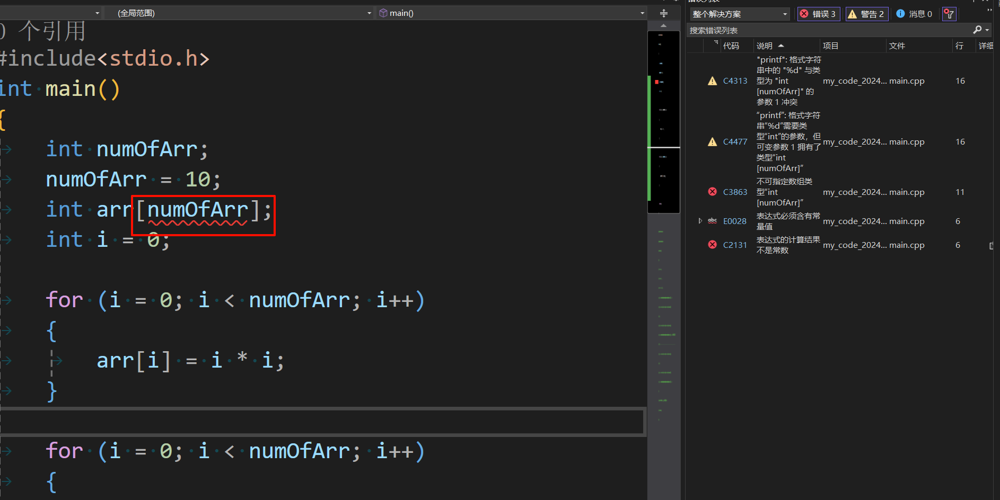

**叠甲：以下文章主要是依靠我的实际编码学习中总结出来的经验之谈，求逻辑自洽，不能百分百保证正确，有错误、未定义、不合适的内容请尽情指出！**

[TOC]

>   概要：...

# 1.数组是什么

简单来说，数组是一组相同类型元素的集群，是一种组织数据用的数据结构。可以让用户在使用大量相同数据的情况下，能用更高的数据组织能力。

# 2.数组的使用

## 2.1.一维数组

```cpp
// 数组的语法形式
类型 数组名 [常量] = { 元素1, 元素2, ... };
```

>   补充：`[]` 里的量在 `C99` 标准下是可以为变量的（我们当前讲的语法大都使用 `C89`），但这种情况下创建的数组时候不能进行初始化，且创建好变量的值后，也不能再次修改数组大小了（无法二次修改），由于 `VS2022` 中没有对该特性的支持（从这里也可以看出，不是所有的标准都需要遵守的，编译器需要根据自己的实际情况来实现标准），因此我们可以使用 `gcc` 编译器来演示（涉及到的 `Linux` 代码您可以以后再来了解）。
>
>   对于下面代码在 `VS2022` 和 `gcc` 上的反应不同...
>
>   ```cpp
>   // 带有变长数组的代码
>   #include <stdio.h>
>   int main()
>   {
>   	int numOfArr;
>   	numOfArr = 10;
>   	int arr[numOfArr];
>       int i = 0；
>   
>       for (i = 0; i < numOfArr; i++)
>   	{
>   		arr[i] = i * i;
>   	}
>   
>   	for (i = 0; i < numOfArr; i++)
>   	{
>   		printf("%d ", arr[i]);
>   	}
>   
>   	return 0;
>   }
>   ```
>
>    
>
>   ```shell
>   # 尝试更换为 gcc 编译器
>   $ vim test.c # 编辑代码文件
>   $ cat test.c # 查看代码内容
>   #include <stdio.h>
>   int main()
>   {
>   	int numOfArr;
>   	numOfArr = 10;
>   	int arr[numOfArr];
>   	int i = 0;
>   	
>   	for (i = 0; i < numOfArr; i++)
>   	{
>   		arr[i] = i * i;
>   	}
>   
>   	for (i = 0; i < numOfArr; i++)
>   	{
>   		printf("%d ", arr[i]);
>   	}
>   
>   	return 0;
>   }
>   
>   $ gcc -v # 查看编译器版本
>   Using built-in specs.
>   COLLECT_GCC=gcc
>   COLLECT_LTO_WRAPPER=/usr/libexec/gcc/x86_64-redhat-linux/4.8.5/lto-wrapper
>   Target: x86_64-redhat-linux
>   Configured with: ../configure --prefix=/usr --mandir=/usr/share/man --infodir=/usr/share/info --with-bugurl=http://bugzilla.redhat.com/bugzilla --enable-bootstrap --enable-shared --enable-threads=posix --enable-checking=release --with-system-zlib --enable-__cxa_atexit --disable-libunwind-exceptions --enable-gnu-unique-object --enable-linker-build-id --with-linker-hash-style=gnu --enable-languages=c,c++,objc,obj-c++,java,fortran,ada,go,lto --enable-plugin --enable-initfini-array --disable-libgcj --with-isl=/builddir/build/BUILD/gcc-4.8.5-20150702/obj-x86_64-redhat-linux/isl-install --with-cloog=/builddir/build/BUILD/gcc-4.8.5-20150702/obj-x86_64-redhat-linux/cloog-install --enable-gnu-indirect-function --with-tune=generic --with-arch_32=x86-64 --build=x86_64-redhat-linux
>   Thread model: posix
>   gcc version 4.8.5 20150623 (Red Hat 4.8.5-44) (GCC) 
>   
>   $ gcc test.c # 使用 gcc 默认标准进行编译, 或者使用 gcc test.c -std=c99 以 C99 标准编译代码生成 a.out 文件
>   $ ./a.out # 运行可执行文件
>   0 1 4 9 16 25 36 49 64 81 
>   ```

数组有很多种初始化方式，您在编写有关数组的代码次数变多时就可以自然记住...

```cpp
// 不完全初始化
int arr1[10] = { 1, 2, 3 }; // 数组的大小为 10, 但是只存了 3 个元素, 其他 7 个元素默认为 '\0'
char arr2[11] = { 'A', 'b' }; // 存放单个字符
char arr3[30] = "abcdef"; // 存放一个字符串
```

```cpp
// 完全初始化
int arr4[] = {1, 3, 2, 9}; // 没有指定大小就初始化, 会根据初始化元素的多少, 默认为该数组大小, 本例为 4
char arr5[3] = { 'A', 'c', 'E' };
```

可以利用 `[]`，即下标引用操作符来访问数组的元素，进而使用数组来存储不同的值。

>   注意：这个 `[]` 和前面数组创建中使用的 `[]` 不是一个东西，前者为运算符，后者为一种语法形式，因此前者内部可以放变量，和前面数组初始化不能放变量，只允许放常量或常量字面量。

数组的每个元素都有下标，下标从 `0` 开始数起，比如：`arr[2]` 访问的是数组的第三个元素，这点要尤其注意！！！

```cpp
// 利用循环访问每一个数组元素, 并且打印出来
#include <stdio.h>
int main()
{
    int arr[8] = { 1, 2, 4, 3, 6, 7, 9, 0 };
    for(int i = 0; i < 10; i++)
    {
        printf("%d", arr[i]);
    }
    return 0;
}
```

普通的变量存储在内存当中，那么一维数组在内存中是怎么存储的呢？

```cpp
// 一维数组在内存中的存储
#include <stdio.h>
int main()
{
    int arr[10] = {0};
    int i = 0;
    int sz = sizeof(arr) / sizeof(arr[0]); // 利用操作符 sizeof 计算数组的大小
    for(i = 0; i < sz; ++i)
    {
        printf("&arr[%d] = %p\n", i, &arr[i]); // 打印每一个元素的地址
    }
    return 0;
}
```

可以看到数组元素的地址是连续存储的（每个地址差值都是 `8`，刚好就是 `64` 位下 `int` 的大小，如果是 `32` 位环境，间隔就会是 `4`），并且是从低地址到高地址进行存储的。因此我们可以通过一个数组的元素的地址“顺藤摸瓜”到其他元素地址，进而使用同一个数组里其他的元素，所以一种比较“另类”的遍历方法是使用指针进行遍历。

```cpp
// 利用循环访问每一个数组元素, 并且打印出来
#include <stdio.h>
int main()
{
    int arr[8] = { 1, 2, 4, 3, 6, 7, 9, 0 };
    for(int i = 0; i < 10; i++)
    {
        printf("%d", *(arr + i));
    }
    return 0;
}
```

实际上，上述例子中，在打印语句中的 `arr` 代表的是数组首元素 `arr[0]` 的地址，对地址进行 `+1` 是会根据类型来进行偏移的，由于 `arr[0]` 是 `int` 类型，因此偏移到下一个存储 `int` 的地址。再次进行解引用就会得到下一个数组元素，直到 `i==9` 时循环结束。

## 2.2.二维数组

二维数组经常被假想为一个表格，也是数学中的矩阵。类似于一维数组的创建和初始化，下面是二维数组的两种等价写法：

```cpp
// 二维数组
int arr1[2][3] = { { 1, 2, 2 }, { 3, 2, 4 } }
int arr2[2][3] = { 1, 2, 2, 3, 2, 4 }
int arr3[][4] = { { 2, 3 }, { 4, 5 } }; // 二维数组如果有初始化, 行可以省略, 列不能省略
```

为什么二维数组的初始化中，行可以省略，列不能省略呢？如果我们忽略行数，在后面进行初始化的时候，编译器可以根据列数来推断一行有多少个元素，最终自动推导出初始化后的行数。但如果忽略列数，只知道行数，或者干脆两者都忽略，就会导致编译器无法推断一行有多少个元素，进而无法确认一个数组需要提前创建多少空间来存储数据。

```cpp
// 错误的二维数组初始化
int arr[3][] = { 1, 2, 3, 4, 5 }; // 到底是哪些元素构成第一行、第二行、第三行呢？编译器推断不出来, 只知道行数没什么用, 最重要的是知道列数
```

而对于二维数组的理解，我希望您不要认为是一个数学矩阵，而应该理解为现在有一个数组 `arr`，内部每个元素都是个等长的一整个数组。因此，二维数组其实只是个一维数组，我们可以下面的方式，来尝试遍历二维数组。

```cpp
// 遍历二维数组进行赋值和打印
#include <stdio.h>

int main() // 访问二维数组的元素, 并且赋值, 再打印
{
    int arr[3][4] = {0};

    int i = 0;
    for(i=0; i<3; i++)
    {
        int j = 0;
        for(j = 0; j < 4; j++)
        {
            arr[i][j] = i * 4 + j; // 赋值
        }
    }

    for(i = 0; i < 3; i++)
    {
        int j = 0;
        for(j = 0; j < 4; j++)
        {
            printf("%d ", arr[i][j]); // 打印
        }
    }
    return 0;
}
```

而辅佐我们证明二维数组只是一个普通的另外一个证明，就是查看二维数组存储的每个元素的地址。由于一维数组存储数据的地址是连续的，那么二维数组存储多个一维数组的话，其每个元素的地址也应该是连续的。

```cpp
// 而二维数组的元素地址分布
#include <stdio.h>

int main()
{
    int arr[3][4];

    int i = 0;

    for(i = 0; i < 3; i++)
    {
        int j = 0;
        for(j = 0; j < 4; j++)
        {
            printf("&arr[%d][%d] = %p\n", i, j, &arr[i][j]);
        }
    }
    return 0;
}
```

因此其实二维数组看似是多行多列的，但其内存分布也是连续存储的，地址由低到高。

>   注意：不同环境不同时间下，地址值结果是不同的，但都是连续的。

## 2.3.多维数组

如果我们能够理解一个二维数组的元素是多个一维数组，那么理解高纬度的数组就不成问题。

```cpp
int main() {
    int a[2][3][4] = 
    {
        {
            { 6, 2, 3, 4 }, 
            { 5, 11, 15, 8 },
            { 8, 20, 10, 11 } 
        }, 
        { 
            { 0, 0, 3, 4 }, 
            { 5, 0, 7, 8 }, 
            { 8, 1, 18, 31 } 
        },
        { 
            { 1, 0, 8, 4 }, 
            { 5, 2, 0, 0 }, 
            { 7, 1, 21, 3 } 
        } 
    };
}
```

# 3.数组的越界

数组的下标是有范围的，如果数组有 `n` 个元素，那么下标从 `0` 开始，最多到 `n-1`，访问的时候不可以超出这个范围，不然就非法访问数组了，即所谓的 **数组越界**。

```cpp
// 数组的越界
#include <stdio.h>
int main() {
    int arr[5] = { 1, 2, 3, 4, 5 };
    printf("%d\n", arr[5]); // 这里发生了越界
    return 0;
}
```

尤其注意的是，`C` 语言本身并不会对数组下标合法性进行检查的（尽管有的编译器能检查出来），编译器也不一定报错，但是不报错不意味着程序是正确的，写代码的时候就需要做好数组访问是否越界的检查。

# 4.数组的类型

去掉数组名字后剩下的东西就是数组的类型，实际上其他的变量也是类似的。

```cpp
int a = 10; // 去掉名字 a，剩下 int 就是类型
```

```cpp
int arr[10] = { 1, 2, 5, 3, 1}; // 去掉名字 arr，剩下的 int [10] 就是数组的类型
```

因此我们可以使用数组的类型作为函数参数，让函数来处理数组。我们来尝试写一个冒泡排序函数。

冒泡排序是一种简单的排序算法，其基本思想是通过多次遍历列表，逐步将未排序部分中的最大（或最小）元素移到已排序部分的末端。具体步骤如下：

1.  **比较相邻元素**：从列表的第一个元素开始，依次比较相邻的两个元素。
2.  **交换位置**：如果前一个元素比后一个元素大（对于升序排序），则交换这两个元素的位置。
3.  **重复操作**：对每一对相邻元素进行上述比较和交换操作，完成一遍遍历后，列表中最大的元素会“冒泡”到列表的末端。
4.  **忽略最后元素**：在下一次遍历时，忽略已经排好序的最后一个元素。
5.  **重复步骤1-4**：重复上述步骤，直到整个列表都排好序。

假设我们要对列表 `[5, 3, 8, 4, 2]` 进行升序排序，具体操作如下：

*   **第一轮遍历**：
    *   比较 `5` 和 `3`，因为 `5 > 3`，交换位置，列表变为 `[3, 5, 8, 4, 2]`。
    *   比较 `5` 和 `8`，不交换位置，列表仍为 `[3, 5, 8, 4, 2]`。
    *   比较 `8` 和 `4`，因为 `8 > 4`，交换位置，列表变为 `[3, 5, 4, 8, 2]`。
    *   比较 `8` 和 `2`，因为 `8 > 2`，交换位置，列表变为 `[3, 5, 4, 2, 8]`。
    *   第一轮结束后，最大的元素 `8` 移动到列表末尾。
*   **第二轮遍历**：
    *   比较 `3` 和 `5`，不交换位置，列表仍为 `[3, 5, 4, 2, 8]`。
    *   比较 `5` 和 `4`，因为 `5 > 4`，交换位置，列表变为 `[3, 4, 5, 2, 8]`。
    *   比较 `5` 和 `2`，因为 `5 > 2`，交换位置，列表变为 `[3, 4, 2, 5, 8]`。
    *   第二轮结束后，次大的元素 `5` 移动到倒数第二位。
*   **第三轮遍历**：
    *   比较 `3` 和 `4`，不交换位置，列表仍为 `[3, 4, 2, 5, 8]`。
    *   比较 `4` 和 `2`，因为 `4 > 2`，交换位置，列表变为 `[3, 2, 4, 5, 8]`。
    *   第三轮结束后，第三大的元素 `4` 移动到倒数第三位。
*   **第四轮遍历**：
    *   比较 `3` 和 `2`，因为 `3 > 2`，交换位置，列表变为 `[2, 3, 4, 5, 8]`。
    *   第四轮结束后，整个列表已经排好序。

```cpp
// 使用冒牌排序函数排序数组, 使数组元素按照升序排序(有问题的代码)
void Sort(int arr[]) // 两两相邻元素进行比较，n 个数需要重复 n-1 次冒泡排序
{
    int i = 0;
    int sz = sizeof(arr) / sizeof(arr[0]); // 确定使用冒泡排序的次数
    for(i = 0; i < sz - 1; i++) // 循环使用冒泡排序
    {
        int j = 0;
        for(j = 0; j < sz - i - 1; j++) // 先看内循环, 内循环循环一次就是一次冒号排序
        {
            if(arr[j] > arr[j + 1])
            {
                int num = arr[j];
                arr[j] = arr[j + 1];
                arr[j + 1] = num;
            }
        }
    }
}

int main()
{
    int arr[] = { 3, 4, 1, 6, 8, 9, 6, 8, 9, 7, 0 };
    
    // 排序为升序
    Sort(arr);
    int i = 0;
    for(i = 0; i < sizeof(arr) / sizeof(arr[0]); i++)
    {
        printf("%d", arr[i]);
    }

    return 0;
}
```

上面的代码其实是有问题的，数组传参的时候，实际上是把数组的首元素地址传过去了，并不是整个数组，因此计算出 `sizeof(arr)` 的值是 `4`，仅仅是 `int*` 指针的大小。

为什么 `C` 语言要这么做呢？这是因为在 `C` 语言的设计中，数组名在某些表达式中会被隐式地转换为指向其第一个元素的指针，这样做的好处是避免了在函数调用时复制整个数组的开销，尤其是在处理大型数组时，这样的复制开销将会很大。

因此函数参数这里写 `int arr[]` 和 `int* arr` 的写法是等价的。

>   警告：但有两个例外，数组名不是首元素地址。
>
>   -   `sizeof(数组名)` 这里的数组名表示整个数组，计算的是整个数组的大小
>   -   `&数组名` 这里取出来的是整个数组的地址，尽管它的值和数组的首元素地址相同，但两者是有区别的
>
>   你先记住即可...

```cpp
// 两两相邻元素比较，n个数需要重复n-1次冒泡排序(没问题的代码)
#include <stdio.h>

void function(int* arr, int sz)//前者为首元素地址，后者是数组的个数
{
    int i = 0;
    for (i = 0; i < sz - 1; i++)//循环使用冒泡排序
    {
        int j = 0;
        for (j = 0; j < sz - i - 1; j++)//一次冒号排序，每次排序后就不用排最后一个数字了，所以-i
        {
            if (arr[j] > arr[j + 1])
            {
                int num = arr[j];
                arr[j] = arr[j + 1];
                arr[j + 1] = num;
            }
        }
    }
}

int main()
{
    int arr[] = { 3, 4, 1, 6, 8, 9, 6, 8, 9, 7, 0 };
    
    // 排序为升序
    int sz = sizeof(arr) / sizeof(arr[0]); // 放置到这里计算了
    function(arr, sz);

    int i = 0;
    for (i = 0; i < sizeof(arr) / sizeof(arr[0]); i++)
    {
        printf("%d ", arr[i]);
    }

    return 0;
}
```

# 5.数组和字符

前面其实有提到过，字符串的每一个字符可以在存储数组中，因此包含 `\0` 这个特殊的结束字符，但是这里需要注意一些问题。

1.   用数组存储字符串后，使用 `sizeof()` 计算数组的大小会多 `1`，因为多了一个特殊字符 `\0`

     ```cpp
     // 使用 sizeof()
     #include <stdio.h>
     int main()
     {
         char arr[] = "abcd";
         char arr_1[] = { 'a', 'b', 'c', 'd' };
         printf("%zd %zd", sizeof(arr), sizeof(arr_1));
         return 0;
     }
     ```

2.   使用数组存储字符串或直接存储多个单字符是，使用 `strlen()` 则后者会打印打印随机值，因为 `strlen()` 需要靠 `\0` 来结束。

     ```cpp
     // 使用 strlen() 
     #include <stdio.h>
     #include <string.h>
     
     int main()
     {
         char arr_1[] = "abcd";
         char arr_2[] = { 'a', 'b', 'c', 'd' };
         printf("%d %d", strlen(arr_1), strlen(arr_2));
         return 0;
     }
     ```

3.   字符串存储和多单字符存储，转化说明 `%s` 输出时，后者产生乱码，原因也是后者缺少 `\0`

     ```cpp
     // 使用 %s 输出字符串
     #include <stdio.h>
     
     int main()
     {
         char arr[] = "abcd";
         char arr_1[] = { 'a', 'b', 'c', 'd' };
         printf("%s %s", arr, arr_1);
         return 0;
     }
     ```

---

>   结语：...

# 
