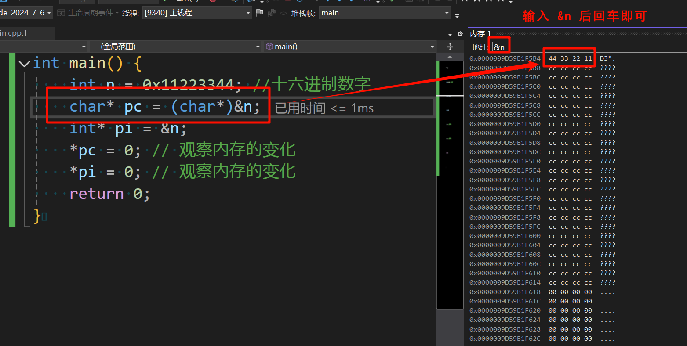
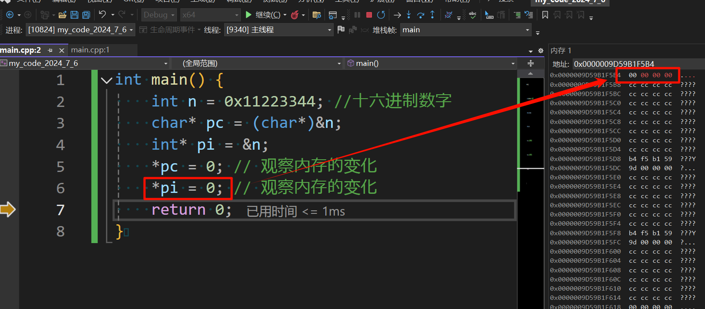

**叠甲：以下文章主要是依靠我的实际编码学习中总结出来的经验之谈，求逻辑自洽，不能百分百保证正确，有错误、未定义、不合适的内容请尽情指出！**

[TOC]

>   [!NOTE]
>
>   概要：...

> [!NOTE]
>
> 资料：...

---

指针是 `C` 语言最精华的部分之一，个人认为指针给程序员最大的作用就是“启发”。也就是对计算机现象和计算机原理的一些启发，通过学习指针，能够理解很多 `C` 以外的知识。有很多晦涩难懂的计算机知识可以使用指针模拟出来。

一般来讲在计算机科学中，指针 `Pointer` 是指用来存储内存地址的变量，全称指针变量。

关于指针的使用和理解，其实我们前面就接受过很多了，这里我只是稍微带您复习一下，我们重点是来讲解

>   [!IMPORTANT]
>
>   补充：有些人对于编程已经习惯了，会认为地址值也是指针，但是这种就根据上下文推断即可，因为不会太过于影响程序员之间对于指针的交流。

# 1.指针的内存变化

使用指针有时就需要和内存地址中的数据打交道，`VS2022` 就提供了内存窗口，在调试的时候可以打开这个内存窗口（如何打开可以看本系列的最后一篇博文《C 语言调试技巧》）。

使用不同类型的指针进行解引用，本质是对不同地址进行不同范围的访问（也就是允许在不同字节内的访问权限）。

```cpp
// 使用不同类型的指针进行解引用, 并且尝试直接修改内存里的值
int main() {
    int n = 0x11223344; // 十六进制数字
    char * pc = (char*)&n;
    int *pi = &n;
    *pc = 0; // 观察内存的变化
    *pi = 0; // 观察内存的变化
    return 0;
}
```






因此从这里我们可以看出很重要的两点：

-   指针值决定了指针发生解引用的首地址
-   指针类型决定了对指针解引用的范围/权限

从而通过解引用能够从起始地址开始操作权限范围内的比特位。

# 2.指针的运算操作

## 2.1.指针加减运算

在加减时会根据不同的指针类型得到不同的地址，和上述内存变化中类似，指针类型决定了加减的字节个数。

```cpp
// 尝试指针加减运算
#include <stdio.h>

int main() {
	int n = 10;
	char* pc = (char*)&n; // 将 int *类型的指针强制转化为 char* 类型
	int* pi = &n; // 指向类型和指针类型一一对应

	printf("%p\n", pc);
	printf("%p\n", pc + 1);
	printf("%p\n", pi);
	printf("%p\n", pi + 1);

	return 0;
}
```

可以看到指针类型决定了指针向前和向后的步长有多大。

## 2.2.指针互减运算

同类型的指针互减可以得到中间总共有多少个同指针类型的值，这在数组中有时非常有用。

```cpp
// 尝试指针互减运算
#include <stdio.h>

int main() {
    char arr [] = "abcdef";
    int a = &arr[4] - &arr[1];

    printf("%d", a); // 得到两个指针之间元素的个数为 3

    return 0;
}
```

## 2.3.指针关系运算

规定较高的地址比较低的地址大。

```cpp
// 尝试指针关系运算
#include <stdio.h>
int main() {
	int arr[10] = { 1, 1, 2, 4, 3 };

	if (&arr[3] > &arr[0]) {
		printf("&arr[3] 是高地址\n");
	}

	return 0;
}
```

>   [!IMPORTANT]
>
>   补充：另外标准规定，允许指向数组元素的指针与与指向数组最后一个元素后面的那个内存的指针比较，但是不允许与指向第一个元素之前的那个内存位置的指针进行比较，这种就会产生未定义行为。

# 3.指针的使用坑点

在使用指针的过程中有可能出现 **野指针**，野指针就是指针指向的位置是不明确的不可知的（随机的、不正确的、没有明确限制的）。野指针的成因通常是未初始化和越界访问导致的（还有一种和动态内存管理有关，我暂时不提及）。

```cpp
// 未初始化
#include <stdio.h>
int main() {
	char* a; // 这里只是声明了指针变量, 但没有明确指针指向的数据具体是什么, 只知道该数据是 int 类型

	scanf("%s", a); // scanf() 此时就访问了一个野指针, 由于系统没有分配该指针的写入权限, 这里一旦输入就有可能造成程序奔溃
	printf("%s", a);

	return 0;
}
```

```cpp
// 越界访问
#include <stdio.h>

int main() {
	int arr[4] = { 1, 2, 4, 0 };

	for (int i = 0; i < 10; i++) { // 这里的 4 不小心写出 10 了
		arr[i] = i; // 这里数组就有可能越界访问了, 其结果是未知的, 程序也有可能异常中止
		return 0;
	}
}
```

>   [!NOTE]
>
>   吐槽：空指针是指向 `NULL` 的指针，表示不指向任何有效内存地址，使用安全；野指针是指向已释放或无效内存的指针，使用危险，可能导致程序崩溃或数据损坏。

# 4.指针与数组关系

实际上指针和数组的关系十分密切，但不是同一个东西。首先最直接的一个关系是，数组的首元素在使用的过程中会被转化为首元素的地址，无论是值还是类型都和首元素一样。

```cpp
// 观察数组名转化为首元素地址的现象
#include <stdio.h>

int main() {
	int arr[10] = { 1, 2, 3, 4, 5, 6, 7, 8, 9, 0 };

	printf("%p\n", arr);
	printf("%p\n", &arr[0]);

	printf("%p\n", arr + 1);
	printf("%p\n", &arr[1]);

	printf("%d\n", *arr);
	printf("%d\n", *(&arr[0]));

	return 0;
} // 打印的结果是一样的，因此我们可以得出一个结论: 数组名在使用的时候被转化位首元素地址, 无论是值还是类型在转化后和数组首元素地址是一样的
```

>   [!CAUTION]
>
>   警告：但是有两种情况下，不会发生上述的数组名到首元素地址的转化。
>
>   -   `sizeof(数组名)`
>   -   `&数组名`
>
>   这两种情况中，`sizeof(数组名)` 得到的就是数组存储字节的总个数，`&数组名` 得到的就是单纯和首元素地址相同的地址值（但是指针类型不同），没有发生任何转化。

# 5.指针的拓展概念

## 5.1.多维指针

是变量就需要开拓一块内存来使用，每块内存都需要一个地址来维护。因此只要是变量就会有地址，而指针变量也是一种变量，所以指针变量也有地址，那么一个一级指针变量的地址应该存放在一个什么样的指针类型变量里呢？答案是使用二级指针这种多级指针，同理也有三级、四级、五级等指针（不过一般只会用到二级指针）。

```cpp
// 尝试使用多级指针
#include <stdio.h>

int main() {
    int a = 10;
    int* pa = &a;
    int** ppa = &pa;
    printf("a == %d\n", a); // 10
    printf("*pa == %d\n", *pa); // 10
    printf("**ppa == %d\n", **ppa); // 10
    return 0;
}
```

## 5.2.指针数组

顾名思义，是一个数组，每个数组元素都是“一个指针变量”。

```cpp
// 尝试使用指针数组
#include <stdio.h>

int main() {
	int a = 1;
	int b = 9;
	int c = 4;
	int d = 6;
	int* arr[4] = { &a, &b, &c, &d };

	for (int i = 0; i < 4; i++) {
		printf("*%p == %d\n", arr[i], *arr[i]);
	}

	return 0;
}
```

## 5.3.数组指针

顾名思义，是一个指针，这个指针存放的是“整个数组的地址”

```cpp
// 尝试使用数组指针
#include <stdio.h>

int main() {
	int arr[3] = { 6, 2, 3 }; // 实际上任何一个变量只要删去变量名, 剩下的就是变量的类型, 因此这个数组变量的类型就是 int [3]
	int(*p1)[3] = &arr; // 故数组的指针类型就是 (int [3])* 但是由于 C 语言中编译器实现的原因, 只能写作 int(*)[3], 使用 &arr 就可以取出整个数组的地址存储进 p1 变量了
	printf("%p\n%p\n", p1, p1 + 1); // 根据指针的运算, 要根据类型的大小进行加减, 因此这里 p1+1 就会跳过一整个数组的大小得到一个新地址

	int(*p2)[3] = (p1 + 1);
	printf("%zd", p2-p1); // 得到 int()[3] 中有 1 个 int [3] 类型的数据, 也就是一个 arr 数组

	return 0;
}
```

>   [!WARNING]
>
>   注意：这部分指针的进阶知识我后续还有一个博文会更加深入，这里就先能理解多少是多少...

---

>   [!NOTE]
>
>   结语：...


