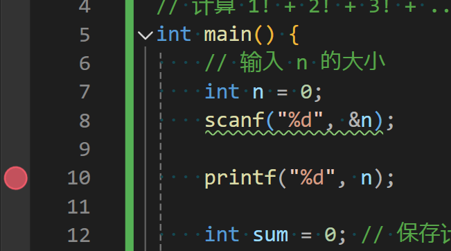
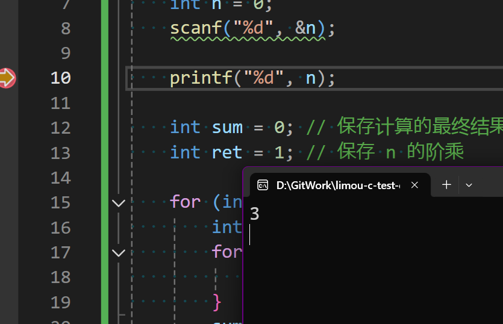
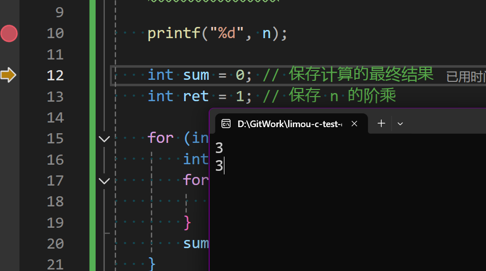
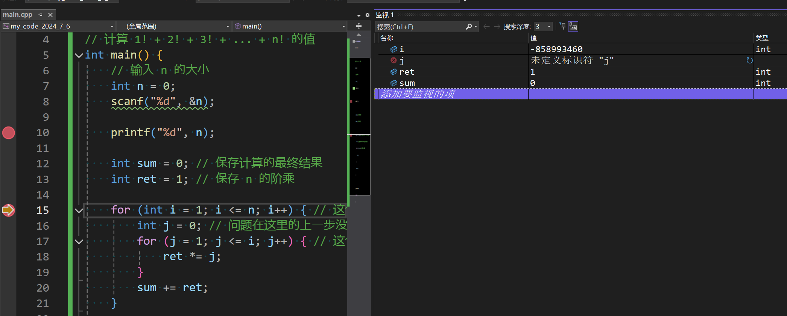
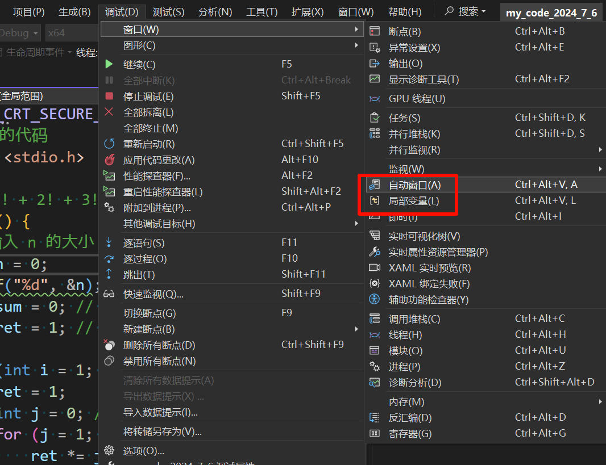
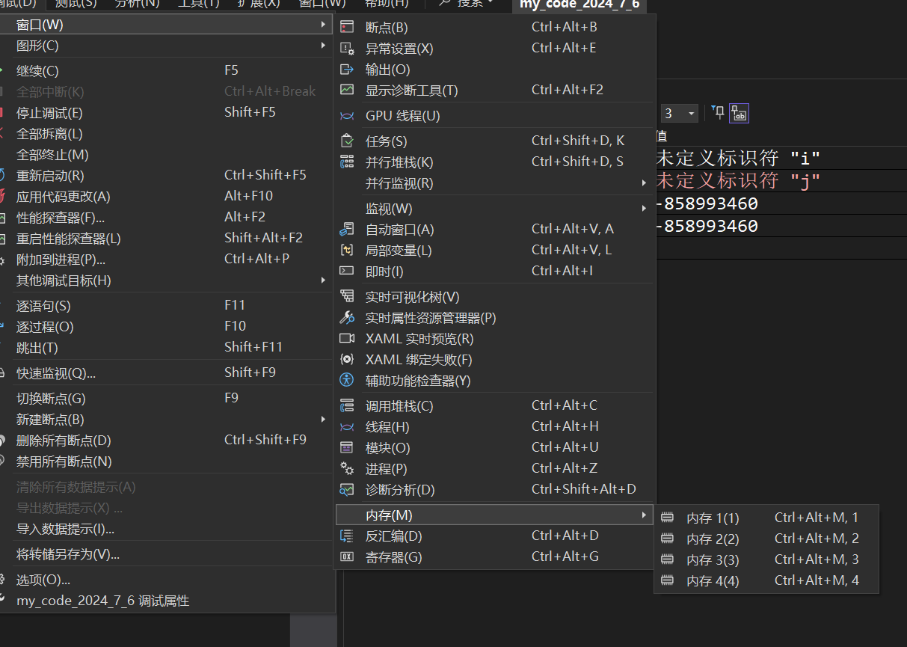
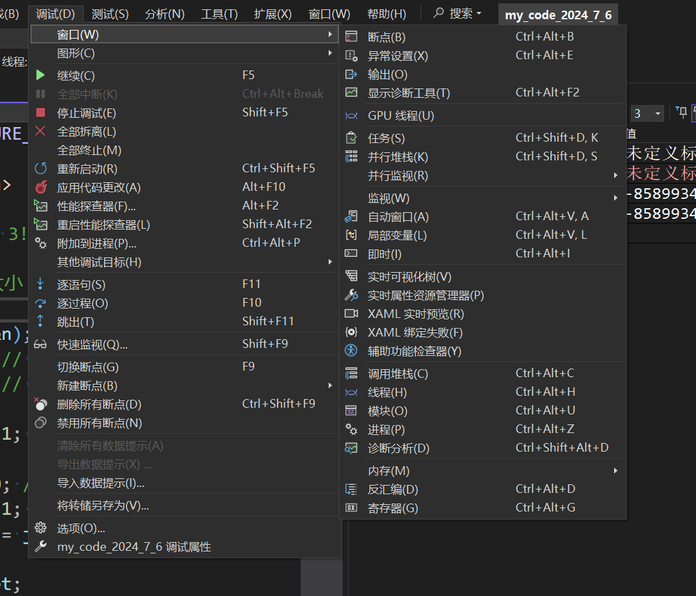
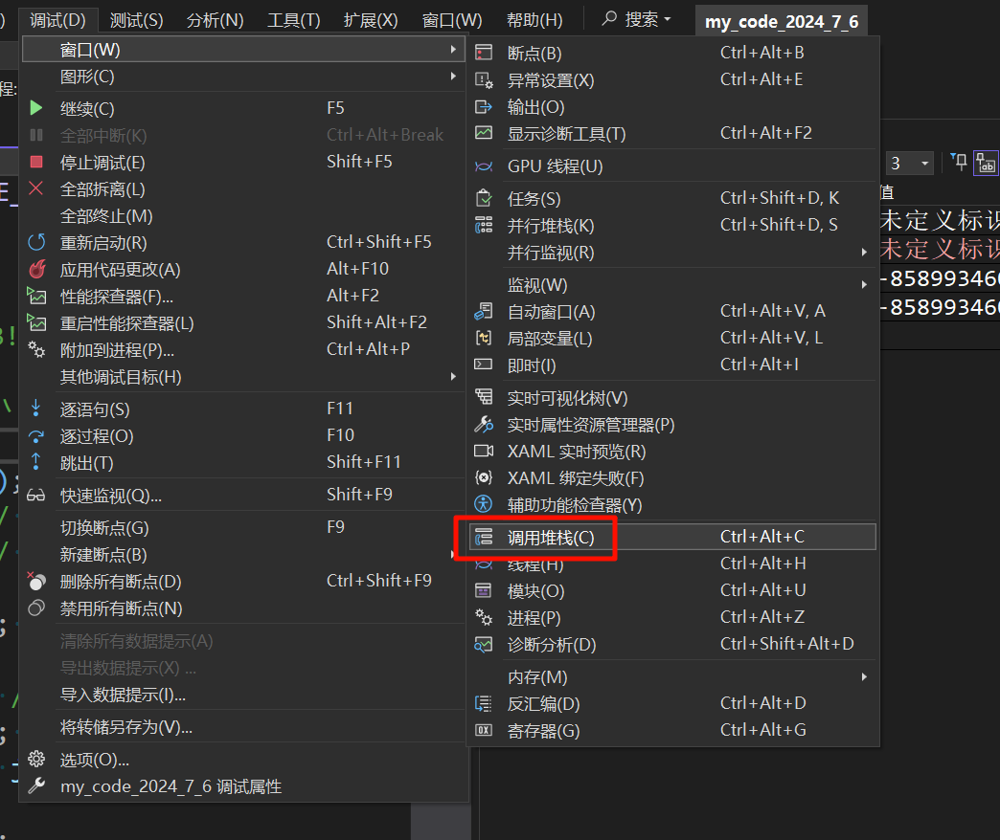
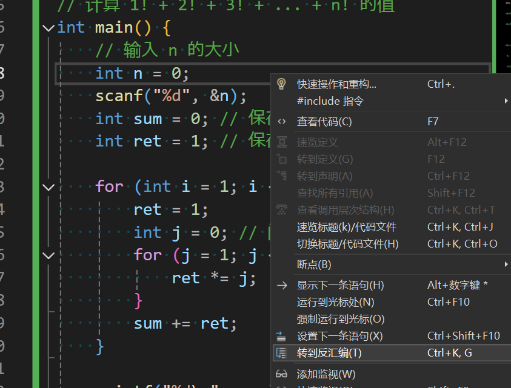
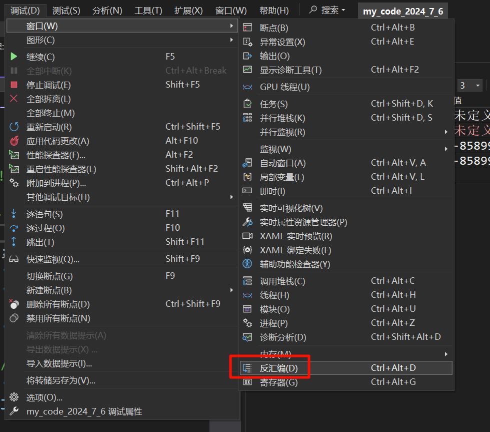

**叠甲：以下文章主要是依靠我的实际编码学习中总结出来的经验之谈，求逻辑自洽，不能百分百保证正确，有错误、未定义、不合适的内容请尽情指出！**

[TOC]

>   概要：...

>   资料：...

---

# 1.bug 是什么

关于 `Bug` 的来源，这个故事很多人都知道：“`1949 年 9 月 9 日`，我们晚上调试机器的时候，开着的窗户没有纱窗，机器闪烁的亮光几乎吸引来了世界上所有的虫子。果然机器故障了，我们发现了一只被继电器拍死的飞蛾，翅膀大约 `4 英寸`。”

第一次被发现的导致计算机错误的飞蛾，也是第一个计算机程序错误，而 `bug` 这个名词也被延用至今。

# 2.debug 是什么

调试又称除错，是发现和减少计算机程序或电子仪器设备中程序错误的一个过程，调试的基本步骤如下：

1.   编码开发过程中、项目运行过程中发现有错误的存在
2.   以隔离、消除等方式对错误进行定位，比对上一次没有 `bug` 的版本查看差异
3.   分析代码，确定错误产生的原因
4.   提出纠正错误的解决办法
5.   对程序错误予以改正，重新进行测试
6.   总结错误的原因，避免下次再犯

>   补充：拒绝迷信调试，最好每次出现 `BUG` 都解析到底，不要忽略每一处的细节...

# 3.两种模式的区别

在 `VS2022` 中，其实有两种编译代码的形式：

*   `Debug` 称为“调试版本”，它包含调试信息，并且不作任何优化，便于程序员调试程序，但体积会因为携带调试信息而变得较大。
*   `Release` 称为“发布版本”，它往往对代码进行了各种优化，使得最后生成的可执行程序在代码大小和运行速度上都是较优的，以便用户很好地使用。

而两种模式具体的区分如下：

*   **文件区别**：`debug` 和 `release` 模式下，会在 `VS` 项目文件里面各自生成一个 `debug` 和 `Release` 文件
*   **反汇编区别：** 他们两个的反汇编代码有着明显差别，一般来说 `Debug` 比 `Release` 多，因为没有经过
*   **内存区别：** 由于 `debug` 模式下的可执行文件中包含了调试信息，所以大小会比 `release` 模式下的可执行文件要大
*   **应用区别：** `debug` 主要用于程序员调试，`release` 主要交予测试员和用户使用
*   **运行区别：** `release` 会在一定程度上对代码进行优化，极少数情况会出现与 `debug` 模式不符和的结果

在 `VS2022 x86` 环境中，下述代码的运行在 `Debug` 和 `Release` 两种模式下运行结果可能不同（如果您没有重现这个错误，可以尝试使用版本更老的 `VS`，当然如果嫌麻烦，简单看一下就行...）

```cpp
// 一份故意越界的代码
#include <stdio.h>
int main()
{
    int i = 0;
    int arr [10] = {0};
    for(i = 0; i <= 12; i++)
    {
        arr [i] = 0;
        printf("hehe\n");
    }
    return 0;
}
```

# 4.IDE 调试介绍

`Linux` 中的调试工具是 `gdb`，而 `Windows` 下的 `VS` 以强大的调试界面闻名，并且该 `IDE` 也在不断增强现代化（2024-6-6）。

## 4.1.模式调整

必须要在 `Debug` 模式中进行一次编译，才能使用 `VS` 的调式功能开始调试代码，无法通过编译的代码是无法进行调试的。

## 4.2.基础调试

*   `[F9]` 创建/取消断点，断点可以使程序执行到在想要的停止的位置，继而一步步执行下去（这在循环语句中尤其好用，无需进入大量循环）
*   `[ctrl+F9]` 停用断点
*   `[ctrl+shift+F9]` 删除全部断点
*   `[F5]` 启动调试，经常用来直接跳转到代码的第一个断电/下一个断点之处
*   `[shift+F5]` 取消调试，想退出调试的时候可以用这个功能停止调试
*   `[ctrl+F5]` 直接运行程序，程序直接跑起来而不进行调试，这个我们以前经常使用
*   `[ctrl+shift+F5]` 重新启动调试，就是上面两个快捷键的结合版
*   `[F10]` 逐过程调试，通常用来执行一个过程，一个过程可以是一次函数调用或者一条完整语句，无需进入过程细节
*   `[F11]` 逐语句调试，就是每次都执行语句，这个快捷键可以使得我们的执行逻辑进入函数内部，执行调试比较细一点
*   `[ctrl+F10]` 调试跳转到光标处，也是一种断点调试，但是是根据光标位置进行跳转

>   补充：还有一些比较有用的快捷键，但是和调试没什么关系，这里可以给您提及一下...
>
>   -   `[ctrl+u/ctrl+shift+u]` 把选中的字符串进行小写/大写
>   -   `[ctrl+shift+v]` 唤出内部剪贴板  
>   -   `[ctrl+g]` 跳转到某个代码行
>   -   `[ctrl+<-/->]` 跳过一个单词
>   -   `[shift+alt]` 矩形文本选框
>   -   `[tab+tab]` 快速编写代码

## 4.3.进阶调试

### 4.3.1.监视窗口

求 `1！+2！+3！ ...+ n!` 的值，不考虑溢出。

```cpp
// 待调试代码
#include <stdio.h>

// 计算 1! + 2! + 3! + ... + n! 的值
int main() {
    // 输入 n 的大小
    int n = 0;
    scanf("%d", &n);

    int sum = 0; // 保存计算的最终结果
    int ret = 1; // 保存 n 的阶乘

    for (int i = 1; i <= n; i++) { // 这个循环把 1! 和 2! 和 3! ... j! ... n! 加起来
        int j = 0; // 问题在这里的上一步没有把 ret 重新置为 1, 但是假设您遗忘了
        for (j = 1; j <= i; j++) { // 这个循环把 j! 计算出来
            ret *= j;
        }
        sum += ret;
    }
    
    printf("%d\n", sum);
    return 0;
}
```

先使用 `printf()` 打印以下读取到的 `n` 值是否正常，并且打上断点。使用快捷键 `[F5]` 打开 `debug` 模式，会一直跳转到 `printf()` 代码的执行（但是由于 `scanf()` 需要读取一个数才能一次性走到 `printf()`）。





此时就停到执行 `printf()` 之前的地方，接下来按 `[F10]` 就可以执行 `printf()` 打印之前 `n` 此时的值。



因此 `n` 的读取没有出错，还有一种检查方法就是打开监视窗口，点击 `添加要监视的项` 添加要监视的变量。


再考虑在循环处打一个断点再执行 `[F5]` 走到 `for` 之前的代码处。代码的主要逻辑就在循环这里，因此很可能在这里出错。然后把之前检查的 `n` 项去除（选中然后使用 `[delete]` 即可去除），并且把之前测试 `n` 用的 `printf("%d", n)` 也删除掉，重新添加 `i, j, ret, sum` 四个变量的检查项。



然后不断点击 `[F10]` 观察四个变量在循环的过程中的变化，可以观察到每次内循环执行结束后，由于 `ret` 是一个较大域的变量，因此会保持上一次内循环执行的结果，然后参与下一次内循环的运行结果。

因此需要在每次执行内循环之前，将 `ret` 重新置为 `1`，改正代码如下。

```cpp
// 更改后的代码
#include <stdio.h>

// 计算 1! + 2! + 3! + ... + n! 的值
int main() {
    // 输入 n 的大小
    int n = 0;
    scanf("%d", &n);

    int sum = 0; // 保存计算的最终结果
    int ret = 1; // 保存 n 的阶乘

    for (int i = 1; i <= n; i++) { // 这个循环把 1! 和 2! 和 3! ... j! ... n! 加起来
        ret = 1;
        int j = 0; // 问题在这里的上一步没有把 ret 重新置为 1, 但是假设您遗忘了
        for (j = 1; j <= i; j++) { // 这个循环把 j! 计算出来
            ret *= j;
        }
        sum += ret;
    }

    printf("%d\n", sum);
    return 0;
}
```

>   补充：一个小技巧，如果是监视指针，将格式写为 `指针, 数字` 就可查看该指针后面指针的值。

>   补充：这里在补充一个研究程序死循环/异常终止的代码，您可以尝试一下。
>
>   ```cpp
>   // 供您测试的代码
>   #include <stdio.h>
>   
>   int main() {
>      int i = 0;
>      int arr [10] = {0};
>   
>      for(i = 0; i <= 12; i++)
>      {
>         arr [i] = 0;
>         printf("hehe\n");
>      }
>   
>      return 0;
>   }
>   ```
>
>   这段代码会在数组 `arr` 上进行越界访问，因为其索引 `i` 会达到 `12`（希望您可以通过 `debug` 引发这个问题），而数组的有效索引范围仅从 `0` 到 `9`。在 `debug` 模式下，许多编译器会检查数组边界并可能导致程序崩溃或触发异常。
>
>   在 `release` 模式下，由于优化，程序的行为可能不那么可预测，有时可能不会立即显示出错误。但无论如何，数组越界都是不安全的，应该避免。

>补充：自动窗口和局部变量也可以达到监视窗口的目的，不过比较自动（自动显示需要显示的变量和自动显示当前代码块中的局部变量），灵活性有些不够。
>
>

### 4.3.2.内存窗口

基于上述的基本使用其实就可以解决很多问题了，但是有时需要观察变量在内存中的具体情况，因此就会使用内存窗口，这个窗口我在后续代码中讲解原理时会频繁用到，到那个时候再来详细使用。



### 4.3.3.寄存器窗口

由于 `C/Cpp` 这种编程语言和硬件距离较为接近，因此属于中层偏下的语言，在一些硬件编程（例如单片机编程）中，就有可能需要观察 `CPU` 寄存器的情况，本系列中有机会再使用...



### 4.3.4.调用堆栈窗口

通过调用堆栈可以清晰反应函数的调用关系以及当前调用所处的位置，这个涉及到数据结构的栈，本系列中用到的次数也很少，本系列中有机会再使用...



### 4.3.5.汇编窗口

调试模式开始之后右键代码编辑窗口，选择“转到反汇编”，或者再调试状态下打开反汇编窗口，查看汇编代码通常也是在和硬件打交道较多的场景中使用，本系列中有机会再使用...





# 5.编程常见错误

*   **编译型错误**：直接看 `VS2022` 的错误提示信息或者凭借经验就可以搞定就可以解决的问题，相对来说简单
*   **链接型错误**：看错误提示信息，主要在代码中找到错误信息中的标识符，然后定位问题所在。一般是标识符名不存在或者拼写错误，会出现字眼“无法解析的外部命令”的报错
*   **运行时错误**：在程序的运行过程中出现的错误，只能借助调试，逐步定位问题，最难解决

# 6.编写易于调试代码

## 6.1.优秀代码的基本要求

*   **代码运行正常**：没有导致程序崩溃或异常终止的错误
*   **bug 很少**：代码经过充分测试，减少了潜在的错误
*   **效率高**：代码执行速度快，资源消耗低
*   **可读性高**：代码结构清晰，易于理解
*   **可维护性高**：代码易于修改和扩展
*   **注释清晰**：关键部分有适当的注释，说明代码意图
*   **文档齐全**：提供完整的文档，包括 API 说明、使用指南等

## 6.2.常见的代码编写技巧

*   **使用 assert**：断言用于检查程序运行时的条件是否满足预期
*   **尽量使用 const**：定义常量，防止变量被意外修改
*   **养成良好的编码风格**：遵循一定的命名规范和格式，使代码整洁易读
*   **添加必要的注释**：为关键代码段添加注释，说明其功能和逻辑
*   **避免编码的陷阱**：了解并避免常见的编程错误和陷阱

这里重点来看看 `assert()` 宏函数和 `const` 关键字的使用，来看看两者是如何提高代码健壮性的。

### 6.2.1.assert() 宏函数

`assert()` 是断言宏函数，它用于程序调试阶段，确保程序在开发过程中满足某些条件。如果断言的条件不满足，程序将输出错误信息并终止执行。这有助于开发者发现和修复代码中的错误。

```cpp
// 尝试使用 assert() 宏函数
#include <stdio.h>
#include <assert.h>

int main() {
    int user_input;

    // 提示用户输入一个正整数
    printf("Please enter a positive integer: ");
    scanf("%d", &user_input);

    // 使用 assert() 来验证输入是否为正整数
    assert(user_input > 0);

    // 如果 assert() 通过, 继续执行下面的代码
    printf("You entered the positive integer: %d\n", user_input);

    // 程序的其他部分...

    return 0;
}
```

上述代码中，如果用户输入的是非正整数，就会导致程序提前退出。

### 6.2.2.const 关键字

`const` 关键字用于定义常变量，即一旦初始化后其值不能被修改的变量。它也可以用于指针和函数参数，以保证变量的值在特定上下文中不被改变。

```cpp
// 尝试使用 const 关键字
#include <stdio.h>

int main() {
    const int m = 100;
    const int *p = &m;
    const int **pp = &p;
    int ***ppp = &pp;

    // 下面的代码将导致编译错误, 因为 m 是 const 变量, 不能被赋新值
    // ***ppp = 200;

    printf("%d\n", m);
    return 0;
}
```

再尝试更多对 `const` 关键字的测试。

```cpp
// 更多 const 的测试
#include <stdio.h>

void test1() {
    int n = 10;
    int m = 20;
    int *p = &n;
    *p = 20; // 修改 n 的值, ok
    p = &m;  // p指向新的地址, ok
}

void test2() {
    int n = 10;
    int m = 20;
    const int* p = &n;
    // *p = 20; // 错误, p 指向 const 变量, 不能修改其值
    p = &m; // ok, p可以指向另一个变量
}

void test3() {
    int n = 10;
    int m = 20;
    int *const p = &n;
    *p = 20; // ok, 修改p指向的变量
    // p = &m; // 错误, p 是指向 const 地址的指针, 不能改变其指向
}

int main() {
    test1();
    test2();
    test3();
    return 0;
}
```

## 6.3.尝试编写出优秀代码

再来尝试把 `assert()` 和 `const` 加入到实际的代码中，下面我将带您模拟实现 `strlen()` 和 `strcpy()`。

```cpp
// 模拟实现 strlen() 并加入 assert() 和 const 提高代码健壮性
#include <stdio.h>
#include <assert.h>

int my_strlen(const char *str) {
    int count = 0;
    assert(str);
    while (*str) {
        count++;
        str++;
    }
    return count;
}

int main() {
    int len = my_strlen("abcdef");
    printf("%d\n", len);
    return 0;
}
```

```cpp
// 模拟实现 strcpy() 并加入 assert() 和 const 提高代码健壮性
#include <stdio.h>
#include <assert.h>

void my_strcpy(char *dest, char *src) {
    while (*dest++ = *src++) {
        // Copy src over dst
    }
    *dest = '\0'; // Ensure null-termination
}

/* 或者换一种写法
char *my_strcpy(char *dest, char *src) {
    assert(dest && src);
    char *ret = dest;
    while (*dest++ = *src++);
    return ret;
}
*/
```

>   补充：`VS2022` 编译器库内对于 `strcpy()` 的实现如下。
>
>   ```cpp
>   // 编译器库内对于 strcpy() 的实现之一
>   char *strcpy(char *dst, const char *src) {
>       char *cp = dst;
>       assert(dst && src);
>       while (*cp++ = *src++);
>       return (dst);
>   }
>   ```

---

>   结语：...
