# 1.配置第三方库

## 1.1.使用 CLI 导出导入

待补充...

## 1.2.使用 IDEA 导出导入

待补充...

# 2.使用 Maven 管理项目

`Maven` 是专为 `Java` 设计的项目管理工具，最核心的两个功能就是：

-   如何构建项目工程结构
-   如何管理项目依赖关系

## 2.1.使用 CLI 的 Maven 管理项目

### 2.1.1.配置 Maven 环境

### 2.1.2.创建 Maven 项目

打开终端，运行以下命令创建一个新的 Maven 项目：

```sh
mvn archetype:generate -DgroupId=com.example -DartifactId=my-project -DarchetypeArtifactId=maven-archetype-quickstart -DinteractiveMode=false
```

这会使用 `maven-archetype-quickstart` 原型创建一个新的 Maven 项目，并自动生成 `pom.xml` 文件和基本的项目结构。`Maven` 项目通常包含以下目录结构。

```
my-project/
├── src/
│   ├── main/
│   │   └── java/
│   └── test/
│       └── java/
├── pom.xml
└── README.md
```

### 2.1.3.管理 Maven 项目

编辑 `pom.xml` 文件，设置项目的基本信息、依赖、插件等。例如：

```xml
<project xmlns="http://maven.apache.org/POM/4.0.0"
         xmlns:xsi="http://www.w3.org/2001/XMLSchema-instance"
         xsi:schemaLocation="http://maven.apache.org/POM/4.0.0 http://maven.apache.org/xsd/maven-4.0.0.xsd">
    <modelVersion>4.0.0</modelVersion>
    <groupId>com.example</groupId>
    <artifactId>my-project</artifactId>
    <version>1.0-SNAPSHOT</version>

    <properties>
        <maven.compiler.source>8</maven.compiler.source>
        <maven.compiler.target>8</maven.compiler.target>
        <project.build.sourceEncoding>UTF-8</project.build.sourceEncoding>
    </properties>

    <dependencies>
        <!-- 添加依赖项 -->
    </dependencies>
</project>
```

使用 `mvn clean install` 把自己这个 `Maven` 项目安装到 `pom.xml` 中指定的本地存储仓库中，同时寻找存储库中是否有用户需要的依赖，如果没有就会到中央仓库中进行下载。

然后编写代码和测试：

- 在 `src/main/java` 目录下编写 Java 源代码。
- 在 `src/test/java` 目录下编写测试代码

使用 `Maven` 脚本进行测试和安装到本地仓库

运行单元测试 `mvn test`

构建项目，编译代码并打包成 `JAR` 文件 `mvn package`

使用 `mvn install` 安装本项目到本地仓库，安装好后，`JAR` 文件和 `pom.xml` 文件将位于 `~/.m2/repository/com/example/my-project/` 目录中。

## 2.2.使用 IDEA 的 Maven 管理项目

### 2.2.1.配置 Maven 环境

首先需要配置 `Maven` 环境，才可以让 `IDEA` 使用 `Maven` 工具管理项目。我们可以对一个项目进行局部配置。

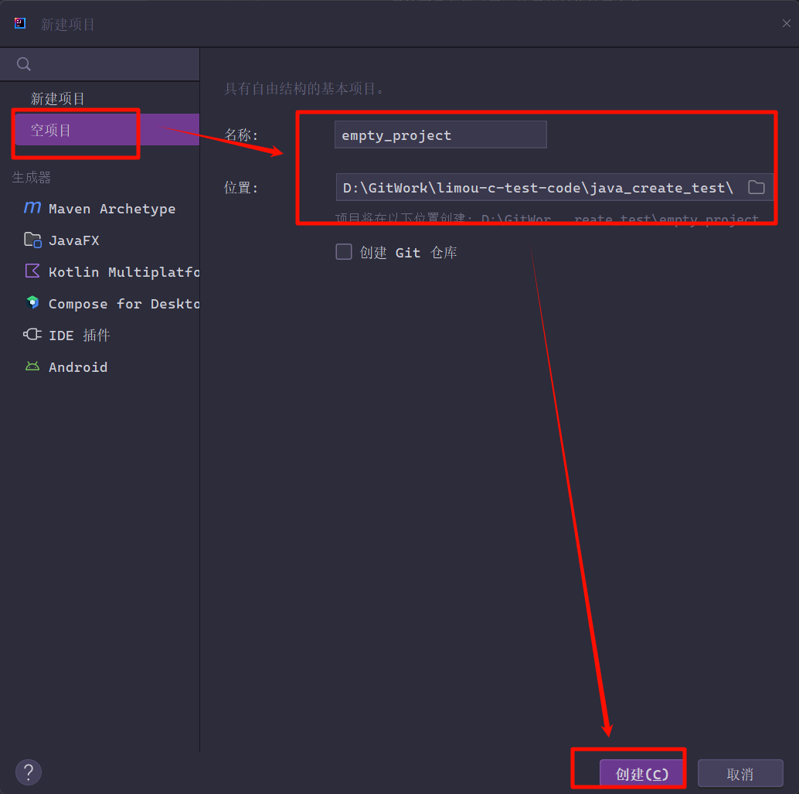

此时的项目是全空的，需要打开项目结构对项目进行配置。

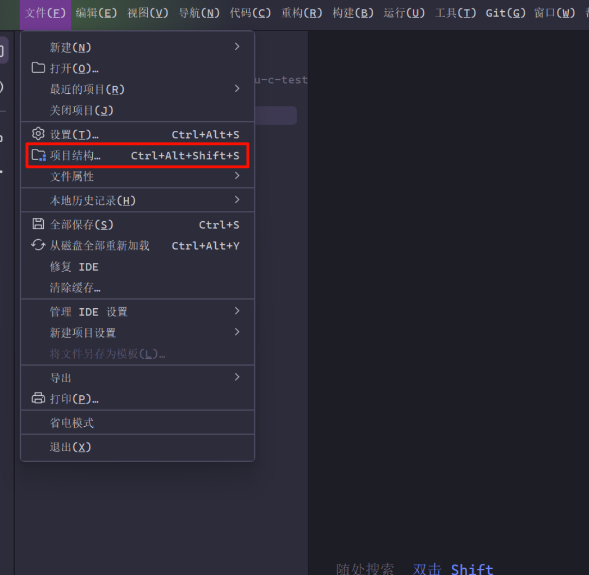

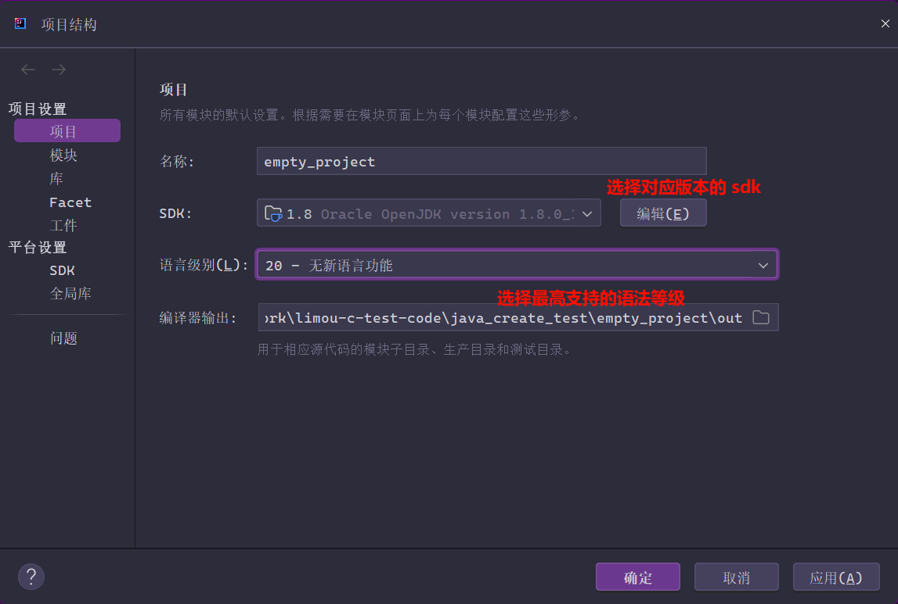

然后选择 `文件->设置` 打开关于 `Maven` 项目的构建和运行的相关配置，每次设置完就点击应用即可。

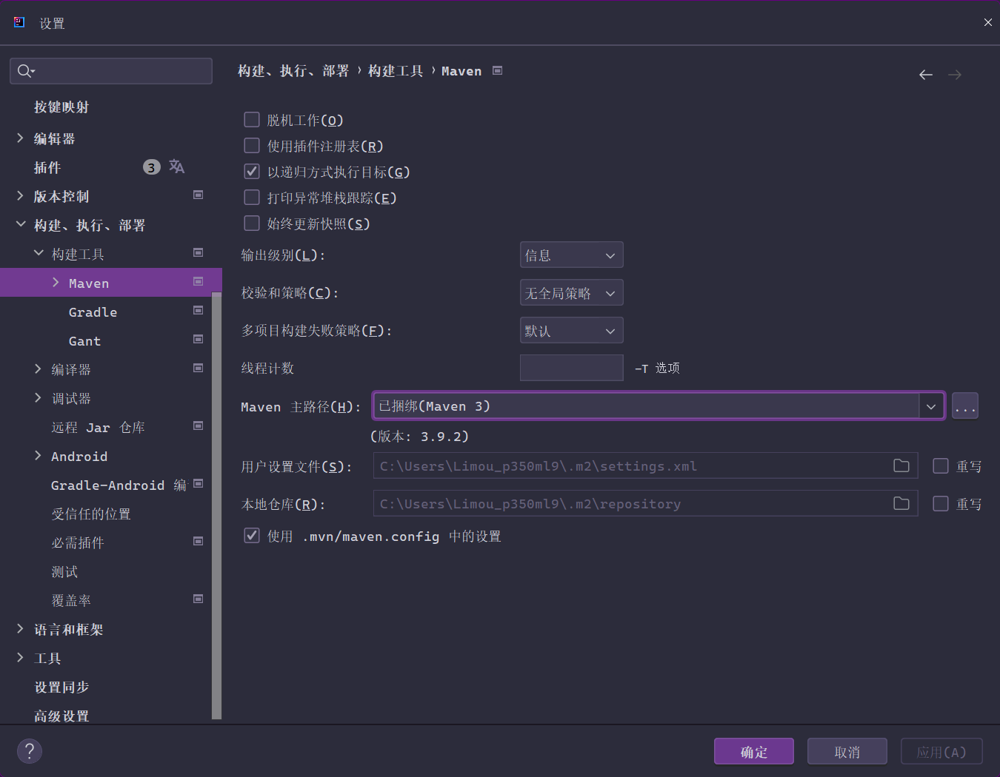

>   补充：在 `Maven` 中，`settings.xml` 文件和 `repository/` 目录是两个不同的配置和存储组件，它们的作用和用途各不相同。
>
>   1.   `settings.xml` 文件通常位于用户的 `Maven` 配置目录下，例如 `C:\Users\limou3434\.m2\settings.xml`。可以交给用户自定义，如果修改就是用户自己的局部配置，如果没有修改就是用户自己的全局配置。`settings.xml` 文件用于配置 Maven 的运行时行为。它包含用户特定的配置信息，如远程仓库、镜像、代理、认证信息、全局属性和构建配置等。该文件可以覆盖或补充 `Maven` 全局配置文件中的设置（位于 `Maven` 安装目录下的 `conf/settings.xml`）。
>
>        ```xml
>        <!-- settings.xml -->
>        <settings>
>            <localRepository>C:\Users\Limou_p350ml9\.m2\repository</localRepository> <!-- 指定本地仓库的位置 -->
>            <mirrors> <!-- 配置镜像仓库, 用于替代或代理默认的中央仓库 -->
>                <mirror>
>                    <id>central</id>
>                    <mirrorOf>central</mirrorOf>
>                    <url>http://my.local.mirror/repo</url>
>                </mirror>
>            </mirrors>
>            <servers> <!-- 配置远程仓库的认证信息 -->
>                <server>
>                    <id>my-repo</id>
>                    <username>my-username</username>
>                    <password>my-password</password>
>                </server>
>            </servers>
>            <proxies> <!-- 配置代理服务器的信息 -->
>                <proxy>
>                    <id>example-proxy</id>
>                    <active>true</active>
>                    <protocol>http</protocol>
>                    <host>proxy.example.com</host>
>                    <port>8080</port>
>                </proxy>
>            </proxies>
>            <profiles> <!-- 定义一组构建配置, 可以在运行 Maven 命令时激活 -->
>                <profile>
>                    <id>dev</id>
>                    <properties>
>                        <property.name>property.value</property.name>
>                    </properties>
>                </profile>
>            </profiles>
>        </settings>
>        ```
>
>   2.   `repository/` 目录通常位于用户的 `Maven` 本地仓库目录下，例如 `C:\Users\Limou_p350ml9\.m2\repository`。具体位置可以通过 `settings.xml` 中的 `<localRepository>` 配置项进行更改。`repository` 目录是 `Maven` 的本地仓库，用于存储从远程仓库下载的所有依赖库、插件以及本地构建的 `Maven` 工件（`artifacts`）。当 `Maven` 构建项目时，它首先会在本地仓库中查找所需的依赖。如果未找到，Maven 会从远程仓库下载这些依赖并缓存到本地仓库中，以便下次构建时复用。`repository` 目录的结构是按照 `Maven` 坐标（`groupI, artifactId, version`）组织的，这个坐标需要依靠每一个导入的 `Maven` 项目的 `pom.xml` 来定义（我们自己的 `Maven` 项目则可以在创建的时候自己定义，或者直接修改 `pom.xml` 文件）。例如，一个依赖 `org.apache.commons:commons-lang3:3.12.0` 的存储路径可能为：`C:\Users\limou3434\.m2\repository\org\apache\commons\commons-lang3\3.12.0\commons-lang3-3.12.0.jar` 因此该目录下存储的实际上是第三方库的 `jar` 包。

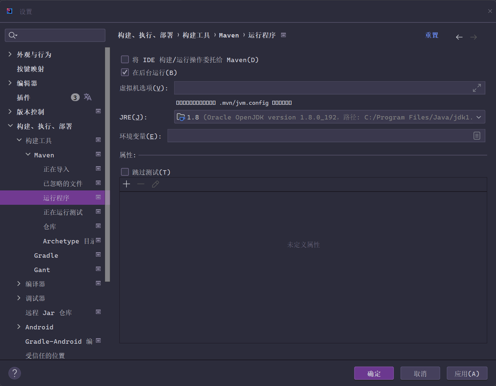

然后配置编译器。

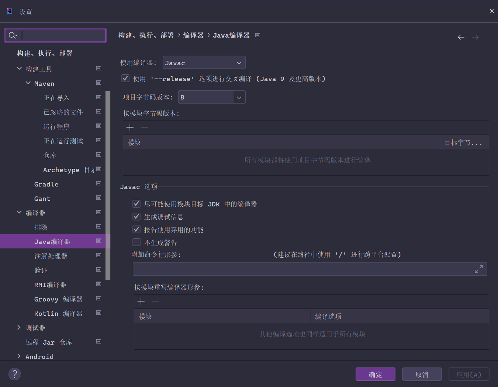

不过上述的配置是一个项目的局部配置，如果希望当前用户所有项目的全局配置，需要不打开任何项目再进行配置。

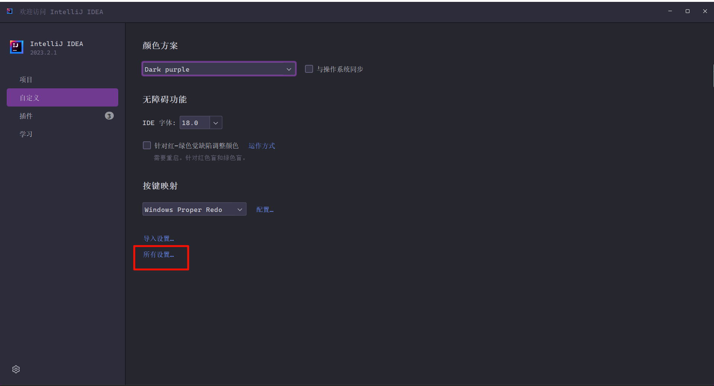

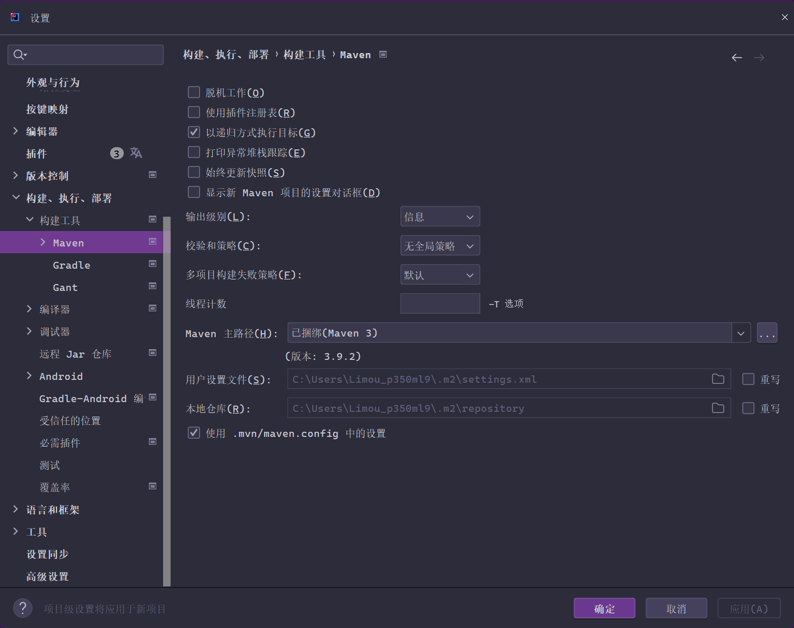

也是类似的配置，不过注意，我们上面只是使用空项目来演示，实际是应该先使用 `Maven` 后再来修改的，因此一般建议设置全局配置后，如果需要不同版本的 `Maven` 就需要重新选择局部配置。

>   补充：实际上最全局最全局的配置是 `Maven` 安装目录下的 `settings.xml` 文件，而 `repository/` 目录其实是依靠前者指定的，用户可以自己配置。

### 2.2.2.创建 Maven 项目

我们把之前的项目全部清空，重新来一遍。

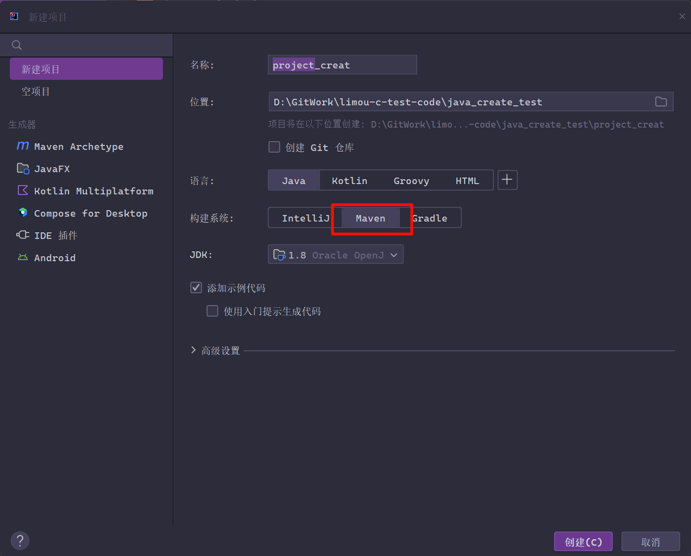

也可以设置值下组 `ID` 和工作 `ID`，不过这里我选择默认的，工作组 `ID` 默认和项目名称相同。

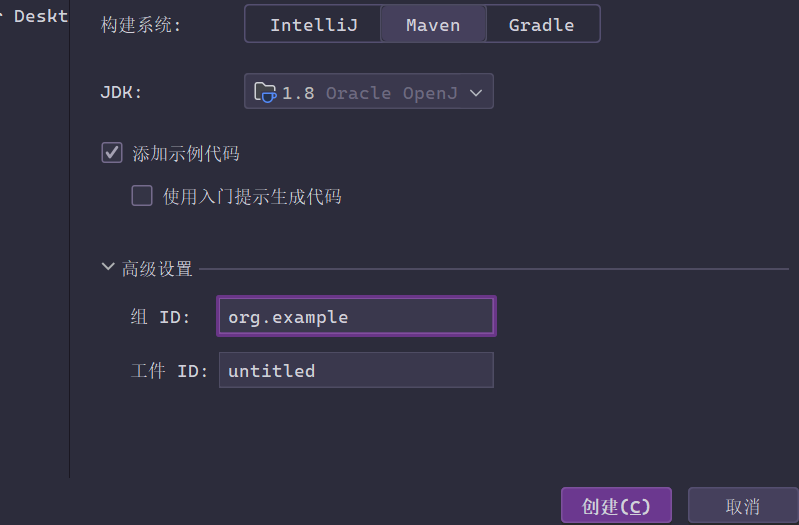

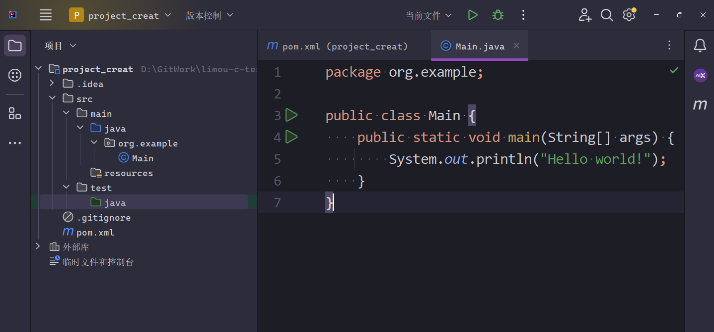

而 `Maven` 在创建项目的过程中，会进行网络下载，下载好后的内容就放在用户配置的全局配置或局部配置中，我们可以先来简单看看 `Maven` 创建工程对应的目录结构：

```shell
# Maven 项目
my-app
|-- pom.xml # Maven 的配置文件
|-- src # Maven 项目源文件
|   |-- main # 实际项目资源
|   |   |-- java # 项目源代码
|   |   |   |-- com
|   |   |       |-- mycompany
|   |   |           |-- app
|   |   |               |-- App.java
|   |   |-- resources # 配置文件目录
|   |       |-- application.properties
|   |-- test # 测试项目资源
|       |-- java # 项目源代码
|       |   |-- com
|       |       |-- mycompany
|       |           |-- app
|       |               |-- AppTest.java
|       |-- resources # 配置文件目录
...
```

>   补充：关于 `test/` 项目中由于其内部的 `resources/` 不常用，因此就默认不会创建，如果您需要可以手动创建。
>
>   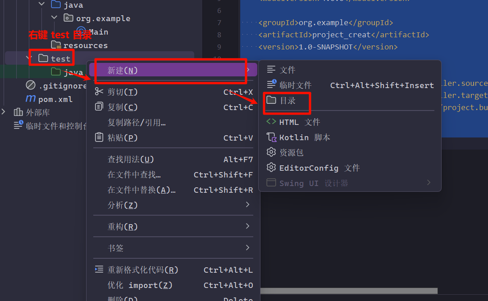
>
>   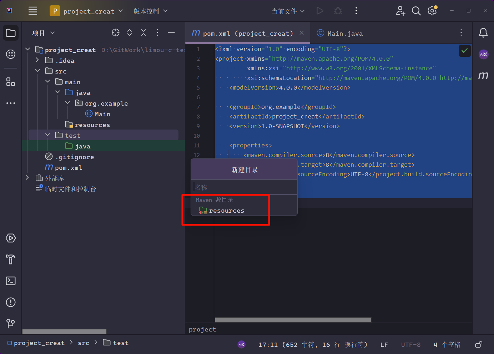

其中最重要的一个文件就是 `pom.xml` 我们先来看看这个文件的内容，简单认识一下对应的意思。

```xml
<!-- pom.xml -->
<?xml version="1.0" encoding="UTF-8"?>
<project xmlns="http://maven.apache.org/POM/4.0.0"
         xmlns:xsi="http://www.w3.org/2001/XMLSchema-instance"
         xsi:schemaLocation="http://maven.apache.org/POM/4.0.0 http://maven.apache.org/xsd/maven-4.0.0.xsd">
    <modelVersion>4.0.0</modelVersion>

    <!-- 一开始创建 Maven 项目时设置的 Maven 坐标, 方便以后把本项目作为第三方库引入其他库中时, 生成对应的目录缓存到导入用户的 Maven 存储库 repository/ 中 -->
    <groupId>org.example</groupId>
    <artifactId>project_creat</artifactId>
    <version>1.0-SNAPSHOT</version>

    <properties>
        <maven.compiler.source>8</maven.compiler.source> <!-- 源码 gdk 版本 -->
        <maven.compiler.target>8</maven.compiler.target> <!-- 目标 gdk 版本 -->
        <project.build.sourceEncoding>UTF-8</project.build.sourceEncoding> <!-- 编码字符集 -->
    </properties>

</project>
```

>   补充：怎么用 `IDEA` 打开现有的 `Maven` 项目呢？使用 `IDEA` 中关于 `Maven` 面板中的 `+` 导入 `Maven` 项目的 `pom.xml` 文件即可。

### 2.2.3.管理 Maven 项目

#### 2.2.3.1.生命周期脚本

`Maven` 项目的管理主要依靠 `Maven` 的三种生命周期，处理从项目编译到打包的整个过程。主要每个生命周期颞部会包含各个阶段：

*   `clean` 清理工作：... `clean` 清理构建 ...

*   `default` 核心工作

    ...

    `compile` 编译项目的源代码

    `test` 运行测试代码（通常是 `JUnit` 测试，对带有 `@Test` 注解的代码进行测试）

    `package` 将编译后的代码打包成 `JAR`、`WAR` 或其他格式的归 档文件（默认只对主程序进行打包）

    `install` 将包安装到本地 `Maven` 仓库，以供其他项目使用，也可以按照依赖

    ...

*   `site` 站点工作：...

并且靠后的阶段执行必须依靠靠前的阶段，例如运行了 `install` 就会运行 `..., compile, test, package, install`，不过只限于同一个生命周期内才会由这种向前依赖关系。

>   补充：不过有些时候不希望经过冗杂的测试而进行快速打包，可以对某些阶段对应的脚本操作进行禁用。
>
>   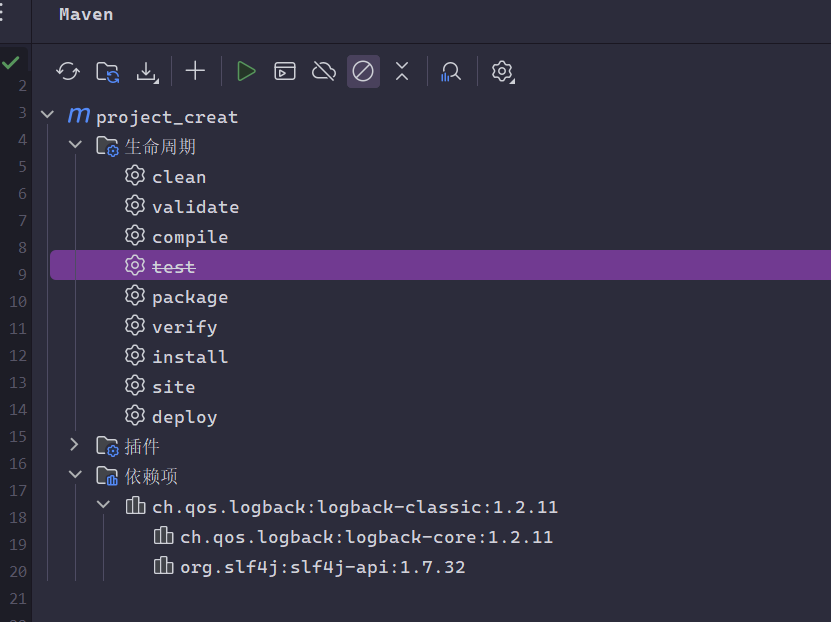

我们只需要关注 `IDEA` 中罗列出来的几个主要阶段就行。


我们稍微在这个 `Maven` 项目中编写一些简单的代码，不过 `IDEA` 已经帮我们生成了一份最简单的 `HelloWorld` 代码，我们尝试运行一下，就会发现多出一个 `target/` 目录。

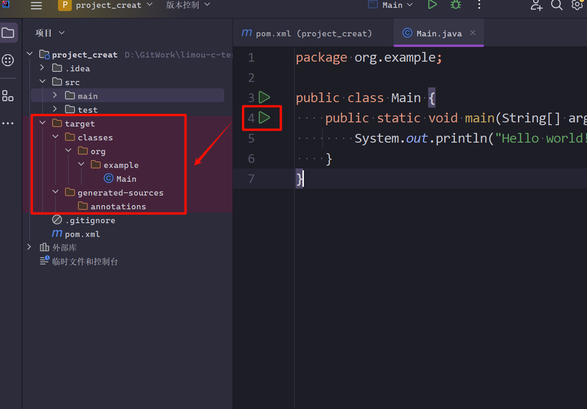

这里就是编译后产生的字节码，而其他几个指令也都比较好理解，这里我提一个比较重要的，使用 `install` 脚本可以把当前的 `Maven` 项目按照用户的 `Maven` 配置按照到用户的 `repository/` 中进行缓存，这样用户就可以把自己写的项目作为依赖配置给别的项目了。

另外，这里的打包指令默认不会把依赖一起打包，只打包主程序代码 ，如果需要打包则需要在 `pom.xml` 中修改打包插件指令。

>   补充：完整的生命周期解读
>
>   1. **默认生命周期（Build Lifecycle）**
>
>   这是 Maven 最常用的生命周期，用于处理项目的构建和部署。它包含以下阶段：
>
>   *   **validate**：验证项目的基本信息和结构，确保所有必要的信息都已提供且正确。
>   *   **initialize**：初始化构建状态，设置一些基本属性或环境。
>   *   **generate-sources**：生成源代码，在编译之前执行，比如自动代码生成工具。
>   *   **process-sources**：处理源代码，通常是对源码进行过滤或其他预处理。
>   *   **generate-resources**：生成资源文件，在资源处理之前执行，如生成配置文件。
>   *   **process-resources**：处理资源文件，通常是将资源文件复制到目标目录（`target`目录），为后续的打包做准备。
>   *   **compile**：编译项目的源代码，将`.java`文件编译为`.class`文件。
>   *   **process-classes**：处理编译好的类文件，例如对字节码进行增强操作。
>   *   **generate-test-sources**：生成测试源代码，类似于`generate-sources`，但用于测试代码。
>   *   **process-test-sources**：处理测试源代码，通常是对测试源码进行过滤。
>   *   **generate-test-resources**：生成测试资源文件，用于测试环境。
>   *   **process-test-resources**：处理测试资源文件，通常是将测试资源文件复制到目标测试目录。
>   *   **test-compile**：编译测试代码。
>   *   **process-test-classes**：处理编译后的测试类文件。
>   *   **test**：运行测试代码，执行单元测试。
>   *   **prepare-package**：在实际打包之前的准备阶段，通常用于执行一些预打包的定制任务。
>   *   **package**：将编译好的代码和资源打包成可分发的格式，比如`JAR`、`WAR`。
>   *   **pre-integration-test**：在集成测试之前进行的准备工作，比如启动服务器或数据库等。
>   *   **integration-test**：运行集成测试。
>   *   **post-integration-test**：在集成测试完成后执行的任务，比如停止服务器或数据库等。
>   *   **verify**：对项目进行进一步的检查，确保质量标准被满足。
>   *   **install**：将打包好的工件（`JAR`、`WAR`等）安装到本地 Maven 仓库，以便其他项目使用。
>   *   **deploy**：将最终的工件部署到远程仓库，通常是用于共享给其他开发者或发布。
>
>   2. **清理生命周期（Clean Lifecycle）**
>
>   这个生命周期主要用于清理项目的构建输出。包含以下阶段：
>
>   *   **pre-clean**：清理之前的准备工作。
>   *   **clean**：删除之前构建的所有文件（通常是删除`target`目录）。
>   *   **post-clean**：清理之后的收尾工作。
>
>   3. **站点生命周期（Site Lifecycle）**
>
>   这个生命周期用于生成项目的网站文档。包含以下阶段：
>
>   *   **pre-site**：生成站点之前的准备工作。
>   *   **site**：生成项目站点文档。
>   *   **post-site**：生成站点之后的收尾工作。
>   *   **site-deploy**：将生成的站点文档部署到指定的服务器上。

#### 2.2.3.2.配置项目依赖

上面的创建的 `Maven` 项目我们已经做好对项目的管理了，不过只是设置好了项目的结构、编译、打包等事务，但是关于依赖我们还没有配置。怎么把其他 `Maven` 项目通过 `package` 打包好的 `jar` 包和 `pom.xml` 配置为当前 `Maven` 项目的依赖呢？这就需要修改当前项目的 `pom.xml` 配置文件了。

需要在 `pom.xml` 配置文件中添加 `<dependencies>` 标签，在这里提供多个依赖，每一个依赖由需要使用 `<dependency>` 标签来管理，内部有需要设置 `Maven` 坐标。

这里演示我们前面创建好的 `HelloWord` 项目引入依赖 `logback-classic` 其他两个标签内容会自动进行补全（如果您要配置的依赖已经存储在 `repository/` 缓存），不过这只是配置，还没有实际添加了，需要重新加载，这个加载按钮 `IDEA` 自己就会显示出来（实际上这个重新加载就是脚本 `clean+install`）。

如果没有找到本地缓存的依赖，就会在中央仓库中进行网络搜寻。

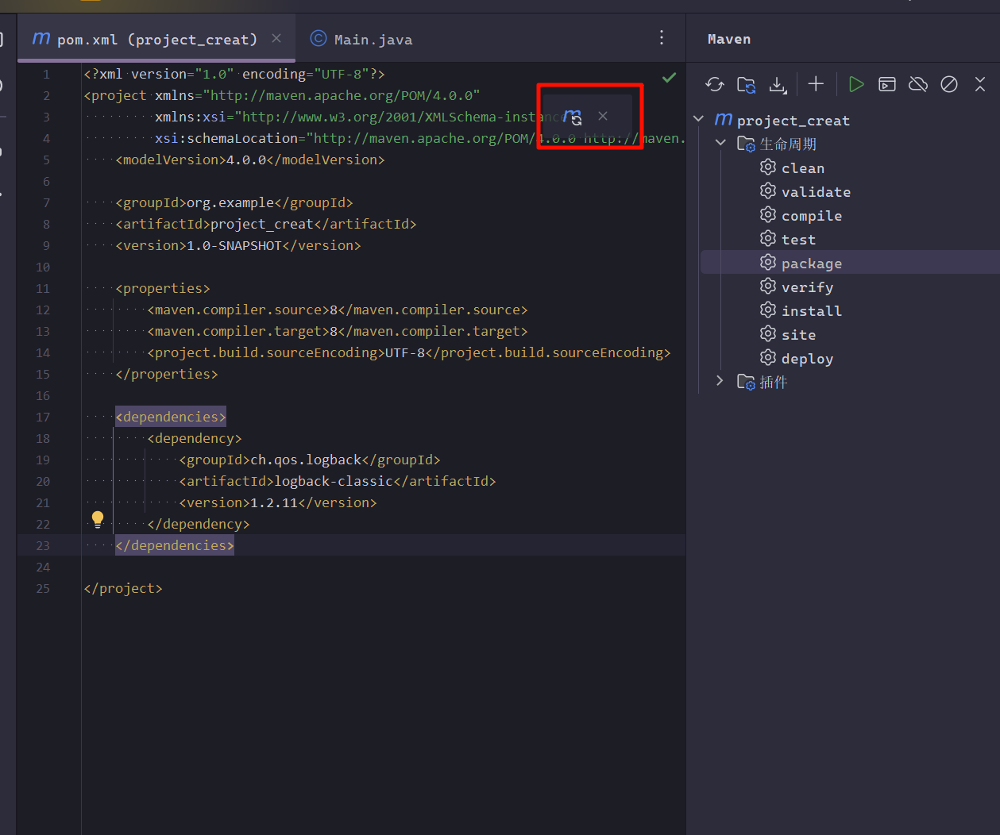

查看本项目的 `Maven` 面板即可发现，多出了一个依赖项的目录，项目面板中的外部依赖。

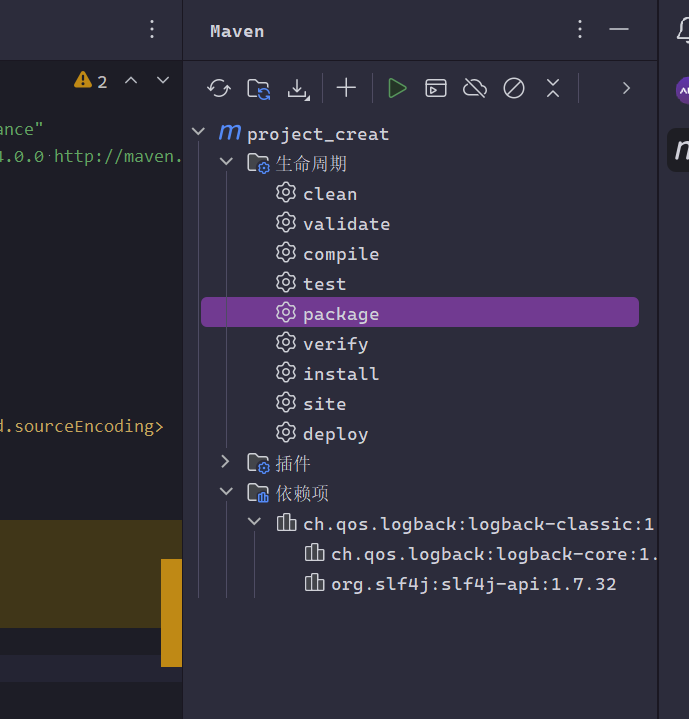

这里我们导入的是第三方的包，如果 `IDEA` 没有提示，可以 [去 Maven 的在线仓库中查看对应的包信息](https://mvnrepository.com/)。

由于 `Maven` 的依赖具有传递性，有时需要排除某些依赖，这个时候可以使用 `<exclusions><exclusion></exclusion></exclusions>` 并且坐标无需指定版本，这样就可以主动断开依赖。

另外，还需要注意引入依赖的范围，默认是在本项目的任何地方，不过可以通过 `<scope></scope>` 来重新规定作用范围，作用范围分为下面三种：

-   主程序文件夹 `main/` 范围内有效
-   测试文件夹 `test/` 范围内有效
-   打包指令 `package` 内有效

| scope 值      | 主程文件夹 | 测试文件夹 | 打包指令 |
| ------------- | ---------- | ---------- | -------- |
| compile(默认) | Y          | Y          | Y        |
| test          | -          | Y          | -        |
| provided      | Y          | Y          | -        |
| runtime       | -          | Y          | Y        |

>   补充：在软件开发和构建过程中，`scope` 的不同值表示不同的依赖类型和其用途，但是为什么需要 `provided` 和 `runtime` 呢？
>
>   -   `provided` 依赖意味着在项目的编译和测试阶段需要这些依赖，但在最终的打包过程中不会包含这些依赖。这种依赖通常是在开发过程中需要的，但在部署时不需要包含在最终的构建中。比如，某些框架或 `API` 在运行时由容器或其他环境直接提供。比如在一个使用 `Servlet` 的 `Java` 项目中，`Servlet API` 可能会被设为 `provided`，因为这个 `API` 在服务器上已经存在，不需要在打包时重复包含。这样可以依赖避免重复减少最终包的大小，确保项目在不同的环境下与提供的库兼容，而不是自带一份可能会引起冲突的库。
>   -   `runtime` 依赖在编译时不需要，但在运行时需要这些依赖。这些依赖不会影响编译过程，但在运行时是必要的。它们通常是应用的核心功能的一部分。例如数据库驱动或其他需要在程序运行时才用到的库，如 `jdbc` 驱动。


