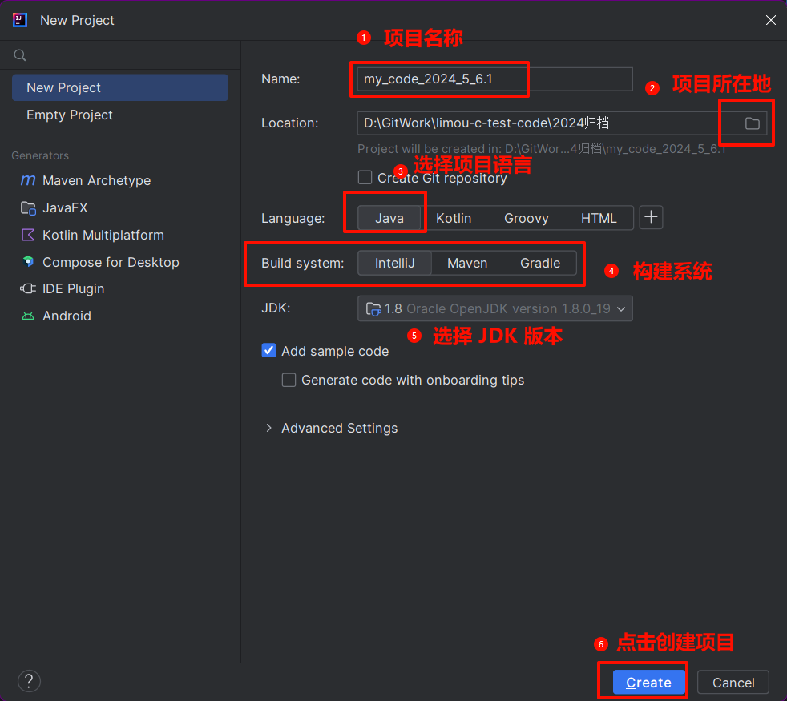
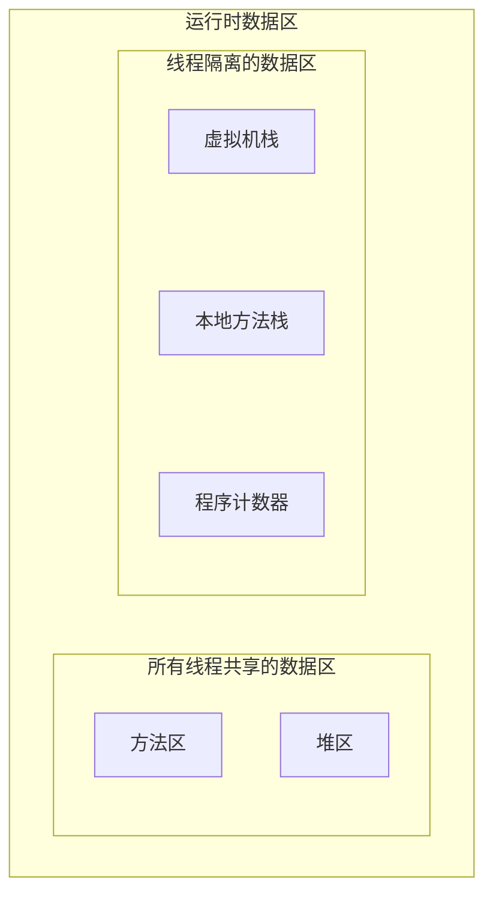
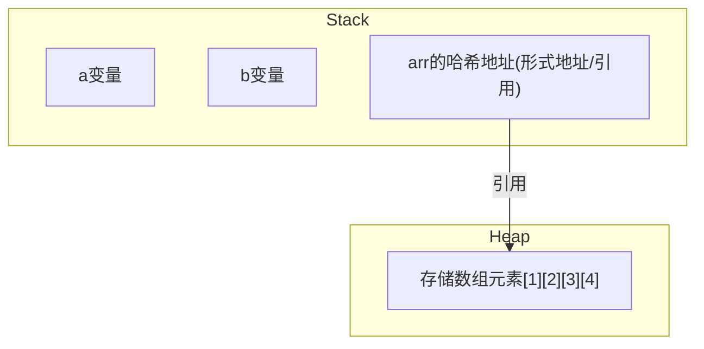
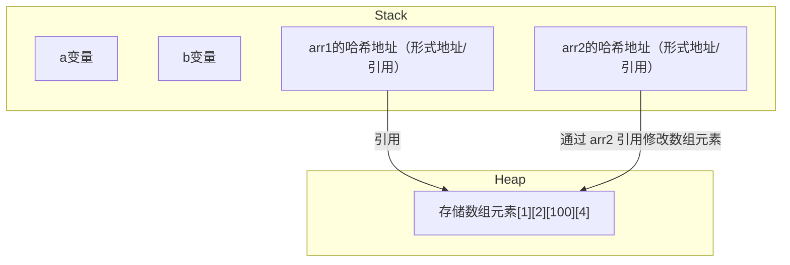
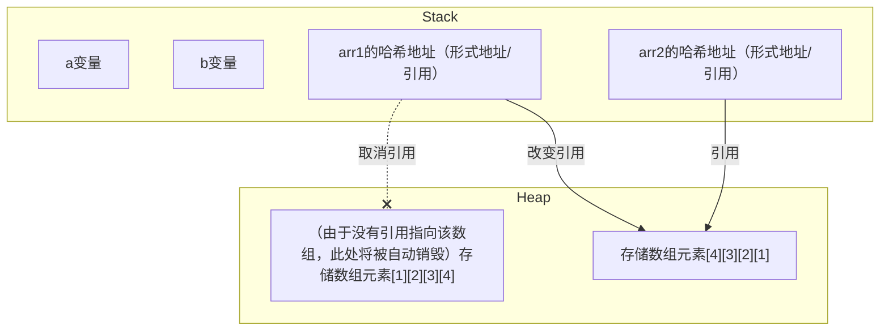
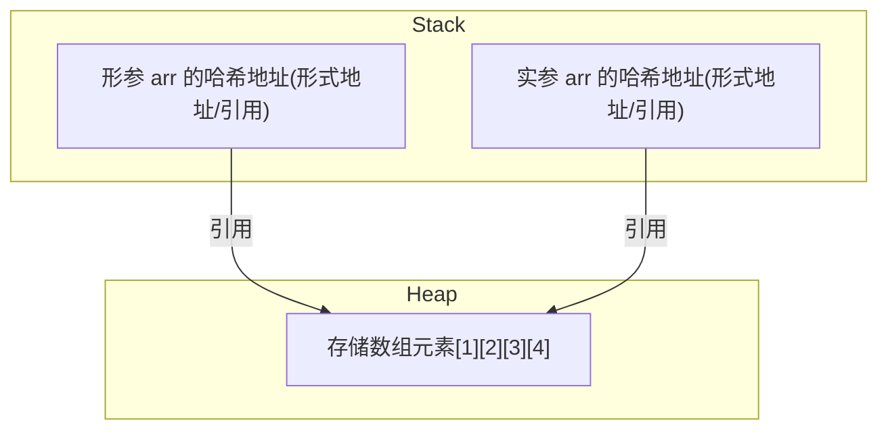
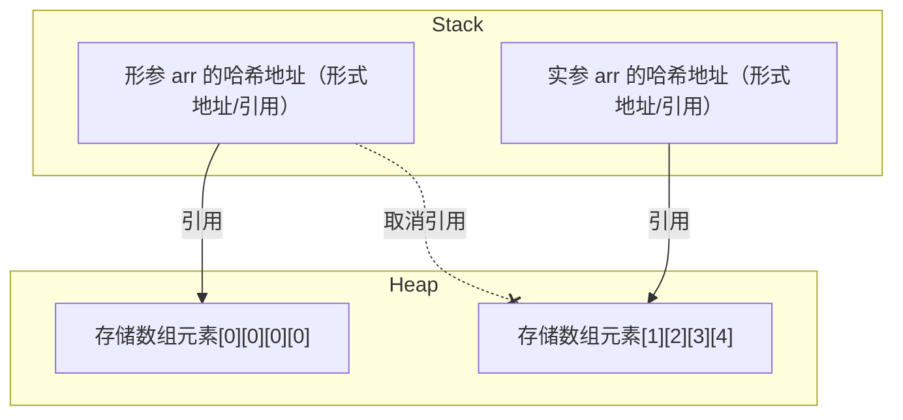
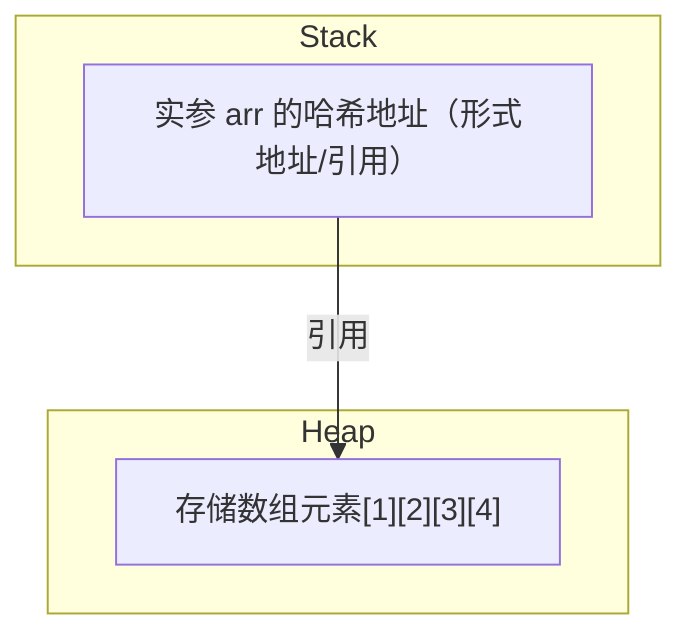
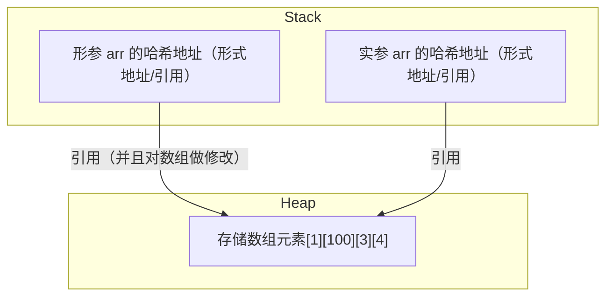

**叠甲：以下文章主要是依靠我的实际编码学习中总结出来的经验之谈，求逻辑自洽，不能百分百保证正确，有错误、未定义、不合适的内容请尽情指出！**

[TOC]

>   概要：...

>   资料：...

---

# 1.第一份程序

## 1.1.代码编写

```java
/* (块注释)
HelloWord.java 内部
*/

/** (文档注释)
* 作者：limou3434
*/

public class HelloWord {
    public static void main(String[] args){
        System.out.println("Hello Word!"); // (普通注释)打印“Hello Word!”
    }
}
```

直接上代码，上面就是一段 `Java` 代码，我们先来观察一下这段代码的细节：

1. 首先看到的是一个 `main()` 函数（每一个类只能有一个 `main()`），主函数没有所谓的返回值，因此返回类型是 `void`，在 `main()` 的内部有一个字符数组类型的 `args` 变量，用来接收命令行参数

2. 在一个 `Java` 文件中只能有一个 `public` 类，并且 `pubilc` 类的名字必须和 `.java` 文件名字相同。而 `main()` 函数被包含在这个类中，不允许被写在类外

3. 在 `main()` 内部，有一个调用，调用了打印函数 `println()`，这个函数后面的 `ln` 指的是换行，打印函数内部包含了需要被打印的内容

4. 在 `Java0` 中有三种注释：行注释、段注释、文档注释，这里故意都使用了一遍

## 1.2.代码运行

那么如何编译这一份代码呢？我将带您用两种方式进行运行，一种是脱离 `IDE` 环境的命令行运行，另一种就是在 `IDEA` 中运行。这两种方法您都需要掌握...

### 1.2.1.命令行编译

1. 在最原始的情况下只需要将上述代码写入 `HelloWord.java` 文件中（注意文件名一定要使用大驼峰，实际上在 `Java` 中一个文件就对应一个类，一般直接使用类名来命名文件）

2. 然后通过使用 `Java` 的编译器 `javac.exe` 这个可执行程序，使用命令 `javac ./HelloWord.java`（注意需要正确写好 `Hellow.java` 的相对路径或者绝对路劲）

3. 此时在 `HelloWord.java` 的同级目录中就存在一个经过编译的字节码文件 `HelloWord.class`

4. 运行 `Java` 代码代码直接使用 `Java HelloWord` 即可

5. 需要注意的是，`Java` 不是单个文件就生成单个字节码的文件，而是有多少个类就有多少个字节码文件，并且字节码文件名和类相同，这点和很多编程语言有很大的不同。

> 注意：这里如果因为添加了中文注释导致无法通过编译，则可以尝试在编译的时候设置某个编码运行，例如 `javac -encoding utf-8 HellowWord.java` 就可以使用 `utf-8` 来进行编码。而关于命令行中的其他操作，可以查阅其他资料...

### 1.2.2.IEDA 编译

[关于 IDEA 的安装](./001+limou+2023_9_16+Java先导.md) 放在先导中，您可以前去查看



## 1.3.代码文档

`Java` 有一个非常独特的功能，给代码生成文档，使用 `javadoc -d [存放文档的目录路径] -sourcepath [存放源代码的目录路径] [-docencoding UTF-8 -charset UTF-8] [指定需要生成文档的 .java 文件]> ` 即可生成一个 `html` 帮助文档。

不过这种注释需要搭配一些特殊的注释，这些注释的使用和意义有点类似 `C/Cpp` 的 `Doxygen` 注释，主要有以下特殊注释（这里只举例常用的）。

1. **类和接口文档**：使用 `/** ... */` 放在类或接口声明之前，描述类或接口的用途和功能
2. **成员变量文档**：使用 `/** ... */` 放在成员变量声明之前，描述变量的用途
3. **成员方法文档**：使用 `/** ... */` 放在方法声明之前，描述方法的功能、参数、返回值和可能抛出的异常
4. **参数文档**：使用 `@param` 标记在方法文档中，为每个参数提供描述
5. **返回值文档**：使用 `@return` 标记在方法文档中，描述方法的返回值
6. **异常文档**：使用 `@throws` 标记在方法文档中，描述方法可能抛出的异常及其条件
7. **版本和作者文档**：使用 `@version` 标记来记录类或接口的版本信息，使用 `@author` 标记来记录代码的作者
8. **自描述**：使用 `@see` 标记来引用其他主题或 `URL`，在最后文档生成中会达到跳转的目的
9. **弃用文档**：使用 `@deprecated` 标记来标明某个 `API` 成员（类、方法、字段等）已过时，一般添加到整个注释文档的最后即可
10. **序列化文档**：使用 `@serial` 标记来描述序列化字段

以下是一些示例 `javadoc` 的注释，以后遇到我也会使用上其他的注释。

```java
// 使用 javadoc 注释
/**
 * 表示一个简单的计算器类。
 */
public class Calculator {

    /**
     * 计算两个整数的和。
     *
     * @param a 第一个加数。
     * @param b 第二个加数。
     * @return 两个数的和。
     */
    public int add(int a, int b) {
        return a + b;
    }

    /**
     * 这个字段表示计算器的版本。
     * 
     * @version 1.0
     * @author John Doe
     */
    private String version;
}
```

这也可以根据需要使用不同的注释标记组合来生成详细的 `API` 文档。

# 2.运行过程

在我们安装 `JDK`（`Java` 开发开发工具包）的时候

-   `JDK` 里包含 `JRE`（`Java` 运行时环境）
-   `JRE` 里包含 `JVM`（`Java` 所需虚拟机）

`.java` 后缀的 `Java` 文件使用 `javac` 编译成 `.class` 后缀的字节码文件，字节码文件再通过不同操作系统实现的具体 `JVM` 虚拟机转化为机器码运行起来（因此 `Java` 是半解释半编译的语言）。

因此哪怕是其他语言，如果能被转化成字节码并且运行的操作系统上实现了对应的 `JVM`，也同样可以在虚拟机上运行。通过中间层来达到 **一次编译到处运行** 的目的，使得 `Java` 在跨平台能力要优于 `C/Cpp`。

# 3.关键字

有些关键字被 `Java` 所保留，不可以给用户创建标识符来使用，这些关键字的类别有很多，例如：`int`、`class`、`catch` 等等，我们后面再来一一介绍。

# 4.标识符

在 `Java` 中可以将类名、对象名、变量名、方法名称为“标识符”。`Java` 的标识符可以包含：字母、数字、下划线、`$` 符号等。

不过需要注意的是不可以使用数字作为标识符的起始字符，但是可以把 `$` 作为标识符的开头（但是不建议）。

在命名的时候，不仅要注意命名合法，还要注意合理。在本系列文章中我统一采用：

1. 类名：大驼峰

2. 方法名：小驼峰

3. 变量名：小驼峰

>   吐槽：从编译原理的角度来看，实际上关键字就是一种特殊的标识符。

# 5.常量与变量

在提及常量和变量的时候，就需要先提及数据类型，注意这里和 `C/Cpp` 有很大的不同之处。

## 5.1.数据类型

`Java` 的数据类型分为两种：基本类型和引用类型。

-   其中基本数据类型有四类八种
-   引用类型通常指类（`class`）、接口（`interface`）、数组（`array`）等

### 5.1.1.基本类型

四类即：

1. 整型（整数）

2. 浮点型（小数）

3. 字符型（一个字符）

4. 布尔类型（`true` 和 `false`，对应对和错，和整型没关系）

八种即：

| 数据类型   | 关键字       | 内存占用  | 范围                   |
| ------ | --------- | ----- | -------------------- |
| 字节型    | `byte`    | `1` 字节 | $[-128,127]$         |
| 字符型    | `char`    | `2` 字节 | $[0,65535]$          |
| 短整型    | `short`   | `2` 字节 | $[-32768,32767]$     |
| 整型     | `int`     | `4` 字节 | $[-2^{31},2^{31-1}]$ |
| 长整型    | `long`    | `8` 字节 | $[-2^{63},2^{63}-1]$ |
| 单精度浮点数 | `float`   | `4` 字节 | 有，但是不关注              |
| 双精度浮点数 | `double`  | `8` 字节 | 有，但是不关注              |
| 布尔型    | `boolean` | 无说明   | `true` 和 `false`       |

`Java` 的数据类型是固定的不会受平台影响，因此很方便做代码移植。

>   吐槽：`C/Cpp` 在不同平台，甚至在同平台的不同编译器上，对于类型的限定都可能会不一样，尤其是在 `32/64` 平台上有两种解释，因为标准只规定了大致范围和限定，剩下的几乎都交给了编译器来实现。

### 5.1.2.引用类型

引用类型主要依赖引用这一区别于 `C/Cpp` 指针的机制，后面再来详细解释，您先简单看作类（`class`）、接口（`interface`）、数组（`array`）等创建的类型即可。

## 5.2.数据的量

有了数据类型，就可以创建出对应的容器来指代某些量，这些量可以被分为字面常量和数据变量。

### 5.2.1.字面常量

数据类型可以给字面常量（数据）做出分类。

类似 `100`、`3.14`、`"abcdef"`、`false` 等这种一眼就能看出数据的都是字面常量，字面常量的类别也是根据数据类型来分类的。

其中 `100` 就是整型常量、`3.14` 就是浮点数常量、`"abcdef"` 就是字符串常量、构成字符串的每一个字符 `a`、`b`、`c`...就是字符常量、`false` 和 `true` 就是布尔常量。

### 5.2.2.数据变量

变量可以理解为一个容器，可以用来存储一个常量，不同类别的常量需要靠不同类别的变量来存储。
而我们需要用一些关键字（也就是前面在数据类型中提到的），使得变量变成只存储某一字面常量类型的变量。

```java
// 定义变量的语法形式
int a = 10; // int 是关键字, a 是标识符, 标记一个变量, 10 为字面常量
// 此时变量 a 存储了 10 这个字面量
```

> 补充：在数据变量上，`Java` 和 `C/Cpp` 有很大的不同。
>
> -   `Java` 没有全局变量这个术语的，但有类似的。
> -   在 `Java` 编程中如果没有对变量初始化就使用的话，很多编译器直接就会报错，编译也不会通过。
> -   如果赋值给变量过大或者过小的值，`Java` 也是不会通过编译的。 

> 补充：`Java` 的字符串类型是包装类型，不是基本数据类型。为了方便后续一些代码的使用，这里提前讲解一下字符类的相关概念。
>
> `C` 没有字符类型，但是 `Java` 利用类的优势，使用 `String` 类定义字符串类型。
>
> ```java
>// 使用 String 类
> public static viod main() {
>      String s1 = "Hello";
>      String s2 = "I am limou3434";
>        String s3 = "100";
>        System.out.prinln(s1 + s2);
>        //String 转 int
>        int number = Inreger.parseInt(str);
>        //int 转 String
>        String s = String.valueOf(number);
>    }
>    ```
> 
> 如果您学过 `Cpp` 其实您能很快理解什么是包装类，您可以简单理解为基本数据类型被包装为一个类类型，这么做的好处是统一参数。而由于 `Java` 是纯粹的面向对象语言，因此传递参数的时候，大部分使用的是类的实例化对象，将基本数据类型就被包装为包装类，供程序传递参数使用时就会更加方便。

# 6.类型转化

需要注意的是，`Java` 是强类型语言，有些不合适的类型转化将会直接报错（`C/Cpp` 语言是弱类型语言，在这方面会宽松很多）。

## 6.1.隐式类型转换

代码不需要经过处理，编译器会进行处理不同类型的转换，但是 `Java` 在这一方面检查得比较严格，不允许溢出和不相关类型转化。

```java
// 使用隐式类型转化
public class Main {
    public static void main(String[] args) {
        int a = 10;
        long b = 100L;
        b = a;// 可以，发生了隐式类型转化, a 从 int 变成 long
        // a = b; // 不可以, 不够存

        float f = 3.14F;
        double d = 5.12;
        d = f; // 可以, f 从 float 转化为 double
        // f = d; // 不可以, 不够存
    }
}
```

## 6.2.显式类型转换

这方面类似 `C` 语言，也是使用 `()` 来转换，但并不总是能成功，小范围可以转化为大范围的，赋值的数值一定不能溢出，且强制转换的类型要相关且合理。

```java
// 使用显示类型转化
public class Main {
    public static void main(String[] args) {
        int a = 10;
        long b = 100L;
        b = a; // 可以, 发生了隐式类型转化, a 从 int 变成 long
        a = (int)b; // 可以, 将 b 从 long 强制转化为 int

        float f = 3.14F;
        double d = 5.12;
        d = f; // 可以, f 从 float 转化为 double
        f = (float)d; // 可以, 将 d 从 double 前置转化为 float
    }
}
```

## 6.3.数据类型提升

在不同变量的运算的运算中，`Java` 也存在整型提升，和 `C` 基本差不多。需要注意是 `Java` 对溢出极其敏感（`C` 对待溢出十分迟钝），提升后需要赋给对应的容器，除非进行强转，否则会报错。

```java
//查看整型提升现象
public class Main {
    public static void main(String[] args) {
        byte a = 127;
        byte b = 127;
        // byte c = (byte)(a + b); // a 和 b 提升为 int 进行计算，结果也为 int, 虽然可以强转为 byte, 但很危险
        int d = a + b; // 这样才比较好
    }
}
```

# 7.运算符

这里我们只挑出几个比较特殊的运算符，其余的运算符和 `C` 基本差不多（包括“结合性”和“优先级”），这里就不再赘述。

1. `Java` 的除法和 `C` 类似，会向下取整，并且除以 `0` 会抛出异常 `ArithmeticException`（算数异常）

    ```java
    // 使用除法的示例
    public class Main {
        public static void main(String[] args) {
            System.out.println(5 / 2); // 2
            System.out.println(5.0 / 2); // 2.5
            System.out.println(5 / 2.0); // 2.5
            System.out.println((float)5 / 2); // 2.5
            System.out.println(5 / (float)2); // 2.5
            System.out.println((float)(5 / 2)); // 2.0
        }
    }
    ```

2. 由于除法一样，所以 `%` 运算也是一样的，需要注意的是，该运算符也可以对小数进行操作（就是很少用）

    ```java
    // 使用取模的示例
    public class Main {
        public static void main(String[] args) {
            System.out.println(10 % 3); // 1
            System.out.println(-10 % 3); // -1
            System.out.println(10 % -3); // 1
            System.out.println(-10 % -3); // -1
    
            System.out.println(-10.3 % 3); // -1.3000000000000007
        }
    }
    ```

3. 在增量运算符中有的时候会发生类型转化，等价于强转

   ```java
   // 使用增量运算符发生隐式强转
   public class Main {
       public static void main(String[] args) {
           int num1 = 10;
           double num2 = 3.14;
   
           int add1 = 0;
           double add2 = 0.0;
   
           // 方式一
           // add1 = num1 + num2; // 4 字节和 8 字节相加，发生整形提升, 只用 4 个字节是放不下去的
           // System.out.println(add1);
           add2 = num1 + num2;
           System.out.println(add2);
           System.out.println();
   
           // 方式二
           add1 = (int) (num1 + num2);
           System.out.println(add1);
           add2 = (double) (num1 + num2);
           System.out.println(add2);
           System.out.println();
   
           // 方式三
           num1 += num2; // 等价于 a = (int)(a + b)
           System.out.println(num1);
       }
   }
   ```

   而自增、自减运算符还有一种特殊的情况需要您注意，您应该避免出现下面这样的代码...

   ```java
   // 有关于加加和减减的一个很坑的点
   public class Main {
       public static void main(String[] args) {
           int a = 10;
           a = a++;
           System.out.println(a);
           // 结果为 10，而不是 11，这个原因涉及底层
           // 以后我有机会再来填坑，这里充分体现了 Java 和 C/C++ 不一样！
       }
   }
   ```

4. 关系运算符、逻辑运算符（也具有短路效应）的操作表达式必须为布尔表达式，其运算结果为 `true` 和 `flase`，不是 `非0` 和 `0`。而 `if` 和 `for` 判断的环节中使用的也是布尔表达式

5. `Java` 的移位操作符有三个 `<<`、`>>`、`>>>`，`>>` 是左补符号位，`>>>` 是左补 `0`

6. 也有一个唯一的三目操作符：条件运算符 `表达式1 ? 表达式2 : 表达式3`。并且该表达式必须是被使用的（其结果必须被使用），不能单独存在

7. 对于位操作，建议还是使用括号引导表达式的逻辑，避免出现意想不到的后果（在 `C` 中也最好一样）

> 注意：如果摒弃掉 `C` 的“非零为真”的概念在接下来的编码中会轻松很多...

# 8.控制语句

和大部分编程语言类似，`Java` 也有自己的控制语句，和 `C` 也有些类似，但是在入口判断有很大的不同，不同的根源来自于：`C` 使用整数的非零和 `0` 来判断真假，而 `Java` 完全使用布尔类型来判断真假，而 `Java` 的布尔类型和整数是无法进行比较的，这就导致 `Java` 写出来的入口判断会更加清晰（也可以说没有 `C/C++` 那样整洁，至于是清晰好还是简洁好，看您喜好而定）

## 8.1.分支语句

### 8.1.1.if 语句

`Java` 的 `if` 语句，几乎和 `C/C++` 的使用一样，并且也有类似的悬挂 `else` 的问题，真要说有哪些点不同，就是 `C/C++` 和 `Java` 的代码缩进风格不太一样。

```java
//使用 if 语句
public class Main {
    public static void main(String[] args) {
        int a = 1;
        if (a == 1) { //这里只能是整型
            System.out.println(a);
        } else {
            System.out.println("a != 1");
        }
    }
}
```

### 8.1.2.switch 语句

同样，几乎和 `C` 一样，就是需要注意的是：`switch` 的入口只能使用 `char`、`byte`、`short`、`int`、`Character`、`Byte`、`Short`、`Integer`、`String`、`enum` 类型，其他类型一概不支持（比如 `long` 就不行），这点很重要。

```java
//使用 switch 语句
public class Main {
    public static void main(String[] args) {
        int a = 1;
        switch (a) { //这里只能是整型
            case 1:
                System.out.println(a);
                break;
            case 2:
                System.out.println(a);
                break;
            default:
                System.out.println("default");
        }
    }
}
```

## 8.2.循环语句

### 8.2.1.for 语句

```java
//使用 for 语句
public class Main {
    public static void main(String[] args) {
        for (int a = 1; a < 10; a++) {
            System.out.println(a);
        }
    }
}
```

### 8.2.2.while 语句

```java
//使用 while 语句
public class Main {
    public static void main(String[] args) {
        int a = 1;
        while (a < 10) {
            System.out.println(a);
            a++;
        }
    }
}
```

### 8.2.3.do-while 语句

```java
//使用 do-while 语句
public class Main {
    public static void main(String[] args) {
        int a = 1;
        do {
            System.out.println(a);
            a++;
        } while (a < 10);
    }
}
```

让我们借助循环语句，顺便来讲解一下在 `IDEA` 中如何调试代码：


# 9.输入输出

## 9.1.输出数据

`Java` 有三种常用的输出，均体现在下述代码中：

```java
// 使用三种输出语句
public class Main {
    public static void main(String[] args) {
        System.out.print("limou"); //输出，但不换行（无需关注类型）
        System.out.println("limou"); //输出，但是换行（无需关注类型）
        System.out.printf("%s", "limou"); //格式化输出输出
    }
}
```

您可能会好奇格式化输出是否和 `C` 一样，实际上有些类似，也有些不同：

-   `%o`、`%d`、`%x`：整数的八进制、十进制、十六进制输出
-   `%f`、`%e`、`%g`、`%a`：定点浮点数、指数浮点数、通用浮点数、十六进制浮点数输出
-   `%s`、`%c`：字符串、字符输出
-   `%b`：布尔值输出
-   `%h`：散列码输出
-   `%%`：百分号输出

此外，也有一些修饰符，您稍微了解一下即可。

## 9.2.输入数据

```java
// 使用输入语句
// 导入相关的包（可以将光标停在对应关键字上，使用快捷键 [alt+enter] 来快速导入）
import java.util.Scanner;

public class Main {
    public static void main(String[] args) {
        // 创建一个 scan 对象, 且 System.in 代表设置为“从键盘输入”
        Scanner scan = new Scanner(System.in);

        System.out.println("请输入您的年龄"); // 提示用户输入
        int age = scan.nextInt(); // 通过方法获取输入

        System.out.println("请输入您的名字"); // 提示用户输入
        String name = scan.next(); // 通过方法获取输入(会忽略一开始的空白字符, 再次遇到空白字符就会停下)

        // 使用 nextLine() 则会获取空白字符, 但是有可能有失效的问题, 也就是多余空白字符被误输入的问题
        String ch = scan.nextLine(); // 先除去上述输入得最后产生得换行符
        System.out.println("输入您的爱好");
        String hobby = scan.nextLine(); // 忽略一开始的空白字符(除了换行字符), 获取连续的字符串, 包括空白字符(除了换行字符)

        System.out.println("请输入您的体重"); // 提示用户输入
        float weight = scan.nextFloat(); // 通过方法获取输入(会忽略空白字符)

        System.out.println("年龄:" + age); // 输出信息
        System.out.println("名字:" + name); // 输出信息
        System.out.println("爱好:" + hobby); // 输出信息
        System.out.println("体重:" + weight); // 输出信息

        scan.close(); //类似 C 语言的文件关闭
    }
}

/* 输出结果
请输入您的年龄
18
请输入您的名字
limou 3434
输入您的爱好
game and programme
请输入您的体重
51.2
年龄: 18
名字: limou
爱好: game and programme
体重: 51.2
*/
```

>   注意：关于 `Scanner` 还有很多的知识，我将会在 `IO` 详细讲解。

当然，一般建议文本输入最好放在最前面处理（尤其是多数据类型输入的时候）。还有一个循环输入的代码也值得您一看。

```cpp
// 多组输入
// 导入相关的包（可以将光标停在对应关键字上，使用快捷键 [alt+enter] 来快速导入）
import java.util.Scanner;

public class Main {
    public static void main(String[] args) {
        Scanner scan = new Scanner(System.in);
        System.out.print("请输入一个数字 ");
        while (scan.hasNextInt()) {
            int number = scan.nextInt();
            System.out.println("您输入的数字是:" + number);
            System.out.print("请输入一个数字 ");
        }
        // 在终端中使用 [ctrl+d] 会终止循环
    }
}

/* 输出结果
请输入一个数字 18
您输入的数字是: 18
请输入一个数字 20
您输入的数字是: 20
请输入一个数字 35
您输入的数字是: 35
请输入一个数字 5
您输入的数字是: 5
请输入一个数字 100
您输入的数字是: 100
请输入一个数字
...
*/
```

# 10.方法

## 10.1.方法的定义

方法和 `C` 中的函数是否类似（因为它们的工作是差不多的，都是通过调用来达到简化代码的目的），而为什么不继续延用“函数”这个术语，而使用“方法”呢？

简单来说就是类的出现导致的，`Java` 使用类来创建一个又一个的对象，这些对象很类似普通的变量，而类内写入的对象可以执行对应的方法（因此对于 `Main` 类来说，内部可以存放多个方法），这样创建出一个对象就可以使用配套的对象方法，这些内容我将会在下一节的类中重新阐述（现在您把方法简单视为函数）。

```java
// 方法的使用
public class Main {
    public static void main(String[] args) {
        System.out.println(add(1, 2));
    }
    public static int Add(int a, int b) {
        return a + b;
    }
}

/* 输出结果
3
*/
```

另外，方法不能嵌套定义，一个方法的内部是不能定义另外一个方法的。

方法在类内是全局的，也就是说无论把 `Add()` 写到类的哪里，类内的 `main()` 都可以执行该方法。

## 10.2.方法的参数

`Java` 的方法也有和 `C` 函数类似的形参和实参的问题，但由于 `Java` 没有 `C/C++` 的指针，如果传递一个参数过来，该怎么进行修改呢？

```java
//形参和实参的一个问题
public class Main {
    public static void main(String[] args) {
            int num1 = 5, num2 = 10;

            System.out.println("交换方法一");
            System.out.println("交换前 num1:" + num1 + " " + "num2:" + num2);
            int tmp = num1;
            num1 = num2;
            num2 = tmp;
            System.out.println("交换后 num1:" + num1 + " " + "num2:" + num2);

            System.out.println("交换方法二");
            System.out.println("交换前 num1:" + num1 + " " + "num2:" + num2);
            Swap(num1, num2);//使用方法交换（交换失败）
            System.out.println("交换后 num1:" + num1 + " " + "num2:" + num2);
    }
    public static void Swap(int num1, int num2) {
        int tmp = num1;
        num1 = num2;
        num2 = tmp;
    }
}
/*
交换方法一
交换前 num1: 5 num2: 10
交换后 num1: 10 num2: 5
交换方法二
交换前 num1: 10 num2: 5
交换后 num1: 10 num2: 5
*/
```

可以采用数组的方法来规避这一问题。

```java
// 使用数组的引用达到目的
public class Main {
    public static void main(String[] args) {
        int[] nums = {5, 10};

        System.out.println("交换前 num1:" + nums[0] + " " + "num2:" + nums[1]);
        swap(nums, 0, 1);
        System.out.println("交换后 num1:" + nums[0] + " " + "num2:" + nums[1]);
    }

    public static void swap(int[] nums, int i, int j) {
        int tmp = nums[i];
        nums[i] = nums[j];
        nums[j] = tmp;
    }
}

```

## 10.3.方法的递归

除此之外，`Java` 也支持递归调用方法。

```java
//使用方法递归计算阶乘
public class Main {
    public static void main(String[] args) {
        int number = 5;
        System.out.println(Test(number));
    }
    public static int Test(int number) {
        if (number == 0 || number == 1) {
            return 1;
        } else if (number < 0) {
            return -1;
        }
        return Test(number - 1) * number;
    }
}

/* 输出结果
120
*/
```

## 10.4.方法的重载

函数重载和 `C++` 的重载类似，也就是说 `Java` 允许类内一个方法可以有多种实现。这些方法实现的方法名字是一样的，并且都 **在同一个类内**，但参数列表是不一样的（体系在 **参数个数** 或 **参数顺序** 不一样，但是不包括返回值不一样）。

```java
// 需要使用方法重载的例子
public class Main {
    public static void main(String[] args) {
        int number1 = 5;
        System.out.println(Test(number1));
        double number2 = 5.0;
        System.out.println(Test(number2)); // 无法调用 Test()
    }

    public static int Test(int number) {
        if (number == 0 || number == 1) {
            return 1;
        } else if (number < 0) {
            return -1;
        }
        return Test(number - 1) * number;
    }
}
```

```java
// 为 Test() 提供重载版本
public class Main {
    public static void main(String[] args) {
        int number1 = 5;
        System.out.println(Test(number1));

        double number2 = 5.0;
        System.out.println(Test(number2)); // 成功调用 Test() 的重载版本
    }

    public static int Test(int number) {
        if (number == 0 || number == 1) {
            return 1;
        } else if (number < 0) {
            return -1;
        }
        return Test(number - 1) * number;
    }

    public static double Test(double number) {
        if (number == 0 || number == 1) {
            return 1;
        } else if (number < 0) {
            return -1;
        }
        return Test(number - 1) * number;
    }
}

/* 输出结果
120
120.0 
*/
```

# 11.随机数

`Java`  的随机数生成也比较简单，使用如下代码即可：

```java
// 随机数生成
// 导入相关的包（可以将光标停在对应关键字上，使用快捷键 [alt+enter] 来快速导入）
import java.util.Random;

public class Main {
    public static void main(String[] args) {
        int count = 0;

        Random random1 = new Random();
        while (count < 10) { // 循环打印 10 次查看随机数
            int n = random1.nextInt();
            System.out.println(n);
            count++;
        }

        Random random2 = new Random();
        while (count > 0) { // 循环打印 10 次查看随机数
            int n = random2.nextInt(100); // 限定 [0, 100) 的随机数
            System.out.println(n);
            count--;
        }
    }
}

/* 输出结果(随机的)
1341966210
210008845
453512808
804932370
28871118
-913616368
469568144
-904536397
190689066
-546299782
69
65
21
54
6
83
0
1
81
41
*/
```

还有一个数学库的随机数，您也可以去了解一下...

# 12.数组

## 12.1.数组的使用

`C/C++` 诡异的数组、指针创建风格曾折磨过不少初入门的家伙们，而 `Java` 的数组创建在这里和 `C/C++` 有很大的不同，并且有更加便捷的操作。

```java
// 尝试使用数组
import java.util.Arrays;

public class Main {
    public static void main(String[] args) {
        // 1.创建数组
        // 创建静态数组: 数组类型 数组名 = { 元素列表 };
        // 创建动态数组: 数组类型 数组名 = new 数组类型 { 元素列表 }
        // 无论是静态创建还是动态创建, 其实最终数组元素都会存储到堆上

        // (1)创建一维数组
        int[] arr1 = { 3, 2, 1 };
        int[] arr2 = new int[]{ 3, 2, 1 };
        int[] arr3 = new int[3]; /* 空数组默认元素都为 0 */

        // (2)创建二维数组
        int[][] arr4 = { {1, 2, 3}, {4, 5, 6}, {7, 8, 9}, {10, 11, 12} };
        int[][] arr5 = new int[][] { {1, 2, 3}, {4, 5, 6}, {7, 8, 9}, {10, 11, 12} };
        int[][] arr6 = new int[4][3]; /* 空数组默认元素都为 0 */

        // 初始化的元素列表只有在定义阶段使用, 不能先定义然后另起一行进行初始化元素列表
        // 如果希望定义出一个空数组, 那么需要携带部分值供编译器识别
        // 数组类型 数组名 = new 数组类型[量][...]
        // 这里的量可以是常量也可以是变量


        // 2.遍历数组
        // (1)使用普通 for 循环
        for (int i = 0; i < arr1.length; i++) { // 属性 array.length 用来获取数组的长度
            System.out.print(arr1[i] + ", ");
        }
        System.out.println();

        // (2)使用增强 for 循环 foreach(Cpp 中的范围 for)
        for (int index : arr2) {
            System.out.print(index + ", ");
        }
        System.out.println();

        // (3)使用数组类打印
        System.out.println(Arrays.toString(arr4)); // 关于 Arrays 后续再来提及
        System.out.println(Arrays.deepToString(arr5));


        // 3.排序数组
        System.out.println("排序后");
        // (1)全局排序
        Arrays.sort(arr1);
        System.out.println(Arrays.toString(arr1));
        // (2)局部排序
        Arrays.sort(arr2, 0, 2); // 排序范围是 [0, 2)
        System.out.println(Arrays.toString(arr2));
        /* 逆向排序有些麻烦, 后面再提及 */


        // 4.填充数组
        System.out.println("填充前" + Arrays.toString(arr3)); // 填充前
        Arrays.fill(arr3, 1, 3, -1); // 从 [1, 3) 的范围中填充 -1 这个数字
        System.out.println("填充后" + Arrays.toString(arr3)); // 填充后


        // 5.查找数组
        System.out.println("在数组 arr5[3] 中, 存在元素 12, 其对应的索引为 " + Arrays.binarySearch(arr5[3], 12)); // 使用二分查找来查找


        // 6.比较数组
        if(Arrays.equals(arr1, arr1)) {
            System.out.println("arr1 自己和自己等价");
        }

        if(Arrays.deepEquals(arr4, arr5)) { // 深度等价
            System.out.println("arr4 和 arr5 是等价的");
        }

        if(!Arrays.equals(arr1, arr3)) {
            System.out.println("arr1 和 arr3 是不等价的");
        }
    }
}
```

>   警告：无论是静态创建还是动态创建，最终数组元素都会存储到堆上，而数组名作为引用变量指向/引用堆空间里的数组元素，并且使用下标/索引来进行访问。

>   警告：对于基本类型的数组，默认初始化为 `0`。

>   补充：数组被创建时，如果类型时基本数据类型会自动进行初始化，如果时自定义类类型，也会调用构造函数进行初始化，这点在和 `Cpp` 是一样的。

>   补充：`Java` 的数组可以使用索引来查找和修改对应元素，并且索引也是从 `0` 开始的，`Java` 的数组越界会抛出异常，这比 `C/C++` 的基本数组要安全得多。

>   补充：当 `Java` 数组发生索引越界时会发生异常。

## 12.2.数组的引用

首先您需要注意，数组是一个引用类型，什么是引用类型呢？首先您需要了解一下 `Java` 的内存分布。首先内存是连续分布的存储空间，程序中运行所需要的数据就存储在内存空间中，而 `JVM` 虚拟机对内存的划分大致如下：



1.   方法区（`Method Area`）: 存储虚拟机加载的类信息、常量、静态变量等，即编译器编译后的代码数据。
2.   堆区（`Heap`）: `JVM` 所管理的最大内存区域，所有使用 `new` 创建的对象都是在堆上保存，堆是随着程序开始运行时而创建，随着程序的退出而销毁，堆中的数据只要还有程序在使用，就不会被销毁。其中销毁数据的 `GC`，也是 `Java` 最重要的特征之一...
3.   虚拟机栈（`JVM stack`）：与方法调用相关的一些信息，每个方法在执行时，都会先创建一个栈帧，栈帧中包含有了局部变量表、操作数栈、动态链接、返回地址...保存的都是与方法执行时相关信息（例如局部变量，在方法运行结束后，栈帧就会被销毁，栈帧中保存的数据也跟着销毁了。
4.   本地方法栈（`Native Method Stack`）: 本地方法栈与虚拟机栈的作用类似，只不过保存的内容是 `Native` 方法（即原生方法）的局部变员，在有些版本的 `JVM` 实现中（例如 `HotSpot`)，本地方法栈和虚拟机栈是在一起使用的，这些原生方法很大程度上就是 `C/Cpp` 代码实现的。
5.   程序计数器（`PC Register`）：只是一个很小的空间，保存下一条执行的指令的地址

>   补充：此外还有个 `jdk 1.8` 的概念，即本地内存（元空间、运行时常量池以及直接内存）

这里简单看一下即可...我们主要焦距在堆和虚拟机栈上，让我们来分析下面这个代码的变量和数组的存储情况：

```java
// 分析内存情况
public class Main {
    public static void main(String[] args) {
        int a = 10;
        int b = 5;
        int[] arr = { 1, 2, 3, 4 };
    }
}
```



可以看到 `arr` 这个标识符引用了数组，因此在 `Stack` 区域中不是直接存储数组的数据，只是存储了数组的一个“标记”。

>   注意：这里的形式地址不是 `C/Cpp` 中的地址，但概念有些类似。

因此我们在 `Java` 中就会遇到传递引用的情况，并且我还给出了图示：

```java
// 分析传引用的情况
public class Main {
    public static void main(String[] args) {
        int a = 10;
        int b = 5;
        int[] arr1 = { 1, 2, 3, 4 };
        for(int e : arr1) {
            System.out.print(e + " ");
        }
        System.out.println();

        int[] arr2 = arr1;
        for(int e : arr2) {
            System.out.print(e + " ");
        }
        System.out.println();

        arr2[2] = 100;
        for(int e : arr1) {
            System.out.print(e + " ");
        }
        System.out.println();
    }
}
/* 输出结果
1 2 3 4
1 2 3 4
1 2 100 4
*/
```



>   注意：强调一下，从这里的引用就可以看出 `Java` 的引用和 `C++` 的引用有很大的不同，我建议直接认为是两个不同的东西，以避免混淆...

还有一些特殊并且值得注意的传递引用情况：

```java
// 改变引用
public class Main {
    public static void main(String[] args) {
        int a = 10;
        int b = 5;
        int[] arr1 = { 1, 2, 3, 4 };
        for(int e : arr1) {
            System.out.print(e + " ");
        }
        System.out.println();

        int[] arr2 = { 4, 3, 2, 1 };
        for(int e : arr2) {
            System.out.print(e + " ");
        }
        System.out.println();

        arr1 = arr2;
        for(int e : arr1) {
            System.out.print(e + " ");
        }
        System.out.println();

        // 尝试修改并观察
        arr2[1] = 10000;
        for(int e : arr1) {
            System.out.print(e + " ");
        }
        System.out.println();
        for(int e : arr2) {
            System.out.print(e + " ");
        }
        System.out.println();
    }
}
/* 输出结果
1 2 3 4 
4 3 2 1 
4 3 2 1 
4 10000 2 1 
4 10000 2 1 
*/
```



也就是说，一个引用不能同时指向多个对象，但是一个对象能被多个引用指向。同时，如果堆中的数组没有任何“标记”存在于 `Stack` 中，也就是没有任何一个标识符引用这个数组，那么 `Java GC` 会根据自己的决策来释放该数组。

引用类型的初始化可以使用 `null`，代表引用不指向任何的对象（直接使用索引进行读写操作就会出现空指针异常）。因此 `Java` 的 `null` 和 `C/C++` 不一样，它不是指内存上的 `0` 地址，只是代表不指向任何对象，两者没有直接关联。

## 12.3.数组的传递

下面这个代码您需要好好分析一下：

```java
// 传递数组参数
import java.util.Arrays;
public class Main {
    public static void func1(int[] arr) { // 形参 arr
        arr = new int[] {0, 0, 0, 0};
    }
    public static void func2(int[] arr) { // 形参 arr 
        arr[1] = 100;
    }

    public static void main(String[] args) {
        int[] arr = { 1, 2, 3, 4 }; // 实参 arr
        func1(arr);
        func2(arr);
        System.out.println(Arrays.toString(arr));
    }
}
/* 输出结果
[1, 100, 3, 4]
*/
```

这份代码可能会让您吃惊，让我们来看看引用指向和内存分布的分析图，调用方法 `func1()` 且尚未执行 `arr = new int[]{0, 0, 0, 0};` 时，发生以下事情。



执行 `arr = new int[]{0, 0, 0, 0};` 后发生以下事情。



而 `func1()` 调用结束后，形参 `arr` 被销毁，原本指向的对象没有被引用，就会被 `Java` 自动销毁。最终什么事情没有发生，实参 `arr` 没有发生任何改变。



而调用 `func2()` 并且执行语句 `arr[1] = 100;` 就会导致实参指向的数组也会跟着变化。



利用数组的引用传递，我们可以使用数组引用的特性来完成两数交换的目的。

```cpp
// 两数交换
import java.util.Arrays;
public class Main {
    public static int[] Swap(int[] arr) {
        int tmp = arr[0];
        arr[0] = arr[1];
        arr[1] = tmp;
        return arr;
    }

    public static void main(String[] args) {
        int[] arr = { 5, 10 };
        System.out.println(Arrays.toString(arr));

        int[] swapArr = Swap(arr);
        System.out.println(Arrays.toString(swapArr));
    }
}
/* 输出结果
[5, 10]
[10, 5]
*/
```

## 12.4.数组的拷贝

但对于方法来说，传应用有时太过于危险，在不考虑拷贝开销的情况下，可以考虑对数组进行拷贝后再进行处理（可以是拷贝后传递给方法，也可以是方法获得数组后多一步拷贝，这样就有可能会有多次拷贝，这种情况以后补充...）。

使用 `Arrays` 的方法 `copyOf()` 可以拷贝数组的内容，并且可以带有拷贝长度的参数，长度小于源 s 数组就拷贝子数组，长度大于原数组则多余的部分默认初始为 `0`。

```java
// 数组拷贝
import java.util.Arrays;
public class Main {
    public static void main(String[] args) {
        int[] arr = new int[] {1, 2, 3, 4, 5};
        int[] copy1 = Arrays.copyOf(arr, 3); // 只拷贝三个元素
        for (int e : copy1) {
            System.out.print(e + " ");
        }

        System.out.println();

        int[] copy2 = Arrays.copyOf(arr, arr.length * 2); // 拷贝数组所有元素, 不够拷贝就填零
        for (int e : copy2) {
            System.out.print(e + " ");
        }
    }
}

/* 输出结果
1 2 3 
1 2 3 4 5 0 0 0 0 0
*/
```

>   补充：实际上 `copyOf()` 的底层实现使用 `arraycopy()` ，其底层是使用 `C/C++` 实现的，如果打开实现就会出现关键字 `native`，代表该实现不是使用 `Java` 代码实现的，而是使用 `C/C++`（这还是要看具体的实现需要看 `JVM` 的源码）。
>
>   ```java
>   // 另一种拷贝(比较底层)
>   public class Main {
>       public static void main(String[] args) {
>           int[] arr = new int[]{1, 2, 3, 4, 5};
>           int[] copy = new int[arr.length * 2];
>           System.arraycopy(arr, 2, copy, 1, arr.length - 2); //底层使用 C/C++ 实现
>           for (int e : copy) {
>               System.out.print(e + " ");
>           }
>       }
>   }
>   
>   /* 输出结果
>   0 3 4 5 0 0 0 0 0 0
>   */
>   ```
>

还有另外一个方法 `copyOfRange()` 可以拷贝局部的子数组。

```java
//拷贝局部子数组
import java.util.Arrays;
public class Main {
    public static void main(String[] args) {
        int[] arr = new int[] {1, 2, 3, 4, 5};
        int[] copy = Arrays.copyOfRange(arr, 2, 4); // 拷贝 [2, 4) 的数组元素
        for (int e : copy) {
            System.out.print(e + " ");
        }
    }
}
/* 输出结果
3 4
*/
```

如果只是单纯想拷贝全部的数组，直接使用 `clone()` 会更加方便。

```java
// 直接克隆数组整体
public class Main {
    public static void main(String[] args) {
        int[] arr = new int[] {1, 2, 3, 4, 5};
        int[] copy = arr.clone();
        for (int e : copy) {
            System.out.print(e + " ");
        }
    }
}

/* 输出结果
1 2 3 4 5 
*/
```

>   注意：目前我只讨论基本数据类型构成的数组，不涉及到深拷贝的问题，关于深浅拷贝我们以后再来提及。

>   吐槽：在 `Java` 中有对数组专门的工具类，也就是 `Arrays`，专门用来处理数组对象，为什么不搞一个类似 `Cpp` 中的 `vector` 直接把方法和数组结合在一起呢？实际上结合的方案也是有的，也就是集合类 `ArrayList`。至于为什么的原因...我怀疑是前一种实现的数组是一种比较轻量高效的数组，在使用一些小型数据时就够用了，是一种类似 `int, char, float...` 的基本数据类型（因此在 `Java` 中有数组类型的说法，例如 `int[], int[][]...`）。有一种虽然不用给数组提供包装类，但是该有的方法还需要使用 `Arrarys` 来进行补充...毕竟数组只是引用类型而不是对象类型，没办法调用对应类的对应方法...

# 13.其他常见类库

## 13.1.字符串

### 13.1.1.String{}

在您学习了如何使用数组后，就能很快理解字符串，从另外一个角度上来说，字符串实际上是数组的一种特殊形式（虽然我不知道在 `Java` 内部 `String` 是否有进行复用，但理解终究是和数组一样的）。因此前面有关数组的使用我尽可能讲的详细，但有关字符串的部分我只提供一份代码和注释供您研究。

```java
// 尝试使用 String
import java.nio.charset.StandardCharsets;
import java.util.Arrays;

public class Main {
    public static void main(String[] args) {
        // 1.获取字符串中的单字符
        String str1 = new String("Hello, World!");
        String str2 = "你好，世界";
        String str3 = "limou3434.com/blog/login";
        String str4 = "23";
        System.out.println("str1.charAt(0): " + str1.charAt(0)); // 获取索引为 0 的字符, 不允许使用 str1[0] 进行访问
        System.out.println("str2.length(): " + str2.length()); // 获取字符串的长度, 可以看到汉字也和字母一样做处理


        // 2.比较字符串是否等价
        if (str1.equals("Hello, World!")) { // 比较两个字符串是否相等
            System.out.println("两个字符串相等");
        }
        if (str1.equalsIgnoreCase("hello, world!")) { // 忽略大小写比较字符串
            System.out.println("两个字符串相等");
        }


        // 3.字符串大小写转换
        System.out.println("大写: " + str1.toUpperCase()); // 将字符串转换为大写
        System.out.println("小写: " + str1.toLowerCase()); // 将字符串转换为小写


        // 4.截取子串
        System.out.println("子串: " + str1.substring(3, 6)); // 截取 str1 中 [3, 6) 的部分


        // 5.分割子串
        System.out.println("分割结果为: " + Arrays.toString(str3.split("/"))); // 根据指定的分隔符将此字符串分割成子字符串数组


        // 6.替换和搜索
        System.out.println(str1.indexOf("World")); // 返回指定子字符串在此字符串中第一次出现处的索引
        System.out.println(str1.replace('o', '0')); // 将字符串中所有的 'o' 替换为 '0'
        if (str1.matches(".*Hello.*")) {
            System.out.println("符合给定的匹配模式");
        }

        // 7.格式化字符串
        System.out.println("格式化结果: " + String.format("Hello, %s!", "World"));


        // 8.转为目标类型
        int number = Integer.parseInt(str4);
        System.out.println("转化结果: " + number);


        // 9.字符串编码和解码
        byte[] bytes = str1.getBytes(StandardCharsets.UTF_8); // 将字符串编码为字节序列
        System.out.println("编码后: " + Arrays.toString(bytes));
        System.out.println("解码后: " + new String(bytes, StandardCharsets.UTF_8)); // 将字节序列解码为字符串
    }
}
```

>   警告：千万不要在比较字符串相等的时候使用 `==`，这是 `Cpp` 程序员常见的错误，另外您最好记住，在使用 `==` 的场景中，一般只有在使用基本数据类型时才会使用，而引用数据类型一般不会采用 `==` 而是采用 `equals()` 比较。

>   补充：另外字符串常量和字符串类型的对象在有些场景下需要进行区分，尤其是字符串常量会被重复引用，但字符串类型对象不会的问题。
>
>   ```java
>   // 字符串常量会被重复引用但是字符串类型对象不会
>   public class Main {
>       public static void main(String[] args) {
>           // Java 的相同的字符串常量会被重复引用
>           String str1 = "Hello";
>           String str2 = "Hello";
>           // 但是通过字符串构造出来的不同对象却被不同标识符引用
>           String str3 = new String("Hello");
>           String str4 = new String("Hello");
>   
>           System.out.println(str1 == str2); // true, str1 和 str2 指向相同的字符串常量池对象
>           System.out.println(str1 == str3); // false, str1 和 str3 分别指向不同的对象, 因为 str3 是通过 new 创建的
>           System.out.println(str1.equals(str3)); // true, equals() 比较的是字符串的内容
>           System.out.println(str3 == str4); // false, 因为两个标识符指向的是两个通过 new 创建的对象
>       }
>   }
>   ```

### 13.1.2.StringBuilder{}

与 `String` 类不同，`StringBuilder` 对象是可变的，这意味着它的内容可以被修改，而不必每次创建一个新的对象。这使得 `StringBuilder` 在需要频繁修改字符串内容的场景下会更加更高效（因此这个才是 `Cpp` 里的 `string`，`Java` 的 `String` 反倒是 `Cpp` 的 `const string`）。

```java
// 尝试使用 StringBuilder
public class Main {
    public static void main(String[] args) {
        // 初始化一个空的 StringBuilder
        StringBuilder sb = new StringBuilder(); // 默认容量为 16
        // StringBuilder sb = new StringBuilder("limou"); // 初始化一个可变字符串
        // StringBuilder sb = new StringBuilder(50); // 设置容量为 50

        // 容量和长度
        System.out.println(sb.capacity()); // 16
        System.out.println(sb.length()); // 0

        // 追加字符串
        sb.append("Hello").append(" "); // 支持链式编程
        System.out.println("After append: " + sb);

        // 插入字符串
        sb.insert(5, "World");
        System.out.println("After insert: " + sb); // Hello World

        // 替换字符串
        sb.replace(6, 11, "Java");
        System.out.println("After replace: " + sb); // Hello Java

        // 删除字符串
        sb.delete(5, 10);
        System.out.println("After delete: " + sb); // Hello

        // 反转字符串
        sb.reverse();
        System.out.println("After reverse: " + sb); // olleH

        // 设置指定位置的单个字符
        sb.setCharAt(1, 'a');
        System.out.println("After setCharAt: " + sb); // oaleH

        // 删除指定位置的单个字符
        sb.deleteCharAt(2);
        System.out.println("After deleteCharAt: " + sb); // oaeH

        // 将 StringBuilder 转换为 String
        String finalString = sb.toString(); // 其实直接使用 println() 的过程中也会自动转化, 不过转化后的 String 不可变
        System.out.println("Final string: " + finalString); // oaeH
    }
}
```

>   警告：`StringBuilder` 不是线程安全的，在 `Cpp-STL` 容器中，又很多容器是不可重入的，线程不安全的，如果需要线程安全的可变字符串，请使用 `StringBuffer` 类。

### 13.1.3.StringBuffer{}

`StringBuffer` 保证了线程安全，但其他方法是几乎和 `String, StringBuilder` 是一样的，之后在多线程的环境中有使用到再来提及。

### 13.1.4.StringJoiner{}

`StringJoiner` 其实算是一个特殊化的 `StringBuilder`，因此不是线程安全的，只在某些特殊的场合中才非常有效。

```java
// 尝试使用 StringJoiner
import java.util.StringJoiner;

public class Main {
    public static void main(String[] args) {
        // 创建一个没有前缀和后缀的 StringJoiner，元素之间用逗号分隔
        StringJoiner sj = new StringJoiner(", ");
        sj.add("Alice");
        sj.add("Bob");
        sj.add("Charlie");
        System.out.println("StringJoiner without prefix and suffix: " + sj); // 输出: Alice, Bob, Charlie

        // 创建一个带有前缀和后缀的 StringJoiner，元素之间用逗号分隔
        StringJoiner sjWithPrefixSuffix = new StringJoiner(", ", "[", "]");
        sjWithPrefixSuffix.add("Apple");
        sjWithPrefixSuffix.add("Banana");
        sjWithPrefixSuffix.add("Cherry");
        System.out.println("StringJoiner with prefix and suffix: " + sjWithPrefixSuffix); // 输出: [Apple, Banana, Cherry]

        // 获取字符串的长度
        int length = sjWithPrefixSuffix.length();
        System.out.println("Length of StringJoiner: " + length); // 输出: 20

        // 合并两个 StringJoiner
        sj.merge(sjWithPrefixSuffix);
        System.out.println("Merged StringJoiner: " + sj); // 输出: Alice, Bob, Charlie, [Apple, Banana, Cherry]
    }
}
```

## 13.2.数学计算

### 13.2.1.基本数学运算

这里关于数学库的使用直接看代码，有数学基础就可以看懂。

```java
// 尝试使用 Math
public class Main {
    public static void main(String[] args) {
        int a = -10;
        double b = 25.0;
        double base = 2.0;
        double exponent = 3.0;

        double angle = Math.toRadians(45); // 45 度转弧度
        System.out.println("Absolute value of a: " + Math.abs(a)); // 10
        System.out.println("Square root of b: " + Math.sqrt(b)); // 5.0
        System.out.println("2 raised to the power of 3: " + Math.pow(base, exponent)); // 8.0
        System.out.println("Sine of 45 degrees: " + Math.sin(angle)); // 0.7071067811865475
        System.out.println("Random value: " + Math.random()); // 介于 0.0 和 1.0 之间的随机数
        System.out.println("Maximum of a and b: " + Math.max(a, b)); // 25.0
        System.out.println("Round d1: " + angle + "->" +  Math.round(angle)); // 四舍五入: 1, 还有 ceil() 和 floor(), 分别是向上取整和向下取整
        System.out.println("Natural logarithm of value: " + Math.log(Math.E)); // 1.0
        System.out.println("The π is: " + Math.PI);
    }
}
```

### 13.2.2.大数数学计算

`Java` 定义了 `BigInteger` 和 `BigDecimal` 类，前者可以是任意大小的整数，后者可以是高进度的小数运算。

```java
// 整数小数的大数运算
import java.math.BigDecimal;
import java.math.BigInteger;

public class Main {
    public static void main(String[] args) {
        BigInteger iNum1 = new BigInteger("123456789012345678901234567890"); // 也有 valueOf() 可返回字符串
        BigInteger iNum2 = new BigInteger("987654321098765432109876543210");
        System.out.println(iNum1.add(iNum2));
        System.out.println(iNum1.subtract(iNum2));
        System.out.println(iNum1.multiply(iNum2));
        System.out.println(iNum1.divide(iNum2));

        BigDecimal fNum1 = new BigDecimal("123.45678901234567890");
        BigDecimal fNum2 = new BigDecimal("987.65432109876543210");
        System.out.println(fNum1.add(fNum2));
        System.out.println(fNum1.subtract(fNum2));
        System.out.println(fNum1.multiply(fNum2));
        System.out.println(fNum1.divide(fNum2, 10, BigDecimal.ROUND_HALF_UP)); // 保留 10 位小数, 并且按照四舍五入舍入
    }
}
```

>   补充：一般优先使用 `valueOf()` 和字符串常量来构造大数类，而不推荐使用其他的构造方法，因为会有精度损耗的问题...

## 13.3.系统操作

`System` 大部分封装的都是一些和虚拟机、系统相关的方法，很多时候都非常有用。

```java
// 尝试使用 System
import java.util.Scanner;

public class Main {
    public static void main(String[] args) {
        // 获取当前时间
        long currentTimeMillis = System.currentTimeMillis();
        System.out.println("Current time in milliseconds: " + currentTimeMillis);


        // 获取系统属性
        String osName = System.getProperty("os.name");
        String javaVersion = System.getProperty("java.version");
        System.out.println("Operating System: " + osName);
        System.out.println("Java Version: " + javaVersion);


        // 控制台输入输出
        System.out.println("Enter your name: ");
        Scanner scanner = new Scanner(System.in);
        String name = scanner.nextLine();
        System.out.println("Hello, " + name + "!");


        // 数组拷贝
        // System.arraycopy() 方法也就是我们之前提到的一种底层方法, 通常不被直接使用


        // 内存管理
        Runtime runtime = Runtime.getRuntime(); // 获取运行时环境对象(是一个单例对象)
        long freeMemoryBeforeGC = runtime.freeMemory();
        System.out.println("Free memory before GC: " + freeMemoryBeforeGC + "byte"); // 显示当前内存状态

        System.gc(); // 运行垃圾回收

        long freeMemoryAfterGC = runtime.freeMemory();
        System.out.println("Free memory after GC: " + freeMemoryAfterGC + "byte"); // 显示回收后内存状态


        // 显示当前的总内存值
        System.out.println(runtime.availableProcessors() + "GB");


        // 加载动态链接库
        // System.loadLibrary("myLibrary"); // 这点我之后提到 Java 的自定义库和 Cpp 交互再来补充...


        // 退出程序
        System.exit(0);
    }
}
```

## 13.4.日期时间

`jdk` 的不同版本对日期有不同的库支持（因为日期标准真的很难定义，修修补补了很久），这里我优先介绍 `time` 包内相关类。

-   日期和时间 `LocalDate{}, LocalTime{}, LocalDateTime{}, ZonedDataTime{}`
-   时间戳 `Instant{}`
-   日期段和时间段 `Period{}, Duration{}`
-   格式和解析 `DateTimeFormatter{}`

的用法，至于其他的 `Date{}, SimpleDateFormat{}, Calendar{}` 我都暂且略过，有时间再来补充...

```java
// 尝试使用日期相关的库
import java.time.*;
import java.time.format.DateTimeFormatter;
import java.time.temporal.ChronoUnit;

public class Main {
    public static void main(String[] args) {
        // LocalDate: 表示一个日期
        LocalDate localDate = LocalDate.now();
        System.out.println("Current LocalDate: " + localDate);


        // LocalTime: 表示一个时间
        LocalTime localTime = LocalTime.now();
        System.out.println("Current LocalTime: " + localTime);


        // LocalDateTime: 表示一个日期和时间(不包括时区)
        LocalDateTime localDateTime = LocalDateTime.now();
        System.out.println("Current LocalDateTime: " + localDateTime);


        // ZonedDateTime: 表示一个日期和时间(包括了时区)
        ZonedDateTime zonedDateTime = ZonedDateTime.now();
        System.out.println("Current ZonedDateTime: " + zonedDateTime);


        // ZoneId: 表示时区
        ZoneId defaultZoneId = ZoneId.systemDefault(); // 获取默认的时区
        System.out.println("Default ZoneId: " + defaultZoneId);
        ZoneId shanghaiZoneId = ZoneId.of("Asia/Shanghai"); // 获取特定的时区
        System.out.println("Shanghai ZoneId: " + shanghaiZoneId);


        // Instant: 表示一个时间戳, 通常用于机器时间
        Instant instant = Instant.now();
        System.out.println("Current Instant: " + instant);


        // Duration: 表示一个时间段, 如两个时间点之间的秒或纳秒数
        LocalTime startTime = LocalTime.of(14, 0);
        LocalTime endTime = LocalTime.of(16, 30);
        Duration duration = Duration.between(startTime, endTime);
        System.out.println("Duration between 14:00 and 16:30: " + duration.toHours() + " hours");


        // Period: 表示一个日期段, 如两个日期之间的年总数、月总数、日总数
        LocalDate startDate = LocalDate.of(2020, 1, 1);
        LocalDate endDate = LocalDate.of(2024, 7, 14);
        Period period = Period.between(startDate, endDate);
        System.out.println("Period between 2020-01-01 and 2024-07-14: " +
            period.getYears() + " years " +
            period.getMonths() + " months " +
            period.getDays() + " days"
        );


        // DateTimeFormatter: 用于格式化和解析日期和时间
        DateTimeFormatter dateFormatter = DateTimeFormatter.ofPattern("yyyy-MM-dd");
        DateTimeFormatter timeFormatter = DateTimeFormatter.ofPattern("HH:mm:ss");
        DateTimeFormatter dateTimeFormatter = DateTimeFormatter.ofPattern("yyyy-MM-dd HH:mm:ss");

        String formattedDate = localDate.format(dateFormatter);
        String formattedTime = localTime.format(timeFormatter);
        String formattedDateTime = localDateTime.format(dateTimeFormatter);

        System.out.println("Formatted LocalDate: " + formattedDate);
        System.out.println("Formatted LocalTime: " + formattedTime);
        System.out.println("Formatted LocalDateTime: " + formattedDateTime);


        // 解析日期和时间字符串
        LocalDate parsedDate = LocalDate.parse("2024-07-14", dateFormatter);
        LocalTime parsedTime = LocalTime.parse("14:30:00", timeFormatter);
        LocalDateTime parsedDateTime = LocalDateTime.parse("2024-07-14 14:30:00", dateTimeFormatter);

        System.out.println("Parsed LocalDate: " + parsedDate);
        System.out.println("Parsed LocalTime: " + parsedTime);
        System.out.println("Parsed LocalDateTime: " + parsedDateTime);


        // 计算两个日期或时间之间的差异
        long daysBetween = ChronoUnit.DAYS.between(startDate, endDate);
        long hoursBetween = ChronoUnit.HOURS.between(startTime, endTime);

        System.out.println("Days between startDate and endDate: " + daysBetween);
        System.out.println("Hours between startTime and endTime: " + hoursBetween);
    }
}
```

## 13.5.正则表达式

简单了解一下就行，以后有用到再来细细研究。

```java
// 尝试使用正则表达式
import java.util.regex.Matcher;
import java.util.regex.Pattern;

public class Main {
    public static void main(String[] args) {
        // 等待匹配字符串
        String input = "Hello, my email is example@example.com and my website is https://example.com.";


        // 创建正则表达式
        Pattern emailPattern = Pattern.compile("\\b[A-Za-z0-9._%+-]+@[A-Za-z0-9.-]+\\.[A-Z|a-z]{2,}\\b"); // 这是匹配 Email 的正则表达式
        // \b 代表单词的边界
        // [A-Z a-z 0-9 . _ % + -] 都是匹配的单个字符, [] 后面再加上 + 就可以匹配多个符合条件的字符
        // @ 是匹配的单个字符
        // [A-Z a-z 0-9 . -] 都是匹配的单个字符, [] 后面再加上 + 就可以匹配多个符合条件的字符
        // \. 是匹配的单个字符
        // [A-Z | a-z] 都是匹配的单个字符, [] 后面再加上 | 就可以匹配多个符合条件的字符
        // {2,} 代表匹配 2 个或更多的前面的字符
        Pattern urlPattern = Pattern.compile("https?://[A-Za-z0-9./-]+"); // 这是匹配 URL 的正则表达式


        // 创建结果匹配器
        Matcher emailMatcher = emailPattern.matcher(input); // 提取 Email
        Matcher urlMatcher = urlPattern.matcher(input); // 提取 URL

        // matches() - 检查整个字符串是否匹配
        boolean isEmailMatch = emailMatcher.matches();  // 这里通常会返回 false, 因为 matches() 需要整个字符串匹配
        System.out.println("Does the entire input match the email pattern? " + isEmailMatch);

        // find() - 不断查找字符串中的匹配项
        while (emailMatcher.find()) {
            System.out.println("Found email: " + emailMatcher.group());
        }
        while (urlMatcher.find()) {
            System.out.println("Found URL: " + urlMatcher.group());
        }


        // 使用正则表达式分割字符串
        String[] words = input.split("\\s+"); // \s 代表空白字符
        System.out.println("Split words:");
        for (String word : words) {
            System.out.print("[" + word + "] ");
        }
        System.out.println();


        // 使用正则表达式替换子字符串
        String replaced = input.replaceAll("\\b[A-Za-z0-9._%+-]+@[A-Za-z0-9.-]+\\.[A-Z|a-z]{2,}\\b", "[EMAIL]");
        System.out.println("Replaced email: " + replaced);
    }
}
```

---

>   结语：...	
