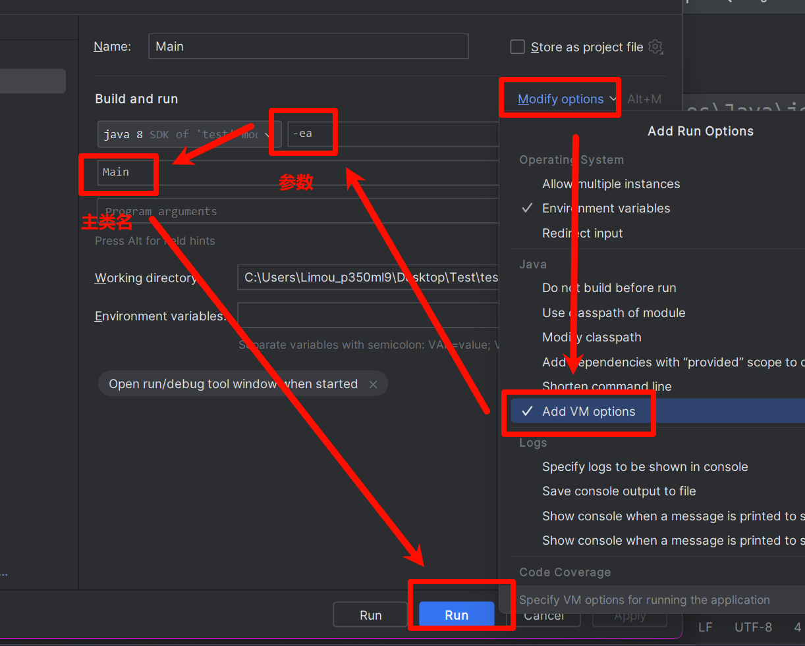

**叠甲：以下文章主要是依靠我的实际编码学习中总结出来的经验之谈，求逻辑自洽，不能百分百保证正确，有错误、未定义、不合适的内容请尽情指出！**

[TOC]

>   概要：...

>   资料：...

---

# 1.断言

`IDEA` 中默认 `assert` 是关闭，开启方式为：设置 `jvm` 的参数，参数为 `-enableassertions` 或 `-ea` 即可（对应的命令行就是 `java -ea MyApp`）。




```java
// 使用断言
public class Main {
    public static void main(String[] args) {
        int a = 1, b = 2;
        assert (a > b);
    }
}
/* 输出结果
Exception in thread "main" java.lang.AssertionError
	at Main.main(Main.java: 5)
*/
```

>   吐槽：老实说，断言这种机制比较少用，一般 `Java` 排错都是使用异常和日志。

# 2.异常

`Java` 拥有和 `Cpp` 类似的异常体系，其继承关系如下。


其中派生于 `Error` 和 `RuntimeException` 的异常都属于 **非检查型异常**（程序员通常在前者可以预防），而其他的异常都是 **检查型异常**（可能程序员不一定找得到）。

`C/Cpp` 中有些程序使用返回值来告知用户出现错误，这是早期的实践，虽然可以解决问题但是会带来一些比较经典的麻烦，因此 `Java` 中的异常机制就是让错误提示从方法返回值中剥离出来，异常提供了检错的机制。

通常方法会在方法签名的最后加上 `throws 异常类型` 子句的方式声明调用方法者：该方法有可能抛出某类型的异常（没有这个子句声明但是却抛出了异常就会报错）。

所谓的抛出异常，实际上就是抛出了被继承的异常类所创建的异常对象，通过 `throws` 关键字在方法内部进行实际的抛出，然后交给较外层进行捕获检查。

到底在什么时候抛出异常呢？只要有检查型异常就一定做抛出。

-   本方法内部调用了可能抛出检查型异常的方法
-   本方法自己遇到某些错误主动抛出检查型异常

剩下的异常，要么是您几乎无法解决的（`Error`），要么是您可以在编码中提前预防的（`RuntimeException`）。

```java
// 尝试使用异常, 并且抛出所有的检查型异常
import java.io.*;

class FileProcessor {

    /**
     * 读取文件内容并打印，如果文件不存在或者读取过程中出现 IO 异常，则抛出 IOException。
     *
     * @param fileName 文件名
     * @throws IOException 如果读取文件失败
     */
    public void readFile(String fileName) throws IOException {
        try (BufferedReader reader = new BufferedReader(new FileReader(fileName))) {
            String line;
            while ((line = reader.readLine()) != null) {
                System.out.println(line);
            }
        } catch (IOException e) {
            // 可以根据具体情况选择处理异常或者继续向上抛出
            throw new IOException("Failed to read file " + fileName, e); // 这里把异常的原因也加上了再重新抛出去
        }
    }
}

public class Main {
    public static void main(String[] args) {
        FileProcessor processor = new FileProcessor();
        try {
            processor.readFile("example.txt");
        } catch (IOException e) {
            System.err.println("An error occurred while processing the file: " + e.getMessage());
        }
    }
}
```

如果没有现有的异常符合您的需求，就可以自定义一个继承的子异常类，通常该类内部需要包含一个空参数构造器和字符串参数构造器（字符串主要是描述异常信息的）。

```java
// 尝试自定义异常类
public class CustomException extends Exception {

    // 空参数构造器
    public CustomException() {
        super(); // 调用父类的构造器
    }

    // 字符串参数构造器，用于传递异常信息
    public CustomException(String message) {
        super(message); // 调用父类的构造器，传入异常信息
    }
}
```

>   补充：一旦方法抛出异常，就不会返回到调用者，因此不必操心方法的此时的返回值，已经无关紧要了。

>   补充：关于 `finally` 和 `resources` 待补充...还有堆栈轨迹...

# 3.日志

日志的部分以后再补充...

>   补充：了解 `Logback` 日志框架。
>
>   

---

>   结语：...
