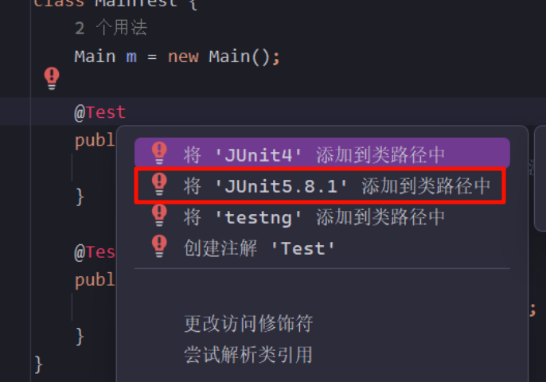
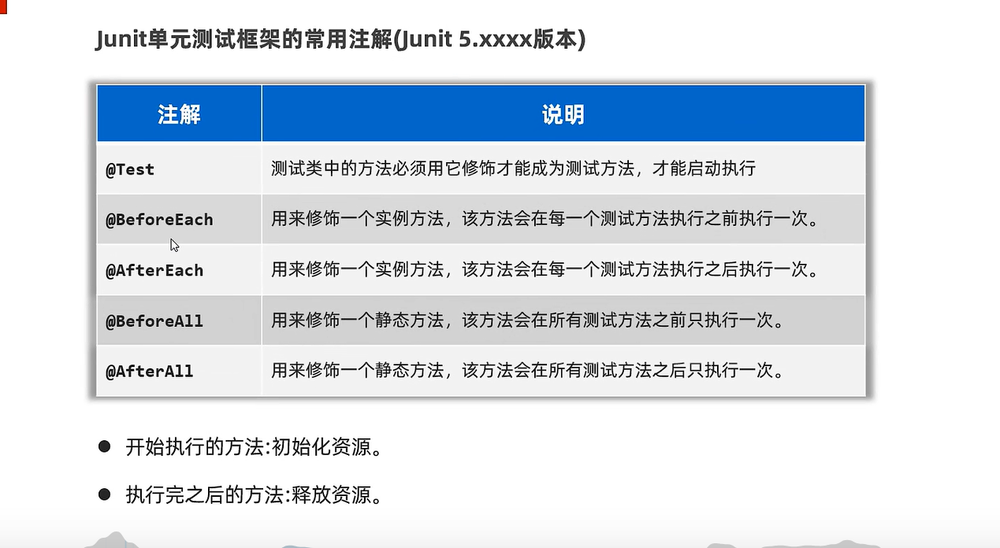

在 `Java` 开来单元测试就是针对最小的功能单元（方法），编写测试代码对其进行正确性测试。

`Junit` 单元测试框架，可以用来对方法进行测试，它是第三方公司开源出来的（很多开发工具已经集成了 `Junit` 框架，比如 `IDEA`）。



```java
// 尝试使用 Junit 进行单元测试
import org.junit.jupiter.api.Test;
import static org.junit.jupiter.api.Assertions.assertEquals;

// 假设这是我们要测试的类 Main
public class Main {
    public int add(int a, int b) {
        return a + b;
    }

    public int subtract(int a, int b) {
        return a - b;
    }
}

// 这里是对 Main 类的测试用例
class MainTest {
    Main m = new Main();

    @Test
    public void testAdd() {
        assertEquals(5, m.add(2, 3)); // 测试 add 方法是否正确
    }

    @Test
    public void testSubtract() {
        assertEquals(2, m.subtract(5, 3)); // 测试 subtract 方法是否正确
    }
}
```

