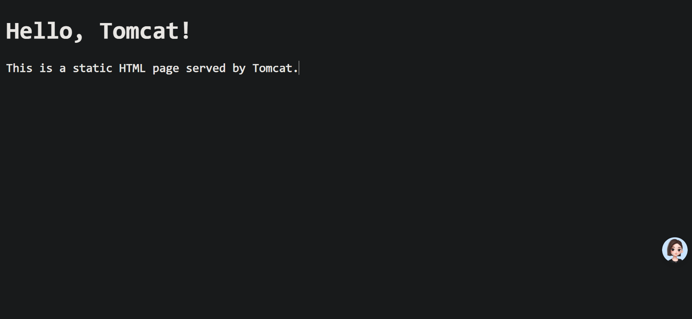

# 1.Tomcat

## 1.1.查看源代码

`TomCat` 也是 `Apache` 下的开源软件，您可以 [前往 Tomcat 官网获取软件和源代码](https://tomcat.apache.org/)，本身是使用 `Java` 编写的。我这里使用的是 `Tomcat 9.0.93` 版本，因为我的 `Windows11` 电脑这个时候只有一个 `Java8`，貌似 `Tomcat10` 以上的版本最低要求不是 `Java8`，您需要自己判定...

## 1.2.使用源代码

### 1.2.1.挂载静态网站

虽然这不是 `Tomcat` 的强项，但是这里也简单使用以下，了解一些配置。下载到源代码后，可能需要检查本地有哪些端口可以被使用，这里我就以 `8081` 为例子，修改配置文件的端口为 `8081`。

```xml
<!-- Tomcat/conf/server.xml -->
<?xml version="1.0" encoding="UTF-8"?>
<!-- ... -->
<!-- 喂喂喂, 在这里修改在这里!!! 修改 port 即可 -->
<Connector port="8081" protocol="HTTP/1.1" 
           connectionTimeout="20000"
           redirectPort="8443"
           maxParameterCount="1000"
           />
<!-- ... -->
```

然后直接在 `Tomcat/webapps/ROOT/` 中直接编写以下代码即可。

```html
<!-- Tomcat/webapps/ROOT/index.html -->
<!DOCTYPE html>
<html>
<head>
    <title>Welcome to Tomcat</title>
</head>
<body>
    <h1>Hello, Tomcat!</h1>
    <p>This is a static HTML page served by Tomcat.</p>
</body>
</html>
```

然后使用 `/Tomcat/bin/startup.bat` 这个脚本运行就行，我是用的是 `Windows` 版本的 `Tomcat` 如果您用的是 `Linux` 也是类似的...

```shell
# 尝试运行 Tomcat 服务器
.\startup.bat            
Using CATALINA_BASE:   "D:\Tomcat"
Using CATALINA_HOME:   "D:\Tomcat"
Using CATALINA_TMPDIR: "D:\Tomcat\temp"
Using JRE_HOME:        "C:\Program Files\Java\jdk1.8.0_192"
Using CLASSPATH:       "D:\Tomcat\bin\bootstrap.jar;D:\Tomcat\bin\tomcat-juli.jar"
Using CATALINA_OPTS:   ""
```

然后会弹出另外一个窗口，接下来使用浏览器访问 `http://localhost:8081/#/` 即可。



