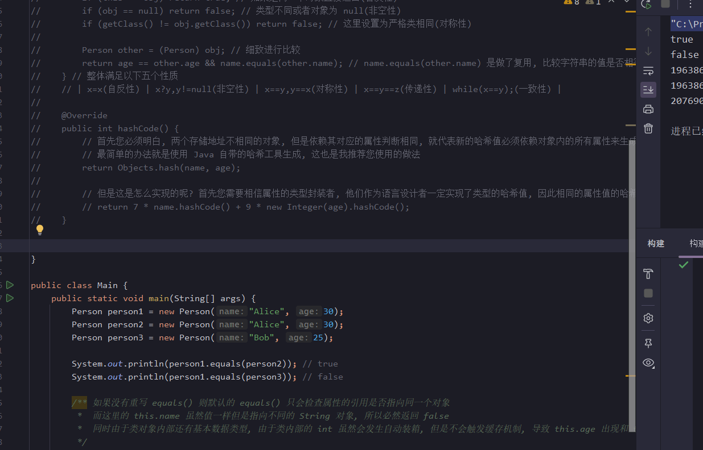

**叠甲：以下文章主要是依靠我的实际编码学习中总结出来的经验之谈，求逻辑自洽，不能百分百保证正确，有错误、未定义、不合适的内容请尽情指出！**

[TOC]

>   概要：...

>   资料：...

---

# 1.面向过程和面向对象

面向过程编程（`Procedural Programming`）和面向对象编程（`Object-Oriented Programming，OOP`）是两种不同的编程范式，`Java` 几乎把面向对象的思想贯彻到了极致，因此学习 `Java` 编程的过程中，对于 `Cpp` 面向对象的理解也会更加深刻。

>   吐槽：`Cpp` 本身是面向过程、面向对象、面向泛型的庞大语言。

# 2.访问限定符

`Java` 主要通过类的访问权限来实现访问权限的控制（这点和 `Cpp` 一样），将数据和封装数据的方法结合在一起，更符合人类对事物的认知。

而访问权限用来控制方法或字段能否直接在类外使用，并且 `Java` 还可以把访问限定符作用在整个类上（这点 `Cpp` 是没有的），这点我们后面补充...先姑且认定当前和 `Cpp` 的用法是一样的：限制成员变量和成员方法的访问。

| 范围       | private(私有) | default(默认的权限) | protected(继承内多用) | public(公有) |
| ---------- | ------------- | ------------------- | --------------------- | ------------ |
| 同包的同类 | yes           | yes                 | yes                   | yes          |
| 同包的异类 |               | yes                 | yes                   | yes          |
| 异包内子类 |               |                     | yes                   | yes          |
| 异包非子类 |               |                     |                       | yes          |

先看下面的知识叭，补充完对 `Java` 类的一些理解就可以看懂上面访问限定符的使用了。

# 3.类和对象基础

## 3.1.类的定义

类描述一系列的对象，而一个类的声明如下：

```java
// 定义类的语法形式
[类修饰符] class 类名 {
    // 一些属性/成员变量...
    // 一些方法/成员方法...
}
```

`Java` 的类和 `C` 语言的结构体很类似，和 `Cpp` 的 `class` 几乎一致，和 `Cpp` 一样可以类中加入方法（方法可以简单理解为函数），方法需要依赖对象才能被调用。

关于类，我们需要注意下面几点：

1.   一般一个 `Java` 文件内部只会存在一个类（也就是一一对应，但是我们在学习过程中可以放在一个文件中）

2.   `main()` 方法所在的类一般要使用 `public` 修饰（默认会在 `public` 修饰的类中寻找 `main()` 方法）

3.   如果一个类有 `public` 修饰，那么请不要直接手动修改这个类的类名（我们可以通过开发工具修改，这样才会让所有使用该类名的代码都进行同步修改，这也是 `IDEA` 强大功能的一处体现）

     

>   区别：`Java` 的类和 `Cpp` 的类最大区别在于默认自带的类成员不太一样，并且 `Cpp` 无法把访问限定符直接作用在类上，如果希望一个类不被外部访问创建，可以考虑使用友元类、限制构造函数、限制成员变量等做法来简介实现。因此从编写难度上来看 `Java` 更加直观且简洁。

## 3.2.类的对象

通过类描述这张“图纸”，可以通过 `new` 来实例化出多个对象。虽然一个 `Java` 文件内部只会存在一个类，但我们也可以尝试写到一起试试（这没什么错误，只是不太推荐而已）。

```cpp
// 尝试描述一个类然后定义一个类对象
// 描述对象的 Person 类
class Person {
    //成员变量
    public String name; // 名字
    public int age; // 年龄

    //成员方法
    public String GetName() { // 获取名字
        return name;
    }
    public int GetAge() { // 获取年龄
        return age;
    }
}

// 主类的主函数
public class Main {
    public static void main(String[] args) {
        Person per = new Person(); //使用 new 语法创建（实例化对象）
        per.name = "limou3434";
        per.age = 18;

        System.out.println("姓名: " + per.GetName());
        System.out.println("年龄: " + per.GetAge());
    }
}

/* 输出结果
姓名: limou3434
年龄: 18
*/
```

再换成一个类一个文件的方式写，在同一个 `Java` 项目中有如下两份文件：

```java
// Person.java
// Person 类
class Person {
    // 成员变量
    public String name; // 名字
    public int age; // 年龄

    // 成员方法
    public String GetName() { // 获取名字
        return name;
    }
    public int GetAge() { // 获取年龄
        return age;
    }
}
```

```java
// Main.java
// Main 类
// 主类内使用 Person 对象
public class Main {
    public static void main(String[] args) {
        Person per = new Person(); // 使用 new 语法创建
        per.name = "limou3434";
        per.age = 18;

        System.out.println("姓名:" + per.GetName());
        System.out.println("年龄:" + per.GetAge());
    }
}
```

上述的内部成员如果我们自己没有初始化，`Java` 也是会自己初始化的（内置类型为零值，引用类型为 `null`，`boolean` 为 `false`，`char` 为 `\u0000` 等）。

>   补充：对象内部是不存储方法的，只有在使用方法时才会在栈上开辟空间，而成员变量都存储在堆空间上。

>   补充：统一一下术语，在本系列中会频繁出现的一些和 `Cpp` 有些相似但是又不同的概念。`Cpp` 喜欢称呼“成员函数，成员变量”，而 `Java` 喜欢称呼“方法，属性”。

>   补充：`Java` 本身也有匿名对象，只需要通过 `new 类名()` 的方式就可以构造出来。

## 3.3.this 引用

### 3.3.1.this.成员变量

`this` 引用来源于 `C++` 的 `this` 指针，两者有所区别，但是很是类似，首先我们来看一个奇怪的现象。

```java
// 没问题的代码
class Data {
    public int _year;
    public int _month;
    public int _day;

    public void setData(int year, int month, int day) {
        _year = year;
        _month = month;
        _day = day;
    }

    public void print() {
        System.out.println(_year + " " + _month + " " + _day);
    }
}

public class Main {
    public static void main(String[] args) {
        Data day1 = new Data();
        day1.setData(2024, 1, 21);
        day1.print();

        Data day2 = new Data();
        day2.setData(2023, 2, 23);
        day2.print();
    }
}

/* 输出结果
2024 1 21
2023 2 23
*/
```

而下面代码中的 `SetData()` 如果是在 `Cpp` 中才可以正确运行，但在 `Java` 中会出现问题。

```java
// 有问题的代码
class Data {
    public int year;
    public int month;
    public int day;

    public void setData(int year, int month, int day) {
        year = year;
        month = month;
        day = day;
    }

    public void print() {
        System.out.println(year + " " + month + " " + day);
    }
}

public class Main {
    public static void main(String[] args) {
        Data day1 = new Data();
        day1.setData(2024, 1, 21);
        day1.print();

        Data day2 = new Data();
        day2.setData(2023, 2, 23);
        day2.print();

        // Java 怎么知道使用 setData() 后初始化的是 day1 的内部成员而不是 day2 的内部成员呢？
        // 答案是使用了 this 引用
    }
}

/* 输出结果
0 0 0
0 0 0
*/
```

`Java` 会认为是局部变量自己给自己赋值（根本不会影响成员变量的取值），因此打印的还是 `Java` 给变量的默认初始值。但是如果我们使用 `this` 引用就可以指明赋值关系，这样就不会出现问题。

```java
// 使用 this 引用
class Data {
    public int year;
    public int month;
    public int day;

    public void SetData(int year, int month, int day) {
        this.year = year;
        this.month = month;
        this.day = day;
    }

    public void Print() {
        System.out.println(year + " " + month + " " + day);
    }
}

public class Main {
    public static void main(String[] args) {
        Data day1 = new Data();
        day1.SetData(2024, 1, 21);
        day1.Print();

        Data day2 = new Data();
        day2.SetData(2023, 2, 23);
        day2.Print();
    }
}

/* 输出结果
2024 1 21
2023 2 23
*/
```

而这个 `this` 引用实际上就是调用方法的哪个对象，方法被哪个对象调用了，`this` 就引用的哪个对象。

第一个代码中，`Java` 会自动识别类内成员，给其加上 `this.`。而第二个代码中，由于形参的影响，`Java` 无法识别哪一个是成员变量，干脆都理解为局部变量，交给用户使用 `this` 去指定（但 `Cpp` 可以识别出这种特殊情况，不过我们仍旧不推荐这么书写，在 `Cpp` 要么使用 `this`，要么给成员变量加上一个 `_` 前缀和形参做区分）。

另外，这也能解释为什么使用 `setData()` 和 `print()` 可以明确对哪一个具体的对象做操作，每一个方法的第一个参数实际上就是 `this`。这是由 `Java` 自动传递的，我们无需手动给函数传递，只需要在函数内使用即可。

此外我们需要注意，`this` 引用只能在方法定义内被使用，且只能引用当前对象，不能被修改然后再引用其他对象。

>   注意：我们一般建议将 `this` 明确写上，不过度依赖 `Java` 的默认行为，避免造成误解。

### 3.3.2.this.成员方法

除了调用对象内的成员变量，还可以调用对象对应类内对应的成员方法（当然也可以不加 `this.` 也会有类似成员变量一样的自动识别，我还是推荐您加上）。

```java
// 使用 "this.成员方法" 来调用方法
class Data {
    public int _year;
    public int _month;
    public int _day;

    public void setData(int year, int month, int day) {
        _year = year;
        _month = month;
        _day = day;
        this.Print(); // 设定好值后就打印
    }

    public void print() {
        System.out.println(_year + " " + _month + " " + _day);
    }
}

public class Main {
    public static void main(String[] args) {
        Data day1 = new Data();
        day1.setData(2024, 1, 21);

        Data day2 = new Data();
        day2.setData(2023, 2, 23);
    }
}

/* 输出结果
2024 1 21
2023 2 23
*/
```

## 3.4.构造方法

我们在定义类的变量时，可以发现，即便我们没有定义类内部成员变量的初始值，`Java` 会帮助我们自动初始化。但是如果不是在类中，而是直接写在 `Main()` 中的局部变量则没有进行初始化，代码可能连编译都无法通过。

```java
// 编译通过的代码
class Data {
    public int _year;
    public int _month;
    public int _day;

    public void setData(int year, int month, int day) {
        _year = year;
        _month = month;
        _day = day;
        this.Print(); // 设定好值后就打印
    }

    public void print() {
        System.out.println(_year + " " + _month + " " + _day);
    }
}

public class Main {
    public static void main(String[] args) {
        Data d = new Data();
        // 忘记调用 d.setData() 了
        d.print();
    }
}

/* 输出结果
0 0 0
*/
```

```java
// 编译失败的代码
public class Main {
    public static void main(String[] args) {
        int year;
        int month;
        int day;
        System.out.println(year + " " + month + " " + day); // 报错
    }
}

/* 输出结果
java: 可能尚未初始化变量year
*/
```

那究竟是谁帮助我们对类内的成员变量进行了初始化呢？`Java` 么？是的，但是不够深层太过笼统。准确来说，是类内默认的成员方法：**构造方法**，该方法没有返回值，方法名和类名一样。

默认的构造方法会给成员变量赋予初始值，而当我们撰写任何自定义的构造方法时，`Java` 就不会调用编译器提供的默认构造方法（这点和  `Cpp` 是一样的），而是尝试直接调用我们自己自定义的构造方法（此时一旦失败就会报错，需要把有可能出现的构造方法都写出来）。并且，构造方法只在实例化对象的时候才会被自动调用。

```java
// 自定义构造方法
class Data {
    public int _year;
    public int _month;
    public int _day;

    Data() {
        System.out.println("不带参数的构造方法");
    }
    
    Data(int year, int month, int day) {
        System.out.println("带参数的构造方法");
        this._year = year;
        this._month = month;
        this._day = day;
    }

    public void setData(int year, int month, int day) {
        _year = year;
        _month = month;
        _day = day;
        this.Print(); // 设定好值后就打印
    }

    public void print() {
        System.out.println(_year + " " + _month + " " + _day);
    }
}

public class Main {
    public static void main(String[] args) {
        Data d1 = new Data();
        d1.Print();

        Data d2 = new Data(2021, 1, 2);
        d2.print();
        d2.setData(2024, 10, 9);
    }
}

/* 输出结果
不带参数的构造方法
0 0 0
带参数的构造方法
2021 1 2
2024 10 9
*/
```

除此以外，还以一种初始化方法叫做 **就地初始化**，直接在类内成员变量进行初始化，这种方式适用于一些具有默认值的成员变量，但是不具备一般性。用户一旦调用构造方法，就会被携带一个初始值，但这并不一定是符合用户意愿的（就地初始化的值会被传递到构造方法中，这点和 `Cpp` 类似）。

```java
// 自定义构造方法
class Data {
    public int _year = 1000; // 就地初始化
    public int _month = 1; // 就地初始化
    public int _day = 1; // 就地初始化

    Data() {
        System.out.println("不带参数的构造方法");
    }
    
    Data(int year, int month, int day) {
        System.out.println("带参数的构造方法");
        this._year = year;
        this._month = month;
        this._day = day;
    }

    public void setData(int year, int month, int day) {
        _year = year;
        _month = month;
        _day = day;
        this.print(); // 设定好值后就打印
    }

    public void print() {
        System.out.println(_year + " " + _month + " " + _day);
    }
}

public class Main {
    public static void main(String[] args) {
        Data d1 = new Data();
        d1.print();

        Data d2 = new Data(2021, 1, 2);
        d2.print();
        d2.setData(2024, 10, 9);
    }
}

/* 输出结果
不带参数的构造方法
1000 1 1
带参数的构造方法
2021 1 2
2024 10 9
*/
```

另外，还有一个 `this()` 构造方法，这个方法可以做到在一个构造方法内调用类内其他重载的构造函数（但必须是在构造函数方法内的第一条语句内调用，且不能被多次调用）。

```java
// 使用 this()
class Data {
    public int _year = 0; // 就地初始化
    public int _month = 0; // 就地初始化
    public int _day = 0; // 就地初始化

    Data() {
        this(2000, 1, 1); // 调用其他重载的构造方法
        System.out.println("不带参数的构造方法");
    }
    
    Data(int year, int month, int day) {
        System.out.println("带参数的构造方法");
        this._year = year;
        this._month = month;
        this._day = day;
    }

    public void SetData(int year, int month, int day) {
        _year = year;
        _month = month;
        _day = day;
        this.Print(); // 设定好值后就打印
    }

    public void Print() {
        System.out.println(_year + " " + _month + " " + _day);
    }
}

public class Main {
    public static void main(String[] args) {
        Data d = new Data();
        d.Print();
    }
}

/* 输出结果
带参数的构造方法
不带参数的构造方法
2000 1 1
*/
```

构造方法一般使用 `public`，只有在某些情况（单例模式）才会使用 `provate` 来修饰（下面会将这两个关键字的作用）。

>   补充：另外，构造函数实际上做的工作还有很多
>
>   1.   初始化分配的对象（也就是我们上面学的）
>   2.   为对象分配内存空间（这个我们无需理会）
>   3.   处理并发安全问题（以后提及）
>   4.   检测对象对应的类是否加载（以后提及）
>
>   后续学习中将会逐步补充...

>   补充：我们知道由于 `Java` 的特性，没有 `Cpp` 重点运算符重载方法、析构方法，但是最为重要的拷贝构造方法呢？这个 `Java` 是怎么解决的？这个问题要等您至少知道 `Object` 类和接口时才能彻底理解，后面再进行补充。
>

## 3.5.面向对象特性

面向对象的三个常见特性就是：封装、继承、多态，我们先来理解最容易理解的封装。

### 3.5.1.封装

#### 3.5.1.1.类的本身

`Java` 本身使用类组织属性和方法时，本就是在做一个封装的过程。

#### 3.5.1.2.包的使用

##### 3.5.1.2.1.包的概念

在面向对象体系中，有一个软件包的概念，为了更好的管理类，把多个类收集在一起成为一组，就称为 **软件包**。因此 `Java` 也引入了包的概念，包实质上是一种高级封装的体现。

>   补充在一个工程中允许存在同名类，只要处于不同的包内即可。

##### 3.5.1.2.2.包的导入

`Java` 存在很多的包，可以直接在代码中引入，也可以使用 `import` 语句来导入包。

```java
// 代码中使用包
public class Main {
    public static void main(String[] args) {
        java.util.Date date = new java.util.Date(); // 代码中导入包内类的方法
        System.out.println(date.getTime()); // 返回一个时间戳
    }
}
```

```java
// 使用 import 导入包
import java.util.Date;
public class Main {
    public static void main(String[] args) {
        Date date = new Date(); // 代码中导入包内类的方法
        System.out.println(date.getTime()); // 返回一个时间戳
    }
}
```

这里 `java.util.Date` 的 `java.util` 就是包，`Date` 就是包内的类，对应一个 `Java` 文件。

>   补充：如果使用 `*` 代替 `Date` 就可以看到 `java.util` 中的所有类，不过一般只推荐显示写一个类，否则有可能出现命名冲突的问题。
>
>   ```java
>   // 不同包内同名称类冲突的问题
>   import java.util.*;
>   import java.sql.*;
>   public class Main {
>       public static void main(String[] args) {
>           // util 和 sql 中都存在一个 Date 这样的类, 此时就会出现歧义, Java 不知道该使用哪一个类, 编译出错
>           // Date date = new Date();
>           // System.out.println(date.getTime());
>       }
>   }
>   ```

另外，还可以使用 `import static` 导入包中静态的成员变量和成员方法。

```java
// 使用静态导入
import static java.lang.Math.*;
public class Main {
    public static void main(String[] args) {
        double x = 3;
        double y = 4;

        double ret = sqrt(pow(x, 2) + pow(y, 2)); //计算 √(30^2 + 50^2)
        System.out.println(ret);
    }
}

/* 输出结果
5.0
*/
```

>   注意：`import` 和 `C/C++` 的 `#include` 不是同一种东西，`C/C++` 使用 `#include` 会在编译期间将整个头文件复制下来，再使用链接器链接。而 `Java` 的 `import` 仅仅是为了编写代码时更加方便，因此更类似 `C/C++` 的 `namespace` 和 `using` 的使用。
>
>   因此即使不使用 `import`，您仍然可以使用 `Java` 中的类和方法，但每次使用时都需要指定完整的类名，包括包名。

##### 3.5.1.2.3.包的制作

```java
// 描述对象的 Person 类
public class Person {
    // 描述对象的 Person 类
    // (1)成员变量
    public String name; // 名字
    public int age; // 年龄

    // (2)成员方法
    public String GetName() { //获取名字
        return name;
    }
    public int GetAge() { //获取年龄
        return age;
    }
}
```

对于上面类，如何成为一个供人使用的包呢？或者说，我们怎么自定义一个包呢？按照下面步骤来操作：

1.   要在类的最上方加上 `package 包名` 语句，一般使用公司域名的颠倒形式（`com.limou.blog`），包名尽量是唯一的

2.   在 `IDEA` 中右键 `src` 文件夹，在 `new` 中选择 `Package`，在弹出的对话框中输入包名

     

     

     

3.   右击包，选择 `New` 中的 `Java Class` 输入类名

     

     

4.   在新出现的 `java` 文件中粘贴代码即可

     

5.   在 `main()` 中调用即可

     ```java
     // 在主类的 main() 中正常调用
     import com.limou.blog.Person;
     // 主类的主函数
     public class Main {
         public static void main(String[] args) {
             Person per = new Person(); // 使用 new 语法创建（实例化对象）
             per.name = "limou3434";
             per.age = 18;
     
             System.out.println("姓名:" + per.GetName());
             System.out.println("年龄:" + per.GetAge());
         }
     }
     ```

>   补充：如果同一个域名不同包呢？
>
>   1.  如果 `example.com` 域名下有两个项目分别是 `project1` 和 `project2`，那么它们的包结构可能如下所示：
>
>       ```
>       复制代码com.example.project1
>       com.example.project2
>       ```
>
>   2.  如果 `project1` 项目包含了多个模块，如 `module1`、`module2`，那么它们的包结构可能如下所示：
>
>       ```
>       复制代码com.example.project1.module1
>       com.example.project1.module2
>       ```
>
>   通过这种方式，可以在同一个域名下为不同的项目和模块创建独立的命名空间，避免命名冲突，并且能够更清晰地组织和管理代码。

### 3.5.2.继承

>   吐槽：实际上继承的目的更多是为了后续的多态，而不是为了复用代码。

`Java` 继承允许一个类（称为子类或派生类）继承另一个类（称为父类或基类）的属性和方法，并且没有类似“公有继承、私有继承...”的说法（这点和 `Cpp` 的不同，`Cpp` 会使用限定符做到多样的继承方式）。

并且还允许子类对父类方法进行 **重定/隐藏**，其条件是 **父子类各自拥有一个标识符相同的属性或方法**。我更喜欢 ==隐藏== 这个说法，这意味着父类的属性和方法在子类中依旧存在，只不过需要使用 `super` 来显式进行访问而已。

```java
// 尝试使用继承
// 定义一个父类
class Animal {
    // 父类的属性
    String name;

    // 父类的构造
    public Animal(String name) {
        this.name = name;
    }

    // 父类的方法
    public void eat() {
        System.out.println(name + " eat " + "food");
    }
}

// 定义一个子类
class Dog extends Animal {
    // 子类的属性
    String breed;

    // 子类的构造
    public Dog(String name, String breed) {
        super(name); // 先调用父类的构造方法(内部自动调用父类构造, 不过仅限于提供的默认构造, 也可以显示调用, 因此最好是都使用 super() 进行显式调用)
        this.breed = breed; // 然后构造自己的属性
    }

    // 子类的方法
    public void bark() {
        System.out.println("bark bark bark bark~");
    }

    // 子类也可以选择 "重写/覆盖" 父类的方法
    public void eat(String food) {
        System.out.print(breed + " " + super.name + " are animals, too. ");
        super.eat(); // 但是依旧可以调用父类的方法, 这个方法使用的是子类继承自父类的成员
    }
}

// 主类包含 main 方法, 程序的入口点
public class Main {
    public static void main(String[] args) {
        // 创建 Animal 类的实例
        Animal animal = new Animal("animal");
        animal.eat();

        // 创建 Dog 类的实例
        Dog dog = new Dog("dog", "black");
        dog.eat("apple");
        dog.bark();
    }
}
```

在这个例子中，`Animal` 类是父类，它有一个属性 `name` 和一个方法 `eat()`。`Dog` 类是子类，它继承了 `Animal` 类，并添加了自己的属性 `breed` 和特有的方法 `bark()`。同时，`Dog` 类重写了 `eat()` 方法，以展示如何使用继承并添加或修改行为。

当你运行这个程序时，它会创建 `Animal` 类和 `Dog` 类的实例，并调用它们的方法来演示继承的效果。

### 3.5.3.多态

`Java` 多态允许父类类型接受子类对象，并且使用父类的方法时，程序运行时会根据对象的实际子类型来调用相应的方法，并且一个方法默认允许多态（这点和 `Cpp` 不同，`Cpp` 需要使用 `virtual` 关键字允许方法进行多态）。

并且还允许子类对父类方法进行 **重写/覆盖**，其条件是 **父子类拥有签名完全相同的方法（除去协变的情况）**。我更喜欢 ==覆盖== 这个说法，在 `Cpp` 对应多态的实现中，多态的实现就是在调用时函数指针的替换，因此使用覆盖会对 `Cpper` 会更友好一些。

```java
// 尝试使用多态
// 定义一个父类
class Animal {
    void makeSound() {
        System.out.println("Some generic sound");
    }
}

// 定义一个子类
class Dog extends Animal {
    void makeSound() {
        System.out.println("Bark"); // 覆盖
    }
}

// 定义一个子类
class Cat extends Animal {
    void makeSound() {
        System.out.println("Meow"); // 覆盖
    }
}

// 测试多态性的类
public class Main {
    public static void main(String[] args) {
        // 定义一个父类类型的引用，指向子类的对象
        Animal myDog = new Dog();
        Animal myCat = new Cat();

        // 调用多态方法
        myDog.makeSound(); // 输出: Bark
        myCat.makeSound(); // 输出: Meow

        // 多态允许我们使用父类引用调用子类覆盖的方法
    }
}
```

>   补充：重载其实也算一种特殊的多态，也是一种调用对应多种实现，这种多态也叫编译时多态。而我们上面提到的多态，更多发生于继承之中，是运行时多态。

>   补充：实际上多态也还可以依赖接口来实现，不过这点我们后面提到接口时讲。

>   补充：协变的情况，待补充...

### 3.5.4.抽象

抽象类和抽象方法在 `Java` 中也有对应的使用，其主要目的是强制使用该类的程序员实现对应的子类或子类方法，以便更好支持多态。

-   抽象方法在定义的时候只有函数签名
-   并且抽象类中不一定有抽象方法，由抽象方法的类一定是抽象类
-   抽象类无法直接创建出实例对象
-   子类继承抽象类时，必须实现所有的抽象方法，否则这个类本身也需要被定义为抽象类

在设计抽象类的时候，可以把子类中重复代码的部分实现为一个非抽象方法，而非重复代码的部分实现为一个抽象方法，然后再非抽象方法中调用抽象方法。而抽象方法就交给子类来实现，这其实就是一种 **设计模板方法设计模式**，其中父类的非抽象方法也可以被叫为 **模板方法**。

```cpp
// 尝试使用抽象类
// 抽象父类
abstract class Animal {
    // 抽象方法
    public abstract void makeSound();

    // 普通方法
    public void sound() {
        System.out.print("动物会有不同的叫声, 例如 "); // 公共代码
        makeSound(); // 差异代码
    }
}

// 具体子类 1
class Dog extends Animal {
    @Override
    public void makeSound() {
        System.out.println("Bark");
    }
}

// 具体子类 2
class Cat extends Animal {
    @Override
    public void makeSound() {
        System.out.println("Meow");
    }
}

public class Main {
    public static void main(String[] args) {
        // 不能直接实例化抽象类
        // Animal animal = new Animal(); // 编译错误

        // 可以使用抽象类的引用指向子类的实例
        Animal dog = new Dog();
        dog.sound();

        Animal cat = new Cat();
        cat.sound();
    }
}
```

>   补充：使用 `final` 关键字除了可以定义变量为常量，还可以让类内方法不可以被继承并覆盖（但是允许隐藏），这种场景通常用在设计模板方法设计模式中，防止用户继承子类后将模板方法进行覆盖。

# 4.static 关键字

## 4.1.静态属性

同一个类类型实例化出不同的对象，内部属性有可能是不一样的，但是可能存在某个属性是所有对象的公有属性（例如：不同学生对象都是学生类创建出来的，但是都同属于一个学校）。

而我们一般不会让每个对象都存储这个公有属性，一是会出现数据冗余，二是不易修改（如果要对学生的学校名称进行重命名，则每一个学生的学校名称属性都需要被修改）。

因此就诞生了 `static` 修饰的成员变量，也被称为“静态成员变量”（只是沿用 `C/Cpp` 的说法本身没有什么含义），该成员不属于任何一个具体的对象，是被所有对象共享的，也是单属于类的属性。

既可以通过类名来访问，也可以使用对象来访问，但是一般推荐使用类名（语义更好）。

```java
// 尝试使用 static 关键字
class Student {
    public String name;
    public String gender;
    public int age;
    public double score;
    public static String school = "limou school";

    public void Init(String name, String gender, int age, double score) {
        this.name = name;
        this.gender = gender;
        this.age = age;
        this.score = score;
    }
}

public class Main {
    public static void main(String[] args) {
        // 静态成员变量可以直接通过类名访问
        System.out.println(Student.school);
        Student s1 = new Student();
        Student s2 = new Student();
        Student s3 = new Student();
        s1.Init("Li leilei", "男", 18, 3.8);
        s2.Init("Han MeiMei", "女", 19, 4.0);
        s3.Init("Jim", "男", 18, 2.6);
        // 也可以通过对象访问：但是 school 是三个对象共享的
        System.out.println(s1.school);
        System.out.println(s2.school);
        System.out.println(s3.school);
        s1.school = "dimou school"; // 任意的成员尝试进行修改
        System.out.println(Student.school); // 可以发现的确受到了影响
    }
}
```

## 4.2.静态方法

实际上，除了静态成员变量，还有静态成员方法，也是在函数的前面加上 `static` 关键字，同理，该方法也是类的方法，不是某个对象持有的。静态方法和 `Cpp` 的做法类似，本身会缺失一个隐含参数 `this` 引用，因此无法访问类内的其他非静态成员，但能够访问所有的静态成员。

```java
// 尝试使用静态方法
class Student {
    public String name;
    public String gender;
    public int age;
    public double score;
    public static String school = "limou school"; //就地初始化静态变量

    public void Init(String name, String gender, int age, double score) {
        this.name = name;
        this.gender = gender;
        this.age = age;
        this.score = score;
    }

    public static void ShowSchool() {
        System.out.println(Student.school);
    }
}

public class Main {
    public static void main(String[] args) {
        // 静态成员变量可以直接通过类名访问
        System.out.println(Student.school);
        Student s1 = new Student();
        Student s2 = new Student();
        Student s3 = new Student();
        s1.Init("Li leilei", "男", 18, 3.8);
        s2.Init("Han MeiMei", "女", 19, 4.0);
        s3.Init("Jim", "男", 18, 2.6);
        // 也可以通过对象访问：但是 school 是三个对象共享的
        Student.ShowSchool();
    }
}
```

不过，就算不是静态成员方法，方法也同样不是某个对象所持有的，那为什么需要静态成员方法呢？原因有下：

-   可以省略创建对象的过程，直接使用类名来使用静态函数，使得代码更加整洁。因此适用于一些不需要依赖具体对象的方法，使用起来更加符合语义（无需依赖类对象就可以被调用，这样就不会因为类对象造成代码混淆），更适合作为全局函数（例如一些数学运算实际上只依赖计算方法而不依赖类创建出来的对象）。这种特性非常适合定义一些工具库，只需要使用一个类来统一组织这些静态方法，就可以打造出一个方便的工具库。
-   由于没有 `this` 引用，就会约束静态方法只能使用静态属性，这在有些时候很有用。

>   补充：`Cpp` 对于 `static` 的理解有三层。
>
>   -   **第一层**：首次引入了 `static` 时，只是为了表示退出代码块后仍然不销毁的静态变量
>   -   **第二层**：第一次复用 `static` 时，表示不能从其他文件访问全局变量或函数，同时避免了添加关键字带来的麻烦
>   -   **第三层**：第二次复用 `static` 时，已经和 `static` 本来的意义有些脱离了，但这层的含义和 `Java` 的 `static` 类似，使得类拥有静态属性和静态方法

>   补充：在 `Java` 中，类内方法内不能直接定义静态变量。静态变量（或称为类变量）是属于类本身的，而不是属于类的实例，因此不能定义在方法内。所以静态变量通常在类的顶层定义，而不是在方法内。在方法内部，只能定义局部变量，这些变量仅在方法被调用时存在，并且在方法执行结束后会被销毁。
>
>   而会把 `static` 关键字放入方法内部的一定学过 `Cpp`（大概），因为 `Java` 对 `static` 的使用只有 `Cpp` 第三层的理解。`Cpp` 中 `static` 的其他用法则会通过其他方式在 `Java` 中实现，这里如果误用就是误用了第一层的用法。

>   补充：静态方法无法被重写，不能用来实现多态，这个以后再来补充...

# 5.代码块

使用 `{}` 定义的一段代码被称为代码块，根据代码块定义的位置和关键字，可以简单分为：

-   **普通代码块**：这种代码块没有太大的用途，单纯是用来方便组织程序的
-   **静态代码块**：是定义在类中的静态块，用于执行类加载前（准确来说是在 `JVM` 加载类前）的初始化操作，静态代码块在构造一个对象前只执行一次（包含多个静态代码块时，就会按照多个静态代码块的顺序来依次执行）。
-   **构造代码块**：在类中直接使用代码块就是一个构造代码块，只在对象实例化的时候才会被调用（多次实例化就被多次调用），要比构造函数先调用构造代码块。功能比直接赋值给类属性要更加强大。
-   **同步代码块**：多线程的内容，这块内容以后讲到多线程时再进行补充...

下面供您两份代码，请您关注代码块的使用和位置，并且观察调用的执行顺序。

```java
// 代码块演示 1
class MyClass {
    public int data;

    public static String name;

    {
        this.data = 10;
        System.out.println("构造代码块 2, this.data = " + this.data);
    }

    static {
        MyClass.name = "gimou";
        System.out.println("静态代码块 2, MyClass.name = " + MyClass.name);
    }

    MyClass() {
        System.out.println("构造方法: " + this.data);
    }

    {
        this.data = 20;
        System.out.println("构造代码块 1, this.data = " + this.data);
    }

    static {
        MyClass.name = "eimou";
        System.out.println("静态代码块 1, MyClass.name = " + MyClass.name);
    }

    public void print() {
        System.out.println("mc.data = " + this.data + " and " + "MyClass.name = " + MyClass.name);
    }
}

public class Main {
    public static void main(String[] args) {
        MyClass mc = new MyClass();
        mc.print();
        mc.data = 18;
        MyClass.name = "limou";
        System.out.println("mc.data = " + mc.data + " and " + "MyClass.name = " + MyClass.name);
    }
}

/* 执行结果
静态代码块 2, MyClass.name = gimou
静态代码块 1, MyClass.name = eimou
构造代码块 2, this.data = 10
构造代码块 1, this.data = 20
构造方法: 20
mc.data = 20 and MyClass.name = eimou
mc.data = 18 and MyClass.name = limou
*/
```

```java
// 代码块演示 2
class MyClass {
    public int data;

    public static String name;

    {
        this.data = 10;
        System.out.println("构造代码块 2, this.data = " + this.data);
    }

    static {
        MyClass.name = "gimou";
        System.out.println("静态代码块 2, MyClass.name = " + MyClass.name);
    }

    MyClass() {
        System.out.println("构造方法: " + this.data);
    }

    {
        this.data = 20;
        System.out.println("构造代码块 1, this.data = " + this.data);
    }

    static {
        MyClass.name = "eimou";
        System.out.println("静态代码块 1, MyClass.name = " + MyClass.name);
    }

    public void print() {
        System.out.println("mc.data = " + this.data + " and " + "MyClass.name = " + MyClass.name);
    }
}

public class Main {
    public static void main(String[] args) {
        // MyClass mc = new MyClass(); // 由于没有实例化类对象, 因此就不会调用构造代码块, 同时也不会调用构造方法, 但静态代码块依旧会被执行
        // mc.print();
        // mc.data = 18;
        MyClass.name = "limou";
        // System.out.println("mc.data = " + mc.data + " and " + "MyClass.name = " + MyClass.name);
    }
}

/* 执行结果
静态代码块 2, MyClass.name = gimou
静态代码块 1, MyClass.name = eimou
*/
```

>   补充：另外也有把构造代码块叫做实例代码块的。这个构造代码块的概念有些类似 `Cpp` 中直接给类属性进行赋值或者初始化列表的行为，并且最后也会被传递给构造函数。

# 6.内部类

当一个类内部需要一个完整的类结构来描述成员时，就需要一个内部类结构（尤其是内部类只为外部类服务而不对外服务时），这种内部类的设计思想其实就是组合的设计思想。

-   `Java` 的内部类和 `Cpp` 有很大的不同，`Java` 的内部类自动带有隐式的 `this` 引用，可以直接访问外部类的成员属性和成员方法，这也意味着内部类的创建必须依赖外部类的创建，否则使用内部类的某些方法时，这些方法在使用外部类的属性和方法就会导致出错。从这个角度上来看，子类的确依附于父类。
-   而 `Cpp` 的内部类仅仅是在内部类内部的属性和方法如果使用了外部类对象时，可以无视访问限定符的限制访问外部类的访问限定符。除此以外，外部类和内部类还是并行的关系，内部类对象的创建并不直接依赖于外部类对象（虽然需要依赖外部类访问来创建如 `Father::Sub...`，因此仅仅是友元类的关系），因此 `Java` 的静态内部类倒是和 `Cpp` 的内部类是类似的概念（但是）。

至于为什么使用内部类，一是有时我们需要这种内部直接无限制访问外部类对象成员的便捷手段；二是内部类可以对同包中的其他类隐藏（探讨这个问题就是在询问何时使用组合的问题...）。

## 7.1.成员内部类

```java
// 尝试使用成员内部类
class Father {
    // 实例内部类/非静态内部类
    public int data = 1;
    class Son {
        public int data = 2;
        class Grandson {
            public int data = 3;
            public void func() {
                System.out.println(data); // 获取内部对象
                System.out.println(this.data); // 获取内部对象, 这个 this 是内部类自己的
                System.out.println(Son.this.data); // 获取较外部对象, 这个 this 引用较外部类
                System.out.println(Father.this.data); // 获取最外部对象, 这个 this 引用最外部类
            }
        }
    }
}

public class Main {
    public static void main(String[] args) {
        Father f = new Father();
        Father.Son.Grandson fsg = f.new Son().new Grandson();
        fsg.func(); // 创建内部类的对象
    }
}
```

>   补充：内部类和外部类的成员如果名字一样，就会导致就近原则。

>   补充：不过值得注意的是，成员内部类不能直接定义一个属于自己的静态变量，但是可以通过 `final` 来规避（不过类内方法还是无法定义 `static` 变量，就算用了这个也不能避免）。
>
>   ```java
>   // 给内部类定义静态对象
>   class Father {
>       // 实例内部类/非静态内部类
>       public int data1;
>       public static int data2;
>       class Son {
>           int data3;
>           static final int data4 = 10; // 这个值在编译的时候就固定好了
>   
>           public void print() {
>               System.out.println(data4);
>           }
>       }
>   }
>   
>   public class Main {
>       public static void main(String[] args) {
>           Father f = new Father();
>           Father.Son ds = f.new Son();
>           ds.print();
>       }
>   }
>   ```
>
>   不过上述这一无法在内部类中创建 `static` 成员的行为已在 `jdk16` 被允许使用。但是由于目前（`2024-07-08`）依旧有很多的项目会使用 `jdk8`，至少我在 `jdk8` 中的测试是不允许直接创建静态成员的，因此这一点您需要注意一下。

>   补充：`final` 有些类似 `Cpp` 中的 `const`，但是会更容易理解一些，常量就是常量，没有特殊情况...

## 7.2.静态内部类

```java
// 尝试使用静态内部类
class Outer {
    // 实例内部类/非静态内部类
    public int data1 = 1;
    public int data2 = 2;
    public static int data3 = 3;

    public void test1() {
        System.out.println("Outer.test1()");
    }

    // 创建一个静态内部类
    static class Inner {
        public int data3 = 4;
        public int data4 = 5;
        public static int data5 = 6; // 在静态内部类中定义静态熟悉是被允许的

        public void test2() {
            System.out.println("Inner.test2()");
            // 静态内部类因为没有"外部类.this 引用", 无法直接访问外部类成员, 因为本身不需要使用外部类来创建实例对象, 同时也无法访问外部类成员
            // System.out.println(data1); // error
            // System.out.println(Outer.data2); // error

            // 但是依旧是有方法的, 可以创建一个外部类成员再访问(不过这种就会受到一些范围限定符的限制了)
            Outer o = new Outer();
            System.out.println(o.data1);

            // 自己的属性还是可以访问的
            System.out.println(data3);
            System.out.println(data4);
            System.out.println(this.data5);
        }
    }
}

public class Main {
    public static void main(String[] args) {
        Outer.Inner in = new Outer.Inner(); // 无需实例化外部类对象就可以使用
        in.test2();
    }
}
```

老实说对于静态内部类我还有些疑惑，主要时关于静态类的意义，以后再补充...

## 7.3.局部内部类

局部内部类是指在方法内部实现的，只允许局部可用的类，其定义只在本方法内有效（但是很少用）。

## 7.4.匿名内部类

匿名内部类的使用较多，是特殊的局部内部类，但是没有名字，内部类本质是一个无名子类。

```java
// 尝试使用匿名内部类
abstract class Animal {
    public abstract void cry();
}

// 为了执行一个方法, 我们需要继承一个子类再调用, 这在有些时候是不符合逻辑的
// class Cat extends Animal {
//     public void cry() {
//         System.out.println("miao~");
//     }
// }

public class Main {
    public static void main(String[] args) {
        // Animal a = new Cat();
        // a.cry();

        Animal a = new Animal() { // 这里不是创建了一个 Animal 对象, 而是隐式继承了 Animal 的子类后, 创建一个子类对象 a
            @Override
            public void cry () {
                System.out.println("miao~");
            }
        }; // 可以访问外部的变量和方法, 但不能新增属性
        a.cry();
    }
}
```

匿名内部类可以更加方便创建出一个子类对象，并且通常可以作为一个参数传递给一个方法。

# 7.枚举

## 7.1.普通枚举

使用枚举类的关键字是 `enum`，其定义行为有些类似 `class`（可以像类一样）。但是值得注意的是，枚举类一定是无法被继承的最终类。并且构造方法是私有的，无法在枚举类以外的地方构造。

而枚举量和 `C/Cpp` 中的枚举结构体有很大的不同，第一行全部都是枚举常量的对象，也就是枚举对象。

在需要使用枚举常量时，就需要使用类名来访问内部的枚举常量。

```java
// 尝试使用枚举类
// 定义一个红绿灯的类
enum TrafficLight {
    // 必须在第一行罗列枚举对象, 下面本质上是调用了构造函数构造一个枚举常量
    RED("Red", 30), // public static final TrafficLight RED = new TrafficLight("Red", 30)
    GREEN("Green", 60), // public static final TrafficLight GREEN = new TrafficLight("Red", 30)
    YELLOW("Yellow", 5); // public static final TrafficLight YELLOW = new TrafficLight("Red", 30)

    private String color; // 颜色
    private int duration; // 时长

    // 构造函数
    TrafficLight(String color, int duration) { // private  TrafficLight(String color, int duration) {...}
        this.color = color;
        this.duration = duration;
    }

    // 获取颜色
    public String getColor() {
        return color;
    }

    // 获取持续时间
    public int getDuration() {
        return duration;
    }

    // 以下为枚举类的隐藏方法, 可以直接调用
    // public static TrafficLight[] values(); // 获取所有枚举对象
    // public static TrafficLight valueOf(java.lang.String); // 将字符串转化为枚举变量
    // public String name(TrafficLight); // 将枚举常量转化为字符串
    // public int ordinal(TrafficLight); // 返回枚举常量在枚举结构中的索引
}

class Main {
    public static void main(String[] args) {
        TrafficLight currentLight = TrafficLight.RED; // 访问枚举量
        System.out.println(currentLight);

        for (TrafficLight light : TrafficLight.values()) { // 获得 TrafficLight.values() 中的每一个枚举值
            System.out.println("The light is " + light.getColor() + " and it lasts for " + light.getDuration() + " seconds.");
        }

        String light = "RED";
        TrafficLight t = TrafficLight.valueOf(light);
        if (t instanceof TrafficLight && light instanceof String) { // 判断返回的类型是否相同, 证明成功进行了转化
            System.out.println("true");
        }

        if (t.name() instanceof String) { // 证明 name() 的返回值是字符串类型
            System.out.println(t.name());
        }

        TrafficLight tra = TrafficLight.RED;
        switch (tra) {
            // case TrafficLight.RED: // 这里有点小特殊, 只能使用 RED
            case RED:
                System.out.println("case");
                break;
        }

        System.out.println(t.ordinal()); // 获取枚举的索引
    }
}
```

>   补充：用枚举来写单例简直不要太简单，这是基于枚举没有公共的构造器，以及 `Java` 没有 `Cpp` 中的运算符重载方法、析构方法

## 7.2.抽象枚举

有些地方还有抽象枚举的概念，这里简单补充一下。

```java
// 尝试使用抽象枚举类
enum TrafficLight {
   X() { // 有点类似匿名内部类的构造 public TrafficLight X = new TrafficLight() {...}
       @Override
       public void go() {
           System.out.println("Is X.");
       }
   }, Y() {
       @Override
       public void go() {
           System.out.println("Is Y.");
       }
   }, Z() {
       @Override
       public void go() {
           System.out.println("Is Z.");
       }
   };
   public abstract void go();
}

class Main {
   public static void main(String[] args) {
       System.out.println(TrafficLight.X);
       TrafficLight.X.go();
   }
}
```

>   补充：至于抽象枚举的意义...由于很少用，如果以后有机会我再来补充...

# 8.包装类

以下是 `Java` 中常用的基本数据类型及其对应的包装类：

*   `boolean->Boolean`
*   `byte->Byte`
*   `char->Character`
*   `short->Short`
*   `int->Integer`
*   `long->Long`
*   `float->Float`
*   `double->Double`

包装类在 `Java` 中是一种特殊的类，它允许将基本数据类型（如 `int`、`char` 等）包装成对象。每种基本数据类型都有对应的包装类，这些包装类提供了一些额外的方法和功能，使得基本数据类型可以像对象一样使用。包装类主要有以下作用：

1. **将基本数据类型转换为对象**：在需要将基本数据类型作为对象处理的情况下，例如插入一些集合类型的元素必须是一个对象，或是泛型编程必须使用对象类型是，就可以使用包装类来实现（辅助 `Java` 成为更好的面向对象语言）

2. **提供基本数据类型的常量和方法**：每个包装类提供了一些常量（例如 `MIN_VALUE`、`MAX_VALUE`）和方法（例如类型转换、比较、格式化输出等），方便对基本数据类型进行操作（这就符合了一个类型有自己对于的操作的定义）

>   警告：包装类内部存储的值不可以被直接修改，要么在执行高频的计算中把值先从包装类中取出来统一计算，或者在运算的过程中重新生成 `Integer` 对象。

```java
// 尝试使用不同的包装类
public class Main {
    public static void main(String[] args) {
        Integer a = 100; // 自动装箱, 相当于 Integer a = Integer.valueOf(100);
        int b = a; // 自动拆箱, 相当于 int b = a.intValue();
        System.out.println("a: " + a);
        System.out.println("b: " + b);
        System.out.println(a.getClass().getName()); // true, 因为包装类也是继承 Object 祖先类的
        // System.out.println(b.getClass().getName()); // error, 因为基本数据类型不存在成员方法

        java.util.List<Integer> intList = new java.util.ArrayList<>();
        intList.add(30); // 自动装箱
        System.out.println(intList.get(0)); // 自动拆箱

        if (100 == a) { // 自动拆箱
            System.out.println(100 + a); // 自动装箱
        }

        System.out.println(a + a); // 自动拆箱
    }
}
```


```java
// 包装类对象间的"比较误区"和"缓存机制
public class Main {
    public static void main(String[] args) {
        Integer num1 = new Integer(100); // 使用构造方法构造全新的 Integer 对象
        Integer num2 = new Integer(100); // 使用构造方法构造全新的 Integer 对象
        Integer num3 = Integer.valueOf(100); // 使用 valueOf 方法缓存机制创建 Integer 对象
        Integer num4 = Integer.valueOf(100); // 使用 valueOf 方法缓存机制创建 Integer 对象

        // 因此由于 Java 没有 Cpp 的运算符重载, 用户无法定义 Java 中 "=" 的行为
        // 而 Java 的 = 默认比较的是对象引用是否相同, 因此就会出现下面的 "奇怪" 的行为
        if(num1 != num2) { // 两个不同的对象
            System.out.println("num1 != num2");
        }

        if(num2 != num3) {
            System.out.println("num2 != num3");
        }

        if(num3 == num4) {
            System.out.println("num3 == num4");
        }

        // 正确的比较
        if (num1.intValue() == num2.intValue() && num2.intValue() == num3.intValue() && num3.intValue() == num4.intValue()) { // 调用 intValue 方法获取基本类型值
            System.out.println("True");
        }

        if (num1.equals(num2) && num2.equals(num3) && num3.equals(num4)) {
            System.out.println("True");
        }
    }
}
```

>   补充：`Integer` 内部使用了一个缓存数组（在使用类 `Integer` 前提前 `new` 了一个包装不同连续整数的 `Integer` 数组，这种机制可以通过静态代码块来实现），当调用 `Integer.valueOf(int i)` 时有以下两种情况。
>
>   -   如果 `i` 在范围中，方法会直接从缓存数组中返回相应的 `Integer` 对象
>   -   否则会创建一个新的 `Integer` 对象，存储新的整数值
>
>   因此如果恰好 `i` 相同，则使用 `valueOf(int i)` 的时候，就会返回同一个对象，此时使用 `==` 去比较对象，就是比较的对象的引用是否相同，那么这样当然是相同的。
>
>   因此多个 `i` 都超出了范围，缓存机制就会失效，各自创建出新的类对象出来，这些类对象进行比较肯定是不相同的，因为引用的对象不同（您可以把上述代码中的值改的稍微大一些，甚至测试出这个范围的上下限）。
>
>   缓存机制主要是用于减少在该范围内频繁创建和销毁对象的开销，从而提高性能（因为在这个范围内的整数经常被使用）。
>
>   -   显式使用包装类内部构造方法（`Integer i = new Integer(100);`）
>   -   自定义类内部发生的自动装箱（`class Data{int d; /*...*/}; Data d = new Data(10);`）
>
>   通常都不会触发缓存机制，而是直接进行重新构造。
>
>   -   使用 `valueOf()` 进行构造（`Integer i = Integer.valueOf(15);`）
>   -   直接使用常量赋值给包装类（`Integer i = 20;`）
>
>   才会触发缓存机制进行效率的提高。
>
>   ```java
>   // 关于缓存机制的一些坑点
>   class Data {
>       private int data;
>   
>       public Data(int data) {
>           this.data = data;
>       }
>   }
>   
>   public class Main {
>       public static void main(String[] args) {
>           Integer a = 10;
>           Integer b = 10;
>           System.out.println(a == b); // true, 因为自动装箱后这里触发了缓存机制, a 和 b 引用同一个对象
>   
>           Data d1 = new Data(20);
>           Data d2 = new Data(20);
>           System.out.println(d1.equals(d2)); // false, 即便这里发生了自动装箱, 也没有触发缓存机制, d1 和 d2 指向不同的对象, 因此默认的 equals() 只会比较对象内部属性的引用是否指向同一个对象, 若是放回 true
>       }
>   }
>   ```
>
>   因此最后提一个醒，其他的包装类也有类似的缓存机制，请您一定要记住 **涉及基本数据类型比较使用 ==，引用数据类型比较使用 equals()**。

另外，为了兼容基本数据类型的一些行为，并且贯彻面向对象的理念，`Java` 在我们使用基本数据类型的时候，竟然会做一些小动作，即“自动装箱”和“自动拆箱”。

```java
// 自动装箱和自动拆箱
public class Main {
    public static void main(String[] args) {
        Integer a = 100; // 自动装箱, 相当于 Integer a = Integer.valueOf(100);
        int b = a; // 自动拆箱, 相当于 int b = a.intValue();
        System.out.println("a: " + a);
        System.out.println("b: " + b);
        System.out.println(a.getClass().getName()); // true, 因为包装类也是继承 Object 祖先类的
        // System.out.println(b.getClass().getName()); // error, 因为基本数据类型不存在成员方法

        java.util.List<Integer> intList = new java.util.ArrayList<>();
        intList.add(30); // 自动装箱
        System.out.println(intList.get(0)); // 自动拆箱

        if (100 == a) { // 自动拆箱
            System.out.println(100 + a); // 自动装箱
        }
    }
}
```

由于基本数据类型被封装为包装类，因此相比于基本的加减乘除，可以封装出很多有用的方法。

```java
// 封装类内其他比较有用的方法
public class Main {
    public static void main(String[] args) {
        // 以下只介绍一些常用的
        // valueOf() 把基本数据变量转化为包装类对象
        // ...Value() 从包装类对象中获取基本数据变量的值
        // parse...() 把字符值转化为基本数据值, 然后构造为对于包装类对象
        // 此外还有某些包装类拥有自己独有的方法


        // 取得包装类对象中基本数据变量的值
        // Byte
        Byte byteValue = Byte.valueOf((byte) 10);
        System.out.println("Byte value: " + byteValue.byteValue());
        // Short
        Short shortValue = Short.valueOf((short) 20);
        System.out.println("Short value: " + shortValue.shortValue());
        // Integer
        Integer intValue = Integer.valueOf(30);
        System.out.println("Integer value: " + intValue.intValue());
        // Long
        Long longValue = Long.valueOf(40L);
        System.out.println("Long value: " + longValue.longValue());
        // Float
        Float floatValue = Float.valueOf(50.5f);
        System.out.println("Float value: " + floatValue.floatValue());
        // Double
        Double doubleValue = Double.valueOf(60.6);
        System.out.println("Double value: " + doubleValue.doubleValue());
        // Character
        Character charValue = Character.valueOf('A');
        System.out.println("Character value: " + charValue.charValue());
        // Boolean
        Boolean boolValue = Boolean.valueOf(true);
        System.out.println("Boolean value: " + boolValue.booleanValue());


        // 字符判断
        System.out.println("Character is letter: " + Character.isLetter('a')); // 判断是否字母字符
        System.out.println("Character is digit: " + Character.isDigit('1')); // 判断是否为数字字符
        System.out.println("Character is whitespace: " + Character.isWhitespace(' ')); // 判断是否为空白字符

        
        // 大小写转化
        System.out.println("Character to upper case: " + Character.toUpperCase('a')); // 字符大写转化
        System.out.println("Character to upper case: " + Character.toLowerCase('A')); // 字符小写转化

        
        // 字符和类型互相转换
        String str = Integer.toString(123); // 数据转为字符串
        Integer i = Integer.parseInt(str); // 字符串转为数据
        System.out.println("Integer toString: " + str);
        System.out.println("Parsed Integer value: " + i);

        
        // 数值比较
        System.out.println("Integer comparison: " + Integer.compare(30, 40));
        System.out.println("Integer comparison: " + Integer.compare(40, 40));
        System.out.println("Integer comparison: " + Integer.compare(40, 30));
    }
}
```

>   吐槽：泛型要求使用对象类型作为参数，而 `Cpp` 为了支持基本类型也能支持的特性，做出了对基本数据类型也能使用 `()` 进行创建变量的改动，某些意义上来说 `Cpp` 的泛型才是“最泛的”。
>
>   直观上来说（我没有经过严格证明），包装应该会带来一些开销，因此在一些技术密集型的代码中，应该尽量避免包装...

# 9.Object 类

`Java` 中所有的类都是 `Object{}` 的子类，注意是所有，这种设计理念贯彻了 `Java` 的面向对象理念。`Object` 类一般只作为泛型容器使用，内有许多类方法值得一提。我先列举出来，然后使用一个代码进行解释。

-   `equals()` 默认检查两个对象的引用是否相等的 `public` 方法
-   `hashCode()` 默认检查两个对象的引用是否相等的 `public` 方法
-   `toString()` 默认返回 `对象名+属性名+属性值` 组合字段的 `public` 方法
-   `clone()` 默认拷贝类对象中所有属性值的 `protected` 方法（非必要不允许自定义类进行拷贝）
-   `getClass()` 默认返回 `Class` 对象（该对象描述对于类的相关信息）的 `public` 方法
-   `hashCode()` 默认返回一个以虚拟存储地址充当哈希值的 `public` 方法
-   `notify()/wait()`：和多线程有关，以后再提及...

>   补充：`Cpp` 虽然没有这种祖先类的存在，但是每个指针都可以转化为 `void*` 类型，这点在使用思想上和 `Java` 有些类似。

## 9.1.getClass()

返回 `Class` 对象，该对象描述对象所对应类的相关信息，`Class` 类类型有许多方法。

```java
// 尝试获取类信息
// 定义 Person 类
package com.limou.main; // 注意这里的这份文件是包内的文件

import java.lang.reflect.Method;
import java.util.Arrays;

class Person {
    private String name;
    private int age;

    public Person(String name, int age) {
        this.name = name;
        this.age = age;
    }

    public void displayInfo() {
        System.out.println("Name: " + name + ", Age: " + age);
    }
}

public class Main {
    public static void main(String[] args) {
        // 创建一个 Person 对象
        Person person = new Person("Alice", 30);

        // 获取对象的 Class 类型信息
        Class<? extends Person> clazz = person.getClass();

        // 使用 Class 类型信息
        System.out.println("Class Name: " + clazz.getName()); // 获取类的全称
        System.out.println("Simple Name: " + clazz.getSimpleName()); // 获取类的简称

        Package pkg = clazz.getPackage(); // 获取类的包信息
        System.out.println("Package Name: " + pkg.getName());

        System.out.println(clazz.getModifiers()); // 获取类的修饰符

        Method[] methods = clazz.getDeclaredMethods(); // 获取类的方法信息
        System.out.println(Arrays.toString(methods));
    }
}
```

另外 `getClass()` 还会和 `Java` 的反射机制有关，这一点我们以后再提。

## 9.2.toString()

`Object` 类的 `toString()` 方法只是为了方便打印对象的相关信息，要比 `getClass()` 所能提供的信息要简短一些，并且可以侧重于对象本身，不过可以使用 `getClass()` 来实现部分的 `toString()`。

```java
// 尝试获取对象信息
class Person {
    private String name;
    private int age;

    public Person(String name, int age) {
        this.name = name;
        this.age = age;
    }

    // 重载 toString() 方法
    @Override
    public String toString() {
        return getClass().getName() + "[name='" + name + "', age=" + age + "]"; // 这里就复用了 getClass().getName()
    }
}

public class Main {
    public static void main(String[] args) {
        System.out.println(new Person("limou", 18).toString());
    }
}
```

>   注意：不是所有的类对象使用 `toString()` 都会得到对象信息的，例如 `Integer` 等类对该方法的实现是把对象内部的基本数据值转化为字符串。

## 9.3.equals()

默认的 `equals()` 只会比较两个对象引用是否相等，如果是就说明两个对象相同（因此在没有重写 `equals()` 的情况下，其行为与 `==` 操作符相类似）。下面通过重写 `equals()` 的方式，带您了解具体的细节。

```java
// 必须重写 equals() 的代码
class Person {
    private String name;
    private int age;

    public Person(String name, int age) {
        this.name = name;
        this.age = age;
    }

    @Override
    public boolean equals(Object obj) {
        if (this == obj) return true; // 如果是同一个对象直接返回(自反性)
        if (obj == null) return false; // 类型不同或者对象为 null(非空性)
        if (getClass() != obj.getClass()) return false; // 这里设置为严格类相同(对称性)

        Person other = (Person) obj; // 细致进行比较
        return age == other.age && name.equals(other.name); // name.equals(other.name) 是做了复用, 比较字符串的值是否相等
    } // 整体满足以下五个性质
    // | x=x(自反性) | x?y,y!=null(非空性) | x==y,y==x(对称性) | x==y==z(传递性) | while(x==y);(一致性) |
}

public class Main {
    public static void main(String[] args) {
        Person person1 = new Person("Alice", 30);
        Person person2 = new Person("Alice", 30);
        Person person3 = new Person("Bob", 25);

        System.out.println(person1.equals(person2)); // true
        System.out.println(person1.equals(person3)); // false

        /** 如果没有重写 equals() 则默认的 equals() 只会检查属性的引用是否指向同一个对象
         *  而这里的 this.name 虽然值一样但是指向不同的 String 对象, 所以必然返回 false
         *  同时由于类对象内部还有基本数据类型, 由于类内部的 int 虽然会发生自动装箱, 但是不会触发缓存机制, 导致 this.age 出现和 this.name 类似的问题
         */
    }
}
```

## 9.4.hashCode()

在 `Java` 中，许多数据结构如 `HashMap`、`HashSet`、`Hashtable` 等都依赖于哈希表来实现。哈希表通过哈希码来快速定位和访问存储在其中的元素，`hashCode()` 方法的返回值（通常是任意整数值）通常被用作哈希表中的键的索引（因此通常返回的值通常是没有规律的），以帮助加快查找和存储的速度。

如果对象没有覆盖 `hashCode()` 方法，默认实现会返回对象的虚拟存储地址来充当哈希码（分配好的地址不可能出现冲突，因此这种机制很合理），但这种情况下可能无法有效地利用哈希表。

因此我在上面 `equals()` 代码的基础上对 `hashCode()` 进行重写。

```java
// 重写 equals() 后也必须重写 hashCode()
import java.util.Objects;

class Person {
    private String name;
    private int age;

    public Person(String name, int age) {
        this.name = name;
        this.age = age;
    }

    @Override
    public boolean equals(Object obj) {
        if (this == obj) return true; // 如果是同一个对象直接返回(自反性)
        if (obj == null) return false; // 类型不同或者对象为 null(非空性)
        if (getClass() != obj.getClass()) return false; // 这里设置为严格类相同(对称性)

        Person other = (Person) obj; // 细致进行比较
        return age == other.age && name.equals(other.name); // name.equals(other.name) 是做了复用, 比较字符串的值是否相等
    } // 整体满足以下五个性质
    // | x=x(自反性) | x?y,y!=null(非空性) | x==y,y==x(对称性) | x==y==z(传递性) | while(x==y);(一致性) |

    @Override
    public int hashCode() {
        // 首先您必须明白, 两个存储地址不相同的对象, 但是依赖其对应的属性判断相同, 就代表新的哈希值必须依赖对象内的所有属性来生成
        // 最简单的办法就是使用 Java 自带的哈希工具生成, 这也是我推荐您使用的做法
        return Objects.hash(name, age);

        // 但是这是怎么实现的呢? 首先您需要相信属性的类型封装者, 他们作为语言设计者一定实现了类型的哈希值, 因此相同的属性值的哈希值一定相等, 可以利用这一点对不同的属性求哈希值, 然后进行线性组合(也可以是其他组合, 但是必须合理)即可得到新的哈希值
        // return 7 * name.hashCode() + 9 * new Integer(age).hashCode();
    }
}

public class Main {
    public static void main(String[] args) {
        Person person1 = new Person("Alice", 30);
        Person person2 = new Person("Alice", 30);
        Person person3 = new Person("Bob", 25);

        System.out.println(person1.equals(person2)); // true
        System.out.println(person1.equals(person3)); // false

        /** 如果没有重写 equals() 则默认的 equals() 只会检查属性的引用是否指向同一个对象
         *  而这里的 this.name 虽然值一样但是指向不同的 String 对象, 所以必然返回 false
         *  同时由于类对象内部还有基本数据类型, 由于类内部的 int 虽然会发生自动装箱, 但是不会触发缓存机制, 导致 this.age 出现和 this.name 类似的问题
         */

        System.out.println(person1.hashCode());
        System.out.println(person2.hashCode());
        System.out.println(person3.hashCode());
    }
}
```

>   吐槽：根据 `Java` 规范，如果两个对象通过 `equals()` 比较返回 `true`，那么它们的哈希码应该相等（也就是在哈希表中应该处于同一个位置）。至于原因，我个人推测如下。
>
>   -   原本默认实现地址作为哈希值是没有问题的，反正对象一定和自己是在哈希表中处于同一个位置的。
>   -   如果您重写了 `equals()` 就会导致判断相等的逻辑发生改变，对象除了和自己相等以外还会有其他不同内存地址的对象相等，因此也需要重写 `hashCode()` 保证两个判断相等的对象对应的哈希值也相等，这样才能保证在哈希表中处于相同的位置，以保证对象在哈希表中的正确操作（要是还用原来的哈希值也就是内存地址值，就会导致两个不同存储地址的对象在哈希表里是属于两个不同的位置...）。

>   补充：如果存在数组类型的字段，就可以使用静态的 `Arrays.hashCode()` 来计算一个数组的散列码，其原理就是数组的散列码由每一个元素的散列码组成。

>   补充：现在的 `IDEA` 功能及其强大，上述的代码可以交给 `IDEA` 进行生成。
>
>   
>
>   可以看到和我们实现的几乎完全一致！

>   补充：但是您有没有观察到一个现象，`IDEA` 重写的 `equals()` 内使用的是 `Objects.equals(name, person.name)`，而不是直接使用 `name` 自己的 `equals()`，这是为什么呢？您可以简单看一下 `Objects.equals()` 的实现。
>
>   ```java
>   // Objects.equals() 的实现
>   public class Objects {
>       public static boolean equals(Object a, Object b) {
>           return (a == b) || (a != null && a.equals(b));
>       }    
>   }
>   ```
>
>   可以看到 `Objects.equals()` 的比较有两种方式，分别两种比较情况，并且 `a!=null` 的语句，使得即便属性为空值，也可以参与比较，如果不这么实现而是用 `name` 对象自己的方法，就会导致抛出异常。
>
>   因为 `Java` 不允许 `name` 在为空的情况下还能调用自己的方法（此时根本没有指向任何一个对象，也就不存在任何方法可以被空所调用...）。因此，使用 `Objects.equals()` 是代码健壮性最好的写法（即安全又简洁），虽然您也可以自己实现啦...
>
>   最后提醒您一句，`Objects{}` 的静态方法相当的多，有很多实用并且安全的方法...

## 9.5.clone()

在 `Java` 中，类并没有像 `Cpp` 中那样显式的拷贝构造函数。在 `Java` 中，对象的拷贝通常可以通过以下几种方式实现。

1. **浅拷贝**：通过继承 `Cloneable` 接口，然后重写祖先类 `Object` 的保护方法 `clone()` 来实现（因此如果希望在在定义的子类外部使用 `clone()`，就必须在子类内部重写 `clone()` 方法以支持子类对象在外部进行拷贝），它默认执行的是浅拷贝，即直接复制对象的字段值。需要注意的是，`clone()` 方法是浅拷贝，对于引用类型的字段，只会复制引用而不是对象本身。

    ```java
    // 尝试使用浅拷贝
    class MyClass implements Cloneable { //没有实现 Cloneable 接口的类在调用 clone() 方法时会抛出异常, 同时方便使用者查看其是否实现了浅拷贝(是 Java 中少许的几个标记接口之一, 本身内部是没有任何需要实现的方法的)
        private int field1;
        private String field2;
    
        // 构造方法
        public MyClass(int field1, String field2) {
            this.field1 = field1;
            this.field2 = field2;
        }
    
        // 实现 clone() 方法
        @Override
        public Object clone() throws CloneNotSupportedException { // 这里没有使用协变
            return super.clone(); // 调用 Object 的 clone() 方法实现浅拷贝, 这样就可以在 MyClass{} 外部借用 new MyClass().clone() 的"手"来调用被保护的 super.clone()
            /* 不过可以使用协变技术, 修改覆盖的方法的返回值, 并返回一个经过强制类型转化的返回值 */
        }
    }
    
    class Main {
        public static void main(String[] args) {
            MyClass obj1 = new MyClass(10, "Hello");
    
            try {
                MyClass obj2 = (MyClass)obj1.clone(); // 浅拷贝的实现没有使用协变, 因此必须类型强制转化
                System.out.println("obj1: " + obj1);
                System.out.println("obj2: " + obj2);
                System.out.println("obj1 == obj2: " + (obj1 == obj2));
            } catch (CloneNotSupportedException e) {
                e.printStackTrace();
            }
        }
    }
    
    ```

2. **深拷贝**：通过序列化和反序列化实现深拷贝，或者手动实现深拷贝的逻辑。深拷贝会递归复制对象及其引用的对象，从而创建完全独立的对象。

    ```java
    // 尝试使用深拷贝(方案一)
    class MyClass implements Cloneable {
        private int field1;
        private String field2;
    
        // 构造方法
        public MyClass(int field1, String field2) {
            this.field1 = field1;
            this.field2 = field2;
        }
    
        // 深拷贝方法
        @Override
        public MyClass clone() throws CloneNotSupportedException { // 这里用了协变
            return new MyClass(this.field1, this.field2); // 类似 Cpp 的委托构造
        }
    }
    
    class Main {
        public static void main(String[] args) {
            MyClass obj1 = new MyClass(10, "Hello");
    
            try {
                MyClass obj2 = obj1.clone();
                System.out.println("obj1: " + obj1);
                System.out.println("obj2: " + obj2);
                System.out.println("obj1 == obj2: " + (obj1 == obj2));
            } catch (CloneNotSupportedException e) {
                e.printStackTrace();
            }
        }
    }
    ```
    
    `Java` 还有一种虽然会损耗些许无用功但美妙的深拷贝实现方法。
    
    ```java
    // 尝试使用深拷贝(方案二)
    class MyClass implements Cloneable {
        private int field1;
        private String field2;
    
        // 构造方法
        MyClass(int field1, String field2) {
            this.field1 = field1;
            this.field2 = field2;
        }
    
        // 深拷贝方法
        @Override
        public MyClass clone() throws CloneNotSupportedException { // 这里用了协变
            MyClass mc = (MyClass) super.clone();
            // 然后手动修改其他属性, 若属性是类对象, 则可以调用属性实现的深拷贝 clone(), 当然如果有的话...
            // ...
            // 不过 Java 的字符串本身是不可修改的, 因此不需要深拷贝...
            return mc;
        }
    }
    
    public class Main {
        public static void main(String[] args) {
            MyClass obj1 = new MyClass(10, "Hello");
    
            try {
                MyClass obj2 = obj1.clone(); // Perform deep copy
                System.out.println("obj1: " + obj1);
                System.out.println("obj2: " + obj2);
                System.out.println("obj1 == obj2: " + (obj1 == obj2));
    
            } catch (CloneNotSupportedException e) {
                e.printStackTrace();
            }
        }
    }
    
    ```

总结来说，在 `Java` 中没有像 `Cpp` 中那样的显式拷贝构造函数，而是通过 `clone()` 方法（浅拷贝）或者手动实现的方式来实现对象的拷贝。深拷贝可以通过自定义逻辑或者序列化方式来实现。

>   吐槽：`Cpp` 在 `STL` 的智能指针、线程等实践中就有遇到过对拷贝的困扰，要么是提出更加复杂的方案，要么是直接禁止拷贝。`Java` 默认禁止拷贝这一做法和 `Java` 默认允许打开多态有些类似，确实是一个极为优秀的实践经验。
>
>   当然，默认禁止不代表不能不能打开，因此自定义类是否允许拷贝取决于用户自己，即便用户自己忘记实现了克隆，最坏的结果就是使用类对象的人无法进行拷贝，需要用一些冗余的步骤进行拷贝。但是 `Cpp` 的设计中默认是允许拷贝的，这就会导致 `Cpp` 用户必须绞尽脑汁设计出一个较完美的拷贝构造方法（或者手动把拷贝构造方法设置为私有或禁用），如果忘记实现，可能会导致更多的问题...
>
>   ```cpp
>   // 有可能出现问题的 Cpp 代码
>   #include <iostream>
>   class Data {
>   public:
>       int getData();
>       Data(int d) {
>           _data = d;
>       }
>       // 忘记设置拷贝构造方法
>   
>   private:
>       int _data;
>   };
>   
>   int Data::getData() {
>      return _data;
>   }
>   
>   int main() {
>       Data d(100);
>       Data copy(d); // 用户在不知情的情况下进行拷贝构造
>       std::cout << d.getData() << " " << copy.getData();
>   }
>   ```
>
>   不过我个人喜欢在定义 `Cpp` 类时，一定要把所有的成员方法都进行显示定义，哪怕是使用类自带的方法，也要声明出 `default`，而暂时不知道如何定义的成员方法就使用 `delete` 进行禁用，这种习惯可以很大程度上避免问题。

---

>   结语：...
