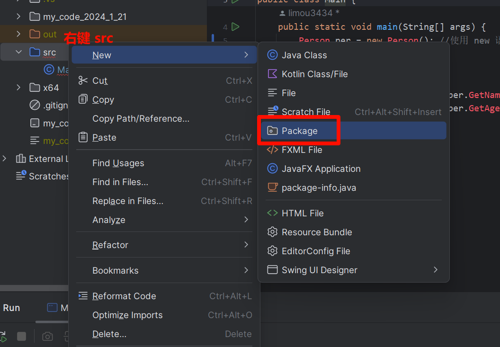
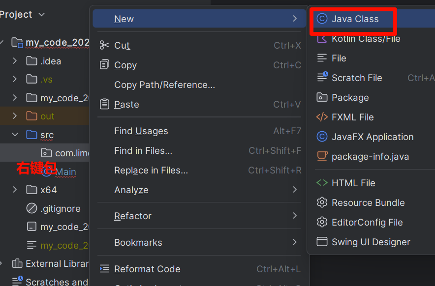
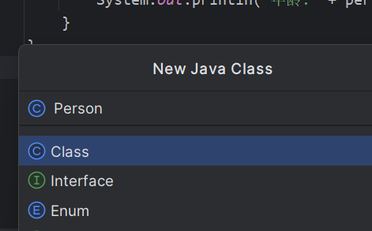
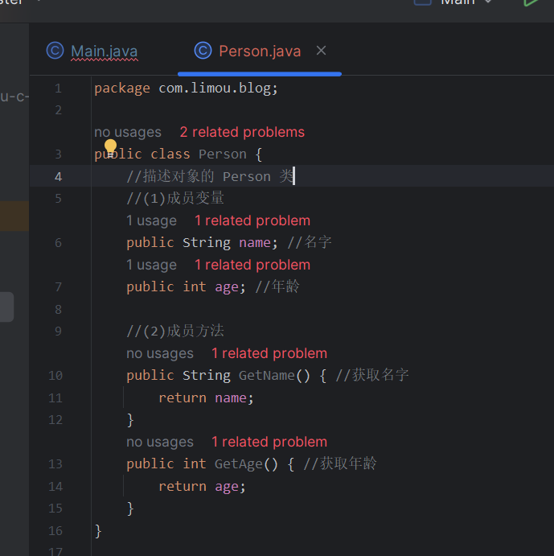

# 1.面向过程和面向对象

面向过程编程（`Procedural Programming`）和面向对象编程（`Object-Oriented Programming，OOP`）是两种不同的编程范式，`Java` 几乎把面向对象的思想贯彻到了极致，因此学习 `Java` 编程的过程中，对于 `Cpp` 面向对象的理解也会更加深刻。

>   吐槽：`Cpp` 本身是面向过程、面向对象、面向泛型的庞大语言。

# 2.访问限定符

`Java` 主要通过类的访问权限来实现访问权限的控制（这点和 `Cpp` 一样），将数据和封装数据的方法结合在一起，更符合人类对事物的认知。

而访问权限用来控制方法或字段能否直接在类外使用，并且 `Java` 还可以把访问限定符作用在整个类上（这点 `Cpp` 是没有的），这点我们后面补充...先姑且认定当前和 `Cpp` 的用法是一样的：限制成员变量和成员方法的访问。

| 范围       | private(私有) | default(默认的权限) | protected(继承内多用) | public(公有) |
| ---------- | ------------- | ------------------- | --------------------- | ------------ |
| 同包的同类 | yes           | yes                 | yes                   | yes          |
| 同包的异类 |               | yes                 | yes                   | yes          |
| 异包内子类 |               |                     | yes                   | yes          |
| 异包非子类 |               |                     |                       | yes          |

先看下面的知识叭，补充完对 `Java` 类的一些理解就可以看懂上面访问限定符的使用了。

# 3.类和对象基础

## 3.1.类的定义

类描述一系列的对象，而一个类的声明如下：

```java
// 定义类的语法形式
[类修饰符] class 类名 {
    // 一些属性/成员变量...
    // 一些方法/成员方法...
}
```

`Java` 的类和 `C` 语言的结构体很类似，和 `Cpp` 的 `class` 几乎一致，和 `Cpp` 一样可以类中加入方法（方法可以简单理解为函数），方法需要依赖对象才能被调用。

关于类，我们需要注意下面几点：

1.   一般一个 `Java` 文件内部只会存在一个类（也就是一一对应，但是我们在学习过程中可以放在一个文件中）

2.   `main()` 方法所在的类一般要使用 `public` 修饰（默认会在 `public` 修饰的类中寻找 `main()` 方法）

3.   如果一个类有 `public` 修饰，那么请不要直接手动修改这个类的类名（我们可以通过开发工具修改，这样才会让所有使用该类名的代码都进行同步修改，这也是 `IDEA` 强大功能的一处体现）

     

>   区别：`Java` 的类和 `Cpp` 的类最大区别在于默认自带的类成员不太一样，并且 `Cpp` 无法把访问限定符直接作用在类上，如果希望一个类不被外部访问创建，可以考虑使用友元类、限制构造函数、限制成员变量等做法来简介实现。因此从编写难度上来看 `Java` 更加直观且简洁。

## 3.2.类的对象

通过类描述这张“图纸”，可以通过 `new` 来实例化出多个对象。

虽然一个 `Java` 文件内部只会存在一个类，但我们可以尝试写到一起试试：

```cpp
//main.java
//类描述和对象创建

//描述对象的 Person 类
class Person {
    //成员变量
    public String name; //名字
    public int age; //年龄

    //成员方法
    public String GetName() { //获取名字
        return name;
    }
    public int GetAge() { //获取年龄
        return age;
    }
}

//主类的主函数
public class Main {
    public static void main(String[] args) {
        Person per = new Person(); //使用 new 语法创建（实例化对象）
        per.name = "limou3434";
        per.age = 18;

        System.out.println("姓名:" + per.GetName());
        System.out.println("年龄:" + per.GetAge());
    }
}

/* 输出结果
姓名:limou3434
年龄:18
*/
```

再换成一个类一个文件的方式写，在同一个 `Java` 项目中有如下两份文件：

```java
//Person.java
//Person 类
class Person {
    //成员变量
    public String name; //名字
    public int age; //年龄

    //成员方法
    public String GetName() { //获取名字
        return name;
    }
    public int GetAge() { //获取年龄
        return age;
    }
}
```

```java
//Main.java
//Main 类
//主类内使用 Person 对象
public class Main {
    public static void main(String[] args) {
        Person per = new Person(); //使用 new 语法创建
        per.name = "limou3434";
        per.age = 18;

        System.out.println("姓名:" + per.GetName());
        System.out.println("年龄:" + per.GetAge());
    }
}
```

上述的内部成员如果我们自己没有初始化，`Java` 也是会自己初始化的（内置类型为零值，引用类型为 `null`，`boolean` 为 `false`，`char` 为 `\u0000`）。

>   补充：对象内部是不存储方法的，只有在使用方法时才会在栈上开辟空间，而成员变量都存储在堆空间上。

## 3.3.this 引用

### 3.3.1.this.成员变量

`this` 引用来源于 `C++` 的 `this` 指针，两者有所区别，但是很是类似，首先我们来看一个奇怪的现象：

```java
//没问题的代码
class Data {
    public int _year;
    public int _month;
    public int _day;

    public void SetData(int year, int month, int day) {
        _year = year;
        _month = month;
        _day = day;
    }

    public void Print() {
        System.out.println(_year + " " + _month + " " + _day);
    }
}

public class Main {
    public static void main(String[] args) {
        Data day1 = new Data();
        day1.SetData(2024, 1, 21);
        day1.Print();

        Data day2 = new Data();
        day2.SetData(2023, 2, 23);
        day2.Print();
    }
}

/* 输出结果
2024 1 21
2023 2 23
*/
```

而下面代码中的 `SetData()` 如果是在 `C++` 中有可以运行，但在 `Java` 会出现问题，`Java` 会认为是局部变量自己给自己赋值（根本不会影响成员变量的取值），因此打印的还是 `Java` 给变量的默认初始值。

```java
//有问题的代码
class Data {
    public int year;
    public int month;
    public int day;

    public void SetData(int year, int month, int day) {
        year = year;
        month = month;
        day = day;
    }

    public void Print() {
        System.out.println(year + " " + month + " " + day);
    }
}

public class Main {
    public static void main(String[] args) {
        Data day1 = new Data();
        day1.SetData(2024, 1, 21);
        day1.Print();

        Data day2 = new Data();
        day2.SetData(2023, 2, 23);
        day2.Print();

        //Java 怎么知道使用 SetData() 后初始化的是 day1 的内部成员而不是 day2 的内部成员呢？
        //答案是使用了 this 引用
    }
}

/* 输出结果
0 0 0
0 0 0
*/
```

但是如果我们使用 `this` 引用就可以指明赋值关系就不会出现问题。

```java
//使用 this 引用
class Data {
    public int year;
    public int month;
    public int day;

    public void SetData(int year, int month, int day) {
        this.year = year;
        this.month = month;
        this.day = day;
    }

    public void Print() {
        System.out.println(year + " " + month + " " + day);
    }
}

public class Main {
    public static void main(String[] args) {
        Data day1 = new Data();
        day1.SetData(2024, 1, 21);
        day1.Print();

        Data day2 = new Data();
        day2.SetData(2023, 2, 23);
        day2.Print();
    }
}

/* 输出结果
2024 1 21
2023 2 23
*/
```

而这个 `this` 引用实际上就是调用方法的哪个对象，方法被哪个对象调用了，`this` 就引用的哪个对象。

第一个代码中，`Java` 会自动识别类内成员，给其加上 `this.`，而第二个代码中，由于形参的影响，`Java` 无法识别哪一个是成员变量，干脆都理解为局部变量，交给用户使用 `this` 去指定（但是 `C++` 可以识别出这种特殊情况，但仍旧不推荐这么书写）。

另外，这也能解释为什么使用 `SetData()` 和 `Print()` 可以明确对哪一个具体的对象做操作，每一个方法的第一个参数实际上就是 `this`，这是 `Java` 自动传递的，我们无需给函数传递，只需要在函数内使用即可。

此外我们需要注意，`this` 引用只能在方法定义内被使用，且只能引用当前对象，不能再引用其他对象。

>   注意：我们一般建议将 `this` 明确写上，不过度依赖 `Java` 的默认行为，避免造成误解。

### 3.3.2.this.成员方法

除了调用对象内的成员变量，还可以调用对象对应类内对应的成员方法（当然也可以不加 `this.`）。

```java
//使用 this.成员方法 来调用方法
class Data {
    public int _year;
    public int _month;
    public int _day;

    public void SetData(int year, int month, int day) {
        _year = year;
        _month = month;
        _day = day;
        this.Print(); //设定好值后就打印
    }

    public void Print() {
        System.out.println(_year + " " + _month + " " + _day);
    }
}

public class Main {
    public static void main(String[] args) {
        Data day1 = new Data();
        day1.SetData(2024, 1, 21);

        Data day2 = new Data();
        day2.SetData(2023, 2, 23);
    }
}

/* 输出结果
2024 1 21
2023 2 23
*/
```

### 3.3.3.this() 构造

这个方法是结合构造方法来使用的（可以手动在类内方法内调用本类对象的构造函数），我将在后面构造方法中进行使用。

## 3.4.构造方法

我们在定义类的变量时，可以发现，即便我们没有定义类内部成员变量的初始值，`Java` 会帮助我们自动初始化，但是如果不是在类中，而是直接写在 `Main()` 中的局部变量没有进行初始化，代码可能连编译都无法通过。

```java
//编译通过的代码
class Data {
    public int _year;
    public int _month;
    public int _day;

    public void SetData(int year, int month, int day) {
        _year = year;
        _month = month;
        _day = day;
        this.Print(); //设定好值后就打印
    }

    public void Print() {
        System.out.println(_year + " " + _month + " " + _day);
    }
}

public class Main {
    public static void main(String[] args) {
        Data d = new Data();
        d.Print();
    }
}

/* 输出结果
0 0 0
*/
```

```java
//编译失败的代码
public class Main {
    public static void main(String[] args) {
        //Data d = new Data();
        //d.Print();

        int year;
        int month;
        int day;
        System.out.println(year + " " + month + " " + day); //报错
    }
}

/* 输出结果
java: 可能尚未初始化变量year
*/
```

那究竟是谁帮助我们对类内的成员变量进行了初始化呢？`Java`？是的，但是不够深层，准确来说，是类内默认的成员方法：**构造方法**，该方法没有返回值，方法名和类名一样。

默认的构造方法会给成员变量赋予初始值，而当我们撰写任何自定义的构造方法时，`Java` 就不会调用编译器提供的构造方法，而是尝试直接调用我们自己自定义的构造方法（此时一旦失败就会报错，需要把有可能出现的构造方法都写出来）。并且，构造方法只在实例化对象的时候才会被自动调用。

```java
//自定义构造方法
class Data {
    public int _year;
    public int _month;
    public int _day;

    Data() {
        System.out.println("不带参数的构造方法");
    }
    Data(int year, int month, int day) {
        System.out.println("带参数的构造方法");
        this._year = year;
        this._month = month;
        this._day = day;
    }

    public void SetData(int year, int month, int day) {
        _year = year;
        _month = month;
        _day = day;
        this.Print(); //设定好值后就打印
    }

    public void Print() {
        System.out.println(_year + " " + _month + " " + _day);
    }
}

public class Main {
    public static void main(String[] args) {
        Data d1 = new Data();
        d1.Print();

        Data d2 = new Data(2021, 1, 2);
        d2.Print();
        d2.SetData(2024, 10, 9);
    }
}

/* 输出结果
不带参数的构造方法
0 0 0
带参数的构造方法
2021 1 2
2024 10 9
*/
```

除此以外，还以一种初始化方法叫做 **就地初始化**，直接在类内成员变量进行初始化，这种方式适用于一些具有默认值的成员变量，但是不具备一般性。用户一旦调用构造方法，就会被携带一个初始值，但这并不一定是符合用户意愿的（就地初始化的值会被添加到构造方法中）：

```java
//自定义构造方法
class Data {
    public int _year = 1000; //就地初始化
    public int _month = 1; //就地初始化
    public int _day = 1; //就地初始化

    Data() {
        System.out.println("不带参数的构造方法");
    }
    Data(int year, int month, int day) {
        System.out.println("带参数的构造方法");
        this._year = year;
        this._month = month;
        this._day = day;
    }

    public void SetData(int year, int month, int day) {
        _year = year;
        _month = month;
        _day = day;
        this.Print(); //设定好值后就打印
    }

    public void Print() {
        System.out.println(_year + " " + _month + " " + _day);
    }
}

public class Main {
    public static void main(String[] args) {
        Data d1 = new Data();
        d1.Print(); //由于我们把无参的构造方法自定义了，就不会调用之前 Java 定义的版本，因此就没有给成员变量进行初始化，导致无法打印

        Data d2 = new Data(2021, 1, 2);
        d2.Print();
        d2.SetData(2024, 10, 9);
    }
}

/* 输出结果
不带参数的构造方法
1000 1 1
带参数的构造方法
2021 1 2
2024 10 9
*/
```

而前面提及的 `this()`，这可以做到在一个构造方法内调用类内其他重载的构造函数（必须是在构造函数方法内的第一条语句内调用，并且不能多次调用）。

```java
//使用 this()
class Data {
    public int _year = 0; //就地初始化
    public int _month = 0; //就地初始化
    public int _day = 0; //就地初始化

    Data() {
        this(2000, 1, 1);
        System.out.println("不带参数的构造方法");
    }
    Data(int year, int month, int day) {
        System.out.println("带参数的构造方法");
        this._year = year;
        this._month = month;
        this._day = day;
    }

    public void SetData(int year, int month, int day) {
        _year = year;
        _month = month;
        _day = day;
        this.Print(); //设定好值后就打印
    }

    public void Print() {
        System.out.println(_year + " " + _month + " " + _day);
    }
}

public class Main {
    public static void main(String[] args) {
        Data d = new Data();
        d.Print();
    }
}

/* 输出结果
带参数的构造方法
不带参数的构造方法
2000 1 1
*/
```

构造方法一般使用 `public`，只有在某些情况（单例模式）才会使用 `provate` 来修饰（下面会将这两个关键字的作用）。

>   补充：另外，构造函数实际上做的工作还有很多
>
>   1.   初始化分配的对象（也就是我们上面学的）
>   2.   为对象分配内存空间
>   3.   处理并发安全问题
>   4.   检测对象对应的类是否加载（若无则加载）
>
>   后续学习中将会逐步补充。

# 3.面向对象特性

面向对象的三个常见特性就是：封装、继承、多态，我们先来理解最容易理解的封装。

## 3.1.封装

### 3.1.1.类的本身

`Java` 本身使用类组织属性和方法时，本就是在做一个封装的过程。

### 3.1.2.包的使用

#### 3.1.2.1.包的概念

在面向对象体系中，有一个软件包的概念，为了更好的管理类，把多个类收集在一起成为一组，就称为 **软件包**。因此 `Java` 也引入了包的概念，包实质上是一种高级封装的体现。

>   补充在一个工程中允许存在同名类，只要处于不同的包内即可。

#### 3.1.2.2.包的导入

`Java` 存在很多的包，可以直接在代码中引入，也可以使用 `import` 语句来导入包。

```java
// 代码中使用包
public class Main {
    public static void main(String[] args) {
        java.util.Date date = new java.util.Date(); // 代码中导入包内类的方法
        System.out.println(date.getTime()); // 返回一个时间戳
    }
}
```

```java
// 使用 import 导入包
import java.util.Date;
public class Main {
    public static void main(String[] args) {
        Date date = new Date(); // 代码中导入包内类的方法
        System.out.println(date.getTime()); // 返回一个时间戳
    }
}
```

这里 `java.util.Date` 的 `java.util` 就是包， `Date` 就是包内的类，对应一个 `Java` 文件。

>   补充：如果使用 `*` 代替 `Date` 就可以看到 `java.util` 中的所有类，不过一般只推荐显示写一个类，否则有可能出现命名冲突的问题。
>
>   ```java
>   //不同包内同名称类冲突的问题
>   import java.util.*;
>   import java.sql.*;
>   public class Main {
>       public static void main(String[] args) {
>           // util 和 sql 中都存在一个 Date 这样的类，此时就会出现歧义，Java 不知道该使用哪一个类，编译出错
>           // Date date = new Date();
>           // System.out.println(date.getTime());
>       }
>   }
>   ```

另外，还可以使用 `import static` 导入包中静态的成员变量和成员方法。

```java
// 使用静态导入
import static java.lang.Math.*;
public class Main {
    public static void main(String[] args) {
        double x = 3;
        double y = 4;

        double ret = sqrt(pow(x, 2) + pow(y, 2)); //计算 √(30^2 + 50^2)
        System.out.println(ret);
    }
}

/* 输出结果
5.0
*/
```

>   注意：`import` 和 `C/C++` 的 `#include` 不是同一种东西，`C/C++` 使用 `#include` 会在编译期间将整个头文件复制下来，再使用链接器链接。而 `Java` 的 `import` 仅仅是为了编写代码时更加方便，因此更类似 `C/C++` 的 `namespace` 和 `using` 的使用。

#### 3.1.2.3.包的制作

```java
// 描述对象的 Person 类
public class Person {
    // 描述对象的 Person 类
    // (1)成员变量
    public String name; // 名字
    public int age; // 年龄

    // (2)成员方法
    public String GetName() { //获取名字
        return name;
    }
    public int GetAge() { //获取年龄
        return age;
    }
}
```

对于上面类，如何成为一个供人使用的包呢？或者说，我们怎么自定义一个包呢？按照下面步骤来操作：

1.   要在类的最上方加上 `package 包名` 语句，一般使用公司域名的颠倒形式（`com.limou.blog`），包名尽量是唯一的

2.   在 `IDEA` 中右键 `src` 文件夹，在 `new` 中选择 `Package`，在弹出的对话框中输入包名

     

     

     

3.   右击包，选择 `New` 中的 `Java Class` 输入类名

     

     

4.   在新出现的 `java` 文件中粘贴代码即可

     

5.   在 `main()` 中调用即可

     ```java
     // 在主类的 main() 中正常调用
     import com.limou.blog.Person;
     // 主类的主函数
     public class Main {
         public static void main(String[] args) {
             Person per = new Person(); // 使用 new 语法创建（实例化对象）
             per.name = "limou3434";
             per.age = 18;
     
             System.out.println("姓名:" + per.GetName());
             System.out.println("年龄:" + per.GetAge());
         }
     }
     ```

>   补充：如果同一个域名不同包呢？
>
>   1.  如果 `example.com` 域名下有两个项目分别是 `project1` 和 `project2`，那么它们的包结构可能如下所示：
>
>       ```
>       复制代码com.example.project1
>       com.example.project2
>       ```
>
>   2.  如果 `project1` 项目包含了多个模块，如 `module1`、`module2`，那么它们的包结构可能如下所示：
>
>       ```
>       复制代码com.example.project1.module1
>       com.example.project1.module2
>       ```
>
>   通过这种方式，可以在同一个域名下为不同的项目和模块创建独立的命名空间，避免命名冲突，并且能够更清晰地组织和管理代码。

## 3.2.继承

>   吐槽：实际上继承的目的更多是为了后续的多态，而不是为了复用代码。

## 3.3.多态

### 3.3.1.重载

重载也是一种特殊的多态，也是一种调用对应多种实现，和 `C++` 的函数重载类似，但是 `Java` 更准确来说是方法重载，因为一般不会把一个函数暴漏在类外，一次构成方法重载的首要条件就是在一个类中，其次才是方法名相同、参数类型或个数不同。并且，也依旧不考虑返回值的类型。

### 3.3.2.重写


# 4.访问权限的探索

有了以上基础后，您就可以开始详细探索访问权限的使用，这里旨在用最简洁的代码来辅助您理解，而拒绝使用冗杂的概念和图表表示。

```java

```

# 5.static 关键字

同一个类类型实例化出不同的对象，内部属性有可能是不一样的，但是可能存在某个属性是所有对象的公有属性（例如：不同学生对象都是学生类创建出来的，但是都同属于一个学校）。

而我们一般不会让每个对象都存储这个公有属性，一是出现数据冗余，二是不易修改（如果要对学生的学校名称进行重命名，则每一个学生的学校名称属性都需要被修改）。

因此就诞生了 `static` 修饰的成员变量，也被称为“静态成员变量”，该成员不属于任何一个具体的对象，是被所有对象共享的，也是类的属性。

既可以通过类名来访问，也可以使用对象来访问，但是一般推荐使用类名。

```java
class Student {
    public String name;
    public String gender;
    public int age;
    public double score;
    public static String school = "limou school";

    public void Init(String name, String gender, int age, double score) {
        this.name = name;
        this.gender = gender;
        this.age = age;
        this.score = score;
    }
}

public class Main {
    public static void main(String[] args) {
        // 静态成员变量可以直接通过类名访问
        System.out.println(Student.school);
        Student s1 = new Student();
        Student s2 = new Student();
        Student s3 = new Student();
        s1.Init("Li leilei", "男", 18, 3.8);
        s2.Init("Han MeiMei", "女", 19, 4.0);
        s3.Init("Jim", "男", 18, 2.6);
        // 也可以通过对象访问：但是 school 是三个对象共享的
        System.out.println(s1.school);
        s1.school = "dimou school";
        System.out.println(s2.school);
        System.out.println(s3.school);

    }
}
```

实际上，除了静态成员变量，还有静态成员方法，也是在函数的前面加上 `static` 关键字，同理，该方法也是类的方法，不是某个对象持有的。

不过，就算不是静态成员方法，也同样不是某个对象所持有的，那为什么需要静态成员方法呢？原因有下：

-   静态对象可以通过静态方法来访问
-   可以省略创建对象的过程，直接使用类名来使用静态函数，使得代码更加整洁
-   适用于一些不需要依赖具体对象的方法，使用起来更加符合语义，更适合作为全局函数

```java
// 尝试使用静态方法
class Student {
    public String name;
    public String gender;
    public int age;
    public double score;
    public static String school = "limou school"; //就地初始化静态变量

    public void Init(String name, String gender, int age, double score) {
        this.name = name;
        this.gender = gender;
        this.age = age;
        this.score = score;
    }

    public static void ShowSchool() {
        System.out.println(Student.school);
    }
}

public class Main {
    public static void main(String[] args) {
        // 静态成员变量可以直接通过类名访问
        System.out.println(Student.school);
        Student s1 = new Student();
        Student s2 = new Student();
        Student s3 = new Student();
        s1.Init("Li leilei", "男", 18, 3.8);
        s2.Init("Han MeiMei", "女", 19, 4.0);
        s3.Init("Jim", "男", 18, 2.6);
        // 也可以通过对象访问：但是 school 是三个对象共享的
        Student.ShowSchool();
    }
}
```

另外，静态方法内不能访问任何非静态成员变量（早在创建非静态成员之前，静态方法就可以被使用，因此静态方法内使用非静态成员是有问题的）。并且也无法在静态方法内调用非静态方法，因为静态方法的函数参数中隐含一个 `this` 引用，指向某一个具体的对象。

在 `Java` 中，类内方法内不能直接定义静态变量。静态变量（或称为类变量）是属于类本身的，而不是属于类的实例，因此不能定义在方法内。因此，静态变量通常在类的顶层定义，而不是在方法内。

在方法内部，只能定义局部变量，这些变量仅在方法被调用时存在，并且在方法执行结束后会被销毁。

>   补充：静态方法无法被重写，不能用来实现多态，这个以后再来补充...

# 6.代码块

使用 `{}` 定义的一段代码被称为代码块，根据代码块定义的位置和关键字，可以简单分为：

-   **静态代码块**：是定义在类中的静态块，用于执行类加载前（准确来说是在 `JVM` 加载类前）的初始化操作，静态代码块在构造一个对象前只执行一次（包含多个静态代码块时，就会按照顺序来执行）。
-   **实例代码块**：在类中直接使用代码块就是一个实例代码块，只在实例化的时候才会被调用（多次实例化就被多次调用），比构造函数先调用（另外，也有叫构造代码块的）。
-   **同步代码块**：多线程的内容，这块内容以后讲到多线程时再进行补充...

```java
//代码块演示 1
class MyClass {
    public int data;

    public static String str;

    {
        System.out.println("普通代码块2");
    }

    static {
        System.out.println("静态代码块2");
    }

    MyClass(int data) {
        this.data = data;
        System.out.println("构造方法");
    }

    {
        System.out.println("普通代码块1");
    }

    static {
        System.out.println("静态代码块1");
    }
}

public class Main {
    public static void main(String[] args) {
        MyClass mc = new MyClass(100);
        System.out.println("=======");
        MyClass.str = "limou";
    }
}
/* 执行结果
静态代码块2
静态代码块1
普通代码块2
普通代码块1
构造方法
=======
*/
```

```java
//代码块演示 2
class MyClass {
    public int data;

    public static String str;

    {
        System.out.println("普通代码块2");
    }

    static {
        System.out.println("静态代码块2");
    }

    MyClass(int data) {
        this.data = data;
        System.out.println("构造方法");
    }

    {
        System.out.println("普通代码块1");
    }

    static {
        System.out.println("静态代码块1");
    }
}

public class Main {
    public static void main(String[] args) {
        // MyClass mc = new MyClass(100);
        System.out.println("=======");
        MyClass.str = "limou";
    }
}
/* 执行结果
=======
静态代码块2
静态代码块1
*/
```

这里就会发现，会优先执行静态代码块（类加载之前就被执行了，并且只加载了一次），然后再执行实例代码块，再调用类构造方法。

# 7.内部类

当一个类内部需要一个完整的类结构来描述成员时，就需要一个内部类结构（尤其是内部类只为外部类服务而不对外服务时）。

## 7.1.实例内部类

```java
// 尝试构造内部类对象
class MyClass {
    // 实例内部类/非静态内部类
    public int data_1;
    public static int data_2;
    class Sub {
        int data_3;
        // static int data_4; // 1.error
        // 因为内部类的就是外部类的一个成员
        // 这点和 C++ 不一样，C++ 的内外类
        // 几乎只有友元的关系，其他的地方几
        // 乎都是并行的。因此就需要内部类和
        // 成员方法一样，无法在内部定义一个
        // 静态成员，因为静态成员是属于外部
        // 类的，必须由外部类自己来进行定义
    }
}

public class Main {
    public static void main(String[] args) {
        // 2.尝试直接获取实力内部类的实例
        // Sub s = new Sub(); // error

        // 3.尝试通过外部类实例来获取内部类的实例
        MyClass mc = new MyClass();
        MyClass.Sub s1 = mc.new Sub(); // 4.这个语法对 C++ 程序员来说还挺怪的

        MyClass.Sub s2 = new MyClass().new Sub(); // 5.上述语法的整合

        // 6.为什么是用这么奇怪的方式来定义的呢？
        // 实际上我们可以把内部类当作一个成员整体
        // 来理解，我们需要用到内部类，就必须实例
        // 一个外部类对象 mc，通过 mc 来调用内部
        // 类的构造方法，而这两步骤可以整合在一起
    }
}
```

```java
// 定义内部类静态对象
class MyClass {
    // 实例内部类/非静态内部类
    public int data_1;
    public static int data_2;
    class Sub {
        int data_3;
        static final int data_4 = 10; // 1.true
        // 因为加了 final 和 C/C++ 的 const 有些类似
        // 已经固定了一个值，就不会再被改变，这个值在编
        // 译的时候就固定好了（注意这个不是 C 中的常变量）
        // 以后再来细细深入，您现在只需要知道有这个语法就行
    }
}

public class Main {
    public static void main(String[] args) {
        // 2.尝试直接获取实力内部类的实例
        // Sub s = new Sub(); // error

        // 3.尝试通过外部类实例来获取内部类的实例
        MyClass mc = new MyClass();
        MyClass.Sub s1 = mc.new Sub(); // 4.这个语法对 C++ 程序员来说还挺怪的

        MyClass.Sub s2 = new MyClass().new Sub(); // 5.上述语法的整合
    }
}
```

至于我们为何需要内部类，实际上这还涉及到封装和组合的问题，在后面我会带您体会。

>   补充：内部类虽然不能直接定义一个静态变量，但是可以通过 `final` 来规避（不过类内方法就算用了这个也不能避免）。

内部类和外部类的成员如果名字一样，就会导致就近原则。

```java
class MyClass {
    // 实例内部类/非静态内部类
    public int data = 1;
    class Sub {
        public int data = 2;

        public void Func() {
            System.out.println(this.data); // 获取内部对象，这个 this 是内部类自己的
            System.out.println(MyClass.this.data); // 获取外部对象，这个 this 引用外部类的
        }
    }
}

public class Main {
    public static void main(String[] args) {

        MyClass mc = new MyClass();
        mc.new Sub().Func();
    }
}
```

需要注意的是：

-   外部类中的任何成员都可以在实例内部类中直接访问（哪怕增加了访问限制符）
-   实例内部类成员的位置和外部类成员的位置相同，因此本身也会受到 `public`、`private` 等访问符的限制
-   在实例内部类的成员方法中，如果访问了和外部类成员变量同名的变量时，会优先访问自己的，如果要访问外部类同名的成员变量，就需要使用 `外部类名.this.同名成员` 来访问
-   内部类内的非静态成员方法包含了 ige 指向外部类的 `this` 引用
-   实例化内部类对象必须在有外部类对象存在的情况下才可以被创建出来
-   外部类中不能直接使用内部类的成员（哪怕是 `public` 成员），必须先创建出内部类的对象再进行调用

## 7.2.静态内部类

```java
// 静态
class Outer {
    // 实例内部类/非静态内部类
    public int data_1 = 1;
    public int data_2 = 2;
    public static int data_3 = 3;

    public void Test_1() {
        System.out.println("Outer::test_1()");
    }

    static class Inner {
        public int data_3 = 4;
        public int data_4 = 5;
        public static int data_5 = 6;

        public void Test_2() {
            System.out.println("Inner::test_2()");
            // 静态内部类无法访问外部类成员，因为其本身不需要使用外部类来创建实例对象
            // System.out.println(data_1);
            // System.out.println(data_2);

            // 但是依旧是有方法的，可以创建一个外部类成员
            Outer o = new Outer();
            System.out.println(o.data_1);

            System.out.println(data_3);
            System.out.println(data_4);
            System.out.println(data_5);
        }
    }
}

public class Main {
    public static void main(String[] args) {
        Outer.Inner in = new Outer.Inner(); // 无需实例化外部类对象就可以使用
        in.Test_2();
    }
}
```

