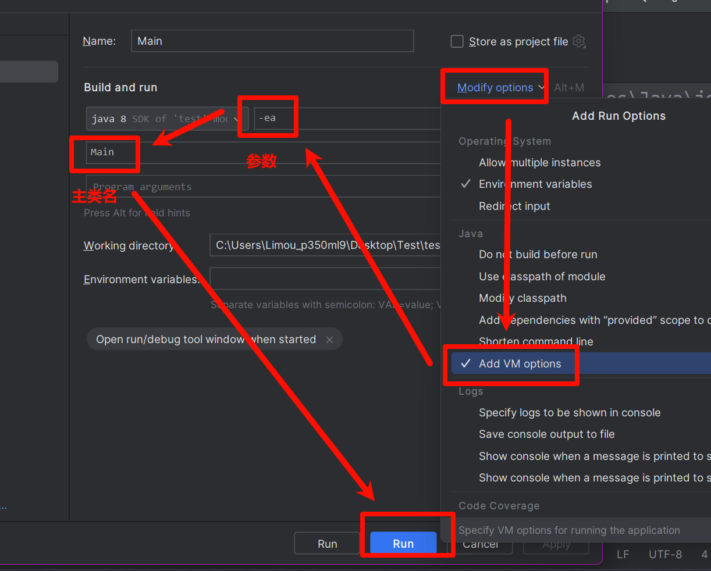

**叠甲：以下文章主要是依靠我的实际编码学习中总结出来的经验之谈，求逻辑自洽，不能百分百保证正确，有错误、未定义、不合适的内容请尽情指出！**

[TOC]

>   概要：...

>   资料：...

---

# 1.断言

`IDEA` 中默认 `assert` 是关闭，开启方式为：设置 `jvm` 的参数，参数为 `-enableassertions` 或 `-ea` 即可。




```java
// 使用断言
public class Main {
    public static void main(String[] args) {
        int a = 1, b = 2;
        assert (a > b);
    }
}
/* 输出结果
Exception in thread "main" java.lang.AssertionError
	at Main.main(Main.java: 5)
*/
```

>   吐槽：老实说，断言这种机制比较少用，一般 `Java` 排错都是使用异常和日志。

# 2.异常


# 3.日志


---

>   结语：...
