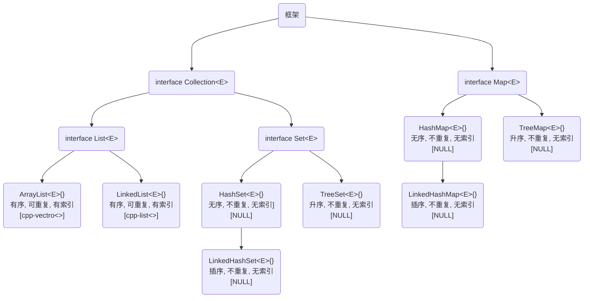

**叠甲：以下文章主要是依靠我的实际编码学习中总结出来的经验之谈，求逻辑自洽，不能百分百保证正确，有错误、未定义、不合适的内容请尽情指出！**

[TOC]

>   概要：...

>   资料：...

---

>   吐槽：一些个人吐槽，可以看也可以不看...

>   警告：一些容易错误、遗漏的点...

>   区别：一些容易混淆、混乱的点...

>   补充：一些补充性知识，最好是看一下...

# 1.泛型编程

## 1.1.泛型的类

我们先来提及 `Java` 中的泛型类 `ArrayList`，它可以存储任意类型的对象列表（类似数组）。通常在使用 `ArrayList` 时，需要指定它要存储的对象类型。

```java
// 创建泛型类对象
import java.util.ArrayList;

public class Main {
    public static void main(String[] args) {
        ArrayList<String> stringList = new ArrayList<>();
        ArrayList<Integer> intList = new ArrayList<>();
        // var floatList = new ArrayList<Float>(); // 关于 var 只有高版本才支持, 这种情况下就需要后面的菱形语法进行提示
    }
}
```

>   补充：如果没有指定具体的类型，那么 `ArrayList` 将使用原始类型（这是 `Java` 早期的一种写法），因此元素类型就是 `Object`，通常我不推荐您这么做，因为它会导致编译器警告，并且可能引入类型不安全的问题，您无法确定从列表中取出的对象的具体类型。
>
>   ```java
>   // 使用无类型的列表
>   import java.util.ArrayList;
>   import java.util.Objects;
>   
>   public class Main {
>       public static void main(String[] args) {
>           ArrayList list = new ArrayList();
>           list.add("String");
>           list.add(1);
>   
>           Object e1 = list.get(0);
>           // String ee1 = list.get(0); // 除非使用强制类型转换
>   
>           Object e2 = list.get(1);
>           // int ee2 = list.get(1); // 除非执行强制类型转换
>   
>           System.out.println(e1);
>           System.out.println(e2);
>       }
>   }
>   ```

那么我们怎么定义一个自己的泛型类呢？请看下面代码。

```java
// 自定义泛型的类
class Box<T> {
    private T content;

    public void setContent(T content) {
        this.content = content;
    }

    public T getContent() {
        return content;
    }

    @Override
    public String toString() {
        return "Box{" + "content=" + content + "}";
    }
}

public class Main {
    public static void main(String[] args) {
        Box<String> stringBox = new Box<>();
        stringBox.setContent("Hello, Generics");
        System.out.println(stringBox.getContent());
        System.out.println(stringBox); // 等价于 stringBox.toString()

        Box<Integer> intBox = new Box<>();
        intBox.setContent(123);
        System.out.println(intBox.getContent());
        System.out.println(intBox); // 等价于 intBox.toString()
    }
}
```

>   补充：在 `Java` 中，泛型不支持使用基本数据类型（如 `int`, `char`, `double` 等）作为类型参数，只支持对象类型，因此需要对基本数据类型使用封装类。

还可以在泛型设计中加入对继承的限定，这样做可以确保泛型类型参数满足特定的条件。

```java
// 定义一个泛型类 Box，限定泛型类型参数必须是 Number 或其子类
class Box<T extends Number> {
    private T content;

    public Box(T content) {
        this.content = content;
    }

    public T getContent() {
        return content;
    }

    public void setContent(T content) {
        this.content = content;
    }

    public double getDoubleContent() {
        return content.doubleValue();
    }

    public static void main(String[] args) {
        // 创建一个装载整数的盒子
        Box<Integer> integerBox = new Box<>(10);
        System.out.println("Integer content: " + integerBox.getContent());
        System.out.println("Double value: " + integerBox.getDoubleContent());

        // 创建一个装载浮点数的盒子（编译时错误，因为 Double 不是 Number 的子类）
        // Box<Double> doubleBox = new Box<>(10.5); // 这行代码会导致编译错误

        // 使用通配符可以创建装载浮点数的盒子
        Box<Double> doubleBox = new Box<>(10.5);
        System.out.println("Double content: " + doubleBox.getContent());
        System.out.println("Double value: " + doubleBox.getDoubleContent());
    }
}
```

上面这种就是对泛型的限定，如果没有做一定的限制，那么泛型的错误将会千奇百怪。

>   吐槽：从表面上来看 `Java` 的模板就比 `Cpp` 少了一个 `template` 关键字而已，但是两者对于泛型的理解确实还挺不一样的，尤其是在类型变量的限定上。不过其实后来的 `Cpp` 也推出了这个机制，虽然繁琐但是限定的范围还大一下，大大小小都可以限制。
>
>   ```cpp
>   // Cpp 尝试进行泛型限定
>   #include <type_traits>
>   #include <iostream>
>   
>   template<typename T>
>   typename std::enable_if<std::is_integral<T>::value, T>::type // 做到类型必须是某个类的子类也是可以的...不过需要用其他的工具
>   add(T a, T b) {
>       return a + b;
>   }
>   
>   int main() {
>       std::cout << add(1, 2) << std::endl; // 编译正常
>       // std::cout << add(1.5, 2.5) << std::endl; // 编译错误
>       return 0;
>   }
>   ```

>   补充：需要注意的是，泛型的类型推导是在编译阶段中完成的，一旦编译为 `.class` 泛型就不存在了，也就是 **类型擦除**。理论上来说，可以把使用泛型的代码运行在早期不支持泛型的版本上（不过我没有实验过）。

## 1.2.泛型方法

泛型通常还可以定义多个泛类型，这里我们结合泛型方法来编写一下代码，值得注意的是。

```java
// 自定义泛型方法
class Box {
    public <T, V> String func(T data1, V data2) {
        return data1 + ", " + data2;
    }
}

public class Main {
    public static void main(String[] args) {
        System.out.println(new Box().<Integer, Double>func(1, 3.14));
        System.out.println(new Box().func(1, 3.14)); // 不过基本现在的 Java 可以根据参数自动进行推断
    }
}
```

>   补充：这里对比一下 `Cpp` 的泛型方法，可以看到两者都支持自动推断。
>
>   ```cpp
>   // 自定义泛型方法(Cpp)
>   #include <iostream>
>   #include <string>
>   
>   class Box {
>   public:
>       template <typename T, typename D>
>       std::string func(T data1, D data2) {
>           return std::to_string(data1) + ", " + std::to_string(data2);
>       }
>   };
>   
>   int main() {
>       std::cout << Box().func<int, double>(1, 3.14) << std::endl;
>       std::cout << Box().func(1, 3.14) << std::endl; // Cpp 也可以自动推断
>       return 0;
>   }
>   ```

>   吐槽：`Java` 在调用泛型方法的时候，之所以把 `<>` 语法放在了调用函数之前，是为了避免一些编译字符解析的问题。

## 1.3.泛型接口

```java
// 自定义泛型的接口
// 定义一个泛型接口
interface Pair<K, V> {
    K getKey();
    V getValue();
}

// 实现泛型接口的具体类
class OrderedPair<K, V> implements Pair<K, V> { // 也可以先实例化接口的类型再实现, 这样实现类就不用带上类型变量了
    private K key;
    private V value;

    public OrderedPair(K key, V value) {
        this.key = key;
        this.value = value;
    }

    @Override
    public K getKey() {
        return key;
    }

    @Override
    public V getValue() {
        return value;
    }

    @Override
    public String toString() {
        return "OrderedPair{" +
                "key=" + key +
                ", value=" + value +
                '}';
    }

    public static void main(String[] args) {
        OrderedPair<String, Integer> pair = new OrderedPair<>("One", 1);
        System.out.println(pair);
    }
}
```

# 2.框架思路

## 2.1.框架的共性概述

### 2.1.1.集合接口

`Java` 的接口和集合框架的实现做了分离，在制定如何实现某个集合之前，先对集合的必备的接口进行说明。

```java
// 集合接口
interface DataStruct<T> {
	// ...
}
```

### 2.1.2.基本接口

除了需要有集合框架必须实现的接口，还有一个基本接口 `Collection` 需要实现，保证所有集合框架在某些方法是具有共性的。

```java
// 基本接口
public interface Collection<E> {
    boolean add(E e); // 添加元素
    boolean remove(Object o); // 移除元素
    int size(); // 获取集合中元素的个数
    boolean contains(Object o); // 判断集合是否包含某个元素
    boolean isEmpty(); // 判断集合是否为空
    void clear(); // 清空集合
    Iterator<E> iterator(); // 获取迭代器
}
```

...这一部分有些奇怪，待补充...

# 3.集合框架



## 3.1.ArrayList

```java
// 尝试使用 ArrayList
import java.util.ArrayList;
import java.util.Arrays;
import java.util.Collections;

public class Main {
    public static void main(String[] args) {
        // 创建对象
        ArrayList<String> list = new ArrayList<>(Arrays.asList("Apple", "Banana", "Cherry")); // 等价于三次 add()
        System.out.println("初始列表 总共 " + list.size() + " 个元素" + list);

        // 添加元素
        // list.add("Apple");
        // list.add("Banana");
        // list.add("Cherry");
        list.add(1, "grape"); // 指定位置添加元素
        System.out.println("添加元素 " + list);

        // 更新元素
        list.set(2, "Blackberry");
        System.out.println("更新元素 " + list);

        // 删除元素
        list.remove("Apple");
        list.remove(2);  // 删除索引 2 的元素
        System.out.println("删除元素 " + list);

        // 取得元素
        System.out.println("取得元素 " + list.get(1) + " " + list.indexOf("Blackberry")); // 输出索引为 1 的元素

        // 检查元素
        System.out.println("检查元素 " + list.contains("Apple"));  // 检查列表是否包含指定元素

        // 排序元素
        Collections.sort(list);
        System.out.println("排序元素 " + list);

        // 遍历元素
        System.out.print("遍历元素 ");
        for (String item : list) {
            System.out.print(item + ", "); // 遍历列表并输出每个元素
        }

        // 清空元素
        list.clear();
        System.out.println("\n清空元素 剩余 " + list.size() + " 个元素 " + list);
    }
}

```

>   补充：如果是任何实现了 `List` 接口的集合类就使用 `Collections.sort(list)`, 如果是原生数组最好使用 `Arrays.sort()`。

## 3.2.LinkedList

```java
// 尝试使用 LinkedList
import java.util.Arrays;
import java.util.LinkedList;

public class Main {
    public static void main(String[] args) {
        // 创建对象
        LinkedList<String> list = new LinkedList<>();
        list.add("Apple");
        list.add("Banana");
        list.add("Cherry");
        System.out.println("初始列表 总共 " + list.size() + " 个元素 " + list);

        // 添加元素
        list.add(1, "grape"); // 在指定位置添加元素
        System.out.println("添加元素 " + list);

        // 更新元素
        list.set(2, "Blackberry");
        System.out.println("更新元素 " + list);

        // 删除元素
        list.remove("Apple");
        list.remove(2); // 删除索引 2 的元素
        System.out.println("删除元素 " + list);

        // 取得元素
        System.out.println("取得元素 " + list.get(1) + " " + list.indexOf("Blackberry"));

        // 检查元素
        System.out.println("检查元素 " + list.contains("Apple"));

        // 排序元素(注意：LinkedList 不支持快速排序，只能通过转换为数组来排序)
        String[] array = list.toArray(new String[list.size()]);
        Arrays.sort(array);
        System.out.println("排序元素 " + Arrays.toString(array));

        // 遍历元素
        System.out.print("遍历元素 ");
        for (String item : list) {
            System.out.print(item + ", ");
        }

        // 清空元素
        list.clear();
        System.out.println("\n清空元素 剩余 " + list.size() + " 个元素 " + list);
    }
}
```

>   补充：`...List<E>` 之间可以相互转化，并且都可以变成原生的数组。
>
>   ```java
>   // List 之间的转换、转化为原生数组
>   import java.util.ArrayList;
>   import java.util.Arrays;
>   import java.util.LinkedList;
>   
>   public class Main {
>       public static void main(String[] args) {
>           // 创建一个 ArrayList 并添加元素
>           ArrayList<String> arrayList = new ArrayList<>(Arrays.asList("Apple", "Banana", "Cherry"));
>   
>           // 创建一个 LinkedLis 并添加元素
>           LinkedList<String> linkedList = new LinkedList<>(Arrays.asList("Grape", "Orange", "Pineapple"));
>   
>           // ArrayList 转换为 LinkedList
>           LinkedList<String> linkedListFromArrayList = new LinkedList<>(arrayList);
>           System.out.println("LinkedList from ArrayList: " + linkedListFromArrayList);
>   
>           // LinkedList 转换为 ArrayList
>           ArrayList<String> arrayListFromLinkedList = new ArrayList<>(linkedList);
>           System.out.println("ArrayList from LinkedList: " + arrayListFromLinkedList);
>   
>           // 将 ArrayList 转换为原生数组
>           String[] arrayFromArrayList = arrayList.toArray(new String[arrayList.size()]);
>           System.out.println("Array from ArrayList: " + Arrays.toString(arrayFromArrayList));
>   
>           // 将 LinkedList 转换为原生数组
>           String[] arrayFromLinkedList = linkedList.toArray(new String[linkedList.size()]);
>           System.out.println("Array from LinkedList: " + Arrays.toString(arrayFromLinkedList));
>   
>           /**
>            * 对于上面的 toArray() 转换方法
>            * (1)如果不传入参数, 它会返回一个 Object[] 类型的数组, 其中包含了列表中的所有元素
>            * (2)如果传入一个类型为 T[] 的数组 a, 该方法会将列表中的元素复制到指定的数组 a 中并返回这个数组
>            */
>       }
>   }
>   ```

## 3.3.HashSet

```java
// 尝试使用 HashSet
import java.util.Arrays;
import java.util.HashSet;

public class Main {
    public static void main(String[] args) {
        // 创建对象
        HashSet<String> set = new HashSet<>(Arrays.asList("Apple", "Banana", "Cherry"));
        System.out.println("初始集合 总共 " + set.size() + " 个元素 " + set);

        // 添加元素
        set.add("grape"); // HashSet 不支持在指定位置添加元素
        System.out.println("添加元素 " + set);

        // 更新元素(HashSet 不支持直接更新元素, 需要先删除再添加)
        set.remove("Cherry");
        set.add("Blackberry");
        System.out.println("更新元素 " + set);

        // 删除元素
        set.remove("Apple");
        System.out.println("删除元素 " + set);

        // 取得元素(HashSet 没有 get 方法, 可以使用迭代器遍历或者转换为数组来获取元素)
        // 这里展示将 HashSet 转换为数组并获取元素的方法
        String[] array = set.toArray(new String[set.size()]);
        System.out.println("取得元素 " + array[1] + " " + Arrays.asList(array).indexOf("Blackberry"));

        // 检查元素
        System.out.println("检查元素 " + set.contains("Apple"));

        // 遍历元素
        System.out.print("遍历元素 ");
        for (String item : set) {
            System.out.print(item + ", ");
        }

        // 清空元素
        set.clear();
        System.out.println("\n清空元素 剩余 " + set.size() + " 个元素 " + set);
    }
}
```

## 3.4.LinkedHashSet

```java
// 尝试使用 LinkedHashSet
import java.util.Arrays;
import java.util.LinkedHashSet;

public class Main {
    public static void main(String[] args) {
        // 创建对象
        LinkedHashSet<String> set = new LinkedHashSet<>(Arrays.asList("Apple", "Banana", "Cherry"));
        System.out.println("初始集合 总共 " + set.size() + " 个元素 " + set);

        // 添加元素
        set.add("grape"); // LinkedHashSet 保持插入顺序
        System.out.println("添加元素 " + set);

        // 更新元素(LinkedHashSet 不支持直接更新元素, 需要先删除再添加)
        set.remove("Cherry");
        set.add("Blackberry");
        System.out.println("更新元素 " + set);

        // 删除元素
        set.remove("Apple");
        System.out.println("删除元素 " + set);

        // 取得元素(LinkedHashSet 可以直接使用 get 方法获取元素)
        // 这里展示将 LinkedHashSet 转换为数组并获取元素的方法
        String[] array = set.toArray(new String[set.size()]);
        System.out.println("取得元素 " + array[1] + " " + Arrays.asList(array).indexOf("Blackberry"));

        // 检查元素
        System.out.println("检查元素 " + set.contains("Apple"));

        // 遍历元素
        System.out.print("遍历元素 ");
        for (String item : set) {
            System.out.print(item + ", ");
        }

        // 清空元素
        set.clear();
        System.out.println("\n清空元素 剩余 " + set.size() + " 个元素 " + set);
    }
}
```

## 3.5.TreeSet

```java
// 尝试使用 TreeSet
import java.util.Arrays;
import java.util.TreeSet;

public class Main {
    public static void main(String[] args) {
        // 创建对象
        TreeSet<String> set = new TreeSet<>(Arrays.asList("Apple", "Banana", "Cherry"));
        System.out.println("初始集合 总共 " + set.size() + " 个元素 " + set);

        // 添加元素(TreeSet 不支持在指定位置添加元素)
        set.add("grape");
        System.out.println("添加元素 " + set);

        // 更新元素(TreeSet 不支持直接更新元素，需要先删除再添加)
        set.remove("Cherry");
        set.add("Blackberry");
        System.out.println("更新元素 " + set);

        // 删除元素
        set.remove("Apple");
        System.out.println("删除元素 " + set);

        // 取得元素(TreeSet 没有 get 方法, 可以通过迭代器遍历或者转换为数组来获取元素)
        // 这里展示将 TreeSet 转换为数组并获取元素的方法
        String[] array = set.toArray(new String[set.size()]);
        System.out.println("取得元素 " + array[1] + " " + Arrays.asList(array).indexOf("Blackberry"));

        // 检查元素
        System.out.println("检查元素 " + set.contains("Apple"));

        // 遍历元素
        System.out.print("遍历元素 ");
        for (String item : set) {
            System.out.print(item + ", ");
        }

        // 清空元素
        set.clear();
        System.out.println("\n清空元素 剩余 " + set.size() + " 个元素 " + set);
    }
}
```

>   区别：三面三种 `set` 的区别其实很好区分，使用如下代码进行区分。
>
>   ```java
>   // 区分三种 set
>   import java.util.HashSet;
>   import java.util.LinkedHashSet;
>   import java.util.TreeSet;
>   
>   public class Main {
>       public static void main(String[] args) {
>           // HashSet 示例
>           HashSet<String> hashSet = new HashSet<>();
>           hashSet.add("Banana");
>           hashSet.add("Apple");
>           hashSet.add("Orange");
>           System.out.println("HashSet: " + hashSet); // 输出顺序不确定
>   
>           // LinkedHashSet 示例
>           LinkedHashSet<String> linkedHashSet = new LinkedHashSet<>();
>           linkedHashSet.add("Banana");
>           linkedHashSet.add("Apple");
>           linkedHashSet.add("Orange");
>           System.out.println("LinkedHashSet: " + linkedHashSet); // 输出顺序是插入顺序
>   
>           // TreeSet 示例
>           TreeSet<String> treeSet = new TreeSet<>();
>           treeSet.add("Banana");
>           treeSet.add("Apple");
>           treeSet.add("Orange");
>           System.out.println("TreeSet: " + treeSet); // 输出顺序是自然排序（字典顺序）
>       }
>   }
>   ```
>
>   -   `HashSet` 在大多数操作上性能最优，平均时间复杂度为 `O(1)`
>   -   `LinkedHashSet` 在保持插入顺序的同时，对于插入和删除操作略低于 `HashSet`
>   -   `TreeSet` 在保持有序的同时，对于插入和删除操作的时间复杂度较高，为 `O(log n)`

## 3.6.HashMap

```java
// 尝试使用 HashMap
import java.util.HashMap;
import java.util.Map;

public class Main {
    public static void main(String[] args) {
        // 创建对象
        HashMap<String, Integer> map = new HashMap<>();
        map.put("Alice", 25);
        map.put("Bob", 30);
        map.put("Charlie", 28);

        // 初始映射
        System.out.println("初始映射 总共 " + map.size() + " 个键值对 " + map);

        // 添加元素
        map.put("David", 35);
        System.out.println("添加元素 " + map);

        // 更新元素
        map.put("Alice", 26); // 更新 Alice 的年龄
        System.out.println("更新元素 " + map);

        // 删除元素
        map.remove("Bob");
        System.out.println("删除元素 " + map);

        // 获取元素
        System.out.println("获取元素 Alice 的年龄为 " + map.get("Alice"));

        // 检查元素
        System.out.println("检查元素 是否包含键为 'Bob'：" + map.containsKey("Bob"));

        // 遍历元素
        System.out.print("遍历元素 ");
        for (Map.Entry<String, Integer> entry : map.entrySet()) {
            System.out.print("(" + entry.getKey() + ": " + entry.getValue() + "), ");
        }

        // 清空元素
        map.clear();
        System.out.println("\n清空元素 剩余 " + map.size() + " 个键值对 " + map);
    }
}
```

## 3.7.LinkedHashMap

```java
// 尝试使用 LinkedHashMap
import java.util.LinkedHashMap;
import java.util.Map;

public class Main {
    public static void main(String[] args) {
        // 创建对象
        LinkedHashMap<String, Integer> map = new LinkedHashMap<>();
        map.put("Alice", 25);
        map.put("Bob", 30);
        map.put("Charlie", 28);

        // 打印初始映射
        System.out.println("初始映射 总共 " + map.size() + " 个键值对 " + map);

        // 添加元素
        map.put("David", 35);
        System.out.println("添加元素 " + map);

        // 更新元素
        map.put("Alice", 26); // 更新 Alice 的年龄
        System.out.println("更新元素 " + map);

        // 删除元素
        map.remove("Bob");
        System.out.println("删除元素 " + map);

        // 获取元素
        System.out.println("获取元素 Alice 的年龄为 " + map.get("Alice"));

        // 检查元素
        System.out.println("检查元素 是否包含键为 'Bob'：" + map.containsKey("Bob"));

        // 遍历元素
        System.out.print("遍历元素 ");
        for (Map.Entry<String, Integer> entry : map.entrySet()) {
            System.out.print("(" + entry.getKey() + ": " + entry.getValue() + "), ");
        }

        // 清空元素
        map.clear();
        System.out.println("\n清空元素 剩余 " + map.size() + " 个键值对 " + map);
    }
}
```

## 3.8.TreeMap

```java
// 尝试使用 TreeMap
import java.util.Map;
import java.util.TreeMap;

public class Main {
    public static void main(String[] args) {
        // 创建对象
        TreeMap<String, Integer> map = new TreeMap<>();
        map.put("Alice", 25);
        map.put("Bob", 30);
        map.put("Charlie", 28);

        // 打印初始映射
        System.out.println("初始映射 总共 " + map.size() + " 个键值对 " + map);

        // 添加元素
        map.put("David", 35);
        System.out.println("添加元素 " + map);

        // 更新元素
        map.put("Alice", 26); // 更新 Alice 的年龄
        System.out.println("更新元素 " + map);

        // 删除元素
        map.remove("Bob");
        System.out.println("删除元素 " + map);

        // 获取元素
        System.out.println("获取元素 Alice 的年龄为 " + map.get("Alice"));

        // 检查元素
        System.out.println("检查元素 是否包含键为 'Bob'：" + map.containsKey("Bob"));

        // 遍历元素
        System.out.print("遍历元素 ");
        for (Map.Entry<String, Integer> entry : map.entrySet()) {
            System.out.print("(" + entry.getKey() + ": " + entry.getValue() + "), ");
        }

        // 清空元素
        map.clear();
        System.out.println("\n清空元素 剩余 " + map.size() + " 个键值对 " + map);
    }
}
```

# 4.遗留框架

待补充...

---

>   结语：...