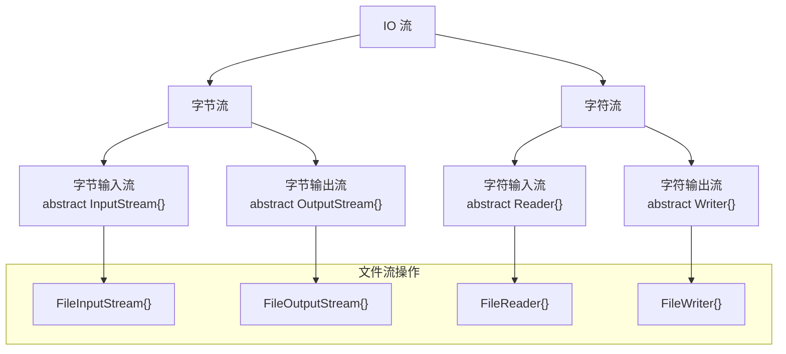
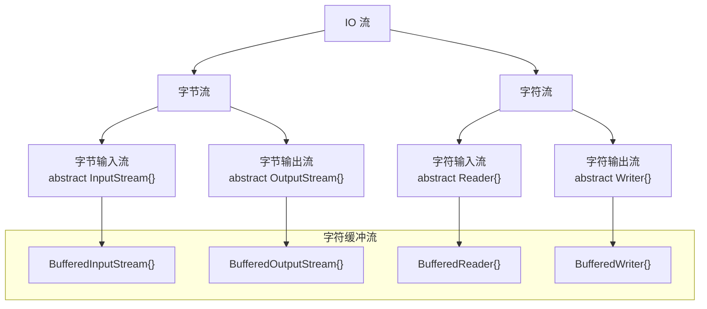
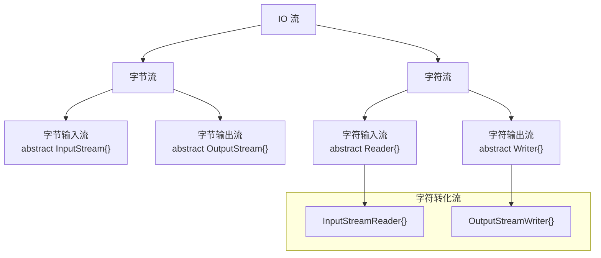
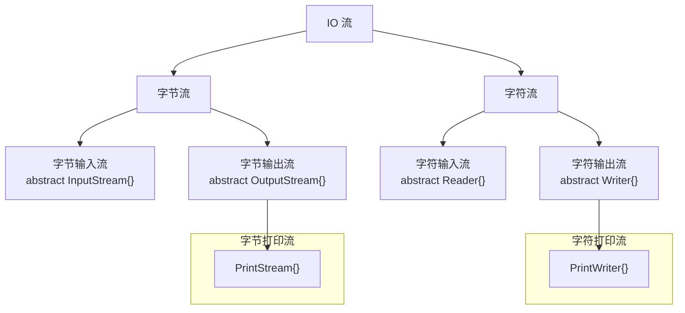
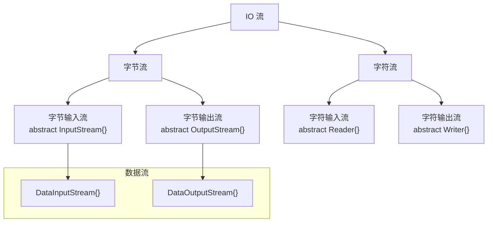
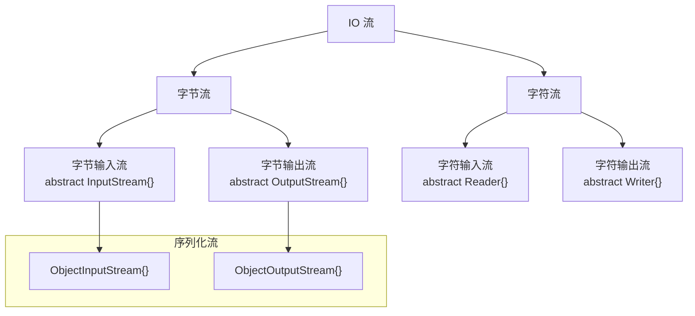

**叠甲：以下文章主要是依靠我的实际编码学习中总结出来的经验之谈，求逻辑自洽，不能百分百保证正确，有错误、未定义、不合适的内容请尽情指出！**

[TOC]

>   概要：...

>   资料：...

---

>   吐槽：一些个人吐槽，可以看也可以不看...

>   警告：一些容易错误、遗漏的点...

>   区别：一些容易混淆、混乱的点...

>   补充：一些补充性知识，最好是看一下...

# 1.集合操作

`Java` 的 `Stream API` 提供了多种方法来对数据进行处理（尤其是针对集合数据），采用链式调用和 `Lamda` 表达式进行处理。

```java
// 使用 Stream 流来进行集合数据处理
import java.util.Arrays;
import java.util.List;
import java.util.Optional;
import java.util.stream.Collectors;

public class Main {
    public static void main(String[] args) {
        // 列表
        List<Integer> numbers = Arrays.asList(1, 10, 3, 4, 5, 6, 7, 8, 9, 10, 10, 4, 8);
        System.out.println("列表 " + numbers);

        // 过滤
        List<Integer> evenNumbers = numbers.stream()
                .filter(n -> n % 2 == 0)
                .collect(Collectors.toList());
        System.out.println("过滤 " + evenNumbers);

        // 映射
        List<Integer> doubledNumbers = numbers.stream()
                .map(n -> n * 2)
                .collect(Collectors.toList());
        System.out.println("映射 " + doubledNumbers);

        // 平展映射
        List<String> words = Arrays.asList("hello", "world");
        List<String> letters = words.stream()
                .flatMap(word -> Arrays.stream(word.split(""))) // 通过 word.split("") 将单词元素拆分成单个字符数组, 并将这个字符数组转换为一个新子流, flatMap() 则将每一个子流结合在一起形成新的流返回
                .collect(Collectors.toList());
        System.out.println("平展映射 " + letters);

        // 去重
        List<Integer> distinctNumbers = numbers.stream()
                .distinct()
                .collect(Collectors.toList());
        System.out.println("去重 " + distinctNumbers);

        // 排序
        List<Integer> sortedNumbers = numbers.stream()
                .sorted()
                .collect(Collectors.toList());
        System.out.println("排序 " + sortedNumbers);

        // 限制
        List<Integer> limitedNumbers = numbers.stream()
                .limit(5) // 注意只是限制个数而不是限制大小
                .collect(Collectors.toList());
        System.out.println("限制 " + limitedNumbers);

        // 跳过
        List<Integer> skippedNumbers = numbers.stream()
                .skip(10) // 注意是跳过前 10 个元素
                .collect(Collectors.toList());
        System.out.println("跳过 " + skippedNumbers);

        // 观察
        List<Integer> peekedNumbers = numbers.stream()
                .peek(n -> System.out.println("Processing: " + n)) // 打印每一个元素进行观察
                .collect(Collectors.toList());
        System.out.println("观察 " + peekedNumbers);

        // 求和
        int sum = numbers.stream()
                .reduce(0, Integer::sum);
        System.out.println("求和 " + sum);

        // 收集
        List<Integer> collectedNumbers = numbers.stream()
                .collect(Collectors.toList());
        System.out.println("收集 " + collectedNumbers);

        // 匹配
        boolean hasEvenNumber = numbers.stream()
                .anyMatch(n -> n % 2 == 0); // 列表中有偶数就返回 true
        System.out.println("匹配 " + hasEvenNumber);

        boolean allEvenNumbers = numbers.stream()
                .allMatch(n -> n % 2 == 0); // 列表中全偶数就返回 true
        System.out.println("匹配 " + allEvenNumbers);

        boolean noEvenNumbers = numbers.stream()
                .noneMatch(n -> n % 2 == 0); // 列表中全都不满足偶数返回 true
        System.out.println("匹配 " + noEvenNumbers);

        // 查找
        Optional<Integer> firstNumber = numbers.stream()
                .findFirst();
        System.out.println("查找 " + firstNumber);

        // 计数
        long count = numbers.stream()
                .count();
        System.out.println("计数 " + count);

        // 遍历
        System.out.print("遍历 ");
        numbers.stream().forEach(n -> System.out.print(n + " "));
    }
}
```

# 2.文件操作

```java
// 使用 File 来进行文件操作
import java.io.File;
import java.io.FileWriter;
import java.io.FileReader;
import java.io.BufferedReader;
import java.io.IOException;

public class Main {
    public static void main(String[] args) {
        // 创建文件对象
        String fileName = "./MyFile.txt";
        File file = new File(fileName);

        try {
            // 判断路劲是否有效
            if (file.exists()) {
                System.out.println("路径有效");
            } else {
                System.out.println("路径无效");
            }

            // 检查文件是否存在, 如果不存在则创建新文件
            if (file.createNewFile()) { // 还可以使用  file.exists() 判断路劲是否有效
                System.out.println("文件创建成功: " + file.getName());
            } else {
                System.out.println("文件已存在");
            }

            // 向文件写入内容
            FileWriter writer = new FileWriter(file, true);
            writer.write("Hello, World!\nThis is a new line.");
            System.out.println("内容成功写入到文件。");
            writer.close();

            // 从文件读取内容并输出到控制台
            BufferedReader reader = new BufferedReader(new FileReader(file));
            String line;
            System.out.println("读取文件内容");
            while ((line = reader.readLine()) != null) {
                System.out.println(line);
            }
            reader.close();

            // 判断是文件还是目录
            if (file.isFile()) {
                System.out.println(fileName + " is a file.");
            } else if (file.isDirectory()) {
                System.out.println(fileName + " is a directory.");
            }

            // 取得文件的名字
            String name = file.getName();
            System.out.println("文件名: " + name);

            // 取得文件的大小
            long size = file.length();
            System.out.println("文件大小: " + size);

            // 取得文件的最后修改时间
            long time = file.lastModified();
            System.out.println("最后修改时间: " + time);

            // 获取绝对路径
            System.out.println("绝对路径: " + file.getAbsolutePath());
        } catch (IOException e) {
            System.out.println("发生了 IO 异常：" + e.getMessage());
            e.printStackTrace(); // 打印异常堆栈信息
        }
    }
}
```

有很多，用的时候再来学习...

# 3.IO 操作

## 3.1.文件流



## 3.2.字符缓冲流



## 3.3.字符转化流



## 3.4.打印流



高效打印，写啥打啥，重定向和高效。

## 3.5.数据流



把数据类型和数据本身一起操作。

## 3.6.序列化流



把 `Java` 对象也进行流操作，如果自己实现的类就需要实现标记接口 `Serializable` 然后...

>   补充：`Commons-io、Dom4j` 框架的使用。

>   补充：`Java` 中常见的文件。
>
>   -   普通文件
>   -   `.properties` 属性文件，解析类为 `Properties`
>   -   `.xml` 序列文件，解析工具 `DOM, SAX, JDOM, DOM4J`(https://juejin.cn/post/6967175965659103240)
>   -   `.dtd` 约束文件（无法约束类型）和 `.xsd` 约束文档（可以约束类型）
>
>   读取上述后两个文件提供了两个文件
>
>   ```java
>   // 尝试使用 Properties
>   import java.io.*;
>   import java.util.Properties;
>   
>   public class Main {
>       public static void main(String[] args) {
>           // 设置文件名
>           String fileName = "config.properties";
>   
>           // 设置属性
>           Properties properties = new Properties();
>           properties.setProperty("url", "jdbc:mysql://localhost:3306/mydb");
>           properties.setProperty("username", "root");
>           properties.setProperty("password", "password123");
>   
>           // 保存属性到文件
>           try (OutputStream outputStream = new FileOutputStream(fileName)) {
>               properties.store(outputStream, "Database Configuration"); // 第二个参数是注释字符串, 会放在文件开头
>               System.out.println("配置保存到文件: " + fileName);
>           } catch (IOException e) {
>               System.err.println("保存配置文件时出现异常: " + e.getMessage());
>               e.printStackTrace();
>           }
>   
>           // 加载属性文件并获取属性值
>           Properties loadedProperties = new Properties();
>           try (InputStream inputStream = new FileInputStream(fileName)) {
>               loadedProperties.load(inputStream);
>               System.out.println("从文件加载配置: " + fileName);
>   
>               // 获取属性值
>               String url = loadedProperties.getProperty("url");
>               String username = loadedProperties.getProperty("username");
>               String password = loadedProperties.getProperty("password");
>   
>               System.out.println("url: " + url);
>               System.out.println("username: " + username);
>               System.out.println("password: " + password);
>   
>           } catch (IOException e) {
>               System.err.println("加载配置文件时出现异常: " + e.getMessage());
>               e.printStackTrace();
>           }
>       }
>   }
>   ```

---

>   结语：...