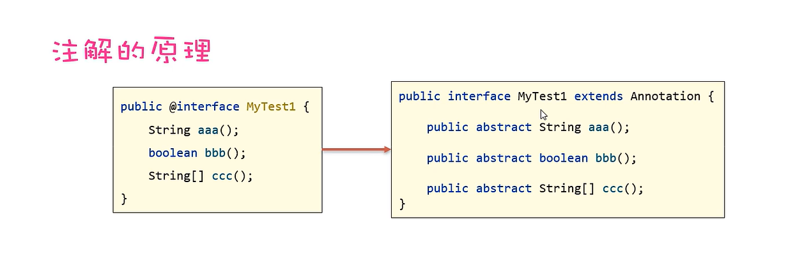
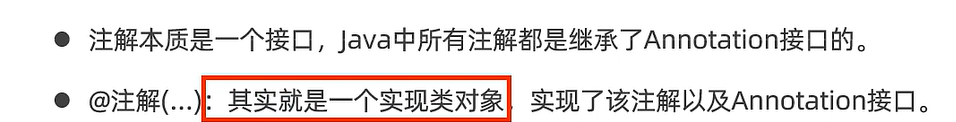
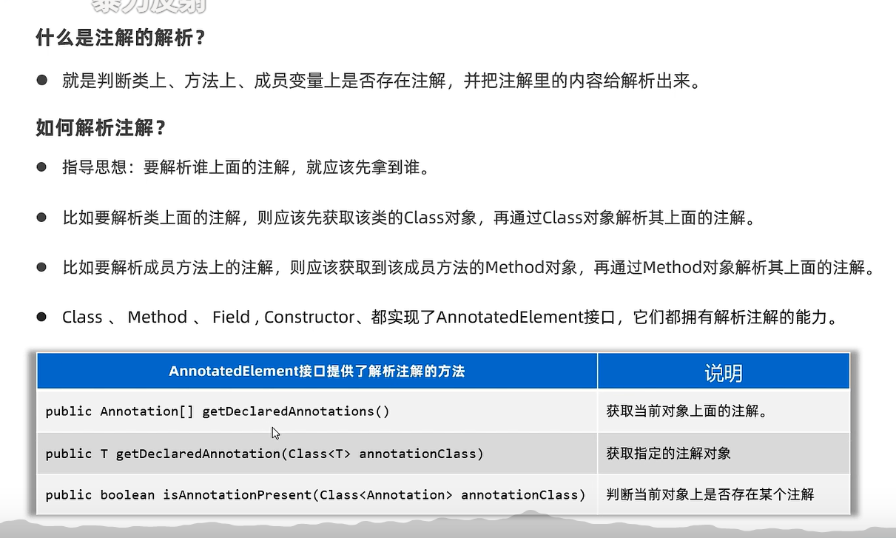

# 1.常见注解

使用 `@` 起头的特殊注解主要作用是为代码提供元数据，这些元数据可以被编译器和其他工具使用。以下是几个常见的 `@` 起头注解的作用：

1.  **@Override** 用于指示一个方法覆盖了父类中的方法。如果你打算覆盖父类的方法，使用 `@Override` 注解可以帮助编译器检查是否正确覆盖了方法。

    ```java
    // @Override
    @Override
    public void someMethod() {
        // 覆盖父类的方法
    }
    ```

2.  **@Test** `JUnit` 用于标记测试方法，`JUnit` 框架通过该注解识别测试方法，并执行其中的测试代码。

    ```java
    // @Test
    @Test
    public void testSomething() {
        // 测试代码
    }
    ```

3.  **@SuppressWarnings** 用于抑制编译器产生的警告信息，通常用于减少编译器检查时的干扰。

    ```java
    // @SuppressWarnings
    @SuppressWarnings({"unchecked", "rawtypes"})
    public void someMethod() {
        List list = new ArrayList();
        list.add("item");
    }
    // "all": 抑制所有类型的警告信
    // "unchecked": 抑制未检查的转型警告
    // "rawtypes": 抑制使用原始类型的警告
    // "resource": 抑制关闭资源时未调用 close() 方法的警告
    // "serial": 抑制实现 Serializable 类缺少 serialVersionUID 的警告
    // "null": 抑制与 null 引用相关的警告
    // "unused": 抑制未使用的代码和变量的警告
    // "deprecation": 抑制使用废弃 API 的警告
    // "fallthrough": 抑制 switch 语句中缺少 break 的警告
    // "unchecked": 抑制与泛型类型安全检查相关的警告
    ```

4.  **@Deprecated** 用于标记某个类、方法或字段已经过时，建议不再使用，但仍然可以使用。编译器会提示使用已过时的元素时发出警告。

    ```java
    // @Deprecated
    @Deprecated
    public void oldMethod() {
        // 过时的方法实现
    }
    ```

5.  **@FunctionalInterface** 用于标记一个接口是函数式接口，即只包含一个抽象方法的接口。这样的接口可以用于 Lambda 表达式和方法引用。

    ```java
    // @FunctionalInterface
    @FunctionalInterface
    public interface MyFunctionalInterface {
        void myMethod();
    }
    ```

# 2.自定注解







```java
// 自定义注解
import java.lang.annotation.ElementType;
import java.lang.annotation.Retention;
import java.lang.annotation.RetentionPolicy;
import java.lang.annotation.Target;
import java.lang.reflect.Method;
import java.util.Arrays;

// 自定义注解
@Target(ElementType.METHOD) // (元注解)指定自定义注解可以应用的地方(类/接口, 成员变量, 成员方法, 方法参数, 构造器, 局部变量)
@Retention(RetentionPolicy.RUNTIME) // (元注解)指定自定义注解的保留周期(保存在源码阶段但字节码阶段不存在, 保存在字节码阶段但运行阶段不存在, 一直保留到运行阶段)
@interface MyAnnotation {
    String value() default "default value"; // 声明一个属性 value, 且默认值为 "default value"
    int number(); // 声明一个整型属性 number
}

// 使用注解
class MyClass {
    @MyAnnotation(number = 10)
    public void myMethod() {
        // 方法实现
    }

    // 另一个方法，使用不同的属性值
    @MyAnnotation(value = "custom value", number = 20)
    public void anotherMethod() {
        // 方法实现
    }
}

// 扫描注解
public class Main {
    public static void main(String[] args) {
        // 获取类的所有方法
        Method[] methods = MyClass.class.getDeclaredMethods();
        System.out.println(Arrays.toString(methods)); // 打印方法数组

        // 遍历方法并查找带有 @MyAnnotation 注解的方法
        for (Method method : methods) {
            if (method.isAnnotationPresent(MyAnnotation.class)) {
                MyAnnotation annotation = method.getAnnotation(MyAnnotation.class); // 获取注解实例
                System.out.println("Method: " + method.getName());
                System.out.println("Value: " + annotation.value());
                System.out.println("Number: " + annotation.number());
            }
        }
    }
}
```

>   补充：元注解是注解的注解。