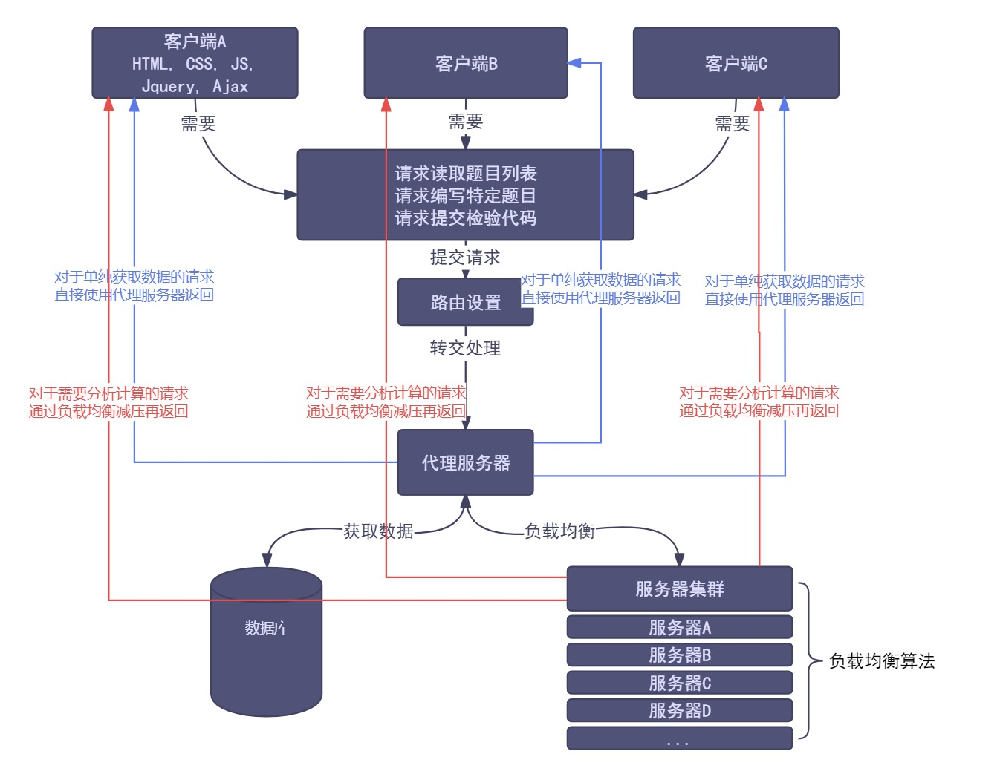

# 项目标题

## 1.最终目的

仿制一个简易的 `LeedCode` 在线 `OJ` 网站。

## 2.安装说明

-   `g++ (GCC) <= 4.8.5`，基本上使用系统自带的就行

-   `python2 <= 2.7.5, python3 <= 3.6.8`，基本上使用系统自带的就行

-   `jdk <= 8`，`Centos7` 可以按照以下指令进行安装

    ```shell
    # 安装 Java 开发工具
    yum update # 更新包管理器
    yum install -y java-1.8.0-openjdk-devel # 安装 Java 8 开发工具
    java -version # 验证 Java 安装是否成功
    ```

## 3.使用教程


## 4.技术选型

-   `STL` 标准库
-   `Boost` 准标准库
-   `httplib` 轻量网络库
-   `ctemplate` 网页渲染库
-   `jsoncpp` 序列化库
-   `MySQL` 数据库
-   `Linux` 环境（兼容 `Centos7` 与 `Ubuntu20`）
-   `HTML, CSS, JS, Jquery, Ajax` 前端工具
-   `VSCode` 开发环境
-   其他解释环境或编译环境 `python2/python3, jdk8, bash`

## 5.架构思路

项目的大致架构如下。



## 5.1.服务器设计

## 5.2.代理服务器设计

## 5.3.数据库设计

## 5.4.客户端设计

## 6.参与人员

