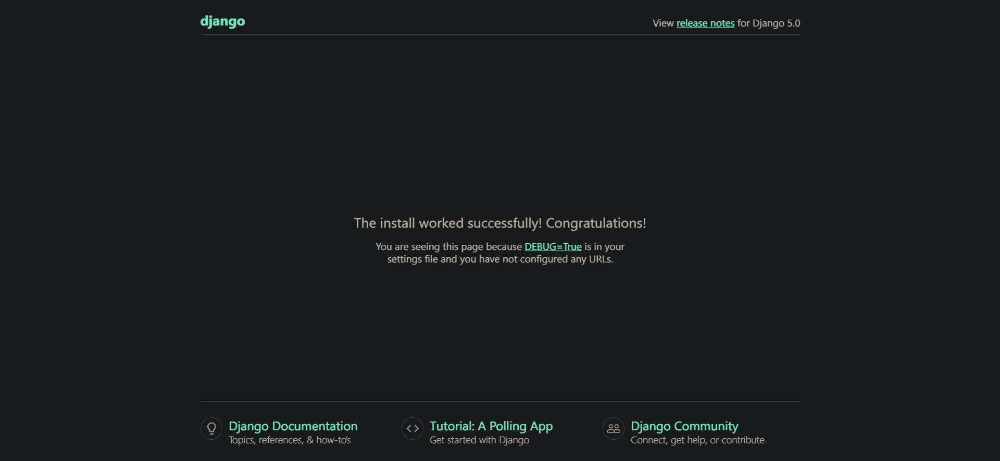
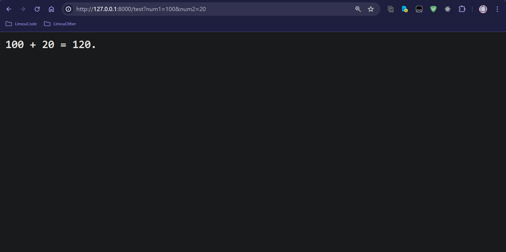
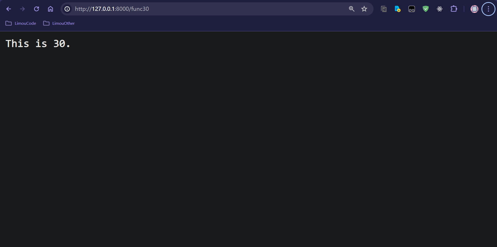
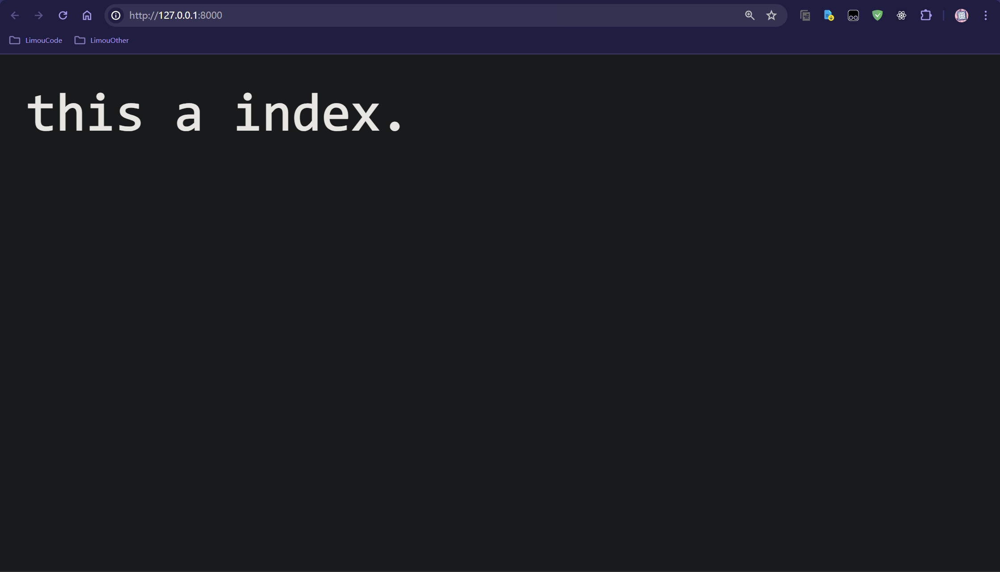

# 1.Django 构建项目

## 1.1.创建与运行项目

1.   创建项目使用 `django-admin startproject <项目名称>`
2.   运行项目使用 `python manage.py runserver`



出现以上界面就配置成功, 这里简单说一下项目的目录结构：

```shell
# 项目的目录结构
my_project:
│  db.sqlite3
│  manage.py # (1) 项目的交互文件
│
├─my_project # 主应用
│  │  __init__.py
│  │  asgi.py
│  │  settings.py # (2) 项目的设置选项
│  │  urls.py # (3) 配置 URL 路由
│  └─ wsgi.py 
│
├─project_1 # 次应用
│  │  __init__.py
│  │  admin.py
│  │  apps.py
│  │  models.py
│  │  tests.py
│  │  urls.py # 配置 URL 路由
│  └─ views.py # 视图函数
│
├─project_2 # 次应用
│  │  __init__.py
│  │  admin.py
│  │  apps.py
│  │  models.py
│  │  tests.py
│  │  urls.py # 配置 URL 路由
│  └─ views.py # 视图函数
│
...
```

## 1.2.创建与删除应用

`app` 是 `django` 项目的组成部分，一个 `app` 代表项目中的一个模块，所有 `URL` 请求的响应都是由 `app` 来处理。一个 `django` 项目由许多 `app` 组成，一个 `app` 也可以被用到其他项目，使用 `python manage.py startapp <app>` 即可创建一个对应的 `app`，但要删除 `Django` 项目中的应用程序（`app`），可以执行以下步骤：

1.  **删除应用程序文件夹**：在您的 `Django` 项目目录下，你会发现一个名为 `<app>` 的文件夹，其中包含了应用程序的代码文件，可以手动删除这个文件夹。
2.  **从 INSTALLED_APPS 中删除应用程序**：打开您 `Django` 项目中的 `settings.py` 文件，找到 `INSTALLED_APPS` 配置项，并从列表中删除 `<app>`（如果这里是添加就相对于安装一个 `app`），这样 `Django` 就不会加载这个应用程序了。
3.  **删除数据库迁移文件**：如果您已经执行了数据库迁移操作，那么在删除应用程序之前，你需要删除与该应用程序相关的数据库迁移文件。在您的应用程序目录下，会找到一个名为 `migrations` 的文件夹，里面包含了数据库迁移文件。您可以手动删除这个文件夹，或者执行 `python manage.py makemigrations --empty book` 命令来删除数据库迁移文件，然后运行迁移命令 `python manage.py migrate`。
4.  **删除应用程序在其他文件中的引用**：如果您在其他地方引用了该应用程序（例如视图、`URL` 配置等），则需要删除这些引用，否则 `Django` 可能会因为找不到应用程序而报错。

# 2.Django 添加视图

```python
path(route, view, name=None, kwargs=None)
```

-   `route`：`url` 的匹配规则，也可以使用 `<type:arg>` 指定向主 `url` 中传递的参数的数据类型
-   `view`：可以是视图函数、类视图、`.as_view()`、`django.urls.include()`
-   `name`：为 `url` 取名，可以使用名字来逆向找到 `url`，可以隔离实现和使用，是一种分层策略

主 `app` 应用有一个 `urls.py` 文件，专门用来添加视图函数，而视图函数的实现大多放在 `views.py` 中。

```python
# ./main_app/urls.py
"""
URL configuration for my_easy_blog_steam project.

The `urlpatterns` list routes URLs to views. For more information please see:
    https://docs.djangoproject.com/en/5.0/topics/http/urls/
Examples:
Function views
    1. Add an import:  from my_app import views
    2. Add a URL to urlpatterns:  path('', views.home, name='home')
Class-based views
    1. Add an import:  from other_app.views import Home
    2. Add a URL to urlpatterns:  path('', Home.as_view(), name='home')
Including another URLconf
    1. Import the include() function: from django.urls import include, path
    2. Add a URL to urlpatterns:  path('blog/', include('blog.urls'))
"""
from django.contrib import admin
from django.urls import path
from django.shortcuts import HttpResponse # shortcuts 内包含各种便捷函数

def index(request):
    return HttpResponse('Hello limou3434.')

urlpatterns = [
    path('admin/', admin.site.urls),
    path('hello/', index) # 这里直接写 <path/> 就行, 前面会自动加载主 URL
]
```

不过实际开发中视图函数都是在别处实现，或者说是在别的 `app` 的内的 `urls.py` 中添加，然后在内部的 `views.py` 实现，最后使用 `from django.urls import include` 在主应用中使用 `path('app_name/path', 视图函数, 路由名字)` 导入各个应用对应的视图函数。

## 2.1.多实现单导入路由

我们创建一个 `app: my_test`，然后尝试传递 `url` 参数...

```python
# ./my_test/views.py

from django.shortcuts import render
from django.shortcuts import HttpResponse # shortcuts 内包含各种便捷函数

# Create your views here.

def test(request):
    num1 = request.GET.get('num1') # 无则返回空
    num2 = request.GET.get('num2') # 无则返回空
    add = int(num1) + int(num2)
    return HttpResponse(f"{num1} + {num2} = {add}.")

def func(request, arg):
    return HttpResponse(f"This is {arg}.")
```

```python
# ./main_app/urls.py

"""
URL configuration for my_easy_blog_steam project.

The `urlpatterns` list routes URLs to views. For more information please see:
    https://docs.djangoproject.com/en/5.0/topics/http/urls/
Examples:
Function views
    1. Add an import:  from my_app import views
    2. Add a URL to urlpatterns:  path('', views.home, name='home')
Class-based views
    1. Add an import:  from other_app.views import Home
    2. Add a URL to urlpatterns:  path('', Home.as_view(), name='home')
Including another URLconf
    1. Import the include() function: from django.urls import include, path
    2. Add a URL to urlpatterns:  path('blog/', include('blog.urls'))
"""
from django.contrib import admin
from django.urls import path
from my_test import views # 从 my_test 应用程序中导入视图模块

urlpatterns = [
    path('admin/', admin.site.urls),
    path('test', views.test), # URL 主体携带 Get 表单查询字符串
    path('func/<arg>', views.func) # URL 主体携带 '/参数', 常见于不同文件的 id 指引,可以写成 func<int:arg> 限定类型
]

```





## 2.2.多实现多导入路由

首先创建三个应用，各自进行实现，各自导入路由。

实现登录路由...

```python
# ./login/urls.py

from django.contrib import admin

from django.urls import path
from .views import log_in, log_out

# 导入视图函数
urlpatterns = [
    path('admin/', admin.site.urls),
    path('login/', log_in, name='login'),
    path('logout/', log_out, name='logout'),
]

```

```python
# ./login/views.py

from django.shortcuts import HttpResponse
from django.shortcuts import reverse

# 实现视图函数
def log_in(request):
    return HttpResponse("登录")

def log_out(request):
    return HttpResponse("注销")

```

实现主页路由...

```python
# ./home/home.py

from django.urls import path
from .views import personal_details, post_blog, delete_blog

# 导入视图函数
urlpatterns = [
    path('per_det/', personal_details, name='per_det'),
    path('p_blog/', post_blog, name='p_blog'),
    path('d_blog/', delete_blog, name='d_blog'),
]

```

```python
# ./home/views.py

from django.shortcuts import HttpResponse
from django.shortcuts import reverse

# 实现视图函数
def personal_details(request):
    return HttpResponse("个人信息")

def post_blog(request):
    return HttpResponse("发布博文")

def delete_blog(request):
    return HttpResponse("删除博文")
```

实现论坛路由...

```python
# ./forum/urls.py

from django.urls import path
from .views import write_comment, read_comment

# 导入视图函数
urlpatterns = [
    path('w_com/', write_comment, name='w_com'),
    path('r_com/', read_comment, name='r_com'),
]

```

```python
# ./forum/views.py

from django.shortcuts import HttpResponse
from django.shortcuts import reverse

# 实现视图函数
def write_comment(request):
    return HttpResponse("发评论")

def read_comment(request):
    return HttpResponse("读评论")
```

然后在主应用中一次性 `include` 多个蓝图。

```python
# ./main_app/urls.py

from django.contrib import admin
from django.urls import path
from django.urls import include

home_name = 'home'

urlpatterns = [
    path('admin/', admin.site.urls),
    path('index/', include("index.urls")),
    path('home/', include("home.urls")),
    path('forum/', include("forum.urls")),
]
```

# 3.Django 路由反转

可以使用 `name` 来反转 `url`，转化的话，哪怕接口逻辑改变，也可以通过 `name` 反转得到 `url`。如果有应用命名空间或者有实例命名空间，那么应该在反转的时候加上命名空间（这种策略是为了避免命名冲突）。

```python
# ./my_test/home.py
# Create your views here.

from django.shortcuts import HttpResponse # shortcuts 内包含各种便捷函数
from django.shortcuts import reverse # 翻转 url


def index(request):
    return HttpResponse(f"this a index --> {reverse('_index')}")
```

```python
# ./main_app/urls.py

"""
URL configuration for my_easy_blog_steam project.

The `urlpatterns` list routes URLs to views. For more information please see:
    https://docs.djangoproject.com/en/5.0/topics/http/urls/
Examples:
Function views
    1. Add an import:  from my_app import views
    2. Add a URL to urlpatterns:  path('', views.home, name='home')
Class-based views
    1. Add an import:  from other_app.views import Home
    2. Add a URL to urlpatterns:  path('', Home.as_view(), name='home')
Including another URLconf
    1. Import the include() function: from django.urls import include, path
    2. Add a URL to urlpatterns:  path('blog/', include('blog.urls'))
"""
from django.contrib import admin
from django.urls import path
from home.views import index

urlpatterns = [
    path('admin/', admin.site.urls),
    path('index/', index, name='_index'),
]

```



如果翻转需要携带参数，可以使用 `reverse('namespace_name:route_name', kwargs={'field': value})` 中的 `kwargs` 来传递参数，不过由于翻转不区分 `post` 和 `get` 方法，因此只能使用字符拼接的方式来添加查询字符串的参数。这里需要注意，`namespace_name` 是前面的命名空间。

# 4.Django 模板引擎

`DTL` 模板是一种带有特殊语法的 `HTML` 文件，这个 `HTML` 文件可以被 `Django` 编译，可以传递参数进去，实现数据动态化。在编译完成后，生成一个普通的 `HTML` 文件，最后发送给客户端。

而如果需要使用模板，就免不了需要使用模板文件和静态文件，您可以需要在 `setting.py` 中修改一下文件路径...

```python
# setting.py
# ...
INSTALLED_APPS = [
    'django.contrib.admin',
    'django.contrib.auth',
    'django.contrib.contenttypes',
    'django.contrib.sessions',
    'django.contrib.messages',
    'django.contrib.staticfiles',
]
# ...
TEMPLATES = [
    {
        'BACKEND': 'django.template.backends.django.DjangoTemplates', # 模板引擎
        'DIRS': [
            BASE_DIR / 'templates' # 配置模板文件, 这里 BASE_DIR==Django 项目地址
        ],
        'APP_DIRS': True, # 设置为 True 后允许模板文件夹在 INSTALLED_APPS 中安装的 app 进行创建和被查找
        'OPTIONS': {
            'context_processors': [
                'django.template.context_processors.debug',
                'django.template.context_processors.request',
                'django.contrib.auth.context_processors.auth',
                'django.contrib.messages.context_processors.messages',
            ],
        },
    },
]

# 模板文件的查找顺序是 DIRS --> APP_DIRS, 如果都没有就抛出 TemplateDoesNotExist 异常
```

而模板渲染函数调用就是 `ender_to_string()` 到模板，然后将模板编译后渲染成 `Python` 的字符串格式，最后再通过 `HttpResponse` 类包装成一个 `HttpResponse('模板文件')` 对象返回，也可以使用 `render(request, '模板文件')` 来一步到位。

# 5.Django 模板语法

模板文件中可以包含变量和语法。

```html
<!-- DTL -->
<p>{{ username }}<p>
```

```python
# 渲染代码
def profile(request):
    return render(request, '模板文件', context={'username':'用户名'})
```

对于列表和集合类型，模板内的 `DTL` 语法只支持 `.` 来访问，而不能使用 `[]` 访问列表和集合，如果是列表嵌套集合，就可以使用嵌套的 `.`，并且也具有一定的逻辑语法。而对于对象类型，则会查询内部的属性或方法。

>   警告：如果使用字典时，注意不要 `key` 与方法或属性重叠，否则在渲染时就会发生冲突...

1.   `  ` 标签：可以使用 `==、!=、<、<=、>、>=、in、not in、is、is not` 等判断运算符，这里就必须加空格分割

     ```html
     <!-- test.html -->
     <body>
         
             <p>OK</p>
         
             <p>NO</p>
         
     </body>
     ```

     ```python
     # 实现视图函数
     def return_text(request, age):
         return render(request, 'index.html', context={'age': int(age)})
     ```

     ```python
     # 导入视图函数
     urlpatterns = [
         path('ret_txt/<age>', return_text, name='ret_txt'),
     ]
     ```

2.   ` ` 标签：类似于 `Python` 中的 `for...in...`。可以遍历列表、元组、字 符串、字典等一切可以遍历的对象。如果想要反向遍历，那么写为 `` 即可。遍历字典的时候，如果需要使用 `items、keys、values` 等方法则不能使用圆括号的形式。并且针对遍历，还做了一些其他语法支持

     -   `forloop.counter`：当前循环的下标，以 `1` 作为起始值
     -   `forloop.counter0`：当前循环的下标，以 `0` 作为起始值
     -   `forloop.revcounter`：当前循环的反向下标值，从遍历个数的最大值开始，以 `1` 最后
     -   `forloop.revcounter0`：类似于 `forloop.revcounter` 不同的是最后元素的下标是 `0`
     -   `forloop.first`：是否是第一次遍历
     -   `forloop.last`：是否是最后一次遍历
     -   `forloop.parentloop`：如果有多个循环嵌套，那么这个属性代表的是上一级的 `for` 循环

     ```html
     <!-- test.html -->
     <body>
         <table>
             <tbody>
                 
                     <tr>
                         <td>{{ book.name }}</td>
                         <td>{{ book.author }}</td>
                     </tr>
                 
             </tbody>
         </table>
     
         <table>
             <tbody>
                 
                     <tr>
                         <td>{{ key }} : {{ value }}</td>
                     </tr>
                 
             </tbody>
         </table>
     </body>
     ```

     ```python
     # 实现视图函数
     def return_text(request):
         books = [
             { 'name': '三国演义', 'author': '罗贯中' },
             { 'name': '水浒传', 'author': '施耐庵' }
         ]
         person = {
             'age': 18,
             'name': 'limou',
             'sex': '男'
         }
         
         return render(request, 'index.html', context={'books': books, 'person': person})
     ```

     ```python
     # 导入视图函数
     urlpatterns = [
         path('ret_txt', return_text, name='ret_txt'),
     ]
     ```

3.    `  ` 标签：在遍历的对象如果没有元素的情况下，会执行 `empty` 中的内容

4.    ` ` 标签：可以在模版中定义变量，有时候一个变量访问的时候比较复杂，那么可以先把这个复杂的变量缓存到一个变量上，以后就可以直接使用这个变量。严禁在等号两边带上空格，并且定义出来的变量只能在 `...` 标签闭合内被使用。另外，`=` 也可以被写作 `as`

5.    `` 标签：建议使用这种 `url` 反转的方式来实现，类似于 `django` 中的 `reverse()` 一样。如果 `url` 反转的时候需要传递参数，那么可以在后面传递（位置参数传递或关键参数传递，不过两者不能同时使用，并且都需要用空格分割不同的参数）。如果想要在使用 `url` 标签反转的时候要传递查询字符串的参数，那么必须要手动在后面添加（或者使用表单的形式）

6.    ` ` 标签：移除 `html` 标签中的空白字符，不过只会移除 `html` 标签之间的空白字符，而不会移除标签与文本之间的空白字符

7.    ` ` 标签：开启和关闭标签内元素的自动转义功能

8.    `` 标签：默认在 `DTL` 模板中是会去解析特殊字符的，比如 `` 以及 `{{` 和 `}}` 等。如果您在某个代码片段中不想使用 `DTL` 的解析引擎，那么可以把代码的片段放在该标签中 

9.    更多标签：https://docs.djangoproject.com/en/5.0/ref/templates/builtins/


