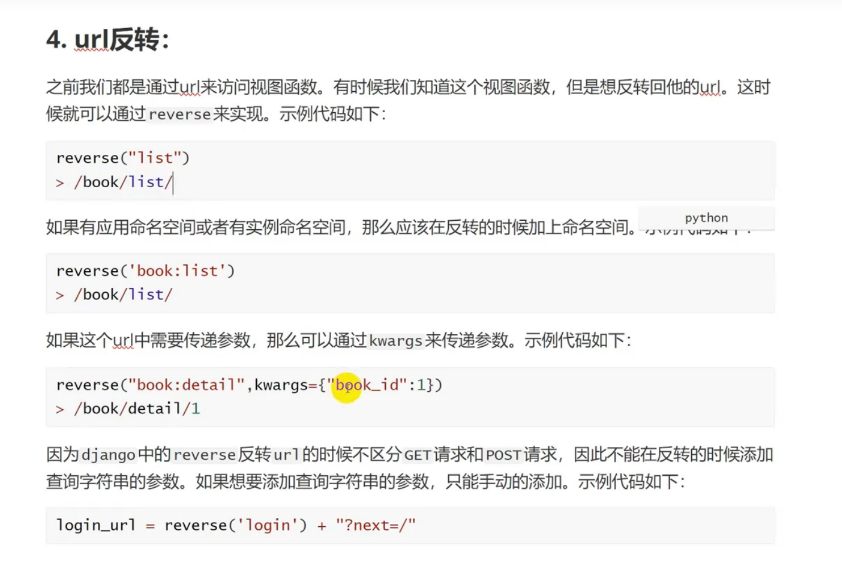
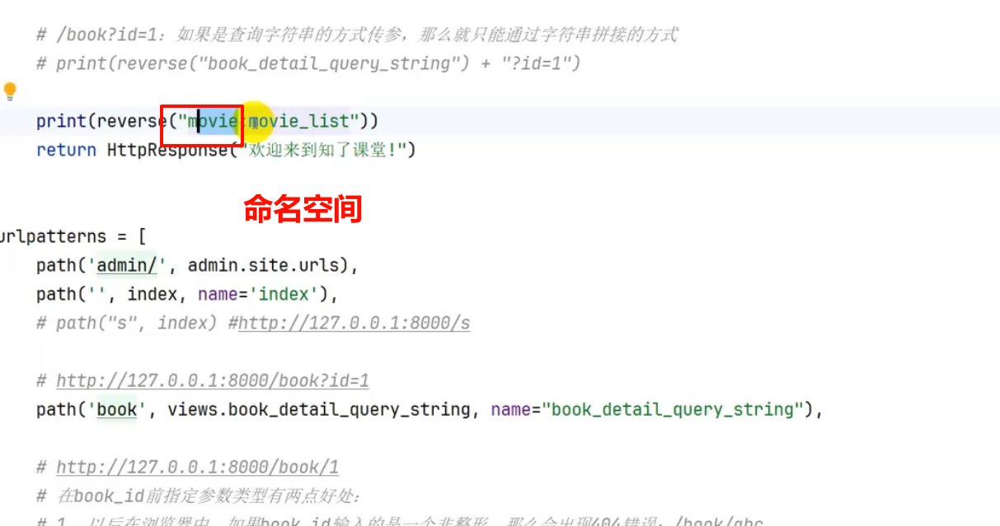
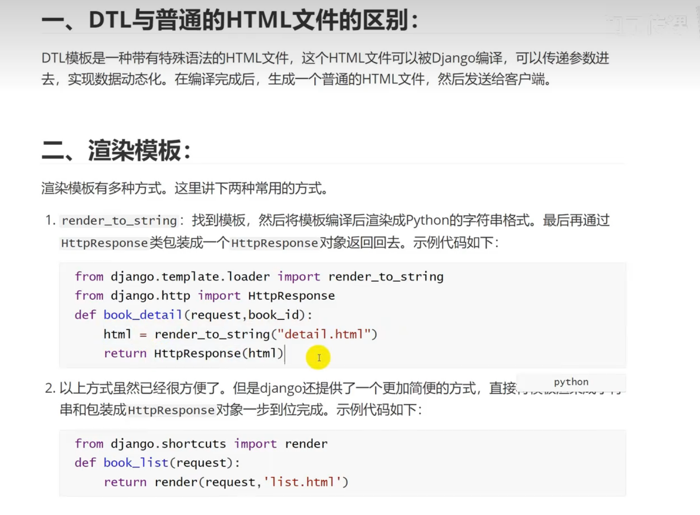
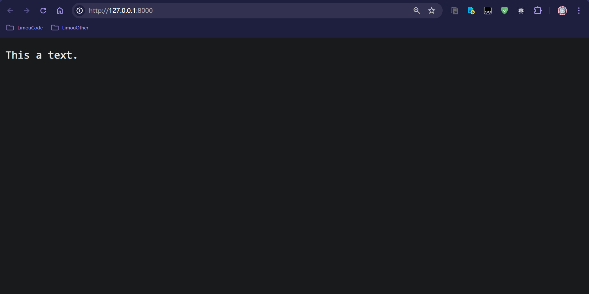

# 1.Django 构建项目

## 1.1.创建与运行项目

1.   创建项目使用 `django-admin startproject <项目名称>`
2.   运行项目使用 `python manage.py runserver`


出现以上界面就配置成功,这里简单说一下项目的目录结构：

```shell
my_project:
│  db.sqlite3
│  manage.py # (1)项目的交互文件
│
├─my_project
│  │  __init__.py
│  │  asgi.py
│  │  settings.py # (2)项目的设置选项
│  │  urls.py # (3)配置 URL 路由
│  └─ wsgi.py 
│
...
```

## 1.2.创建与删除应用

`app` 是 `django` 项目的组成部分，一个 `app` 代表项目中的一个模块，所有 `URL` 请求的响应都是由 `app` 来处理。一个 `django` 项目由许多 `app` 组成，一个 `app` 也可以被用到其他项目，使用 `python manage.py startapp <app>` 即可创建一个对应的 `app`，但要删除 `Django` 项目中的应用程序（`app`），可以执行以下步骤：

1.  **删除应用程序文件夹**：在您的 `Django` 项目目录下，你会发现一个名为 `<app>` 的文件夹，其中包含了应用程序的代码文件，可以手动删除这个文件夹。
2.  **从 INSTALLED_APPS 中删除应用程序**：打开您 `Django` 项目中的 `settings.py` 文件，找到 `INSTALLED_APPS` 配置项，并从列表中删除 `<app>`（如果这里是添加就相对于安装一个 `app`），这样 `Django` 就不会加载这个应用程序了。
3.  **删除数据库迁移文件**：如果您已经执行了数据库迁移操作，那么在删除应用程序之前，你需要删除与该应用程序相关的数据库迁移文件。在您的应用程序目录下，会找到一个名为 `migrations` 的文件夹，里面包含了数据库迁移文件。您可以手动删除这个文件夹，或者执行 `python manage.py makemigrations --empty book` 命令来删除数据库迁移文件，然后运行迁移命令 `python manage.py migrate`。
4.  **删除应用程序在其他文件中的引用**：如果您在其他地方引用了该应用程序（例如视图、`URL` 配置等），则需要删除这些引用，否则 `Django` 可能会因为找不到应用程序而报错。

# 2.Django 添加视图

```python
path(route, view, name=None, kwargs=None)
```

-   `route`：`url` 的匹配规则，也可以使用 `<type:arg>` 指定向主 `url` 中传递的参数的数据类型
-   `view`：可以是视图函数、类视图、`.as_view()`、`django.urls.include()`
-   `name`：为 `url` 取名，可以使用名字来逆向找到 `url`，可以隔离实现和使用，是一种分层策略

主 `app` 应用有一个 `urls.py` 文件，专门用来添加视图函数。

```python
# ./main_app/urls.py
"""
URL configuration for my_easy_blog_steam project.

The `urlpatterns` list routes URLs to views. For more information please see:
    https://docs.djangoproject.com/en/5.0/topics/http/urls/
Examples:
Function views
    1. Add an import:  from my_app import views
    2. Add a URL to urlpatterns:  path('', views.home, name='home')
Class-based views
    1. Add an import:  from other_app.views import Home
    2. Add a URL to urlpatterns:  path('', Home.as_view(), name='home')
Including another URLconf
    1. Import the include() function: from django.urls import include, path
    2. Add a URL to urlpatterns:  path('blog/', include('blog.urls'))
"""
from django.contrib import admin
from django.urls import path
from django.shortcuts import HttpResponse # shortcuts 内包含各种便捷函数

def index(request):
    return HttpResponse('Hello limou3434.')

urlpatterns = [
    path('admin/', admin.site.urls),
    path('hello/', index) # 这里直接写 <path/> 就行, 前面会自动加载主 URL
]
```

不过实际开发中视图函数都是在别处实现，或者说是在别的 `app` 的 `views.py` 中实现，然后在这里引入的。我们创建一个 `app: my_test`，然后尝试传递 `url` 参数...

```python
# ./my_test/views.py

from django.shortcuts import render
from django.shortcuts import HttpResponse # shortcuts 内包含各种便捷函数

# Create your views here.

def test(request):
    num1 = request.GET.get('num1') # 无则返回空
    num2 = request.GET.get('num2') # 无则返回空
    add = int(num1) + int(num2)
    return HttpResponse(f"{num1} + {num2} = {add}.")

def func(request, arg):
    return HttpResponse(f"This is {arg}.")
```

```python
# ./main_app/urls.py

"""
URL configuration for my_easy_blog_steam project.

The `urlpatterns` list routes URLs to views. For more information please see:
    https://docs.djangoproject.com/en/5.0/topics/http/urls/
Examples:
Function views
    1. Add an import:  from my_app import views
    2. Add a URL to urlpatterns:  path('', views.home, name='home')
Class-based views
    1. Add an import:  from other_app.views import Home
    2. Add a URL to urlpatterns:  path('', Home.as_view(), name='home')
Including another URLconf
    1. Import the include() function: from django.urls import include, path
    2. Add a URL to urlpatterns:  path('blog/', include('blog.urls'))
"""
from django.contrib import admin
from django.urls import path
from my_test import views # 从 my_test 应用程序中导入视图模块

urlpatterns = [
    path('admin/', admin.site.urls),
    path('test', views.test), # URL 主体携带 Get 表单查询字符串
    path('func/<arg>', views.func) # URL 主体携带 '/参数', 常见于不同文件的 id 指引,可以写成 func<int:arg> 限定类型
]

```


# 3.Django 路由反转

可以使用 `name` 来反转 `url`，转化的话，哪怕接口逻辑改变，也可以通过 `name` 反转得到 `url`。如果有应用命名空间或者有实例命名空间，那么应该在反转的时候加上命名空间（这种策略是为了避免命名冲突）。





命名空间:name

# 4.Django 模板引擎



注意您如果没有使用 `Web` 开发编辑器，直接使用的话可能需要修改静态目录文件。

```python
TEMPLATES = [
    {
        'BACKEND': 'django.template.backends.django.DjangoTemplates', # 模板引擎
        'DIRS': [
            BASE_DIR / 'templates' # 配置模板文件
        ],
        'APP_DIRS': True, # 允许模板文件夹在 app 中进行创建
        'OPTIONS': {
            'context_processors': [
                'django.template.context_processors.debug',
                'django.template.context_processors.request',
                'django.contrib.auth.context_processors.auth',
                'django.contrib.messages.context_processors.messages',
            ],
        },
    },
]
```

这里 `BASE_DIR=<Django 项目地址>`。

```html
<!-- ./templates/index.html -->
<!DOCTYPE html>
<html lang="en">
<head>
    <meta charset="UTF-8">
    <meta name="viewport" content="width=device-width, initial-scale=1.0">
    <title>index</title>
</head>
<body>
    <p>This a text.</p>
</body>
</html>
```

```cpp
# ./home/views.py
from django.shortcuts import render

# Create your views here.
def index(request):
    return render(request, 'index.html')
```

```cpp
# ./main_app/urls.py

"""
URL configuration for my_easy_blog_steam project.

The `urlpatterns` list routes URLs to views. For more information please see:
    https://docs.djangoproject.com/en/5.0/topics/http/urls/
Examples:
Function views
    1. Add an import:  from my_app import views
    2. Add a URL to urlpatterns:  path('', views.home, name='home')
Class-based views
    1. Add an import:  from other_app.views import Home
    2. Add a URL to urlpatterns:  path('', Home.as_view(), name='home')
Including another URLconf
    1. Import the include() function: from django.urls import include, path
    2. Add a URL to urlpatterns:  path('blog/', include('blog.urls'))
"""
from django.contrib import admin
from django.urls import path
from home import views

urlpatterns = [
    path('admin/', admin.site.urls),
    path('', views.index)
]

```




