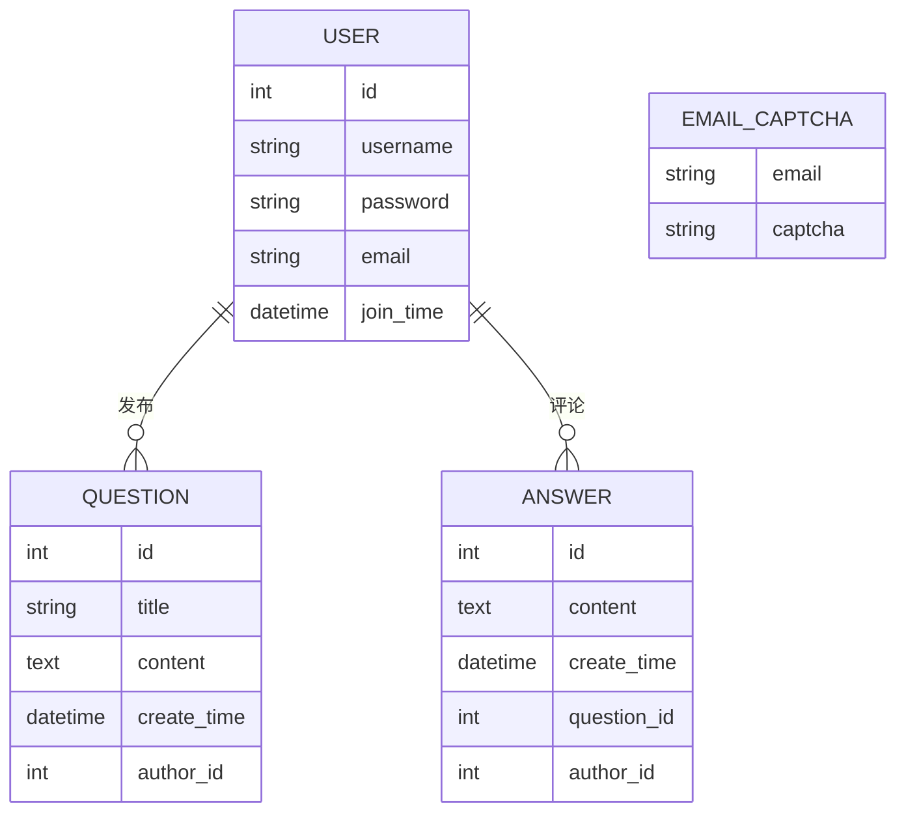

>   前要：既然使用了 `Web` 框架，那就应该写一写实际的代码（本节带您书写一个问答平台），并在实际操作中，我还会补上一些细节。

# 1.需求分析

我们先来做需求分析，我们的目标是做一个问答平台（`Question and answer platform`，项目名字就给一个 `QAAP` 吧！），用户注册账户后，可以通过账户和密码验证登录该平台，然后进行发帖。而其他用户可以在登陆后查看该用户的文章的具体信息，并且可以进行评论。

# 2.编码过程

## 2.1.文件结构

```shell
# 文件目录树
QAAP/
│  app.py		# app 主要逻辑
│  config.py	# app 相关配置
│  exts.py		# app 内部插件
│  models.py	# ORM 模型文件
│  
├─blueprints/	# 路由包管理
│
├─migrations/	# 数据库同步脚本
│
├─static		# 静态文件资源
│
└─templates/	# 渲染模板文件
```

## 2.2.具体代码

# 3.细节解释

## 3.1.数据库里用到的时间模块


## 3.2.SMTP 的邮箱配置

可以使用 `QQ` 邮箱来配置验证码模块


## 3.3.JQ

`$` 实际上是 `jQuery` 的别名，是一个全局函数，用于选择和操作 `DOM` 元素，以及执行其他 `jQuery` 方法。


可以考虑使用 `gunicorn -w 4 -b 0.0.0.0:8092 app:app --daemon` 的挂载使用...

`ps aux | grep gunicorn`


`gunicorn -w 4 -b 0.0.0.0:8092 --chdir . --access-logfile ./access.log --error-logfile ./error.log app:app --daemon`

`pkill gunicorn`




### 用户表 (User)

| 字段      | 数据类型    | 主键 | 非空 | 唯一 | 默认值 | 外键 | 约束 | 说明         |
| --------- | ----------- | ---- | ---- | ---- | ------ | ---- | ---- | ------------ |
| id        | Integer     | ✓    | ✓    |      |        |      |      | 用户ID       |
| username  | String(100) |      | ✓    |      |        |      |      | 用户名       |
| password  | String(200) |      | ✓    |      |        |      |      | 密码         |
| email     | String(100) |      | ✓    | ✓    |        |      |      | 邮箱地址     |
| join_time | DateTime    |      |      |      | now()  |      |      | 用户注册时间 |

### 验证码表 (EmailCaptcha)

| 字段    | 数据类型    | 主键 | 非空 | 唯一 | 默认值 | 外键 | 约束 | 说明       |
| ------- | ----------- | ---- | ---- | ---- | ------ | ---- | ---- | ---------- |
| email   | String(100) | ✓    | ✓    |      |        |      |      | 邮箱地址   |
| captcha | String(100) |      | ✓    |      |        |      |      | 邮箱验证码 |

### 问题表 (Question)

| 字段        | 数据类型    | 主键 | 非空 | 唯一 | 默认值 | 外键 | 约束 | 说明         |
| ----------- | ----------- | ---- | ---- | ---- | ------ | ---- | ---- | ------------ |
| id          | Integer     | ✓    | ✓    |      |        |      |      | 问题ID       |
| title       | String(100) |      | ✓    |      |        |      |      | 问题标题     |
| content     | Text        |      | ✓    |      |        |      |      | 问题内容     |
| create_time | DateTime    |      |      |      | now()  |      |      | 提问时间     |
| author_id   | Integer     |      | ✓    |      |        | ✓    |      | 提问者用户ID |

### 回答表 (Answer)

| 字段        | 数据类型 | 主键 | 非空 | 唯一 | 默认值 | 外键 | 约束 | 说明         |
| ----------- | -------- | ---- | ---- | ---- | ------ | ---- | ---- | ------------ |
| id          | Integer  | ✓    | ✓    |      |        |      |      | 回答ID       |
| content     | Text     |      | ✓    |      |        |      |      | 回答内容     |
| create_time | DateTime |      |      |      | now()  |      |      | 回答时间     |
| question_id | Integer  |      | ✓    |      |        | ✓    |      | 关联问题ID   |
| author_id   | Integer  |      | ✓    |      |        | ✓    |      | 回答者用户ID |


| 序号 | 数据表文件        | 文件类型 | 文件大小         |
| ---- | ----------------- | -------- | ---------------- |
| 1    | user.sql          | SQL      | 根据项目运行而定 |
| 2    | email_captcha.sql | SQL      | 根据项目运行而定 |
| 3    | question.sql      | SQL      | 根据项目运行而定 |
| 4    | answer.sql        | SQL      | 根据项目运行而定 |


| 序号 | 测试内容 | 输入的数据及操作 | 预期结果 | 实际结果 | 是否成功 | 失败原因 |
| ---- | -------- | ---------------- | -------- | -------- | -------- | -------- |
| 1    | 用户数据插入测试 | 插入用户数据: ('user1', 'password1', 'user1@example.com') | 用户数据成功插入数据库 | 用户数据成功插入数据库 | ✔️    | 无   |
| 2    | 验证码数据插入测试 | 插入验证码数据: ('user1@example.com', '123456') | 验证码数据成功插入数据库 | 验证码数据成功插入数据库 | ✔️    | 无   |
| 3    | 错误提问内容数据插入测试 | 插入提问内容数据: ('Question 1', 'Content of Question 1', 3) | 外键约束失败，插入失败 | 外键约束失败，插入失败 | ✔️    | 无   |
| 4    | 评论内容数据插入测试 | 插入评论内容数据: ('Answer to Question 1', 1, 2) | 评论内容数据成功插入数据库 | 评论内容数据成功插入数据库 | ✔️    | 无   |


| 序号 | 测试内容                 | 输入的数据及操作                                             | 预期结果                                      | 实际结果                                      | 是否成功 | 失败原因 |
| ---- | ------------------------ | ------------------------------------------------------------ | --------------------------------------------- | --------------------------------------------- | -------- | -------- |
| 1    | 用户数据插入测试         | 插入用户数据: `('user1', 'password1', 'user1@example.com')`  | 用户数据成功插入数据库                        | 用户数据成功插入数据库                        | ✔️        | 无       |
| 2    | 验证码数据插入测试       | 插入验证码数据: `('user1@example.com', '123456')`            | 验证码数据成功插入数据库                      | 验证码数据成功插入数据库                      | ✔️        | 无       |
| 3    | 错误提问内容数据插入测试 | 插入提问内容数据: `('Question 1', 'Content of Question 1', 3)` | 外键约束失败，插入失败                        | 外键约束失败，插入失败                        | ✔️        | 无       |
| 4    | 评论内容数据插入测试     | 插入评论内容数据: `('Answer to Question 1', 1, 2)`           | 评论内容数据成功插入数据库                    | 评论内容数据成功插入数据库                    | ✔️        | 无       |
| 5    | 用户数据查询测试         | 查询用户数据: `SELECT * FROM user WHERE username = 'user1'`  | 查询到用户数据 `'user1'`                      | 查询到用户数据 `'user1'`                      | ✔️        | 无       |
| 6    | 提问内容查询测试         | 查询提问内容数据: `SELECT * FROM question WHERE id = 1`      | 查询到提问内容数据 `'Question 1'`             | 查询到提问内容数据 `'Question 1'`             | ✔️        | 无       |
| 7    | 评论内容删除测试         | 删除评论内容数据: `DELETE FROM answer WHERE id = 1`          | 成功删除评论内容数据 `'Answer to Question 1'` | 成功删除评论内容数据 `'Answer to Question 1'` | ✔️        | 无       |


`mysqldump -u 用户名 -p 数据库名 > 备份文件名.sql`


`mysql -u 用户名 -p 数据库名 < 备份文件名.sql`


使用 mysql -u root -p 命令登录到 MySQL 服务器，使用以下命令创建名为 "ljp" 的用户，并为其设置密码 CREATE USER 'ljp'@'localhost' IDENTIFIED BY 'your_password'; 


使用以下命令授予用户 "ljp" 对 "qa_platform" 数据库的所有权限 GRANT ALL PRIVILEGES ON qa_platform.* TO 'ljp'@'localhost'; 并且使用以下命令刷新 MySQL 权限 FLUSH PRIVILEGES;
