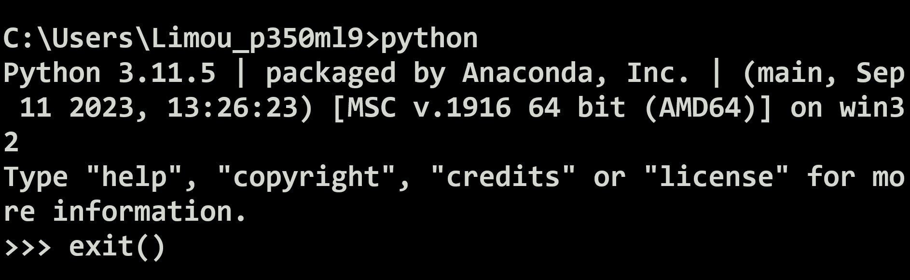
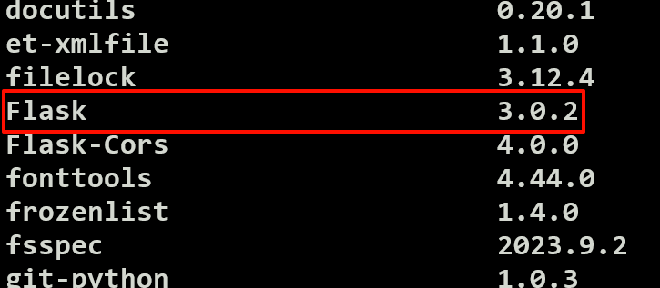
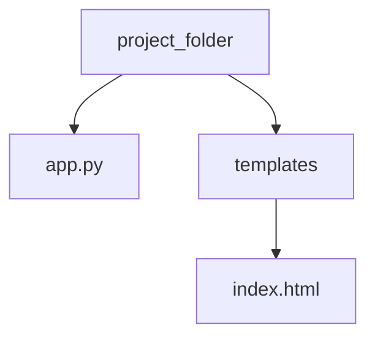
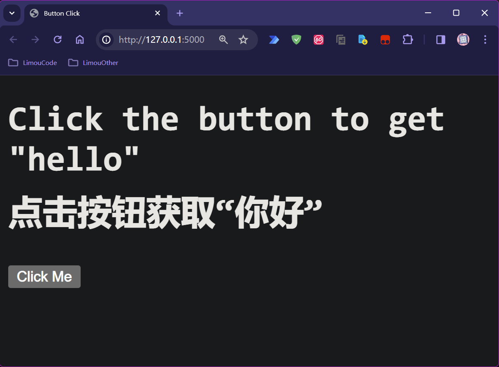

>   前要：首先提醒一下，在学习 `Flask` 前，您至少需要一些基础的 `Web` 三大件知识（`HTML、CSS、JS`）和一些网络知识，使用过一段时间的 `Python`。
>
>   使用 `Flask` 实在是我的无奈之举，本人的技术栈此时还没有怎么深入网络，而在学校接手了一个小的项目却需要一定的 `BS` 模型开发基础。在一番市场调研后，最终选择了这个小而美的 `Web` 框架。
>
>   但是实际上我并不知道这个框架是否好用，只是作为学习方便日后的知识拓展（我希望通过 `Flask` 的学习让我更加了解从前端到后端中我缺失的那一部分知识）。
>
>   至少从 `Github` 的 `star` 数量来看，这个框架看样子还是值得学习的。
>
>   首先我给出 `Flask` 的 [`Github` 地址](https://github.com/pallets/flask)，另外还有一个经常一起比较的框架 `Django`，这里我也给出 [`Github` 地址](https://github.com/django/django)。
>
>   我选择先 `Flask` 后再拓展到 `Django`，前者是一个微框架，会更加容易学习。
>
>   在这里我也给出 [`Flask` 相关文档](https://flask.palletsprojects.com/en/3.0.x/)。

# 1.环境准备

建议下载专业版的 `pycharm-professional`，虽然收费但是内部具有更多功能。

我建议使用 `python 3.9` 以上的 `python` 版本，以及 `Flask 2.0.1` 以上的 `Flask` 版本（使用 `pip install flask` 下载），下面是我使用的版本。





以及我的编辑环境：


# 2.基础使用

在学习一门技术前，还有什么比彻底运行完一个程序并且成功得到想要的结果更加令人兴奋的事情呢？我来试试使用 `Flask` 框架在本地运行一个和网页端代码进行交互的例子。



一个 `Flask` 框架下前后端交互的 `app` 文件会按照上述目录进行编写，我们先来写一个简单的 `app.py` 后端应用，并且结合一个 `index.html` 前端页面来进行简单的数据交互，期间数据使用 `JSON` 来传递（而其他细节我暂时忽略或者写在注释中）。

```python
# app.py
from flask import Flask, request, jsonify, render_template

app = Flask(__name__)

@app.route('/')
def index():
    return render_template('index.html') # 渲染 templates 文件夹下的 index.html 页面

@app.route('/get_hello', methods=['POST']) # 用户点击按钮后，通过 fetch() 跳转到下面的视图函数
def get_hello():
    data = request.get_json()  # 获取客户端发送的 JSON 数据
    message = data['name'] + '3434' # 加工用户发送过来的数据
    return jsonify({'message': message}) # 以 JSON 的显示转回客户端

if __name__ == '__main__':
    app.run(debug=True)

```

```html
<!-- index.html -->
<!DOCTYPE html>
<html lang="en">
<head>
    <meta charset="UTF-8">
    <meta name="viewport" content="width=device-width, initial-scale=1.0">
    <title>Button Click</title>
</head>
<body>
    <h1>Click the button to get "hello"</h1>
    <button id="myButton">Click Me</button>

    <script>
        document.getElementById('myButton').addEventListener('click', function() { //设置事件监听，监听点击类型的事件，一旦点击就会立刻执行接下来的匿名函数
            const data = { name: 'limou'}; //需要发送给服务端的 JSON 数据
            //发送 POST 请求把 data 发送到 Flask 服务器
            fetch('/get_hello', {
                method: 'POST',
                headers: {  'Content-Type': 'application/json' },
                body: JSON.stringify(data)
            })
            .then(response => response.json()) //接受服务端的返回值，并且将其转化为 JSON 数据
            .then(data => { alert(data.message); }); //在收到服务器响应后，弹出消息框打印消息
        });
    </script>
</body>
</html>

```

注意文件的放置位置，不要放错目录！然后直接运行这个 `app.py` 代码，运行窗口出现如下结果证明后端程序运行成功。

```cmd
* Serving Flask app 'server'
 * Debug mode: on
WARNING: This is a development server. Do not use it in a production deployment. Use a production WSGI server instead.
 * Running on http://127.0.0.1:5000
Press CTRL+C to quit
 * Restarting with stat
 * Debugger is active!
 * Debugger PIN: 136-589-025
```

然后直接根据提示，在浏览器中访问 `http://127.0.0.1:5000`，这是一个本地 `ip` 的默认 `port`（简单来说，通过一个 `ip` 地址和端口号，就可以确定一台计算机上的一个进程，粗暴理解的话，端口号 `port` 就是网络上的一种进程编号）。

浏览器渲染 `templates/index.html` 即可显示出一个网页（如果您得到其他的网页，那就说明您的程序有些问题）：

 

点击 `Click Me` 按钮，就会在浏览器中弹出一个弹窗，这就是从服务端发送回来的数据，而在服务端的运行窗口中，就会获得以下的日志。

```cmd
127.0.0.1 - - [25/Mar/2024 23:34:57] "POST /get_hello HTTP/1.1" 200 -
```

到这里，我相信您一定能深刻理解 `Flask` 框架是在做什么的了。

