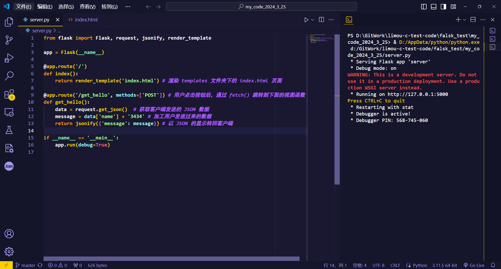
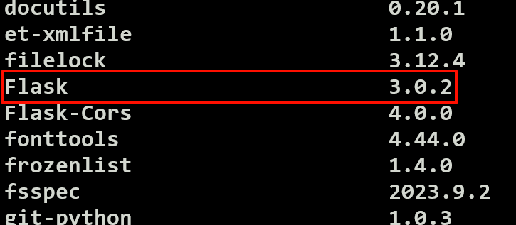
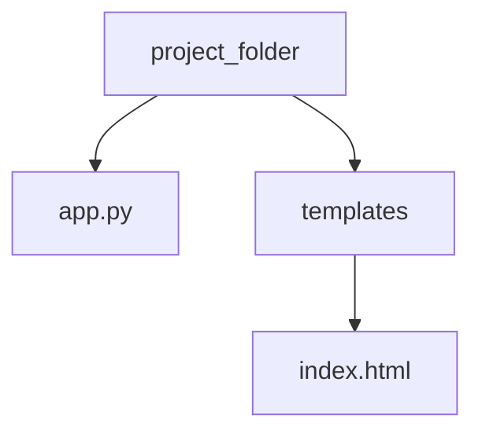
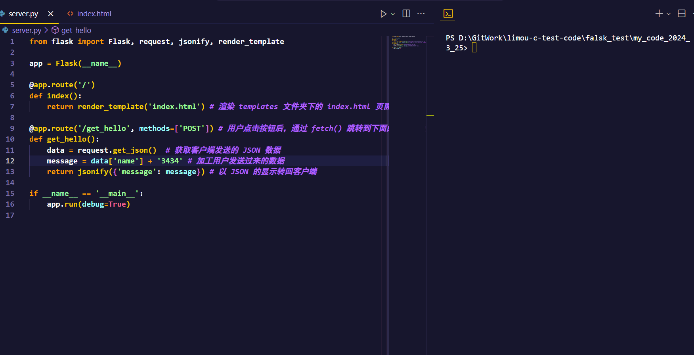
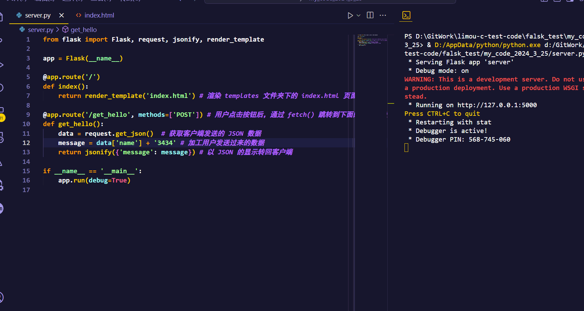
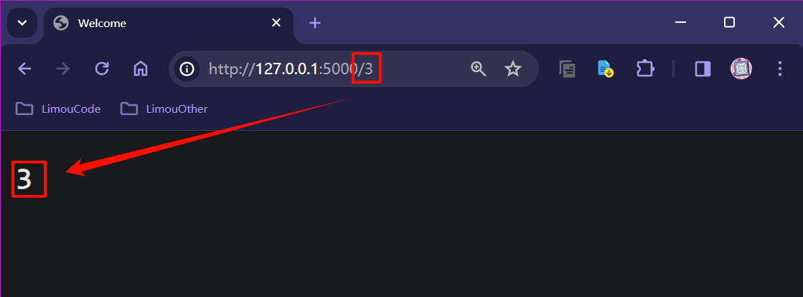
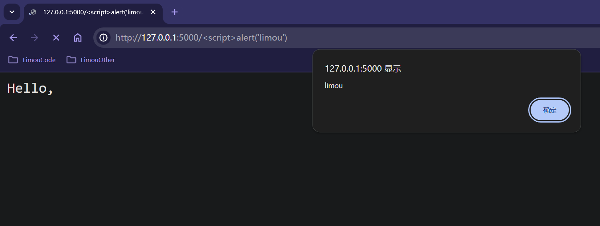
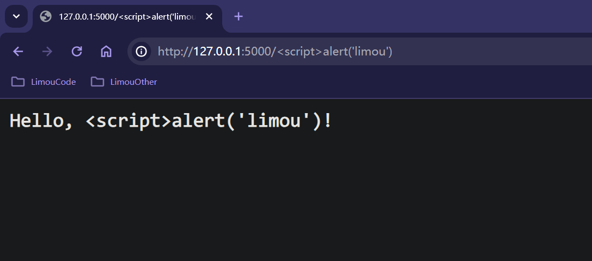

>   前要：使用 `Flask` 实在是我的无奈之举，本人的技术栈在写这篇文章时还没有怎么深入网络编程，而在学校接手了一个小的项目却需要一定的 `BS` 模型开发基础。在一番“市场调研”后，最终选择了这个小而美的 `Web` 框架。
>
>   但是实际上我并不知道这个框架是否好用，只是作为学习方便日后的知识拓展（我希望通过 `Flask` 的学习让我更加了解从前端到后端过程中中缺失的那一部分知识）。
>
>   至少从 `Github` 的 `star` 数量来看，这个框架还是值得学习的！

>   基础：首先提醒一下，在学习 `Flask` 前，您至少需要以下知识（我已给出学习链接）
>
>   -   使用过一段时间的 [Python 语言](https://docs.python.org/zh-cn/3/)，至少 `python` 的列表、元组、集合、字典以及函数、控制语...还有一些常见的模块，例如 `pathlib`...
>
>   -   对一些命令行的基本操作和理解，至少会使用 `pip` 包管理器吧？
>
>   -   [基础的 Web 开发知识](https://developer.mozilla.org/zh-CN/docs/Learn)（尤其是 `HTML、CSS、JS` 三大件），这些不需要精通，但是需要了解一二，尤其是 `JS`...
>
>   -   一些网络知识，这一部分您直接 `Google` 一下最快，或者直接跟着我后续的教程来学习也可以，您至少应该知道：
>
>       (1)服务端和客户端应该怎么绑定套接字
>
>       (2)明白一个 `host` 可以有多个 `ip`
>
>       (3)`ip` 和 `port` 组成一个套接字
>
>       (4)`port` 对于进程的作用是什么
>
>   -   一些 [关于 JSON 的知识](https://www.json.org/json-en.html)，这部分很容易学习，尤其是配合 `python` 的使用...
>
>   -   如果可以，您还需要具备一定的 `MySQL` 基础，您可以去看看我写的 [MySQL 文章](../../../SQL_Database_Note\MySQL实践)，或者是 [MySQL 官方文档](https://dev.mysql.com/doc/)，亦或是 [MySQL 中文文档](https://www.mysqlzh.com/)...
>

>   资料：这里我给出一些常用的学习文档
>
>   -   [Flask 的 Github 地址](https://github.com/pallets/flask)，在这里我也给出 [Flask 相关文档](https://flask.palletsprojects.com/en/3.0.x/)。
>   -   经常和 `Flask` 一起比较的 `Web` 框架 `Django`，这里我也给其出 [Django 的 Github 地址](https://github.com/django/django)
>   -   另外，您还需要了解 [Jinja2 相关文档](https://jinja.palletsprojects.com/en/2.10.x/)，以及 [Jinja2 的 Github 地址](https://github.com/pallets/jinja) 我们在后续会细细讲这个模块和 `flask` 之间的关系。 
>
>   我选择先 `Flask` 后再拓展到 `Django`，前者是一个微框架，会更加容易学习。

# 1.环境准备

## 1.1.编辑环境和配置

建议下载专业版的 `pycharm-professional`，虽然收费但是内部具有更多功能（或者使用 `VSCode` 替代，这个是免费的）。

-   [pycharm-professional 下载地址](https://www.jetbrains.com/pycharm/)
-   [VSCode 下载地址](https://code.visualstudio.com/)



>   注意：我主要使用 `VSCode`，您可以跟着我来，但是 `VSCode` 的插件配置有些许繁琐，这里我不提及，有机会在补上，待补充...

## 1.2.Python 版本

我建议使用 `python 3.9` 以上的 `python` 版本，以及 `Flask 2.0.1` 以上的 `Flask` 版本（使用 `pip install flask` 下载），下面是我使用的版本。




# 2.测试代码

在学习一门技术前，还有什么比彻底运行完一个程序并且成功得到想要的结果更加令人兴奋的事情呢？我来试试使用 `Flask` 框架在本地运行一个和网页端代码进行交互的例子。



一个 `Flask` 框架下前后端交互的 `app` 文件会按照上述目录进行编写，我们先来写一个简单的 `app.py` 后端应用，并且结合一个 `index.html` 前端页面来进行简单的数据交互，期间数据使用 `JSON` 来传递（而其他细节我暂时忽略或者写在注释中）。

```python
# app.py
from flask import Flask, request, jsonify, render_template

app = Flask(__name__)

@app.route('/')
def index():
    return render_template('index.html') # 渲染 templates 文件夹下的 index.html 页面

@app.route('/get_hello', methods=['POST']) # 用户点击按钮后，通过 fetch() 跳转到下面的视图函数
def get_hello():
    data = request.get_json()  # 获取客户端发送的 JSON 数据
    message = data['name'] + '3434' # 加工用户发送过来的数据
    return jsonify({'message': message}) # 以 JSON 的显示转回客户端

if __name__ == '__main__':
    app.run(debug=True)

```

```html
<!-- index.html -->
<!DOCTYPE html>
<html lang="en">
<head>
    <meta charset="UTF-8">
    <meta name="viewport" content="width=device-width, initial-scale=1.0">
    <title>Button Click</title>
</head>
<body>
    <h1>Click the button to get "hello"</h1>
    <button id="myButton">Click Me</button>

    <script>
        document.getElementById('myButton').addEventListener('click', function() { //设置事件监听，监听点击类型的事件，一旦点击就会立刻执行接下来的匿名函数
            const data = { name: 'limou'}; //需要发送给服务端的 JSON 数据
            //发送 POST 请求把 data 发送到 Flask 服务器
            fetch('/get_hello', {
                method: 'POST',
                headers: {  'Content-Type': 'application/json' },
                body: JSON.stringify(data)
            })
            .then(response => response.json()) //接受服务端的返回值，并且将其转化为 JSON 数据
            .then(data => { alert(data.message); }); //在收到服务器响应后，弹出消息框打印消息
        });
    </script>
</body>
</html>

```

注意前端文件的放置位置，不要放错目录，要放在 `templates` 中！然后直接运行这个 `app.py` 代码（或者在命令行中使用 `flask --app app run`，实际上改命令就是代码中的 `app.run()` 的另一种命令行写法），运行窗口出现如下结果证明后端程序运行成功。



然后直接根据提示，在浏览器中访问 `http://127.0.0.1:5000`（可以手动在浏览器的地址栏中输入，或者直接长按 `[ctrl]` 后鼠标左键控制台中的地址，这会使用您计算机中默认的浏览器打开这个网址）。

`http://127.0.0.1:5000` 是一个本地 `ip` 的默认 `port`（简单来说，通过一个 `ip` 地址和端口号，就可以确定一台计算机上的一个进程，粗暴理解的话，端口号 `port` 就是网络上的一种进程编号）。

浏览器成功渲染 `templates/index.html` 即可显示出一个网页（如果您得到其他的网页，那就说明您的程序有些问题）：



点击 `Click Me` 按钮，就会在浏览器中弹出一个弹窗，这就是从服务端发送回来的经过加工的数据，而在服务端的运行窗口中，就会获得以下的日志。

```cmd
127.0.0.1 - - [25/Mar/2024 23:34:57] "POST /get_hello HTTP/1.1" 200 -
```

到这里，我相信您一定能深刻理解 `Flask` 框架是在做什么的了，这就是一个和前端进行交互的后端框架。

# 3.代码细节

```python
from flask import Flask, request, jsonify, render_template

app = Flask(__name__)

@app.route('/')
def index():
    return render_template('index.html') # 渲染 templates 文件夹下的 index.html 页面

@app.route('/get_hello', methods=['POST']) # 用户点击按钮后，通过 fetch() 跳转到下面的视图函数
def get_hello():
    data = request.get_json()  # 获取客户端发送的 JSON 数据
    message = data['name'] + '3434' # 加工用户发送过来的数据
    return jsonify({'message': message}) # 以 JSON 的显示转回客户端

if __name__ == '__main__':
    app.run(debug=True)
```

## 3.1.创建 Flask 对象 app

首先我们从上面这个后端程序开始分析，`form flask import Flask` 其实就是导入了 `flask` 模块中的 `Flask` 类，在后面 `app = Flask(__name__)` 中，实际上就是使用用当前文件（也就是编写这段代码的 `.py` 文件）的名字来创建一个 `Flask` 类类型的对象 `app`。

然后使用 `run()` 方法：

```python
if __name__ == '__main__':
    app.run(debug=True)
```

就可以让这个 `app` 应用成功运行起来。

>   补充：为什么需要给 `Flask` 的实例化对象传递 `__name__` 来构造呢？这涉及到我后面内容会提及的模板文件和静态文件，传入这个参数就是为了指定应用的根路径（类似工作路径），方便 `Flask` 对象知道在哪里寻找模板文件和静态文件等资源，这个之后您就明白了...

## 3.2.路由和视图函数的使用

>   补充：首先我们来扫一个盲，或许有人不清楚装饰器的作用，这里补充以下。
>
>   ```python
>   # 装饰器的使用
>   def logger(func):
>       def wrapper(*args, **kwargs): # args 是直接传参的元组参数包，kwargs 是关键字传参的字典参数包
>           print(f'Function {func.__name__} is running, carry two parameters {args}...') # 打印函数启动的信息
>           result = func(*args, **kwargs) # 真正开始调用函数的时候，先把结果存储起来
>           print(f'Function {func.__name__} finished running.') # 打印函数结束的信息
>           return result # 返回调用结果
>       return wrapper # 返回一个函数而不是 wrapper() 的调用结果
>   
>   @logger
>   def add_numbers(a, b):
>       return a + b
>   
>   if __name__ == '__main__':
>       result = add_numbers(10, 20)
>       print(result) 
>   
>       # 输出结果：
>       # Function add_numbers is running, carry two parameters (10, 20)...
>       # Function add_numbers finished running.
>       # 30
>   ```
>
>   实际上，**您可以简单理解为，装饰器是一种特殊类型的函数，它可以用来修改其他函数的行为，本质上是一个接受函数作为参数并返回一个新函数的高阶函数，是一种函数的拓展**。
>
>   修饰器的工作就是让定义在其后面的函数在修饰器内部进行调用，函数不是直接被调用的，而是通过修饰器来返回一个被修饰过的新函数。这样的函数可以复用之前原有的函数。最典型的应用就是在函数的执行前后加上日志消息。您在后面可以看到，一个函数经过修饰器的声明后，除了完成自己本身的功能，还会实现一些您没有加入函数体的其他功能...
>
>   另外类装饰器还可以应用来类上，也就是类装饰器，这些您也可以去了解一些...

```python
@app.route('/')
def index():
    return render_template('index.html') # 渲染 templates 文件夹下的 index.html 页面
```

`@app.route('/')` 绑定一个路由（其实就是路径），后续带上一个被装饰的函数，告诉 `Flask` 前端程序访问哪一个路由时，就应该执行哪一个被装饰过的函数。

>   补充：这里其实做了省略，原本 `/` 应该写成完整的 `url` 为 `http或https://域名:端口号`。但是由于实际部署中的 `url` 是一直确定的，用户只是在这个 `url` 上做不同的跳转，因此在这里我们可以直接把 `/` 理解为一个网站链接的默认主页面。

这里绑定这个 `/` 路由后，一旦用户申请访问这个主页面（也就是访问 `http://127.0.0.1:5000`）时，就会自动执行 `index()` 这个视图函数（也就是一个被装饰的函数罢了，没什么特殊的）。

而在用户在浏览器上访问 `http://127.0.0.1:5000` 后，该函数会使用 `flask` 模块中的一个函数 `render_template('index.html')` 作为返回值，这样可以让浏览器渲染 `templates` 文件夹下的 `index.html` 页面文件（实际上您可以理解为，这个函数把这个 `index.html` 页面发送给浏览器进行页面展示/页面渲染）。

>   注意：这里的 `templates` 是默认的文件夹，您需要自己自定义一个文件夹（有些智能的编辑器会帮您做这件事），然后在里面放入您需要交给浏览器渲染的 `.html` 文件。

当然，如果 `index()` 直接进行返回，就会被自动解析为 `HTML` 类型的数据。

>   补充：实际上在浏览器的 `URL` 地址栏中也可以向后端程序中传递参数，而无需通过 `request` 对象，只需要给路由加上 `'<...>'` 参数即可。
>
>   还可以给传递的参数限定默认值，例如 `'/<int:args>'`，还有一些其他的类型限定，您可以自己进行查看。
>
>   ```python
>   # 视图函数从 URL 中获取参数
>   from flask import Flask, render_template
>   
>   app = Flask(__name__)
>   
>   @app.route('/')
>   def index():
>       return render_template('index.html')
>   
>   @app.route('/<int:args>') # 这里会把 args 解释为 int 类型
>   def detail(args):
>       return args
>   
>   if __name__ == '__main__':
>       app.run(debug=True)
>   ```
>
>   
>
>
>   另外，在 `JS` 中直接使用 `fetch(url/)` 发送数据和使用 `URL` 参数的形式传递数据是不同的，它们有以下区别：
>
>   1.   **直接使用 Fetch() 发送数据**：使用 `fetch()` 函数发送数据通常是在前端（客户端）的 `JavaScript` 代码中完成的，它是通过浏览器的 `Fetch API` 来发送网络请求的。通过 `fetch()` 函数发送的数据，可以包含在请求的 `body` 中，可以是 `JSON` 格式、`FormData` 对象、文本...发送数据更加灵活，更适合传递敏感信息
>   2.   **URL 参数传递数据**：`URL` 参数（一般是公开的）传递数据通常是在 `URL` 中添加参数的方式，在浏览器中直接访问带有参数的 `URL` 即可传递数据。这种方式通常用于 `GET` 请求中，通过查询字符串（`query string`）将数据附加在 `URL` 的末尾。例如，可以通过访问 `http://example.com/data?param1=value1&param2=value2` 这样的 `URL` 来传递参数 `param1` 和 `param2` 的值（查询字符串通常位于 `URL` 的末尾，使用问号（`?`）开始，多个参数之间使用和号（`&`）分隔，有关的信息您可以稍微 `Googl` 一下）。
>
>   在本系列博文中，主要采用第一种方式。另外，您可能还需要注意使用 `escape()` 来避免一些安全问题（`XSS` 攻击）。
>
>   ```py
>   # 演示一个具有安全隐患的代码
>   from flask import Flask
>   app = Flask(__name__)
>   
>   @app.route("/<string:name>")
>   def hello(name):
>       return f"Hello, {name}!" 
>   
>   if __name__ == "__main__":
>       app.run()
>   ```
>
>   在这个例子中，我们没有使用 `escape()` 函数。如果用户输入的 `name` 包含恶意代码，例如 `alert('XSS')`，那么这段代码将被执行，有可能会导致跨站脚本攻击（`XSS`）。为了避免这种情况，我们应该使用 `escape()` 函数对用户提供的数据进行转义。
>
>   但是，这里有个我自己也没搞懂的地方，上述例子在我的 `Google` 浏览器中没有显示出来，但是我用来另外一种方式显示出来，虽然怪异，但是能说明这些安全问题。
>
>   ```python
>   # 演示一个具有安全隐患的代码(修改后)
>   from flask import Flask
>   from markupsafe import escape
>   app = Flask(__name__)
>   
>   @app.route("/<string:name>")
>   def hello(name):
>       return f"Hello, {name}</script>!" 
>   
>   if __name__ == "__main__":
>       app.run(debug=True)
>   ```
>
>   
>
>   这意味着用户可以通过 `URL` 来注入恶意代码，达到跨站脚本攻击的目的。攻击者将恶意代码注入到某个网站或 `Web` 应用中，当其他用户访问这个被注入的网站时，这些恶意代码会在用户的浏览器上执行。这种攻击可以导致用户数据的泄露，甚至控制用户的浏览器行为。
>
>   ```python
>   # 没有问题的代码
>   from flask import Flask
>   from markupsafe import escape
>   app = Flask(__name__)
>   
>   @app.route("/<string:name>")
>   def hello(name):
>       return f"Hello, {escape(name)}</script>!" 
>   
>   if __name__ == "__main__":
>       app.run(debug=True)
>   ```
>
>   
>
>   这样就可以直观看出有没有加上 `escape()` 的区别了。

## 3.3.前端页面发送网络请求

在我的前端代码 `index.html` 中，给 `Clicky me` 按钮添加了一个 `JS` 事件，内部使用 `fetch()` 向后端程序 `app.py` 网络请求。

```html
<script>
    document.getElementById('myButton').addEventListener('click', function() { //设置事件监听，监听点击类型的事件，一旦点击就会立刻执行接下来的匿名函数
        const data = { name: 'limou'}; //需要发送给服务端的 JSON 数据
        //发送 POST 请求把 data 发送到 Flask 服务器
        fetch('/get_hello', {
            method: 'POST',
            headers: {  'Content-Type': 'application/json' },
            body: JSON.stringify(data)
        })
            .then(response => response.json()) //接受服务端的返回值，并且将其转化为 JSON 数据
            .then(data => { alert(data.message); }); //在收到服务器响应后，弹出消息框打印消息
    });
</script>
```

`fetch()` 向 `'/get_hello'` 路由发送请求，同时把其他的参数也一并传递（包括方法 `method`、请求头 `headers`、请求体 `body`）。

其中需要注意的是，请求体的数据是用 `JSON.stringify(data)`，也就是 `JSON` 的形式来进行传输，因此后续的后端代码也需要使用 `JSON` 来进行接受。

## 3.4.后端代码响应页面请求

后端代码就根据客户端请求的是哪一个路由，执行哪一个视图函数：

```python
@app.route('/get_hello', methods=['POST']) # 用户点击按钮后，通过 fetch() 跳转到下面的视图函数
def get_hello():
    data = request.get_json()  # 获取客户端发送的 JSON 数据
    message = data['name'] + '3434' # 加工用户发送过来的数据
    return jsonify({'message': message}) # 以 JSON 的显示转回客户端
```

同时您还需要注意到，我还引入了 `flask` 模块中的 `request` 对象，该对象可以提供访问客户端请求的各种信息和功能，以便服务器端程序对请求进行加工处理。通过这个对象的 `get_json()` 方法，就可以从 `request` 中读取前端发送的 `JSON` 数据。

可以看到，在这个视图函数的过程中，将前端发送过来的数据进行解析后（得到 `limou` 这一串字符串），进行了字符串拼接（`'limou' + '3434'`），再直接通过 `flask` 模块中 `jsonify()` 就可以再次打包为 `JSON` 数据返回前端代码中。、

## 3.4.页面显示后端代码结果

因此，我们来逐步分析 `<script>` 标签中的链式调用：


这段代码展示了一个典型的使用 `fetch()` 发起网络请求并处理响应的流程，它采用了 Promise 的链式调用方法来处理异步操作。

让我们逐步解释这个链式调用的过程：

1.  `fetch('/get_hello', { ... })`：首先，使用 `fetch()` 函数向指定的 `URL` 即 `/get_hello` 发送一个 `POST` 请求，配置对象中包括请求方法为 `POST`、请求头为 `JSON` 格式、请求体为经过 `JSON` 序列化后的数据（`JSON.stringify(data)`）。
2.  `.then(response => response.json())`：`.then()` 方法在前一个操作完成和服务端的响应后开始执行，将服务器返回的响应对象（`response`）先转换为 `JSON` 格式，并返回一个新的 `Promise` 对象（这里使用箭头函数对 `response` 进行转化处理，箭头函数是 `JS` 中的一种语法糖，以 `(形参 => 方法调用)` 的形式来快速得到一个匿名函数的返回结果）。
3.  `.then(data => { alert(data.message); })`：最后，又调用了一个 `.then()` 方法，用于处理上一步返回的 `JSON` 数据（`data`）。在这里，使用箭头函数将 `data` 中的 `message` 属性值通过 `alert()` 方法弹出显示。

至此，整个代码的运行流程结束，尽管有些细节没有完全解释清楚，但我认为您完全可以开始着手写一些基本的 `Web` 程序了。

# 4.可选做法

## 4.1.热加载

另外，值得一提的是，`VSCode` 和 `Flask` 联合具有热加载的功能，所谓的“热加载”实际上就是在调试代码时，即便程序员修改了代码，只需进行保存即可，无需再次启动运行，编译器会自动进行重新加载（本质应该是检查文件的修改时间是否发生改动）。

该设置默认是启动的，我们可以在 `app.run()` 方法中进行设置，给 `app()` 添加 `debug=False` 即可关闭这一加载特性（设置 `True` 即可打开）。

运行后端程序后，控制台就会输出如下的日志信息，显示是否开启热加载功能：

```shell
 * Debug mode: on
```

>   补充：也可以使用 `flask --app app run --debug` 的方式，如果不加 `--debug` 直接启动，就不会有热加载的效果。

## 4.2.主机端口

`Flask` 默认给我们分配的 `ip` 和端口号是 `127.0.0.1:5000`，我们可以进行手动修改，同样是在 `app.run()` 中使用参数 `host='ip地址'` 和 `port='port端口号'`。一般我们在实际开发中 `ip地址` 设置为 `0.0.0.0` 表示服务端进程使用本主机上的任意一个网卡的 `ip地址`，而端口号一般设置为 `8` 开头的 `4` 位数字。

>   注意：上述 `host='ip地址'` 和 `port='port端口号'` 的设置，如果您了解过网络的话就能理解，如果没有，这里解释还需要花很多的字数。因此，如果您只是在一台电脑上编写您的 `BS` 代码的话，直接按照默认设置即可，其他等以后学习了网络知识再说。

>   补充：您还可以使用命令行 `flask run --host='ip地址'` 的形式来启动，如果您看过我之前的 `Linux` 下的网路编程代码，绝对会觉得亲切起来，您一定会意识到，所谓的 `flask` 框架下的 `python` 代码，不过就是一个服务端代码罢了。

## 4.3.模板文件

我们可以在创建 `Flask` 对象之前，更换默认模板文件的路径（默认是和 `app.py` 同级目录下的 `templates\`），只需要 `app = Flask(__name__, template_folder='自定义的模板文件路径')` 即可。

## 4.4.静态文件

创建 `Flask` 对象后，默认值也可以用 `static_folder='自定义的静态文件路径'` 来修改（默认值就是 `static\`）。

然后把 `HTML` 内的 `CSS/JS` 外部链接使用后面将要的 `Jinja2` 的向 `HTML` 传参的方式，使用 `"{{ url_for('static', filename='静态文件对于您设置的静态文件夹下的相对路径(不要加 . 符号)') }}"`，则这个函数会在渲染时就被自动调用（实际上这里的 `'static'` 就是视图函数的名称，该函数可以把视图函数转化为路径）。

>   补充：我这时一边学习 `flask` ，一边在项目中采用的是前后端分离的目录结构（没有采用 `flask` 默认的工作路径）进行编码实践。如下，您可以尝试和我一样，也可以采用 `flask` 推荐的（因为我还没看过官方对于这块的阐述，您可以前去一看，这里我只是为了个人方便这么设置的）。
>
>   ```shell
>   # 我的目录树
>   my_app/
>   ├── .git			# git 本地仓库相关文件
>   ├── .gitee/github	# 远端仓库配置文件
>   ├── .gitignore		# Git 忽略配置文件
>   ├── assets/       	# 说明文件资源
>   ├── README.md       # 项目说明文件
>   │
>   ├── app_name/       # 项目说明文件
>   │   ├── backend/		# 后端代码
>   │   │   ├── app.py      	# Flask 后端应用代码
>   │   │   └── ...
>   │   │
>   │   └── frontend/		# 前端代码
>   │       ├── templates/  	# Flask 模板目录
>   │       ├── static/		  	# Flask 静态目录
>   │ 	    │   ├── css/        	# 前端 CSS 样式文件
>   │       │   ├── js/				# 前端 JavaScript 脚本文件
>   │       │ 	├── assets/         # 存放资源文件夹
>   │       │   │   ├── images/     	# 图片资源文件夹
>   │       │   │   └── fonts/          # 字体文件夹
>   │       └── ...
>   │
>   └── other
>   ```
>
>   而在我的代码片段如下，您可以参考一下：
>
>   ```python
>   # 在 app.py 中，修改模板文件和静态文件的路径
>   work_path = Path.cwd() # 工作路径
>   frontend_path = work_path / 'frontend' # 前端路径
>   
>   app = Flask(
>       __name__,
>       template_folder=str(frontend_path / 'templates'), # 模板文件
>       static_folder=str(frontend_path / 'static') # 静态文件
>   )
>   ```
>
>   ```html
>   <!-- 在 html 文件中 CSS/JS 的相对路径设置 -->
>   <link rel="stylesheet" href="{{ url_for('static', filename='css/test.css') }}" type="text/css"/>
>   <script src="{{ url_for('static', filename='js/test.js') }}"></script>
>   ```
