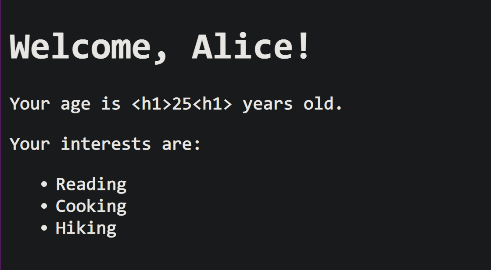
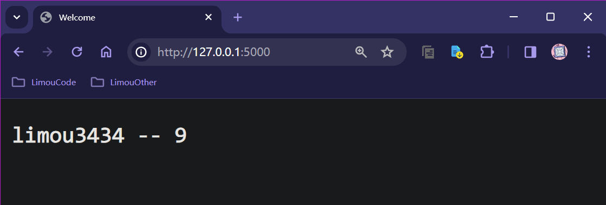
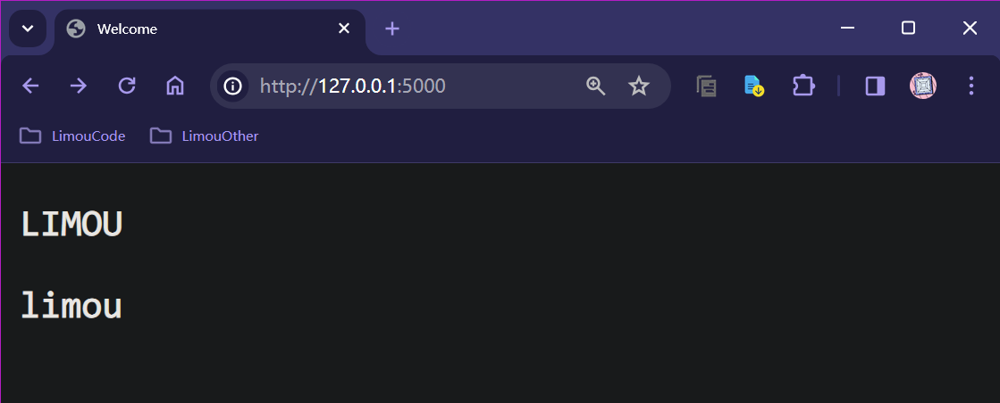
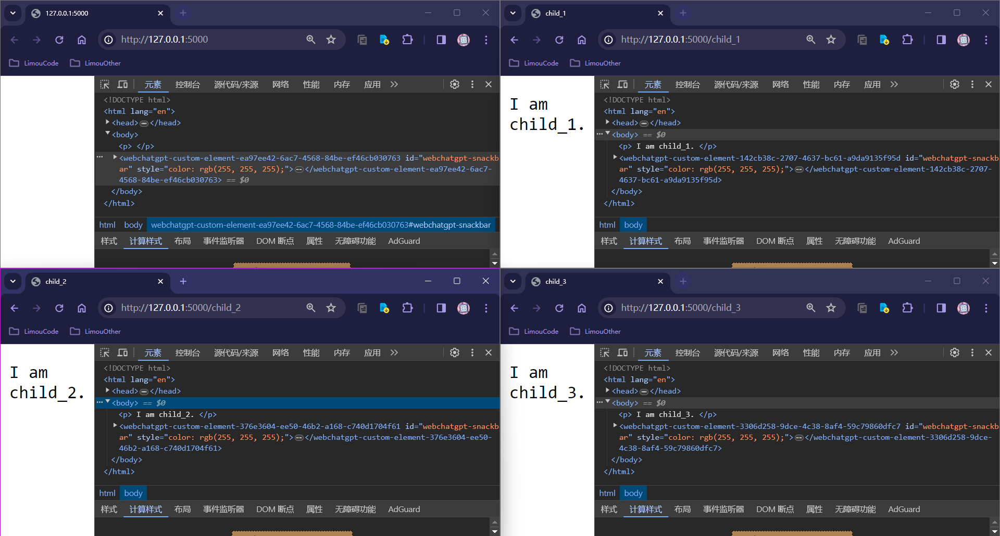

>   前要：`Jinja2` 是一个流行的 `Python` 模板引擎，用于生成动态的文本内容，通常用于 `Web` 开发中辅助生成 `HTML` 页面。
>
>   `Jinja2` 与 `Flask` 之间有着密切的关系，因为 `Flask` 框架默认使用 `Jinja2` 作为其模板引擎（两者也是同一个作者）。
>
>   并且安装 `Flask` 时就会自动安装 `Jinja2` 模块，无需您再次下载。

# 1.渲染完整的 HTML 页面

在之前的编码中 `render_template()` 实际上就是使用 `Jinja2` 模板引擎来渲染模板文件并生成 `HTML` 页面，参数给一个 `.html` 文件即可。

# 2.Jinja2 的基本语法形式

## 2.1.传递参数

```python
from flask import Flask, render_template

app = Flask(__name__)

@app.route('/')
def index():
    user_name = 'Alice'
    age = '<h1>25<h1>'
    interests = ['Reading', 'Cooking', 'Hiking']
    return render_template('index.html', name=user_name, age=age, interests=interests) # 使用 “参数名=参数值” 的形式传递

if __name__ == '__main__':
    app.run(debug=True)
```

```html
<!DOCTYPE html>
<html lang="en">
<head>
    <meta charset="UTF-8">
    <meta name="viewport" content="width=device-width, initial-scale=1.0">
    <title>Welcome</title>
</head>
<body>
    <h1>Welcome, {{ name }}!</h1>
    Your age is {{ age }} years old.
    <p>Your interests are:</p>

    <ul>
        <li>{{ interests[0] }}</li>
        <li>{{ interests[1] }}</li>
        <li>{{ interests[2] }}</li>
    </ul>

    <ul>
        
            <li>{{ interest }}</li>
        
    </ul>
</body>
</html>
```



可以看到，我们不仅仅使用 `render_template()` 渲染了一个完整的页面，还可以传递其他的参数交给 `HTML` 模板进行渲染（可以看到是通过类似 `{{ ... }}` 的模式进行获取的），这里我故意传递了一个 `<h1>` 标签，只是为了检验参数的传递是直接按照字符类型进行渲染的。

还可以在 `{{ ... }}` 中像使用 `python` 数组或字典一样来使用传递过来的参数。

>   补充：使用 `Jinja2` 模板引擎结合 `Flask` 的 `render_template()` 函数来传递参数到 `HTML` 文档的主要原因有以下几点：
>
>   1.  **模板渲染**：`Jinja2` 允许在 `HTML` 模板中嵌入动态内容，这样可以在服务器端通过 `Flask` 的 `render_template()` 函数将动态数据传递给模板，并最终生成渲染好的 `HTML` 页面，然后再返回给客户端浏览器。这种方式可以实现更灵活和动态的页面生成。对 `SEO` 和搜索引擎友好，搜索引擎可以直接解析服务器端渲染的 HTML 内容，有利于页面的搜索引擎优化（SEO）。
>   2.  **模板继承**：`Jinja2` 支持模板继承，可以创建基础模板并在其他模板中扩展或覆盖它，这样可以提高页面代码的复用性和可维护性。
>   3.  **上下文处理**：`Jinja2` 允许在模板中使用上下文处理，比如循环、条件判断等，这样可以根据后端传递的数据动态生成页面内容，使页面更加丰富和交互性强。
>   4.  **防止 XSS 攻击**：使用 `Jinja2` 模板引擎可以有效防止跨站脚本攻击（`XSS`），因为 `Jinja2` 会自动对输出的内容进行转义，避免恶意脚本注入（这点您看看就行，不理解也没关系），这点适用于数据安全性要求较高的项目。
>
>   相比之下，直接使用 `return` 返回不同的数据，然后在客户端使用 `JavaScript` 的 `fetch().then()` 接受数据也是可行的，有优势，也存在一些限制和不足：
>
>   1.   **客户端渲染**：使用 `JavaScript` 在客户端接收数据并动态更新页面内容属于客户端渲染，这样的方式可能会增加客户端的工作量和页面加载时间，特别是在处理大量数据或复杂页面时可能影响性能。但是在客户端使用 `JavaScript` 处理数据并动态更新页面内容，也有可能会减轻服务器负担，提高页面响应速度。
>   2.   **SEO 和搜索引擎爬虫**：部分搜索引擎爬虫可能无法正确解析 `JavaScript` 渲染的内容，这可能会影响到页面的搜索引擎优化（`SEO`）。
>   3.   **可维护性和灵活性**：直接在客户端处理数据并更新页面可能会导致代码结构不够清晰和维护困难，尤其是对于复杂的页面结构和数据交互，使用服务器端模板渲染会更加方便和灵活。
>   4.   **前后端分离**：适用于前后端分离开发模式，提高了前端和后端的独立性和灵活性。
>   5.   **动态交互**：适用于需要频繁交互和异步加载数据的页面。
>
>   在本系列博文中，多用第一种传递方式。

不过可惜的是，`Jinja2` 不支持 `break` 和 `continue` 语句。

## 2.2.控制语句

并且，还可以看到 `Jinja2` 还具备一定的语法，这里我使用了一个 ` ... `  来实现遍历参数进行渲染的操作，这实际上就是 `Jinja2` 的控制语句。

相关的控制语句还有 `if` 语句，其形式为 `  `。

```python
from flask import Flask, render_template

app = Flask(__name__)

# 路由定义
@app.route('/')
def index():
    # data = 'limou'    
    # return render_template('index.html', data=data)
    return render_template('index.html')

if __name__ == '__main__':
    app.run(debug=True)
```

```html
<!DOCTYPE html>
<html lang="en">
<head>
  <meta charset="UTF-8">
  <meta name="viewport" content="width=device-width, initial-scale=1.0">
  <title>Conditional Statement Example</title>
</head>
<body>
  
    <p>Hello, {{ data }}!</p>
  
    <p>Welcome!</p>
  
</body>
</html>
```

>   吐槽：`Jinja2` 的控制语句还挺像命令行脚本的...

>   补充：这里可以看到，`Jinja2` 如果需要使用一个自定义的变量，就可以使用 `{{ ... }}`，如果是关键字则使用 ``

## 2.3.过滤器

使用 `render_template()` 传递给 `HTML` 页面后，还可以经过一道过滤器，类似 `Linux` 里的管道，也是使用管道操作符 `|` 来使用。

我们先来试试内置的一些管道命令：

```python
from flask import Flask, render_template

app = Flask(__name__)

@app.route('/')
def index():
    return render_template('index.html', data='limou3434')

if __name__ == '__main__':
    app.run(debug=True)
```

```html
<!DOCTYPE html>
<html lang="en">
<head>
    <meta charset="UTF-8">
    <meta name="viewport" content="width=device-width, initial-scale=1.0">
    <title>Welcome</title>
</head>
<body>
    <p>{{ data }} -- {{ data | length }}</p>
</body>
</html>
```



>   补充：其他的内置过滤器您可以直接查看 [Jinja2 的内置过滤器清单](https://docs.jinkan.org/docs/jinja2/templates.html#builtin-filters)，这里就不再补充...

那么我们能不能自己定义一个过滤器呢？可以，只需要使用 `@app.template_filter('过滤器名称') ...` 装饰器或者 `app.template_filter('过滤器名称', 回调方法)` 方法就可以把函数注册为 `Jinja2` 能使用的过滤器，直接看代码吧。

>   补充：过滤器的名称也可以不传入，这样将默认过滤器的名字为回调函数的函数名。

```python
from flask import Flask, render_template

app = Flask(__name__)

# 1.使用 @app.template_filter()
@app.template_filter('upper_custom_filter')
def upper_custom_filter(value):
    return value.upper() # 在这里编写您的过滤器逻辑，例如将字符串转换为大写

# 2.或者使用 app.template_filter() 方法
def lower_custom_filter(value): # 先定义一个调用函数
    return value.lower() # 这里是过滤器的具体逻辑，例如将字符串转换为小写

app.template_filter('lower_custom_filter')(lower_custom_filter)
# app.add_template_filter(lower_custom_filter, 'lower_custom_filter') 也可以

# 路由定义
@app.route('/')
def index():
    data = 'limou'    
    return render_template('index.html', data=data)

if __name__ == '__main__':
    app.run(debug=True)
```

```html
<!DOCTYPE html>
<html lang="en">
<head>
    <meta charset="UTF-8">
    <meta name="viewport" content="width=device-width, initial-scale=1.0">
    <title>Welcome</title>
</head>
<body>
    <p>{{ data | upper_custom_filter }}</p>
    <p>{{ data | upper_custom_filter | lower_custom_filter }}</p>
</body>
</html>
```



>   补充：为什么不直接在后端中处理完数据再返回，而是选择使用过滤器么？
>
>   `Jinja2` 中的过滤器语法是为了方便在模板中对数据进行处理和格式化。尽管可以在后端处理完数据后再返回给前端，但在实际开发中，经常会遇到需要在模板中对数据进行一些简单的处理或格式化的情况，这时候使用过滤器语法就显得非常方便和直观（但是实际上也是后端程序在执行这个代码，只是为了方便和直观）。
>
>   以下是几个使用过滤器语法的场景和优点：
>
>   1.  **数据格式化**：过滤器可以帮助将数据以特定的格式显示，比如日期格式化、数值格式化等。
>   2.  **数据截断**：可以通过过滤器截断过长的字符串，使其在页面上显示更加美观。
>   3.  **数据转换**：可以将数据转换为特定的类型或格式，比如将字符串转换为大写或小写、将数字格式化为货币形式等。
>   4.  **数据过滤**：可以使用过滤器来过滤数据，只显示符合条件的数据。
>   5.  **数据排序**：可以对列表或字典等数据进行排序，并在模板中以指定的顺序显示数据。
>   6.  **数据处理**：可以进行简单的数据处理操作，比如求和、求平均值等。
>
>   通过在模板中使用过滤器语法，可以使模板更加灵活和可复用，降低后端处理数据的复杂度，同时也提高了模板的可读性和维护性。因此，`Jinja2` 提供过滤器语法是为了让模板更加强大、灵活和易用。

## 2.4.模板继承

大部分网站的骨架是类似的，完全没有必要让前端工程师多次编写相似的 `HTML` 文件，可以考虑让一个基本网页文件继承到多份子文件。当然，这种情况只适用于页面重复性高的情况，如果网站较小，就完全没有必要这么做。

先编写一个后端程序：

```python
from flask import Flask, render_template

app = Flask(__name__)

# 路由定义
@app.route('/')
def father():
    return render_template('father.html')

@app.route('/child_1')
def child_1():
    return render_template('child_1.html')

@app.route('/child_2')
def child_2():
    return render_template('child_2.html')

@app.route('/child_3')
def child_3():
    return render_template('child_3.html')

if __name__ == '__main__':
    app.run(debug=True)
```

在 `templates` 文件夹中制作一个 `father.html` 作为父模板。

```html
<!DOCTYPE html>
<html lang="en">
<head>
    <meta charset="UTF-8">
    <meta name="viewport" content="width=device-width, initial-scale=1.0">
    <title> </title>
</head>
<body>
    <p> </p>
</body>
</html>
```

然后和父模版同级下写三个子模板。

```jinja2



child_1



I am child_1.

```

```jinja2



child_2



I am child_2.

```

```jinja2



child_3



I am child_3.

```

运行程序后，就可以访问到三个不同但相似的子文件，但我们却没有真的编写三个子文件。


