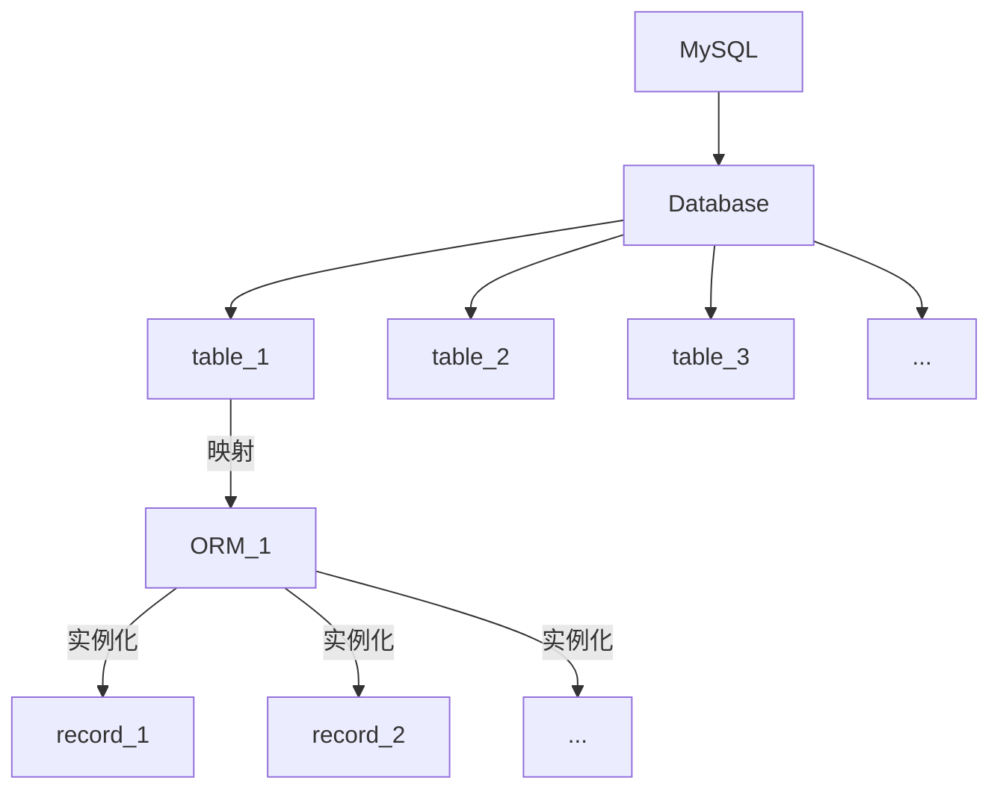

>   前要：关于 `MySQL` 的基础命令行使用，其相关的学习资料我在前面已经指出，这里我不再提及数据库安装和数据库操作的问题，默认您看到这里时，已经看过我给的 `MySQL` 资料并且对数据库有一定的操作实践了...当然，您可以尝试看下去，因为本篇对于 `MySQL` 的原生命令行操作比较少，而是使用 `ORM` 框架来操作数据库。

# 1.Flask 连接数据库

连接数据库就需要安装有关 `Python` 操作 `MySQL` 的数据库驱动模块，这里我推荐两款模块（`2024-3-27`）：

-   `MySQL` 官方 `mysql-connector-python`，有专门的团队进行更新，如果需要使用最新的 `MySQL` 功能，可以选择
-   纯 `Python` 编写的 `pymysql`，虽然效率稍微低了些，但是基本是无缝衔接 `Python` 的编码过程
-   纯 `C` 编写的 `mysqlclient`，执行效率高，但却是第三方模块，在 `Linux` 下部署会相对容易

>   注意：`MySQL-python` 已被 `python3` 淘汰，`python3` 已不支持使用该模块，但是该模块的另外一个分支模块 `mysqlclient`，是由以往的习惯使用 `MySQL-python` 的开发者维护的第三方模块, `python3` 支持使用该模块（该模块是纯 `C` 项目，因此执行效率比较高，但是安装很容易出错，这点不太友好）。

综合考虑，我决定使用 `pymysql` 较为稳妥（单纯只是易安装，并且对于小项目来说也够用了）。当然，您完全可以在您的程序中封装一个软件层，主程序中使用这个封装的接口，封装内部调用驱动模块的函数。这样就实现了软件设计上的一种解耦，后续替换驱动模块也会比较容易。

使用下面的命令行指令安装 `pymysql` 驱动模块：

```python
pip install pymysql
```

# 2.ORM 技术简化 SQL 操作

**ORM(Object Relational Mapping)，即“对象关系映射”**，这是一种常见的编程技术，它主要用来在面向对象的编程语言和关系数据库之间建立一座桥梁。

其核心功能是将编程语言中的 **类和对象** 与数据库中的 **表和记录** 之间建立起一种 **映射关系**。程序员可以用面向对象的方式来操作数据库，而无需编写复杂的 `SQL` 语句。可以简化数据库操作，提高开发效率，让代码更易于维护。

`ORM` 框架通常会提供一些基本的功能，包括但不限于：

- **类的映射**：将程序中的数据模型（通常是类）映射到数据库的表结构。
- **可持久化**：将内存中的对象保存到数据库中，或者从数据库中读取数据并转换为对象。
- **对象抽象**：允许使用面向对象的方式构建数据库查询，而不是直接编写 `SQL` 语句，可以很快更换不同的数据库，而无需修改对数据库的操作。
- **事务管理**：提供事务控制的功能，确保数据的一致性和完整性。
- **安全性高**：无需担心 `SQL` 注入的问题，这方面具有安全性，减低开发成本

在 `Flask` 中，一般不会直接使用原生的 `SQL` 语句，我也不推荐您这么做，更多是使用 `sqlalchemy` 中提供的 `ORM` 技术，可以和使用 `python` 对象一样实现对数据库的增删查改。

而 `Flask` 的内部又把 `sqlalchemy` 封装为 `flask-sqlalchemy`，而由于不是所有 `Flask` 都需要数据库，因此这个模块需要您自己安装。

```python
pip install flask-sqlalchemy
```

>   补充：由于 `flask-sqlalchemy` 是 `sqlalchemy` 的封装，因此安装的同时也会安装 `sqlalchemy`。

## 2.1.连接数据库

我们先来尝试连接一下，至于具体的操作细节我在代码中有给出注释，您简单看一下即可：

```python
from flask import Flask, render_template
from flask_sqlalchemy import SQLAlchemy
from sqlalchemy import text
import os

# 通过当前文件名创建 Flask 对象
app = Flask(__name__)

# 配置 app.config 内连接数据库的信息
app.config['SQLALCHEMY_DATABASE_URI'] = (
    f"mysql+pymysql://"
    f"{os.getenv('EIMOU_DATABASE_USER')}:{os.getenv('EIMOU_DATABASE_PASSWORD')}@"
    f"{os.getenv('EIMOU_DATABASE_HOST')}:3306/{os.getenv('EIMOU_DATABASE_NAME')}"
    "?charset=utf8mb4"
)

# 通过 Flask 对象创建 SQLAlchemy 对象
db = SQLAlchemy(app)

# 对 SQLAlchemy 对象进行 SQL 操作
with app.app_context(): # 第一个 with 语句结束时，应用上下文将被销毁，这意味着应用程序的状态将恢复到原始状态
    with db.engine.connect() as conn: # 第二个 with 语句则用于确保在执行完数据库操作后，连接对象 conn 会被正确关闭和释放，避免资源泄漏。其中 db.engine.connect() 和数据库建立了连接
        rs = conn.execute(text("select 1+1")) # conn.execute() 用于执行数据库操作，它接受一个 SQL 语句作为参数，而 text() 可以将字符串转换为 SQL 表达式对象
        print(rs.fetchone()) # 由于 rs 是一个查询结果对象，它包含了执行 SQL 查询后返回的结果集，使用 fetchone() 就可以从结果集中获取一行数据

# 路由和视图函数的定义
@app.route('/')
def index():
    return 'I am a test...'

if __name__ == '__main__':
    app.run(debug=True) # 启动 Web 后端服务
```

这里提一嘴，在使用 `Flask-SQLAlchemy` 进行数据库操作时，通常情况下是需要使用应用上下文（`Application Context`）的，这是因为 `Flask-SQLAlchemy` 依赖于 `Flask` 的应用上下文来管理数据库连接和事务。

## 2.2.操作数据表

首先您需要明白，具有可以映射到数据表能力的 `python` 类我们称为一个 `ORM` 模型，一个 `ORM` 模型和一个数据库中的表进行对应，模型的类属性分别对应表的每一个字段，模型的每个实例对象对应表中的记录。

>   吐槽：而实际上，所谓的 `ORM` 模型，就是一个继承过来的子类，每个子类就是对一张数据表的描述。



我们来尝试在内存中创建一个“数据表/`ORM` 模型”，并且和数据库上的数据表进行同步（没有对应的数据表就进行创建），然后进行 `SQL` 语句中常用的 `CRUD(增删查改)` 操作。

```python
# ORM 的 CRUD 操作
from flask import Flask
from flask_sqlalchemy import SQLAlchemy
import os

# 通过当前文件名创建 Flask 对象
app = Flask(__name__)

# 配置 app.config 内连接数据库的信息
app.config['SQLALCHEMY_DATABASE_URI'] = (
    f"mysql+pymysql://"
    f"{os.getenv('EIMOU_DATABASE_USER')}:{os.getenv('EIMOU_DATABASE_PASSWORD')}@"
    f"{os.getenv('EIMOU_DATABASE_HOST')}:3306/{os.getenv('EIMOU_DATABASE_NAME')}"
    "?charset=utf8mb4"
)

# 通过 Flask 对象创建 SQLAlchemy 对象
db = SQLAlchemy(app)

# 创建模板
class User(db.Model):
    __tablename__ = "user" # 设置数据库的名字
    id = db.Column(db.Integer, primary_key=True, autoincrement=True) # id 字段，必须使用方法来设置类属性，否者无法映射到数据表的字段，只能是一个普通的类属性
    username = db.Column(db.String(100), nullable=False) # 用户名字段
    password = db.Column(db.String(100), nullable=False) # 用户密码字段

# 同步创建
with app.app_context():
    # (1)检查模型：create_all() 会检查 SQLAlchemy ORM 模型以确定哪些表需要被创建
    # (2)创建缺失表：对于每个需要创建的表，create_all() 会在数据库中生成相应的 SQL 语句来创建该表
    db.create_all() # 同步数据库
    
# 路由和视图函数的定义
@app.route('/')
def index():
    return 'Switch paths to operate databases...'

# 添加记录
@app.route('/add/<string:username>/<string:password>')
def add_user(username, password):
    user = User(username=username, password=password)
    db.session.add(user)
    db.session.commit() # 这里的提交和 MySQL 的事务有关，这里不过多解释，您学了 MySQL 事务就明白为什么需要提交
    return "Add succeed!"

# 查询记录（主键查询）
@app.route('/primary_key_query/<int:id>')
def primary_key_query_user(id):
    a_user = User.query.get(id) # User.query 是继承来的类属性，get() 则是根据主键查找，返回的结果就是 User 对象，可以当作字典来使用
    return f"Query succeed: {a_user.id}-{a_user.username}-{a_user.password}!"

# 查询记录（子句查询）
@app.route('/query/<string:name>')
def query_user(name):
    user_array = User.query.filter_by(username=name) # User.query 是继承来的类属性，get() 则是根据主键查找，但是返回的是一个 Query 对象，相当于一个对象数组，可以做切片操作
    all = {}
    for a_user in user_array:
        all[a_user.username] = a_user.password
    return f"Query succeed: {all}!"

# 修改记录
@app.route('/updata/<string:name>/<string:password>')
def updata(name, password):
    a_user = User.query.filter_by(username=name).first() # 也可以使用 a_user = User.query.filter_by(username=name)[0] 但是记录不存在时会发生报错
    a_user.password = password
    db.session.commit()
    return f"Updata succeed!"

# 删除记录
@app.route('/delete/<int:id>')
def delete(id):
    user = User.query.get(id)
    db.session.delete(user)
    db.session.commit()
    return "Delete succeed!"

# 启动 Web 后端服务
if __name__ == '__main__':
    app.run(debug=True)
```

那最重要的外键怎么做到呢（这是关系数据库最重要的功能之一）？可以通过 `SQLAlchemy` 对象的 `ForeignKey('外表.外键字段')` 来实现。

```python
from flask import Flask
from flask_sqlalchemy import SQLAlchemy
import os

# 通过当前文件名创建 Flask 对象
app = Flask(__name__)

# 配置 app.config 内连接数据库的信息
app.config['SQLALCHEMY_DATABASE_URI'] = (
    f"mysql+pymysql://"
    f"{os.getenv('EIMOU_DATABASE_USER')}:{os.getenv('EIMOU_DATABASE_PASSWORD')}@"
    f"{os.getenv('EIMOU_DATABASE_HOST')}:3306/{os.getenv('EIMOU_DATABASE_NAME')}"
    "?charset=utf8mb4"
)

# 通过 Flask 对象创建 SQLAlchemy 对象
db = SQLAlchemy(app)

# 创建模板
class User(db.Model):
    __tablename__ = "user"
    id = db.Column(db.Integer, primary_key=True, autoincrement=True) # id
    username = db.Column(db.String(100), nullable=False) # 用户名字段
    password = db.Column(db.String(100), nullable=False) # 用户密码字段

class Article(db.Model):
    __tablename__ = "article"
    id = db.Column(db.Integer, primary_key=True, autoincrement=True) # id
    title = db.Column(db.String(100), nullable=False)
    content = db.Column(db.Text, nullable=False)
    author_id = db.Column(db.Integer, db.ForeignKey('user.id'))
    author = db.relationship('User', backref='art') # 反向给 User 添加 art 引用

# 同步创建
with app.app_context():
    # (1)检查模型：create_all() 会检查 SQLAlchemy ORM 模型以确定哪些表需要被创建
    # (2)创建缺失表：对于每个需要创建的表，create_all() 会在数据库中生成相应的 SQL 语句来创建该表
    db.create_all() # 同步数据库
    
# 路由和视图函数的定义
@app.route('/')
def index():
    return 'Switch paths to operate databases...'

# 添加记录
@app.route('/add/<string:username>/<string:password>')
def add_user(username, password):
    user = User(username=username, password=password)
    db.session.add(user)
    db.session.commit() # 这里的提交和 MySQL 的事务有关，这里不过多解释，您学了 MySQL 事务就明白为什么需要提交
    return "Add succeed!"

# 查询记录（主键查询）
@app.route('/primary_key_query/<int:id>')
def primary_key_query_user(id):
    a_user = User.query.get(id) # User.query 是继承来的类属性，get() 则是根据主键查找，返回的结果就是 User 对象，可以当作字典来使用
    return f"Query succeed: {a_user.id}-{a_user.username}-{a_user.password}!"

# 查询记录（子句查询）
@app.route('/query/<string:name>')
def query_user(name):
    user_array = User.query.filter_by(username=name) # User.query 是继承来的类属性，get() 则是根据主键查找，但是返回的是一个 Query 对象，相当于一个对象数组，可以做切片操作
    all = {}
    for a_user in user_array:
        all[a_user.username] = a_user.password
    return f"Query succeed: {all}!"

# 修改记录
@app.route('/updata/<string:name>/<string:password>')
def updata(name, password):
    a_user = User.query.filter_by(username=name).first() # 也可以使用 a_user = User.query.filter_by(username=name)[0] 但是记录不存在时会发生报错
    a_user.password = password
    db.session.commit()
    return f"Updata succeed!"

# 删除记录
@app.route('/delete/<int:id>')
def delete(id):
    user = User.query.get(id)
    db.session.delete(user)
    db.session.commit()
    return "Delete succeed!"

# 设置外表
@app.route('/set')
def set():
    article = Article(title='myblog', content='I learned a little about python...', author_id=5)
    db.session.add(article)
    db.session.commit() # 这里的提交和 MySQL 的事务有关，这里不过多解释，您学了 MySQL 事务就明白为什么需要提交
    return f"Set succeed!"

# 启动 Web 后端服务
if __name__ == '__main__':
    app.run(debug=True)
```

>   补充：还有一种方法，可以在绑定外键后，直接通过属性来访问外键，就是使用 `SQLAlchemy` 类的 `relationship('外表')`。这个方法返回的对象作为属性时，在类外使用对象访问这个属性，就可以找到外键对应的值。
>
>   这个函数还有一个 `backref='属性'` 参数，会反向给外表添加一个属性，方便外表进行关联查询本表，该属性如果被外表的实例化拿到，就是一个可迭代对象（或者叫对象数组），每一个对象都是外表的一个记录，每一个记录都是被本表关联的记录。
>
>   此外还有一些关于级联的操作，您可以去查询一番。

这里还有一点要重新说明一下，同步模型和数据库时，使用的 `db.create_all()` 是具有局限性的。如果您感觉类的设计不够好，需要修改字段时，就无法识别到修改。

因此我们基本不会使用这个函数，最好是使用模块 `flask-migrate` 的（使用 `pip install flask-migrate` 下载）。

然后在代码中创建 `Migrate` 对象，即 `migrate = Migrate(app, db)`。

```python
from flask import Flask
from flask_sqlalchemy import SQLAlchemy
from flask_migrate import Migrate
import os

# 通过当前文件名创建 Flask 对象
app = Flask(__name__)

# 配置 app.config 内连接数据库的信息
app.config['SQLALCHEMY_DATABASE_URI'] = (
    f"mysql+pymysql://"
    f"{os.getenv('EIMOU_DATABASE_USER')}:{os.getenv('EIMOU_DATABASE_PASSWORD')}@"
    f"{os.getenv('EIMOU_DATABASE_HOST')}:3306/{os.getenv('EIMOU_DATABASE_NAME')}"
    "?charset=utf8mb4"
)

# 通过 Flask 对象创建 SQLAlchemy 对象
db = SQLAlchemy(app)

# 创建迁移对象
migrate = Migrate(app, db)

# 创建模板
class User(db.Model):
    __tablename__ = "user"
    id = db.Column(db.Integer, primary_key=True, autoincrement=True) # id
    username = db.Column(db.String(100), nullable=False) # 用户名字段
    password = db.Column(db.String(100), nullable=False) # 用户密码字段
    email = db.Column(db.String(100)) # 新增的字段，再做后面命令行操作
    # signature = db.Column(db.String(100)) # 再次新增的字段，再做后面命令行操作
    # age = db.Column(db.Integer) # 再再次新增的字段，再做后面命令行操作

# # 同步创建（不要用这个方式）
# with app.app_context():
#     # (1)检查模型：create_all() 会检查 SQLAlchemy ORM 模型以确定哪些表需要被创建
#     # (2)创建缺失表：对于每个需要创建的表，create_all() 会在数据库中生成相应的 SQL 语句来创建该表
#     db.create_all() # 同步数据库
    
# 路由和视图函数的定义
# ...
    
# 启动 Web 后端服务
if __name__ == '__main__':
    app.run(debug=True)
```

然后类似 `git` 三板斧一样在命令行中使用 `Migrate` 的三个指令：

-   `flask db init`：就会生成相关的 `migrations` 配置文件夹，这一步只需要执行一次

-   `flask db migrate`：识别 `ORM` 模型的改动，生成迁移脚本，`migrations` 文件夹内开始有内容，这一命令可以重复执行

-   `flask db upgrade`：运行迁移脚本，同步到数据库中，此时数据库就会出现一个新的表

    ```shell
    # 新增的 table
    mysql> desc alembic_version;
    +-------------+-------------+------+-----+---------+-------+
    | Field       | Type        | Null | Key | Default | Extra |
    +-------------+-------------+------+-----+---------+-------+
    | version_num | varchar(32) | NO   | PRI | NULL    |       |
    +-------------+-------------+------+-----+---------+-------+
    1 row in set (0.00 sec)
    
    mysql> select * from alembic_version;
    +--------------+
    | version_num  |
    +--------------+
    | fc00c9773dae | # 这里的数值就是脚本名
    +--------------+
    1 row in set (0.02 sec)
    ```

    同时可以观察到，模板对应的数据表结构发送了改变。并且每次执行 `flask db migrate、flask db upgrade` 的时候 `version_num` 下的数值就会进行更新。

>   注意：这个命令必须是和 `app.py` 同级目录下执行，这点也类似 `git`，既然很像 `git`，也一定要注意以下数据迁移的安全性，尽管这些脚本文件是可溯源的！


