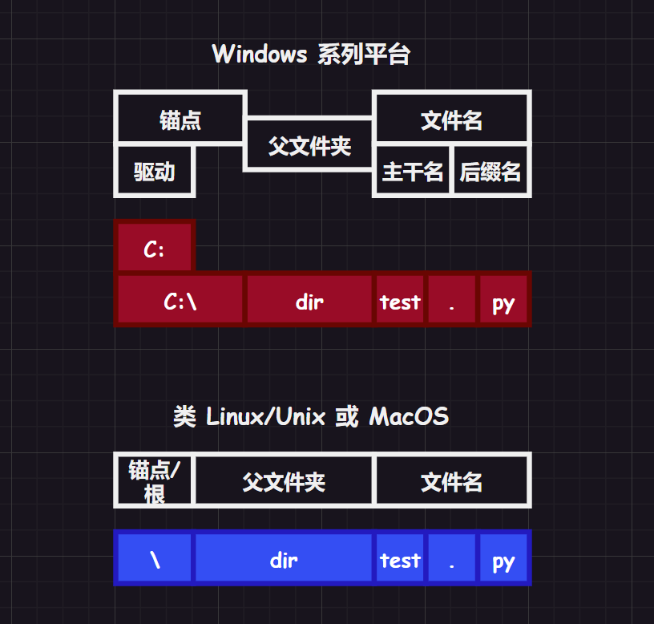

# 1.数据类型

`python` 中有三种基本数据类型，分别是整数、浮点数、字符串，不同的数据类型可以创建不同的变量。

## 1.1.整数

整数值，待补充...

## 1.2.浮点数

浮点小数，待补充...

## 1.3.字符串

`python` 的字符操作非常方便和多样，是值得重点学习的部分，`python` 的字符冲一般使用 `''`、`""` 框起。

## 1.5.变量作用域

使用关键字 `global` 可以告知 `python` 这是一个全局变量（注意不是创建），后面提及函数的时候还会再提及这个关键字的作用。

# 2.数据转化

使用 `str()`、`int()`、`float()` 来进行转化，需要注意转化的合理性。

# 3.操作符

| 操作符 | 操作说明 | 例子                                                  |
| ------ | -------- | ----------------------------------------------------- |
| `+`    | 加法     | `2+3 = 5`                                             |
| `-`    | 减法     | `2-3 = -1`                                            |
| `*`    | 乘法     | `2*3 = 6`                                             |
| `/`    | 除法     | `18/4 = 2`                                            |
| `**`   | 指数     | `2**3 = 8`                                            |
| `%`    | 取模     | `22%8 = 6`                                            |
| `==`   | 判等     | `42 == 42.0`（注意这两者是相等的，返回结果为 `True`） |

# 4.注释

`python` 的注释只要有三种：一种行级注释、两种块级注释

```python
# 三种注释
# 行级注释，可以注释一行

'''
块级
注释 1
'''

"""
块
级
注
释
2
"""
```

# 5.控制流

和 `Java` 类似，`pyhton` 的控制流依靠布尔语句来控制，并且也有常见的比较操作符：`>`、`<`、`==`、`!=`、`>=`、`<=`。同时，`python` 还有两个和 `C` 语言的 `&&`、`||`、`!` 类似的布尔操作符：`and`、`or`、`not`。

结合布尔值、比较操作符、布尔操作符可以创建出多种布尔表达式，这些表达式通常用于控制程序的执行流...

## 5.1.条件语句

```python
# 使用 if 语句
if 条件1(布尔语句1):
    # 某些需要被执行的代码 1
elif 条件2(布尔语句2):
    # 某些需要被执行的代码 2
else:
    # 某些需要被执行的代码 3
```

## 5.2.循环语句

```python
# 使用 while 语句
while 条件(布尔语句):
    # 某些需要被执行的代码块
```

```python
# 使用 for 语句
for 循环变量 in range(start, end, step): # [start, end)
    # 某些需要被执行的代码块    
```

>   补充：循环语句都可以使用 `break`、`continue` 语句。

# 6.函数

## 6.1.导入模块和包

使用函数之前，先学会使用导入模块，这和 `C/C++` 导入头文件、`Java` 导入包是类似的，尽管某些细节有些许不同...

`Python` 中的任何 `.py` 文件都可以称为一个 **模块**（`module`），模块可以用来组织函数和类等，在其他程序中引入这些模块中的功能，有利于代码的管理与复用。

```python
# 导入模块的语法格式
import 模块1名称, 模块2名称, 模块3名称
模块1名称.模块1内函数名称()

import 模块4名称 as 模块名称缩写


form 模块名称5 import 模块5内函数名称
模块5内函数名称()
```

而在 `python` 中用于管理模块文件的文件夹叫做 **包**（`package`），一个文件夹要成为一个包，需要包含一个名为 `__init__.py` 的文件，该文件可以为空，作为该文件夹为包的标识。

待补充...

## 6.2.定义函数

```python
# 定义函数的语法形式
def functionName(变元1, 变元2, 变元3=缺省值):
    """函数说明"""
    # 某些代码块
    return 返回值/[return None]
    
functionName(参数1, 参数2) # 函数调用
functionName(变元2=参数2, 变元1=参数1) # 函数调用
```

对于无返回值的函数，默认返回 `None`（并且是隐式返回）。

调用栈，待补充...

注意函数和全局变量的结合使用：

```python
# 全局变量结合函数的使用
def function(num):
    global number # 3.告知 python 该变量为全局变量
    print(number) # 4.打印 10
    number = 0 # 5.修改全局变量为 0
    print(number) # 6.打印为 0

number = 10 # 1.number 的初始值
print(number) # 2.打印 10
function(number)
print(number) # 7.经过 function() 的修改，打印 0

""" 输出结果
10
10
0
0
"""
```

## 6.3.输出输出函数

### 6.3.1.input()


### 6.3.2.Print()

-   参数 `end` 可以替换待输出字符串的最末尾有效字符（默认为换行字符）

-   参数 `sep` 可以替换待输出字符串们的分割字符（默认为空格字符）

# 7.字符串

## 7.1.字符串操作

### 7.1.1.字符串连接

使用 `+=` 操作符可以将两个字符串连接起来，前后操作数均为字符串。

```python
# 字符串连接
str1 = 'limou'
str2 = '3434'
str1 += str2
print(str1)

""" 输出结果
limou3434
"""
```

### 7.1.2.字符串复制

使用 `*=` 可以复制字符串，左操作数为字符串，右

```python
# 字符串复制
str = 'limou3434'
str *= 3
print(str)

""" 输出结果
limou3434limou3434limou3434
"""
```

### 7.1.3.字符串大小

获取字符串的大小可以使用 `len()`。

### 7.1.4.字符串获取

1.   获取单个字符

     ```python
     # 字符串获取（获取字符）
     str = 'limou3434'
     print(str[2])
     
     """ 输出结果
     m
     """
     ```

2.   获取子字符串

     (1)`find()/rfind()`：没查找到则返回 `-1`

     (2)`index(查找子串 sub, start, end)`：没查找到则抛出异常

     ```python
     # 字符串获取（获取字符串）
     str = 'limou3434'
     print(str.find('3434', 0)) # 从 0 下标开始寻找子串 '3434'
     print(str.find('3434', len(str)-2)) # 从 7 下标开始寻找子串 '3434'
     print(str.rindex('mou', 1, 5)) # 从下标 1 到 5 开始寻找子串 'mou'
     
     """ 输出结果
     5
     -1
     2
     """
     ```

## 7.2.正则表达式

# 8.标准容器

## 8.1.列表

## 8.2.集合

## 8.3.元组

## 8.4.字典

## 8.4.字节数组


# 9.文件

## 9.1.普通文件操作

### 9.1.1.文件路径

文件的路径实际上是一件很困扰的时间（各种平台有时候规则不一样，有时候还需要考虑字符转义的问题），因此我直接推荐使用模块 `pathlib`，当然，如果您不介意的话，可以使用 `os.path` 做较为低级的路径操作...

>   文档：https://docs.python.org/3/library/pathlib.html#module-pathlib
>
>   源代码：https://github.com/python/cpython/blob/3.12/Lib/pathlib.py

#### 9.1.1.1.路径对象

在 `pathlib` 的文档中有这样一张类继承图片，让我来为您细细介绍该继承图：


- **Path(具体路径类)**：是 `pathlib` 中的具体路径类，它继承自 `PurePath`。`Path` 类除了能够执行纯路径的抽象操作外，还能够进行与文件系统交互的实际文件和目录操作，比如创建文件、删除文件、读取文件内容等。

  ```python
  """使用具体路径类"""
  from pathlib import Path
  
  concrete_path = Path("some/path/file.txt")
  concrete_path.touch()  # 在文件系统中创建文件
  print("File Exists:", concrete_path.exists())
  ```

- **PurePath(纯路径类)**：主要用于对路径字符串本身进行抽象的操作，比如：连接路径的不同部分、提取路径的各个部分等。是对路径的纯粹抽象，不牵涉到实际的文件或目录

  ```python
  """使用纯路径类"""
  from pathlib import PurePath
  
  pure_path = PurePath("some/path")
  print("Pure Path Parts:", pure_path.parts)
  ```

  所以，当你只需要对路径进行抽象的操作时，使用 `PurePath` 足够了。但如果你需要进行实际的文件系统操作，就应该使用 `Path`，在本系列文章中，更多使用 `Path` 类。

- **PosixPath** 和 **WindowsPath** 这两个类分别是 `Path` 的子类，用于提供特定于操作系统的行为。`PosixPath` 用于类 `Unix` 操作系统，而 `WindowsPath` 用于 `Windows` 操作系统。通常你可以直接使用 `Path`，`pathlib` 会根据你的操作系统选择适当的子类。

- **PurePosixPath** 和 **PureWindowsPath**：类似于 `PosixPath` 和 `WindowsPath`，这两个类是 `PurePath` 的子类，提供了特定于操作系统的路径抽象。

#### 9.1.1.2.纯路径对象操作

可以通过 `PurePath` 对象来拼接目录形成字符串，并且在不同平台下生成对应的字符串，考虑分别在 `Windows11` 和 `Centos7` 下运行以下代码：

```python
"""拼接字符路径"""
import os
from pathlib import PurePath
from pathlib import PureWindowsPath
from pathlib import PurePosixPath

print("当前工作目录为:", os.getcwd())
print(PurePath( 'FatherDir', 'SonDir', 'setup.py'))
print(PureWindowsPath( 'FatherDir', 'SonDir', 'setup.py'))
print(PurePosixPath( 'FatherDir', 'SonDir', 'setup.py'))
```

在 `Windows11` 下运行结果为：

```cmd
# Windows11 下运行结果
> python pathTest.py
当前工作目录为: C:\Users\Limou_p350ml9\Desktop\Test
fatherDir\sonDir\setup.py
fatherDir\sonDir\setup.py
fatherDir/sonDir/setup.py
```

在 `Centos7` 下运行结果为：

```bash
# Centos7 下运行结果
$ python3 pathTest.py
当前工作目录为: /home/ljp/LimouGitFile/limou-c-test-code/2024归档/my_code_2024_1_24
FatherDir/SonDir/setup.py
FatherDir\SonDir\setup.py
FatherDir/SonDir/setup.py
```

因此一般我们都是使用 `PurePath` 对象让 `pathlib` 在不同平台下自动转化为适应不同平台的路径字符串，只有在某些特定的场合下才会使用另外两个子类...

>   注意：后续代码为避免不必要的混乱，我只在 `Windows11` 下运行关于 `PurePath` 对象的代码，关于在 `Centos7` 或者其他平台下的运行结果大同小异，只不过格式不太一样，您可以自己验证一下...

>   补充：如果使用没有任何参数的 `PurePath()`，则会返回指向当前目录的 `.` 符号。

对于这三个类，都可以用以下方法构成一个 `PurePath` 对象：

1.   可以传入字符串，并用逗号进行连接
2.   也可以采用传入 `Path` 对象来连接（甚至部分 `Path` 对象，部分字符串，关于 `Path` 对象的创建我们后面提及）
3.   或者直接传入我们在代码文件所处文件获取到的路径字符串作为参数，`pathlib` 会自动做转化处理（关于这些处理您可以前去文档看看，我不再阐述细节）

```python
"""多种形成 PurePath 对象的方法"""
import os
from pathlib import PurePath
from pathlib import Path

# 创建路径字符串
print("当前工作目录为:", os.getcwd())

print(PurePath( 'FatherDir', 'SonDir', 'setup.py' )) # 传入多个字符串进行拼接
print(PurePath( Path('FatherDir'), Path('SonDir'), Path('setup.py') )) # 传入多个 Path 对象进行拼接
print(PurePath( Path('FatherDir'), 'FatherDir', 'SonDir', 'setup.py' )) # 传入部分 Path 对象和字符串对象
print(PurePath( os.getcwd() )) # 传入从本平台获取到的字符串
```

>   补充：文档在这里还提及了一个警告，如果 `foo` 是一个符号链接（例如 `Linux` 下的软链接），指向另一个目录，那么 `PurePosixPath('foo/../bar')` 的简化结果不应该简单地变成 `PurePosixPath('bar')`。这是因为符号链接可能引入了路径的实际结构，而简单地去除 `foo/../` 可能会导致错误的路径。

并且在某些平台下，文件路径是不区分大小写的（例如 `Windows11`，该平台对目录名和文件名的大小写并不敏感），也因此会影响到路径对象比较的结果（这点在排序路径字符串上就会明显体现出来）。

```python
"""路径的比较"""
from pathlib import PurePath
from pathlib import PureWindowsPath
from pathlib import PurePosixPath

print(PurePosixPath('foo') == PurePosixPath('FOO')) # 在一些类 Unix/Linux 平台下对大小写敏感 
print(PureWindowsPath('foo') == PureWindowsPath('FOO')) # 在 Windows 系列平台下，基本对大小写不敏感

print(PurePosixPath('FOO') in { PurePosixPath('foo') })
print(PureWindowsPath('FOO') in { PureWindowsPath('foo') })

print(PurePosixPath('C:') < PurePosixPath('d:'))
print(PureWindowsPath('C:') < PureWindowsPath('d:'))
```

除了可以对路径对象进行比较，还可以使用 `/` 操作符，该字符在任何支持的平台下均适用，可以用来连接两个 `PurePath` 对象，比直接使用 `PurePath()` 构造一个路径对象更加方便。

不过该运算符有一个使用前提，要求操作符的左操作数本身是一个 `PurePath` 对象，右操作数既可以是字符串，也可以是 `PurePath` 对象，最后的运算结果是一个 `PurePath` 对象。

```python
"""拼接路径对象"""
from pathlib import PurePath

p = PurePath('/home')
q = PurePath('limou')

print(p)
print(p / 'dimou' / 'test.py')
print(p / q)
```

该运算符在创建多个子路径的时候非常好用。

如果需要访问路径对象中路径字符串的各个部分，则可以使用 `PurePath.parts` 属性来获取各个部分组成的元组。

```python
# 获取路径的每个部分
import os
from pathlib import PurePath

p = PurePath(os.getcwd())
print(p.parts) # 得到元组 ('C:\\', 'Users', 'Limou_p350ml9', 'Desktop', 'Test')
```

另外，您最好了解一下不同平台对于路径字符串的不同部分的解释。



我们可以通过以下属性来获取这些部分（如果对应平台下没有某些部分，则对应属性的值为空字符串）：

-   `drive`：获取驱动
-   `root`：获取根
-   `anchor`：获取锚点
-   `parents`：获取父路径序列，可使用下标访问不同范围的父路径（在 `3.10` 版本中支持切片和负索引），也可以直接使用 `parent` 属性获得最小范围的父路径
-   `name`、`stem`、`suffixe`：获取文件名、获取主干名、获取最后一个后缀名
-   `suffixes`：获取后缀名列表（因为有的文件具有多个后缀名）

```python
"""获取路径的各个部分"""
from pathlib import PurePath
from pathlib import PureWindowsPath
from pathlib import PurePosixPath

# 获取驱动器
print("获取驱动器")
print(PureWindowsPath('c:/Program Files/').drive)
print(PureWindowsPath('//host/share/foo.txt').drive) # UNC 共享也被视为驱动器
print(PurePosixPath('/etc').drive)

# 获取根
print("获取根")
print(PureWindowsPath('c:/Program Files/').root)
print(PureWindowsPath('c:Program Files/').root)
print(PureWindowsPath('//host/share').root)
print(PurePosixPath('/etc').root) # UNC 共享始终有一个根

# 获取锚点
print("获取锚点")
print(PureWindowsPath('c:/Program Files/').anchor)
print(PureWindowsPath('c:Program Files/').anchor)
print(PurePosixPath('/etc').anchor)
print(PureWindowsPath('//host/share').anchor)

# 获取父路径
print("获取父路径")
p = PurePosixPath('/a/b/c/d').parent
print(p)
print(p.parents[0])
print(p.parents[1])
print(p.parents[2])

# 获取文件名
p = PurePosixPath('my/library/library.tar.gz')
print(p.name)
print(p.stem)
print(p.suffix)
print(p.suffixes)
```

上述就是关于纯路径对象的基本操作，下面来重点介绍一些关于纯路径对象的方法：

1.   `as_posix()`
2.   `as_uri()`
3.   `is_absolute()`
4.   `is_relative_to()`
5.   `is_reserved()`
6.   `joinpath(*pathsegments)`
7.   `match(pattern, *, case_sensitive=None)`
8.   `relative_to(other, walk_up=False)`
9.   `with_name(name)`
10.   `with_stem(stem)`
11.   `with_suffix(suffix)`
12.   `with_segments(*pathsegments)`

#### 9.1.1.3.具体路径对象操作


### 9.1.2.文件创建

### 9.1.3.文件属性

### 9.1.4.文件读写

### 9.1.5.文件组织

## 9.2.Excel 操作

>   文档：https://openpyxl.readthedocs.io/en/stable/tutorial.html#
>
>   源代码：https://foss.heptapod.net/openpyxl/openpyxl

### 9.2.1.工作簿对象和工作表对象

`openpyxl` 中有一个 `Workbook` 类，可以使用 `Workbook()` 创建工作簿对象（该对象内部默认包含一个名为 `sheet` 的工作表）。

在 `openpyxl` 中，“活动状态 `active`” 和 “非活动状态 `inactive`”，通常用来描述工作簿（`Workbook`）中的工作表（`Worksheet`）：

1. **活动状态（`Active`）：** 工作簿中的一个工作表被标记为活动工作表时，表示当前正在对该工作表进行操作或访问。可以通过 `workbook.active` 属性来获取该活动工作表。默认情况下，新创建的工作簿的第一个工作表就是是活动的。

   ```python
   """获取活动工作表"""
   from openpyxl import Workbook
   workbook = Workbook()
   active_sheet = workbook.active  # 获取活动工作表
   ```

2. **非活动状态（`Inactive`）：** 工作簿中的其他工作表，即不是当前正在操作或访问的工作表，被认为是非活动的。可以通过工作簿对象的 `Wookbook.worksheets` 属性来获取所有工作表列表，并通过索引来访问非活动工作表。

   ```python
   """获取非活动工作表"""
   from openpyxl import Workbook
   workbook = Workbook()
   inactive_sheet = workbook.worksheets[1]  # 获取第二个工作表（假设存在第二个工作表）
   ```

通常，活动状态和非活动状态在进行 `Excel` 文件的读取、写入和编辑操作时很重要。例如，如果您想往工作表中添加数据，你需要确保正在操作的是活动工作表。

而如果要切换到其他工作表，你可以 `create_sheet([表格名称])` 创建新的工作表，并且重新设置 `Workbook.active` 属性，或者直接通过 `Worksheets` 列表来选择。

另外，还可以使用 `Worksheet.title ` 属性来获取或修改现有工作表的名称。

```python
"""查看工作表并且修改指定活动工作表"""
from openpyxl import Workbook

# 创建工作簿对象并且查看默认的活动工作表
workbook = Workbook()
worksheet1 = workbook.active  # 获取默认的活动工作表
print(workbook.active) # 查看默认的活动工作表

# 创建另一些非活动工作表
worksheet2 = workbook.create_sheet('Sheet2')
worksheet3 = workbook.create_sheet('Sheet3')
worksheet4 = workbook.create_sheet('Sheet4')

# 将其他工作表设置为活动工作表
workbook.active = worksheet2 # 重新设置默认的活动工作表
print(workbook.active) # 查看此时设定的活动工作表

# 获取所有工作表的名称
for sheet_name in workbook.sheetnames:
    print(sheet_name)

# 修改某个工作表的名称
print(worksheet1) # 改名前
worksheet1.title = "Sheet1"
print(worksheet1) # 改名后
```

一旦为工作表命名，您就可以将其作为工作簿的键，使用 **工作表名称-工作表** 键值对的形式来获取一个工作表：

```python
"""使用键值来获取工作表"""
# 设置活动工作表
from openpyxl import Workbook

# 创建工作簿对象并且查看默认的活动工作表
workbook = Workbook()
worksheet1 = workbook.active  # 获取默认的活动工作表
worksheet1.title = "Sheet1" # 修改默认工作表的默认名称

# 创建另一些非活动工作表
worksheet2 = workbook.create_sheet('Sheet2')
worksheet3 = workbook.create_sheet('Sheet3')
worksheet4 = workbook.create_sheet('Sheet4')

# 通过键值对获取工作表对象
print(workbook['Sheet1'].title)
print(workbook['Sheet2'].title)
print(workbook['Sheet3'].title)
print(workbook['Sheet4'].title)
```

您还可以在 **单个** 工作簿中，使用 `Workbook.copy_worksheet()` 方法来创建工作表的副本，该工作表会自动插入到调用调用对象对应的工作簿中（默认名字为 `[源工作表名称] copy`）。

```python
"""为本工作簿的工作表创建副本"""
from openpyxl import Workbook
wb = Workbook()
source = wb.active
wb.active.title = "mySheet"
target = wb.copy_worksheet(source)
target = wb.copy_worksheet(wb['mySheet Copy'])
print(wb.sheetnames)
```

但是仅复制单元格（包括值、样式、超链接和注释）和某些工作表属性（包括尺寸、格式和属性），不会复制所有其他工作簿/工作表属性（包括图像、图表）

>   注意 `1`：您无法直接使用 `copy_worksheet()` 在工作簿之间直接复制工作表，但可以用其他方式...
>
>   ```python
>   from openpyxl import load_workbook, Workbook
>   
>   # 加载源工作簿的工作表
>   workbook1 = load_workbook(r"C:\Users\Limou_p350ml9\Desktop\Test\新建文件夹\pythontest\workbook1.xlsx")
>   source_sheet = workbook1.active
>   
>   # 创建一个新的目标工作簿并获取其默认活动工作表
>   workbook2 = Workbook()
>   destination_sheet = workbook2.active
>   
>   # 将源工作表的值复制到目标工作簿中的新工作表
>   for row in source_sheet.iter_rows():
>       destination_sheet.append([cell.value for cell in row])
>   
>   # 保存目标工作簿
>   workbook2.save(r"C:\Users\Limou_p350ml9\Desktop\Test\新建文件夹\pythontest\workbook2.xlsx")
>   ```
>
>   注意 `2`：如果后续打开现有工作簿时，以“只读或只写模式打开”，则无法复制工作表。

如果您需要删除一个工作表文件，可以使用 `del` 操作符。

```python
"""删除指定的工作表"""
from openpyxl import Workbook

wb = Workbook()
ws = wb.create_sheet('MySheet')
del wb["Sheet"]
print(wb.active)
```

### 9.2.2.查询和修改单元格

#### 9.2.2.1.查询和修改一个单元格

使用数字行和字母列组合可以作为工作表的键直接访问一个单元格，如果不存在则将创建一个，并且可以通过赋值给单元格填入数据。

此外还可以使用 `Worksheet.cell()` 方法，该方法使用整型行数和整型列数访问一个单元格（个人更加常用），并且可以使用参数 `value` 来填充单元格数据。

>   补充：如果希望数字转化为字母，可以使用 `openpyxl.utils.get_column_letter()`，反过来则可以使用 `openpyxl.utils.column_index_from_string()`

而访问单元格的值必须使用 `Cell.value` 属性才能获取到对应值（当然，也可以通过这个属性来修改单元格存储的数据）。

```python
"""通过键值对和方法访问和修改一个单元格"""
from openpyxl import Workbook
wb = Workbook()
ws = wb.active
ws['A4'] = 4
ws['B3'].value = "limou"
a = ws.cell(row=4, column=2, value=10)

print(ws['A4'])
print(ws['B3'])
print(a)

print(ws['A4'].value)
print(ws['B3'].value)
print(a.value)
```

>   注意：我们上述提及的工作表，基本都是在内存中创建的工作表（不是直接加载现有的工作表），本身是不包含单元格的，单元格只有在一次被访问时才会被创建出来。
>
>   由于此功能，遍历查询内存中工作表对象的单元格，而不是直接访问它们的值时，`Workbook` 将会自动在内存中创建它们，即使您没有为它们分配任何值。
>
>   ```python
>   """通过遍历导致创建单元格空间"""
>   from openpyxl import Workbook
>   
>   wb = Workbook()
>   ws = wb.active
>   for x in range(1,101):
>       for y in range(1,101):
>           ws.cell(row=x, column=y)
>   ```
>
>   此操作会在内存中创建 `100x100` 个单元，毫无意义。

#### 9.2.2.2.查询和修改多个单元格

利用键值对和切片，可以访问一段单元格范围（亦或是一行和一列单元格），也可以直接使用 `Worksheet.iter_rows()` 和 `Worksheet.iter_cols()` 方法获取（个人更加常用）

```python
"""通过切片和方法访问多个单元格"""
from openpyxl import Workbook
wb = Workbook()
ws = wb.active

cell_range = ws['A1':'C2'] # [A1, C2)
col_range = ws['C:E'] # C列 和 D列 全部
row_range = ws[5:10] # 5行 和 9行 全部
colC = ws['C'] # C列 的全部
row10 = ws[10] # 10行 的全部

for row in ws.iter_rows(min_row=1, max_col=3, max_row=2):
    """
    min_row=1 表示从 1行 开始
    max_row=2 表示到 2行 结束
    max_col=3 表示从 0列 到 3列 结束
    """
    for cell in row:
        print(cell)

for col in ws.iter_cols(min_row=1, max_col=3, max_row=2):
    """
    min_row=1 表示从 1行 开始
    max_col=3 表示到 3行 结束
    max_row=2 表示从 0列 到 2列 结束
    """
    for cell in col:
        print(cell) 
```

同理得到每一个单元格元素时，可以使用 `Cell.valus` 属性来修改多个单元格内的值。

>   注意：出于性能原因，该 `Worksheet.iter_cols()` 方法在表格文件为只读模式打开下不可用。

>   补充：如果您仅仅需要工作表中的值，则可以使用 `Worksheet.values` 属性，这将迭代工作表中所有行，您可以使用嵌套的 `for` 语句来返回所有单元格的值。
>
>   ```python
>   # 仅遍历工作表文件的所有值
>   from openpyxl import Workbook
>   wb = Workbook()
>   ws = wb.active
>   for row in ws.values:
>       for value in row:
>           print(value)
>   ```

### 9.2.3.加载现有工作表文件

可以使用 `openpyxl.load_workbook()` 打开一个现有的表格文件。

### 9.2.4.保存和创建工作表文件

关闭表格前需要保存工作簿，而最简单、最安全的方法是使用 `Workbook.save()` 方法。

而关闭文件一般是由 `openpyxl` 自动关闭表格文件的，不需要用户显示调用关闭表格文件的方法，但是有些情况下，用户可能需要提前关闭工作表文件（很大概率是为了将内存中表格文件的数据写入到磁盘中），可以考虑使用上下文管理器 `with`。

```python
"""保存工作表文件"""
from openpyxl import Workbook
wb = Workbook()
wb.save('balances.xlsx')
```

>   补充：在 `openpyxl` 中，创建一个表格文件可以使用 `Workbook.save()` 方法来创建，因此 `save()` 操作会直接覆盖现有文件而不发出警告也是比较合理的。

在 `openpyxl` 中，如果您希望将工作簿保存为 `Excel` 模板文件（即后缀为 `.xltx` 的文件），您可以在代码中设置工作簿对象的 `template` 属性为 `True`，然后保存文件，这样生成的文件将以模板的形式存在。

```python
"""保存为模板文件"""
from openpyxl import load_workbook
wb = load_workbook('document.xlsx')
wb.template = True
wb.save('document_template.xltx')
```

>   补充：`Excel` 模板文件通常用于创建具有相同格式和布局的新工作簿。当你在 `Excel` 中打开一个模板文件时，它会创建一个新的工作簿副本，保留了模板中的格式和样式，但不包含原始数据。
>
>   当你保存一个工作簿为 Excel 模板文件（`.xltx`）时，模板文件将保留以下内容：
>
>   1. **格式和样式：** 包括单元格的字体、颜色、对齐方式、边框等格式和样式设置。
>
>   2. **公式：** 如果模板中包含公式，这些公式也会被保留。
>
>   3. **工作表结构：** 包括工作表的名称、列宽、行高等。
>
>   4. **图表和图形：** 如果模板中包含图表或图形，它们也会被保留。
>
>   5. **其他工作簿级别的设置：** 例如，模板中的一些工作簿级别的设置，如打印设置等，也可能会被保留。
>
>   需要注意的是，保存为模板的文件并不会包含具体的数据内容。当你基于这个模板创建新的工作簿时，新工作簿会保留模板的格式和结构，但不会包含原始模板中的实际数据。
>
>   这种保存为模板的方式允许用户在创建新工作簿时保留特定的格式和样式，以便更方便地应用于同类模板的文档。
>
>   以上结果来源谷歌搜索，暂时不做验证，因为我对 `Excel` 不同格式的文件了解不多，并且我按照上述程序的流程保存模板后，其原始数据依旧存在，因此这块内容待补充...

### 9.2.5.工作表文件另保为流

如果您想要将文件保存到流中，例如：在使用 `Pyramid`、`Flask` 或 `Django` 等 `Web` 应用程序时，您只需提供 `tempfile.NamedTemporaryFile()` 所创建出的对象即可。

```python
# 传递流
from tempfile import NamedTemporaryFile
from openpyxl import Workbook

# 创建一个新的工作簿
wb = Workbook()

# 使用 NamedTemporaryFile 创建一个临时文件对象（在内存中）
with NamedTemporaryFile() as tmp:
    # 将工作簿保存到临时文件
    wb.save(tmp.name)

    # 将文件指针移到文件开头
    tmp.seek(0)

    # 读取临时文件中的内容
    stream = tmp.read()
```

"另存为流" 意味着将文件保存到一个类文件对象（`file-like object`）中，该对象可以像文件一样进行读取，但实际上是存储在内存中而不是磁盘上的一份资源。

这对于在 `Web` 应用程序中生成临时文件并将其直接返回给客户端而言是一种有效的方式（不必做缓慢的 `IO` 操作）。

在上述代码例子中：

1.   `NamedTemporaryFile()` 用于创建一个临时文件对象，该对象在被关闭时将自动删除
2.   `wb.save(tmp.name)` 将工作簿保存到临时文件中
3.   通过 `tmp.seek(0)` 将文件指针移到文件的开头，以便从头开始读取文件内容
4.   `tmp.read()` 读取文件的内容，并将其存储在变量 `stream` 中。

## 9.3.Word 操作

## 9.4.CSV 操作

## 9.5.JSON 操作

## 9.6.ZIP 操作

# 10.程序调试

## 10.1.异常

```python
# 异常的语法形式
```

```python
# 使用异常
def function(number):
    try:
        return 10 / number
    except ZeroDivisionError:
        print("Error: Incalid argument")

print(function(10))
print(function(3))
print(function(0))
print(function(1))
```

## 10.2.断言

## 10.3.日志

## 10.4.调试

# 11.web

# 12.图形操作

# 13.时间

# 14.多线程

# 15.随机数

## 15.1.所需模块

随机数需要用的的模块为==random==，该模块用于生成伪随机数或随机选择序列中的元素。内部提供了多种函数，可生成不同类型随机数，如：整数、浮点数、随机序列、随机字符串、洗牌、抽样等。

>   文档：https://docs.python.org/3/library/random.html
>
>   源代码：https://github.com/python/cpython/blob/3.12/Lib/random.py

## 15.2.方法概览

1.   整数随机数

     `randint(a, b)`：返回 `[a,b]` 区间内一个随机整数

     `randrange([start=0,] stop[, step=1])`

2.   浮点随机数

     (1)`random()`：返回 `[0.0, 1.0)` 之间的一个随机浮点数

     (2)`uniform(a, b)`：返回 `[a,b]` 区间内的一个随机浮点数

3.   列表随机数

     (1)`shuffle(seq)`：将序列 `seq` 中的元素进行随机排序

     (2)`choice(seq)`：从序列 `seq` 中随机返回一个元素

     (3)`sample(seq, [counts], k)`：从序列 `seq` 中随机选择 `k` 个元素作为列表返回，`counts` 是辅助输入多个数据的计数列表（具体看例子）
     
     (4)`choices(seq[, cum_weights, k=1])`：从序列 `seq` 中根据权值列表 `cum_weights` 中对应的权值来随机选择 `k` 个元素来作为列表返回

## 15.3.细节解说

几乎所有的模块函数都依赖于基本函数 `random()`，它会在半开放范围内均匀地生成一个随机浮点数，范围是 `[0.0, 1.0)`。

其底层使用了 `Mersenne Twister` ，是目前测试最广泛的随机数生成器之一（但是其随机是具有确定性的，不适用于加密工作，应该使用 `secrets` 模块来生成用于安全的随机数）。

上述的序列指的是：字符串（`str`）、列表（`list`）、元组（`tuple`）、集合（`set`）、字典（`dict`）、字节数组（`bytearray`）、字节数组（`bytes`）。

>   补充：而由于该库内还包含一些关于离散分布等数学类的库，不结合数学原理还真说不清，待补充...

```python
"""使用随机数的库"""
from random import *
# 1.整数随机数
print("整数随机数")
print(f"randint(1, 10):{randint(1, 10)}")
print(f"randrange(0, 10, 2):{randrange(0, 10, 2)}")
print()


# 2.浮点随机数
print("浮点随机数")
print(f"random():{random()}")
print(f"uniform(1, 10):{uniform(1, 10)}")
print()


# 3.列表随机数
print("列表随机数")

arr = [1, 2, 3, 4, 5]
shuffle(arr)
print(f"shuffle(arr):{arr}")

print(f"choice([1, 2, 3, 4, 5]):{choice([1, 2, 3, 4, 5])}")

# 以下两种写法等价
print(f"sample(['red', 'blue'], counts=[4, 2], k=5):{sample(['red', 'blue'], counts=[4, 2], k=5)}")
print(f"sample(['red', 'red', 'red', 'red', 'blue', 'blue'], k=5):{sample(['red', 'red', 'red', 'red', 'blue', 'blue'], k=5)}")

print(f"choices(['red', 'black', 'green'], [18, 18, 2], k=6):{choices(['red', 'black', 'green'], [18, 18, 2], k=6)}")
print()
```

# 16.命令行

# 17.加密

## 17.1.所需模块

有关加密库可以看看 `secrets` 模块。

>   文档：https://docs.python.org/3/library/secrets.html#module-secrets
>
>   源代码：https://github.com/python/cpython/blob/3.12/Lib/secrets.py

## 17.2.方法概览

待补充...

## 17.3.细节解说

待补充...

---

下面是一些关于 `Python` 的编码规范

1.   The Zen of Python, by Tim Peters（《Python 之禅》，作者: 蒂姆·彼得斯）
2.   Beautiful is better than ugly.（美总比丑好。）
3.   Explicit is better than implicit.（显式优于隐式。）
4.   Simple is better than complex.（简单总比复杂好。）
5.   Complex is better than complicated.（复杂总比复杂好。）
6.   Flat is better than nested.（平坦的比嵌套的好。）
7.   Sparse is better than dense.（稀疏比密集好。）
8.   Readability counts.（可读性。）
9.   Special cases aren't special enough to break the rules.（特殊情况没有特殊到违反规则的程度。）
10.   Although practicality beats purity.（尽管实用胜过纯粹。）
11.   Errors should never pass silently.（错误不应该无声地传递。）
12.   Unless explicitly silenced.（除非被明确噤声。）
13.   In the face of ambiguity, refuse the temptation to guess.（面对模棱两可，拒绝猜测的诱惑。）
14.   There should be one-- and preferably only one --obvious way to do it.（应该有一种——最好只有一种——明显的方法来做到这一点。）
15.   Although that way may not be obvious at first unless you're Dutch.（虽然这种方法一开始可能并不明显，除非你是荷兰人。）
16.   Now is better than never.（现在总比不做好。）
17.   Although never is often better than right now.（虽然永远不要比现在更好。）
18.   If the implementation is hard to explain, it's a bad idea.（如果实现很难解释，那就是一个坏主意。）
19.   If the implementation is easy to explain, it may be a good idea.（如果实现很容易解释，这可能是个好主意。）
20.   Namespaces are one honking great idea -- let's do more of those!（名称空间是一个很棒的想法——让我们做更多这样的事情吧！）
