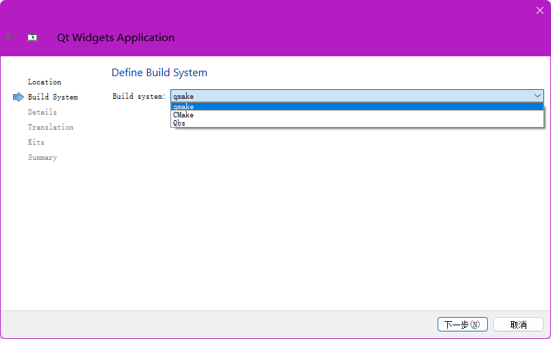
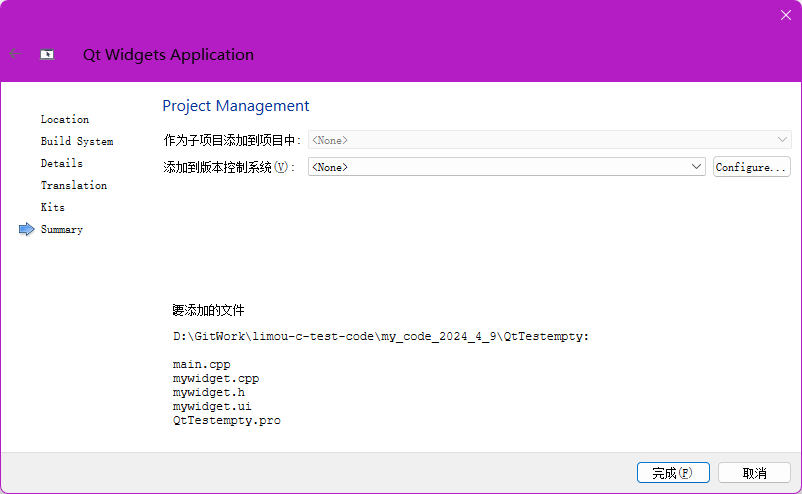

>   前要：我推荐新手先难受会，使用 `Qt Creator` 来直接开发。

# 1.基本的 Qt 代码

## 1.1.创建项目

我们先来创建一个项目跑起来先，看看界面是什么样子的。




>   补充：元编程是指编写能够操作、生成或者改变其他程序或者自身的程序。简单来说，元编程是关于编写程序的程序，它可以自我修改或者生成新的代码，也可以在运行时动态地创建、修改和执行代码。

使用 `Qt Creator` 会自动生成一些代码，接下来选择一个父类来用于后续的继承。

-   `QMainWindows`：表示完整的窗口
-   `QWidget`：表示一个控件（窗口上的一个具体元素，例如输入框、按钮、下拉框、单选按钮、复选按钮），我这里先选择这个
-   `QDialog`：表示一个对话框


接下来是国际化操作，不过可以先选择默认的就行。


`Qt` 中创建图形化界面的程序, 有两种：

1.   `Qt` 创建 `C++` 代码的方式

2.   通过 `from file` 图形化的方式

选择基于不同版本编译器的 `Qt SDK` 来构建后续代码。




然后分别解释一下自动生成的几个文件。

```shell
# 文件目录树
MyTest:
│
├─QtTestempty
│       main.cpp
│       mywidget.cpp
│       mywidget.h
│       mywidget.ui
│       QtTestempty.pro
│       QtTestempty.pro.user
│
└─ build-QtTestempty-Desktop_Qt_5_14_0_MinGW_64_bit-Debug
        .qmake.stash
        main.o
        Makefile
        moc_mywidget.cpp
        moc_mywidget.o
        moc_predefs.h
        mywidget.o
        QtTestempty.exe
        ui_mywidget.h
```

上面很明显包含了 `C/C++` 式的文件，我们先看这几个。

```cpp
// main.cpp

#include "mywidget.h"
#include <QApplication>

int main(int argc, char *argv[])
{
    QApplication a(argc, argv); // 传递命令行参数给 QApplication 类
    MyWidget w; // 创建一个控件对象, 继承自 QWidget
    w.show(); // 显示控件对象, hide() 则可以将控件隐藏
    return a.exec(); // exec() 是 QCoreApplication 类成员方法, 可启动 Qt 的事件循环, 和 Linux 中的 exec 进程替换没有关系
}

```

```cpp
// mywidget.h

#ifndef MYWIDGET_H
#define MYWIDGET_H

#include <QWidget> // 使用 Qt 内置的类和头文件一致

QT_BEGIN_NAMESPACE
namespace Ui { class MyWidget; }
QT_END_NAMESPACE

class MyWidget : public QWidget
{
    Q_OBJECT // 这是 QT 内置的宏, 该宏展开后就会生成大量代码, 当类需要使用 Qt 的“信号”和“槽”机制的时候就要引入

public: // 下面两个类方法做了头文件、源文件分离的实现
    MyWidget(QWidget *parent = nullptr); // Qt 引入了对象树的概念, 创建 Qt 的对象, 就可以吧对象挂在对象树上(N叉树), 往上挂时需要指定父节点
    ~MyWidget();

private:
    Ui::MyWidget *ui; //和 form file 相关
};
#endif // MYWIDGET_H

```

```cpp
// mywidget.cpp

#include "mywidget.h"
#include "ui_mywidget.h" // from file 被 qmake 生成的头文件

MyWidget::MyWidget(QWidget *parent)
    : QWidget(parent)
    , ui(new Ui::MyWidget)
{
    ui->setupUi(this); //把 from file 生成的页面和当前的 widget 关联起来
}

MyWidget::~MyWidget()
{
    delete ui; //释放资源
}

```

还有一个关于 `qmake` 的配置文件。

```properties
# QtTestempty.pro 是 qmake 进行元编程时的重要依据, “qmake+QtTestempty.pro”类似 makefile 的使用(但是这个工具古老且经典)
# 经过一次运行后, 在和本项目同级目录下的 build-QtTestempty-Desktop_Qt_5_14_0_MinGW_64_bit-Debug 中, 实际上也可以看到 Makefile 的身影
# 而且还有一些相关的配置文件, 还有一个依据 mywidget.ui 生成的 ui_mywidget.h 头文件, 您可以打开一览简单看一看
QT       += core gui # 表示引入的 Qt 模块

greaterThan(QT_MAJOR_VERSION, 4): QT += widgets

CONFIG += c++11 # 编译选项(使用的 C++ 标志)

# The following define makes your compiler emit warnings if you use
# any Qt feature that has been marked deprecated (the exact warnings
# depend on your compiler). Please consult the documentation of the
# deprecated API in order to know how to port your code away from it.
DEFINES += QT_DEPRECATED_WARNINGS

# You can also make your code fail to compile if it uses deprecated APIs.
# In order to do so, uncomment the following line.
# You can also select to disable deprecated APIs only up to a certain version of Qt.
#DEFINES += QT_DISABLE_DEPRECATED_BEFORE=0x060000    # disables all the APIs deprecated before Qt 6.0.0

# 当前项目参与构建的文件, 不需要手动修改, Qt 会自动维护好
SOURCES += \
    main.cpp \
    mywidget.cpp

HEADERS += \
    mywidget.h

FORMS += \
    mywidget.ui

# Default rules for deployment.
qnx: target.path = /tmp/$${TARGET}/bin
else: unix:!android: target.path = /opt/$${TARGET}/bin
!isEmpty(target.path): INSTALLS += target

```

另外，我们来查看 `mywidget.ui` 文件，这是一个 `XML` 的只读文件，主要是用来描述界面的样式，`qmake` 会根据这个文件进行元编程，生成对应 `C++` 代码，然后编译成一个界面。

想要修改 `XML` 文件，只能通过点击对应界面跳转的 `UI` 设计界面，通过鼠标操作和设计界面的方式来修改。


>   补充：`XML` 和 `HTML` 很是类似，用起来也像，但是两者的作用不太一样，`XML` 中的标签表示什么含义取决于程序员自定义（`HTML` 的由标准委员会使用相同的规则来规定）。

## 1.2.Hello World 代码的实现

### 1.2.1.使用标签

#### 1.2.1.1.使用界面编辑来实现


对应元编程结果如下：


#### 1.2.1.2.使用代码编辑来实现

一般使用代码来构造界面的时候，会把构造界面的代码放到 `Widget/MainWindows` 的构造函数中。

```cpp
// mywidget.cpp

#include "mywidget.h"
#include "ui_mywidget.h" // from file 被 qmake 生成的头文件
#include <QLabel> //还有一个 QLabel 是较早的实现版本
#include <QString>

MyWidget::MyWidget(QWidget *parent)
    : QWidget(parent)
    , ui(new Ui::MyWidget)
{
    ui->setupUi(this); //把 from file 生成的页面和当前的 widget 关联起来
    QLabel* label = new QLabel(this); //Label 其实就是“标签”, 也就是界面上用来显示的字符串, 并且指定父对象
    label->setText(QString("Hello World!")); //C++ 早期的字符串有 C 式风格字符串和混乱的 std::string, 因此就有了自己的基础类来支持字符串(QString)、动态数组(QVector)、链表(QList)、字典(QMap)...因此就有可能有两种解决方案, 不过很多情况都使用 Qt 自己的
    label->setGeometry(QRect(230, 130, 91, 21)); //设定标签位置和标签形状
    //另外, 这里故意没有使用 delete label, 这是 Qt 的一个特点, 您在这里可以不调用 delete
    //因为前面的 QLabel* label = new QLabel(this); 把对象通过父对象挂到了对象树上, 对象树可以把界面上的各种元素组织起来
}

MyWidget::~MyWidget()
{
    delete ui; //释放资源
}
```


并且，无论是手动使用 `delete` 还是使用栈变量，都是不科学的，应当将 `Qt` 对象的生命周期交给对象树（注意是要把控件的父控件对象挂上去），否则就会出现对应资源不显示的问题。

### 1.2.2.使用编辑框

#### 1.2.2.1.使用界面编辑来实现

`Qt` 中有两种编辑框：

-   单行编辑框 `QLineEdit`
-   多行编辑框 `QtextEdit`

同样先创建一个基于 `QWidget` 项目


拖拽控件添加代码。


#### 1.2.2.2.使用代码编辑器来实现

重新建立一个 `QWidget` 的项目，然后直接在 `widget.cpp` 中进行修改即可。

```cpp
#include "widget.h"
#include "ui_widget.h"
#include <QLineEdit>

Widget::Widget(QWidget *parent)
    : QWidget(parent)
    , ui(new Ui::Widget)
{
    ui->setupUi(this);
    QLineEdit* edit = new QLineEdit(this);
    edit->setText("Hello Word");
}

Widget::~Widget()
{
    delete ui;
}
```

### 1.2.3.使用按钮

#### 1.2.3.1.使用界面编辑来实现

重新建立一个 `QWidget` 的项目，然后直接使用界面添加按钮。


然后使用少量的代码给按钮添加事件。

```cpp
//widget.h
#ifndef WIDGET_H
#define WIDGET_H

#include <QWidget>

QT_BEGIN_NAMESPACE
namespace Ui { class Widget; }
QT_END_NAMESPACE

class Widget : public QWidget
{
    Q_OBJECT

public:
    Widget(QWidget *parent = nullptr);
    ~Widget();
    void handleClick();

private:
    Ui::Widget *ui;
};
#endif // WIDGET_H

```

```cpp
//widget.cpp
#include "widget.h"
#include "ui_widget.h"

Widget::Widget(QWidget *parent)
    : QWidget(parent)
    , ui(new Ui::Widget)
{
    ui->setupUi(this);
    connect(
        ui->pushButton, //绑定给 UI 中的 objectName=pushButton 按钮
        &QPushButton::clicked, //点击按钮时触发的信号
        this, //关联到具体的槽函数
        &Widget::handleClick //处理信号的回调函数
    );
    //注意函数和 Linux 中的 TCP 套接字编程无关, 涉及到 Qt 信号槽问题, 作用是连接信号和槽
}

Widget::~Widget()
{
    delete ui;
}

void Widget::handleClick()
{
    if (ui->pushButton->text() != "Hello World")
    {
        ui->pushButton->setText("Hello World");
    }
    else
    {
        ui->pushButton->setText("button");
    }
}
```


#### 1.2.3.2.使用代码编辑器来实现

```cpp
//widget.h
#ifndef WIDGET_H
#define WIDGET_H

#include <QWidget>
#include <QPushButton>

QT_BEGIN_NAMESPACE
namespace Ui { class Widget; }
QT_END_NAMESPACE

class Widget : public QWidget
{
    Q_OBJECT

public:
    Widget(QWidget *parent = nullptr);
    ~Widget();
    void handleClick(); //信号处理回调方法

private:
    Ui::Widget *ui;
    QPushButton* _myButton; //设置一个成员变量, 否则回调函数无法使用获取到的按钮
};
#endif // WIDGET_H

```

```cpp
//widget.hpp
#include "widget.h"
#include "ui_widget.h"
#include <QPushButton>

Widget::Widget(QWidget *parent)
    : QWidget(parent)
    , ui(new Ui::Widget)
{
    ui->setupUi(this);
    QPushButton* myButton = new QPushButton(this);
    myButton->setText("button");

    connect(
        myButton, //绑定给 UI 中的 objectName=pushButton 按钮
        &QPushButton::clicked, //点击按钮时触发的信号
        this, //关联到具体的槽函数
        &Widget::handleClick //处理信号的回调函数
        );
    //注意函数和 Linux 中的 TCP 套接字编程无关, 涉及到 Qt 信号槽问题, 作用是连接信号和槽

    _myButton = myButton;
}

Widget::~Widget()
{
    delete ui;
}

void Widget::handleClick()
{
    if (_myButton->text() != "Hello World")
    {
        _myButton->setText("Hello World");
    }
    else
    {
        _myButton->setText("button");
    }
}


```


# 2.关于对象树

我们再创建一个类，尝试感受一下对象树的作用。


我们手动导入一下头文件。


然后按 `F4` 跳转对应的 `.cpp` 实现。


再实现一下析构函数。


然后在 `widget.cpp` 中创建该控件，并且指定父对象。


>   补充：两种方式创建的代码难分主次，如果界面比较固定，就大多使用图形化界面，生成。但如果时非常动态的界面，最好还是直接使用代码。当然，也可以选择先使用图形化界面搭建框架再使用代码结合使用。

# 3.乱码问题的解决

如果使用的时候输出台出现乱码问题，可以通过记事本修改文件的编码格式来解决，当前（2024-4-22）表示中使用亚洲汉字最常用的还是 `utf8` 编码。但是我们还有一些其他的方案：

-   不直接使用 `String` 而使用 `QString`
-   不直接使用 `cout`，而使用 `Qt` 专用的日志工具 `qDebug()`

```cpp
//使用 qDebug()
#include <QDebug>
int main()
{
    qDebug() << "debug";
    return 0;
}
```

在 `Qt` 中，您可以使用`qDebug()`输出调试信息，但是它默认是不会在发布版本中输出的。在发布版本中，调试输出会被忽略。所以，您不需要特别去关闭它。

# 4.Qt 命名规则

如果您苦于命名规则的设定，不如跟随 `Qt` 进行驼峰命名法（内部代码实现大部分使用驼峰法），小驼峰给变量起名字，大驼峰给函数、类中起名。

>   吐槽：驼峰命名实际上会更加常用...

# 5.Qt Creator 快捷键

-   [ctrl+r] 运行
-   [ctrl+b] 编译
-   [ctrl+滚轮] 字体缩放
-   [ctrl+f] 查询
-   [ctrl+shift+↑/↓] 移动剪切代码行
-   [选中文本+F1] 帮助文档
-   [ctrl+i] 自动对齐
-   [F4] .h 和 .cpp 文件之间快速切换
-   [alt+enter] 快速生成函数声明对应的函数定义

这些快捷键多用就行。
