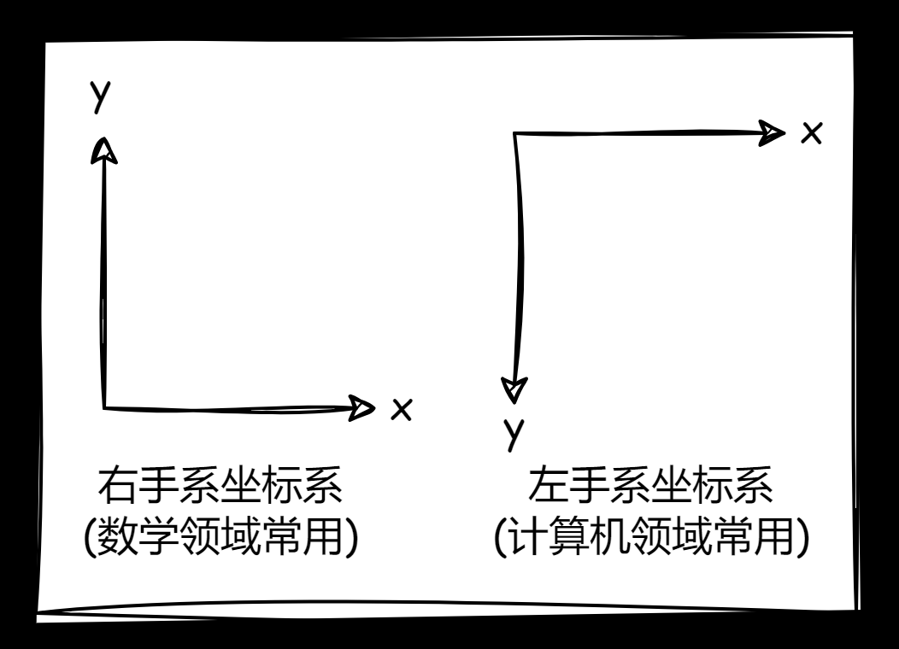
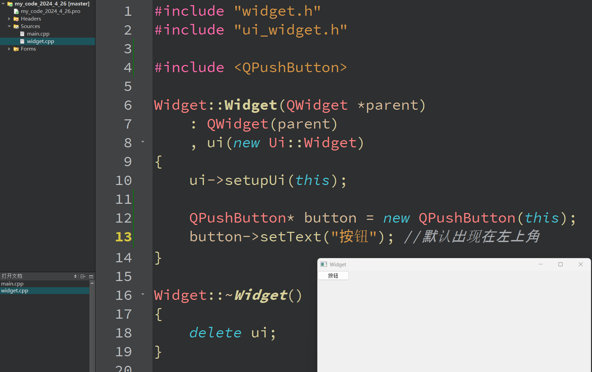
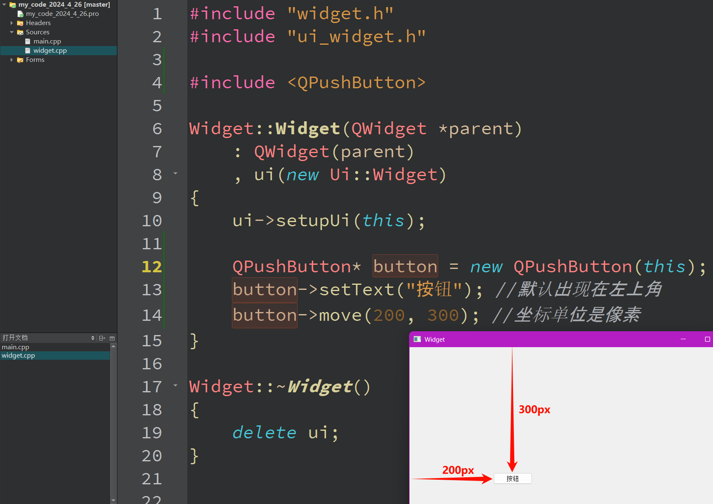
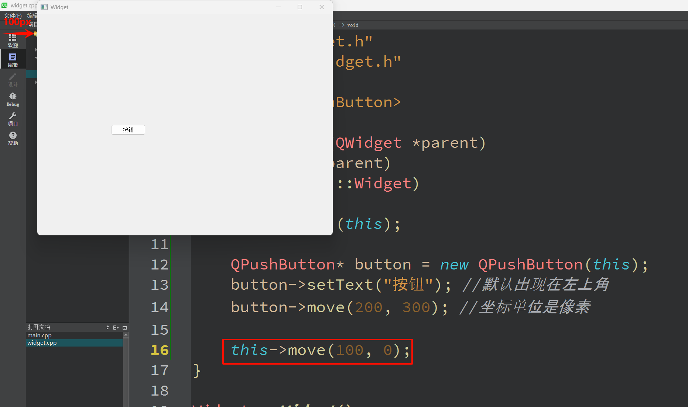

`Qt` 的坐标系不是 `Qt` 特有的，而是大部分图形框架都会遵循的坐标规范。

`Qt` 的某个控件设置位置就需要指定坐标，坐标系原点可以相对于父控件/整个窗口（可能该控件没有父控件，所以只能是整个窗口）而言。

而计算机图像中，常见的坐标系是左手坐标系，其基本单位是像素。

创建一个控件项目，然后创建一个按钮查看默认的位置。

还可以移动整个窗口的位置。

目前我们设置的位置，要么是根据父控件来说，要么就是根据整个桌面来说。

进一步思考，如果需要，可不可以写出一个窗口位置可以根据某种规律呈现的代码呢？暂时还不行，这个 `move()` 如果像上述这么使用只能初始化位置一次，有机会我们再来谈这个事。