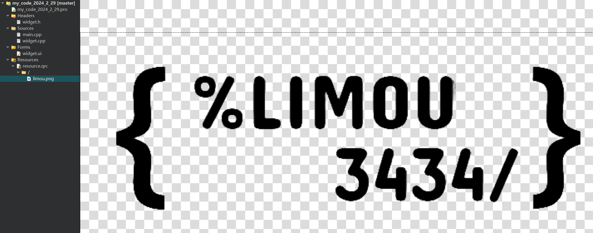

# 1.QWidget

了解控件是学习 `Qt` 的重要部分，窗口、按钮、文本框、单选按钮、复选按钮、下拉框都可以被称为控件或小组件（`Widget`），控件时构成一个图形化界面的基本要素。`Qt` 自带很多的基本控件，还支持程序员对现有控件做拓展，甚至直接自定义出新的控件。

而大部分的控件在 `Qt` 的 `Qt Creator` 界面设计页面中都有展示出来，但是 `Qt` 的默认样式颜值比较一般，但是后来的 `Qt Design Studio` 制作出来的界面程序很接近于现代界面设计，但是目前收费（而且和我们学的基本 `Qt` 知识还有些许区别）。

并且，所有的基本控件类都是继承自 `QWidget{/*...*/};`，可以在界面设计页面中进行查看和修改。


| 属性                      | 作用                                                         |
| ------------------------- | ------------------------------------------------------------ |
| **enabled**               | 设置控件是否可使用，`true` 表示可用，`false` 表示禁用。所谓的禁用实际上就是无法接受用户的任何输入事件，外观上通常显示为灰色，而且控件对象的子控件也会被禁用。 |
| **geometry**              | 位置和尺寸，包含 `x、y、width、height` 四个部分，坐标是以父元素为参考进行设置的（前两者描述控件的坐标，后两者描述控件的尺寸）。 |
| **windowTitle**           | 设置 `widget` 标题。                                         |
| **windowIcon**            | 设置 `widget` 图标。                                         |
| **windowOpacity**         | 设置 `widget` 透明度。                                       |
| **cursor**                | 鼠标悬停时显示的图标形状，在 `Qt Designer` 界面中可以清楚看到可选项。 |
| **font**                  | 字体相关属性，涉及到字体家族、字体大小、粗体、斜体、下划线等样式。 |
| **toolTip**               | 鼠标悬停在 `widget` 上会在状态栏中显示的提示信息。           |
| **toolTipDuring**         | `toolTip` 显示的持续时间。                                   |
| **statusTip**             | `Widget` 状态发生改变时显示的提示信息(比如按钮被按下等)。    |
| **whatsThis**             | 鼠标悬停并按下 `[alt+F1]` 时，显示的帮助信息(显示在一个弹出的窗口中)。 |
| **styleSheet**            | 允许使用 `CSS` 来设置 `widget` 中的样式。`Qt` 中支持的样式非常丰富，对于前端开发人员上手是非常友好的。 |
| **focusPolicy**           | 控件如何获取焦点。                                           |
| **contextMenuPolicy**     | 上下文菜单的显示策略。                                       |
| **locale**                | 设置语言和国家地区。                                         |
| **acceptDrops**           | 部件是否接受拖放操作。                                       |
| **minimumSize**           | 控件的最小尺寸。包含最小宽度和最小高度。                     |
| **maximumSize**           | 控件的最大尺寸。包含最大宽度和最大高度。                     |
| **sizePolicy**            | 尺寸策略。设置控件在布局管理器中的缩放方式。                 |
| **windowModality**        | 指定窗口是否具有 "模态" 行为。                               |
| **sizeIncrement**         | 拖动窗口大小时的增量单位。                                   |
| **baseSize**              | 窗口的基础大小，用来搭配 sizeIncrement 调整组件尺寸时计算组件应该调整到的合适的值。 |
| **palette**               | 调色板。可以设置 widget 的颜色风格。                         |
| **mouseTracking**         | 是否跟踪鼠标移动事件。                                       |
| **tabletTracking**        | 是否跟踪触摸屏的移动事件。                                   |
| **layoutDirection**       | 布局方向。                                                   |
| **autoFillBackground**    | 是否自动填充背景颜色。                                       |
| **windowFilePath**        | 将 widget 与一个本地文件路径关联起来。                       |
| **accessibleName**        | 设置 widget 的可访问名称。                                   |
| **accessibleDescription** | 设置 widget 的详细描述。                                     |
| **inputMethodHints**      | 针对输入框有效，用来提醒用户当前能输入的合法数据的格式。比如只能输入数字、只能输入日期等。 |

## 1.1.控件使能

另外还有一系列的方法：

-   `isEnabled()`：获取控件的可用状态
-   `setEnabled()`：设置控件的可用状态

```cpp
//widget.h
#ifndef WIDGET_H
#define WIDGET_H

#include <QWidget>
#include <QPushButton>

QT_BEGIN_NAMESPACE
namespace Ui { class Widget; }
QT_END_NAMESPACE

class Widget : public QWidget
{
    Q_OBJECT

public:
    Widget(QWidget *parent = nullptr);
    ~Widget();

public:
    void Handle(QPushButton* button);

private:
    Ui::Widget *ui;
};
#endif // WIDGET_H

```

```cpp
//widget.cpp
#include "widget.h"
#include "ui_widget.h"
#include <QPushButton>
#include <QDebug>

Widget::Widget(QWidget *parent)
    : QWidget(parent)
    , ui(new Ui::Widget)
{
    ui->setupUi(this);

    QPushButton* button = new QPushButton(this);
    button->setText("按钮");
    connect(button, &QPushButton::clicked, this, [=](){
        Handle(button);
    });
}

Widget::~Widget()
{
    delete ui;
}

void Widget::Handle(QPushButton* button)
{
    qDebug() << "Handle()\n";
    button->setEnabled(false);
}

```

上面代码就可以在按钮点击后，取消对按钮的使能。

## 1.2.位置尺寸

-   `geometry()`：则可以获取控件的位置和尺寸，返回结果就是四元素的 `QRect`，也就是一个矩形对象
-   `setGeometry(QRect)` 和 `setGeometry(int x, int y, int width, int height)`：设置控件的位置和尺寸，直接设置一个 `QRect` 或者分成四个属性单独设置

>   补充：`Qt` 还对各种几何图形所需要的属性进行了抽象，产生了各种轻小的几何类。例如 `QRect` 矩形对象，包含 `x, y, width, height` 属性，还有 `QSize` 尺寸对象，包含 `width, height` 属性。

我们直接拖拽出五个按钮控件，分别命名转到槽进行设置。


```cpp
//widget.h
#ifndef WIDGET_H
#define WIDGET_H

#include <QWidget>
#include <QPushButton>

QT_BEGIN_NAMESPACE
namespace Ui { class Widget; }
QT_END_NAMESPACE

class Widget : public QWidget
{
    Q_OBJECT

public:
    Widget(QWidget *parent = nullptr);
    ~Widget();

private slots:
    void on_pushButton_up_clicked();

    void on_pushButton_left_clicked();

    void on_pushButton_right_clicked();

    void on_pushButton_down_clicked();

private:
    Ui::Widget *ui;
};
#endif // WIDGET_H

```

```cpp
//widget.cpp
#include "widget.h"
#include "ui_widget.h"
#include <QDebug>

Widget::Widget(QWidget *parent)
    : QWidget(parent)
    , ui(new Ui::Widget)
{
    ui->setupUi(this);
}

Widget::~Widget()
{
    delete ui;
}

void Widget::on_pushButton_up_clicked()
{
    //获取 target 本身的 geometry
    QRect rect = ui->pushButton_target->geometry();
    rect.setY(rect.y() - 5); //这里只是对矩形对象本身做了修改, 该对象只是对控件的拷贝
    ui->pushButton_target->setGeometry(rect);
    qDebug() << rect;
}

void Widget::on_pushButton_left_clicked()
{
    //获取 target 本身的 geometry
    QRect rect = ui->pushButton_target->geometry();
    rect.setX(rect.x() - 5);
    ui->pushButton_target->setGeometry(rect);
    qDebug() << rect;
}

void Widget::on_pushButton_right_clicked()
{
    //获取 target 本身的 geometry
    QRect rect = ui->pushButton_target->geometry();
    rect.setX(rect.x() + 5);
    ui->pushButton_target->setGeometry(rect);
    qDebug() << rect;
}

void Widget::on_pushButton_down_clicked()
{
    //获取 target 本身的 geometry
    QRect rect = ui->pushButton_target->geometry();
    rect.setY(rect.y() + 5);
    ui->pushButton_target->setGeometry(rect);
    qDebug() << rect;
}

```

但是上述指修改了 `x、y` 能否保持尺寸不变呢？可以进一步修改代码。

```cpp
//widget.cpp
#include "widget.h"
#include "ui_widget.h"
#include <QDebug>

Widget::Widget(QWidget *parent)
    : QWidget(parent)
    , ui(new Ui::Widget)
{
    ui->setupUi(this);
}

Widget::~Widget()
{
    delete ui;
}

void Widget::on_pushButton_up_clicked()
{
    //获取 target 本身的 geometry
    QRect rect = ui->pushButton_target->geometry();
    //rect.setY(rect.y() - 5); //这里只是对矩形对象本身做了修改, 该对象只是对控件的拷贝
    //ui->pushButton_target->setGeometry(rect);

    ui->pushButton_target->setGeometry(rect.x(), rect.y() - 5, rect.width(), rect.height());

    qDebug() << rect;
}

void Widget::on_pushButton_left_clicked()
{
    //获取 target 本身的 geometry
    QRect rect = ui->pushButton_target->geometry();
    //rect.setX(rect.x() - 5);
    //ui->pushButton_target->setGeometry(rect);

    ui->pushButton_target->setGeometry(rect.x() - 5, rect.y(), rect.width(), rect.height());

    qDebug() << rect;
}

void Widget::on_pushButton_right_clicked()
{
    //获取 target 本身的 geometry
    QRect rect = ui->pushButton_target->geometry();
    //rect.setX(rect.x() + 5);
    //ui->pushButton_target->setGeometry(rect);

    ui->pushButton_target->setGeometry(rect.x() + 5, rect.y(), rect.width(), rect.height());

    qDebug() << rect;
}

void Widget::on_pushButton_down_clicked()
{
    //获取 target 本身的 geometry
    QRect rect = ui->pushButton_target->geometry();
    //rect.setY(rect.y() + 5);
    //ui->pushButton_target->setGeometry(rect);

    ui->pushButton_target->setGeometry(rect.x(), rect.y() + 5, rect.width(), rect.height());

    qDebug() << rect;
}

```


还有一点您需要注意的是，如果 `widget` 作为⼀个窗⼝ (带有标题栏, 最⼩化, 最⼤化, 关闭按钮), 那么在计算尺寸和坐标的时候就有两种算法，包含 `Window frame` 和不包含 `Window frame`。

-   **包含 window frame**：

    (1)`pos()` 返回一个 `QPoint` 对象，包含 `x(), y()` 元素和 `setX(), setY()` 方法

    (2)`frameSize()` 返回一个 `QSize` 对象，包含 `width(), height()` 元素和 `setWidth(), setHeight()` 方法

    (3)`frameGeometry()` 返回一个 `QRect` 对象，可以用成员函数获取上述元素，也可以使用 `setFrameGeometry()` 来一次性设置

-   **不包含 window frame**：

    (1)`mapToParent()` 返回一个 `QPoint` 对象，包含 `x(), y()` 元素和 `setX(), setY()` 方法

    (2)`size()` 返回一个 `QSize` 对象，包含 `width(), height()` 元素，还有 `setWidth(), setHeight()`

    (3)`geometry()` 返回一个 `QRect` 对象，可以用成员函数获取上述元素，也可以使用 `setGeometry()` 来一次性设置

    (4)`rect()` 作用和 `geometry()` 类似，但是其成员函数可以直接修改拷贝到的 `QRect` 对象

当然，如果⼀个不是作为窗⼝的 `widget` ，上述两类⽅式得到的结果是⼀致的。

而包不包含最明显的区别，就是以父控件窗口 `QWidget` 的左上角为原点，还是 `Window frame` 的左上角为原点。

```cpp
//widget.h
#ifndef WIDGET_H
#define WIDGET_H

#include <QWidget>

QT_BEGIN_NAMESPACE
namespace Ui { class Widget; }
QT_END_NAMESPACE

class Widget : public QWidget
{
    Q_OBJECT

public:
    Widget(QWidget *parent = nullptr);
    ~Widget();

public:
    void Handle();

private:
    Ui::Widget *ui;
};
#endif // WIDGET_H

```

```cpp
//widget.cpp
#include "widget.h"
#include "ui_widget.h"
#include <QDebug>
#include <QPushButton>

Widget::Widget(QWidget *parent)
    : QWidget(parent)
    , ui(new Ui::Widget)
{
    ui->setupUi(this);

    //这里只演示 frameGeometry() 和 geometry()
    QRect rect1 = this->frameGeometry();
    QRect rect2 = this->geometry();

    //此时控件还在构造中, 还没有加入到 window frame 中, 因此下面打印时没有区别的
    qDebug() << "未被加入 window frame: " << rect1;
    qDebug() << "未被加入 window frame: " << rect2;

    //我们通过按钮来打印再来查看
    QPushButton* button = new QPushButton(this);
    button->setText("按钮");
    button->move(100, 100);
    connect(button, &QPushButton::clicked, this, &Widget::Handle);
}

Widget::~Widget()
{
    delete ui;
}

void Widget::Handle()
{
    //这里只演示 frameGeometry() 和 geometry()
    QRect rect1 = this->frameGeometry();
    QRect rect2 = this->geometry();

    //此时控件早就件构造好了, 已经加入到 window frame 中, 因此下面打印时没有区别的
    qDebug() << "已经加入 window frame: " << rect1;
    qDebug() << "已经加入 window frame: " << rect2;
}


```

可以发现位置和尺寸都有变化，位置变化好理解，因为原点发生了变化，那为什么尺寸也会发生变化呢？因为作为整个窗口的控件尺寸从单纯的控件尺寸变成了整个窗口的尺寸。

## 1.3.窗口参数

### 1.3.1.窗口标题

`windowTitle()` 可以获取到 `windowTitle` 属性。

```cpp
//widget.h
#ifndef WIDGET_H
#define WIDGET_H

#include <QWidget>

QT_BEGIN_NAMESPACE
namespace Ui { class Widget; }
QT_END_NAMESPACE

class Widget : public QWidget
{
    Q_OBJECT

public:
    Widget(QWidget *parent = nullptr);
    ~Widget();

public:
    void Handle();

private:
    Ui::Widget *ui;
};
#endif // WIDGET_H

```

```cpp
//widget.cpp
#include "widget.h"
#include "ui_widget.h"
#include <QDebug>
#include <QPushButton>

Widget::Widget(QWidget *parent)
    : QWidget(parent)
    , ui(new Ui::Widget)
{
    ui->setupUi(this);

    //设置新的标题
    this->setWindowTitle("窗口标题");

    //我们通过按钮来打印再来查看
    QPushButton* button = new QPushButton(this);
    button->setText("按钮");
    button->move(100, 100);

    //下面代码没有办法修改标题, 应该按钮不是窗口控件
    button->setWindowTitle("新的窗口标题"); //不过这个代码也没有报错, 不太科学, 尤其再查看文档的时候, 可能会非常困扰

    connect(button, &QPushButton::clicked, this, &Widget::Handle);
}

Widget::~Widget()
{
    delete ui;
}

void Widget::Handle()
{
    this->setWindowTitle("新的窗口标题");
    qDebug() << this->windowTitle();
}

```

### 1.3.2.窗口图标

而 `windowIcon` 可以使用 `windowIcon()` 接口来获取窗口的图标，返回 `QIcon` 对象。还可以使用 `setWindowIcon(QIcon& icon)` 来把提前做好的 `.icon` 图标设置为窗口图标。

```cpp
//widget.h
#ifndef WIDGET_H
#define WIDGET_H

#include <QWidget>

QT_BEGIN_NAMESPACE
namespace Ui { class Widget; }
QT_END_NAMESPACE

class Widget : public QWidget
{
    Q_OBJECT

public:
    Widget(QWidget *parent = nullptr);
    ~Widget();

private:
    Ui::Widget *ui;
};
#endif // WIDGET_H

```

```cpp
//widget.cpp
#include "widget.h"
#include "ui_widget.h"
#include <QIcon>

Widget::Widget(QWidget *parent)
    : QWidget(parent)
    , ui(new Ui::Widget)
{
    ui->setupUi(this);

    //设置新的标题
    this->setWindowTitle("标题");

    //设置图标
    QIcon icon("图标路径...可以写成 '/' 的路径"); //这里需要您自己修改
    this->setWindowIcon(icon);
}

Widget::~Widget()
{
    delete ui;
}


```

但是如果图片所在路径在用户的机器上误删除了，就会导致图片资源无法加载，因此就会有 `qrc` 机制，给 `Qt` 羡慕引入一个 `xml` 文件，后缀名使用 `.qrc` 表示，把图片资源导入，并且在 `xml` 中记录。

编译项目的时候，就会根据 `qrc` 中描述的图片信息，找带图片的内容，提取出图片的二进制数据，把二进制数据转化为 `C++` 代码，最终硬编码到 `.exe` 文件中。不过这种方式不能导入过多的文件资源，否则会导致编译文件变大。

我们可以来简单试一试上述提到的 `qrc` 机制。


然后添加“前缀”，实际上就是添加 `Qt` 的抽象虚拟路径，`qrc` 机制其实就是把图片的二进制数据转化为 `C++` 中较大的 `char` 数组。而为了方便我们在 `Qt` 代码中访问图片就可以通过这个虚拟目录来访问。


导入图片（只能导入和 `resource.qrc` 文件同一个目录下的文件），转化为二进制数据。


若可以观察到缩略图说明导入成功。




则在代码中可以编写如下：

```cpp
//widget.h
#ifndef WIDGET_H
#define WIDGET_H

#include <QWidget>

QT_BEGIN_NAMESPACE
namespace Ui { class Widget; }
QT_END_NAMESPACE

class Widget : public QWidget
{
    Q_OBJECT

public:
    Widget(QWidget *parent = nullptr);
    ~Widget();

private:
    Ui::Widget *ui;
};
#endif // WIDGET_H

```

```cpp
//widget.cpp
#include "widget.h"
#include "ui_widget.h"
#include <QIcon>

Widget::Widget(QWidget *parent)
    : QWidget(parent)
    , ui(new Ui::Widget)
{
    ui->setupUi(this);

    //设置新的标题
    this->setWindowTitle("标题");

    //设置图标
    QIcon icon(":/limou.png"); //注意需要使用 ":" 作为开头
    this->setWindowIcon(icon);
}

Widget::~Widget()
{
    delete ui;
}


```


如果我们查看 `Debug` 模式下生成的文件：

```cmd
# build-my_code_2024_2_29-Desktop_Qt_5_14_0_MinGW_64_bit-Debug 的目录
04/29/2024  12:07 PM    <DIR>          .
04/29/2024  10:21 AM    <DIR>          ..
04/29/2024  10:21 AM             1,123 .qmake.stash
04/29/2024  11:25 AM           575,840 main.o
04/29/2024  12:07 PM            77,921 Makefile
04/29/2024  10:21 AM            14,621 moc_predefs.h
04/29/2024  11:25 AM             2,729 moc_widget.cpp
04/29/2024  11:25 AM           486,350 moc_widget.o
04/29/2024  12:07 PM         1,649,310 my_code_2024_2_29.exe
04/29/2024  12:07 PM           686,085 qrc_resource.cpp
04/29/2024  12:07 PM           137,851 qrc_resource.o
04/29/2024  10:21 AM             1,144 ui_widget.h
04/29/2024  12:07 PM           522,789 widget.o
```

里面多了一个文件 `qrc_resource.cpp`，我们打开来看一下。

```cpp
//qrc_resource.cpp
/****************************************************************************
** Resource object code
**
** Created by: The Resource Compiler for Qt version 5.14.0
**
** WARNING! All changes made in this file will be lost!
*****************************************************************************/

static const unsigned char qt_resource_data[] = {
  // D:/GitWork/limou-c-test-code/my_code_2024_2_29/limou.png
  0x0,0x2,0x5,0x27,
  0x89,
  0x50,0x4e,0x47,0xd,0xa,0x1a,0xa,0x0,0x0,0x0,0xd,0x49,0x48,0x44,0x52,0x0,
  0x0,0x7,0x80,0x0,0x0,0x2,0xe0,0x8,0x6,0x0,0x0,0x0,0x75,0x6e,0x6a,0x3b,
  0x0,0x0,0x0,0x1,0x73,0x52,0x47,0x42,0x0,0xae,0xce,0x1c,0xe9,0x0,0x0,0x0,
  0x4,0x67,0x41,0x4d,0x41,0x0,0x0,0xb1,0x8f,0xb,0xfc,0x61,0x5,0x0,0x0,0x0,
  0x9,0x70,0x48,0x59,0x73,0x0,0x0,0xe,0xc3,0x0,0x0,0xe,0xc3,0x1,0xc7,0x6f,
  0xa8,0x64,0x0,0x0,0xff,0xa5,0x49,0x44,0x41,0x54,0x78,0x5e,0xec,0xfd,0x87,0x9b,
  0x24,0xd7,0x7d,0xa6,0xb,0x76,0xfa,0xcc,0xb2,0xdd,0xd5,0x1e,0xed,0x60,0x1a,0xae,
  0x61,0x9,0x80,0x0,0xe8,0xad,0x48,0x4a,0xa2,0x28,0xca,0x91,0x9a,0x3b,0x33,0x9a,
  0x1d,0x73,0xef,0xec,0xec,0xde,0xdd,0xbf,0x66,0xef,0xde,0x3b,0x73,0x9f,0x9d,0xb9,
  0x33,0x23,0xcd,0x50,0x94,0x99,0x11,0x49,0x91,0x14,0x25,0xba,0xa1,0x24,0x8a,0x16,
  0x20,0xe1,0x8,0x4f,0x0,0xdd,0x68,0x6f,0xaa,0xab,0x2a,0x7d,0x66,0xed,0xf7,0x45,
  0xc5,0x29,0x26,0x8a,0xdd,0x8d,0x32,0x99,0x59,0x91,0x91,0xef,0xfb,0x3c,0x5f,0x9d,
//...
```

这些资源都被转化为二进制数据的数组，编译时从这里查找即可。

>   注意：上述接口只能针对顶层的窗口控件有效，对其他非顶层控件都是无效的，不过 `Qt` 不会报告相关的错误，这点其实有点坑...

### 1.3.3.窗口透明

使用 `windowOpacity()` 就可以获取到不透明数值，返回 `float`，取值 `0.0(全透明)->1.0(不透明)`，而使用 `setWindowOpacity(float n)` 来设置透明度。


```cpp
//widget.h
#ifndef WIDGET_H
#define WIDGET_H

#include <QWidget>

QT_BEGIN_NAMESPACE
namespace Ui { class Widget; }
QT_END_NAMESPACE

class Widget : public QWidget
{
    Q_OBJECT

public:
    Widget(QWidget *parent = nullptr);
    ~Widget();

private slots:
    void on_up_clicked();

    void on_down_clicked();

private:
    Ui::Widget *ui;
};
#endif // WIDGET_H

```

```cpp
//widget.cpp
#include "widget.h"
#include "ui_widget.h"
#include <QPushButton>
#include <QDebug>

Widget::Widget(QWidget *parent)
    : QWidget(parent)
    , ui(new Ui::Widget)
{
    ui->setupUi(this);

}

Widget::~Widget()
{
    delete ui;
}


void Widget::on_up_clicked()
{
    float opacity = this->windowOpacity();
    if (opacity >= 1.0)
        return;

    qDebug() << opacity;
    opacity += 0.1;
    this->setWindowOpacity(opacity);
}

void Widget::on_down_clicked()
{
    float opacity = this->windowOpacity();
    if (opacity <= 0.0)
        return;

    qDebug() << opacity;
    opacity -= 0.1;
    this->setWindowOpacity(opacity);
}

```


>   补充：这里又有个小细节，透明度的变化不是精确的，因为这是浮点数的加减法运算，而浮点数不一点可以被精确存储...
>
>   

## 1.4.鼠标样式

使用 `cursor()` 可以获取当前控件的 `cursor` 属性，返回的是 `QCursor` 对象，内部是鼠标悬停在控件上显示的样式。

`setCursor(const QCursor& cursor)` 可以设置一个控件内鼠标的样式，而 `QGuiApplication::setOverrideCursor(const QCursor& cursor)` 则可以设置整程序内的鼠标样式。

可以通过图形化界面来设置，也可以通过代码来设置。


代码的话如下：


```cpp
//widget.h
#include "widget.h"
#include "ui_widget.h"
#include <QCursor>

Widget::Widget(QWidget *parent)
    : QWidget(parent)
    , ui(new Ui::Widget)
{
    ui->setupUi(this);

    QCursor cursor(Qt::WaitCursor); //鼠标等待样式, 传递的实际上是一个枚举对象
    ui->button->setCursor(cursor);
}

Widget::~Widget()
{
    delete ui;
}

```


果然触发了鼠标的等待效果（我的鼠标是经过定制化的，您的可能是别的等待图标）。

不过我们也可以使用图片来自定义鼠标样式。


```cpp
//widget.h
#ifndef WIDGET_H
#define WIDGET_H

#include <QWidget>

QT_BEGIN_NAMESPACE
namespace Ui { class Widget; }
QT_END_NAMESPACE

class Widget : public QWidget
{
    Q_OBJECT

public:
    Widget(QWidget *parent = nullptr);
    ~Widget();

private:
    Ui::Widget *ui;
};
#endif // WIDGET_H

```

```cpp
//widget.cpp
#include "widget.h"
#include "ui_widget.h"
#include <QCursor>
#include <QPixmap>

Widget::Widget(QWidget *parent)
    : QWidget(parent)
    , ui(new Ui::Widget)
{
    ui->setupUi(this);
    QPixmap pixmap(":/arrow.png"); //导入图片资源
    pixmap = pixmap.scaled(50, 50); //修改图片大小
    QCursor curson(pixmap, 5, 5); //转化为光标样式, 默认情况下鼠标的点击生效位置（鼠标热点）为图片的左上角, 不过可以设置一下
    ui->button->setCursor(curson);
}

Widget::~Widget()
{
    delete ui;
}

```

## 1.5.字体样式

使用 `font()` 来获取字体属性，还可以使用 `setFont()` 来设置当前控件中的字体信息。

返回的 `QFont` 对象包含下列属性：

*   **family**: 字体族，如 `Arial、Times New Roman` 等
*   **pointSize**: 字体大小，以 `px` 为单位
*   **weight**: 字体粗细，填写 `[0, 99]` 或 `QFont.Weight` 枚举值表示，如 `QFont.Light、QFont.Normal、QFont.Bold` 等
*   **italic**: 是否为斜体，设置为 `true` 或 `false`
*   **bold**: 是否为粗体，设置为 `true` 相当于 `weight=75`；设置为 `false` 相当于 `weight=50`
*   **underline**: 是否有下划线
*   **strikeOut**: 是否有删除线
*   ...


或者使用直接代码。

```cpp
//widget.h
#ifndef WIDGET_H
#define WIDGET_H

#include <QWidget>

QT_BEGIN_NAMESPACE
namespace Ui { class Widget; }
QT_END_NAMESPACE

class Widget : public QWidget
{
    Q_OBJECT

public:
    Widget(QWidget *parent = nullptr);
    ~Widget();

private:
    Ui::Widget *ui;
};
#endif // WIDGET_H

```

```cpp
//widget.cpp
#include "widget.h"
#include "ui_widget.h"
#include <QLabel>
#include <QFont>

Widget::Widget(QWidget *parent)
    : QWidget(parent)
    , ui(new Ui::Widget)
{
    ui->setupUi(this);
    QLabel* label = new QLabel(this);
    label->setText("This is a text.");

    //构造字体对象
    QFont font;
    font.setFamily("Consolas");
    font.setPixelSize(40);
    font.setBold(true);
    font.setItalic(true);
    font.setUnderline(true);
    font.setStrikeOut(true);

    //设置字体
    label->setFont(font);
}

Widget::~Widget()
{
    delete ui;
}

```

## 1.6.悬浮提示

有时把鼠标图标放置在某个控件上可以弹出操作提示，能够提示用户和软件进行交互。

可以使用 `setToolTip()` 来设置 `toolTip` 属性，还可以使用 `setToolTipDuring()` 来设置 `toolTip` 的提示时间，单位时间为 `ms`。

```cpp
//widget.h
#ifndef WIDGET_H
#define WIDGET_H

#include <QWidget>

QT_BEGIN_NAMESPACE
namespace Ui { class Widget; }
QT_END_NAMESPACE

class Widget : public QWidget
{
    Q_OBJECT

public:
    Widget(QWidget *parent = nullptr);
    ~Widget();

private:
    Ui::Widget *ui;
};
#endif // WIDGET_H

```

```cpp
//widget.cpp
#include "widget.h"
#include "ui_widget.h"
#include <QLabel>
#include <QFont>

Widget::Widget(QWidget *parent)
    : QWidget(parent)
    , ui(new Ui::Widget)
{
    ui->setupUi(this);
    QLabel* label = new QLabel(this);
    label->setText("This is a text.");

    //构造字体对象
    QFont font;
    font.setFamily("Consolas");
    font.setPixelSize(40);
    font.setBold(true);
    font.setItalic(true);
    font.setUnderline(true);
    font.setStrikeOut(true);

    //设置字体
    label->setFont(font);

    //设置提示
    label->setToolTip("这是上面小节中设置的字体标签");
}

Widget::~Widget()
{
    delete ui;
}

```


## 1.7.控件焦点

对于键盘操作会比较明显，例如使用输入框时，必须将该控件作为焦点时，键盘输入才可以进行持续的输入，使用 `Tab` 通常可以切换界面的焦点。

一般来说，获取焦点有两种方式：

-   使用鼠标点击控件获取焦点
-   使用 `Tab` 制表符切换控件获取焦点

而控件使用 `Qt::FocusPolicy` 枚举类型来指定对应的的焦点策略，该枚举类型有以下取值，对应不同的焦点策略：

- `Qt::NoFocus`：控件不会接收键盘焦点
- `Qt::TabFocus`：控件可以通过 `Tab` 键接收焦点
- `Qt::ClickFocus`：控件在鼠标点击时接收焦点
- `Qt::StrongFocus`：控件可以通过 `Tab` 键和鼠标点击接收焦点，这是默认值
- `Qt::WheelFocus`：类似于 `Qt::StrongFocus`，同时控件也可以通过鼠标滚轮获取焦点（很少使用）


可以看到，四个文本框都是默认 `StrongFocus` 属性，可以在这里直接进行设置，这里我先不设置，后面使用代码进行设置。先来运行一下，尝试切换焦点。


也可以使用接口 `setFocusPolicy()` 调整焦点策略，让所有的文本框取消焦点，使得鼠标和 `Tab` 都无法选择焦点。

## 1.8.控件样式

在 `Qt` 中，可以使用样式表（`StyleSheet`）来设置控件的外观和样式。样式表类似于 `CSS`，允许以类似于 `HTML` 标签的方式指定控件的样式属性，如背景颜色、字体、边框等，但是 `Qt` 的样式表不如 `CSS` 完整，可也算好用。

首先需要创建一个样式表字符串，用于描述控件的样式属性。然后使用 `QWidget` 类的 `setStyleSheet()` 将样式表应用到控件上。


或者使用代码来设置样式。

```cpp
//widget.h
#ifndef WIDGET_H
#define WIDGET_H

#include <QWidget>

QT_BEGIN_NAMESPACE
namespace Ui { class Widget; }
QT_END_NAMESPACE

class Widget : public QWidget
{
    Q_OBJECT

public:
    Widget(QWidget *parent = nullptr);
    ~Widget();

private:
    Ui::Widget *ui;
};
#endif // WIDGET_H

```

```cpp
//widget.cpp
#include "widget.h"
#include "ui_widget.h"
#include <QPushButton>

Widget::Widget(QWidget *parent)
    : QWidget(parent)
    , ui(new Ui::Widget)
{
    ui->setupUi(this);
    // 创建一个按钮，并设置样式表
    QPushButton *button = new QPushButton(this);
    button->setText("按钮");
    button->setStyleSheet("QPushButton {"
                          "background-color: #4CAF50;"
                          "border: none;"
                          "color: white;"
                          "padding: 10px 20px;"
                          "text-align: center;"
                          "text-decoration: none;"
                          "display: inline-block;"
                          "font-size: 16px;"
                          "margin: 4px 2px;"
                          "cursor: pointer;"
                          "}");
}

Widget::~Widget()
{
    delete ui;
}

```

或者来写一个黑暗主题和白天主题的切换代码。


```cpp
//widget.h
#ifndef WIDGET_H
#define WIDGET_H

#include <QWidget>

QT_BEGIN_NAMESPACE
namespace Ui { class Widget; }
QT_END_NAMESPACE

class Widget : public QWidget
{
    Q_OBJECT

public:
    Widget(QWidget *parent = nullptr);
    ~Widget();

private slots:
    void on_light_clicked();

    void on_black_clicked();

private:
    Ui::Widget *ui;
};
#endif // WIDGET_H

```

```cpp
//widget.cpp
#include "widget.h"
#include "ui_widget.h"
#include <QPushButton>

Widget::Widget(QWidget *parent)
    : QWidget(parent)
    , ui(new Ui::Widget)
{
    ui->setupUi(this);

}

Widget::~Widget()
{
    delete ui;
}

void Widget::on_light_clicked()
{
    this->setStyleSheet("background-color: f0f0f0;");
    ui->light->setStyleSheet("background-color: black; color: red");
}

void Widget::on_black_clicked()
{
    this->setStyleSheet("background-color: black;");
    ui->black->setStyleSheet("background-color: f0f0f0; color: blue");
}

```

## 1.9.阅读障碍

有时为了方便一些具有阅读障碍的群体，可能会使用到  `accessibleName、accessibleDescription` 属性，使用类似屏幕阅读器的辅助技术来辅助使用和阅读软件。

# 2.QAbstractButton

以下是各种按钮的继承关系所有的按钮都继承自 `QAbstractButton{/*...*/};`，而该类又继承自 `QWidget{/*...*/};`，因此之前详细介绍的 `QWidget` 属性对应这个按钮类来说都是有效可用的，后续的控件类也有类似的特点，之后我不再重述。


*   `QPushButton{/*...*/};`：用于创建普通的按钮，通常用于触发操作或打开对话框等操作
*   `QCheckBox{/*...*/};`：用于创建复选框，允许用户选择或取消选择一个或多个选项
*   `QRadioButton{/*...*/};`：用于创建单选按钮，允许用户在一组中选择一个选项
*   `QToolButton{/*...*/};`：用于创建工具按钮，通常用于工具栏或工具箱中，可以包含图标和文本，并且可以与菜单、下拉菜单等关联

这里介绍以下父类 `QAbstractButton{/*...*/};` 的基本属性。

| 属性                   | 作用                                                         |
| ---------------------- | ------------------------------------------------------------ |
| **text**               | 按钮中的文本                                                 |
| **icon**               | 按钮中的图标                                                 |
| **iconSize**           | 按钮中的尺寸                                                 |
| **shortCut**           | 按钮对应快捷键                                               |
| **autoRepeat**         | 按钮重复触发，设置为 `true` 时，鼠标左键按住不放就会持续产生鼠标点击事件；设置为 `false` 时，鼠标左键必须提前释放后，再次按下点击才会发送鼠标点击事件。 |
| **autoRepeatDelay**    | 重复触发的延迟时间，当用户按住按钮一段时间后，按钮开始触发重复事件的时间间隔 |
| **autoRepeatInterval** | 重复触发的周期，每隔一个周期重复触发事件                     |

最后两个属性举个例子来进行区分，假设 `autoRepeatDelay` 设置为 `500` 毫秒，`autoRepeatInterval` 设置为 `100` 毫秒：

*   用户按住按钮不放，等待 `500` 毫秒（延迟时间）后，按钮开始触发第一次事件
*   之后每隔 `100` 毫秒（周期间隔），按钮触发一次事件，直到用户释放按钮

而属性设置的相关接口也很统一，和之前一样的设计，我们使用一份代码来运用一下，先提前导入按钮资源图片。


然后简便一些，直接拓展生成一个按钮。


```cpp
//widget.h
#ifndef WIDGET_H
#define WIDGET_H

#include <QWidget>

QT_BEGIN_NAMESPACE
namespace Ui { class Widget; }
QT_END_NAMESPACE

class Widget : public QWidget
{
    Q_OBJECT

public:
    Widget(QWidget *parent = nullptr);
    ~Widget();

private:
    Ui::Widget *ui;
};
#endif // WIDGET_H

```

```cpp
//widget.cpp
#include "widget.h"
#include "ui_widget.h"
#include <QIcon>
#include <QSize>

Widget::Widget(QWidget *parent)
    : QWidget(parent)
    , ui(new Ui::Widget)
{
    ui->setupUi(this);

    //创建图标对象并且设置为按钮的图标
    QIcon icon(":/img/button.png");
    ui->pushButton->setIcon(icon);
    ui->pushButton->setIconSize(QSize(50, 50));
}

Widget::~Widget()
{
    delete ui;
}


```


我们再尝试更多的按钮设置...

```cpp
//widget.h
#ifndef WIDGET_H
#define WIDGET_H

#include <QWidget>

QT_BEGIN_NAMESPACE
namespace Ui { class Widget; }
QT_END_NAMESPACE

class Widget : public QWidget
{
    Q_OBJECT

public:
    Widget(QWidget *parent = nullptr);
    ~Widget();

private slots:
    void on_pushButton_clicked();

private:
    Ui::Widget *ui;
};
#endif // WIDGET_H

```

```cpp
//widget.cpp
#include "widget.h"
#include "ui_widget.h"
#include <QIcon>
#include <QSize>
#include <QKeySequence>

Widget::Widget(QWidget *parent)
    : QWidget(parent)
    , ui(new Ui::Widget)
{
    ui->setupUi(this);

    //设置窗口的标题
    this->setWindowTitle("标题一");

    //创建图标对象并且设置为按钮的图标
    QIcon icon(":/img/button.png");
    ui->pushButton->setIcon(icon);
    ui->pushButton->setIconSize(QSize(50, 50));

    //给按钮添加快捷键 [b] 方便点击按钮
    //QKeySequence ks("b");
    //ui->pushButton->setShortcut(ks);
    ui->pushButton->setShortcut(Qt::Key::Key_B); //这种方式设计的快捷键不会出现按键拼写错误的问题, 出错了编译器也可以帮助警告

    //默认是鼠标不允许连发, 但是按钮运行连发, 因此这里尝试修改鼠标为连发
    ui->pushButton->setAutoRepeat(true);
}

Widget::~Widget()
{
    delete ui;
}

//按钮的点击事件
void Widget::on_pushButton_clicked()
{
    if(this->windowTitle() == "标题一")
        this->setWindowTitle("标题二");
    else
        this->setWindowTitle("标题一");
}

```


## 2.1.QPushButton

| 属性              | 作用                                                         |
| ----------------- | ------------------------------------------------------------ |
| **checkable**     | 是否能被选中，注意哪怕设置为 `false` 也可以触发点击事件      |
| **checked**       | 是否已经选中，`checkable` 是 `checked` 的前提条件            |
| **autoExclusive** | 是否排他，也就是选中一个按钮之后是否取消其他按钮的选中，默认设置为为排他 |

```cpp
//widget.h
#ifndef WIDGET_H
#define WIDGET_H

#include <QWidget>

QT_BEGIN_NAMESPACE
namespace Ui { class Widget; }
QT_END_NAMESPACE

class Widget : public QWidget
{
    Q_OBJECT

public:
    Widget(QWidget *parent = nullptr);
    ~Widget();

private slots:
    void on_radioButton_1_clicked();
    void on_radioButton_2_clicked();

private:
    Ui::Widget *ui;
};
#endif // WIDGET_H

```

```cpp
//widget.cpp
#include "widget.h"
#include "ui_widget.h"
#include <QIcon>
#include <QSize>
#include <QKeySequence>

Widget::Widget(QWidget *parent)
    : QWidget(parent)
    , ui(new Ui::Widget)
{
    ui->setupUi(this);

    //1.设置窗口的标题
    this->setWindowTitle("标题一");

    //2.禁用第一个按钮
    //ui->radioButton_1->setCheckable(false);

    //5.取消按钮 3 的排他设置, 但是其他按钮都保持排他, 哪怕有按钮被禁用也要算进去...
    ui->radioButton_3->setAutoExclusive(false);
}

Widget::~Widget()
{
    delete ui;
}

//3.设置按钮 1 的点击事件, 这里可以发现哪怕禁选了按钮 1, 对应的点击事件也会被触发
void Widget::on_radioButton_1_clicked()
{
    //如果按钮被选中, 就把标题进行修改
    if(this->windowTitle() == "标题一")
        this->setWindowTitle("标题二");
    else
        this->setWindowTitle("标题一");
}

//4.设置按钮 2 的点击事件
void Widget::on_radioButton_2_clicked()
{
    //如果按钮被选中, 就把标题进行修改
    if(ui->radioButton_2->isChecked() == true)
    {
        this->setWindowTitle("新标题");
    }
    ui->radioButton_2->setChecked(false); // 取消按钮选中状态
}

```

注意上述禁用按钮时的注意事项。

## 2.2.QRadioButton


# QCheckBox

# QLabel

# QLCDNumber

# QProgressBar

# QCalendarWidget

# QLineEdit

# QTextEdit

# QComboBox

# QSpinBox

# QDateTimeEdit

# QDial

# QSlider
