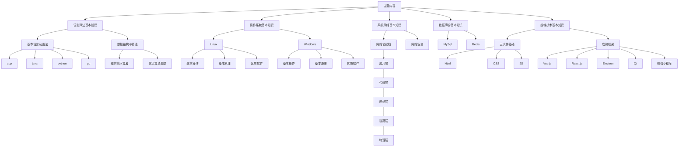

# limou-learn-note

## 1.仓库作者

[limou-learn-note](https://gitee.com/limou3434/limou-learn-note/) 的作者为 limou3434，一名普通的技术爱好者...

## 2.联系方式

`limou3434` 的 `qq` 邮箱：898738804@qq.com，有任何问题都可以和我联系。

## 3.主要内容

1.   提炼脑海中基础技术逻辑，构建个人技术栈
2.   无偿与他人分享自己的技术路线和学习心得
3.   建立自己技术栈的同时，时刻进行动态复习

## 4.内容分布

因此整个项目的从模块上来分，则主要内容如下：

-   语言算法基本知识
-   操作系统基本知识
-   网络通信基本知识
-   数据库的基本知识
-   前端技术基本知识

## 5.注意事项

追求逻辑自洽和技术栈完整，很多部分等待完善，相关内容您信一半即可... 
