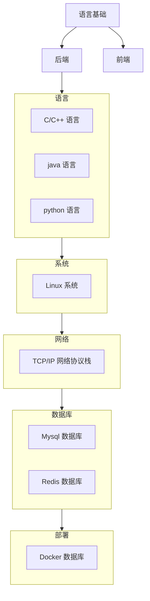

# limou-learn-note

## 1.仓库作者

[limou-learn-note](https://gitee.com/limou3434/limou-learn-note/) 的作者为 limou3434，一名普通的技术爱好者...

## 2.联系方式

`limou3434` 的 `qq` 邮箱：898738804@qq.com，有任何问题都可以和我联系。

## 3.主要目的

1.   提炼脑海中的技术逻辑，构建自己的技术栈
2.   无偿与他人分享自己的技术路线和学习心得
3.   建立自己技术栈的同时，时刻进行修改复习

## 4.内容分布

## 5.注意事项

追求逻辑自洽和技术栈完整，很多部分等待完善，相关内容您信一半即可... 
