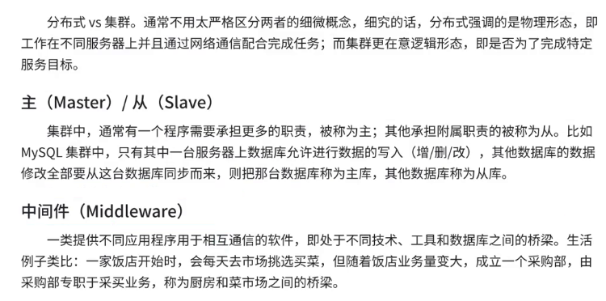
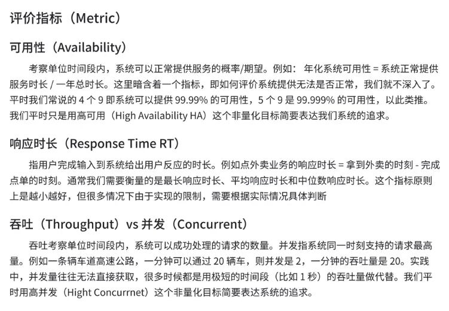

# 1.Redis 概念

`Redis` 是一种开源的内存数据库，用于存储数据结构，例如字符串、哈希表、列表、集合、有序集合等。它被设计为快速、灵活，并支持多种数据结构的操作。Redis通常用作缓存、消息代理、会话存储等用途。它支持多种编程语言，并有许多客户端库可供开发者使用。Redis 也有持久化选项，可以将数据保存到磁盘上，以便在重启时恢复数据。

`Redis` 相对于传统的关系型数据库（如 `MySQL`）或自定义内存中的变量有一些优势，这些优势可能导致选择 `Redis`：

1. **性能**：`Redis` 是一个基于内存的数据库，因此读写速度非常快，适合需要快速响应的应用场景，如缓存系统或计数器（因此常常是 `MySQL` 的一个替代方案，但是存储容量没有 `MySQL` 多，不过有一种方案就是两者同时结合使用，热点数据使用 `Redis`，其余数据使用 `MySQL`）。

2. **数据结构**：`Redis` 支持丰富的数据结构，如字符串、哈希表、列表、集合、有序集合等，这使得它可以更灵活地存储和操作数据，而不仅仅局限于关系型数据库的表结构。

3. **持久化**：虽然 `Redis` 是基于内存的，但它提供了持久化选项，可以将数据定期写入磁盘，确保数据不会因为系统崩溃而丢失。

4. **高可用性**：`Redis` 支持主从复制和集群模式，可以在多个节点上复制数据，提高系统的可用性和容错能力。

5. **原子操作**：`Redis` 支持原子操作，能够保证多个操作的原子性，避免了多线程或多进程并发操作数据时可能出现的竞态条件。

总的来说，`Redis` 适用于需要高性能、低延迟、丰富数据结构和高可用性的应用场景，如缓存、实时数据分析、会话存储等。虽然在某些情况下使用传统的关系型数据库或自定义内存变量也可以实现类似的功能，但 `Redis` 提供了更好的性能和更丰富的功能。

进程间通信，如果是单机，就需要通过管道或者共享内存等机制来传递数据。而如果涉及到多台主机，就会涉及到网络通信。而 `Redis` 就是基于网络把内存中数据交给别的进程甚至是其他主机中进程来使用，并且一般是基于分布式系统的。

`Redis` 经常会被作为存储数据的数据库、缓存、消息中间件...

>   补充：`Redis` 一开始是作为消息中间件（消息队列）的一个生产者-消费者模型解决方案，但是这种类似的解决方案已经有更优的方案了。

# 2.架构演进

1.   在一个服务器上启动运用服务，并且将数据存储在数据库中，甚至可以再把数据库模块移除，这种模式是很多中小公司采用的模式，哪怕只有一台主机，其性能也可能非常稳定，多购买主机的成本也随之降低，并且很多服务的用户量也达不到使用更高级架构的门槛。

2.   如果业务用户量增长，一台主机难以应付（尤其是同一时刻处理的请求变多），因此就需要引入更多的主机（硬件资源，尤其是 `CPU`、内存、硬盘、网络带宽...），这种情况一般使用两种类型的方案，也就是开源节流（增加收入，节省开支）

     -   开源：简单粗暴，增加更多高级硬件资源
     -   节流：复杂优雅，通过性能测试优化代码

     可以应用服务器和存储服务器，针对两种服务器的特点做不同的配置（前者可能需要更多的 `CPU` 和内存资源，后者可能需要更多的硬盘资源）。

3.   如果引入更多的应用服务器，形成一个服务器集群，因此就可能对用户请求做负载均衡，让每个服务器瓜分大量的请求，降低每一台机器的压力（和多线程的思路很类似）。

     而这里最重要的就是负载均衡器，有很多负载均衡算法（最简单的就是轮询分配来分配请求），需要注意，负载均衡器对请求量的承担能力要远远高于应用服务器，处理一个请求只是进行分配，而不完成请求对应的动作，对应的资源消耗也较少。

     当然，如果负载均衡器也撑不下去了，就可能再引入更多的负载均衡，同时也会提高管理成本。

4.   当然，如果引入的大量应用服务器，就有可能导致存储服务器的压力同样上升，如果同样进行开源操作，就需要引入更多的存储服务器，并且做读写分离，例如一台主存储服务器（`master`）只做写入操作，而从数据库（`slave`）只做读取操作。

     主数据库也会实时把数据同步到从数据库中，并且一般实际开发中，读操作会比写操作更多。因此就有可能引入更多的从服务器，形成一主多从的存储服务器集群。

     同时从数据库还可以通过负载均衡的方式，让应用服务器进行访问。

5.   但是数据库有个问题，终究是要面对响应速度的问题，可以把用来读取的数据进行“冷热”区分，热数据存储在缓存服务器中，而冷数据存储在从存储服务器中。

     而缓存服务器所能存储的热数据一般也较少，速度也较快，`Redis` 就可以在这里被得到应用。

6.   如果一个存储服务器还是不够存储，就可以考虑将多个 `database` 划分给不同的存储服务器，让一个存储服务器只拥有一个或部分的 `database`，甚至可以拆分 `table` 也就是所谓的分库分表。因此一个存储集群对应一个完整的数据库服务，内含多个数据库存储服务器或数据表存储服务器（当然，也需要结合实际的业务）。

     >   注意：如果迫不得已选择开源然后引入分布式，系统的复杂度大大提高，出 `BUG` 的概率就会更高。引入新特性的方便，往往会带来新的暗含的代价。

7.   如果进一步优化，就会诞生微服务，每个微服务设置一个应用集群、缓存集群、存储集群，而多个微服务之间就可能需要设置相关的公共服务，例如安全中心、监控预警中心等（微服务本质是为了解决人的问题，可以让更多的人力资源进行运用，因此微服务可以说是把人力资源也考虑进去了，因此小公司是很难直接使用这种架构的，只能租用大厂的微服务技术）。

     当然这种做法提高了协作效率，但是也变相降低了一些性能，并且也更加复杂了，需要更多的运维团队进行专门的服务器资源监控。

     当然，如果使用微服务，在技术领域上也可以提高功能复用的效果，并且可以给不同的服务进行部署。

>   补充：还有一些补充的概念
>
>   
>
>   分布是在物理上的，集群是在逻辑上的，不过多数情况也混用。
>
>   
>
>   
>
>   

# 3.安装 Redis

⾸先使用 `yum install centos-release-scl-rh` 安装 `scl` 源，再使用 `yum install rh-redis5-redis` 安装 `redis`。

