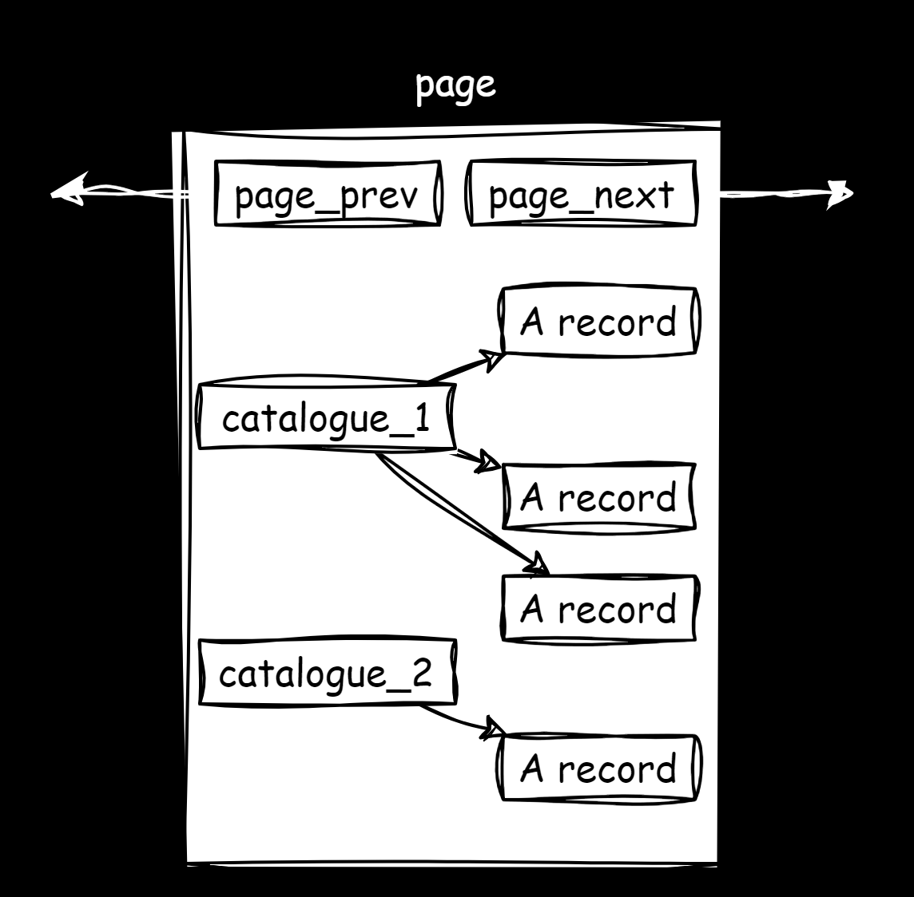
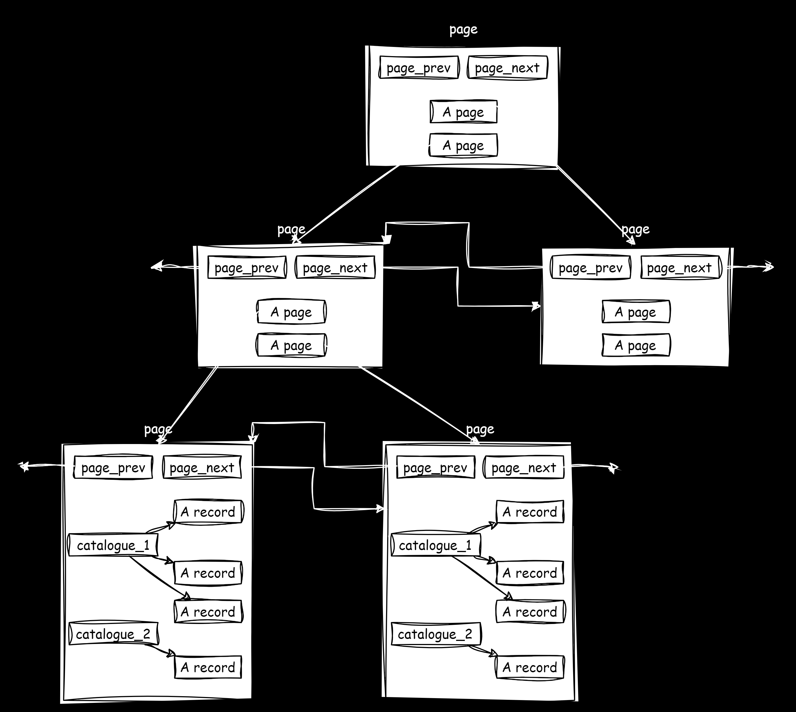

# 1.索引的意义

>   索引可以提高海量数据库的性能（不加内存，不改程序，不调 `sql`），只需要执行正确的 `create index` ，查询速度就可能提高成百上千倍。
>
>   但查询速度的提高是以插入、更新、删除的速度作为代价的，这些写操作增加了大量的 `IO`。

上述这段话还有很多是我们体会不到的，继续往下看。

我们先记住，`MySQL` 的服务器进程，所有的 `CURD` 都是在内存中进行的，索引也是这样，在内存中一定存在某种数据结构。

而优化算法的因素主要有两个：

-   组织数据的方法（例如：顺序表改写为二树树表）
-   算法的设计本身（例如：顺序查找改为二分查找）

而索引就是针对第一个方式对数据做优化，让查询速度变快，我们可以见一见什么叫索引。

1.   先建立一个 `.sql` 文件，该文件可以创建大批量的随机数：

     ```sql
     # 待补充
     ```

2.   使用 `ALTER TABLE table_name ADD INDEX(字段);` 添加索引

3.   比较不带索引和带上索引的查询速度差异...

# 2.磁盘和 MySQL

之前在 `Linux` 里学习了文件 `IO`，里面有提到磁盘的结构和抽象，而 `MySQl` 也可以看作是一种特殊的文件系统。

`MySQL` 层下不是直接对接硬盘，而是对接操作系统，通过调用操作系统来进行文件管理。

`MySQL` 的 `IO` 次数更加频繁，因此为了提高基本的 `IO` 效率，`MySQL` 进行 `IO` 的基本单位是 `16KB`（系统文件是用 `4KB` 的逻辑块来查找，而磁盘是 `512byte` 来读取）。

这 `16KB` 的 `IO` 操作实际上是向操作系统提出来的。

这刚好和 `InnoDB` 引擎的大小一样：

```sql
# 查看大小
mysql> show global status like 'innodb_page_size';
+------------------+-------+
| Variable_name    | Value |
+------------------+-------+
| Innodb_page_size | 16384 |
+------------------+-------+
1 row in set (0.01 sec)
```

因此可以衍生出以下思考：

-   对于 `MySQL` 来说，数据文件都是以 `page=16KB` 为单位在磁盘中保存的

-   `MySQL` 的 `CURD` 都需要通过 `CPU` 计算，因此就必须要 `CPU` 参与，进一步就需要内存参与，要通过操作系统接口，把数据从磁盘移动到内存中

-   磁盘和内存的交互就是一种 `IO` 操作，`IO` 的基本单位就是 `page`

-   而为了更好在内存中操作和提高效率（导致效率低下的主要矛盾是 `IO` 次数而不是一次 `IO` 大小），`MySQl` 向内存申请了一个较大的 `Buffer Pool=128M` 内存空间，来进行各种缓存，以便提高命中率，减少大量的系统和磁盘交互的次数

-   `MySQL` 内部会存在大量的 `page`，因此就需要对 `page` 先描述再组织，然后用一定的数据结构连接起来，因此就是 `MySQl` 对 `page` 进行了建模

    

# 3.索引的原理

经过前面的对比和铺垫，接下来我们就可以来深入了解索引的原理了，首先创建一个 `user` 表：

```sql
# 创建 user 表
mysql> create table if not exists user (
    ->     id int primary key, -- 一定要添加主键（会默认生成主键索引）
    ->     age int not null,
    ->     name varchar(16) not null
    -> );
Query OK, 0 rows affected (0.02 sec)

mysql> show create table user\G
*************************** 1. row ***************************
       Table: user
Create Table: CREATE TABLE `user` (
  `id` int(11) NOT NULL,
  `age` int(11) NOT NULL,
  `name` varchar(16) NOT NULL,
  PRIMARY KEY (`id`)
) ENGINE=InnoDB DEFAULT CHARSET=latin1
1 row in set (0.00 sec)

mysql> insert into user (id, age, name) values(3, 18, 'limou');
Query OK, 1 row affected (0.00 sec)

mysql> insert into user (id, age, name) values(4, 16, 'dimou');
Query OK, 1 row affected (0.00 sec)

mysql> insert into user (id, age, name) values(2, 26, 'iimou');
Query OK, 1 row affected (0.00 sec)

mysql> insert into user (id, age, name) values(5, 36, 'eimou');
Query OK, 1 row affected (0.00 sec)

mysql> insert into user (id, age, name) values(1, 56, 'pimou');
Query OK, 1 row affected (0.00 sec)

mysql> select * from user;
+----+-----+-------+
| id | age | name  |
+----+-----+-------+
|  1 |  56 | pimou |
|  2 |  26 | iimou |
|  3 |  18 | limou |
|  4 |  16 | dimou |
|  5 |  36 | eimou |
+----+-----+-------+
5 rows in set (0.00 sec)
```

我们发现，我向具有主键的表中插入时，数据会自动进行排序。实际上插入一条记录就是插入某个数据结构，而查找也是在查找某个数据结构，那什么结构比较适用用 `MySQL` 这样需要大量查找的数据库呢？

如果单纯使用链表来链接各种数据结构，就会导致顺序查找，进而降低查找效率。

那我们能不能引入树状结构呢（树状结构很适合查找）？肯定是可以的，因此我们引入 **页内目录** 的概念，这是一种空间换时间的做法（把本来用于存储记录的空间拿来存储目录），先查找对应的目录，再查找记录，效率会大大提高。



因此加上主键变成有序的原因就是为了页内目录做服务（书籍页码的有序，是为了更高效使用书籍目录来查询对应的书页），只有有序了才能方便分类进不同的目录。

但是 `page` 彼此之间还是线性的，一旦数据库的数据变大起来就会自动创建多个 `page` 来存储数据，此时要找到跨度比较大的数据，也需要大量的线性遍历（一旦一个数据再数据库的最后一页，那就需要加载所有的页进内存来遍历查找）。

因此如果将一个原本存储目录和记录的页，用来指向多个页（页本身也有编号），也同样可以使用树来优化查找速度。



而整个结构就是 `B+` 树，但是不是所有的索引都会使用 `B+` 树，也有使用哈希的。有了 `B+` 树就可以提高查找数据：

1.   一次淘汰更多的数据，线性查找一次只能淘汰一个数据（只需要加载一个根节点，找到局部的 `B+` 树，减少了 `IO` 次数）
2.   在这颗树上，只有叶子节点才保有数据，而非叶子节点只有目录项（可以存储更多目录项）

>   注意：概念里的大部分 `B+` 树只有根节点之间才有链式链接。

那如果我们没有主键呢？`MySQL` 也会这么组织一个数据表，因为 `MySQL` 默认会生成一个隐藏列，这个列默认就是主键，会根据这个隐藏主键来组织数据表。

所以设置索引之前，只会根据这个默认主键来构造 `B+` 树，但是索引后会根据设置的列来构建 `B+` 树。前后是两颗 `B+` 树，根据不同的列来构建，只有搜索格子对应的列时，才会使用对应的 `B+` 来查找，如果对应列没有 `B+` 树，那就只能遍历数据表来查找数据。

在 `MySQl` 中，选择这种树状数据结构，对于范围查找会更加快速。

至此，建立索引，就是建立一个方便查询的树状数据结构。

>   补充：为什么不选择其他数据结构？
>
>   -   链表：线性遍历
>   -   二叉搜索树：遇到很多节点时退化为线性结构
>   -   `AVL` 和 `RB`：虽然保证了平衡，但是由于只有左右节点，但是树的整体有可能过高，同层数据量较少
>   -   `hash`：理论上是可以，搜索时间复杂度是 `O(1)`，但是在范围查找的场景下有致命的缺陷，但是不排除有这种实现
>   -   `B` 树：理论上是可以， `B` 的路径节点也会保存数据，叶子节点不会进行线性链接（这意味着路径节点里的数据变多，但是目录变少，导致树的高度可能偏高，最终导致 `IO` 的加载次数可能变多，一般 `IO` 的成本较高）

# 4.索引的分类

-   **聚簇索引**：将所有的数据存储在叶子节点的存储引擎对应的就是 `Inno DB` 默认的存储结构（用户数据和索引数据存放再一起）

-   **非聚簇索引**：而 `MyISAM` 同样也是使用 `B+` 树结构，但是叶子节点不再存放数据，而是存储数据的地址（用户数据和索引数据存放在两处）

```sql
# 查看聚簇索引和非聚簇索引的区别

mysql> create table mtest( id int primary key, name varchar(11) not null ) engine=innodb; # 其实之前建表都是默认使用 InnoDB 的存储引擎，但是我们写明这一点
Query OK, 0 rows affected (0.03 sec)

# pwd 
/var/lib/mysql/limou_database
# ls
db.opt  mtest.frm  mtest.ibd

drop table mtest

mysql> create table mtest( id int primary key, name varchar(11) not null ) engine=MyISAM; 
Query OK, 0 rows affected (0.02 sec)

# pwd 
/var/lib/mysql/limou_database
# ls
db.opt  mtest.frm  mtest.MYD  mtest.MYI
```

对比就可以看到：

-   如果使用 `innodb` 引擎，就会存在三个文件，其中 `.frm` 就是数据表本身的结构，而 `.ibd` 就是数据和索引结构
-   如果使用 `MyISAM` 引擎，就会存在四个文件，其中 `.frm` 就是数据表本身的结构，而 `.MYD` 就是数据，`.MYI` 就是索引结构

如果我们在主键索引的基础上，又建立了普通索引，也会重新构造一个 `B+` 树，但是叶子节点不会存储所有的数据（浪费空间），而是存储对应数据的主键，然后根据这个主键再次回到主索引的 `B+` 树中，根据主键来搜寻完整的列记录（也叫“回表查询”）。

# 5.索引的使用

## 5.1.主键索引

1.   在创建表的同时，设置某一列为 `primary key` 即可自动建立主键索引（可以在列定义中，也可以在表创建语法的最后指定某列）
2.   或者创建表后，使用语法 `ALTER TABLE table_name ADD INDEX(field_name);` 即可创建主键索引

可以使用 `SHOW KEY FROM table_name` 或 `SHOW INDEX/KEY FROM table_name` 或 `DESC table_name` 来查看索引设定

```sql
mysql> show create table mtest\G
*************************** 1. row ***************************
       Table: mtest
Create Table: CREATE TABLE `mtest` (
  `id` int(11) NOT NULL,
  `name` varchar(11) NOT NULL,
  PRIMARY KEY (`id`)
) ENGINE=MyISAM DEFAULT CHARSET=latin1
1 row in set (0.00 sec)

mysql> SHOW INDEX FROM mtest\G
*************************** 1. row ***************************
        Table: mtest # 表名
   Non_unique: 0 # 是否非唯一性 
     Key_name: PRIMARY # 索引名称，默认叫“主键”
 Seq_in_index: 1
  Column_name: id # 索引对应表中的某一列
    Collation: A
  Cardinality: 0
     Sub_part: NULL
       Packed: NULL
         Null: 
   Index_type: BTREE # 索引类型，就是 B+ 树
      Comment: 
Index_comment: 
1 row in set (0.00 sec)
```

而使用 `ALTER TABLE table_name DROP PRIMARY KEY;` 则可以删除索引。

## 5.2.普通索引

实际上如果在创建表的同时添加 `QUIQUE` 属性，或者创建后使用 `ALTER TABLE table_name ADD UNIQUE(field_name);` 时，也会创建唯一索引，和主键索引的区别就是可以不可以为空的问题。

```sql
mysql> alter table mtest add unique(name);
Query OK, 0 rows affected (0.00 sec)
Records: 0  Duplicates: 0  Warnings: 0

mysql> show index from mtest\G
*************************** 1. row ***************************
        Table: mtest
   Non_unique: 0
     Key_name: PRIMARY
 Seq_in_index: 1
  Column_name: id
    Collation: A
  Cardinality: 0
     Sub_part: NULL
       Packed: NULL
         Null: 
   Index_type: BTREE
      Comment: 
Index_comment: 
*************************** 2. row ***************************
        Table: mtest
   Non_unique: 0
     Key_name: name
 Seq_in_index: 1
  Column_name: name
    Collation: A
  Cardinality: 0
     Sub_part: NULL
       Packed: NULL
         Null: 
   Index_type: BTREE
      Comment: 
Index_comment: 
2 rows in set (0.00 sec)
```

而删除唯一索引就是使用 `ALTER TABLE table_name DROP INDEX key_name;` 或者 `DROP INDEX index_name ON table_name;`，而如果是其他指定的普通索引，也是一样的删除方法（这是因为唯一索引也是一种特殊的普通索引）。

而普通索引的建立方法在一开始有提到过，就是：

-   `ALTER TABLE table_name ADD INDEX(field_name);`
-   或者在创建数据表的时候在末尾加上 `INDEX(field_name);`
-   也可以使用 `CREAT INDEX [index_new_name] on table_name(field_name);` 并且可以重命名普通索引的索引名称

最后，普通索引的删除方法和唯一约束是一样的。

普通索引还可以使用多个列来构成（也就是“复合索引”），这样构建的索引仍旧是一棵 `B+` 树，使用 `SHOW INDEX FROM table_name` 就会查找到两行信息，但是索引名字都一样，只是对应列不一样。

复合索引有多个 `key` 值，查找一个 `key` 时，如果想要查找的数据本身就是另外一个 `key` 值，那么其实无需进行回表查询，直接返回 `key` 值就行，如果时还有查询其他记录的其他数据，就需要返回主键进行一次回表查询（不过这个过程无需用户操作，`MySQL` 会自动进行，这种情况也叫做“索引覆盖问题”，覆盖的是主键）。

但是查找过程中需要给定最左边的字段，而不能给其他的字段，这是 `MySQL` 的索引最做匹配原则（原因是按照从左到右的顺序匹配的）。

>   补充：一般来说  (1)唯一性太差的 (2)更新过于频繁的 (3)根本不会出现在 `WHERE` 子句中用来查询的 字段最好不要作为索引，容易导致索引结构被频繁修改。

## 5.3.全文索引

我们之前提到的索引，都是使用比较短的数据来构建 `B+` 树的，但是有些时候会存储较长的文本数据，这个时候一般使用全文索引（`FULLTEXT`），不过 `MySQL` 的全文索引要求搜索引擎必须是 `MyISAM`，并且默认的全文索引只支持英文的而不支持中文（但是插件 `sphinx` 的中文版支持中文全文索引）。

```sql
# 尝试使用全文索引
# (1)建表的同时设置全文索引
mysql> create table articles (
    id int unsigned auto_increment not null primary key,
    title varchar(200),
    body text, fulltext(title,body) # 全文索引
)engine=MyISAM;
Query OK, 0 rows affected (0.01 sec)

mysql> INSERT INTO articles (title,body) VALUES
    -> ('MySQL Tutorial','DBMS stands for DataBase ...'),
    -> ('How To Use MySQL Well','After you went through a ...'),
    -> ('Optimizing MySQL','In this tutorial we will show ...'),
    -> ('1001 MySQL Tricks','1. Never run mysqld as root. 2. ...'),
    -> ('MySQL vs. YourSQL','In the following database comparison ...'),
    -> ('MySQL Security','When configured properly, MySQL ...');
Query OK, 6 rows affected (0.00 sec)
Records: 6  Duplicates: 0  Warnings: 0

# (2)查看表的索引信息
mysql> show index from articles\G
*************************** 1. row ***************************
        Table: articles
   Non_unique: 0
     Key_name: PRIMARY
 Seq_in_index: 1
  Column_name: id
    Collation: A
  Cardinality: 6
     Sub_part: NULL
       Packed: NULL
         Null: 
   Index_type: BTREE
      Comment: 
Index_comment: 
*************************** 2. row ***************************
        Table: articles
   Non_unique: 1
     Key_name: title
 Seq_in_index: 1
  Column_name: title
    Collation: NULL
  Cardinality: NULL
     Sub_part: NULL
       Packed: NULL
         Null: YES
   Index_type: FULLTEXT
      Comment: 
Index_comment: 
*************************** 3. row ***************************
        Table: articles
   Non_unique: 1
     Key_name: title
 Seq_in_index: 2
  Column_name: body
    Collation: NULL
  Cardinality: NULL
     Sub_part: NULL
       Packed: NULL
         Null: YES
   Index_type: FULLTEXT
      Comment: 
Index_comment: 
3 rows in set (0.00 sec)

# (3)使用模糊匹配
mysql> select * from articles where body like '%database%'; # 但是这里是普通搜索，实际上没有使用到全文索引
+----+-------------------+------------------------------------------+
| id | title             | body                                     |
+----+-------------------+------------------------------------------+
|  1 | MySQL Tutorial    | DBMS stands for DataBase ...             |
|  5 | MySQL vs. YourSQL | In the following database comparison ... |
+----+-------------------+------------------------------------------+
2 rows in set (0.00 sec)

# (4)查看 MySQL 语句对应的执行计划
mysql> explain select * from articles where body like '%database%'\G
*************************** 1. row ***************************
           id: 1
  select_type: SIMPLE
        table: articles # 要操作的数据表
   partitions: NULL
         type: ALL # 这次查询的方式是全部遍历
possible_keys: NULL
          key: NULL # NULL 值表示没有应用索引
      key_len: NULL
          ref: NULL
         rows: 6
     filtered: 16.67
        Extra: Using where
1 row in set, 1 warning (0.00 sec)

mysql> select * from articles where match (title,body) against ('database');
+----+-------------------+------------------------------------------+
| id | title             | body                                     |
+----+-------------------+------------------------------------------+
|  5 | MySQL vs. YourSQL | In the following database comparison ... |
|  1 | MySQL Tutorial    | DBMS stands for DataBase ...             |
+----+-------------------+------------------------------------------+
2 rows in set (0.00 sec)

mysql> explain select * from articles where match (title,body) against ('database')\G
*************************** 1. row ***************************
           id: 1
  select_type: SIMPLE
        table: articles
   partitions: NULL
         type: fulltext # 全文索引
possible_keys: title
          key: title # 以 title 作为索引
      key_len: 0
          ref: const
         rows: 1
     filtered: 100.00
        Extra: Using where
1 row in set, 1 warning (0.00 sec)
```


