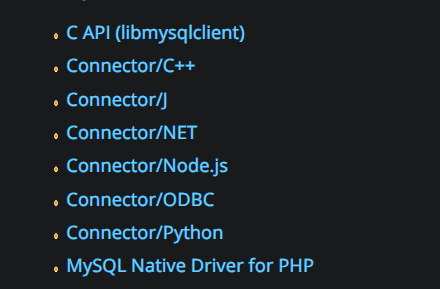
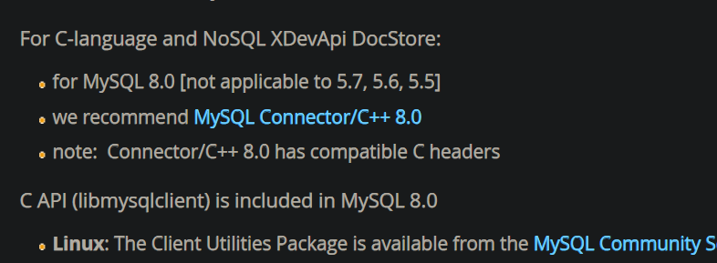
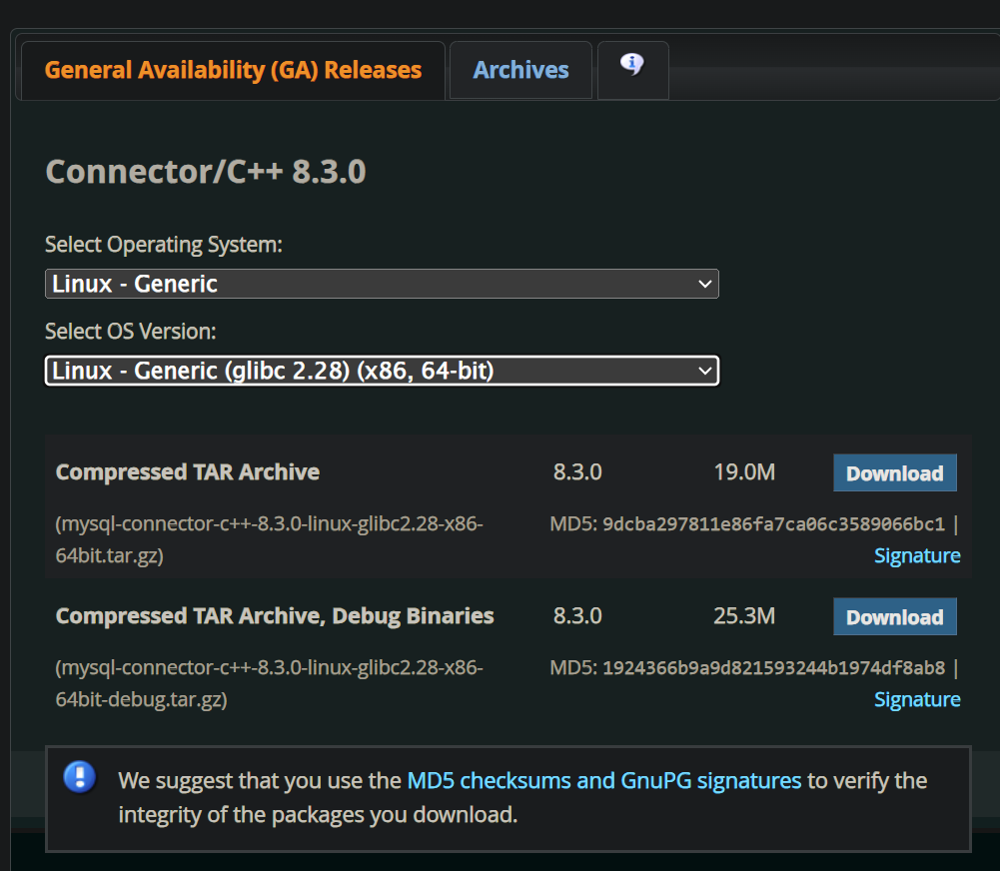
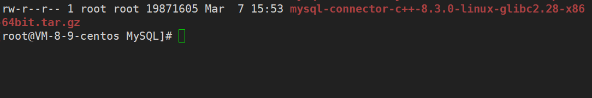
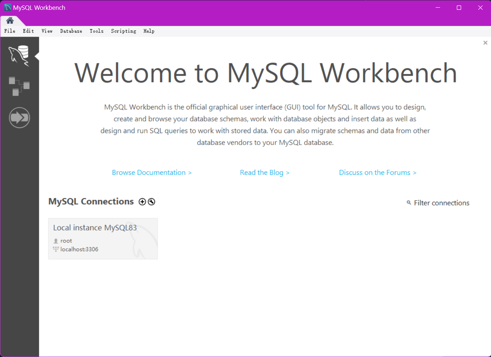
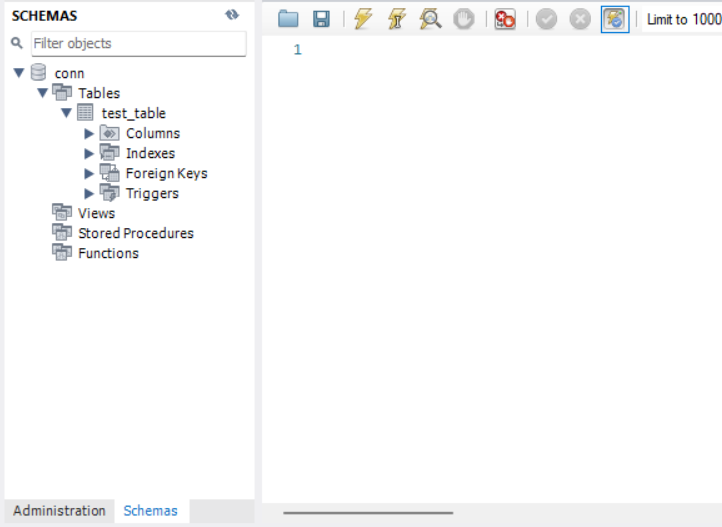

# 1.下载开发包

有了之前的基础，就可以使用语言来使用数据库了，实际上原生命令行操作数据库的场景比较少，语言级别的库和包才更加常用，接下我来带您学习如何使用 `C/C++` 访问 `MySQL` 客户端。

然后创建一个可以远程登录的用户，并且拥有对一个 `coon` 数据库的所有权限。

然后去 [官网](https://dev.mysql.com/downloads/) 安装对应的库。



我们这里只演示 `C` 语言的调用。







但是这个方法比较麻烦，并且易错，因此这里只是简单讲一下流程，我还是推荐您直接使用 `yum` 来安装。

但是其实我们之前就安装过了，在使用 `yum install -y mysql -community-server` 时候，就已经安装过了。

可以使用 `ls /usr/include/mysql` 查看内部有关 `MySQL` 的头文件。

若没有找到就使用 `yum install -y mysql-devel` 下载对应的开发工具。

```shell
# 查看对应的头文件
# ls /usr/include/mysql
big_endian.h              my_getopt.h         my_xml.h
binary_log_types.h        my_global.h         plugin_audit.h
byte_order_generic.h      my_list.h           plugin_ftparser.h
byte_order_generic_x86.h  mysql               plugin_group_replication.h
decimal.h                 mysql_com.h         plugin.h
errmsg.h                  mysql_com_server.h  plugin_keyring.h
keycache.h                mysqld_ername.h     plugin_validate_password.h
little_endian.h           mysqld_error.h      sql_common.h
m_ctype.h                 mysql_embed.h       sql_state.h
m_string.h                mysql.h             sslopt-case.h
my_alloc.h                mysql_time.h        sslopt-longopts.h
my_byteorder.h            mysql_version.h     sslopt-vars.h
my_command.h              mysqlx_ername.h     thr_cond.h
my_compiler.h             mysqlx_error.h      thr_mutex.h
my_config.h               mysqlx_version.h    thr_rwlock.h
my_config_x86_64.h        my_sys.h            typelib.h
my_dbug.h                 my_thread.h
my_dir.h                  my_thread_local.h

# ls /lib64/mysql
libmysqlclient.a   libmysqlclient.so.20       libmysqlservices.a  plugin
libmysqlclient.so  libmysqlclient.so.20.3.31  mecab
```

尝试在 `C` 中使用 `MySQL` 的接口。

```cpp
//main.cc 内部
#include <stdio.h>
#include <mysql/mysql.h>
int main()
{
    printf("mysql client Version: %s\n", mysql_get_client_info()); //获取客户端版本信息
    return 0;
}
```

然后使用 `g++ main.cc -L/lib64/mysql -lmysqlclient`，在我这边回显的结果为 `mysql client Version: 5.7.44`。

# 2.使用 API

>   补充：[接口地址](https://dev.mysql.com/doc/c-api/5.7/en/c-api-function-reference.html)。

接下来我们直接通过一个程序来学习接口的使用。

首先先创建一个表，并且设置对应用户的权限，开发云服务器的端口号。

```sql
# 创建表结构
mysql> create table test_table( id bigint primary key auto_increment, name va
rchar(32) not null, age int not null, telphone varchar(32) unique );
Query OK, 0 rows affected (0.06 sec)

mysql> desc test_table;
+----------+-------------+------+-----+---------+----------------+
| Field    | Type        | Null | Key | Default | Extra          |
+----------+-------------+------+-----+---------+----------------+
| id       | bigint(20)  | NO   | PRI | NULL    | auto_increment |
| name     | varchar(32) | NO   |     | NULL    |                |
| age      | int(11)     | NO   |     | NULL    |                |
| telphone | varchar(32) | YES  | UNI | NULL    |                |
+----------+-------------+------+-----+---------+----------------+
4 rows in set (0.00 sec)
```

然后编写代码如下：

```cpp
//main.cc 内部
#include <iostream>
#include <string>
#include <unistd.h>
#include <mysql/mysql.h>

const std::string host = "127.0.0.1"; //也可以使用 localhost
const std::string user = "eimou";
const std::string passwd = "MYSQLWishuxue31415ei_"; //这里我隐去了我的密码
const std::string db = "conn";
const unsigned int port = 3306;

int main()
{
    //1.获取客户端版本信息
    std::cout << "mysql client Version " << mysql_get_client_info() << std::endl; 
    
    //2.初始化，获得一个句柄
    MYSQL* mySql = mysql_init(nullptr);
    if (mySql == nullptr)
    {
        std::cerr << "mysql_init() error" << std::endl;
        exit(1);
    }
    
    //3.修改本客户端的对应字符集，避免传输过程中出现乱码
    mysql_set_character_set(mySql, "utf8");

    //4.连接数据库
    if (mysql_real_connect(
        mySql, //内部包含套接字信息   
        host.c_str(), //连接主机 IP
        user.c_str(), //用户
        passwd.c_str(), //密码
        db.c_str(), //对应的数据库
        port, //端口号
        nullptr, //域间套接字
    	0 //客户端标志
    ) == nullptr)
    {
        std::cerr << "mysql_real_connrct() error" << std::endl;
        exit(2);
    }
    
    //5.操作数据库
    while(true)
    {
        std::string sql;
        
        std::cout << "insert sql >>> "; 
        
        if (!std::getline(std::cin, sql))
        {
            break;
        }
        
        if (sql == "quit" || sql == "exit")
        {
            std::cout << "bye~" << std::endl;
            break;
        }
        
        if (mysql_query(mySql, sql.c_str()) != 0)
        {
            std::cerr << "mysql_query() error" << std::endl;
            exit(3);
        }
         
        //6.读取
        if (sql.find("select") != std::string::npos) //有读取的命令
        {
            MYSQL_RES* res = mysql_store_result(mySql); //MYSQL_RES 是一个类型，指向的对象可以保存查询的数据，把数据全部当作字符串存储起来，可以看作一个 char** arr[]，每个元素都是一个 char* arr[]，实际上这些空间也是 new/malloc() 出来的，因此最后一定要记得释放

            if (res == nullptr)
            {
                std::cerr << "mysql_store_result() error" << std::endl;
                exit(4);
            }
            else
            {
                //读取行数和列数
                my_ulonglong rows = mysql_num_rows(res);
                my_ulonglong fields = mysql_num_fields(res);
                std::cout << "rows: " << rows << " and fields: " << fields << std::endl;

                //读取具体的列的属性
                MYSQL_FIELD* field_arry = mysql_fetch_fields(res); //该函数行为类似 C++ 的迭代器，每次遍历自动移动行
                for (int i = 0; i < fields; i++)
                {
                    std::cout << field_arry[i].name << "\t";
                }
                std::cout << "\n";

                //读取具体的行内内容
                for (int i = 0; i < rows; i++)
                {
                    MYSQL_ROW row = mysql_fetch_row(res); //该函数行为类似 C++ 的迭代器，每次遍历自动移动行
                    for (int j = 0; j < fields; j++)
                    {
                        std::cout << row[j] << "\t";
                    }
                    std::cout << "\n";
                }
                //实际上还可以通过 field_arry[index].属性 的方式获取值
                //若为 NULL 值则打印的结果为空
            }

            mysql_free_result(res);
        }
    }
    
    //7.释放句柄
    mysql_close(mySql);
    
    return 0;
}
```

```makefile
# makefile 内部
mytest:main.cc
    g++ main.cc -o mytest -std=c++11 -L/lib64/mysql -lmysqlclient
    
.PHONY:clean
clean:
    rm -f mytest
```

>   补充：可以使用命令 `show processlist;` 来查看当前连接数据库的服务端及其用户信息。

```shell
# shell 的运行结果
# (1)插入数据
$ ./mytest
mysql client Version 5.7.44
insert sql >>> insert into test_table (name, age, telphone) values ('imou', 12, '10000');
insert sql >>> exit
bye~

# (2)检查结果
$ mysql -uroot -p

mysql> use conn
Reading table information for completion of table and column names
You can turn off this feature to get a quicker startup with -A

Database changed
mysql> show tables;
+----------------+
| Tables_in_conn |
+----------------+
| test_table     |
+----------------+
1 row in set (0.00 sec)

mysql> select * from test_table;
+----+-------+-----+----------+
| id | name  | age | telphone |
+----+-------+-----+----------+
|  1 | limou |  12 | 10000    |
+----+-------+-----+----------+
1 row in set (0.00 sec)
```

增删改都不难，但是如果查的结果？实际上就是存储在链接数据库时返回的指针变量中的成员。

另外，还有一些关于事务的接口，这里不再细谈。

# 3.图形化界面

还推荐使用一些图形化界面来操作数据库...

-   **phpMyAdmin**：好用，但是安装有点麻烦
-   **Navicat**：客户端体验不错，推荐，但是收费
-   **SQLyong**：体验也不错，推荐，但是收费
-   **MySQL Workbench**：官方推荐，但是体验可能一般，但是免费，可以先下载用一用，[下载地址](https://dev.mysql.com/downloads/)



图形界面实际上也是客户端。

一般云服务器的 `MySQL` 端口号不会暴露出来，基本都是在内网中开发，一般数据库会和其他服务器单独隔离开，单独购买一个机器。

但是由于条件受限，您可以在不重要的云服务器中暴露端口号，方便测试使用。


