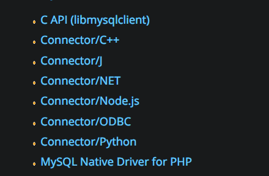
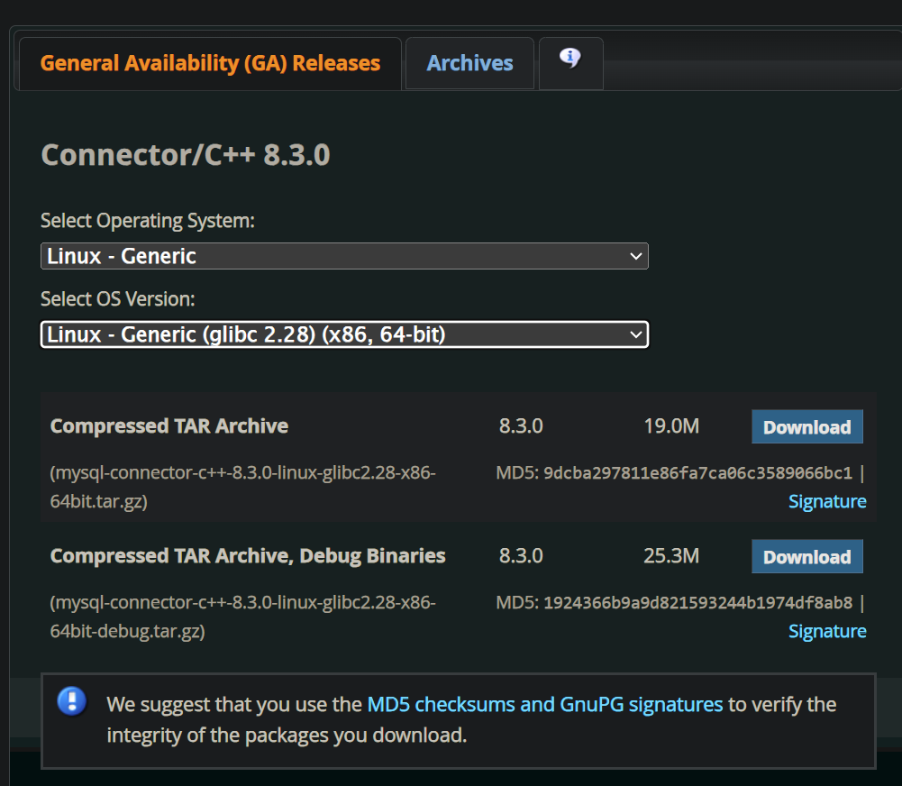

# 1.下载开发包

有了之前的基础，就可以使用语言来使用数据库了，实际上原生命令行操作数据库的场景比较少，语言级别的库和包才更加常用，接下我来带您学习如何使用 `C/C++` 访问 `MySQL` 客户端。

然后创建一个可以远程登录的用户，并且拥有对一个 `coon` 数据库的所有权限。

然后去 [官网](https://dev.mysql.com/downloads/) 安装对应的库。



我们这里只演示 `C` 语言的调用。





但是这个方法比较麻烦，并且易错，因此这里只是简单讲一下流程，我还是推荐您直接使用 `yum` 来安装。

但是其实我们之前就安装过了，在使用 `yum install -y mysql -community-server` 时候，就已经安装过了。

可以使用 `ls /usr/include/mysql` 查看内部有关 `MySQL` 的头文件。

若没有找到就使用 `yum install -y mysql-devel` 下载对应的开发工具。

```shell
# 查看对应的头文件
# ls /usr/include/mysql
big_endian.h              my_getopt.h         my_xml.h
binary_log_types.h        my_global.h         plugin_audit.h
byte_order_generic.h      my_list.h           plugin_ftparser.h
byte_order_generic_x86.h  mysql               plugin_group_replication.h
decimal.h                 mysql_com.h         plugin.h
errmsg.h                  mysql_com_server.h  plugin_keyring.h
keycache.h                mysqld_ername.h     plugin_validate_password.h
little_endian.h           mysqld_error.h      sql_common.h
m_ctype.h                 mysql_embed.h       sql_state.h
m_string.h                mysql.h             sslopt-case.h
my_alloc.h                mysql_time.h        sslopt-longopts.h
my_byteorder.h            mysql_version.h     sslopt-vars.h
my_command.h              mysqlx_ername.h     thr_cond.h
my_compiler.h             mysqlx_error.h      thr_mutex.h
my_config.h               mysqlx_version.h    thr_rwlock.h
my_config_x86_64.h        my_sys.h            typelib.h
my_dbug.h                 my_thread.h
my_dir.h                  my_thread_local.h

# ls /lib64/mysql
libmysqlclient.a   libmysqlclient.so.20       libmysqlservices.a  plugin
libmysqlclient.so  libmysqlclient.so.20.3.31  mecab
```

尝试在 `C` 中使用 `MySQL` 的接口。

```cpp
//main.cc 内部
#include <stdio.h>
#include <mysql/mysql.h>
int main()
{
    printf("mysql client Version: %s\n", mysql_get_client_info()); //获取客户端版本信息
    return 0;
}
```

然后使用 `g++ main.cc -L/lib64/mysql -lmysqlclient`，在我这边回显的结果为 `mysql client Version: 5.7.44`。

# 2.使用 API


