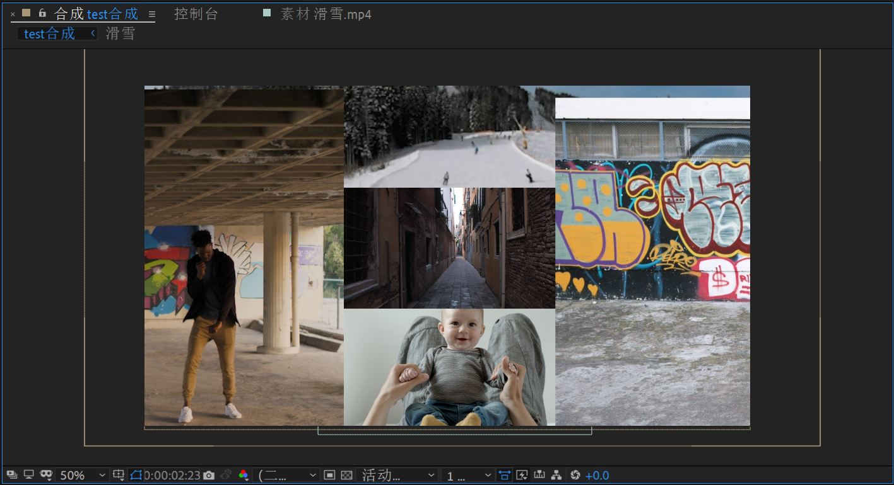
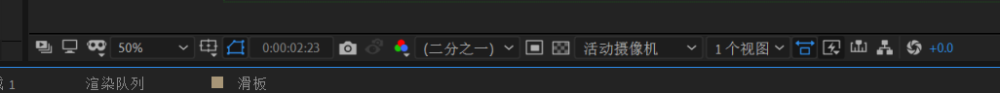
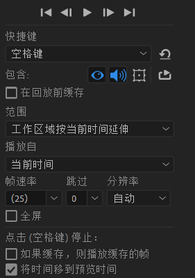
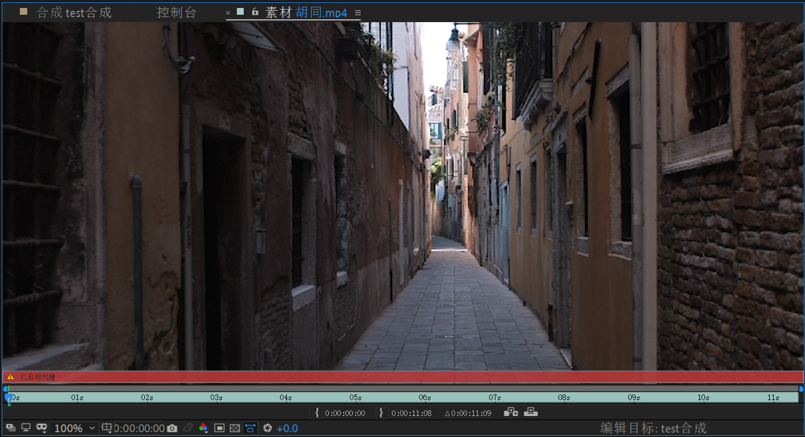
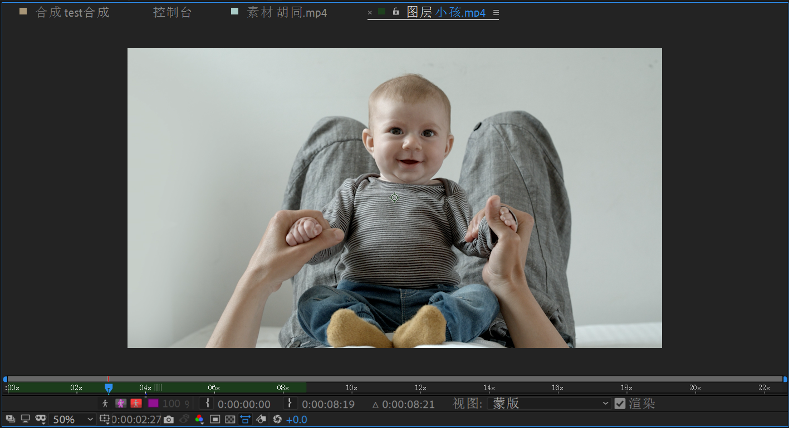
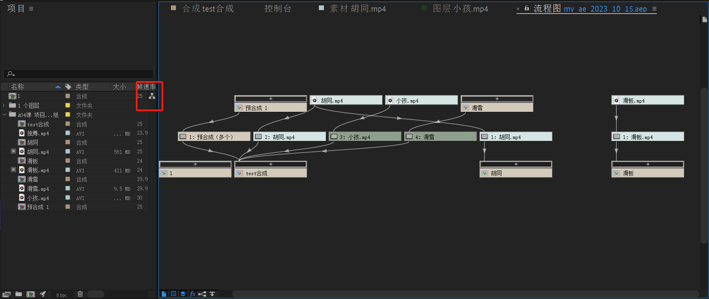

# 1.查看器类型

## 1.1.合成查看器

在项目面板中双击合成即可出现。

## 1.1.合成查看器功能区

不过有关合成查看器的功能区有很多，下面简单介绍一下。

从左到右：

1.   始终预览此视图
2.   主查看器
3.   沉浸式环境
4.   放大率弹出式菜单：用于设置视图的放大比率
5.   选择网线和参考线选项：设置安全区和参考线
6.   切换蒙版和形状路径可见性：开启和关闭用于显示或者隐藏蒙版路径和形状路径的数学模型
7.   转到时间
8.   拍摄快照
9.   显示快照
10.   显示通道及色彩管理设置
11.   分辨率/向下采样系数弹出式菜单：用于设置当前合成的预览分辨率，这里只是设置预览的分辨率，和导出结果无关（数值越小越模糊）
12.   目标区域：选中可以框选只想看到的部分合成画面
13.   切换透明网格
14.   `3D`视图弹出式菜单
15.   选择视图布局：用在`3D`的比较多
16.   切换像素长宽比校正
17.   快速预览
18.   时间轴
19.   合成流程图
20.   重置曝光度：只会影响预览的曝光度，和导出结果无关

## 1.2.合成查看器预览面板

## 1.2.素材查看器

在项目面板中双击素材即可出现。

## 1.3.图层查看器

在时间轴面板中双击图层即可出现。

## 1.4.流程图查看器

单击项目右侧的流程图按钮即可出现。

# 2.时间轴面板

