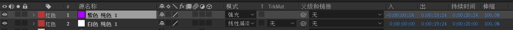

[TOC]

`AE`的合成内包含多个图层，排列在时间轴面板里，因此我们有必要深入学习图层，才能更加升入理解合成。

# 1.图层导入

首先我们需要将素材导入到合成内成为新的图层，只需要将素材从项目中拖拽到项目的合成素材，然后用时间轴打开合成素材即可（或者直接在时间轴打开某个合成素材，然后拖拽一个素材到时间轴的图层处即可）。

# 2.图层选择

为了方便我们做剪辑，我们需要选择图层进行相应的处理，我们可以直接鼠标`[左击]`选中单个图层或者`[左击+拖拽框选]`多个图层。或者按`[shift+左击1+左击2]`可以选中连续的多个图层，按`[ctrl+左击]`可以选中不连续的多个图层。

根据图层对应的需要，按住相应的`[数字键]`，例如：对于图层`13`，快速按下`[1+3]`即可选中该图层（但是这个功能只有在那些具有小键盘的电脑才可以使用）。

也可以使用快捷键`[ctrl+↑/↓]`选中一个图层，这个快捷键还可以和`[shift]`组合使用。

# 3.图层顺序

图层的顺序和渲染结果直接相关，可以直接使用鼠标拖拽达到他调整图层的目的，

# 4.图层复制

复制一整个图层很简单，只需要先选中某个图层然后直接使用`[ctrl+C/V]`复制粘贴即可，当然如果您只希望在一个合成内部进行图层的复制粘贴而不涉及到其他图层，则可以使用`[ctrl+d]`复制粘贴（创建副本）。

# 5.图层拆分

选中需要分割的图层，将时间指针挪到想要切割的时间点，然后使用`[ctrl+shift+d]`切割图层，我们可以看到`AE`虽然允许图层进行拆分，但是会将一个图层拆成两个图层。

# 6.图层混合

混合模式可以控制上层和下层的融合效果，和`PS`的混合模式很类似。

# 7.图层功能

1.   隐藏：点击“眼睛”即可隐藏视频，`[ctrl+shift+alt+v]`
2.   静音：点击可以静音
3.   独奏：在预览和渲染中只会包含这一个视频
4.   锁定：防止图层出现变更
5.   标签：图层的序号
6.   消隐：以后提及
7.   折叠：以后提及
8.   质量和采样：以后提及
9.   效果：以后提及
10.   帧混合：以后提及
11.   运动模糊：以后提及
12.   调整图层：以后提及
13.   `3D`图层：以后提及
14.   混合模式：控制图层的混合模式，可以产生不同的融合效果
15.   保留基础透明度：以后提及
16.   轨道遮罩：以后提及
17.   父级和链接：在不同的图层之间建立父子关系

# 8.图层属性

锚点（`[a]`）、位置（`[p]`）、缩放（`[s]`）、旋转（`[r]`）、不透明度（`[t]`）

# 9.图层类型

1.   文本层（`[ctrl+shift+alt+t]`）
2.   纯色层（`[ctrl+y]`）
3.   灯光层（`[ctrl+shift+alt+l]`）
4.   摄像机层（`[ctrl+shift+alt+c]`）
5.   空对象层（`[ctrl+shift+alt+y]`）：常作为父级使用，达到分组的目的
6.   调整图层（`[ctrl+shift+y]`）：调整图层对处于下面的图层起统一效果，对上层图层没有影响

# 10.图层样式

可以右击图层选择图层样式

# 11.图层实战

由于图层的使用在静态层面上和`PS`极度相似，因此下面实战的目的仅仅是为了熟悉`AE`的操作，并且复习一些`PS`的知识。

## 10.1.沙漠片头

## 10.2.旧书店广告

## 10.3.啤酒海报

## 10.4.宇航员广告