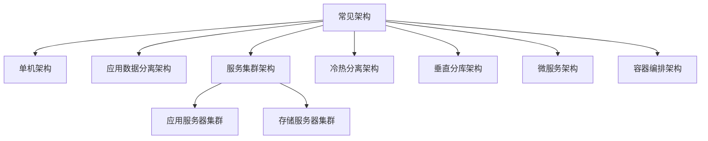
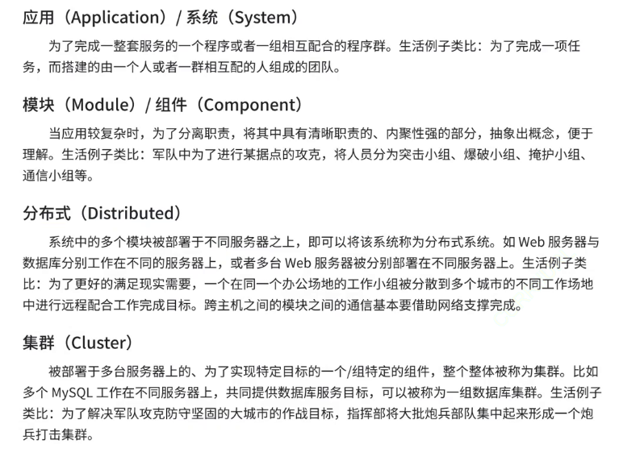
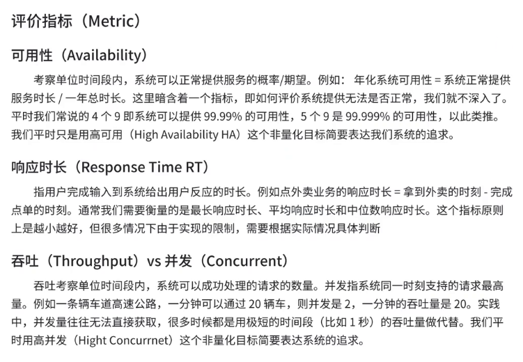

# 1.高并发架构的演进

本系列以 `电子商务应用` 为例，介绍从一百个到千万级并发情况下服务端的架构的演进过程。

1.   **单机架构**：在一个服务器上启动运用服务，并且将数据存储在数据库中，甚至可以把数据库模块移除直接做出上层应用，这种模式是很多中小公司采用的模式，哪怕只有一台主机，其性能也可能非常稳定，多购买主机的成本也随之降低，并且很多服务的用户量也达不到使用更高级架构的门槛。

2.   **应用数据分离架构**：如果业务用户量增长，一台主机难以应付（尤其是同一时刻处理的请求变多），因此就需要引入更多的主机（硬件资源，尤其是 `CPU`、内存、硬盘、网络带宽...），这种情况一般使用两种类型的方案，也就是开源节流（增加收入，节省开支）

     -   开源：简单粗暴，增加更多高级硬件资源
     -   节流：复杂优雅，通过性能测试优化代码

     可以应用服务器和存储服务器，针对两种服务器的特点做不同的配置（前者可能需要更多的 `CPU` 和内存资源，后者可能需要更多的硬盘资源）。

3.   **应用服务器集群架构**：如果引入更多的应用服务器，形成一个服务器集群，因此就可能对用户请求做负载均衡，`Nginx` 就在这里得到了应用，让每个服务器瓜分大量的请求，降低每一台机器的压力（和多线程的思路很类似）。

     而这里最重要的就是负载均衡器，有很多负载均衡算法（最简单的就是轮询分配来分配请求），需要注意，负载均衡器对请求量的承担能力要远远高于应用服务器，处理一个请求只是进行分配，而不完成请求对应的动作，对应的资源消耗也较少。

     当然，如果负载均衡器也撑不下去了，就可能再引入更多的负载均衡，不过这同时也会提高管理成本。

     另外，该架构也可以提高系统的可用性，一旦某个应用服务器故障，负载均衡则可以实时调配，将故障服务器的任务临时转移给其他服务器。

4.   **存储服务器集群架构**：当然，如果引入的大量应用服务器，就有可能导致存储服务器的压力同样上升，如果同样进行开源操作，就需要引入更多的存储服务器，并且做读写分离，例如一台主存储服务器（`master`）只做写入操作，而从数据库（`slave`）只做读取操作。

     主数据库也会实时把数据同步到从数据库中，并且一般实际开发中，读操作会比写操作更多。因此就有可能引入更多的从服务器，形成一主多从的存储服务器集群。

     同时从数据库还可以通过负载均衡的方式，让应用服务器进行访问。

5.   **存储服务器冷热分离**：但是数据库有个问题，终究是要面对响应速度的问题，可以把用来读取的数据进行“冷热”区分，热数据存储在缓存服务器中，而冷数据存储在从存储服务器中。

     而缓存服务器所能存储的热数据一般也较少，速度也较快，`Redis` 就可以在这里被得到应用。

     有些时候，也会让 `Readis` 存储全量数据，这样的数据不能被丢弃。也可以给 `MySQL` 作辅助，存储部分数据，哪怕 `Redis` 的数据没有了也可以再加载回来。

6.   **垂直分库分表**：如果一个存储服务器还是不够存储，就可以考虑将多个 `database` 划分给不同的存储服务器，让一个存储服务器只拥有一个或部分的 `database`，甚至可以拆分 `table` 也就是所谓的分库分表。因此一个存储集群对应一个完整的数据库服务，内含多个数据库存储服务器或数据表存储服务器（当然，也需要结合实际的业务）。

     >   注意：如果迫不得已选择开源然后引入分布式，系统的复杂度大大提高，出 `BUG` 的概率就会更高。引入新特性的方便，往往会带来新的暗含的代价。

7.   **微服务架构**：如果进一步优化，就会诞生微服务，每个微服务设置一整套应用集群、缓存集群、存储集群，一个微服务交给一个团队开发维护。而多个微服务之间就可能需要设置相关的公共服务和数据隔离，例如安全中心、监控预警中心等（微服务本质是为了解决人的问题，可以让更多的人力资源进行运用，因此微服务可以说是把人力资源也考虑进去了，因此小公司是很难直接使用这种架构的，只能租用大厂的微服务技术）。

     当然这种做法提高了协作效率，但是也变相降低了一些性能，并且也更加复杂了，需要更多的运维团队进行专门的服务器资源监控。

     当然，如果使用微服务，在技术领域上也可以提高功能复用的效果，并且可以给不同的服务进行部署。

>   补充：还有一些补充的概念
>
>   
>
>   分布是在物理上的，集群是在逻辑上的，不过多数情况也混用。
>
>   
>
>   
>
>   
>
>   分布式系统就是为了引入更多的硬件资源。