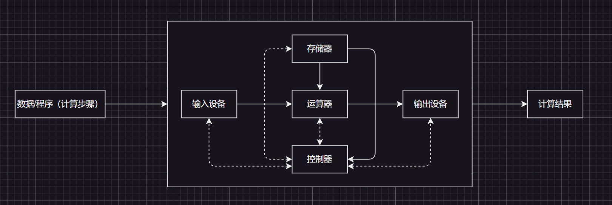
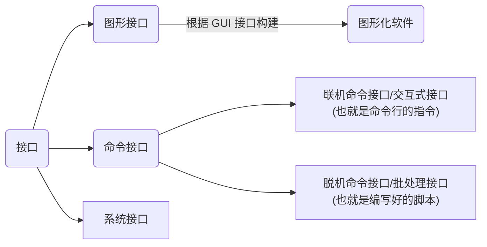
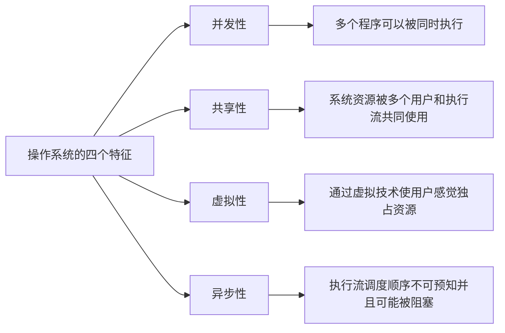
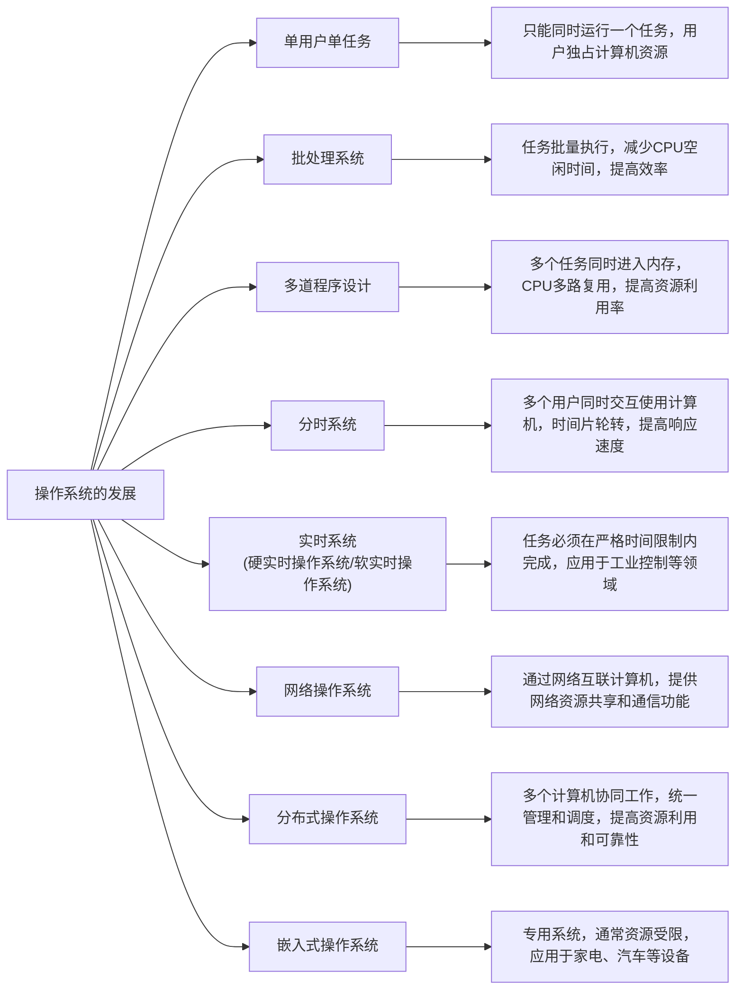
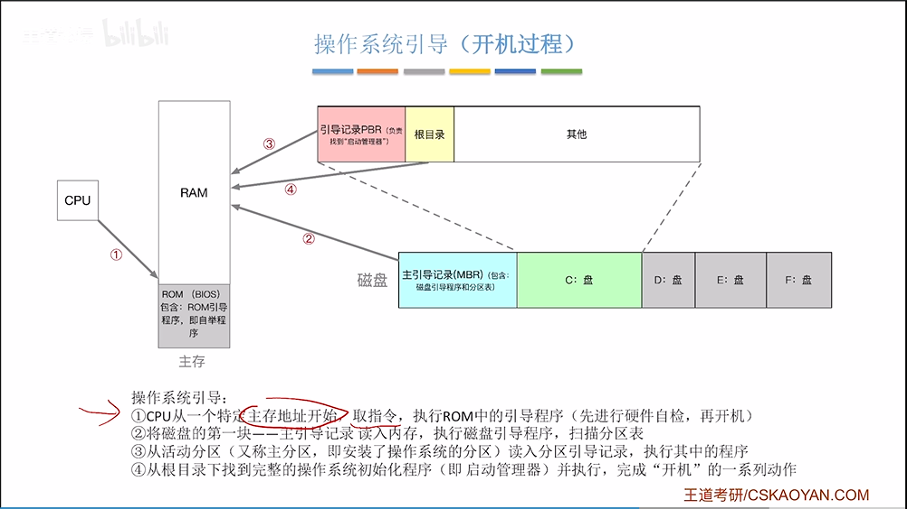
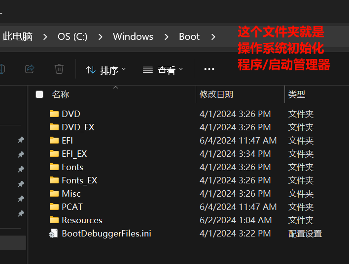
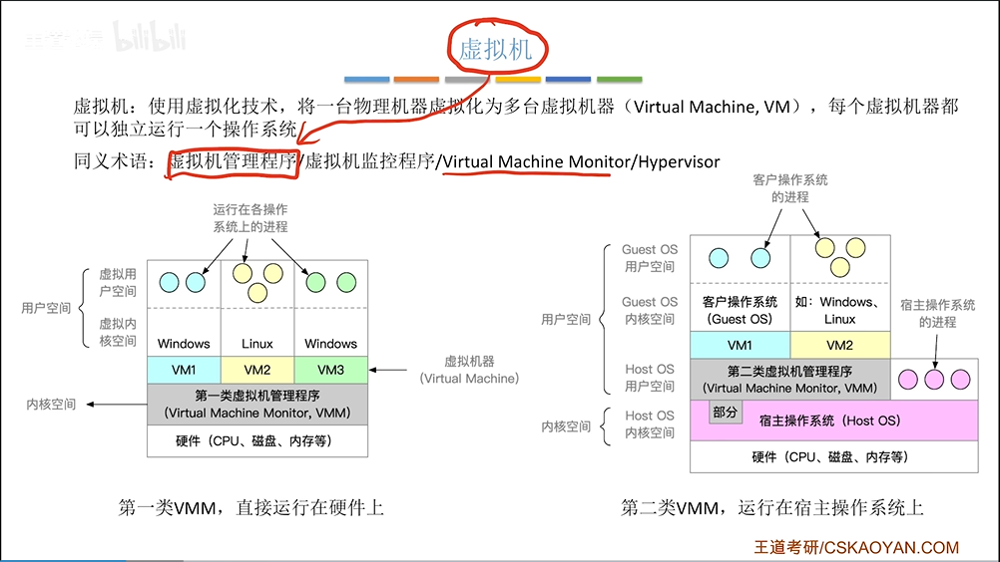
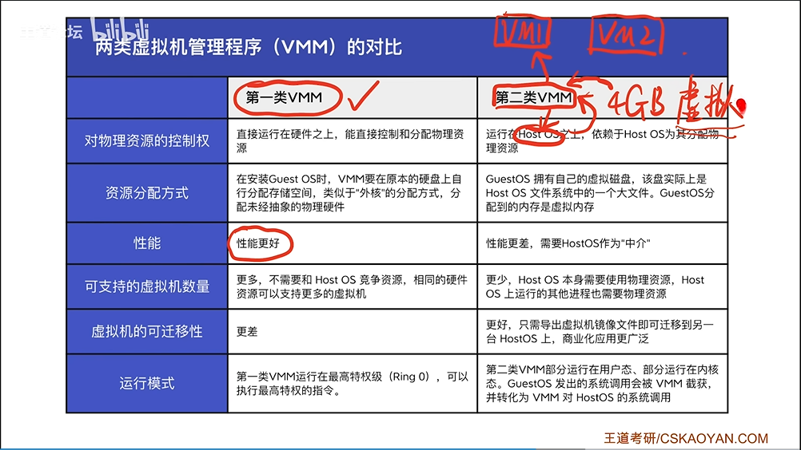

>   前要：这一部分的内容是前面的指令实操和后续原理学习的过渡知识，可以简单了解一下。

# 1.冯·诺依曼计算机体系

关于冯·诺伊曼系统，在这里我只是简单讲一讲，更加详细的内容可以看我的计算机组成系列。

常见的笔记本、台式机，不常见的服务器、工作站，大部分都遵守“冯·诺依曼体系”，因此该计算机体系就是现代计算机的哲学指导。 

## 1.1.早期冯诺依曼体系

## 1.2.现代冯诺依曼体系

> 注释 `1`：实线为数据传输线，虚线为控制线。
>
> 注释 `2`：这里的存储器指的是内存，因此个人觉得这个存储器不太严谨，但是碍于很多教科书都是如此书写，只能得续用。
>
> 注释 `3`：磁盘设备其实反倒是可以理解为输出设备，因为文件数据是会写到磁盘内部的……同理磁盘也可以作为输入设备使用。
>
> 注释 `4`：控制器的作用是响应外部事件，比如：拷贝数据到内存，实际上控制器做的很多事情都是把一个数据移动到某个位置。
>
> 注释 `5`：输入设备到内存的步骤为 `input`，内存到输出设备的步骤为 `output`，也就是 `I/O` 的过程，因此程序要运行，也就必须要加载到内存中。 
>
> 注释 `6`：实际上很多的硬件设备都是具有存储数据能力的，只不过是存储量的大小不一罢了。而所谓的硬件之间进行交流，也就是利用各个硬件中的存储空间，来进行数据的拷贝/迁移。
>
> 注释 `7`：`SSD` 是固态硬盘，比磁盘的读写速度快，但是价格也比普通的磁盘要贵，因此有很多企业还会购买大量的磁盘来使用，减少成本（一般存储效率高的存储硬件要更贵）。
>
> 注释 `8`：现代很多的 `CPU` 只能对内存进行读写，不能直接和外设（输入输出设备）进行数据交流。根据“木桶效应”，由于速度最慢的就是 `CPU` 和外设直接数据交互，导致整机效率降低（所以 `CPU` 一般为了高效，一般只和内存打交道）。
>
> 注释 `9`：内存可以理解为大的缓存空间。

# 2.操作系统的相关术语

2.1.OS 的概念
---------

为了使计算机更好发挥每一个硬件的最大功能（更好符合冯诺依曼结构，提高硬件交互效率），现代的许多计算机内部都包含一个基本的程序集合，称为操作系统（即 `OS`），最基本的操作系统至少应该包括：

1. 内核（进程管理、内存管理、文件管理、驱动管理）

2. 其他程序（函数库、`shell` 外壳程序等）

2.2.OS 的目的
---------

`OS` 是一款“搞管理”的软件，主要目的是“管理硬件和软件”。和面向对象语言类似，操作系统必须“先描述被管理对象，再组织被管理对象”，进而实现：

1. 和硬件交互，协调管理所有的软硬件资源
2. 为用户程序（应用程序）提供一个良好的执行、开发环境

> 补充：在 `C` 语言中，实际体现管理和组织时：
>
> 1. 管理：使用 `struct` 结构体来描述硬件或者软件
> 2. 组织：使用链表等高效数据结构组织 `struct` 结构体的实例化

2.3.OS 的管理
---------

那么 `OS` 的“管理”具体的结构是怎么样的呢？下面有一张图您可以简单看一下。

下面这张图有点错误，需要修改一下，待补充...

> 补充 `1`：系统调用和库函数的概念
>
> 1. 在开发角度，操作系统对外会表现为一个整体，但是会暴露自己的部分接口，供上层开发使用，这部分由操作系统提供的接口，叫做系统调用。
>
> 2. 系统调用在使用上功能比较基础，对用户的使用要求比较高，开发者可以对部分系统调用进行适度的封装，从而形成了库（例如 `C` 库）。有了库，就有利于上层用户或者开发者进行调用开发，也就是通过库来间接调用系统调用。
>
> 3. 需要注意系统调用的运行过程是在内核态中完成的，操作系统不允许用户直接访问内核，也就是说用户运行态不满足访问内核的权限
>
>     >   用户态和内核态是指操作系统中的两种不同的运行模式，其中：
>     >
>     >   1.   用户态是指进程在执行自己的代码时所处的非特权模式
>     >   2.   内核态是指进程需要执行特权代码时所处的特权模式
>     >
>     >   在用户态下，进程只能访问自己的地址空间和所分配的资源，例如磁盘文件、网络端口等，无法直接访问系统资源或进行特权操作，例如修改内存映射表、修改硬件设备配置等。此外，在用户态下，进程只有一部分 `CPU` 指令集和系统调用可以使用，不能直接访问操作系统内核的数据结构和函数。
>     >
>     >   当进程需要进行特权操作或访问受保护的内核资源时，例如进行文件读写、网络通信、进程管理等，就需要通过系统调用（`System Call`）向操作系统提出请求。这时进程会从用户态切换到内核态，操作系统会为其执行相应的特权操作，并返回结果给进程。在内核态下，进程可以访问操作系统内核的所有资源和功能，包括修改内存、访问硬件资源等。
>     >
>     >   总之，用户态和内核态的主要区别在于进程所处的权限和可用指令集。在用户态下，进程只能访问自己的资源，不能直接访问系统资源或进行特权操作，而在内核态下，进程具有访问操作系统内核的所有权限和功能。操作系统通过切换进程的运行模式来限制或扩展进程的访问权限，以保证系统的安全性和稳定性。
>
> 补充 `2`：`Linux` 内核内部有很多驱动程序，基本都是用 `C` 语言写的，也有少部分使用汇编（这部分连偏向底层的 `C` 都没有办法书写）。

上面这张图您可能只知道表面，无法知道更加深层次的细节，但是在以后的学习中，您就会逐渐体到这张图的意义。

而操作系统除了在底层对这四者进行管理，也需要和上层用户进行交互，方便用户借操作系统之手来操作底层硬件。因此就需要对外暴露简单易用的接口（这是相对于硬件来说简单的...），根据使用接口场景我简单分为了以下三类接口。

## 2.4.OS 的内核

## 2.5.OS 的结构

[这一节可以再听一下还挺有趣...](https://www.bilibili.com/video/BV1YE411D7nH?p=9&spm_id_from=pageDriver&vd_source=c92c89dbfcf9cc30c48086469621f35b)

## 2.6.OS 的特征

>   区别：并发和并行的区别。可以利用单核机器和多核机器进行区分，使用单核机器实现多执行流同时运行就是一个核心通过不断的执行流交替切换模拟实现，而多核机器则直接把不同的执行流分配给多个核心。这里的核心指的是 `CPU`。

## 2.7.OS 的发展

## 2.8.OS 的引导

[引导程序可以再看一下](https://www.bilibili.com/video/BV1YE411D7nH?p=10&spm_id_from=pageDriver&vd_source=c92c89dbfcf9cc30c48086469621f35b)

其实就是一个开机过程...

## 2.9.OS 的虚拟

