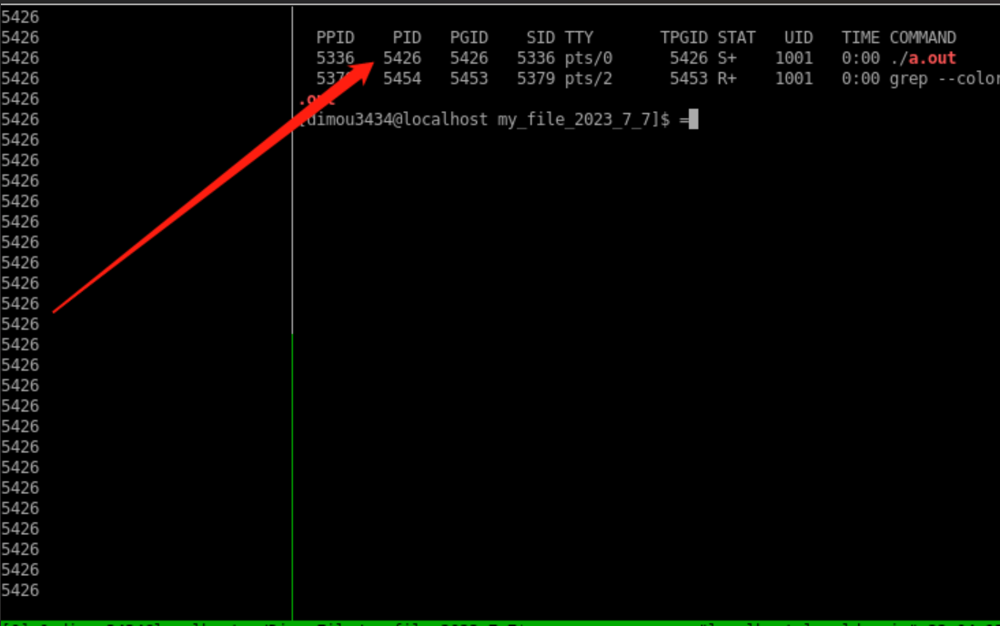
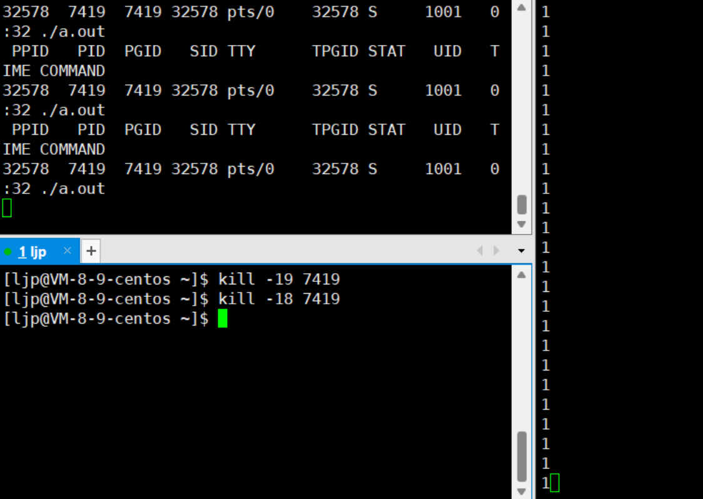
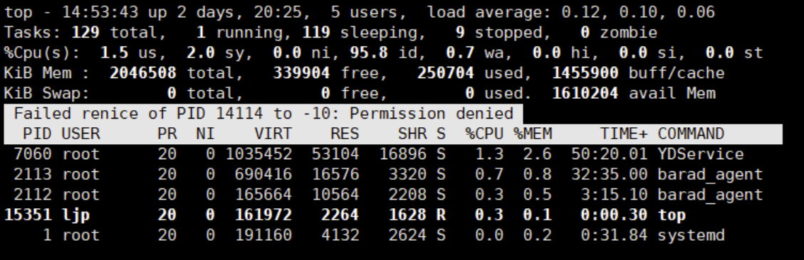
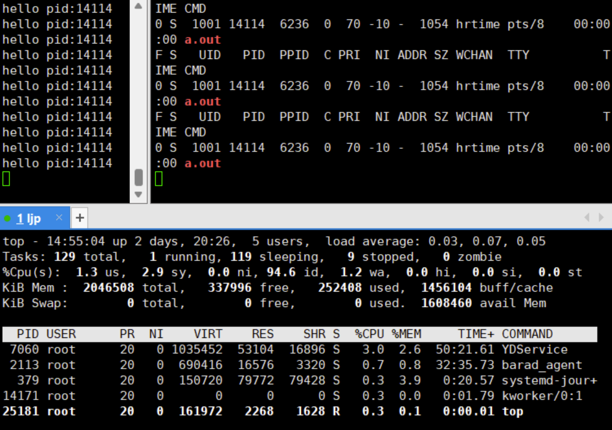

**叠甲：以下文章主要是依靠我的实际编码学习中总结出来的经验之谈，求逻辑自洽，不能百分百保证正确，有错误、未定义、不合适的内容请尽情指出！**

[TOC]

>   概要：...

---

# 1.进程概念

我们启动一个软件，本质就是启动了一个进程。在 `Windows` 下如果我们启动了某个应用程序，然后打开资源管理器（常见的快捷键是 `[ctrl+alt+delete]`，或者直接打开系统的“搜索”输入“资源管理器”点击即可打开）就可以看到有一个对应的软件出现在进程列表中：


实际上运行程序的时候，程序中的数据和代码就会加载到内存中，然后创建出一个进程，上述资源管理器里显示的就是进程列表。

> 补充：这也就是为什么应用运行的多的时候，有些软件会变卡甚至崩溃的原因。因为内存上堆满了大量进程，而一条空间大小有限的内存条，一次性加载太多软件，会导致内存空间溢出，有的进程无法被获取所有的数据而正确运行，最后造成软件崩溃或者静止不动的状态。

而在 `Linux` 下运行一条命令 `./某可执行文件`，和 `Windows` 双击点击图标运行程序是类似的，也会将程序加载进内存中，最终转化成“进程”。实际上程序被加载到内存中后，就不能简单叫作“程序”了，而应该叫“进程”才对（这个原因后面解释）！`Linux` 也可以同时加载多个程序，也就是可以同时运行多个进程在系统中。

由于系统中存在大量的进程，那么操作系统就必须要管理好这些大量的进程。那么 `Linux` 是怎么管理这些进程的呢？实际上也是“先描述再组织”。

>   补充：多个进程可以构成“作业”，一个作业至少由一个进程组成。

>   补充：一个程序可以被多次运行，产生多个进程。

# 2.进程管理

操作系统会给每个加载进内存的程序申请一个结构体，也就是 `PCB` 数据结构（全称 `Printed circuit board` 进程控制块），这个结构体内部保存了代码和数据的属性。

有了这个结构体来描述进程，将来就可以定义出相应的进程对象，而我们可以把这些对象使用链表的方式连接起来，也就将进程组织起来了。

>   补充：上述链表就是一个进程队列，但是实际上不一定呈现出链表的形式，其他操作系统也可能使用其他数据结构混杂起来管理，这里只是为了好理解一种粗略说法。不过，`Linux` 内核采用的是确实双链表实现。

因此对进程的管理转化为了对 `PCB` 结构体的管理（也就是“增删查改”）。

因此什么是进程呢？**进程 = 对应的“代码和数据”+形成的“PCB 结构体”**，如果再专业化一些就是 **进程 = 代码段 + 数据段 + PCB 实例化**。

>   警告：有很多人会误认为程序加载进内存就成为了进程，这种理解有些不太准确。一定要带上对 `PCB` 的理解...

计算机管理的也不是直接管理程序的数据，而是这些对象，每一个 `PCB` 对象就代表一个进程。

接下来让我们来看看 `PCB` 具体是什么样的。不同的操作系统对 `PCB` 的具体实现不一样，`Linux` 里的是 `task_struct`，`task_struct` 是 `Linux` 内核级别的结构体。

>   注意：也就是说 `PCB` 只是一个操作系统概念，具体实现要看操作系统的内核代码。

我们可以查看一下 `Linux` 的内核实现，关于 `Linux` 内核源代码，您可以访问 [Linux 的官网来获取源代码](https://git.kernel.org/pub/scm/linux/kernel/git/stable/linux.git/?h=v6.5.4)，不过文件可能有点大（您可以选择一些较低版本的）。

```cpp
task_struct{/*...*/};
```

这个结构体内部会包含以下成员：

1. 标识符 `PID`：描述进程的唯一标识符，区分于别的进程

2. 状态：任务状态、退出代码、退出信号等

3. 优先级：相对于其他进程的优先级，优先级高的进程会先被 `CPU` 调度（调度就是进程能被 `CPU` 进行计算，进程们被计算的先后顺序被称为“调度顺序/进程调度”）

4. 程序计数器：程序中即将执行的下一条指令的地址（一个进程不可能长时间占用 `CPU`，否则整个系统看起来就像“卡”住了一样。因此进程被 `CPU` 计算到一定程度时，就有可能被 `CPU` 暂时停止计算并且退出，而下一次进程又加载进来的时候，只需要查看程序计数器，直接到达还未被 `CPU` 计算的指令处，而不必从头开始执行指令）

5. 内存指针：包含“程序代码指针”和“相关数据指针”，还有和其他进程共享的“内存块指针”

6. 上下文数据：主要是进程执行时处理器的寄存器中的数据

7. `I/O` 状态信息：包含显示的 `I/O` 请求，分配给进程的 `I/O` 设备和被进程使用的文件列表

8. 记账信息：可能包含处理器时间总和、使用的时钟数总和、时间限制、记帐号等

9. ...

>   总结：`PCB` 对象和 `PCB` 队列
>
>   当我们运行某一个软件时，操作系统把软件的代码和数据加载进内存，同时创建 `PCB` 实例化对象，描述这个软件转化成的进程就会开始运行。
>
>   当我们退出某一个软件时，操作系统把软件的代码和数据切换出内存，同时销毁 `PCB` 实例化对象，对应这个软件转化成的进程就会进行退出。
>
>   而操作系统同时管理多个进程时，就需要利用某些数据结构进行增删查改。

# 3.进程操作（一）

本节主要是侧向进程的使用，而 [进程操作（二）](#9.进程操作（二）) 更倾向于操作的原理和底层调用，并且更加细化。

## 3.1.进程查看

1. 查看正在运行的进程可以使用 `ps -axu`，该指令详细全面列出正在运行进程的信息（较常用）

    >   `ps` 命令是用于默认显示当前用户正在运行的进程信息的工具。它提供了多种选项来控制输出的格式和内容。下面是一些常用的 `ps` 命令选项以及它们的解释和示例：
    >
    >   -   `-a` 显示有控制终端的所有进程
    >   -   `-x` 还会多显示出无控制终端的所有进程
    >   -   `-u` 在显示的同时带上不同进程的启动用户
    >   -   `-j` 选型以作业格式显示如下表格进程信息
    >   -   `-l` 命令会显示长格式信息，包含了更多信息
    >
    >   
    >
    >   实际上我个人会喜欢使用 `ps -axu`，因为 `-j` 实际上是 `BSD` 风格的选项，但是 `U` 是 `UNIX` 风格的选项。而 `-l` 会在查看 `nice` 值中使用，后面再提及 `nice` 值是什么。
    >
    >   不过上面选项中，貌似在 `Linux Ubuntu` 中只能 `-ax` 选项配合 `-u/-j/-l` 其中一个，无法混用...

2. 也可以使用 `top/htop` 指令（类似 `Windows` 下的资源管理器），可以同态观察进程的状态

3. 进程的信息也可以直接通过 `/proc` 系统文件夹查看。例如：要查看 `PID` 为 `1` 的进程属性和信息，就可以查看 `/proc/1` 这个文件夹，查询其他 `PID` 的进程也是一样的。

    >   
    >
    >   * 该文件内部有一个 `exe` 链接文件，链接的地方指向的是可执行程序的地址（这意味着进程可以知道自己的源文件所在地）。这里有一个有趣的现象值得注意：当我们运行某个 `C` 程序后，如果把该程序 `exe` 指向的源文件和可执行程序删除，那么该进程有时依旧可以正常进行。这是因为代码和数据已经被加载进内存形成进程，进程启动后已经和源文件、可执行程序无关了，除非需要重新启动进程。
    >   * 还有一个 `cmd` 链接文件，`cmd` 是指向进程的当前工作目录，这也可以解释一些 `C` 语言函数的现象：如果在 `C` 程序中使用 `fopen()`，第一个参数只使用了文件名字，默认打开的就是当前工作路径下的这个文件，所谓“当前工作路径”也就是这个 `cmd` 指向的位置。而每当代码被编译运行后，每个进程都会有一个属性，来保存自己所在的工作目录，由 `cmd` 来链接。
    >
    >   对于 `Linux` 来说，进程是以文件的形式给出的，因此 `proc` 目录也必然是一个动态存储目录，内部文件经常发生变动。

## 3.2.进程标识

我们还可以在 `C` 代码中获取本进程的标识 `ID`，这样就变相获得了一个进程。需要注意的是，`C` 代码内所有的函数都只有在程序转化为进程的时候才会被调用，因此系统接口 `getpid()` 也只有在程序转化为进程的时候才会获取到本进程 `PID`。


运行代码后就会得到左侧的输出，这个时候我们验证一下进程的 `PID` 是否符合：



除了 `gitpid()` 还有一个 `gitppid()` 的调用，这个系统调用可以获取当前进程的父进程 `PPID`，这里如果我们利用 `ps` 命令就会发现这个 `PPID` 实际上就是 `bash`。一般情况下，使用系统命令和运行我们自己编写的程序所产生的进程，其父进程永远都是 `bash`。

我们把代码改 `getpid()` 为 `getppid()` 再运行代码就可以获取 `bash` 的 `id`，也就是您代码转化为进程的父进程 `id`。

## 3.3.进程杀死

这里只给出如何使用信号来杀死进程，而不讲解信号的原理。

结合上述的进程 `pid`，使用 `kill -9 <PID>` 可以杀死进程标识为 `PID` 的进程。`-9` 实际上是一个信号，即：给目标文件传递 `9` 号信号，这里关于信号的知识我们以后还会再提及。

我们还可以尝试杀死父进程 `bash`。执行后就可以发现，`bash` 已经没有办法正常工作了，有的时候甚至会直接退出 `bash` 界面（奔溃）...

需要注意的是，父子进程是独立运行的。

>   补充：`killall <信号> <进程名字>` 有时会比使用 `kill` 方便一些。如果一个软件会使用多个进程，则可以使用 `pkill -9 <进程名字>` 将对应的进程全部杀死。不过注意，别随便乱用这些指令，除非您很清楚自己在做什么... 

## 3.4.进程创建

除了运行可执行程序来创建进程（`Linux` 使用命令来创建进程，`Windows` 使用鼠标点击快捷方式创建进程），我们还可以在代码中指使进程创建子进程。在 `C` 代码内可以使用 `fork()` 函数来创建子进程，但是这个 `fork()` 对比其他的普通函数会显得比较奇怪：失败返回 `-1`，成功的时候具有两个返回值（你没看错，两个返回值）：

1. 给父进程返回子进程的 `pid`

2. 给子进程返回 `0`

```cpp
// 简单使用 fork()
#include <stdio.h> 
#include <unistd.h> 
#include <sys/types.h>
int main() 
{
    // fork 之前是父进程     
    printf("1.进程PID：%d 父进程PPID：%d\n", getpid(), getppid());
    printf("father-you can see me!\n");
    printf("father-you can see me!\n");
    printf("father-you can see me!\n");
    // fork 之后就会创建一个子进程，具有和父进程同样的代码     
    fork();

    printf("father-child-you can see me!\n");
    printf("2.进程PID：%d 父进程PPID：%d\n", getpid(), getppid());
    sleep(1);
    
    return 0;
}
```

一般而言，`fork()` 之后的代码是父子共享的（两者都可以看到/使用），同时运作的。但我们真正需要的不是让父子进程（任务）做一样的事情，而是父进程做一部分，子进程做另外一部分，以此来提高运行的效率。因此根据 `fork()` 的返回值，我们可以这么像下面这样编写代码。

```cpp
// 使用 fork() 提高代码效率
#include <stdio.h> 
#include <unistd.h> 
#include <sys/types.h> 
int main()
{
    // fork 之前是父进程
    printf("进程PID：%d 父进程PPID：%d\n", getpid(), getppid());
    pid_t id = fork();
    // 从这里以后父子进程的代码都是共享的，会根据 if 来做调整
    if (id < 0)
    {
        // 进程创建失败    
        perror("fork");
        return 1;
    }
    else if (id == 0)
    {
        // 子进程做的事情
        while (1)
        {
            printf("I am child,PID:%d PPID:%d\n", getpid(), getppid());
            sleep(1);
        }
    }
    else
    {
        // 父进程做的事情
        while (1)
        {
            printf("I am father,PID:%d PPID:%d\n", getpid(), getppid());
            sleep(1);
        }
    }
    printf("you can see me!\n");
    sleep(1);
    return 0;
}
```

这个时候您的第一份真正意义上的多进程代码就出来了（虽然并没有做什么事情...），我们运行代码时就会发现，两个父子进行循环是同时进行的！如果我们使用 `ps` 不断测试，就会发现的确存在两个进程，并且两者的 `PID/PPID` 呈现父子关系。


那么为什么 `pid_t` 这个 `C` 语言变量会有两个值？这“不符合”我们以前的学习逻辑，难道一个内存空间中存储了两个值？这个现象我们在进程的地址空间中再来解答，现阶段只要知道怎么使用 `fork()` 就可以了。

不过我们可以先来理解一个问题：为什么设计为子进程返回 `0`，父进程返回子进程的 `PID` 呢？因为父进程需要得到子进程的 `PID` 来进行管理，子进程只需要知道是否被建立成功就可以。

父子进程哪一个先运行呢？这是由操作系统的调度器决定的。计算机内有大大小小的进程，数量极多。为了方便管理交给 `CPU` 调度，会以某种数据结构形成调度队列，由操作系统查看 `PCB` 中的调度信息还有调度算法来决定先调度哪一个进程，因此父子进程谁先被调度，对于用户来说是不确定的。

关于杀死进程和创建进程的更多细节，我们在后面还会再重新理解，这里提前提及只是为了让您更快上手一些简单的进程操作。

# 4.进程状态

我们之前讨论的进程是一个动态概念，而其某一时刻的状态就被称为进程实体/进程映像，这个您简单了解一下即可。而这一节我要给您解释的就是进程映像的不同状态，简称“进程状态”。

## 4.1.进程状态理论

### 4.1.1.粗略理解

所谓进程状态和状态切换，可以使用类似下面的代码来理解：

```c++
// 状态的代码理解
#define NEW 1			//状态 1
#define RENNING 2		//状态 2
#define BLOCK 3			//状态 3
//...
pcb->status = NEW;		//将进程 PCB 内的状态变量设置为状态 1
//...
if(pcb->status == NEW)	//判断不同状态的进程，执行一些不同状态下的操作
{/*..*/}			
```

注意这种状态的切换是一气呵成的，专业术语也叫“原子操作”，必须保证状态的转化要么不转，要么彻底转换完成。我之后也会帮助您理解原子的概念。

>   补充：这种切换是使用关中断和开中断实现的，也就是关闭中断机制后进行切换后，再打开中断机制，这点您简单了解一下即可。

到此我帮您建立起对进程状态的一个粗略认知，接下来我会帮您建立更加详细的理论体系，需要注意的是不同地方在某些说法上有些许不同，这对您来说可能会造成一些阅读困难。

### 4.1.2.深入理解

在计算机系统理论上，对于单核 `CPU` 来说（这里不考虑多核），为了提高效率，会配备一个属于自己的调度队列/运行队列，这个队列也会被描述起来，假设描述为 `struct runqueue{/*...*/};`。

里面会包含锁、字段等信息（很多东西，但是我们先不理会），还有存储了进程的个数 `count`，以及还有一个 `pcb*` 的指针，指向一个 `PCB` 结构体数据结构（有可能是链表，只需要将所有运行起来的进程串起来就可以）


1.   **运行状态**：`CPU` 在调度进程的时候就是依靠这个 `struct runqueue{/*...*/};` 的，只需要调用 `pcb` 指针指向的数据结构（链表），就可以访问所有的进程。 ==因此只要在运行队列中的进程，就可以称进程处于”运行状态“==（在老的系统中，只有进程放在 `CPU` 中开始执行才算是”运行状态“，但是现代系统不是这样，而是进程放入运行队列即可。

     因此对于现代系统来说：”创建/新建“、”就绪“、”执行“这三种进程状态已经没有太大的区分了），而 `pcb` 指向的一串正在等待 `CPU` 资源的进程就是”运行队列“。

     再次强调，运行状态不是指该进程正在被 `CPU` 计算中，只有老系统才这么定义。另外，多核的情况下，就存在多个”运行队列“。

2.   **就绪状态**：该状态表示进程已经从非 `CPU` 设备那里获取到了资源，已经准备好摆 `CPU` 执行，但由于 `CPU` 正在执行其他进程，该进程暂时无法获得 `CPU` 时间（也就是无法获取可以在 `CPU` 中运行的时间，简称“时间片”）或者说无法获取 `CPU` 资源，这种状态就是”就绪状态“。也就是说，==在运行队列中除了正在 `CPU` 中运行的进程，运行队列的其他进程都处于”就绪状态“==。

3.   **阻塞状态**：系统中不只存在 `CPU` 资源，还有网卡、磁盘、显卡、键盘等其他设备资源。而这些资源往往有限，进程又太多，每一个进程需要这些资源。这个时候有的进程在被 `CPU` 计算之前，==需要先去访问其他非 `CPU` 资源，因此我们称这个进程处于“阻塞状态”==。

     而这一串正在访问某个非 `CPU` 资源而暂时无法被 `CPU` 执行的进程所组成的队列也被称为“阻塞/等待队列”，多个非 `CPU` 设备就有多个阻塞队列。比如：在 `C` 语言中使用 `scanf()` 函数的时候，不可能让 `CPU` 一直在等待它输入。`CPU` 此时去调动其他进程了，而 `scanf()` 此时处于阻塞状态，一直在等待输入设备资源的输入。

     在有些时候下载会”卡住“就是为了等待网络资源，此时也是处于阻塞状态。而如果操作系统察觉到该进程已经访问好非 `CPU` 资源了，因此将其链接到”运行队列“中，这就是所谓的”将该进程唤醒“。

4.   **挂起状态**：如果 ==内存即将被占满，此时操作系统会将长时间处于”阻塞等待“的进程代码和数据换出到磁盘中，这就是进程的“挂起状态”==，而这个磁盘空间就是 `SWAP` 磁盘分区（即使写入磁盘效率比较慢，但也总比系统挂掉好）

     而且基本很难被填满（一般是和内存大小的差不多，不可以设置太大，否者就会导致系统过于依赖 `SWAP` 分区，频繁调用置换算法，造成系统变慢），如果操作系统还扛不住就会造成奔溃，也就是发生了“宕机”（挂起还可以分为”就绪挂起“和”阻塞挂起“）。

5.   **创建状态**：==如果一个进程在创建过程中还没有加入到运行队列中，就被称为“创建状态”。==不过这个概念一般都不会使用某些宏来进行表示，一般操作系统不用刻意实现这个状态，本质是创建 `PCB` 实例化对象的过程。

6.   **终止状态**：如果一个进程完成了自己的任务，就可以由自身或外部的命令进行终止，也就是“终止状态”。这种终止行为有时还需要管理员权限才可以终止，本质是销毁 `PCB` 实例对象的过程。

因此状态变化说白了就是：修改进程 `PCB` 示例对象所处的队列和 `PCB` 对象内某些表示进程状态的成员变量。也许您会问，这样频繁的切换进程状态，使得进程在不同的队列中，会不会造成丢失和效率问题呢？不会，因为一个进程 `PCB` 不一定只在一个队列之中。

>   补充：在单核机器中，由于而整个过程由于 `CPU` 太快了，看起来好像多个运行队列都被 `CPU` 同时运行着。这也就是并发的概念，因此操作系统内多个线程的执行，在宏观上是并发的同时运行的，但是在微观上还是交替执行的，因为 `CPU` 只有一个。
>
>   后面我提到线程的时候还会深化这个概念...

## 4.2.进程状态实现

上述的理论落实到 `Linux` 的系统中是怎么样的呢？让我们仔细研究一下内核里的状态。

这一部分的东西可以看一下内核源代码。源代码内部有对进程状态的描述，体现为 `sched.h` 中的宏定义中，也就是：

```cpp
/* Used in tsk->__state: */
#define TASK_RUNNING			0x00000000
#define TASK_INTERRUPTIBLE		0x00000001
#define TASK_UNINTERRUPTIBLE		0x00000002
#define __TASK_STOPPED			0x00000004
#define __TASK_TRACED			0x00000008
/* Used in tsk->exit_state: */
#define EXIT_DEAD			0x00000010
#define EXIT_ZOMBIE			0x00000020
#define EXIT_TRACE			(EXIT_ZOMBIE | EXIT_DEAD)
/* Used in tsk->__state again: */
#define TASK_PARKED			0x00000040
#define TASK_DEAD			0x00000080
#define TASK_WAKEKILL			0x00000100
#define TASK_WAKING			0x00000200
#define TASK_NOLOAD			0x00000400
#define TASK_NEW			0x00000800
#define TASK_RTLOCK_WAIT		0x00001000
#define TASK_FREEZABLE			0x00002000
#define __TASK_FREEZABLE_UNSAFE	       (0x00004000 * IS_ENABLED(CONFIG_LOCKDEP))
#define TASK_FROZEN			0x00008000
#define TASK_STATE_MAX			0x00010000

#define TASK_ANY			(TASK_STATE_MAX-1)

// ...
```

您可以抽离出几个比较重要的状态：

-   `R(running)`，运行中的进程，可能在等 CPU 资源，也有可能正在被 CPU 调度中
-   `S(sleeping)`，睡眠中的进程
-   `D(disk sleep)`，磁盘睡眠中的进程
-   `T(stopped)`，暂停的进程
-   `t(tracing stop)`，停止并追踪的进程
-   `Z(zombie)`，僵尸进程
-   `X(dead)`，已经终止的进程

### 4.2.1.运行状态和睡眠状态

接下来让我们写两份死循环代码生成的进程对比一下：

```c++
// 死循环1
#include <stdio.h>
int main()
{
    while(1);
    return 0;
}
```

```c++
// 死循环2
#include <stdio.h>
int main()
{
    while(1)
        printf("%d\n", 1);
    return 0;
}
```

可以使用以下 `shell` 命令来分别查看两个进程：

```bash
# 查看两个进程
while : 
do
 ps axj | head -n 1
 ps ajx | grep a.out | grep -v grep
 sleep 1 
done
```

下面是两份代码各种的运行结果和脚本现象：


为什么第二段代码有的时候是“运行状态 `R`”，有的时候“休眠状态 `S` 呢”？因为 `CPU` 实在是太快了，第二段代码一直在访问非 `CPU` 资源即 `I/O` 时又太慢了，就处于经常处于运行状态和睡眠状态。

>   补充：前台进程和后台进程。
>
>   前台进程是指用户当前正在交互的进程，它通常是用户启动并在终端上直接操作的进程。当一个进程在前台运行时，它会接收来自用户的输入，并将输出显示在终端上。前台进程通常会占用终端，阻塞其他进程的执行，直到该前台进程完成或暂停。
>
>   后台进程是指在用户启动后，在终端背后运行的进程。当一个进程在后台运行时，它不会占用终端，并且可以与其他进程并行执行。用户可以在终端上继续执行其他任务，而不必等待后台进程完成。
>
>   上述 `ps -axu` 中的进程状态携带的 `R+` 中的 `+` 就说明这个进程属于“前台进程”，前台进程一旦启动，执行命令就没有任何效果了，而且可以被 `[ctrl + z]`。如果希望自己的进程可以在后台运行，那么可以在末尾使用 `&` 符号运行程序，这个时候还会回显一个 `PID`。
>
>   
>
>   这个时候我们可以看到这个进程已经少了 `+` 标志了。而要想杀死这个进程有很多方法，这里我们依旧使用 `kill` 命令的 `-9` 信号来杀死这个进程（`-9` 信号的权限很高，几乎所有进程都要响应），需要注意的是，无法使用 `[ctrl + c]` 杀死这个进程。
>
>   在 `Linux` 一旦启动前台进程，`bash` 就没有办法再接受您的指令了，您的输入会被前台进程强占。而启动后台进程 `bash` 依旧可以执行您的指令。这在有的时候下载某些资源的时候非常有用，不至于让我们原地干等。
>
>   我们其实一直忽略了 `shell` 会自动进行前后台切换的功能，一开始 `shell` 运行其他的前台进程时，会自动切入到后台，而如果使用指令把这个前台进程终止，`shell` 会自己会从后台切换为前台。
>
>   如果是已经在运行的前台进程，可以使用 `[ctrl+z]` 将其转移到后台暂停，为什么不直接在前台暂停呢？要是前台进程被暂停了键盘的输入就会失效（相当于 `bash` 挂掉了，因为对于一个会话来说，前台进程只有一个，键盘只会对前台进程进行交互），这也是为什么挂起是在后台挂起的原因。
>
>   而使用 `bg <作业号>` 可以将暂停的后台进程重新运行起来，但是还在后台运行，可以使用 `fg` 指令恢复前台运行。


“睡眠状态 `S`”（这里的睡眠有的时候也可以叫做可“中断睡眠”）实际上就是在等待某种资源或者事件完成，由于我们没有学过事件没有概念，可以暂时理解成阻塞状态。

可中断睡眠的意思就是：如果代码假设内有 `sleep(100)`，进程运行中处于“休眠状态 `S`”状态，并且可以使用 `-19` 可以停止进程，使进程变成“暂停状态 `T`”，也就是说这个进程在睡眠阶段被中断了。不仅可以使用 `kill -9 <PID>` 也可以使用 `[ctrl + c]` 杀死。

这种休眠状态也被叫“浅度休眠状态”。


而“磁盘休眠状态 `D`”，也是一种睡眠状态，又可叫“深度休眠状态”，而且在目前的机器状态下很难模拟出来，和 `S` 状态的区别就是：不可中断睡眠状态，不可被被动唤醒。

由于当计算机压力过大，操作系统会通过一定手段杀掉一些睡眠的进程来起到节省空间的作用。而之所以设置这个状态是因为操作系统在迫不得已的情况下会 `kill` 一些可中断睡眠的进程，为了避免某些重要的进程数据丢失，就可以设置深度睡眠，禁止被 `CPU` 杀掉，进程也就变得不可消失，保护了数据安全，只能等进程自己自动醒来。

深度睡眠是专门用来让进程访问磁盘设备时，防止进程被操作系统在极端情况被误杀的一种保护状态，只有在进程读取完磁盘数据的时候才能自动醒来，甚至使用 `-9` 的 `kill` 信号都无法杀掉处于“磁盘休眠状态 `D`”的进程。

那么我们真的没有其他办法杀掉这个处于“磁盘休眠状态 `D`”的进程么？还是有的，软件不行，硬件来凑，关机大法好！甚至很可能出现：只能使用拔除电源的硬关机方式杀死，因为使用内置的关机命令，有可能因为此时的磁盘还正在写入，导致软关机的方式无法光机。

有的时候如果磁盘的转速太低，而需要磁盘资源的进程有太多，也有可能导致出现大量的 `D` 状态进程...如果这样的进程太多了，操作系统有可能会被挂掉，此时操作系统处于“宕机”或者“半昏迷”的状态，这个时候只能选择断电。

为什么磁盘的转速会降低呢？有两个原因：

1.   磁盘“挂”掉了，已经不能被正常运行了
2.   有时为了减少功率损耗，会降低磁盘的转速，甚至有的磁盘不工作的时候就直接不转动了

>   注意：有关磁盘的知识之后还会再详细提及。

>   注意：也许您注意到了 `Linux` 中实现的睡眠状态实际上就是进程的就绪状态，只不过换了一个说法罢了...

>   补充：不过倒是可以使用 `dd` 状态来模拟演示“磁盘休眠状态 `D`”，这点可以当拓展来看即可，有时间再来研究。
>
>   在 `Linux` 中，`dd` 命令被广泛用于数据的复制和转换操作。尽管 `dd` 命令本身并不会直接演示 `D` 状态，但它可能会导致进程进入 `D` 状态的情况。
>
>   当使用 `dd` 命令进行磁盘复制或读写操作时，它会与磁盘进行大量的 `I/O` 交互。如果所涉及的数据量较大或 `I/O` 速度较慢，就可能导致进程在等待 `I/O` 完成前都会处于进入 `D` 状态。
>
>   1.   例如，当使用 `dd` 命令从一个设备（如硬盘）读取数据时，如果目标设备上的数据尚未准备好或读取速度较慢，`dd` 命令所在的进程将会被阻塞，进入 `D` 状态，直到读取操作完成。
>
>   2.   例如，当使用 `dd` 命令向设备写入数据时，如果目标设备无法及时处理写入请求或写入速度较慢，进程也会进入 `D` 状态，等待写入操作完成。
>
>   在使用 `dd` 命令时，如果遇到进程长时间停留在 `D` 状态的情况，可能是由于磁盘操作的特性或环境造成的，可以适当调整命令参数或优化 `I/O` 性能来提高执行效率。

### 4.2.2.暂停状态和停止并跟踪状态

那么“暂停状态 `T`”和“停止并跟踪状态 `t`”有什么区别么？

首先我们来模拟一下 `T` 或者 `t` 状态：`-19` 号信号就可以做到终止进程的目的，而 `-18` 号信号就可以使得进程继续运行。

使用 `gdb` 调试某个代码并且打入断点，`r` 操作后调试停在断点出，在另外一个控制台就可以查看出这个进程正处于 `t` 状态，也就是“停止并跟踪状态 `t`”。也就是说，这个状态更多用在调试代码打断点上。因此在编写代码时所使用的断点功能，实际就是利用的 `t` 状态来实现的。

处于这两个状态时，进程暂时不会访问任何资源，处于一种“停滞”状态，这实际上也是一种“阻塞状态”，只不过是等待用户的指令罢了...




### 4.2.3.终止状态和僵尸状态

而“终止状态 `X`”就是：如果需要销毁的进程实在太多，不可能一个进程被终止了就立刻被操作系统销毁了，因此这种状态是为操作系统做标记，好在操作系统处理好其他事情后根据 `X` 标记来销毁这些已经结束的进程（已经做好被操作系统回收的准备了）。因此这个 `X` 状态也很难看到和捕捉，瞬时性非常强。

>   补充：操作系统回收进程的核心工作实际上就是将占据空间的 `PCB` 对象、代码、数据全部释放掉。

而剩下的一个状态就是“僵尸状态 `Z`”，“僵尸状态 `Z`”是指一个进程已经退出，但是还不允许被操作系统回收（最多回收数据和代码），`PCB` 对象处于一个被检测返回结果的持续状态，需要检测退出的原因等。是任务成功了？还是任务失败了？

而且检测的返回结果也将通过 `return` 或者 `exit()` 写入到 `PCB` 对象里，只有检测完了才可以标记为“终止状态 `X`”，等待操作系统回收。

那么是谁在进行检测呢？一般是“父进程”或者“操作系统”来检测读取子进程剩下的 `PCB` 对象。在此之前，子进程的 `PCB` 对象内的数据必须被 `OS` 维护，并且设置了“僵尸状态 `Z`”。

正常来说是不会出现僵尸进程的，但如果父进程一直在执行某项任务，没来得及检查子进程的 `PCB` 对象内写入的数据，就有可能出现僵尸进程。下面演示“僵尸状态”：

```cpp
// 模拟僵尸进程的出现
#include <stdio.h>
#include <unistd.h>
#include <sys/types.h>
#include <stdlib.h>

int main() {
    // fork之前是父进程
    printf("进程 PID：%d 父进程PPID：%d\n", getpid(), getppid());
    pid_t id = fork();

    // 从这里以后父子进程的代码都是共享的，会根据if来做调整，因此共享和执行是两回>
    if (id < 0) {
        // 进程创建失败
        perror("fork");
        return 1;
    }
    else if(id == 0) {
        // 子进程
        while(1) {
            printf("I am child,PID:%d PPID:%d\n", getpid(), getppid());
            sleep(3);
            break;
        }
        exit(0);
    }
    else {
        // 父进程
        while(1) {
            printf("I am father,PID:%d PPID:%d\n", getpid(), getppid());
            sleep(1);
        }
    }
    printf("you can see me!\n");
    sleep(1);
    return 0;
}
```


并且左侧有回显“`<defunct>`”，由于进程处于“僵尸状态 `z`”，创建出来的 `PCB` 并没有被释放掉，会被 `OS` 一直维护，占用资源，因此这也是一种内存泄漏。

僵死进程会以终止状态保持在进程表中，并且会一直在等待父进程或者操作系统读取退出状态代码。

>   吐槽：和僵尸电影里的僵尸不是很类似么，明明死去却依旧以“半死不活的状态（进程结束）”留停在“人间（计算机内）”，就需要“道士（父进程或者操作系统回收）”进行回收。

那么是否可以创建一个恶意程序，让父进程不断创建出僵尸状态的进程来占取大量内存来“卡死”计算机呢？这种事情是有可能的，会发生严重的内存泄露！因此，我们在后续编写代码中必须要想办法回收僵尸进程。而关于僵尸进程的解决办法，我后续再提及。

>   警告：由于僵尸进程已经处于进程退出的状态了，是无法使用 `-9` 信号杀死的！

下面总结一下状态之间的动态变化：


<span style="text-emphasis:filled red;">这张图片有点丑，待补充...</span>

# 5.进程托管

进程之间有父子关系，其中孤儿进程就是一种失去父进程的进程（注意不是进程状态，要和上面的进程状态概念做区分）。

父进程如果提前退出，那么子进程就会被称为“孤儿进程”，注意和“僵尸状态”做概念上的区分。

>   区分：孤儿进程和僵尸状态
>
>   1.   如果子进程退出了，而父进程没有退出并且也不理会这个子进程（回收），那么此时的子进程就处于“僵尸状态”。如果理会了子进程，就是子进程被成功回收。
>   2.   如果父进程先挂掉了，无论子进程是否结束，都可以叫此时的子进程为“孤儿进程”，若是子进程结束，则子进程又陷入了“僵尸状态”。

在代码编写逻辑错误的时候，如果出现了孤儿进程就会被“`1` 号 `init` 进程”领养，并且成为后台进程，下面我们来写一段代码来感受一下：

```c
// 模拟孤儿进程
#include <stdio.h> 
#include <unistd.h> 
int main() 
{ 
    pid_t id = fork();
    if(id == 0)
    {
        //child
        while(1)
        {
            printf("hello i am child\n");
            sleep(1);
        }
    } 
    else 
    {
        //fatcher
        int n = 6;
        while(n >= 0)
        {
            printf("hello i am fatcher\n %d", n);
            sleep(1);
            n--;
        }
    }
    return 0; 
}
```


可以看到父进程一结束，子进程的 `PPID` 瞬间切换为 `1`，也就是被 `1号` 进程 `init/systemd` 所“领养”，这个进程可以简单理解为“系统本身”。

但是为什么父进程退出后，子进程要被“领养”呢？因为回收子进程的代码一般处于父进程中，如果子进程变成孤儿进程则没有人来回收该进程，那么就需要被其他进程领养进行回收。

而且从上面的结果图我们可以看到，如果子进程变成了孤儿进程，那就会变成后台运行的进程，这就意味着，我们无法直接使用 `[ctrl+c]` 快捷键方式终止这个进程（命令行显示该快捷键为 `^C`），必须使用 `-9` 信号杀死。

> 吐槽：不过比较好玩的是，基本是在左侧不断输出后台进程的 `bash` 界面中依旧是可以正常输入命令的，只不过输入命令显得的有点乱……  

>   补充：守护进程/精灵进程实际上就是孤儿进程，他们的父进程是 `1` 号 `init` 进程，退出后不会变成僵尸进程，一般孤儿进程的出现都是刻意为之，脱离了终端和登录会话的所有联系，可以用来独立执行一些周期性任务，因此这样的进程不算是内存泄露。

# 6.进程优先

## 6.1.优先级概念

1. `CPU` 资源分配的先后顺序就是指进程的优先权，之所以设计优先级是因为 `CPU` 资源是有限的、稀缺的，但系统中的进程又太多。

2. 优先权高的进程有优先执行权利，配置进程优先级别对多环境的 `Linux` 很有用，可以改善系统性能。

3. 优先级在具体实现为 `PCB` 结构体内部的某个整数数据，交给调度器评判优先级来对进程队列进行“调度”。

>   区分：优先级和权限。
>
>   优先级是“已经保证能够得到申请的某种资源，就是要等候（已经有权限了，不然连等待都不行）”，而权限是“能否得到某种资源”。

## 6.2.优先级范围

一般优先级范围在 `PRI∈[60~99]` 中，默认进程的优先级是 `80`，`60` 是较高的级别。

## 6.3.优先级查看

在 `Linux` 中 `优先级=老的优先级+nice值`，`nice值` 是什么呢？

下面我们来编写一个代码，并且使用命令 `ps -la` 的形式输出详细的进程列表，或者使用 `ps -al | head -1 && ps -la | grep a.out` 输出。

```cpp
// 用于测试优先级的代码
#include <stdio.h>
#include <unistd.h>

int main() {
    while (1) {
        printf("hello pid:%d\n", getpid());
        sleep(1);
    }
    return 0;
}

```


我们梳理一下这里出现的几个重要的进程信息：

1. `UID` 代表执行者的身份

2. `PID` 表该进程的代号

3. `PPID` 代表该进程的父进程代号

4. `PRI` 代表这个进程可被执行的优先级，其值越小越早被执行

5. `NI` 代表这个进程的 `nice值`，表示进程可以被执行的优先级的修正数值，也就是说 `Linux` 中的进程优先级是可以被调整的，调整进程的 `nice值` 就是调整进程的优先级。如果 `nice值` 为负数，那么该程序的优先级会变小，反之变高，`PRI(new)=PRI(old)+nice`

## 6.4.优先级修改

还可以使用 `top` 工具来查看进程的优先级，进入 `top` 后输入 `r` 然后再输入某进程的 `PID`，接着输入想要的 `nice值` 即可修改进程的优先级。我们假设输入 `nice` 的值为 `30`，再来观察结果。


为什么 `PRI` 只加了 `19` 呢？因为我们规定了 `nice` 的取值范围是 `[-20,19]`，一共有 `40` 个级别。



如果需要高优先级，那么就必须使用管理员权限来调整 `nice值`，否则大概率只能调低优先级，调高就会出现上面的错误提示，下面我们使用 `sudo top` 来修改优先级。



需要注意的是每次修改优先级是根据 `默认PRI值，即：80` 来结合 `nice值` 的，也就是说：每次设置 `nice` 值的时候，公式 `PRI(new)=PRI(old)+nice` 中的 `PRI(old)` 默认值为 `80`，而不是根据进程当前的 `PID` 值。


一款优秀的操作系统在能提供优先级的同时还可以在调整优先级的时候尽量不打破调度平衡，因此 `nice值` 本身也不会特别大。

另外，类似的指令还有 `nice` 和 `renice` 指令、`setpriority()` 等也可以做到上述的优先级调整。

>   补充：下面再普及一些有关进程调度的相关术语。
>
>   1.   竞争性：系统进程数量众多，而 `CPU` 资源只有少量，甚至只有一个，所以进程之间是有竞争关系的，为了高效完成任务，更加合理竞争资源，也就有了优先级
>
>   2.   独立性：多进程运行，需要独享各种资源，多进程运行期间互不干扰，而父子进程之间也是具有独立性的。只有一个 `CPU` 的情况下理应只有一个进程在运行，但是一个时间端内不一定。
>
>   3.   并发性：多个进程在一个 `CPU` 下采用进程切换的方式，在一端时间之内，让多个进程都得以推进，称之为“并发”（现在的个人电脑大多是单核的）。
>
>   4.   并行性：多个进程在多个 `CPU` 先分别同时运行，这称之为“并行”。通常并行的多个 `CPU` 内部也是采用并发的设计。
>
>   5.   时间片：一个进程不可能一直占用 `CPU`，要不然其他进程都会表现出卡死的状态，因此我们给一个进程设置了时间片，让该进程只能运行一个时间片段的时间，能运行多少看进程数据和 `CPU` 的计数，过了这段时间后 `CPU` 切换另外一个进程进行处理，也是按照一定时间段来运行这个进程，这样不断切换切换，达到“雨露均沾”的效果。因此哪怕是写出一个关于死循环的进程，也不会导致其他进程“卡死”的状态（但是实际上在 `Linux` 内）。
>
>   6.   抢占与出让：如果操作系统发现有优先级更高的进程，哪怕当前 `CPU` 处理的程序没有过完一个时间片，也会“出让”给优先级更高的进程来“抢占”，`Linux` 就支持这种操作，也就是说 `Linux` 是基于时间片的轮转式抢占式内核。
>
>   7.   切换与上下文：`CPU` 内部存在大量的寄存器，进程加载到 `CPU` 实际上是将数据加载到寄存器。如果进程 `A` 正在被运行，那么 `CPU` 内部的寄存器里面此时是进程 `A` 的临时数据，也叫做 `A` 的“上下文”，“上下文”数据在短期内不可以被丢弃，否则这个正在运行的 `A` 进程就废掉了。可是这样就有问题了，因为进程 `A` 是不可能一直把上下文存放在 `CPU` 内部的寄存器的，因此经过一个时间片后后，进程 `A` 在被其他进程切换时必须保存好自己的上下文数据，等到下次 `进程A` 又被 `CPU` 执行的时候，`CPU` 通过重新加载上下文才不会忘记这个进程的执行情况。有了上下文保存才能使进程有切换的可能。  
>
>        不过需要注意的是，现在的操作系统可能不会让 `PCB` 直接保存上下文数据（这样的 `PCB` 对象太大了），有可能会利用 `TSS` 任务状态段（`struct tss_struct{/.../}`），在 `PCB` 对象中包含一个 `struct tss_struct tss`，来达到同样的目的（但是也是和 `PCB` 对象有关联的，实际情况可能会很复杂）。

# 7.进程调度

这里我们做一个知识拓展，主要是讲解 `Linux 2.6.32(32位平台)` 内核种的调度队列和调度原理（大 `O(1)` 调度）。

首先需要普及一个知识，一般操作系统可以按照调度的原理分为两种系统：

1.   分时系统的普通优先级：以调度器来作为核心原则来平衡调度进程，即使有优先级，也有可能进行进程切换达到平衡
2.   实时系统的实时优先级：也就是一次调度，无需频繁切换，严格按照优先级来进行调度，这适合在追求响应速度的场景

而我们使用的 `Linux` 这两种模式都支持，其中交给用户使用的 [60,99] 号的优先级也就是普通优先级。图中的的 `queue[140]` 中 `[100, 139]` 中的 `40` 个元素映射成 `[60,99]` 号优先级，供用户自由调整进程优先级。


而为什么维护两份进程队列呢？这是因为有一些特殊情况：假设在 `99` 优先级进程前插入了许多 `80` 优先级的进程，那么对于 `99` 优先级的进程来说就完全没有被调度到的机会。

因此设置了两个指针 `active` 和 `expired`，分别维护两份运行队列。对于新进来的进程，会在过期运行队列里进行插入。因此这样活跃运行队列的进程会越来越少，而过期运行队列的进程会越来越多，此时达到一定程度后，交换 `active` 和 `expired` 内的内容，这样就可以达到快速拷贝，并且平衡进程的效果。

而所谓的进程抢占，其本质就是：“不把进程插入到过期运行队列，而是直接插入到活跃运行队列”。

而每次都要遍历 `queue` 数组的开销会比较大，因此就可以使用位图 `int bitmap[5]` 来加快扫描遍历，`5*8=40` 个比特位，位为 `1` 则代表有进程需要被调度，`0` 则没有。因此，只需要做简单的位操作就可以直接生成下标调度对应优先级的进程。

而另外一个 `nr_active` 则代表整个调度队列里一共有多少个进程正在被调度，通常发现 `nr_active == 0` 时，就会交换 `active` 和 `expired` 指针。

进程阻塞的时候，先让进程去获取非 `CPU` 资源，然后放入过期运行队列里等待下次指针交换被唤醒即可。

而整个查找过程很接近 `O(1)`，也就是内核的大 `O(1)` 调度算法。这种调度策略既保证了优先级的意义，又保证了平衡性。

# 8.进程空间

## 8.1.进程地址

### 8.1.1.进程地址的打印

我们以 `Linux 2.6.32(32位平台)` 为研究背景，探究一下对一个进程来说，自己可用的内存及其分布：


关于这个地址空间分布我们可以通过 `C` 代码来证明：

```c
#include <stdio.h>
#include <stdlib.h>
int g_value_2;
int g_value_1 = 10;
int main(int argc, char* argv[], char* env[])
{
    printf("code addr<代码区/正文>: %p\n\n", main);
    const char* str = "hello word!";
    /*
        注意“hello word!”是存储在正文代码区域（说），实际上所有的字面常量都是硬编码进代码的
        而代码是只读的，不可以被修改的        
        而 str 变量的空间开辟在栈上，
        但是 str 这个指针变量保存的是处于静态数据区内的“hello word!”里'h'的地址，
        故打印 str 就是打印静态数据区的地址
    */

    printf("read only addr<静态区>: %p\n\n", str);

    printf("init g_value_1 global addr<已初始化全局变量区>: %p\n\n", &g_value_1);//static 变量也会放在这里，您可以自己试一下在这里加上一个 static 变量（这也就是为什么 static 变量只会初始化一次的原因）

    printf("uninit g_value_2 global addr<未初始化全局变量区>: %p\n\n", &g_value_2);

    int* p1 = (int*)malloc(sizeof(int) * 10);
    int* p2 = (int*)malloc(sizeof(int) * 10);
    printf("heap addr<堆区>: %p\n", p1);
    printf("heap addr<堆区>: %p\n\n", p2);

    printf("stack addr<栈区>: %p\n", &str);
    printf("stack addr<栈区>: %p\n", &p1);
    printf("stack addr<栈区>: %p\n\n", &p2);

    for (int i = 0; i < argc; i++)
    {
        printf("command line paramete<命令行参数>r：argv[%d] = %p\n", i, argv[i]);
    }
    printf("\n");
    for (int j = 0; env[j]; j++)
    {
        printf("command line parameter<环境变量>：env[%d] = %p\n", j, env[j]);
    }

    free(p1);
    free(p2);
    return 0;
}
```

```bash
$ ./a.out a ab abc abcd abcde #后面是随意输入的参数
code addr<代码区/正文>: 0x40060d

read only addr<静态区>: 0x400882

init g_value_1 global addr<已初始化全局变量区>: 0x60104c

uninit g_value_2 global addr<未初始化全局变量区>: 0x601054

heap addr<堆区>: 0x1974010
heap addr<堆区>: 0x1974040

stack addr<栈区>: 0x7ffddd6b80d0
stack addr<栈区>: 0x7ffddd6b80c8
stack addr<栈区>: 0x7ffddd6b80c0

command line paramete<命令行参数>r：argv[0] = 0x7ffddd6ba346
command line paramete<命令行参数>r：argv[1] = 0x7ffddd6ba34e
command line paramete<命令行参数>r：argv[2] = 0x7ffddd6ba350
command line paramete<命令行参数>r：argv[3] = 0x7ffddd6ba353
command line paramete<命令行参数>r：argv[4] = 0x7ffddd6ba357
command line paramete<命令行参数>r：argv[5] = 0x7ffddd6ba35c

command line parameter<环境变量>：env[0] = 0x7ffddd6ba362
command line parameter<环境变量>：env[1] = 0x7ffddd6ba378
command line parameter<环境变量>：env[2] = 0x7ffddd6ba38c
command line parameter<环境变量>：env[3] = 0x7ffddd6ba3a3
command line parameter<环境变量>：env[4] = 0x7ffddd6ba3b7
command line parameter<环境变量>：env[5] = 0x7ffddd6ba3c7
command line parameter<环境变量>：env[6] = 0x7ffddd6ba3d5
command line parameter<环境变量>：env[7] = 0x7ffddd6ba3f6
command line parameter<环境变量>：env[8] = 0x7ffddd6ba412
command line parameter<环境变量>：env[9] = 0x7ffddd6ba41b
command line parameter<环境变量>：env[10] = 0x7ffddd6baad3
command line parameter<环境变量>：env[11] = 0x7ffddd6bab7a
command line parameter<环境变量>：env[12] = 0x7ffddd6bac29
command line parameter<环境变量>：env[13] = 0x7ffddd6bac42
command line parameter<环境变量>：env[14] = 0x7ffddd6bac68
command line parameter<环境变量>：env[15] = 0x7ffddd6bac78
command line parameter<环境变量>：env[16] = 0x7ffddd6bac97
command line parameter<环境变量>：env[17] = 0x7ffddd6baca6
command line parameter<环境变量>：env[18] = 0x7ffddd6bacae
command line parameter<环境变量>：env[19] = 0x7ffddd6bad30
command line parameter<环境变量>：env[20] = 0x7ffddd6bad3c
command line parameter<环境变量>：env[21] = 0x7ffddd6bad7c
command line parameter<环境变量>：env[22] = 0x7ffddd6badaa
command line parameter<环境变量>：env[23] = 0x7ffddd6bae02
command line parameter<环境变量>：env[24] = 0x7ffddd6bae25
command line parameter<环境变量>：env[25] = 0x7ffddd6bae8a
command line parameter<环境变量>：env[26] = 0x7ffddd6baeb3
command line parameter<环境变量>：env[27] = 0x7ffddd6baf16
command line parameter<环境变量>：env[28] = 0x7ffddd6baf87
command line parameter<环境变量>：env[29] = 0x7ffddd6bafa6
command line parameter<环境变量>：env[30] = 0x7ffddd6bafbc
command line parameter<环境变量>：env[31] = 0x7ffddd6bafd0
command line parameter<环境变量>：env[32] = 0x7ffddd6bafda
```

这里，打印出来的地址大小越来越大，也就是从低地址到高地址。您也可以通过一些文本指令倒过来打印。

```bash
$ ./a.out a ab abc abcd abcde | tac
command line parameter<环境变量>：env[32] = 0x7ffe2d93bfda
command line parameter<环境变量>：env[31] = 0x7ffe2d93bfd0
command line parameter<环境变量>：env[30] = 0x7ffe2d93bfbc
command line parameter<环境变量>：env[29] = 0x7ffe2d93bfa6
command line parameter<环境变量>：env[28] = 0x7ffe2d93bf87
command line parameter<环境变量>：env[27] = 0x7ffe2d93bf16
command line parameter<环境变量>：env[26] = 0x7ffe2d93beb3
command line parameter<环境变量>：env[25] = 0x7ffe2d93be8a
command line parameter<环境变量>：env[24] = 0x7ffe2d93be25
command line parameter<环境变量>：env[23] = 0x7ffe2d93be02
command line parameter<环境变量>：env[22] = 0x7ffe2d93bdaa
command line parameter<环境变量>：env[21] = 0x7ffe2d93bd7c
command line parameter<环境变量>：env[20] = 0x7ffe2d93bd3c
command line parameter<环境变量>：env[19] = 0x7ffe2d93bd30
command line parameter<环境变量>：env[18] = 0x7ffe2d93bcae
command line parameter<环境变量>：env[17] = 0x7ffe2d93bca6
command line parameter<环境变量>：env[16] = 0x7ffe2d93bc97
command line parameter<环境变量>：env[15] = 0x7ffe2d93bc78
command line parameter<环境变量>：env[14] = 0x7ffe2d93bc68
command line parameter<环境变量>：env[13] = 0x7ffe2d93bc42
command line parameter<环境变量>：env[12] = 0x7ffe2d93bc29
command line parameter<环境变量>：env[11] = 0x7ffe2d93bb7a
command line parameter<环境变量>：env[10] = 0x7ffe2d93bad3
command line parameter<环境变量>：env[9] = 0x7ffe2d93b41b
command line parameter<环境变量>：env[8] = 0x7ffe2d93b412
command line parameter<环境变量>：env[7] = 0x7ffe2d93b3f6
command line parameter<环境变量>：env[6] = 0x7ffe2d93b3d5
command line parameter<环境变量>：env[5] = 0x7ffe2d93b3c7
command line parameter<环境变量>：env[4] = 0x7ffe2d93b3b7
command line parameter<环境变量>：env[3] = 0x7ffe2d93b3a3
command line parameter<环境变量>：env[2] = 0x7ffe2d93b38c
command line parameter<环境变量>：env[1] = 0x7ffe2d93b378
command line parameter<环境变量>：env[0] = 0x7ffe2d93b362

command line paramete<命令行参数>r：argv[5] = 0x7ffe2d93b35c
command line paramete<命令行参数>r：argv[4] = 0x7ffe2d93b357
command line paramete<命令行参数>r：argv[3] = 0x7ffe2d93b353
command line paramete<命令行参数>r：argv[2] = 0x7ffe2d93b350
command line paramete<命令行参数>r：argv[1] = 0x7ffe2d93b34e
command line paramete<命令行参数>r：argv[0] = 0x7ffe2d93b346

stack addr<栈区>: 0x7ffe2d939be0
stack addr<栈区>: 0x7ffe2d939be8
stack addr<栈区>: 0x7ffe2d939bf0

heap addr<堆区>: 0x19a9040
heap addr<堆区>: 0x19a9010

uninit g_value_2 global addr<未初始化全局变量区>: 0x601054

init g_value_1 global addr<已初始化全局变量区>: 0x60104c

read only addr<静态区>: 0x400882

code addr<代码区/正文>: 0x40060d
```

通过上述代码的地址变化，我们可以验证进程地址空间是真实存在的。

>   注释 `1`：未初始化数据全称为“未初始化全局数据区”、已初始化数据全称为“已初始化全局数据区”
>
>   注释 `2`：栈空间的整体空间开辟使用规律向下增长，堆空间的整体空间开辟使用规律向上增长（但是在使用空间都是向上使用的，利用类型这种“偏移量”的方式使用）。不过这些现象仅限于 `Linux` 中，`Windows` 操作系统为了系统安全考虑，在这方面改动比较多，这也就是为什么我限定了 `32` 位 `Linux` 背景的缘故。
>
>   注释 `3`：栈区和堆区中间有巨大的“镂空”，这里的共享区等我们以后讲到共享内存的时候会详细学习。
>
>   注释 `4`：同时根据多个栈地址和多个堆地址，我们可以发现栈和堆相向而生。
>
>   注释 `5`：上述代码的地址都是程序运行后才打印出来的，也就是进程自己打印出来的。

在 `32` 位下一个进程的地址空间的取值范围是 `0x0000 0000 ~ 0xFFFF FFFF`。其中 `[0, 3GB]` 为用户空间，`[3GB, 4GB]` 为内核空间。往后我们理解地址空间，一定要想到这 `4GB` 的空间，而不仅仅是那 `3GB` 的空间。

### 8.1.2.进程地址的划分

内核中的“进程地址空间”的本质是一种“数据结构”的描述，本质也就是一种“数据结构”的定义，依靠这个数据结构来划分地址范围（在 `32` 位下，全部地址从 `0x 0000 0000` 开始编址到 `0x FFFF FFFF` 为止，进程地址空间细化了这块范围）。

```c
//进程地址空间地址划分
struct mm_struct//这个结构体就是用来划分地址范围的，这里只是写了一个大概伪代码，其成员不是真的是下面这些，但是在实际实现中类似
{
    //代码区
    int code_start;
    int code_end;

    //
    int init_start;
    int init_end;

    int uninit_start;
    int uninit_end;

    int heep_start;
    int heep_end;  

    int stack_start;
    int stack_end;

    //...
};
```

但是，很多初学者会误认为进程地址空间分布是内存地址空间分布，但是实际上进程地址空间是一个抽象的概念，并不是内存的布局！

就连以前我们在 `C` 语言内打印的指针地址也不是真正的内存地址（是一个虚拟内存地址）。以前学习 `C` 语言的时候只是为了方便说明，因此没有在地址这里深入探究。

### 8.1.3.进程地址的现象

为什么说我们以前在 `C` 语言提到的内存地址不是真实内存地址而是虚拟内存地址呢？换句话来说，以前我们在语言层面说的内存难道不是真实的内存吗？我们首先可以通过一个 `C` 程序观察一下现象：

```c
#include <stdio.h>
#include <unistd.h>
int g_val = 100;
int main()
{
    pid_t id = fork();//创建子进程

    if(id == 0)//子进程代码
    {
        int cnt = 0;
        while(1)
        {
            printf("I am a child. pid = %d, ppid = %d, g_val = %d, &g_val = %p.\n", \
            getpid(), getppid(), g_val, &g_val);
            sleep(1);
            cnt++;
            if(cnt == 3)
            {
                g_val = 200;
                printf("child chage g_val = 100 --> g_val = 200\n");
            }
        }
    }
    else//父进程代码
    {
        while(1)
        {
            printf("I am a father. pid = %d, ppid = %d, g_val = %d, &g_val = %p.\n", \
            getpid(), getppid(), g_val, &g_val);
            sleep(1);
        }
    }
    return 0;
}
```

```bash
$ ./a.out
I am a father. pid = 6946, ppid = 24702, g_val = 100, &g_val = 0x60105c.
I am a child. pid = 6947, ppid = 6946, g_val = 100, &g_val = 0x60105c.
I am a father. pid = 6946, ppid = 24702, g_val = 100, &g_val = 0x60105c.
I am a child. pid = 6947, ppid = 6946, g_val = 100, &g_val = 0x60105c.
I am a father. pid = 6946, ppid = 24702, g_val = 100, &g_val = 0x60105c.
I am a child. pid = 6947, ppid = 6946, g_val = 100, &g_val = 0x60105c.
I am a father. pid = 6946, ppid = 24702, g_val = 100, &g_val = 0x60105c.
child chage g_val = 100 --> g_val = 200
I am a child. pid = 6947, ppid = 6946, g_val = 200, &g_val = 0x60105c.
I am a father. pid = 6946, ppid = 24702, g_val = 100, &g_val = 0x60105c.
I am a child. pid = 6947, ppid = 6946, g_val = 200, &g_val = 0x60105c.
I am a father. pid = 6946, ppid = 24702, g_val = 100, &g_val = 0x60105c.
I am a child. pid = 6947, ppid = 6946, g_val = 200, &g_val = 0x60105c.
I am a child. pid = 6947, ppid = 6946, g_val = 200, &g_val = 0x60105c.
I am a father. pid = 6946, ppid = 24702, g_val = 100, &g_val = 0x60105c.
I am a father. pid = 6946, ppid = 24702, g_val = 100, &g_val = 0x60105c.
I am a child. pid = 6947, ppid = 6946, g_val = 200, &g_val = 0x60105c.
I am a father. pid = 6946, ppid = 24702, g_val = 100, &g_val = 0x60105c.
I am a child. pid = 6947, ppid = 6946, g_val = 200, &g_val = 0x60105c.
```

欸！我们发现了一个离谱的现象：子进程修改的全局变量不会影响父进程的输出该全局变量的值，也就是说”在同一个地址不同的两次访问，出现了不同值“。

那么这就让我们怀疑一个事实，全局变量的分别打印出来的两个相同数值地址，真的是“相同”的么？

也就是说，我们通过 `printf()` 和 `&` 打印出来的地址绝对不是物理意义（或者叫”实际意义“）上的内存地址，因为如果是真实的地址，是不可能同时存储两个值的。

实际在 `C` 语言出来的地址是虚拟地址（在 `Linux` 里也叫”线性地址“）。每个进程都认为自己用的地址是真实地址（认为自己独享整个内存空间，拥有一个进程地址空间），实际上它被操作系统”欺骗“了，它使用的是虚拟地址，这些虚拟地址整体构成虚拟空间/进程地址空间。

> 补充 `1`：实际上几乎所有带有”地址“概念的语言使用的地址都是虚拟地址。 
>
> 补充 `2`：不止是 `CPU` 有寄存器，其他外设或者显卡也有寄存器，这些地址也应该被利用，所以我们给计算机一个页表，使得虚拟地址可以通过页表来一一映射到内存地址、显卡寄存器地址等等真实地址，而我们的程序在调用的时候也会误认为自己用的是内存地址，从而达到统一对待真实地址的目的。

## 8.2.映射地址

在很久以前，多个进程的确是直接写入物理内存，也就是直接使用物理地址的。但是，一旦在运行某个进程的过程有可能出现一些危险的情况：

1. 野指针问题：对野指针的访问有可能出现篡改其他进程数据的情况，这是极其危险的。而且对于黑客来说，如果某个进程是需要密钥等方式才可以进入，那么就会出现某些黑客软件在运行过程中通过野指针窃取该进程数据的可能，导致数据不安全。

2. 内存碎片问题：如果直接加载进内物理存，就极有可能出现内存碎片问题，导致内存空间分配不合理，空间效率底下。

因此直接写进物理空间的方式极其不安全、不合理。于是就出现了虚拟地址空间，每个进程通过虚拟地址空间，都认为自己占用了整个进程地址空间，实际上这是操作系统的一种“骗术”，操作系统在管理每一个进程的虚拟地址空间，再一一映射到物理内存，这样子就可以解决上面的两个问题。


在 `task_struct` 结构体中，有一个成员 `mm_struct* mm`，指向该一个进程所拥有的虚拟地址空间（也就是之前讲到的类似 `struct mm_struct{/*...*/};` 的东西），而操作系统通过某种映射关系（或者叫“页表”）来把虚拟地址映射到物理内存中。地址空间对象和页表（用户级）是每一个进程都私有一份的。

只要保证每一个进程的页表映射的是不同区域，就能做到进程之间相互独立、安全。

>   补充 `1`：有了操作系统映射，我们不仅仅可以将虚拟地址映射到内存，甚至可以映射到其他硬件内部的类似寄存器的存储物件，让数据直接写入到硬件里。
>
>   补充 `2`：`32` 位操作系统的内存寻址能力就是 `4G`，即使安装了 `16G` 内存条，也只能识别和使用其中的 `4G`。这是由于 `32` 位系统的地址空间最大只有 `4G`。然而，实际上，`32` 位系统一般只能识别到 `3.25G` 的内存。因此，如果您的电脑安装了 `32` 位操作系统，且拥有超过 `4G` 的内存，会有至少 `12G` 的内存是永远用不到的，这无疑是一种浪费。
>
>   对于拥有 `4G` 或 `4G` 以上内存的设备，推荐使用 `64` 位操作系统。`64` 位系统目前最高可以识别 `192G` 左右的内存。此外，`PAE`（物理地址扩展）允许 `32` 位操作系统在特定情况下使用大于 `4G` 的物理内存。`Linux` 在开启 `PAE` 的模式下能支持在 `32` 位系统中使用超过 `4G` 的内存。`Windows XP` 系列虽然支持 `PAE`，但实际在使用中最大内存限制在了 `4G`。
>
>   补充 `3`：`CPU` 在执行进程代码时，进程将虚拟地址给 `CPU`，而 `CPU` 内部的 `CR3` 寄存器存储当前进程页表的地址（页表对象也是数据，肯定在物理地址上存储，这里不能存放页表的虚拟地址，会出现因果困境问题），辅助 `CPU` 通过”进程传递过来的虚拟地址“和”`CR3` 指向的页表“进行访址的操作，而切换进程的时候就会更换该寄存器的内容。
>
>   补充 `4`：有关于“页表”，实际上不仅仅会存储虚拟地址和物理地址，还会存储一个权限字段，代表指向的物理地址可读还是可写，可以对访存进行安全检查。
>
>   补充 `5`：页表内还有一个标志字段，用来表明虚拟地址对应的物理地址是否分配了以及是否有内容，这样就可以让一些进程在阻塞的时候，判断是单纯的阻塞（阻塞就设置没有分配，但是有内容）还是阻塞挂起（阻塞挂起就设置分配没有了，内容也没有了）。而进程如果被挂起，该进程的虚拟地址对应的物理地址就可以让给别的进程使用，达到效率优化，避免过大的内存被一个进程全部占用。
>
>   而如果进程在使用虚拟内存访问物理内存的时候，标志字段还没有设置好（没有分配，并且也没有内容），这个时候操作系统就会暂时停止进程的访址需求，去给进程在物理内存申请物理地址，填充好对应的内容，并且给给进程的页表建立虚拟地址和物理地址的联系，再让进程继续访址。而这个过程，就叫”缺页中断“（并且对于进程来说这一切是看不见的）。
>
>   补充 `6`：“进程地址空间”、“线性地址空间”、“虚拟地址空间”是同一个概念。

## 8.3.地址现象

经过前面的铺垫，我们现在终于可以解释前面父子进程代码的问题所在了。父子进程使用的同名的全局变量，在写入时发生了临时拷贝，虚拟地址一样，但是从物理地址上看根本就是两个变量！

子进程会继承很多父进程的数据，但是也不是全部照搬复制，也是有所修改的，其中就包括地址空间。可以看到虚拟内存都是一样的，一开始还没有修改的时候，由于分页一样，所以物理内存是一样的。

但是如果子进程修改了 `g_val`，操作系统会重新开辟一块物理内存，并且修改分页映射中的物理地址，但是虚拟地址没有被改变，因此此时父子进程能在同一个虚拟地址访问不同的两个物理内存的数据（这种策略也叫“写时拷贝”，后面还会继续详谈）。

> 补充：此时我们还可以开始回答之前遗留的问题。
>
> `fork()` 为什么会有两个返回值？这是因为在代码 `pid_t id = fork();` 中，`fork()` 返回的值实际上是给 `id` 变量做一种写入，就会发生写时拷贝，导致 `id` 有在两个物理内存中存储，但是在父子进程各自页表中的虚拟地址是一样的。
>
> 而由于父子进程的代码时一样的，都会执行 `if-else` 的判断。
>
> 父子进程通过各自的页表从内存中获取 `id`，而父子进程在物理内存中 `id` 的地址是不同的，因此会有两个返回值。而在父子进程各自的虚拟空间中，`id` 都是一样的地址值。
>
> 这样，从代码表面上来看，`if-else` 的两个部分都会被执行。

## 8.4.地址生成

当我们的程序在编译的时候，在生成可执行程序且还没有加载到内存中的时候存在地址么？答案是：可执行程序在编译的时候，内部实际上早就有地址了！

>   补充：因此，我们之前讲过 `mm_struct{/*...*/};` 对虚拟地址做了划分，但是实际的每一个虚拟地址从哪里来呢？答案是在可执行程序里本身就具有虚拟地址，需要交给操作系统自己去读取。

地址空间不要仅仅是 `0S` 内部要遵守的，其实编译器也要遵守，即：编详器编译代码的时候，就已经给我们形成了“各个区域”。并且采用和 `Linux` 内核中一样的编址方式，给每一个变量，每一行代码都进行了虚拟编址（对于磁盘中的可执行程序，除了存储代码本身，还存储了每一句和变量对应的地址。这些地址是虚拟地址，由编译器编址，方便编译做跳转）。

故程序在编译的时候，每一个字段早已经具有了一个虚拟地址。

而虚拟地址也是数据，因此代码被加载到内存中的时候，不仅仅是加载了代码，实际上虚拟地址也被加载进去了。

程序内部地址使用的是地址，依旧是编译器编好的地址，当程序加载到内存，每行代码、每个变量就被操作系统安排了对应的物理地址，并且制作了进程自己的映射页表。

并且 `CPU` 读取的是虚拟地址。根据程序的第一个虚拟地址，通过进程结构内的进程地址空间范围，再根据页表的映射关系，查找到物理内存内的代码和虚拟空间，又拿取到虚拟地址再循环上面的步骤进行处理。

## 8.5.细致划分

实际上，地址进程空间要比我们想象的还要复杂，不仅仅只是分为几个区域，还能再被划分。

而这个划分的依据就是 `vm_area_struct{/*...*/};`，在内核中的具体实现如下：

```cpp
struct vm_area_struct {
	/* The first cache line has the info for VMA tree walking. */

	union {
		struct {
			/* VMA covers [vm_start; vm_end) addresses within mm */
			unsigned long vm_start;//开始
			unsigned long vm_end;//结束
		};
#ifdef CONFIG_PER_VMA_LOCK
		struct rcu_head vm_rcu;	/* Used for deferred freeing. */
#endif
	};

	struct mm_struct *vm_mm;	/* The address space we belong to. */
	pgprot_t vm_page_prot;   
	/*...*/
}
```


实际上，在 `Linux` 中，`mm_struct` 被称为“内存描述符”，`vm_area_struct` 被称为“线性空间”，合起来才是地址空间，这里只是简单一提。

>   >   补充 `1`：段表（`Segment Table`）和页表（`Page Table`）是操作系统中用于内存管理的两种数据结构，它们都用于支持虚拟内存的概念，但实现方式和目的略有不同。
>   >
>   >   **段表（`Segment Table`）：**
>   >
>   >   - 段式管理是基于用户视角的内存管理。它将程序的地址空间分为逻辑上的段，如代码段、数据段、堆栈段等。
>   >   - 每个段都是连续的地址空间，但各个段之间可以是非连续的。
>   >   - 段表用于存储每个段的基地址和长度，以及其他控制信息。
>   >   - 地址转换时，虚拟地址由段号和段内偏移组成。段号用来索引段表，找到段的基地址，然后与段内偏移相加得到物理地址。
>   >
>   >   **页表（`Page Table`）：**
>   >
>   >   - 页式管理是基于系统视角的内存管理。程序的地址空间被划分为大小固定的页，而物理内存被划分为同样大小的帧。
>   >   - 页表用于存储每个页与帧之间的映射关系。
>   >   - 地址转换时，虚拟地址由页号和页内偏移组成。页号用来索引页表，找到对应的帧号，然后与页内偏移相加得到物理地址。
>   >
>   >   **区别：**
>   >
>   >   - **逻辑分割 vs 物理分割**：段表基于逻辑上的程序结构进行分割，反映了程序的逻辑结构；而页表基于物理内存的等分，与程序逻辑结构无关。
>   >   - **大小不等 vs 大小固定**：在段式管理中，每个段的大小可以不同；在页式管理中，所有页的大小是固定的。
>   >   - **段表大小**：通常每个程序只有一个段表，并且段表的大小依赖于程序的结构；页表的大小则取决于虚拟地址空间的大小，每个页对应一个页表项。
>   >   - **内部碎片**：段式管理可能产生外部碎片，但不会有内部碎片；页式管理没有外部碎片，但可能有内部碎片。
>   >
>   >   在现代操作系统中，往往将段式和页式管理结合起来使用，即先将虚拟地址空间划分为段，然后再将每个段细分为页，这种方式被称为段页式内存管理，兼具两者的优点。
>
>   >   补充 `2`：在内存管理中，碎片指的是无法被有效利用的内存空间。根据碎片的产生位置和性质，通常分为外部碎片和内部碎片。
>   >
>   >   **外部碎片（`External Fragmentation`）：**
>   >
>   >   - 当内存分配是基于变长分区（如段式管理）时，内存中的空闲区域可能会分散成许多小片碎片。
>   >   - 这些碎片本身可能是相对较小的，它们之间被已分配的区域隔开，无法连续。
>   >   - 即使这些碎片的总和可能足够满足某个内存请求，但因为它们不连续，不能被用来分配一个需要连续内存的大的内存块。
>   >   - 外部碎片的问题可以通过压缩（移动已分配区域以聚集所有空闲区域）或者使用更好的分配算法（如最佳拟合、最坏拟合等）来缓解。
>   >
>   >   **内部碎片（`Internal Fragmentation`）：**
>   >
>   >   - 当内存分配是基于固定大小的分区（如页式管理）时，分配给程序的内存块可能会稍大于实际所需。
>   >   - 这意味着在每个已分配的内存块内部，都可能存在一小块未被利用的空间。
>   >   - 比如，如果所有内存块都是 4KB 大小，但程序只需要 3.5KB，那么剩下的 0.5KB 在这个内存块内部是无法被其他程序利用的，造成了内部碎片。
>   >   - 内部碎片无法通过压缩来解决，因为它是由于分区大小固定而造成的。
>   >
>   >   内部碎片和外部碎片都会导致内存的浪费，但它们的处理方式不同。通常，内存管理算法会尝试平衡这两种类型的碎片，以最大化内存的利用率。

# 9.进程操作（二）

这里的进程操作相比 [进程操作（一）](# 3.进程操作（一）) 要更加详细，偏重原理和底层，并且有一些补充。

## 9.1.进程创建

前面讲得 `fork()` 已经足够多了，但是这里再复习和补充以下。

### 9.1.1.进程创建原理

在 `Linux` 中，`fork()` 可以从已经存在的进程中创建一个新进程，新进程为子进程，原进程为父进程。

```c
#include <unistd.h>//需要包含的头文件
#include <sys/types.h>
pid_t fork(void);
//返回值：
//1.子进程中返回 0
//2.父进程返回子进程 id，出错返回-1
```

具体的使用如下：

```c
#include <stdio.h>
#include <unistd.h>
int main()
{
    printf("我是父进程\n");
    pid_t id = fork();
    if (id < 0)
    {
        printf("创建子进程失败 n");
        return 1;
    }
    else if (id == 0)
    {
        // 子进程
        while(1)
        {
            printf("我是子进程: pid: %d，ppid: %d\n", getpid(), getppid());
            sleep(1);
        }
    }
    else 
    {
        //父进程
        while(1)
        {
            printf("我是父进程: pid: %d，ppid: %d\n", getpid(), getppid());
            sleep(1);
        }
    }
    return 0;
}
```

`fork()` 使得系统多了一个进程，父进程在调用 `fork()` 时，内核做了以下事情：

1. 分配新的内存块和创建新的内核数据结构 `task_struct` 对象

2. 以父进程为模板，将父进程大部分数据内容深拷贝到子进程的 `task_struct` 对象中（不能是浅拷贝，有的数据是每个进程独有的，比如：进程 `PID` 就会不一样）

3. 添加子进程到进程列表中

4. `fork()` 返回，系统开始使用调度器调度

由于子进程没有自己的代码和数据，所以子进程只能共享/使用父进程的代码和数据。


1. 而对于代码：都是不可写的，只可读，所以父子共享（共享所有的代码）没有问题（后面会有一种操作导致代码数据也会被写时拷贝）。

2. 而对于数据：不能直接共享，有可能需要隔离开，避免互相影响（隔离是通过页表来实现的）。

    对“不会访问”或者“只做读取”的数据不需要拷贝多一份副本出来。

    对于有可能会做修改的数据，操作系统虽然需要拷贝出一份副本给子进程使用，但是操作系统没有立刻进行拷贝（因为有可能就算给了子进程副本，子进程也暂时用不到），而是使用了“写时拷贝”技术实现父子间数据分离。

    也就是说：只有写入修改的时候才进行拷贝副本，这样做可以提高效率。

>   补充 `1`：写时拷贝不仅仅发生在子进程修改父进程数据的的情况，还发生在父进程和子进程共享父进程数据的时候，父进程自己也修改了自己数据的情况中！
>
>   补充 `2`：写时拷贝的发生时机就是“缺页中断”的时候。
>
>   在使用 `fork()` 其中，会设置父子进程内部对应的物理地址都是只读的（就是设置页表内的权限字段，这是 `fork()` 的工作之一），只有当子进程需要对地址指向的内容进行修改时，会向操作系统发出类似“错误”的报告，操作系统检查后，认为这种“错误”不是真的错误，而是子进程需要新的空间进行写入。
>
>   此时操作系统就会通过这种“触发策略”来向内存申请空间，把父进程的内容拷贝到新空间内，再重新映射子进程的页表，指向这块新开辟的空间，并且将页表内的字段改为“可读写”。 
>
>   但是为什么一定要拷贝父进程的东西呢？反正都要写入不是么？原因很简单，覆盖（全部修改）和修改（部分修改）是不一样的。有可能会再父进程原有数据的基础上做部分修改而已，比如：`++i`，就需要根据原有的 `i` 值来递增并作修改。

另外，虽然子进程可以看到 `fork()` 之前的代码（也必须看得到，否者类似定义和声明语句就会失效造成代码出现问题），但是依旧只会执行 `fork()` 后面的代码，这是为什么呢？这是为了避免出现父进程创建子进程，子进程创建子子进程...这种死循环情况。

那为什么操作系统怎么知道从哪里开始执行呢？我们之前在 [2.进程描述](# 2.进程描述) 里有提到过程序计数器的概念，由于进程有可能会被中断（可能没有执行完），因此下次继续执行该进程的时候就需要知道从哪行代码继续开始，这个时候就需要 `PC`（`pointer code`）指针（也就是 `EIP` 寄存器）来记录当前进程的执行位置，在进程退出 `CPU` 后就将这歌寄存器内的数据还给进程，等待下次进程被 `CPU` 计算时重新又进程交给 `PC` 寄存器。

而子进程也会从父进程中继承该寄存器存储的数据，可以根据这个数据直接找到子进程后续要执行的代码，因此子进程中不会重复调用 `fork()` 造成循环调用。

而 `fork()` 系统调用之所以有两个返回值，是因为父进程代码会被子进程共享，就会有两次调用，导致有两个返回值。

而为什么同一个地址的变量可以存储两个返回值呢？这是因为：父子进程都会通过 `return` 对 `id` 这个变量进行写入，所以就会发生写时拷贝，使得父子各有一个 `id` 变量，可以存储不同的值。因此这两个返回值一定是存储在不同地方的，但是为什么父子打印出来的地址是一样的呢？这就需要利用之前的 [进程空间](# 8.进程空间) 知识，这里打印的地址不是物理地址，而是编译器分配的虚拟地址。

### 9.1.2.创建多个子进程

先创建多个子进程：

```cpp
#include <unistd.h>
#include <stdio.h>
#include <stdlib.h>
#define N 10

void Worker()
{
    int cnt = 10;
    while(cnt--)
    {
        printf("I am child process, [pid:%d], [ppid:%d], [cnt:%d]\n", getpid(), getppid(), cnt);
        sleep(1);
    }
}

int main()
{
    int i;
    for(i = 0; i < N; i++)
    {
        sleep(1);
        pid_t id = fork();
        if(id == 0)
        {
            //child 进程只会执行一次循环
            printf("[creat child %d]\n", i);
            Worker();
            exit(0);//子进程退出，暂时变成僵尸状态
        }
        //father 进程执行循环，但是不会进入 if 语句
    }
    //这里只有父进程走到这里
    sleep(100);//由于我们还没有讲解僵尸进程的解决方法，因此这里就让父进程多等一会，直到全部子进程结束再来回收

    return 0;
}
```

运行上述代码之前，先写一个 `test.sh` 脚本，然后先使用 `bash test.sh` 运行 `shell` 脚本再运行 `a.out`，来观察进程直接发生的变化（不过打印输出的先后顺序取决于调度器）。

```shell
while :
    do ps ajx | head -1 && ps ajx | grep a.out |grep -v grep
    echo '------------'
    sleep 1
done
```

>   补充：还有一个接口 `clone()` 也可以创建子进程，但是更加复杂，有机会再补充...

## 9.2.进程终止

进程终止原理上就是创建进程反动作：销毁 `pcb` 结构体、销毁地址空间、页表等等资源销毁。

### 9.2.1.进程终止的情况

进程终止存在以下情况：

1. 代码运行完毕，结果正确

2. 代码运行完毕，结果错误

3. 代码异常终止，程序崩溃

### 9.2.2.进程终止的信息

以前我们在写 `main()` 的时候，结尾总是会写 `return 0;` 但是这个语句到底是什么呢？实际上 `main()` 会被其他函数调用，因此这个返回值就会交给这个函数，但是这个函数又需要交付返回值给谁呢？实际上是作为进程退出码交付给了父进程 `bash`，可以在运行一个 `C` 代码后使用 `echo $?` 来查看最近一次父进程 `bash` 得到的进程退出码。

```bash
$ cat test.c
int main()
{
    return 123;
}

$ gcc test.c
$ ./a.out
$ echo $?
123
```

而 `main()` 返回 `0` 代表第一种情况（代码运行完毕，结果正确），非 `0` 代表第二种情况（代码运行完毕，结果错误）。而成功我们就无需关心了，错误就会返回多种非零进程退出码。

进程退出码（也就是 `main()` 的返回值）我们是有了，但是只有一串数字，这是无法直接进行错误探究的，所以我们需要将进程退出码人为映射转化为包含错误信息字符串的方案（使用 `strerror(<退出码>)` 即可将退出码转化为 `Linux` 下的错误信息字符串）。

1.   自己设计一套退出方案

2.   使用系统/语言规定的退出码方案

     ```bash
     $ cat test.c
     #include <stdio.h>
     #include <string.h>
     int main()
     {
         int i;
         for(i = 0; i < 200; i++)
         {
             printf("%s\n", strerror(i));
         }
         return 0;
     $ gcc test.c
     $ ./a.out
     Success
     Operation not permitted
     No such file or directory
     No such process
     Interrupted system call
     Input/output error
     No such device or address
     Argument list too long
     Exec format error
     Bad file descriptor
     No child processes
     Resource temporarily unavailable
     Cannot allocate memory
     Permission denied
     Bad address
     Block device required
     Device or resource busy
     File exists
     Invalid cross-device link
     No such device
     Not a directory
     Is a directory
     Invalid argument
     Too many open files in system
     Too many open files
     Inappropriate ioctl for device
     Text file busy
     File too large
     No space left on device
     Illegal seek
     Read-only file system
     Too many links
     Broken pipe
     Numerical argument out of domain
     Numerical result out of range
     Resource deadlock avoided
     File name too long
     No locks available
     Function not implemented
     Directory not empty
     Too many levels of symbolic links
     Unknown error 41
     No message of desired type
     Identifier removed
     Channel number out of range
     Level 2 not synchronized
     Level 3 halted
     Level 3 reset
     Link number out of range
     Protocol driver not attached
     No CSI structure available
     Level 2 halted
     Invalid exchange
     Invalid request descriptor
     Exchange full
     No anode
     Invalid request code
     Invalid slot
     Unknown error 58
     Bad font file format
     Device not a stream
     No data available
     Timer expired
     Out of streams resources
     Machine is not on the network
     Package not installed
     Object is remote
     Link has been severed
     Advertise error
     Srmount error
     Communication error on send
     Protocol error
     Multihop attempted
     RFS specific error
     Bad message
     Value too large for defined data type
     Name not unique on network
     File descriptor in bad state
     Remote address changed
     Can not access a needed shared library
     Accessing a corrupted shared library
     .lib section in a.out corrupted
     Attempting to link in too many shared libraries
     Cannot exec a shared library directly
     Invalid or incomplete multibyte or wide character
     Interrupted system call should be restarted
     Streams pipe error
     Too many users
     Socket operation on non-socket
     Destination address required
     Message too long
     Protocol wrong type for socket
     Protocol not available
     Protocol not supported
     Socket type not supported
     Operation not supported
     Protocol family not supported
     Address family not supported by protocol
     Address already in use
     Cannot assign requested address
     Network is down
     Network is unreachable
     Network dropped connection on reset
     Software caused connection abort
     Connection reset by peer
     No buffer space available
     Transport endpoint is already connected
     Transport endpoint is not connected
     Cannot send after transport endpoint shutdown
     Too many references: cannot splice
     Connection timed out
     Connection refused
     Host is down
     No route to host
     Operation already in progress
     Operation now in progress
     Stale file handle
     Structure needs cleaning
     Not a XENIX named type file
     No XENIX semaphores available
     Is a named type file
     Remote I/O error
     Disk quota exceeded
     No medium found
     Wrong medium type
     Operation canceled
     Required key not available
     Key has expired
     Key has been revoked
     Key was rejected by service
     Owner died
     State not recoverable
     Operation not possible due to RF-kill
     Memory page has hardware error
     Unknown error 134
     Unknown error 135
     Unknown error 136
     Unknown error 137
     Unknown error 138
     Unknown error 139
     Unknown error 140
     Unknown error 141
     Unknown error 142
     Unknown error 143
     Unknown error 144
     Unknown error 145
     Unknown error 146
     Unknown error 147
     Unknown error 148
     Unknown error 149
     Unknown error 150
     Unknown error 151
     Unknown error 152
     Unknown error 153
     Unknown error 154
     Unknown error 155
     Unknown error 156
     Unknown error 157
     Unknown error 158
     Unknown error 159
     Unknown error 160
     Unknown error 161
     Unknown error 162
     Unknown error 163
     Unknown error 164
     Unknown error 165
     Unknown error 166
     Unknown error 167
     Unknown error 168
     Unknown error 169
     Unknown error 170
     Unknown error 171
     Unknown error 172
     Unknown error 173
     Unknown error 174
     Unknown error 175
     Unknown error 176
     Unknown error 177
     Unknown error 178
     Unknown error 179
     Unknown error 180
     Unknown error 181
     Unknown error 182
     Unknown error 183
     Unknown error 184
     Unknown error 185
     Unknown error 186
     Unknown error 187
     Unknown error 188
     Unknown error 189
     Unknown error 190
     Unknown error 191
     Unknown error 192
     Unknown error 193
     Unknown error 194
     Unknown error 195
     Unknown error 196
     Unknown error 197
     Unknown error 198
     Unknown error 199
     ```

     可以看到只提供了 `[0,133]` 范围的错误码对应字符。

而 `C` 语言提供了一个全局变量 `errno`，如果在调用 `C` 接口的时候发生错误，那么就会设置该变量为对应的错误码，可以使用 `strerror(errno)` 输出原因。

因此退出码和错误码是有区别的，一个描述进程，一个描述函数调用，这两种码可以一起结合使用，也可以自定义。

```cpp
#include<stdio.h>
#include<string.h>
#include<errno.h>
int main()
{
    int ret = 0;
    
    printf("before: %d\n", errno);
    FILE* fp = fopen("./log.txt", "r");//注意这个文件是不存在的
    if(fp == NULL)
    {
    	printf("after: %d, error string: %s\n", errno, strerror(errno));
        ret = errno;
    }
    
    return ret;//错误码和退出码达成一致
}
```

>   补充：有些时候我们会发现，`Linux` 内的有些系统调用，也会设置 `errno`，这是为什么呢？这不是 `C` 才有的全局变量么？怎么系统调用也可以设置？原因很简单，很多 `Linux` 下的系统调用实际上也是用 `C` 写的，自然可以设置这个语言级别的全局变量。

如果一个代码形成的进程运行起来出现异常了，那么其退出码就没有意义了，因为这个进程是中间就因为异常（比如：空指针解引用写入（不允许用户写入到内核空间）、除 `0` 错误）崩溃了（崩溃是语言概念，更深一步就是操作系统将这个进程杀死了）。

而进程出现的异常信息，会被操作系统检测到，转化为对应的信号（可以用 `kill -l` 查看系统规定的信号），此时操作系统就会给进程发生对应的信号，最终杀掉进程（有关信号的原理我们以后再来深入）。

因此，我们可以做到让一个正常的代码收到操作系统信号而终止：

```bash
$ cat test.c
#include <stdio.h>
#include <unistd.h>
int main()
{
    while(1)
    {
        printf("I am a code!%d\n", getpid());
        sleep(1);
    }
    return 0;//错误码和退出码达成一致
$ gcc test.c
$ ./a.out
I am a code!26422
I am a code!26422
I am a code!26422
I am a code!26422
I am a code!26422
I am a code!26422
I am a code!26422
Floating point exception
```

```bash
$ kill -l
 1) SIGHUP       2) SIGINT       3) SIGQUIT      4) SIGILL       5) SIGTRAP
 6) SIGABRT      7) SIGBUS       8) SIGFPE       9) SIGKILL     10) SIGUSR1
11) SIGSEGV     12) SIGUSR2     13) SIGPIPE     14) SIGALRM     15) SIGTERM
16) SIGSTKFLT   17) SIGCHLD     18) SIGCONT     19) SIGSTOP     20) SIGTSTP
21) SIGTTIN     22) SIGTTOU     23) SIGURG      24) SIGXCPU     25) SIGXFSZ
26) SIGVTALRM   27) SIGPROF     28) SIGWINCH    29) SIGIO       30) SIGPWR
31) SIGSYS      34) SIGRTMIN    35) SIGRTMIN+1  36) SIGRTMIN+2  37) SIGRTMIN+3
38) SIGRTMIN+4  39) SIGRTMIN+5  40) SIGRTMIN+6  41) SIGRTMIN+7  42) SIGRTMIN+8
43) SIGRTMIN+9  44) SIGRTMIN+10 45) SIGRTMIN+11 46) SIGRTMIN+12 47) SIGRTMIN+13
48) SIGRTMIN+14 49) SIGRTMIN+15 50) SIGRTMAX-14 51) SIGRTMAX-13 52) SIGRTMAX-12
53) SIGRTMAX-11 54) SIGRTMAX-10 55) SIGRTMAX-9  56) SIGRTMAX-8  57) SIGRTMAX-7
58) SIGRTMAX-6  59) SIGRTMAX-5  60) SIGRTMAX-4  61) SIGRTMAX-3  62) SIGRTMAX-2
63) SIGRTMAX-1  64) SIGRTMAX
$ kill -8 26422
```

可以看到明明代码没有浮点错误（一般除以 `0` 就会出现这个错误），在接受到 `-8` 信号后进程依旧以该异常而终止了。因此判断一个进程是否出异常，只要看有没有收到信号即可。

>    补充：其中需要注意，信号是从 `1` 开始的，因此 `0` 给进程就是表示没有收到信号，非 `0` 信号给进程就会造成进程因为异常而终止。

总结：父进程只需要根据“退出码”和“信号”即可完整查看子进程的所有运行状况。

### 9.2.3.进程终止的方法

#### 9.2.3.1.正常终止

##### 9.2.3.1.1.return

`main` 函数的返回值叫做进程退出码，除了 `0` 还可以是其他值。

可以使用其他值（例如：`return 10`）试试，然后通过 `echo $?` 可以查看最近一次进程返回的退出码。

```bash
$ ll
total 0

$ vim test.c
$ cat test.c
#include <stdio.h>
int main()
{
    const char* s = "Hello, I am limou~\n";
    printf("%s", s);
    return 10;
}

$ gcc test.c
$ ./a.out
Hello, I am limou~

$ echo $?
10
```

而 `return` 对于 `mian()` 是进程终止，但对于其他被 `main()` 调用的子函数来说只是函数的返回值。也就是说：`retrun` 会根据所处地不同，语义也不同。

##### 9.2.3.1.2.exit

在代码中手动调用 `exit()`，将会引起正常运行的进程发生终止，该函数头文件是 `<stdlib.h>`。该函数在代码的任何地方语义都是一样的（都是终止进程，不同于 `return` 语句，因此一般推荐使用这个函数终止进程）

##### 9.2.3.1.3.\_exit()

上面的 `exit()` 是 `C` 语言提供的，而实际上还有一个系统接口方案 `_exit()/_Exit()`，头文件为 `<unistd.h>`。虽然也是终止进程的，但是和 `exit()` 也还有一些差别。

> 补充：`exit()` 和 `_exit()` 的区别
>
> `exit()` 的会刷新缓冲区数据，但是 `_exit()` 不会刷新。
>
> 也就是说 `C` 提供的 `exit()` 多了一些“动作”（执行用户的权力、冲刷缓冲、关闭流等等），然后才终止进程。而在实际开发上，我们更加推荐使用 `exit()`。
>
> ```cpp
> #include <stdio.h>
> #include <stdlib.h>
> #include <unistd.h>
> int main()
> {
> printf("You can see me!");
> sleep(3);
> exit(10);//会刷新缓冲区
> return 0;
> }
> ```
>
> ```cpp
> #include <stdio.h>
> #include <stdlib.h>
> #include <unistd.h>
> int main()
> {
> printf("You can see me!");
> sleep(3);
> _exit(10);
> return 0;
> }
> ```
>
> 前一份代码运行后会刷新出文本，后一段代码运行后则不会刷新出文本（被当作垃圾数据了）。
>
> 刷新只有几种情况，程序自己调用 `fflush()`、一些刷新条件（比如：`\n`）、进程结束退出时系统强制要求刷新缓冲区。
>
> 另外，这个缓冲区在哪里呢？但是我们可以肯定：缓冲区一定不在操作系统内部。如果由操作系统内部维护的话，那么 `_exit()` 也可以刷新，这个缓冲区应该是 `C` 标准库维护的。这样子就可以封装 `_exit()` 和语言上的缓存区（以及一些其他动作）成库函数 `exit()`。

#### 9.2.3.2.异常退出

使用快捷键 `[ctrl+c]` 发生信号给进程，来终止进程（适用于前台运行进程）。

或者使用 `kill` 命令，也是发送信号终止进程（适用于后台运行进程）。

## 9.3.进程等待

### 9.3.1.进程等待的目的

如果子进程退出，父进程不再理会，就有可能造成僵尸进程，使用 `kill -9` 也无法去除（因为这个进程已经“死”了）。此时进程占用着资源，造成内存泄露。因此父进程给子进程派遣任务后，需要知道子进程的运行结果，是否正确、是否退出。这个时候父进程就通过进程等待的方式，回收子进程资源，获取子进程退出信息（获取与释放资源）。

当然，父进程不一定需要通过进程等待的方式获取两个数字（错误码和信号），但是系统调用必须要有能让父进程等待的接口设计。

>   注意：本节我只是带您学习错误码，关于信号的知识后续会专门开设一个小节来深入探究，这里您只需要知道如何查看系统的信号列表，然后大致理解一下即可...

### 9.3.2.进程等待的方法

#### 9.3.2.1.wait()

```c
#include<sys/types.h>  
#include<sys/wait.h>  
pid_t wait(int* status);
//参数：是一个输出型参数，用于获取子进程退出状态，不关心则可以设置成为 NULL，这个参数后面讲解 waitpid() 时会详细解释（实际上就是退出结果，但是包含了退出码和异常状态）
//返回值：返回被等待进程 pid，失败返回 -1
```

父进程调用 `wait()` 后，处于阻塞状态，等待任意一个子进程变成“僵尸”状态，然后回收子进程的资源，并且返回该进程的 `pid`。下面用一个例子来演示该接口：

```cpp
#include <stdio.h>
#include <stdlib.h>
#include <unistd.h>
#include <sys/types.h>
#include <sys/wait.h>

void Worker()
{
    int cnt = 5;
    while(cnt)
    {
        printf("I am child process, pid: %d, ppid: %d, cnt: %d\n", getpid(), getppid(), cnt--);
        sleep(1);
    }
}

int main()
{
    pid_t id = fork();
    if(id == 0)
    {
        //child
        Worker();
        exit(10);
    }
    else
    {
        //father
        sleep(10);//在后 10 秒子进程处于僵尸状态
        pid_t rid = wait(NULL);
        if(rid == id)
        {
            printf("I am father process, wait success, pid: %d\n", getpid());
        }
    }

    return 0;
}
```

若父进程没有 `sleep(10)`，子进程还处于没有返回的状态，那是否还会调用 `wait()` 呢？实际上是会的，此时父进程处于阻塞状态，会一直等待子进程结束返回。

>   补充：虽然我们无法确认是哪一个进程先开始被 `CPU` 调度运行，但是通过 `wait()` 我们可以控制让父进程一定在最后退出。

这种阻塞式的等待比较暴力，一旦阻塞，父进程就会一直等待，什么事情都没有办法做，因此我们通常使用 `waitpid()` 会多一些，该接口可以让父进程一边做自己的事情，一边等待回收子进程。

#### 9.3.2.2.waitpid()

```c
#include<sys/types.h>  
#include<sys/wait.h>  
pid_ t waitpid(pid_t pid, int* status, int options);  
//参数：
	//1.pid（等谁）：
		//1.1.Pid == -1，表示等待任一个子进程，和与 wait() 的方式等效（有可能存在多个子进程的情况）
         //1.2.Pid > 0，等待其进程 ID 与 pid 相等的子进程
         //1.3.pid == 0，表示 TODO，后面讲
    //2.status（退出结果）:
		//该参数是一个输出型参数，可以使用一些宏或者函数提取出子进程的退出码和异常状态
         //2.1.WEXITSTATUS(status): 若 WIFEXITED 非零，则提取返回子进程退出码（查看进程的退出码）  
         //2.2.WIFEXITED(status): 若正常终止子进程就返回真（查看进程是否是正常退出）
    //3.options（怎么等）:
         //设置阻塞等待：父进程处于阻塞状态等待回收子进程则设置为 0，该参数默认为 0
         //设置非阻塞等待：使用 WNOHANG 时（Wait No Hang），若 pid 指定的子进程没有结束，则 waitpid() 函数返回 0，不予以等待，父进程继续执行自己的代码。若子进程结束，则返回该子进程的 ID

//返回值：  
    //1.当正常返回的时候 waitpid() 返回收集到的子进程的进程 ID
    //2.如果设置了选项 WNOHANG（非阻塞等待），而调用中 waitpid() 发现没有已退出的子进程可收集，则返回 0（也就是调用该函数成功，但是子进程并未全部退出，注意是“全部”）
    //3.如果调用中出错，则返回 -1，这时 errno 会被设置成相应的值以指示错误所在（例如：指定的 pid 填错了）
```

> 注意：`waitpid()` 可以通过参数设定转化为 `wait(NULL)` 的等价模式，`wait(NULL) <=> waitpid(-1, NULL, 0)`。

```cpp
#include <stdio.h>
#include <stdlib.h>
#include <unistd.h>
#include <sys/types.h>
#include <sys/wait.h>

void Worker()
{
    int cnt = 5;
    while(cnt)
    {
        printf("I am child process, pid: %d, ppid: %d, cnt: %d\n", getpid(), getppid(), cnt--);
        sleep(1);
    }
}

int main()
{
    pid_t id = fork();
    if(id == 0)
    {
        //child
        Worker();
        exit(10);
    }
    else
    {
        //father
        int status = 0;
        pid_t rid = waitpid(id, &status, 0);//和使用 wait() 是一样的
        if(rid == id)
        {
            printf("I am father process, wait success, pid: %d\n", getpid());
        }
    }

    return 0;
}
```

我们重点讲解一下 `status` 输出型参数，该参数可以查验进程的退出码和异常状态，两个信息结合为一个二进制序列，是按照 `32` 比特位的方式整体使用的，我们只了解低的 `16` 位就可以（实际上这个二进制序列还包含其他信息，不过这些我们暂时不用去了解）。其中：

1. 次低 `8` 位表示退出码，可以使用 `(status>>8) & 0xFF` 位操作获取，通过返回码判断进程结果是否正确
2. 低 `7` 位表示进程收到的信号（即异常状态），可以使用 `status & 0x7F` 位操作获取（信号 `0` 表示程序正常运行，非 `0` 为奔溃），通过信号判断进程是否异常
3. 还有 `1` 个比特位是 `core dump` 标志，这个我们之后讲信号再来谈及（是否具备 `core dump`）

因此我们需要对输出做一定位操作，才能得到子进程使用 `exit()` 返回的退出码，以及进程的异常状态。

```bash
$ cat main.c
#include <stdio.h>
#include <stdlib.h>
#include <unistd.h>
#include <sys/types.h>
#include <sys/wait.h>

void Worker()
{
    int cnt = 5;
    while(cnt)
    {
        printf("I am child process, pid: %d, ppid: %d, cnt: %d\n", getpid(), getppid(), cnt--);
        sleep(1);
    }
}

int main()
{
    pid_t id = fork();
    if(id == 0)
    {
        //child
        Worker();
        exit(10);
    }
    else
    {
        //father
        int status = 0;
        pid_t rid = waitpid(id, &status, 0);//和使用 wait() 是一样的
        if(rid == id)
        {
            printf("I am father process, wait success, pid: %d, rpid: %d, exit code: %d, exit sig: %d\n"
            , getpid(), rid, (status >> 8) & 0xFF, status & 0x7F);
        }
    }

    return 0;
}
$ gcc main.c
$ ./a.out
I am child process, pid: 21558, ppid: 21557, cnt: 5
I am child process, pid: 21558, ppid: 21557, cnt: 4
I am child process, pid: 21558, ppid: 21557, cnt: 3
I am child process, pid: 21558, ppid: 21557, cnt: 2
I am child process, pid: 21558, ppid: 21557, cnt: 1
I am father process, wait success, pid: 21557, rpid: 21558, exit code: 10, exit sig: 0
```

实际上操作系统已经为我们提供了相关的位操作函数或宏：`WEXITSTATUS(status)` 和 `WIFEXITED(status)`。

```cpp
#include <stdio.h>
#include <stdlib.h>
#include <string.h>
#include <errno.h>
#include <unistd.h>
#include <sys/types.h>
#include <sys/wait.h>

void Worker()
{
    int cnt = 5;
    while(cnt)
    {
        printf("I am child process, pid: %d, ppid: %d, cnt: %d\n", getpid(), getppid(), cnt--);
        sleep(1);
    }
}

int main()
{
    pid_t id = fork();
    if(id == 0)
    {
        //child
        Worker();

        //下面这两句可以测试进程因为异常退出的情况
        //int a = 10;
        //a /= 0;

        exit(10);
    }
    else
    {
        //father
        int status = 0;
        pid_t rid = waitpid(id, &status, 0);//和使用 wait() 是一样的
        if(rid == id)
        {
            if(WIFEXITED(status))//如果进程正常终止，返回真
            {
                printf("child process normal quit, exit code: %d\n", WEXITSTATUS(status));
            }
            else
            {
                printf("child process quit except\n");
            }
        }
    }

    return 0;
}
```

但是让父进程一直处于阻塞状态时有些浪费资源，因此我们可以让 `waitpid()` 的第三个参数 `options = WNOHANG` 来使父进程和未结束的子进程一起运行，让父进程不发生阻塞，并且一边等待子进程结束返回（而这个接口就注定要被重复使用，即：非阻塞轮询），此时父进程就可以在较短时间内做一些自己想要做的事情。

```cpp
#include <stdio.h>
#include <stdlib.h>
#include <unistd.h>
#include <sys/types.h>
#include <sys/wait.h>

void Worker(int cnt)
{
    printf("I am child, pid: %d, ppid: %d, cnt: %d\n", getpid(), getppid(), cnt);
}

int main()
{
    pid_t id = fork();
    if(id == 0)
    {
        //child
        int cnt = 10;
        while(cnt)
        {
            Worker(cnt);
            cnt--;
            sleep(1);
        }
        exit(0);
    }

    //father
    while(1)
    {
        int status = 0;
        pid_t rid = waitpid(id, &status, WNOHANG);
        if(rid > 0)
        {
            //等待成功，子进程当前是退出的
            printf("child quit sucess, exit code %d, exit signal %d\n", (status >> 8) & 0xFF, status & 0x7F);
            break;
        }
        else if(rid == 0)
        {
            //调用成功，但是子进程还没有返回
            printf("father do other thing...\n");

            //下面父进程开始做一些其他的事情
            //...
        }
        else
        {
            //调用失败（大部分情况是不会失败的）
            printf("wait failed\n");
            break;
        }
        sleep(1);
    }
    return 0;
}

```

### 9.3.3.进程等待的原理

`wait()/waitpid()` 能够获取进程退出码和异常状态的本质是：读取了子进程的 `task_struct` 对象内部的进程退出结果和信号，这点可以从内核的源代码中查看到，在 `task_struct{/*...*/};` 中存在字段 `int exit_code, exit_signal`。

```cpp
task_struct {
    /*...*/
#endif

	struct mm_struct		*mm;
	struct mm_struct		*active_mm;

	int				exit_state;
	int				exit_code;
	int				exit_signal;
	/* The signal sent when the parent dies: */
	int				pdeath_signal;
	/* JOBCTL_*, siglock protected: */
    
    /*...*/
};
```

而这个两个函数是“系统调用”的一种，当然有权限访问 `PCB` 对象内部这一字段的信息。

我们之前在讲解阻塞的时候有提到过，阻塞的本质是硬件提供了进程队列，只要进程还在队列中没有读取到硬件的资源就会处于阻塞状态。

而软件也同样可以这样处理，实际上每一个 `PCB` 对象里面都有一个内置的等待队列，父进程等待子进程的时候就是需要获取子进程的资源，因此只需要把父进程加入到子进程 `PCB` 对象的等待队列里即可，这样父进程就变成阻塞状态了，这种阻塞就也叫做“软件条件”。

## 9.4.进程替换

### 9.4.1.进程替换概念

之前我们是父进程创建子进程，子进程共享父进程的代码。那有没有办法做到子进程单独使用自己的程序，而不使用父进程的代码呢？这是可以的，这里使用到的技术就叫“程序替换”。

### 9.4.2.进程替换原理

程序替换会通过一个特定接口（`exec` 系列的调用），加载磁盘上的一个程序，加载代码和数据到调用进程的进程地址空间中。

也就是说，子进程往往要调用 `exec` 系列的调用来执行另一个程序。

1.   当某个进程调用 `exec` 系列的调用时，该进程的用户空间代码和数据完全被新程序替换，和父进程完全不一样，并且从新程序的启动例程开始执行。
2.   调用 `exec` 系列接口时，并不创建新的进程，只是做了替换，所以调用 `exec` 系列结构后，进程的 `id` 没有发生改变。

使用 `exec` 系列的函数实际上就是进程加载到内存的过程（将进程从磁盘加载到内存），也就是加载器最重要的功能！并且应该是先创建出进程对象，然后再加载的（因为有可能暂时还不用运行进程，只需要有对象就行），这就是我们所说“程序加载进内存”的具体过程。

由于子进程也是进程，因此在下面图解中，我单独讨论进程调用 `execl()` 时发生的过程。

#### 9.4.2.1.替换使用

```cpp
#include <stdio.h>
#include <unistd.h>
int main()
{
    printf("pid: %d, exec command begin\n", getpid());
    execl("/usr/bin/ls", "ls", "-a", "-l", NULL);//调用系统接口，达到程序替换的目的
    printf("pid: %d, exec command end\n", getpid());
    return 0;
}
```

运行后该代码后，该进程先执行了第一句打印语句，然后调用了系统的命令 `ls`，但时没有执行最后一句打印语句。

#### 9.4.2.2.替换图解

上述代码的图解如下：


而如果一个父进程创建出多个子进程，每个子进程都进行程序替换，那么就可以统一由父进程来调控各个子进程，这就是 `shell` 命令提示符的雏形（在本系列中我还会带您实现一个简易版本的 `shell` 命令提示符）。

### 9.4.3.进程替换调用

`exec` 系列函数本质是加载程序的函数/加载器，有如下常见系统调用：

```c++
//exec 系列调用
#include <unistd.h>
int execl(const char* path, const char* arg, ...);
int execv(const char* path, char* const argv[]);
int execlp(const char* file, const char* arg, ...);
int execvp(const char* file, char* const argv[]);
int execle(const char* path, const char* arg, ..., char* const envp[]);
```

#### 9.4.3.1.execl()

```cpp
int execl(const char* path, const char* arg, ...);
```

这个函数我们前面已经使用过了，这里再详细解释一些细节。

这个函数的参数有：

1.   `path` 是程序的所在路径
2.   `arg` 和可变参数列表传入命令行参数，并且以 `NULL` 结尾表示命令结束

而一旦 `execl()` 调用成功，后续的代码就会被替换（实际上前面的代码也会被替换，但是前面的代码已经先运行了）。`execl()` 调用成功是不需要有返回值的（虽然函数返回一个 `int`，但是主要是返回错误值），因为被替换前的代码已经全部被替换了，也就不需要返回值了

如果调用 `execl()` 后失败，依旧会继续执行后面的代码，而不会进行替换。因此对于该调用，直接在 `execl()` 后使用 `exit()` 即可。成功替换就不会有执行 `exit()` 的机会，替换失败也可以直接退出代码。

如果父进程没有创建出子进程，那就必须替换父进程本身，此时就会影响父进程的其他工作（因此子进程存在的意义就在此，父进程像包工头：揽活，子进程就像工人：干活）。

在加载新程序之前，父子进程间数据和代码的关系是“代码共享、数据写时拷贝”。加载新程序后，实际上也是一种数据写入，那么代码需不需要写时拷贝，将父子的代码隔离？是的，必须要分离。因此在进程替换这一环节，数据和代码都会进行写时拷贝（这实际上就是一种解耦）。

但是被替换的进程怎么知道最开始执行的地方在哪里呢？在 `Linux` 中可执行程序的格式就是 `ELF`，该文件头部有一些字段（例如：`entry`）可以记录执行程序的入口地址，我们调用 `execl()` 后就将这个字段的信息交给被替换进程的 `PC/EIP` 指针指，后续执行就可以直接从替换程序的入口地址开始执行。

理解这一个函数后，后续所有同系列替换调用就会很容易理解了。

>   补充：有的时候，传递命令行参数作为 `execl()` 第二个参数的时候，第一个字符串如果发生错误，也会执行出正确的结果（例如：`execl("/usr/bin/ls", "lsaaa", "-a", "-l", NULL);`）。
>
>   这是因为如果第一个参数传递的程序地址正确的话，那么也会正确调用这个地址处的程序，这说明这个调用的健壮性很不错。
>
>   但需要注意的是，最好不要这么做，尽可能写成标准的形式吧！

#### 9.4.3.2.execlp()

```cpp
int execlp(const char* file, const char* arg, ...);
```

这个函数名里的 `p` 就是指 `path`，这个调用会自动在环境变量中查找和 `file` 相同的程序名字进行程序替换。

1.   `file` 是要在环境变量中查找的程序名
2.   `arg` 和可变参数列表传入命令行参数，并且以 `NULL` 结尾表示命令结束

#### 9.4.3.3.execle()

```cpp
int execle(const char* path, const char* arg, ..., char* const envp[]);
```

在 `execl()` 基础上，还可以手动向目标进程多传递环境变量列表。

#### 9.4.3.4.execv()

```cpp
int execv(const char* path, char* const argv[]);
```

可以把 `execl()` 中的 `l` 可以看作 `list` 单词来理解，把 `execv()` 中的 `v` 看作 `vector` 单词来理解，只需传递一个保存字符串的数组（这个数组里也要包含结尾的 `NULL` 成员）即可。因此两个函数只是传参方式有些许不同，其他都一样。

#### 9.4.3.5.execvp()

```cpp
int execvp(const char* file, char* const argv[]);
```

类似上述理解。

#### 9.4.3.6.execve()

```cpp
int execve(const char* filename, char* const argv[], char* const envp[]);
```

这个函数是真正的系统调用，是其他替换调用的底层实现。

>   补充 `1`：还有一个 `execvpe()`，为了避免记忆混乱，这里单独列出这个函数。
>
>   ```cpp
>   int execvpe(const char* file, char* const argv[], char* const envp[]);
>   ```
>
>   补充 `2`：无论是什么语言，运行起来最后都会变成进程，因此上述提及的调用就可以做到“在 ` C` 语言中调用其他语言代码生成的进程（不单单是系统本身的命令程序）”，这就意味着可以进行多种语言的代码合作。
>
>   补充 `3`：是否有环境变量是否继承和进程替换没有关系。那上述可以传递环境变量的接口有什么意义呢？意义在传递我们自己的环境变量，在程序内部就书写了一个环境变量数组，这个程序运行起来后使用进程替换时，就可以保证让新替换进来进程只能使用我们传递的环境变量。
>
>   如果不希望覆盖，只是希望新增环境变量，就可以使用 `putenv()` 向当前进程添加环境变量，进而显式传递 `environ` 全局变量给新替换进程（这也是默认行为），也就可以达到增加环境变量的目的。
>
>   补充 `4`：环境变量也是数据，父进程也会将这份数据交给子进程拷贝，但是在调用进程替换接口的时候，代码和数据都会被覆盖，环境变量也会被替换么？答案是不会，事实上，程序替换只会替换进新程序的代码和数据，不会替换继承下来的环境变量。
>
>   补充 `5`：如果上述的接口您有查看过 `man` 手册，就会发现大部分接口都只能在 `man` 的 `3` 号手册中查询，这意味着这些接口都不是严格意义上的系统接口，实际上真正的系统接口在 `man` 的 `2` 号手册内可以找到，这个调用就是 `execve()`，也就是其他替换调用的底层函数。

>   补充：作业的概念和使用
>
>   在 `Unix-like` 操作系统中，`jobs <作业号>` 指令可以用来查看后台进程/作业（`background jobs`）信息，常用选项为：
>
>   - **-l**：显示作业号（`job number`）、状态、命令行和进程组信息
>   - **-p**：仅显示后台作业的进程 `ID`
>   - **-n**：如果作业状态是 `Stopped`（挂起），使用 `-n` 选项也会显示挂起的作业。
>
>   假设有一个后台运行的作业，你可以使用 `jobs` 来查看它的状态和作业号：
>
>   ```bash
>   # jobs 使用例子
>   $ sleep 1000 &
>   [1] 12345   # [1] 是作业号，12345 是进程 ID
>   
>   $ jobs
>   [1]+  Running                 sleep 1000 &
>   ```
>
>   在这个例子中，`sleep 1000` 被放入后台运行，`jobs` 命令显示了该作业的状态为 `Running`，作业号为 `[1]`，进程 ID 为 `12345`。
>
>   要将一个作业调回前台运行，可以使用 `fg` 命令，后面跟着作业号。例如：
>
>   ```bash
>   # fg 使用例子
>   $ fg %1   # 将作业号为 1 的作业调回前台运行
>   ```
>
>   这样，终端会切换到 `sleep 1000` 进程的输出，并且您可以继续通过按下 `[Ctrl+C]` 等方式来结束该作业。

---

>   结语：...
