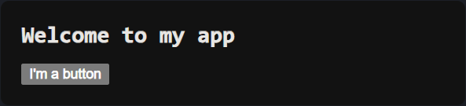

# 1.简单使用 React 组件

`React` 应用程序是由 **组件(返回标签的 JS 函数)** 组成的。一个组件是 `UI` 的一部分，它拥有自己的逻辑和外观。组件可以小到一个按钮，也可以大到整个页面。

```react
// 制作 MyButton 组件
function MyButton() {
    return (
        <button>
            I'm a button
        </button>
    );
}
```

至此，您已经声明了 `MyButton` 组件，现在可以把它嵌套到另一个组件中。

```react
// MyApp.js
// 制作 MyButton 组件
function MyButton() {
    return (
        <button>
            I'm a button
        </button>
    );
}

// 使用 MyButton 组件
export default function MyApp() {
    return (
        <div>
            <h1>Welcome to my app</h1>
            <MyButton />
        </div>
    );
}
```

组件我们有了，如何渲染呢？这些组件本质还是 `JS` 代码/库，因此可以借助 `HTML + CSS + 浏览器` 进行渲染。

```html
<!-- index.html -->
<!-- 准备一个带有 dir 的页面 -->
<!DOCTYPE html>
<html lang="en">
    <head>
        <meta charset="UTF-8">
        <meta name="viewport" content="width=device-width, initial-scale=1.0">
        <title>Document</title>
    </head>
    <body>
        <div id="root"></div>
    </body>
</html>
```

```cpp
/* styles.css */

* {
  box-sizing: border-box;
}

body {
  font-family: sans-serif;
  margin: 20px;
  padding: 0;
}

h1 {
  margin-top: 0;
  font-size: 22px;
}

h2 {
  margin-top: 0;
  font-size: 20px;
}

h3 {
  margin-top: 0;
  font-size: 18px;
}

h4 {
  margin-top: 0;
  font-size: 16px;
}

h5 {
  margin-top: 0;
  font-size: 14px;
}

h6 {
  margin-top: 0;
  font-size: 12px;
}

code {
  font-size: 1.2em;
}

ul {
  padding-inline-start: 20px;
}


```

然后，再结合一些必要的 `react` 配置。

```react
// index.js
import React, { StrictMode } from "react"; // 先不管这个, 导入 React 模块用的
import { createRoot } from "react-dom/client"; // 先不管这个, 导入 React DOM 模块用的
import "./styles.css"; // 先不管, 反正会自动根据 css 的文件内容来生成对应样式

import MyApp from "./MyApp";

const root = createRoot(document.getElementById("root"));
root.render(
  <StrictMode>
    <MyApp />
  </StrictMode>
);
```

渲染效果如下。



>   补充：在 `JS` 中 `export` 关键字用于导出模块的成员（变量、函数、类等），使其可以在其他文件中被导入和使用。这样做可以实现模块化开发，将代码分割成多个文件，提高代码的可维护性和复用性。
>
>   假设有名为 `math.js` 的模块，其中定义了一些数学函数：
>
>   ```javascript
>   // math.js
>   export function add(a, b) {
>       return a + b;
>   }
>   
>   export function subtract(a, b) {
>       return a - b;
>   }
>   ```
>
>   在另一个文件 `main.js` 中则可以使用 `import` 关键字来导入这些函数，并在该文件中使用它们：
>
>   ```javascript
>   // main.js
>   import { add, subtract } from './math.js';
>   
>   console.log(add(5, 3)); // 输出：8
>   console.log(subtract(5, 3)); // 输出：2
>   ```
>
>   在这个例子中，我们将 `add` 和 `subtract` 函数从 `math.js` 模块中导出，并在 `main.js` 中通过 `import` 关键字导入并使用了它们。这样做可以让我们在不同的文件中组织代码，提高了代码的可维护性和可读性。另外，这种导出也被称为命名导出。
>
>   `export default` 则是 `JS` 中用于导出默认成员的语法。默认导出意味着一个模块只能有一个默认导出，而且在导入时不需要使用花括号 `{}` 包裹，可以直接指定一个名称。
>
>   ```javascript
>   // greetings.js
>   const greeting = "Hello, ";
>   export default greeting;
>   ```
>
>   在这个示例中，`greetings.js` 模块默认导出了一个名为 `greeting` 的字符串。
>
>   在另一个文件 `main.js` 中则可以使用 `import` 关键字来导入默认导出的成员，而不需要使用花括号 `{}` 包裹：
>
>   ```javascript
>   // main.js
>   import greeting from './greetings.js';
>   
>   console.log(greeting + 'world'); // 输出：Hello, world
>   ```
>
>   一个模块只能有一个默认导出，并且可以与其他命名导出并存。当一个模块同时存在默认导出和命名导出时，可以同时使用 `export default` 和 `export` 关键字。
>
>   更详细的内容可以 [前往 MDN 查看什么是 export 和 import](https://developer.mozilla.org/zh-CN/docs/web/javascript/reference/statements/export)。

>   注意：`<MyButton />` 是以大写字母开头的，您可以据此识别 `React` 组件，`React` 组件必须以大写字母开头，而 `HTML` 标签则必须是小写字母。

>   吐槽：有点像 `HTML` 的标签/元素具有了类似函数的功能，而标签/元素的属性后面也可以作为函数的参数传递给组件...

# 2.HTML 转化为 JSX

上面所使用的标签语法被称为 `JSX`，它是可选的，但被大多数 `React` 项目所使用（主要是很方便）。需要注意的是 `JSX` 比 `HTML` 更加严格，必须使用闭合标签。

并且 `JSX` 返回多个组件时，不能返回多个 `JSX` 标签，如果需要也必须使用一个共享的父级（例如 `<>` 或 `<dir>`）来打包返回。

```javascript
// 使用空标签包裹
function AboutPage() {
  return (
    <>
      <h1>About</h1>
      <p>Hello there.<br />How do you do?</p>
    </>
  );
}
```

如果您有大量的 `HTML` 需要移植到 `JSX` 中，可以考虑[使用在线 HTML->JSX 转换器](https://transform.tools/html-to-jsx)。

```html
<!-- 转化之前 -->
<!-- Hello world -->
<div class="awesome" style="border: 1px solid red">
    <label for="name">Enter your name: </label>
    <input type="text" id="name" />
</div>
<p>Enter your HTML here</p>
```

```javascript
// 转化之后
<>
    {/* Hello world */}
	<div className="awesome" style={{ border: "1px solid red" }}>
    	<label htmlFor="name">Enter your name: </label>
		<input type="text" id="name" />
    </div>
	<p>Enter your HTML here</p>
</>
```

# 3.为组件添加样式

在 `React` 中可以使用 `className` 来指定一个 `CSS` 的 `class`。它与 `HTML` 的 [`class`](https://developer.mozilla.org/zh-CN/docs/Web/HTML/Global_attributes/class) 属性的工作方式相同：

```react

```

然后可以在一个单独的 `CSS` 文件中为它编写 `CSS` 规则：

```css
/* In your CSS */
.avatar {
    border-radius: 50%;
}
```

`React` 并没有规定如何添加 `CSS` 文件，最简单的方式是使用 `HTML` 的 `<link>` 标签。不过也可以在 `JS` 代码中使用 `import` 的形式。

# 4.显示 JS 对象

`JSX` 标签还可以把 `JS` 中的对象显示到 `HTML` 中，我们来尝试以下。首先准备好一个 `.html` 文件和一个 `.css` 文件。

```html
<!-- index.html -->
<!DOCTYPE html>
<html lang="en">
    <head>
        <meta charset="UTF-8">
        <meta name="viewport" content="width=device-width, initial-scale=1.0">
        <title>Document</title>
    </head>
    <body>
        <div id="root"></div>
    </body>
</html>
```

```css
/* styles.css */
* {
    box-sizing: border-box;
}

body {
    font-family: sans-serif;
    margin: 20px;
    padding: 0;
}

h1 {
    margin-top: 0;
    font-size: 22px;
}

h2 {
    margin-top: 0;
    font-size: 20px;
}

h3 {
    margin-top: 0;
    font-size: 18px;
}

h4 {
    margin-top: 0;
    font-size: 16px;
}

h5 {
    margin-top: 0;
    font-size: 14px;
}

h6 {
    margin-top: 0;
    font-size: 12px;
}

code {
    font-size: 1.2em;
}

.avatar {
    border-radius: 50%;
}

.large {
    border: 4px solid gold;
}
```

然后编写组件。

```javascript
// App.js
const user = { // 这里是需要显示到 HTML 页面上的数据
    name: 'Hedy Lamarr',
    imageUrl: 'https://i.imgur.com/yXOvdOSs.jpg',
    imageSize: 90,
};

export default function Profile() {
    return (
        <>
        <h1>{user.name}</h1>
        
        </>
    );
}
```

注意这里的 `style={{ width: user.imageSize, height: user.imageSize }}`，外层 `{}` 代表插入 `JS` 表达式，内层 `{}` 代表插入的 `css` 样式对象，也就是一个 `JS` 中的 `{}` 对象...

然后经过 `React` 的库来渲染。

```javascript
// index.js
import React, { StrictMode } from "react";
import { createRoot } from "react-dom/client";
import "./styles.css";

import App from "./App";

const root = createRoot(document.getElementById("root"));
root.render(
  <StrictMode>
    <App />
  </StrictMode>
);
```

>   补充：在这个例子中，`App` 是一个默认导出（`default export`），而不是命名导出（`named export`）。当您在模块中使用 `export default` 语法时，您可以使用任何名称来导入这个默认导出的模块，而不一定非要使用与导出名称相同的名称。
>
>   所以，无论你使用 `import Profile from "./App";` 还是 `import App from "./App";`，都是合法的。在这里，选择使用 `App` 来引入组件，可能是因为 `App` 通常被用作应用的入口文件的命名约定。

# 5.条件渲染和列表渲染

`React` 没有特殊的语法来编写条件语句，因此您可以使用普通的 `JS` 代码。例如使用 [`if`](https://developer.mozilla.org/zh-CN/docs/Web/JavaScript/Reference/Statements/if...else) 语句根据条件引入 `JSX`。

```javascript
// 条件渲染
let content;

if (isLoggedIn) {
    content = <AdminPanel />;
} else {
    content = <LoginForm />;
}

return (
    <div>
    {content}
    </div>
);
```

如果您喜欢更为紧凑的代码则可以使用条件运算符。与 `if` 不同的是，它工作于 `JSX` 内部。

```javascript
// 条件渲染
<div>
	{isLoggedIn ? (
		<AdminPanel />
	) : (
		<LoginForm />
	)}
</div>
```

当你不需要 `else` 分支时还可以使用逻辑语法.

```javascript
// 条件渲染
<div>
	{isLoggedIn && <AdminPanel />}
</div>
```

而列表渲染也可以依赖 `JS` 的特性，例如 `for` 循环和 `array` 的 `map()` 函数来渲染组件列表。假设有一个产品数组。在您的组件中，使用 `map()` 函数将这个数组转换为 `<li>` 标签构成的列表。

```javascript
// 列表渲染
const products = [
    { title: 'Cabbage', isFruit: false, id: 1 },
    { title: 'Garlic', isFruit: false, id: 2 },
    { title: 'Apple', isFruit: true, id: 3 },
];

export default function ShoppingList() {
    const listItems = products.map(product =>
        <li key={product.id}
            style={{
                color: product.isFruit ? 'magenta' : 'darkgreen'
            }}>
            {product.title}
        </li>
    );

    return (
        <ul>{listItems}</ul>
    );
}
```

>   补充：您可以[前往 MDN 查看 map()](https://developer.mozilla.org/zh-CN/docs/Web/JavaScript/Reference/Global_Objects/Array/map)...

# 6.响应事件

# 7.更新界面

# 8.使用 Hook

# 9.组件间共享数据

# 10.React 和 Jinja2 的区别

虽然 `React` 和 `Jinja2` 都用于构建 `Web` 应用，但它们的角色和工作方式有很大的不同。`React` 主要负责客户端渲染，而 `Jinja2` 则主要用于服务器端渲染。通常您可以将 `React` 用于构建前端界面，而使用 `Jinja2` 用于渲染页面的框架，比如 `Flask` 或 `Django`。