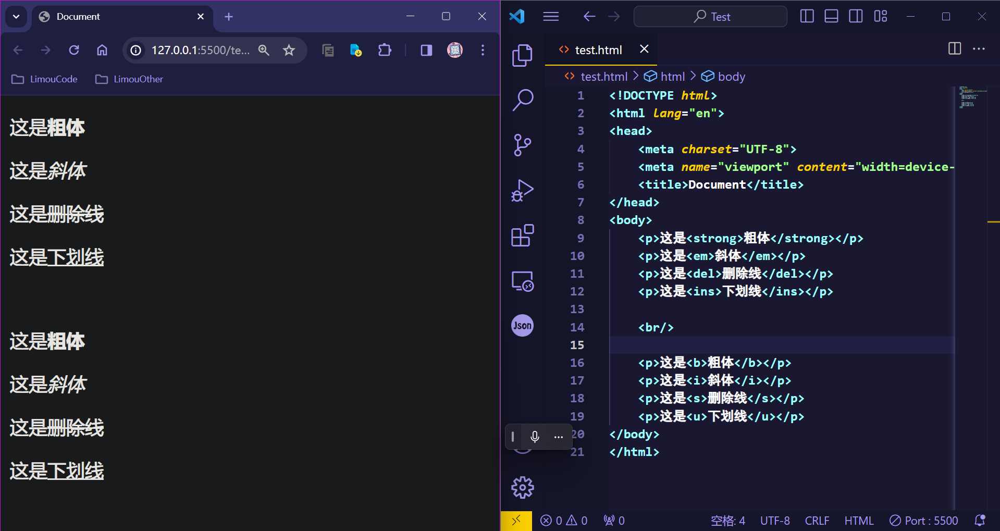

1.HTML 基础
=======

就其核心而言，[HTML](https://developer.mozilla.org/zh-CN/docs/Glossary/HTML) 是一种相当简单的、由不同 [元素](https://developer.mozilla.org/zh-CN/docs/Glossary/Element) 组成的标记语言，它可以被应用于文本片段：

1. 使文本在文档中具有不同的含义（它是段落吗？它是项目列表吗？它是表格吗？）

2. 将文档结构化为逻辑块（文档是否有头部？有三列内容？有一个导航菜单？）

3. 可以将图片，影像等内容嵌入到页面中（文本是否表示图片？还是视频？）

`HTML` 最重要的作用，就是让普通的文本具有“语义”（也就是“超文本标记”），可以根据不同的语义显示出不同的效果。

# 2.HTML 环境

`HTML` 需要依赖浏览器来实现显示相关的元素和文本，这里我推荐使用 `Chrome` 浏览器（当然使用 `Edge` 浏览器也可以），开发环境推荐使用 `VSCode`（实际上使用电脑自带的记事本也是可以的，例如 `Windows` 下的“记事本”），下面我会推荐几个 `VSCode` 里关于 `HTML` 的插件，帮助您更好进行开发。

1.   [Chrome 下载地址](https://www.google.cn/chrome/index.html)
2.   [VSCode 下载地址](https://code.visualstudio.com/)

# 3.HTML 使用

首先我来见见一个标准的 `HTML` 页面结构，在 `VSCode` 种，输入英文输入法的感叹号，然后按下键盘上的 `[Tab]` 即可快速得到一个 `HTML` 模板。


```html
<!-- HTML 标准模板 -->
<!DOCTYPE html> <!-- 指定 HTML 的版本，了解一下就行 -->
<html lang="en">
<head>
    <meta charset="UTF-8"> <!-- 规定使用的字符集 -->
    <meta name="viewport" content="width=device-width, initial-scale=1.0">
    <title>Document</title> <!-- 规定网页的标题 -->
</head>
<body>
    <!-- 其他主要的标签 -->
</body>
</html>
```

在 [开始学习 HTML](https://developer.mozilla.org/zh-CN/docs/Learn/HTML/Introduction_to_HTML/Getting_started) 这份文档里，涵盖了 `HTML` 基础知识，以帮助你入门“定义元素”、“属性”等重要术语并且解释了一些重要的基本语言特征。

简单来说 `HTML` 是使用标签来构成的，所有标签的结构类似一颗树结构（也叫“ `DOM` 树”，全称为 `Document Object Model`，即“文档对象模型”）。


-   `<!DOCTYPE html>`：用于指定 `HTML` 的版本（在 `2022` 年的时候，几乎所有的网页标准都是 `HTML5`），了解一下就行

-   `<html></html>`：根标签，也就是“文件根目录”，可以设置 `lang` 属性，也就是告诉浏览器这个网页使用的主要语言（`chrome` 浏览器可以根据这点自动弹出“是否翻译此页面”的提示） 

    

-   `<head></head>`：文档属性标签，被 `<head></head>` 框起的文本部分是不会被显示在浏览器中的，它包含了许多信息，例如网页的标题 [`<title</title>`](https://developer.mozilla.org/zh-CN/docs/Web/HTML/Element/title)，指向 `CSS` 文件的链接等等，实际上就是存放一些和页面相关的属性设置和文件说明

-   `<meta>`：`HTML` 语言 `head` 区的一个辅助性标签，位于文档的头部，不包含任何内容（也就是所谓的“空元素”，空元素就是只会以 `<标签>` 这种形式出现，而不会以 `<标签></标签>` 的形式出现的标签元素）。可提供相关页面的元信息，声明网页使用的字符集、作者、日期和时间、网页描述、关键词、页面刷新...下面介绍几个常见的属性

    (1)`charset`：指出浏览器对 `HTML` 的解码规则，如果我们的 `HTML` 文件使用的编码和解码规则不对应，就会导致乱码问题

    (2)`http-equiv`、`content`：通常会出现这样的设置 `<http-equiv="X-UA-Compatible" content="IE=edge">`，代表 `IE` 浏览器的渲染效果按照 `IE` 浏览器的最高版本展示，简单了解一下

    (3)`name`、`content`：会出现类似 `<meta name="viewport" content="width=device-width, initial-scale=1.0">` 这样的设置，这是为了让网页也适应手机端的设置，了解一下即可

-   `<title></title>`：就是页面的标题，标签内部填写的内容会显示到浏览器的标签页上

-   `<body></body>`：就是网页的主题部分，这个标签内部包含的大部分都是在浏览器上可以被显示出来的内容（例如文本、图片、视频、甚至是 `pdf`、可以点击的按钮、可输入文本框...）我们后面会介绍这里填写的标签有哪些...

因此根据现成的 `DOM` 树，程序员就可以依赖某些编程语言对该树进行增删查改，达到操控网页的目的。

>   注意：在 `HTML` 语法里，有时候标签和元素会混合使用，两者几乎是等价的。

下面我们来介绍一些写在 `<body></body>` 里的常见标签元素。

## 3.1.注释标签

`HTML` 使用 `<!-- 一些注释... -->` 来注释，在浏览器中不可见（对普通用户不可见），但是在调试工具中可见（对开发人员可见）

## 3.2.文本标签

### 3.2.1.标题标签

根据文本的分级，可以写出六个级别的标题标签 `<h1~h6></h1~/h6>` 在浏览器中体现为文字的大小变化。

```html
<!-- 使用标题标签 -->
<!DOCTYPE html>
<html lang="en">
<head>
    <meta charset="UTF-8">
    <meta name="viewport" content="width=device-width, initial-scale=1.0">
    <title>Document</title>
</head>
<body>
    <h1>标题 1</h1>
    <h2>标题 2</h2>
    <h3>标题 3</h3>
    <h4>标题 4</h4>
    <h5>标题 5</h5>
    <h6>标题 6</h6>
</body>
</html>
```


设置标题是很重要的，有可能会影响搜索引擎对该网页的检索（这些我们以后再提），您需要知道一个警告，一个页面最好是只有一个 `<h1></h1>` 标签，这个级别的标题标签优先级很高。

### 3.1.2.段落标签

使用 `<p></p>` 可以在网页上显示一段文本，需要注意的是，在代码中使用一个或多个换号会被浏览器当作空格处理。

```html
<!-- 使用段落标签 -->
<!-- 使用标题标签 -->
<!DOCTYPE html>
<html lang="en">
<head>
    <meta charset="UTF-8">
    <meta name="viewport" content="width=device-width, initial-scale=1.0">
    <title>Document</title>
</head>
<body>
    <p>这是一段文本</p>
    <p>这是一
        
        
        段文本</p>
</body>
</html>
```


### 3.1.3.换号标签

如果需要换号，就需要使用换号标签 `<br/>`，这样解析到浏览器中才会产生实际的换号。

```html
<!-- 使用换号标签 -->
<!DOCTYPE html>
<html lang="en">
<head>
    <meta charset="UTF-8">
    <meta name="viewport" content="width=device-width, initial-scale=1.0">
    <title>Document</title>
</head>
<body>
    <p>这是一段文本</p>
    <p>这是一<br/>
        <br/>
        <br/>
        段文本</p>
</body>
</html>
```


>   注意：有的时候使用 `<br>`，也就是末尾不加 `/` 的情况下，也可以达到换号的效果，但是最好不要这么做，因为这不够规范...

### 3.1.4.格式标签

实际上格式化标签用的在后面会用得比较少，会使用 `CSS` 来实现，只有一些简单的 `HTML` 页面才会直接使用格式化标签，这里您简单理解一些即可。

1.   `<strong></strong>`、`<b></b>`：对字体加粗
2.   `<em></em>`、`<i></i>`：对字体倾斜
3.   `<del></del>`、`<s></s>`：对字体加删除线
4.   `<ins></ins>`、`<u></u>`：对字体加下划线

```html
<!-- 格式化文字示例 -->
<!DOCTYPE html>
<html lang="en">
<head>
    <meta charset="UTF-8">
    <meta name="viewport" content="width=device-width, initial-scale=1.0">
    <title>Document</title>
</head>
<body>
    <p>这是<strong>粗体</strong></p>
    <p>这是<em>斜体</em></p>
    <p>这是<del>删除线</del></p>
    <p>这是<ins>下划线</ins></p>

    <br/>
    
    <p>这是<b>粗体</b></p>
    <p>这是<i>斜体</i></p>
    <p>这是<s>删除线</s></p>
    <p>这是<u>下划线</u></p>
</body>
</html>
```



`<link>`

## 3.4.创建图片


# 4.HTML 插件

这里推荐一些 `VSCode` 的插件，可以帮助您提高效率。

## 4.1.Auto Rename Tag

`Auto Rename Tag` 这是一个可以让标签自动同步更新的插件，可以减少一些标签不对应导致的 `bug`


## 4.2.view-in-browser

使用插件 `view-in-browser` 可以右键快捷打开浏览器进行 `HTML` 解析。


>   注意：修改完 `HTML` 代码后，就需要保持一次文件（`VsCode` 的保持文件快捷键为 `[ctrl+s]`），再用浏览器打开，否则没有办法查看到页面被修改后的样子。


## 4.3.Live Server

虽然可以快捷打开浏览器了，但是每次修改代码都需要更新浏览器，浏览器才会重新显示修改后的内容...


而插件 `Live Server` 则在保持文件后，实时刷新浏览器，让浏览器显示被修改后的 `html` 内容。


# 5.HTML 调试

光是编写 `HTML` 还好，但如果出了什么问题，而找不到问题的来源怎么办？

1.   正确使用标签：这样才能将文本块分解为树结构的标题、段落、强调、加粗单词、创建列表以及其他内容，进而动态的操控网页。这貌似是废话？不，实际上有相当多标签被误用，或者混用的例子，尽管有些时候它们在浏览器上的最终显示效果差不多...但是我依旧需要警告您：正确使用标签，尽量别混用
2.   一些检测网站：这里提供一个网站 [Markup Validation Service](https://validator.w3.org/)（该网站由 `W3C`（制定 `HTML`、`CSS` 和其他网络技术标准的组织）创立并维护的标记验证服务），把一个 `HTML` 文档加载到该网页并运行，网页就会返回一个错误报告，您可以尝试写一个脚本代码，让您的 `HTML` 可以被复制到该网站，并且返回检查报告
3.   使用浏览器调试： `chrome` 浏览器除了显示 `HTML` 的结果，也可以用来调试 `HTML` 代码

这里着重介绍关于 `chrome` 的使用技巧，首先这是一份 [关于 chrome 基本使用](https://www.google.com/intl/zh-CN/chrome/browser-features/#google-search-bar) 的文档，没有涉及到调试方面 ，在调试之前，您需要了解这个浏览器一些基本的使用。

接下来打开一个 `HTML` 代码，使用快捷键 `[F12]` 来打开对应的开发者调试界面：


调试窗口会显示出页面背后的 `HTML` 的代码，并且还可以调查其他的信息，这里提供一份关于 [谷歌开发者工具的文档](https://developer.chrome.com/docs/devtools/overview?hl=zh-cn)，里面有关于该调试器的使用说明，您可以先存着，然后先看我下面写的这些常见技巧和说明...

1.   若一个标签元素被代码缩略时，右边会显示类似 `==$[数组]` 的东西，这代表该标签元素及内部元素在网页中占有的像素大小
2.   使用快捷键 `[ctrl+f]` 就会出现一个文本框，可以在该文本框内搜索想要查询的标签元素或者其他文本
