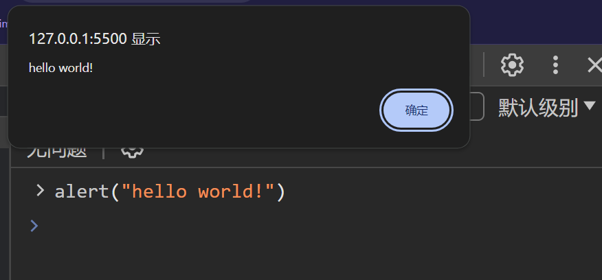

>   前腰：本文只是概括重要的 `CSS` 的较为重要的内容，详细的您可以跳转 [Mmdn](https://developer.mozilla.org/zh-CN/docs/Glossary/HTML) 进行深入的学习。

# 1.JS 概念

## 1.JS 历史

- `JavaScript` 最早由 `Netscape` 公司的 `Brendan Eich` 设计和开发，在 `1995` 年 `Netscape Navigator 2.0` 发布时首次引入。
- `1997` 年，`ECMAScript` 第一版发布，成为 `JavaScript` 的规范标准，定义了语言的核心特性和语法规则。
- 后续的版本更新包括 `ECMAScript 3`（`1999` 年）、`ECMAScript 5`（`2009` 年）、`ECMAScript 6`（`2015` 年，也称为 `ECMAScript 2015` 或 `ES6`）等，每个版本都增加了新的特性和改进。
- 随着时间的推移，`JavaScript` 在浏览器端和服务器端的应用范围不断扩大，成为 `Web` 开发的重要组成部分之一。

总的来说，`JavaScript` 在 `Web` 开发、移动应用开发、服务器端开发等方面有着广泛的应用，并且在不断发展和演进中。

## 2.JS 作用

1. **网页交互性：** `JavaScript` 最初设计是为了增强网页的交互性。它可以通过 DOM（文档对象模型）操作网页的结构、样式和内容，从而实现动态的用户界面和用户交互效果。

2. **浏览器扩展：** `JavaScript` 可以用于开发浏览器扩展和插件，增强浏览器的功能和性能，比如广告拦截器、密码管理器等。

3. **服务器端开发：** `Node.js` 是基于 `JavaScript` 的服务器端运行环境，使得 `JavaScript` 可以用于开发服务器端应用程序，如 `Web` 服务器、`RESTful API`、实时应用等。

4. **移动应用开发：** 使用框架如 `React Native` 或 `Ionic`，开发者可以使用 `JavaScript` 来构建原生移动应用，同时充分利用 `Web` 开发技术和工具。

5. **数据交互：** `JavaScript` 可以通过 `AJAX` 技术与服务器进行异步数据交互，实现页面无需刷新的动态更新。

6. **动画和游戏开发：** 利用 `HTML5` 的 `Canvas` 和 `SVG`，结合 `JavaScript`，开发者可以创建丰富的动画效果和游戏。

7. **跨平台开发：** 使用框架如 `Electron` 或 `NW.js`，可以将 `JavaScript` 应用打包成桌面应用程序，支持多个操作系统。

8. **机器学习和数据分析：** `JavaScript` 的库和框架（如 `TensorFlow.js`）使得开发者可以在浏览器中进行机器学习和数据分析任务。

# 2.JS 环境

在 `JS` 的视角下，浏览器可以看作 `渲染引擎 + JS引擎`，其中 `JS引擎` 就是 `JS` 解释器，该解释器会把 `JS` 代码解释为二进制内容，因此 `JS` 一般是运行在浏览器上的脚本。

`JS` 一般由以下部分构成：


# 3.JS 使用

## 3.1.引入 JS

和 `CSS` 类似，`JS` 也有三种引入方式。

### 3.1.1.行内 JS

```html
<!-- 行内 JS -->
<!DOCTYPE html>
<html lang="en">
    <head>
        <meta charset="UTF-8">
        <title>行内式 JavaScript 示例</title>
    </head>
    <body>
        <button onclick="alert('Hello, World!')">点击我弹出提示框</button>

    </body>
</html>
```

### 3.1.2.内部 JS

直接写到 `html` 的 `<script>` 内。

```html
<!-- 内部 JS -->
<!DOCTYPE html>
<html lang="en">
    <head>
        <meta charset="UTF-8">
        <title>行内式 JavaScript 示例</title>
    </head>
    <body>
        <button onclick="changeColor()">点击我改变颜色</button>
        <script>
            // 行内式 JavaScript
            function changeColor() {
                // 获取按钮元素
                var button = document.querySelector('button');

                // 生成随机颜色
                var randomColor = '#' + Math.floor(Math.random()*16777215).toString(16);

                // 修改按钮的背景颜色
                button.style.backgroundColor = randomColor;
            }
        </script>
    </body>
</html>
```

### 3.1.3.外部 JS

```html
<!-- 外部 JS -->
<script src=".js文件路径"></script>
```

可以在 `<script>` 中添加 `defer` 或 `async` 属性来控制脚本的加载和执行时机。

*   `defer`：延迟加载，在 `HTML` 解析完成后再执行脚本
*   `async`：异步加载，在下载完成后立即执行脚本，不影响 `HTML` 解析

## 3.2.ES 语法

由于我们暂时只是学习基本语法，因此基本是在浏览器上的控制台进行编程，一是为了熟悉这一测试工具，二是方便您即时操作。唯一需要您注意的是，代码换行需要使用 `[shift+enter]` 来换行，如果直接在控制台中换行就会立刻执行 `JS` 语句。

### 3.2.1.Hello World 程序

我们首先来尝试写一个 `JS` 版本的 `hello world`。

首先，创建一个名为 `hello_world.js` 的 `JavaScript` 文件，并将以下代码写入该文件：

```javascript
// hello_world.js
// 在控制台打印 "Hello, World!"
console.log("Hello, World!");
```

然后，在您的 HTML 文件中引入这个 JavaScript 文件，并在页面加载时执行它。例如：

```html
<!DOCTYPE html>
<html lang="en">
<head>
    <meta charset="UTF-8">
    <title>Hello World</title>
</head>
<body>
    <!-- 引入外部 JavaScript 文件 -->
    <script src="hello-world.js"></script>
</body>
</html>
```

当您打开包含这个 `HTML` 文件的浏览器时，浏览器会加载并执行 `hello_world.js` 文件，并在控制台中输出 `"Hello, World!"`。

要查看控制台输出，您可以在浏览器中打开开发者工具（通常是按 `F12` 键），然后切换到 `"Console"` 标签页。您将看到 `"Hello, World!"` 字样输出在控制台中。

这个示例展示了如何使用外部 `JavaScript` 文件编写一个简单的 `hello world` 程序，并在浏览器中查看输出结果。


当然，还有其他方式，这种只是在控制台发送文本，也可以直接在控制台编写 `JS` 代码，操控浏览器显示弹框。




您大概也意识到了，第一种方式实际上从函数名 `console.log()` 上来看理应是一种打印日志的方式，而第二种 `alert()` 实际上就是使用命令行来操控浏览器的一种方式（这意味着我们可以直接在控制台中进行 `JS` 编程）。

### 3.2.2.创建变量

`JS` 变量直接使用关键字 `var` 即可创建，还可以使用 `let` 关键字来定义一个变量（一般使用 `let`），这两种有什么区别呢？

`let` 是后来者，避免了 `var` 的一些缺陷（使用 `let` 是变量的生命周期后作用域和 `java` 基本类似）。


另外，一门语言如果对不同类型的变量之间进行赋值需要强制类型转化等操作，则称为“强类型”，而如果无需顾及直接转化就叫做“弱类型”。

而如果一个变量从定义开始类型就被固定时，就叫“静态类型”，而根据运行逻辑时刻改变类型的就叫“动态类型”。

由此可见 `JS` 是“弱类型、动态类型”的“脚本”语言。


在 `JS` 中，主要类型有以下几种：

1.  **数字 (Number)：**表示数值，包括整数和浮点数。例如：`10`, `3.14`, `-5`

    另外 `0bdd`、`dd`、`0dd`、`0xdd` 分别表示二进制、十进制、八进制、十六进制。

    而 `JS` 还有表示无穷大 `Infinity` 、无穷小 `-Infinity` 的特殊值。

    还有 `NaN` 表示非数字值。

2.  **字符串 (String)：**表示文本数据，用单引号 `' '` 或双引号 `" "` 包裹起来。例如：`'Hello'`, `"JavaScript"`。在字符串类型中，也有类似 `C` 语言的转义字符规则，也是为了避免冲突的问题。

    

    

3.  **布尔值 (Boolean)：**表示逻辑值，只有两个值`true` 和 `false`，用于条件判断和逻辑运算。如果布尔值参与了运算，就会把 `true/flase` 当作 `1/0` 来计算，但是这样做的场景很少，也应该尽量避免这种场景。

4.  **未定义 (Undefined)：**表示变量已声明但未赋值，只有一个值 `undefined` 或者访问不存在的属性或变量时返回的值。但是有些比较神奇的是，如果该类型和字符类型拼接也会拼接成一个新字符串。如果和一个数字类型（或者布尔类型）相加，就会得到数字类型中的 `NaN`。

    

5.  **空值 (Null)：**表示空值或无值，用关键字 `null` 表示。

    

6.  **Object 对象**：是所有对象的基类，其他所有对象都继承自 `Object` 对象

7.  **符号 (Symbol)：**`ES6` 引入的新类型，表示唯一的标识符，通常用于对象属性的键值。

### 3.2.3.运算符

有了变量类型定义变量，运算基本和 `Java` 类似，唯一不太一样的在于比较运算符。

-   `==、!=`：比较时会进行隐式类型转化
-   `===、!==`：比较时不会进行隐式类型转化

### 3.2.4.控制语句

这些您看看就知道了，不困难。


还有 `switch` 语句，都很经典。


也可以编写循环语句，和 `C` 语言也是类似，并且我们结合调试来运行一个循环代码。


值得注意的是 `for()` 中如果显示定义 `let i` 就会使 `i` 称为局部变量，而不加就会变成全局变量。并且也有 `while()` 循环语句、`break`、`continue`。

>   补充：如果是 `chrome` 浏览器，按 `[esc]` 就可以弹出控制台。

### 3.2.5.字符串处理

*   `charAt(index)`: 返回指定索引位置的字符。
*   `concat(str1, str2, ...)`：连接两个或多个字符串。
*   `indexOf(searchValue, startIndex)`: 返回指定值在字符串中首次出现的位置。
*   `slice(startIndex, endIndex)`: 提取字符串的一部分。
*   `split(separator, limit)`: 将字符串分割为子字符串数组。
*   `toUpperCase()`: 将字符串转换为大写。
*   `toLowerCase()`: 将字符串转换为小写。
*   `trim()`: 去除字符串两端的空白字符。

### 3.2.6.数组处理函数

*   `new Array(size)`：创建一个大小为 `size` 的数组（初始值为空），需要注意 `JS` 的数组是忽略类型的，可以放入多种类型的元素。还有一种创建方法，直接使用 `[]` 来创建。元素索引也是从 `0` 开始，这点和很多语言都一样。创建出来的数组可以使用 `length` 属性进行修改

*   `push(element1, element2, ...)`：向数组末尾添加一个或多个元素。

*   `pop()`: 移除并返回数组的最后一个元素。

*   `shift()`: 移除并返回数组的第一个元素。

*   `splice(start, number_of_values)`: 删除数组中从 `start` 下标开始的 `number_of_values` 个元素

*   `unshift(element1, element2, ...)`：向数组开头添加一个或多个元素。

*   `join(separator)`: 将数组元素连接成一个字符串，使用指定的分隔符。

*   `concat(array1, array2, ...)`：连接两个或多个数组。

*   `slice(startIndex, endIndex)`: 提取数组的一部分。

*   `indexOf(searchElement, startIndex)`: 返回指定元素在数组中首次出现的位置。

*   `includes(element, startIndex)`: 判断数组是否包含指定元素。

*   `sort(compareFunction)`: 对数组元素进行排序，后面可以加上类似回调函数的参数，后续会接受 `=>` 语法糖制作的回调函数

*   `reverse()`: 反转数组元素的顺序。

    >   补充：另外，如果索引越界的话，`JS` 不会报错，而是返回一个 `undefined` 值。并且不要直接给数组名赋值，否者数组就会被清空，这是因为 `JS` 是动态类型的。

### 3.2.7.IO 函数

(1)**输入函数**：

- `prompt(message, defaultValue)`: 在浏览器中弹出一个对话框，提示用户输入信息，并返回用户输入的字符串。可以指定一个默认值。
- `confirm(message)`: 在浏览器中弹出一个确认对话框，提示用户确认或取消操作，并返回一个布尔值（true 表示确认，false 表示取消）。
- `alert(message)`: 在浏览器中弹出一个警告对话框，显示指定的消息。

(2)**输出函数**：

- `console.log(value1, value2, ...)`: 在浏览器的控制台输出一条消息，可以输出多个值。

- `console.warn(value)`: 在控制台输出警告消息，通常用于提示开发者注意。

- `console.error(value)`: 在控制台输出错误消息，用于指示出现的错误。

- `document.write(content)`: 将指定的内容写入到 `HTML` 文档中，可以在页面加载时直接显示内容。

    >   注意：`document.write()` 在实际开发中不常用，因为会直接修改 `HTML` 文档导致不可预料的结果和性能问题，推荐使用 `DOM` 操作来动态更新页面内容。

### 3.2.8.数学函数

*   `Math.abs(x)`: 返回数的绝对值。
*   `Math.ceil(x)`: 返回大于或等于给定数字的最小整数。
*   `Math.floor(x)`: 返回小于或等于给定数字的最大整数。
*   `Math.round(x)`: 返回最接近给定数字的整数。
*   `Math.max(num1, num2, ...)`：返回一组数中的最大值。
*   `Math.min(num1, num2, ...)`：返回一组数中的最小值。
*   `Math.random()`: 返回一个介于 0（包括）到 1（不包括）之间的随机数。

### 3.2.9.时间函数

*   `new Date()`: 创建一个表示当前时间的 Date 对象。
*   `getFullYear()`: 获取年份。
*   `getMonth()`: 获取月份（0-11）。
*   `getDate()`: 获取月份中的某一天（1-31）。
*   `getDay()`: 获取星期几（0-6，0 表示星期日）。
*   `getHours()`: 获取小时数（0-23）。
*   `getMinutes()`: 获取分钟数（0-59）。
*   `getSeconds()`: 获取秒数（0-59）。
*   `getTime()`: 获取时间戳。
*   `toISOString()`: 将日期对象转换为 `ISO` 格式的字符串。

### 3.2.10.定义函数

`JS` 的函数直接使用 `function` 关键字来声明，有如下格式：

```js
//JS 函数声明格式
function 函数名(形参列表) {
    函数体;
    return 返回值; //是否需要写返回值根据需要
}
```

`JS` 的函数参数不一定需要完全匹配才能调用，会尽可能进行匹配，但是最好还是完全匹配为好。

函数还可以作为匿名函数存在，也叫做函数表达式，匿名函数本身也可以用一个变量存储，调用变量就是在调用匿名函数。

因此也可以作为其他函数的返回值或参数。

```js
//函数表达式
let result = function () {
    console.log(arguments)
    ret = 0;
    for (i = 0; i <= 100; i++)
        ret += 1;
    return ret;
}

console.log(result(1, 2, 3));
```


### 3.2.11.作用域

在 `ES6` 标准之前，作用域主要分为两个：

-   全局作用域：在函数外定义，整个 `<script>` 或 `.js` 文件中都可以生效
-   局部作用域：在函数内定义，只在函数内部生效

>   注意：如果一个变量既不使用 `let` 也不使用 `var` 定义，就会是一个全局变量，否则就是一个局部变量。

`JS` 还有一个很神奇的地方，函数可以定义在另外一个函数的内部，内函数可以访问外函数的变量，采取链式查找的方式从内到外依次进行查找。

```js
//JS 函数嵌套定义
let num = 1;
console.log(num);
function test1() {
    let num = 2;
    console.log(num);
    function test2() {
        let num = 3;
        console.log(num);
    }
    test2();
}
test1();
```


在 `JS` 的 `ES6` 之前没有 `class` 的概念，但是依旧可以使用 `{}` 来创建对象，在 `ES6` 后可以使用 `Object` 和 `class`。

```js
//创建单对象（第一种）
let student = {
    name: 'limou',
    height: '164',
    weight: '104',
    say_hello: function () {
        console.log('hello');
    }
}

console.log(student.name)
console.log(student['height'], student['weight'])
student.say_hello(); //注意加上括号
```

```js
//创建单对象（第二种）
let student = new Object();
student.name = 'limou',
student.height = '164',
student.weight = '104',
student.say_hello = function () {
    console.log('hello');
}

console.log(student.name)
console.log(student['height'], student['weight'])
student.say_hello(); //注意加上括号
```

```cpp
//构造函数构造多对象
function People(name, height, weight) {
    this.name = name;
    this.height = height;
    this.weight = weight;
    this.say_hello = function () {
        console.log('hello');
    }
}

let p1 = new People('limou', 164, 104);
console.log(p1.name)
console.log(p1['height'], p1['weight'])
p1.say_hello();

let p2 = new People('dimou', 154, 98);
console.log(p2.name)
console.log(p2['height'], p2['weight'])
p2.say_hello();
```

`JS` 对象不区分属性和方法，两者的使用几乎是等价的。`JS` 对象没有 `private/public` 和继承（但是有类似的“原型”）。


# 4.JS 插件


# 5.JS 调试

`JS` 代码在浏览器中可以进行调试，这在之前就介绍过了。
