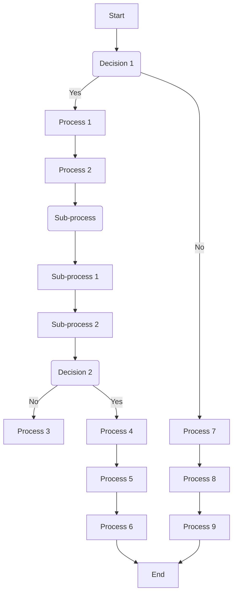

你好


```mermaid
flowchart TD
    A[Start] --> B(Decision 1)
    B -- Yes --> C[Process 1]
    C --> D[Process 2]
    D --> E(Sub-process)
    E --> F[Sub-process 1]
    F --> G[Sub-process 2]
    G --> H(Decision 2)
    H -- No --> I[Process 3]
    H -- Yes --> J[Process 4]
    J --> K[Process 5]
    K --> L[Process 6]
    L --> M[End]

    B -- No --> N[Process 7]
    N --> O[Process 8]
    O --> P[Process 9]
    P --> M

```

```cpp
int main()
{
    std::cout << "hello" << std::endl;
    return 0;
}
```

