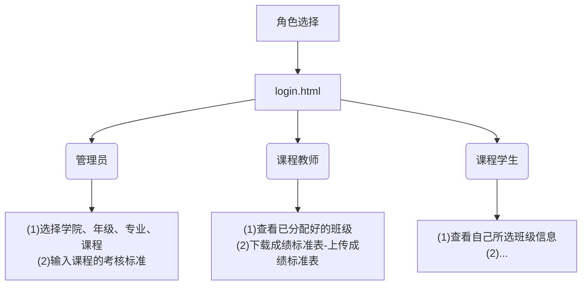

```mermaid
flowchart TD
role["角色选择"] --> login["login.html"] --> root("管理员") & teacher("课程教师") & student("课程学生")
root --> root_console["(1)选择学院、年级、专业、课程\n(2)输入课程的考核标准\n"]
teacher --> teacher_console["(1)查看已分配好的班级\n(2)下载成绩标准表-上传成绩标准表"]
student --> student_console["(1)查看自己所选班级信息\n(2)..."]
```

